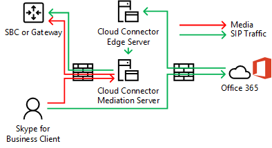

# Planification de la déviation du trafic multimédia dans la version Cloud ConnectorPlan for media bypass in Cloud Connector Edition
 
Consultez cette rubrique pour consulter les facteurs de planification pour implémenter la déviation du trafic multimédia avec les versions 2.0 et suivantes de Cloud Connector.Read this topic to review planning considerations for implementing media bypass with Cloud Connector Edition version 2.0 and later. Pour plus d’informations sur le déploiement de médias contournement de média, voir [déployer le contournement de média dans le nuage connecteur Edition](deploy-media-bypass-in-cloud-connector.md).For information about deploying media bypass, see [Deploy media bypass in Cloud Connector Edition](deploy-media-bypass-in-cloud-connector.md).
  
Le contournement de média permet au client d’envoyer des données multimédia directement au saut suivant Public réseau de téléphonique commuté (RTC) — une passerelle ou un contrôleur de Session en périphérie (SBC) — et d’éliminer le composant nuage connecteur Edition à partir du chemin d’accès des médias.Media bypass allows a client to send media directly to the Public Switched Telephone Network (PSTN) next hop—a gateway or Session Border Controller (SBC)—and eliminate the Cloud Connector Edition component from the media path.
  
La déviation du trafic multimédia peut améliorer la qualité de la voix en diminuant la latence, la perte de paquets possible et le nombre de points de défaillance éventuels.Media bypass can improve voice quality by reducing latency, the possibility of packet loss, and the number of points of potential failure. Élimination des médias de traitement pour les appels ignorés réduit la charge sur le nuage connecteur, ce qui permet à un nombre d’appels simultanés, et permettre améliorer l’extensibilité.Elimination of media processing for bypassed calls reduces the load on Cloud Connector, which enables a higher number of concurrent calls, and can improve scalability. 
  
 Libération nuage connecteur à partir des tâches de traitement multimédia peut réduire le nombre d’appareils de nuage connecteur qu'une infrastructure nécessite, afin que vous devez activer le contournement de média autant que possible.Freeing Cloud Connector from media processing tasks may reduce the number of Cloud Connector appliances an infrastructure requires, so you should enable media bypass whenever possible.
  
## Comment la déviation du trafic multimédia influe sur les médias et les voies de signalisationHow media bypass affects media and signaling pathways

Bien que la signalisation prenne le même chemin avec ou sans la déviation du trafic multimédia, le trafic multimédia diffère. Les schémas suivants montrent des médias et des voies de signalisation dans des topologies avec et sans déviation du trafic multimédia. While signaling takes the same path with or without media bypass, the media flow will differ. The following diagrams show media and signaling pathways in topologies with and without media bypass. 
  
Par exemple, dans la topologie suivante : qui n’ignore pas les médias utilisent — une Skype pour Business client effectue un appel PSTN vers un numéro externe, la signalisation SIP accède à Office 365 et Office 365 puis la dirige le trafic de signalisation en fonction de la voix de l’utilisateur final stratégie.For example, in the following topology—which does not employ media bypass—a Skype for Business client places a PSTN call to an external number, the SIP signaling goes to Office 365, and Office 365 then directs the signaling traffic according to the end-user voice policy. Pour les utilisateurs de nuage connecteur, la stratégie de voix dirige le trafic de signalisation pour le serveur Edge sur le nuage connecteur, puis achemine le trafic de signalisation à un contrôleur de frontière de Session RTC (SBC) ou une passerelle via le serveur de médiation dans le nuage connecteur.For Cloud Connector users, the voice policy directs signaling traffic to the Cloud Connector Edge Server, which then routes the signaling traffic to a PSTN Session Border Controller (SBC) or gateway via the Cloud Connector Mediation Server. Multimédia s’enchaîne de la Skype pour client d’entreprise pour le serveur de médiation dans le nuage connecteur, puis vers le contrôleur SBC ou passerelle, comme indiqué dans le diagramme suivant :Media flows from the Skype for Business client to the Cloud Connector Mediation Server, and then to the SBC or gateway, as shown in the following diagram:
  
**Médias et voies de signalisation sans déviation du trafic multimédia****Media and signaling pathways without media bypass**

  
Un appel entrant du PSTN utilise le même chemin de signalisation en sens inverse.An inbound call from the PSTN uses the same signaling path in the reverse direction. Pour les utilisateurs internes, seront toujours finalement flux des médias entre le Skype pour client d’entreprise et le serveur de médiation dans le nuage connecteur puis le contrôleur SBC ou passerelle.For internal users, media will still ultimately flow between the Skype for Business client and the Cloud Connector Mediation Server and then the SBC or gateway.
  
Dans la topologie suivante : qui utilisent le contournement de média : signalisation prend le même chemin d’accès, mais les données multimédias transitent directement entre le Skype pour client d’entreprise et SBC ou passerelle, comme illustré dans le diagramme suivant :In the next topology—which does employ media bypass—signaling takes the same path, but media flows directly between the Skype for Business client and the SBC or gateway, as shown in the following diagram:
  
**Médias et voies de signalisation avec déviation du trafic multimédia****Media and signaling pathways with media bypass**

  
## Scénario multisite et déviation du trafic multimédiaMulti-site scenario and media bypass

Le contournement de média est également utile lorsque vous souhaitez fournir des services de téléphonie sur plusieurs sites à l’aide d’une solution de nuage connecteur unique.Media bypass is also useful when you want to provide telephony services to multiple sites using a single Cloud Connector appliance. Comme dans le nuage connecteur ne peut pas acheminer les appels en fonction de leur source ou de destination, la plupart des entreprises déploient un contrôleur SBC ou une passerelle derrière nuage connecteur pour prendre des décisions de routage.Because Cloud Connector cannot route calls based on source or destination numbers, most enterprises deploy an SBC or gateway behind Cloud Connector to make routing decisions. Dans ce scénario, la déviation du trafic multimédia élimine le saut entre le client et le SBC central ou la passerelle centrale, comme indiqué sur le schéma ci-après :Media bypass in this scenario eliminates the hop between the client and the central SBC or gateway, as shown in the following diagram:
  
**Application multisite****Multi-site application**

  
1. Le trafic SIP s’enchaîne de l’utilisateur à Zurich vers Office 365.The SIP traffic flows from the user in Zurich to Office 365.
    
2. Le trafic achemine ensuite à la solution de nuage connecteur à Amsterdam tel que spécifié dans la stratégie de routage voix utilisateur.The traffic then routes to the Cloud Connector appliance in Amsterdam as specified in the user voice routing policy.
    
3. La solution de nuage connecteur à Amsterdam envoie le trafic SIP vers la passerelle centrale à Amsterdam.The Cloud Connector appliance in Amsterdam sends the SIP traffic to the central gateway in Amsterdam.
    
4. La passerelle centrale à Amsterdam prend les décisions de routage appropriées et envoie ensuite le trafic à un contrôleur SBC ou une passerelle à Zurich, tout en flux multimédias directement entre le Skype pour Business et SBC ou passerelle à Amsterdam.The central gateway in Amsterdam makes the appropriate routing decisions, and then sends the traffic to an SBC or gateway in Zurich, while media flows directly between the Skype for Business client and SBC or gateway in Amsterdam.
    
 Cette approche permet de traiter davantage d’utilisateurs par un déploiement en nuage connecteur où nuage connecteur est centralisée.This approach allows serving more users per one Cloud Connector deployment where Cloud Connector is centralized. Même si le nuage connecteur est éliminé du chemin d’accès des médias, dans un scénario de plusieurs site centralisé multimédia peut toujours parcourir le réseau étendu à deux reprises selon les besoins de flux via le contrôleur SBC centralisée ou une passerelle.Even though Cloud Connector is eliminated from the media path, in a centralized multi-site scenario media may still traverse the WAN twice as required to flow through the centralized SBC or gateway.
  
Si un client est en dehors du réseau d’entreprise un appel sortant, le trafic multimédia transite via les serveurs de périphérie et de médiation du lien de nuage connecteur et des liaisons réseau étendu entre Zurich et Amsterdam, comme illustré dans le diagramme suivant :If a client is outside the corporate network placing an outbound call, the media traffic flows via the Edge and Mediation servers of Cloud Connector and WAN link between Zurich and Amsterdam, as shown in the following diagram:
  

  
## Clients pris en charge pour la déviation du trafic multimédiaSupported clients for media bypass

Dans la première version du contournement de média, le seul client pris en charge est la Skype pour Business 2016 Windows Client qui fait partie d’Office 365 ProPlus, version 16.0.7870.2020 ou ultérieure.With the first release of media bypass, the only supported client is the Skype for Business 2016 Windows Client that is part of Office 365 ProPlus, version 16.0.7870.2020 or greater. Les clients peuvent seulement utiliser n'importe quel canal : Actuel, Différé ou Première publication.Customers can use any channel: Current, Deferred, or First Release Deferred. 
  
> [!NOTE]
> Si vous utilisez une solution VPN de client en combinaison avec le client Skype Entreprise, alors la déviation du trafic multimédia est prise en charge uniquement avec une configuration VPN en tunnels séparés.If you are using a client VPN solution in combination with the Skype for Business client, then media bypass is supported only with a VPN split-tunnel configuration. 
  
Pour plus d’informations sur les canaux de version, voir [vue d’ensemble des canaux de mise à jour pour Office 365 ProPlus](https://support.office.com/en-us/article/Overview-of-update-channels-for-Office-365-ProPlus-9ccf0f13-28ff-4975-9bd2-7e4ea2fefef4?ui=en-US&amp;rs=en-US&amp;ad=US).For more information about the release channels, see [Overview of update channels for Office 365 ProPlus](https://support.office.com/en-us/article/Overview-of-update-channels-for-Office-365-ProPlus-9ccf0f13-28ff-4975-9bd2-7e4ea2fefef4?ui=en-US&amp;rs=en-US&amp;ad=US).
  
Pour la version actuelle des clients de différents canaux, voir [Release des informations mises à jour pour Office 365 ProPlus](https://docs.microsoft.com/officeupdates/release-notes-office365-proplus).For the current release version of the clients in different channels, see [Release information for updates to Office 365 ProPlus](https://docs.microsoft.com/officeupdates/release-notes-office365-proplus). 
  
## Considérations relatives à la capacité de Cloud Connector avec déviation du trafic multimédiaCloud Connector capacity considerations with media bypass

Sans contournement de média et en fonction du matériel — une appliance nuage connecteur peut gérer de 50 à 500 appels simultanés nécessitant multimédia permettent de parcourir un serveur de médiation.Without media bypass—and depending on the hardware—a Cloud Connector appliance can handle from 50 to 500 simultaneous calls that require media to travel through a Mediation Server. Pour plus d’informations, voir [planifier Skype pour l’édition de connecteur Business Cloud](https://technet.microsoft.com/en-us/library/mt605227.aspx).For more information, see [Plan for Skype for Business Cloud Connector Edition](https://technet.microsoft.com/en-us/library/mt605227.aspx). 
  
Avec la déviation du trafic multimédia activée, les clients internes sur la version prise en charge n'utilisent pas le serveur de médiation, donc le nombre de clients internes peut augmenter de manière significative.With media bypass enabled, internal clients on the supported version do not use the Mediation Server, so the number of internal clients can increase significantly. 
  
Comme mentionné ci-dessus, les clients externes ou non prises en charge de clients utilisera les serveurs Edge du connecteur sur le nuage et de médiation pour le média.As noted above, external clients or unsupported clients will use the Cloud Connector Edge and Mediation servers for media. Lors du calcul de combien d’appliances nuage connecteur doit être placé dans un site, vous devez prendre en compte le trafic en provenance des utilisateurs externes et sur les clients non pris en charge.When calculating how many Cloud Connector appliances should be placed in a site, you must consider traffic from external users and users on unsupported clients.
  
## Cloud Connector prend en charge le mode Always Bypass (Toujours dévier)Cloud Connector supports Always Bypass mode

Nuage connecteur prend en charge uniquement en mode toujours ignorer.Cloud Connector supports Always Bypass mode only. Dans les environnements locaux, il y a deux options : Always Bypass (Toujours dévier) et Use Site and Region Information (Utiliser les informations du site et de la région).In on-premises environments, there are two options: Always Bypass and Use Site and Region Information.
  
Le mode Always Bypass (Toujours dévier) signifie que la déviation du trafic multimédia sera demandée pour tous les appels PSTN avec des clients internes en tant que point d'origine ou de destination. Pour déterminer si le client est interne ou externe, un site web sur la machine virtuelle du serveur de médiation est utilisé. Si le client peut atteindre le site, il est considéré comme interne et la déviation du trafic multimédia est utilisée. Si le client ne peut pas atteindre le site (par exemple le client est sur un réseau domestique), la déviation du trafic multimédia n'est pas utilisée. Always Bypass means that media bypass will be attempted for all PSTN calls with internal clients as an origin or destination point. To determine if the client is internal or external, a web site on the mediation server virtual machine is used. If the client can reach the site, it is considered internal and media bypass is used. If the client cannot reach the site (for example the client is on a home network), media bypass is not used. 
  
Le mode Always Bypass (Toujours dévier) nécessite une connectivité fluide entre les utilisateurs et les passerelles PSTN dans un site PSTN. Always Bypass requires unobstructed connectivity between users and the PSTN gateways within a PSTN Site. 
  
Pour plus d’informations, voir [planifier Skype pour l’édition de connecteur Business Cloud](https://technet.microsoft.com/en-us/library/mt605227.aspx).For more information, see [Plan for Skype for Business Cloud Connector Edition](https://technet.microsoft.com/en-us/library/mt605227.aspx). 
  
Par exemple, dans le diagramme ci-dessous, les utilisateurs en Europe doivent être correctement connectés pour les trois contrôleurs de frontière de Session (SBC) à Amsterdam alors que nous ouest utilisateurs doivent être correctement connectés pour les deux SBCs de Seattle.For example, in the diagram below, Europe users must be well connected to the three Session Border Controllers (SBCs) in Amsterdam while US West users must be well connected to the two SBCs in Seattle. « Bien connectés » signifie qu'ils sont soit situés sur les mêmes sites réseaux que les SBC ou les passerelles, soit connectés par des liaisons WAN disposant d'une bande passante adéquate.Well connected means that they are either located in the same network sites as the SBCs or gateways, or over WAN links that have proper bandwidth.
  

  
> [!NOTE]
> Si un utilisateur de Zurich se rend dans les bureaux de Seattle et que vous souhaitez utiliser le réseau interne pour faire circuler le trafic multimédia entre l'utilisateur en déplacement et les passerelles en Europe (au lieu de passer par internet), alors vous devez vous assurer que les bureaux de Seattle et ceux d'Amsterdam où les SBC ou passerelles européen(nes) sont situé(e)s sont bien connectés.If a user from Zurich travels to the Seattle office, and you want to use the internal network to deliver media traffic between the traveling user and gateways in Europe (as opposed to going over the Internet), then you must make sure the Seattle office and the Amsterdam office where European SBCs or gateways are located qualify as well connected. 
  
## Codecs utilisés dans la déviation du trafic multimédiaCodecs used in media bypass

Lorsque la déviation du trafic multimédia est activée, le trafic multimédia entre un client et un SBC ou une passerelle utilise le codec G.711.With media bypass enabled, media traffic between a client and an SBC or gateway uses the G.711 codec. 
  
## Voir aussiSee also

[Déployer le contournement de média dans le nuage connecteur EditionDeploy media bypass in Cloud Connector Edition](deploy-media-bypass-in-cloud-connector.md)