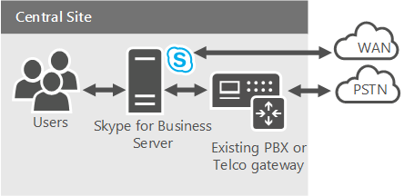
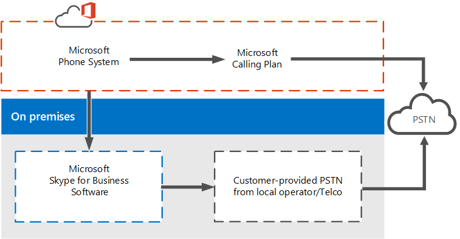

# Planifier votre système téléphonique dans les solutions Office 365 (en nuage PBX)
 
Trouvez des informations sur le système téléphonique de Microsoft dans les solutions Office 365 (en nuage PBX) pour activer le contrôle d’appel et les fonctionnalités d’autocommutateur privé (PBX) dans le nuage Office 365.
  
Microsoft offre différentes options permettant aux utilisateurs d’appeler des téléphones mobiles par le biais du Public téléphone réseau commuté (RTC) et les réseaux terrestres de — si leurs comptes existent dans Office 365 sur Skype pour Business Online ou dans votre Skype sur site pour les entreprises Déploiement de serveur ou de Lync Server 2013.
  
Cet article décrit les différentes offres de voix de Microsoft, puis fournit des conseils sur lequel options peuvent être le mieux pour vous, selon l’état actuel de votre organisation et les plans futurs. 

Vous pouvez utiliser cet article avec la Skype pour affiche des Solutions de voix entreprise Online disponible en téléchargement au format PDF et Visio :
* [Visio](https://download.microsoft.com/download/2/E/E/2EE5C4DE-7F12-475C-A507-37870020F0D3/Plan%20Voice%20Solution%20poster%20-%20Final.vsdx)
* [PDF](https://download.microsoft.com/download/2/E/E/2EE5C4DE-7F12-475C-A507-37870020F0D3/Plan%20Voice%20Solution%20poster%20-%20Final.pdf)
  
## Voix Entreprise

 **Enterprise Voice** est la solution IP (VoIP), inclus dans les déploiements sur site de Skype pour Business Server monde entier VoIP par logiciel Microsoft du. Enterprise Voice offre un large éventail de fonctionnalités, notamment les groupes de réponses, parcage d’appel, Enhanced 9-1-1 et bien plus encore. Voix Entreprise est un système complet d’autocommutateur privé (PBX) pour votre entreprise, incluant la connectivité RTC via votre opérateur local.
  

  
Pour plus d’informations sur les solutions de voix entreprise de Microsoft, voir : [Enterprise Voice dans Skype pour Business Server 2015 planifier](../../plan-your-deployment/enterprise-voice-solution/enterprise-voice.md), [Déployer Enterprise Voice dans Skype pour Business Server 2015](../../deploy/deploy-enterprise-voice/deploy-enterprise-voice.md), [planification de voix entreprise dans Lync Server 2013](https://technet.microsoft.com/library/gg413081%28v=ocs.15%29.aspx)et [déploiement de voix entreprise dans Lync Server 2013](https://technet.microsoft.com/EN-US/library/gg412876%28v=ocs.15%29.aspx).
  
## Système téléphonique dans Office 365 (en nuage PBX)

 **Système téléphonique dans Office 365** est la technologie de Microsoft pour activer le contrôle d’appel et les fonctionnalités de PBX dans le nuage Office 365 avec Skype pour Business en ligne. Système téléphonique vous permet de remplacer votre système PBX existant par un ensemble de fonctionnalités provenant d’Office 365 et étroitement intégré à l’expérience de productivité de l’entreprise dans le nuage.
  
Avec un système téléphonique dans Office 365, vos utilisateurs peuvent utiliser Skype pour Business Online pour prendre en charge des tâches de contrôle d’appel de base, telles que l’émission et réception d’appels, transférer des appels et les appels silence et unmuting. Téléphone les utilisateurs peuvent cliquer sur un nom dans leur carnet d’adresses et Skype pour les entreprises passe un appel à cette personne. Pour émettre et recevoir des appels, les utilisateurs du système téléphonique peuvent utiliser leur appareil mobile, un casque avec un ordinateur portable ou un PC ou l’un des nombreux téléphones IP compatibles avec Skype Entreprise. Pour les administrateurs, le système téléphonique fournit la possibilité de gérer les appels au sein de la console d’administration même client utilisée pour la messagerie, collaboration et ainsi de suite.
  
Comme avec les systèmes PBX traditionnels et avec Enterprise Voice, les appels entre les utilisateurs de votre organisation sont gérés en interne au sein du système téléphonique, jamais accédant au réseau RTC. Cela s’applique aux appels entre les utilisateurs de votre organisation dans différentes zones géographiques, suppression des coûts longue distances sur ces appels internes.
  
Pour activer les appels vers des réseaux terrestres et les téléphones mobiles, système téléphonique peuvent être connecté au réseau RTC de deux façons :
  
- En appelant un Plan d’achat — le réseau RTC appelant plan module complémentaire à Office 365.
    
- À l’aide locale PSTN connectivity, où logiciel local se connecte avec votre infrastructure de téléphonie existante. 
    
## Système téléphonique dans les solutions Office 365

La solution que vous choisissez pour tirer parti du système de téléphone de Microsoft Office 365 offre dépend de vos besoins actuels et futurs, tels que si vous souhaitez que — ou — pour conserver les fonctionnalités fournies par votre déploiement sur site, si vous avez besoin fonctionnalités qui sont actuellement disponibles qu’avec votre solution de voix entreprise locale et quel est votre plan pour déplacer des utilisateurs vers le nuage. 
  
Vous pouvez choisir une offre complètement dans-nuage, ou vous pouvez choisir un déploiement hybride qui tire parti de système téléphonique dans Office 365, mais conserve certaines fonctionnalités en local. Selon vos besoins, vous pouvez choisir de PSTN fonctionnalités fournies par le service Office 365 ou par votre logiciel sur site, comme indiqué dans le diagramme suivant et décrit dans les sections qui suivent :
  

  
- **Système téléphonique dans Office 365 avec l’appel de la planification** , cette option utilise le module complémentaire de planifier l’appel au système téléphonique dans Office 365 pour activer la connectivité PSTN pour l’appel à des réseaux terrestres et téléphones mobiles dans le monde entier (selon le niveau de service sous licence). Vos utilisateurs sont hébergés dans le nuage et sont activés pour le système téléphonique avec le module complémentaire appelant planifier fourni par Microsoft. L’offre de planifier l’appel ne nécessite pas un déploiement du serveur local. Appel de Plan fonctionne uniquement avec un système téléphonique dans Office 365, vous ne pouvez pas l’utiliser avec un autre système PBX. Pour plus d’informations, voir [Appel planifier dans Office 365](plan-your-phone-system-cloud-pbx-solution.md#BKMK_PSTNCalling).
    
- **Système téléphonique dans Office 365 avec une connectivité PSTN sur site** - cette option utilise un logiciel sur site pour connecter votre opérateur mobile, circuit et contrat PSTN existant avec Office 365. Vos utilisateurs sont hébergés dans le nuage et sont activés pour le système téléphonique dans Office 365, mais leur appel est traité par le biais de logiciel sur site.
    
    Vous continuez à utiliser votre connectivité RTC existante (par le biais d’un PBX, d’une passerelle, d’un contrôleur de frontière de session ou d’une connexion de jonction SIP) au réseau RTC source pour les utilisateurs que vous déplacez vers le cloud. Une fois qu’un utilisateur est déplacé vers Skype pour Business Online et système téléphonique dans Office 365, son numéro de téléphone achemine de la Skype pour les clients d’entreprise pour PC ou Smartphones, ainsi que du support téléphones certifiés pour Skype pour les entreprises. Une fois que les ports, les utilisateurs PBX dans le nuage et hérité peuvent s’appellent normalement ainsi qu’émettre et recevoir des appels PSTN à l’aide de leur numéro de téléphone complet.
    
    Si vous voulez mettre en œuvre la connectivité RTC en local, vous pouvez choisir l’une des options suivantes :
    
  - **Skype pour l’édition de connecteur Business Cloud** - nuage connecteur est un hybride qui se compose d’un ensemble de marchandises Machines virtuelles (VM) qui implémentent une connectivité PSTN sur site. En déployant un Skype minimal pour la topologie Business Server dans un environnement virtualisé, les utilisateurs de votre organisation, si hébergés dans le nuage sont localement, seront en mesure d’envoyer et recevoir des appels avec des réseaux terrestres et téléphones mobiles par le biais de l’environnement local existant infrastructure de voix. Pour plus d’informations, voir [planifier Skype pour l’édition de connecteur Business Cloud](plan-skype-for-business-cloud-connector-edition.md) et [configurer et gérer des Skype pour édition dans le nuage connecteur](configure-skype-for-business-cloud-connector-edition.md).
    
  - **Skype pour un déploiement existant Business Server** - un Skype pour le déploiement de serveur d’entreprise ou de Lync Server existant peut implémenter également une connectivité PSTN sur site. Il s’agit d’un hybride offre qui se compose d’un Skype pour déploiement local de Business Server modifiée pour un environnement hybride PSTN. Les utilisateurs de votre organisation, si hébergés dans le nuage sont localement, sera en mesure d’envoyer et recevoir des appels avec des réseaux terrestres et téléphones mobiles par le biais de l’infrastructure vocale locaux. Pour plus d’informations, voir [planifier le système téléphonique dans Office 365 avec une connectivité PSTN dans Skype pour Business Server sur site](plan-phone-system-with-on-premises-pstn-connectivity.md) et [activer des utilisateurs pour le système téléphonique dans Office 365 avec une connectivité PSTN dans Skype pour Business Server local](enable-users-for-phone-system.md).
    
### Plan d’appel dans Office 365

 **Appel de planifier dans Office 365** est le service qui fonctionne avec le système téléphonique dans Office 365 des utilisateurs permettant d’effectuer des appels à des réseaux terrestres et les téléphones mobiles. Ce plan d’appel RTC fonctionnant en dehors d’Office 365, il s’agit d’une offre complètement dans-nuage qui ne nécessite pas un déploiement du serveur local.
  
Les utilisateurs de cette option sont hébergés sur Skype pour Business Online dans Office 365 et ont accès à Skype pour les services de voix entreprise en ligne. Microsoft fournit à la fois des services d’appels et RTC, et peut même fournir ou transférer les numéros de téléphone de vos utilisateurs. 
  
Plan d’appel dans Office 365 vous permet de rechercher, acquérir et affecter des numéros de téléphone pour les utilisateurs de votre organisation afin que les utilisateurs peuvent émettre et recevoir des appels téléphoniques avec des personnes à l’intérieur et à l’extérieur de votre organisation.
  
Dans tous les types d’entreprise, un numéro de téléphone qui permet aux utilisateurs d’envoyer et de recevoir des appels vocaux est essentiel à l’établissement de relations commerciales, car les numéros de téléphone permettent d’identifier les utilisateurs et de faciliter la communication entre les entreprises. Les utilisateurs auxquels sont attribués des numéros de téléphone peuvent effectuer des appels vocaux sur tous les périphériques Skype Entreprise, dont les téléphones VoIP, les PC et les appareils mobiles. 
  

  
Pour plus d’informations, voir [Quels sont les Plans de l’appel dans Office 365 ?](/microsoftteams/what-are-calling-plans-in-office-365)

Plan d’appel dans Office 365 est disponible dans différents emplacements géographiques spécifiques en pleine croissance. Pour connaître la disponibilité dans votre zone, contactez votre représentant Microsoft. 
  
### Connectivité RTC locale avec la version Cloud Connector

 **Nuage connecteur** est un ensemble de marchandises Machines virtuelles (VM) qui implémentent la connectivité RTPC locale avec un système téléphonique dans Office 365. Cette offre hybride est conçue pour les organisations qui souhaitent activer leur Skype pour les utilisateurs professionnels en ligne à utiliser leur connexion RTC local existante, avec Skype pour le contrôle d’appel métiers dans le nuage.
  
Cette option, vous déployez un ensemble d’ordinateurs virtuels marchandises qui contiennent un Skype minimal pour la topologie du serveur d’entreprise, constitué d’un composant de serveur Edge, composant de médiation et un rôle du magasin Central de gestion (CMS). Ces services sont configurés pour un environnement hybride avec votre client Office 365 qui inclut Skype pour Business Online services. 
  

  
Pour plus d’informations sur cette option, voir [planifier Skype pour l’édition de connecteur Business Cloud](plan-skype-for-business-cloud-connector-edition.md) et [configurer et gérer des Skype pour édition dans le nuage connecteur](configure-skype-for-business-cloud-connector-edition.md).
  
### Connectivité RTPC locale avec un déploiement existant

Vous pouvez implémenter une solution hybride à l’aide de votre Skype existant pour le déploiement de serveur d’entreprise et de connectivité PSTN. Dans cette topologie, les utilisateurs sont hébergés dans le nuage sur Skype pour Business Online au lieu d’être hébergés sur le déploiement local. Vous pouvez sélectionner cette option si des utilisateurs sont hébergés actuellement sur le cloud ou si vous souhaitez commencer à migrer des utilisateurs vers le cloud. 
  
Cette option, votre Skype pour les utilisateurs professionnels Online obtenir leur connectivité PSTN via Enterprise Voice sur votre Skype sur site pour le déploiement de serveur d’entreprise, avec Skype pour le contrôle d’appel métiers dans le nuage. 
  

  
Pour plus d’informations sur cette option, voir [planifier le système téléphonique dans Office 365 avec une connectivité PSTN dans Skype pour Business Server sur site](plan-phone-system-with-on-premises-pstn-connectivity.md) et [permettent aux utilisateurs pour le système téléphonique dans Office 365 avec localement une connectivité PSTN dans Skype pour Business Server ](enable-users-for-phone-system.md).
  
## Choix de la meilleure solution

Pour déterminer la solution qui convient le mieux à votre organisation, veillez à connaître les réponses aux questions ci-dessous, puis reportez-vous au schéma, qui vous aidera à choisir votre solution :
  
- Existe-t-il un Skype local existant pour le déploiement de serveur d’entreprise ? 
    
- Vos utilisateurs sont hébergés sur Skype pour les professionnels sur site, dans le nuage sur Skype pour Business Online ou les deux ? Souhaitez-vous déplacer vos utilisateurs locaux vers le cloud ?
    
- Est l’appel de Plan de Microsoft dans Office 365 disponibles dans votre région ? 
    
- Voulez-vous conserver votre opérateur de téléphonie actuel ? Avez-vous besoin de conserver votre opérateur de téléphonie actuel en raison d’un contrat existant ?
    
- Avez-vous un système PBX hérité local existant que vous souhaitez ou devez garder ? 
    
- Votre système PBX hérité actuel offre-t-il des fonctionnalités uniques essentielles à votre entreprise ?
    
- Tout ou partie de vos utilisateurs nécessitent des fonctionnalités n'offertes pas actuellement dans le système téléphonique dans Office 365 ?
    
Avant de prendre votre décision qui convient le mieux pour votre organisation — système téléphonique dans Office 365, locale Enterprise Voice, ou une solution de combinaison, vous devez déterminer les fonctionnalités que vous devez maintenant et à l’avenir. Certaines fonctionnalités, telles que les groupes Response Group, groupe d’appel collecte et parcage d’appel — sont proposés uniquement pour les utilisateurs locaux. Pour une liste complète de système téléphonique dans les fonctionnalités d’Office 365 à votre disposition, voir [Voici ce que vous obtenez avec un système téléphonique dans Office 365](https://go.microsoft.com/fwlink/p/?LinkId=715517).
  
**Choix de votre solution**

  
|**Votre situation**   |**Système téléphonique dans les solutions Office 365**   |
|:-----|:-----|
|Votre système PBX offre des fonctionnalités uniques, que vous devez conserver.    |**Envisagez de remplacer votre système PBX par Skype Entreprise Server.** Vous pouvez utiliser Skype pour Business Server Enterprise Voice comme un système PBX complète pour votre organisation, y compris une connectivité PSTN par le biais de votre opérateur local. Si vos besoins pour PBX des fonctionnalités de modifications apportées à l’avenir, vous pouvez revenir système téléphonique dans Office 365.   Pour plus d’informations sur les solutions de voix entreprise de Microsoft, voir [planifier votre solution de voix entreprise dans Skype pour Business Server 2015](../../plan-your-deployment/enterprise-voice-solution/enterprise-voice-solution.md).    Si ce n’est pas le cas, tous vos utilisateurs nécessitent les fonctionnalités uniques fournie par votre système PBX actuel, vous pouvez envisager de déplacer les utilisateurs vers Skype pour Business Online.    |
|Votre système PBX n’offre pas de fonctionnalités uniques que vous devez conserver, appel planifier dans Office 365 est disponible dans votre région et vous souhaitez utiliser les services fournis par Microsoft PSTN.    |**S’abonner au Plan de l’appel dans Office 365.** Tous vos utilisateurs peuvent se trouver sur le cloud sur Skype Entreprise Online, et votre entreprise peut recevoir des services PBX et RTC du cloud Microsoft. Si vos utilisateurs ont déjà des numéros de téléphone de votre opérateur actuel, les numéros de téléphone peuvent être appliquées à système téléphonique dans Office 365. Au besoin, vous pouvez obtenir des numéros de téléphone supplémentaires auprès de Microsoft.   Pour plus d’informations, voir [Quels sont les Plans de l’appel dans Office 365 ?](/microsoftteams/what-are-calling-plans-in-office-365)   |
|Votre système PBX n’offre pas de fonctionnalités uniques que vous devez conserver, appel planifier dans Office 365 n’est pas disponible dans votre région et vous avez Lync existant ou Skype pour le déploiement de serveur d’entreprise.    Dans ce scénario, il est également possible que tous vos utilisateurs sont aux États-Unis, mais vous ne pouvez pas envisager de déplacer PSTN fournis par Microsoft pour d’autres raisons, telles que les obligations contractuelles avec votre opérateur existant.    |**Se connecter à votre Skype existant pour le déploiement de serveur d’entreprise avec un système téléphonique dans Office 365.** Connectivité RTPC fournie par Enterprise Voice sur votre Skype sur site pour le déploiement de serveur d’entreprise, mais votre organisation peut recevoir des services de PBX à partir du cloud Microsoft. Vous pouvez conserver les fonctionnalités vocales de vos utilisateurs lorsque vous commencez à déplacer vers Skype pour Business Online. Vous pouvez déplacer vos utilisateurs à votre rythme, en sachant que leurs fonctionnalités vocales seront conservées où qu’ils soient hébergés.   À l’avenir, si vous décidez que vous pouvez laisser votre opérateur actuel, vous pouvez déplacer vos utilisateurs en nuage complète du système de Microsoft téléphonique dans Office 365 avec appel planifier avec Microsoft fournissant toutes les fonctionnalités de PBX et RTC.    Pour plus d’informations sur cette option, voir [planifier le système téléphonique dans Office 365 avec une connectivité PSTN dans Skype pour Business Server sur site](plan-phone-system-with-on-premises-pstn-connectivity.md) et [permettent aux utilisateurs pour le système téléphonique dans Office 365 avec localement une connectivité PSTN dans Skype pour Business Server ](enable-users-for-phone-system.md).    |
|Votre système PBX n’offre pas de fonctionnalités uniques que vous devez conserver, appel planifier dans Office 365 n’est pas disponible dans votre région et vous n’avez pas une Lync existant ou une Skype pour le déploiement de serveur d’entreprise.    Dans ce scénario, il est possible que l’appel planifier dans Office 365 est disponible dans votre région, mais vous ne pouvez pas envisager de déplacer PSTN fournis par Microsoft pour d’autres raisons, telles que les obligations contractuelles avec votre opérateur existant.    |**Déployez Cloud Connector.** Vous conservez votre opérateur RTC actuel, mais votre organisation peut recevoir des services PBX du cloud Microsoft. Nuage connecteur vous permet de fournir Skype pour les fonctionnalités contrôle d’appel à vos utilisateurs. Cette solution fonctionne quel que soit l’emplacement géographique de vos utilisateurs, car chaque utilisateur est connecté à son site local pour assurer la connectivité RTC.   À l’avenir, si vous décidez que vous pouvez laisser votre opérateur actuel, vous pouvez déplacer vos utilisateurs en nuage complète du système de Microsoft téléphonique dans Office 365 avec appel planifier avec Microsoft fournissant toutes les fonctionnalités de PBX et RTC.    Pour plus d’informations sur cette option, voir [planifier Skype pour l’édition de connecteur Business Cloud](plan-skype-for-business-cloud-connector-edition.md) et [configurer et gérer des Skype pour édition dans le nuage connecteur](configure-skype-for-business-cloud-connector-edition.md).    |
   
### Choix d’une solution combinée

Bien évidemment, vous n’avez pas à choisir une solution unique pour l’ensemble de votre organisation. Voici certains exemples où la combinaison de solutions peut être la meilleure stratégie pour votre organisation :
  
- **Mon organisation a un Skype pour le déploiement de Business Server existant, appel planifier dans Office 365 est disponible dans ma région, ai-je besoin uniquement des fonctionnalités de contrôle d’appel de base, et je n’avez pas besoin de conserver mon jonctions RTC ou un PBX sur site.** Vous pouvez utiliser système téléphonique dans Office 365 avec une connectivité PSTN local pour conserver les fonctionnalités de voix des utilisateurs que vous commencez à déplacer en ligne. Finalement, vous pourrez déplacer tous les utilisateurs en ligne, supprimer des vos serveurs sur site et utiliser le système téléphonique dans Office 365 avec l’appel de la planification.
    
- **Mon organisation possède plusieurs emplacements géographiques. Les sites de grande taille ont un Skype sur site pour les déploiements de serveur d’entreprise avec Enterprise Voice, tandis que les utilisateurs sur les sites plus petits n’ont pas tout tout Skype pour les fonctionnalités de voix entreprise.** Si ces sites de petite taille sont dans une région qui fournit l’appel planifier dans Office 365, vous pourriez atteindre ces utilisateurs Skype pour Business Online et les activer pour les fonctionnalités vocales par le biais de système téléphonique dans Office 365 avec l’appel de la planification. Tout en, les utilisateurs de vos sites de grande taille peuvent rester en local, ou vous pouvez les déplacer vers Skype pour Business en ligne à votre rythme en tirant parti de système téléphonique dans Office 365 localement avec une connectivité PSTN.
    
- **Mon organisation a un Skype existant pour le déploiement de serveur d’entreprise, l’appel planifier dans Office 365 est disponible dans ma région, mais certains de mes utilisateurs nécessitent des fonctionnalités d’appel avancées telles que les groupes de réponses et groupe d’appel collecte.** Les utilisateurs qui n’ont pas besoin d’utiliser les fonctionnalités d’appel avancées peuvent être déplacés vers le nuage à présent, à l’aide du système téléphonique dans Office 365 avec une connectivité PSTN sur site. Plus tard, lorsque les fonctionnalités requises sont ajoutées à Skype pour Business Online, vous pouvez déplacer le reste de vos utilisateurs vers le nuage également.
    
- **Mon organisation a un Skype pour le déploiement de serveur d’entreprise existant, déplacer tous les utilisateurs vers le nuage, mais l’appel planifier dans Office 365 n’est pas disponible dans toutes les régions.** Vous pouvez déplacer tous vos utilisateurs vers le nuage tout en conservant leur jonction site local et les fonctionnalités du système PBX, à l’aide du système téléphonique dans Office 365 avec une connectivité PSTN sur site. Pour les utilisateurs qui résident dans les zones qui fournissent l’appel planifier dans Office 365, et qui n’ont pas besoin de fonctionnalités appel avancées, vous pouvez éventuellement déplacer leur contrôle d’appel vers le nuage, à l’aide du système téléphonique dans Office 365 avec l’appel de la planification. Vous pouvez alors éventuellement transférer leurs numéros de téléphone existants.
    
- **Mon organisation possède une existante Skype pour Business Server, mais sans déploiement d’Enterprise Voice.** Pour déterminer la meilleure solution pour votre organisation, reportez-vous au schéma.
    

