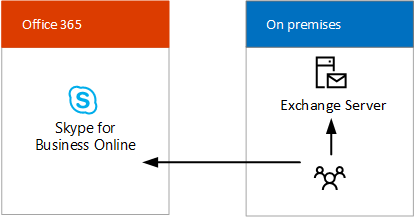

# Skype pour des solutions professionnelles hybrideSkype for Business hybrid solutions
 
Trouvez des informations sur la planification d’un Skype pour un déploiement hybride Business.Find information on planning a Skype for Business hybrid deployment. 
  
Cette rubrique vous présente plusieurs configurations hybrides afin de vous aider à déterminer celle qui est la plus adaptée à votre entreprise.This topic introduces you to several hybrid configurations to help you determine which configuration is best for your business. Vous pourrez ensuite en savoir plus sur la configuration qui vous intéresse en suivant les liens correspondants.You can then read more about the configuration you're interested in by following the links in this topic. Cette rubrique contient les sections suivantes :This topic contains the following sections:
  
- [Configurations hybrides Skype EntrepriseSkype for Business hybrid configurations](skype-for-business-hybrid-solutions.md#BKMK_HybridConfigurations)
    
- [Ajoutez Skype pour Business Online sur vos locaux Skype pour un environnement d’entrepriseAdd Skype for Business Online into your existing on-premises Skype for Business environment](skype-for-business-hybrid-solutions.md#BKMK_HybridConnectivity)
    
- [Tirer parti de système téléphonique dans Office 365 (en nuage PBX)Take advantage of Phone System in Office 365 (Cloud PBX)](skype-for-business-hybrid-solutions.md#BKMK_CloudPBX)
    
- [Intégration dans Exchange et SharePointIntegrate with Exchange and SharePoint](skype-for-business-hybrid-solutions.md#BKMK_IntegratewExchangeSharePoint)
    
- [Planifier et configurer un environnement hybrideTasks for planning and configuring a hybrid environment](skype-for-business-hybrid-solutions.md#BKMK_Tasks)
    
- [Pour plus d’informationsFor more information](skype-for-business-hybrid-solutions.md#BKMK_MoreInfo)
    
## Configurations hybrides Skype EntrepriseSkype for Business hybrid configurations

Skype pour les entreprises prend en charge plusieurs configurations hybrides.Skype for Business supports several hybrid configurations. Vous pouvez ajouter Skype pour Business Online sur vos locale Skype pour un environnement d’entreprise, intégrer votre Skype pour le déploiement d’entreprise avec Exchange Online et SharePoint Online et tirer parti de système téléphonique dans Office 365 (en nuage PBX) — de Microsoft technologie d’activation du contrôle d’appel et les fonctionnalités d’autocommutateur privé (PBX) dans le nuage Office 365 avec Skype pour Business en ligne.You can add Skype for Business Online into your existing on-premises Skype for Business environment, integrate your Skype for Business deployment with Exchange Online and SharePoint Online, and take advantage of Phone System in Office 365 (Cloud PBX)—Microsoft's technology for enabling call control and Private Branch Exchange (PBX) capabilities in the Office 365 cloud with Skype for Business Online. 
  
Avec un Skype pour un déploiement hybride Business, vous combinez un Skype pour l’abonnement en ligne professionnels avec votre Skype locale offre d’entreprise.With a Skype for Business hybrid deployment, you combine a Skype for Business Online subscription with your on-premises Skype for Business offering. Vous pouvez commencer à créer des compétences de gestion du logiciel en tant que service dans votre organisation et déplacez votre Skype pour les utilisateurs vers le nuage à votre rythme.You can start building software-as-a-service management skills in your organization, and move your Skype for Business users to the cloud at your own pace. Les utilisateurs qui sont hébergés dans le nuage peuvent tirer parti du système téléphonique dans Office 365 tout en conservant votre connectivity de Public réseau de téléphonique commuté (RTC) sur site.Your users who are homed in the cloud can take advantage of Phone System in Office 365 while retaining your on-premises Public Switched Telephone Network (PSTN) connectivity.
  
Avec un Skype pour la configuration hybride Business, gardez les points suivants à l’esprit :With a Skype for Business hybrid configuration, keep the following in mind:
  
- Certains utilisateurs seront peut-être hébergés en local et certains le seront en ligne, mais ils partageront le même domaine de protocole SIP, comme par exemple contoso.com.Some users might be homed on premises and some online, but the users share the same Session Initiation Protocol (SIP) domain, such as contoso.com.
    
- Vous pouvez migrer les utilisateurs de Skype pour les entreprises dans les locaux à Skype pour Business Online au fil du temps, votre calendrier.You can migrate users from Skype for Business on premises to Skype for Business Online over time, on your schedule.
    
- L’intégration dans d’autres applications Microsoft Office 365, y compris Exchange Online et SharePoint Online est possible.You can integrate with other Microsoft Office 365 applications, including Exchange Online and SharePoint Online.
    
- L’intégration dans Exchange et SharePoint est possible.You can integrate with Exchange and SharePoint.
    
- Vous pouvez profiter de la fonction Diffusion de réunion Skype.You can take advantage of Skype Meeting Broadcast.
    
- Vous pouvez profiter de la fonction conférence RTC.You can take advantage of PSTN conferencing.
    
## Ajoutez Skype pour Business Online sur vos locaux Skype pour un environnement d’entrepriseAdd Skype for Business Online into your existing on-premises Skype for Business environment

Connectivité hybride entre Skype pour Business Server et Skype pour Business Online signifie que les utilisateurs d’un domaine, par exemple, contoso.com, sont répartis entre l’utilisation de Skype pour Business Server localement et Skype pour Business Online.Hybrid connectivity between Skype for Business Server and Skype for Business Online means users of a domain, such as contoso.com, are split between using Skype for Business Server on premises and Skype for Business Online. Certains utilisateurs du domaine sont hébergés en local et certains le sont en ligne.Some of the domain users are homed on premises, and some users are homed online. Vous pouvez configurer votre déploiement sur site pour l’environnement hybride avec Skype pour Business Online et utiliser la synchronisation Active Directory pour conserver votre organisation locale et en ligne utilisateurs synchronisés.You can configure your on-premises deployment for hybrid with Skype for Business Online and use Active Directory Synchronization to keep your on-premises and online users synchronized. 
  
Le diagramme suivant montre comment ajouter des Skype pour Business Online dans votre Skype local existant pour l’environnement d’entreprise, ce qui vous permet de déplacer des utilisateurs vers le nuage à votre rythme :The following diagram shows how you can add Skype for Business Online into your existing on-premises Skype for Business environment, allowing you to move users to the cloud at your own pace:
  

  
Pour plus d’informations, voir [planification de la connectivité hybride entre Skype pour Business Server et Skype pour Business Online](plan-hybrid-connectivity.md) et de [déployer la connectivité hybride entre Skype pour Business Server et Skype pour Business Online](deploy-hybrid-connectivity/deploy-hybrid-connectivity.md).For more information, see [Plan hybrid connectivity between Skype for Business Server and Skype for Business Online](plan-hybrid-connectivity.md) and [Deploy hybrid connectivity between Skype for Business Server and Skype for Business Online](deploy-hybrid-connectivity/deploy-hybrid-connectivity.md).
  
## Tirer parti de système téléphonique dans Office 365 (en nuage PBX)Take advantage of Phone System in Office 365 (Cloud PBX)

 Système téléphonique dans Office 365 (en nuage PBX) est la technologie de Microsoft pour activer le contrôle d’appel et les fonctionnalités d’autocommutateur privé (PBX) dans le nuage Office 365 avec Skype pour Business en ligne.Phone System in Office 365 (Cloud PBX) is Microsoft's technology for enabling call control and Private Branch Exchange (PBX) capabilities in the Office 365 cloud with Skype for Business Online. Système téléphonique dans Office 365 vous permet de remplacer votre système PBX existant par un ensemble de fonctionnalités provenant d’Office 365 et étroitement intégré à l’expérience de productivité de Microsoft dans le nuage.Phone System in Office 365 allows you to replace your existing PBX system with a set of features delivered from Office 365 and tightly integrated into Microsoft's cloud productivity experience.
  
En plus de deux système téléphonique dans les offres Office 365 hybride, Microsoft offre un système téléphonique dans Office 365 avec l’appel planifier — un PSTN appel service — pour une solution tout-en nuage qui ne nécessite pas un déploiement du serveur local.In addition to two Phone System in Office 365 hybrid offerings, Microsoft offers Phone System in Office 365 with Calling Plan—a PSTN calling service—for an all-in-the-cloud solution that does not require an on-premises server deployment. Pour décider si système téléphonique dans Office 365 avec l’appel de planification peut être la solution idéale pour votre organisation, consultez la rubrique [Système téléphonique dans les solutions Office 365](plan-your-phone-system-cloud-pbx-solution/plan-your-phone-system-cloud-pbx-solution.md#BKMK_PBXOfferings).To decide if Phone System in Office 365 with Calling Plan might be the right solution for your organization, see [ Phone System in Office 365 solutions](plan-your-phone-system-cloud-pbx-solution/plan-your-phone-system-cloud-pbx-solution.md#BKMK_PBXOfferings).
  
Il existe deux système téléphonique dans les offres Office 365 hybride :There are two Phone System in Office 365 hybrid offerings: 
  
- [Système téléphonique dans Office 365 avec une connectivité locale fournie par votre Skype pour le déploiement de serveur d’entreprisePhone System in Office 365 with on-premises connectivity provided by your Skype for Business Server deployment](skype-for-business-hybrid-solutions.md#BKMK_Server)
    
- [Système téléphonique dans Office 365 avec une connectivité locale fournie par Skype pour Business Server nuage connecteur EditionPhone System in Office 365 with on-premises connectivity provided by Skype for Business Server Cloud Connector Edition](skype-for-business-hybrid-solutions.md#BKMK_CCE)
    
### Système téléphonique dans Office 365 avec une connectivité locale fournie par votre Skype pour le déploiement de serveur d’entreprisePhone System in Office 365 with on-premises connectivity provided by your Skype for Business Server deployment

Cette configuration comprend un Skype pour déploiement local de Business Server modifiée pour un environnement hybride PSTN.This configuration consists of a Skype for Business Server on-premises deployment modified for hybrid PSTN. Les utilisateurs de votre organisation qui sont hébergés dans le nuage peuvent recevoir les services de PBX à partir du cloud Microsoft, mais une connectivité PSTN fournie par Enterprise Voice sur votre Skype sur site pour le déploiement de serveur d’entreprise.Users in your organization who are homed in the cloud can receive PBX services from the Microsoft cloud, but PSTN connectivity is provided through Enterprise Voice on your on-premises Skype for Business Server deployment. 
  

  
Cette configuration est la meilleure si :This configuration is best if: 
  
- Votre système PBX n’offre pas de fonctionnalités uniques que vous devez conserver.Your PBX does not offer unique features that you need to retain.
    
- Plan, le service Office 365 PSTN d’appel, l’appel n’est pas disponible dans votre région.Calling Plan, the Office 365 PSTN calling service, is not available in your region.
    
- Vous avez un Lync existant ou un Skype pour le déploiement de serveur d’entreprise.You have an existing Lync or Skype for Business Server deployment.
    
Pour plus d’informations, voir [planifier le système téléphonique dans Office 365 avec une connectivité PSTN dans Skype pour Business Server sur site](plan-your-phone-system-cloud-pbx-solution/plan-phone-system-with-on-premises-pstn-connectivity.md) et [activer des utilisateurs pour le système téléphonique dans Office 365 avec une connectivité PSTN dans Skype pour Business Server local](plan-your-phone-system-cloud-pbx-solution/enable-users-for-phone-system.md).For more information, see [Plan Phone System in Office 365 with on-premises PSTN connectivity in Skype for Business Server](plan-your-phone-system-cloud-pbx-solution/plan-phone-system-with-on-premises-pstn-connectivity.md) and [Enable users for Phone System in Office 365 with on-premises PSTN connectivity in Skype for Business Server](plan-your-phone-system-cloud-pbx-solution/enable-users-for-phone-system.md).
  
### Système téléphonique dans Office 365 avec une connectivité locale fournie par Skype pour Business Server nuage connecteur EditionPhone System in Office 365 with on-premises connectivity provided by Skype for Business Server Cloud Connector Edition

Cette configuration consiste en un ensemble de machine virtuelles (VM) qui mettent en œuvre la connectivité RTC locale.This configuration consists of a set of packaged Virtual Machines (VMs) that implement on-premises PSTN connectivity. En déployant un Skype minimal pour la topologie Business Server dans un environnement virtualisé, les utilisateurs de votre organisation qui sont hébergés dans le nuage peuvent recevoir les services de PBX à partir du cloud Microsoft, mais une connectivité PSTN est fournie par le biais de la voix sur site existant infrastructure.By deploying a minimal Skype for Business Server topology in a virtualized environment, users in your organization who are homed in the cloud can receive PBX services from the Microsoft cloud, but PSTN connectivity is provided through the existing on-premises voice infrastructure. 
  

  
Cette configuration est la meilleure si :This configuration is best if:
  
- Votre système PBX n’offre pas de fonctionnalités uniques que vous devez conserver.Your PBX does not offer unique features that you need to retain.
    
- Plan, le service Office 365 PSTN d’appel, l’appel n’est pas disponible dans votre région.Calling Plan, the Office 365 PSTN calling service, is not available in your region.
    
- Ne pas un Lync existant ou Skype pour le déploiement de serveur d’entreprise.You do not have an existing Lync or Skype for Business Server deployment.
    
Pour plus d’informations, voir [planifier Skype pour l’édition de connecteur Business Cloud](plan-your-phone-system-cloud-pbx-solution/plan-skype-for-business-cloud-connector-edition.md).For more information, see [Plan for Skype for Business Cloud Connector Edition](plan-your-phone-system-cloud-pbx-solution/plan-skype-for-business-cloud-connector-edition.md).
  
## Intégration dans Exchange et SharePointIntegrate with Exchange and SharePoint

Un Skype pour la configuration hybride Business vous permet d’intégrer avec d’autres applications Microsoft Office 365, notamment Exchange Online et SharePoint Online.A Skype for Business hybrid configuration allows you to integrate with other Microsoft Office 365 applications, including Exchange Online and SharePoint Online.
  
### Skype Entreprise Server dans Exchange Online et SharePoint OnlineSkype for Business Server with Exchange Online and SharePoint Online

Vous pouvez intégrer Skype pour Business Server avec Exchange Online et SharePoint Online, comme illustré dans le diagramme suivant :You can integrate Skype for Business Server with Exchange Online and SharePoint Online as shown in the following diagram:
  

  
Intégration Skype pour Business Server avec Exchange Online et SharePoint Online présente plusieurs avantages.Integrating Skype for Business Server with Exchange Online and SharePoint Online has several advantages. Vous pouvez :You can:
  
- Utilisez l’ensemble complet des fonctionnalités de Skype pour Business Server.Use the full feature set of Skype for Business Server.
    
- Exploiter votre équipement téléphonique local existant, tel que PBX.Leverage your existing on-premises phone equipment, such as PBXs.
    
- Utiliser Exchange Online pour vos e-mail, ce qui allège la charge de traitement et de stockage des serveurs locaux.Use Exchange Online for email, off-loading the burden of on-premises email servers and storage.
    
- Utiliser SharePoint Online pour collaborer, ce qui allège la charge de maintenance des serveurs SharePoint locaux.Use SharePoint Online for collaboration, off-loading the burden of maintaining on-premises SharePoint servers.
    
- Utiliser Skype pour entreprises, Exchange et SharePoint intégré des fonctionnalités, y compris la messagerie unifiée dans Office 365.Use Skype for Business, Exchange, and SharePoint integrated features, including Unified Messaging (UM) in Office 365.
    
Pour plus d’informations, voir [planifier l’intégration Skype pour les entreprises et Exchange](../plan-your-deployment/integrate-with-exchange/integrate-with-exchange.md).For more information, see [Plan to integrate Skype for Business and Exchange](../plan-your-deployment/integrate-with-exchange/integrate-with-exchange.md).
  
### Exchange Server avec Skype Entreprise OnlineExchange Server with Skype for Business Online

Vous pouvez intégrer Exchange Server Skype pour Business Online comme indiqué dans le diagramme suivant :You can integrate Exchange Server with Skype for Business Online as shown in the following diagram:
  

  
Intégration d’Exchange Server avec Skype pour Business Online offre les avantages suivants :Integrating Exchange Server with Skype for Business Online has the following advantages:
  
- Exploitation de votre infrastructure Exchange existante.Leverage your existing Exchange infrastructure.
    
- Utiliser Skype pour Business Online pour les fonctionnalités de présence, messagerie instantanée et la conférence.Use Skype for Business Online for presence, IM, and conferencing capabilities. 
    
Pour plus d’informations, voir [planifier l’intégration Skype pour les entreprises et Exchange](../plan-your-deployment/integrate-with-exchange/integrate-with-exchange.md).For more information, see [Plan to integrate Skype for Business and Exchange](../plan-your-deployment/integrate-with-exchange/integrate-with-exchange.md).
  
## Planifier et configurer un environnement hybrideTasks for planning and configuring a hybrid environment

Skype pour les entreprises fournit un large éventail de fonctionnalités, quel que soit le mode de l’architecture de votre déploiement.Skype for Business provides a rich set of capabilities no matter how you architect your deployment. L’architecture que vous choisirez déterminera les responsabilités IT dont vous aurez la charge, et celles dont Microsoft s’occupera dans le cadre de votre abonnement.The architecture you choose will determine which IT responsibilities you own, and which you pay Microsoft to support through your subscription. Quelle que soit la meilleure architecture pour votre organisation, vous aurez toujours la charge de ces cinq responsabilités fondamentales :No matter which architecture is best for your organization, there are five core responsibilities that you will always own:
  
- **Mise en réseau et connectivité** - assurer la disponibilité via le pare-feu, les serveurs proxy, les passerelles et sur les liaisons WAN et la capacité du réseau en effectuant une évaluation du réseau ou en contractantes avec un partenaire pour effectuer l’évaluation.**Networking and connectivity** - Ensure network capacity and availability through firewalls, proxy servers, gateways, and across WAN links by performing a network assessment or by contracting with a partner to do the assessment.
    
- **La gouvernance des données &amp; gestion des droits** - classer vos données sensibles et vérifiez qu’il est protégé et surveillé partout où il est stocké et s’il est en transit.**Data governance &amp; rights management** - Classify your sensitive data and ensure it is protected and monitored wherever it is stored and while it is in transit.
    
- **Points de terminaison clients** - établir, mesurer et appliquer des normes de sécurité modernes sur les périphériques qui sont utilisés pour accéder à vos données et les ressources.**Client Endpoints** - Establish, measure, and enforce modern security standards on devices that are used to access your data and assets.
    
- **Compte &amp; accéder à la gestion** - établir un profil pour des activités de compte « normal » et d’alerte sur l’activité inhabituelle.**Account &amp; access management** - Establish a profile for "normal" account activity and alert on unusual activity.
    
- **Identité** : Utilisez des informations d’identification sécurisées par le matériel ou par Multi-Factor Authentication (MFA) pour toutes les identités. **Identity** - Use credentials secured by hardware or Multi-Factor Authentication (MFA) for all identities.
    
En plus des tâches liées à l’architecture que vous effectuez pour votre environnement local, vous aurez à :In addition to the architectural tasks you perform for your on-premises environment, you will need to:
  
- Planifier et concevoir les exigences de gestion d’identité, y compris l’intégration des identités locales dans Office 365.Plan and design identity management requirements, including integrating on-premises identities with Office 365.
    
- Vous assurer de la capacité et de la disponibilité du réseau.Ensure network capacity and availability.
    
- Acquérir des certificats SSL tiers, afin de fournir une sécurité d’entreprise pour les offres de services Office 365.Acquire third-party SSL certificates to provide enterprise-security for Office 365 service offerings.
    
- Décider si vous voulez vous connecter à Office 365 par l’intermédiaire du protocole IPv6.Decide if you want to connect to Office 365 with Internet Protocol version 6 (IPv6).
    
- Déterminer quelle fonctionnalité d’intégration avec locaux et des versions en ligne de Skype pour entreprises, Exchange et SharePoint est souhaitée.Determine how much feature integration with on-premises and online versions of Skype for Business, Exchange, and SharePoint is desired. 
    
- Déterminer quel serveur proxy sera utilisé pour les requêtes d’Office 365.Determine which proxy server device will be used for requests from Office 365.
    
Vous devez également effectuer le suivi des tâches professionnels de l’informatique pour implémenter votre Skype pour un environnement hybride :You will also need to perform the follow IT Pro tasks to implement your Skype for Business hybrid environment:
  
- Vérifiez que vous disposez d’un client Microsoft Office 365 avec Skype pour Business Online activé.Ensure you have a Microsoft Office 365 tenant with Skype for Business Online enabled.
    
- Mettre en œuvre le plan de gestion d’identité. Implement the identity management plan. 
    
- Planifier et exécuter le routage et l’enregistrement DNS interne et externe.Plan and implement internal and external DNS records and routing.
    
- Configurer votre pare-feu ou votre proxy pour les exigences d’URL et d’adresse IP d’Office 365.Configure your proxy or firewall for Office 365 IP address and URL requirements.
    
- Administrer des comptes d’utilisateurs et Skype pour les paramètres d’entreprise en ligne.Administer user accounts and Skype for Business Online settings. 
    
- Configurer le serveur proxy, si besoin. Configure the proxy server device, if required. 
    
- Configurer l’intégration des fonctionnalités dans les versions locales et en ligne d’Exchange Server et de SharePoint.Configure the integration of features with on-premises and online versions of Exchange Server and SharePoint.
    
## Pour plus d’informationsFor more information

Pour plus d’informations, consultez les ressources suivantes :For more information, see the following resources:
  
- [Ressources d’architecture informatique en nuage MicrosoftMicrosoft cloud IT architecture resources](https://aka.ms/clouditarch)
    
- [Identité du cloud Microsoft pour les architectes de l’entrepriseMicrosoft cloud identity for enterprise architects](https://docs.microsoft.com/en-us/office365/enterprise/microsoft-cloud-it-architecture-resources#identity)
    
- [Préparer votre organisation à Office 365 pour entreprisesGet your organization ready for Office 365 Enterprise](https://aka.ms/O365EntPrep)
    
- [Planifier une connectivité hybride entre Skype Entreprise Server et Skype Entreprise OnlinePlan hybrid connectivity between Skype for Business Server and Skype for Business Online](plan-hybrid-connectivity.md)
    
- [Déploiement de la connectivité hybride entre Skype Entreprise Server et Skype Entreprise OnlineDeploy hybrid connectivity between Skype for Business Server and Skype for Business Online](deploy-hybrid-connectivity/deploy-hybrid-connectivity.md)
    
- [Système téléphonique dans les solutions Office 365 Phone System in Office 365 solutions](plan-your-phone-system-cloud-pbx-solution/plan-your-phone-system-cloud-pbx-solution.md#BKMK_PBXOfferings)
    
- [Planifier l’intégration de Skype Entreprise et d’ExchangePlan to integrate Skype for Business and Exchange](../plan-your-deployment/integrate-with-exchange/integrate-with-exchange.md)
    
Si vous souhaitez télécharger cette rubrique dans un format d’affiche, rendez-vous sur :If you would like to download a poster version of this topic, go to:
  
- [Skype pour l’architecture des modèles d’entreprise (pdf)Skype for Business Architectural Models (pdf)](https://download.microsoft.com/download/7/7/4/7741262C-A60D-41F7-863B-99BF5964FBFE/Skype%20for%20Business%20Architectural%20Models.pdf)
    
- [Skype pour des modèles d’entreprise architecturaux (Visio)Skype for Business Architectural Models (Visio)](https://download.microsoft.com/download/7/7/4/7741262C-A60D-41F7-863B-99BF5964FBFE/Skype%20for%20Business%20Architectural%20Models.vsd)
    

