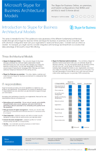

# Diagrammes techniques pour Skype pour Business ServerTechnical diagrams for Skype for Business Server 

**Résumé :** Passez en revue ces affiches en fonction des besoins lors de la planification, l’implémentation et la gestion de Skype pour Business Server.**Summary:** Review these posters as needed while planning, implementing, or managing Skype for Business Server.
  
Ces ressources sont disponibles au format Visio (Visio 2015 avec l’extension .vsdx) et au format PDF.These resources are available in Visio (.vsdx) format (Visio 2015) and PDF format. Pour plus d’informations sur l’impression des documents, voir [conseils d’impression des affiches grand format](technical-diagrams.md#tips).For information about how to print documents, see [Tips for printing large-format posters](technical-diagrams.md#tips).
  
Vous aurez peut-être besoin de logiciels supplémentaires pour visualiser ces fichiers. Consultez le tableau suivant pour plus dʼinformations.You might need additional software to view these files. See the following table for more information.
  
|Type de fichierFile type|LogicielsSoftware|
|:--- |:--- |
|.vsd.vsd    |Visio 2010, Visio 2013 ou la [Visionneuse Visio gratuite](https://go.microsoft.com/fwlink/p/?LinkId=393676)Visio 2010, Visio 2013, or the [free Visio viewer](https://go.microsoft.com/fwlink/p/?LinkId=393676)   Si vous utilisez la visionneuse Visio, effectuez un clic droit sur le lien VSD, cliquez sur **Enregistrer la cible sous**, enregistrez le fichier sur votre ordinateur, puis ouvrez-le depuis votre ordinateur.If you use the Visio viewer, right-click the VSD link, click **Save Target As**, save the file to your computer, and then open the file from your computer.    |
|.PDF.pdf    |N’importe quelle visionneuse PDF, par exemple [Adobe Reader](https://go.microsoft.com/fwlink/p/?LinkId=393675)Any PDF viewer, such as [Adobe Reader](https://go.microsoft.com/fwlink/p/?LinkId=393675)   |
|.zip.zip    |Tout utilitaire de compression de fichier. Windows 7 et versions ultérieures ouvre ces fichiers en mode natif.Any file compression utility. Windows 7 and later opens these files natively.    |
   
## AffichesPosters

Ces affiches détaillent un domaine technique spécifique et sont destinés à être utilisés avec les articles correspondants ou le contenu disponible sur le centre de téléchargement.These posters detail a specific technical area, and are intended to be used with corresponding articles or content available on the download center. 
  
|**Titre****Title**|**Description****Description**|
|:-----|:-----|
|**Skype pour protocole charges serveur d’entreprise****Skype for Business Server Protocol Workloads**   [Version PDF](https://go.microsoft.com/fwlink/p/?LinkId=550989) (recommandé pour les appareils mobiles ou les tablettes PC)[PDF version](https://go.microsoft.com/fwlink/p/?LinkId=550989) (best for mobile devices or tablet computers)   [Version Visio](https://go.microsoft.com/fwlink/p/?LinkId=550991) (recommandé pour les utilisateurs de Visio)[Visio version](https://go.microsoft.com/fwlink/p/?LinkId=550991) (best for users with Visio)   |Téléchargez ce poster afin de mieux comprendre les exigences de Skype pour les serveurs et les clients avec différents niveaux de complexité du service.Download this poster to better understand requirements of Skype for Business servers and clients under different levels of service complexity.     Dimension : 28 x 43 cm (multifeuilles, format imprimable sur la plupart des imprimantes de bureau)Size: 11-by-17 inch (multiple sheets, conveniently sized to print on most office printers)      Cette affiche a été créée à lʼaide de Visio 2015. Aucune modification nʼest nécessaire pour lʼadapter à un environnement spécifique.This poster was created using Visio 2015. No modification should be needed for a specific environment.    |
|**Méthodologie de qualité des appels Skype Entreprise****Skype for Business Call Quality Methodology**   [version PDF](https://go.microsoft.com/fwlink/p/?LinkId=617899) (recommandé pour les appareils mobiles ou les tablettes PC)[PDF version](https://go.microsoft.com/fwlink/p/?LinkId=617899) (best for mobile devices or tablet computers)   [Version Visio](https://go.microsoft.com/fwlink/p/?LinkId=617900) (recommandé pour les utilisateurs de Visio)[Visio version](https://go.microsoft.com/fwlink/p/?LinkId=617900) (best for users with Visio)   |Téléchargez ce poster pour en savoir plus sur CQM, la méthodologie de la qualité des appels de Skype pour Business Server 2015 qui vous permet de trouver et d’éliminer les problèmes affectant l’appel expérience qualité et utilisateur pour les implémentations qui incluent des fonctionnalités de voix entreprise.Download this poster to learn about CQM, the Call Quality Methodology for Skype for Business Server 2015 that helps you find and eliminate issues affecting call quality and user experience for implementations that include enterprise voice features.      Utilisez la [page Détails de téléchargement](https://go.microsoft.com/fwlink/p/?LinkId=617898) pour obtenir les règles et les cartes de visite imprimables si vous souhaitez le lire comme un jeu.Use the [download details page](https://go.microsoft.com/fwlink/p/?LinkId=617898) to get the printable cards and rules if you wish to play it as a board game. Utiliser cette affiche avec la [Carte de performance CQM](https://go.microsoft.com/fwlink/p/?LinkId=617904).Use this poster with the [CQM Scorecard](https://go.microsoft.com/fwlink/p/?LinkId=617904).     Dimensions : 86 x 112 cmSize: 34-by-44 inch      Cette affiche a été créée à lʼaide de Visio 2015. Aucune modification nʼest nécessaire pour lʼadapter à un environnement spécifique.This poster was created using Visio 2015. No modification should be needed for a specific environment.    |
|**Skype pour les Solutions de voix entreprise****Skype for Business Voice Solutions**      [Version PDF](https://go.microsoft.com/fwlink/?linkid=869123) (recommandé pour les appareils mobiles ou les tablettes PC)[PDF version](https://go.microsoft.com/fwlink/?linkid=869123) (best for mobile devices or tablet computers)   [Version Visio](https://go.microsoft.com/fwlink/?linkid=869124) (recommandé pour les utilisateurs de Visio)[Visio version](https://go.microsoft.com/fwlink/?linkid=869124) (best for users with Visio)   |Microsoft propose plusieurs options pour permettre aux utilisateurs d’appeler des réseaux terrestres et téléphones mobiles par le biais du Public téléphone réseau commuté (RTC)--si leurs comptes existent dans Office 365 sur Skype pour Business Online ou dans votre Skype sur site pour les entreprises Déploiement de serveur 2015.Microsoft offers a variety of options for enabling your users to call landlines and mobile phones through the Public Switched Telephone Network (PSTN)--whether their accounts exist in Office 365 on Skype for Business Online or in your on-premises Skype for Business Server 2015 deployment. Cette affiche présente les différentes offres vocales Microsoft et contient des conseils sur les options susceptibles d’être mieux adaptées à vos besoins, selon le statut actuel et les projets à venir de votre organisation.This poster outlines the different Microsoft voice offerings, and then provides guidance on which options might be the best for you, depending on your organization's current status and future plans.     Dimensions : 86 x 112 cmSize: 34-by-44 inch     Cette affiche a été créée à lʼaide de Visio 2015. Aucune modification nʼest nécessaire pour lʼadapter à un environnement spécifique.This poster was created using Visio 2015. No modification should be needed for a specific environment.    |
|**Modèles d’architecture Skype Entreprise****Skype for Business Architectural Models**      [Version PDF](https://go.microsoft.com/fwlink/?linkid=869125) (recommandé pour les appareils mobiles ou les tablettes PC)[PDF version](https://go.microsoft.com/fwlink/?linkid=869125) (best for mobile devices or tablet computers)   [Version Visio](https://go.microsoft.com/fwlink/?linkid=869126) (recommandé pour les utilisateurs de Visio)[Visio version](https://go.microsoft.com/fwlink/?linkid=869126) (best for users with Visio)   |Cette série affiche est destinée à l’audience sensibiliser les différents modèles d’architecturales fondamentales à travers lequel Skype pour Business Online et Skype pour Business Server 2015 sur site pouvant être consommés professionnels de l’informatique.This poster series is intended for the IT Pro audience to raise awareness of the different fundamental architectural models through which Skype for Business Online and Skype for Business Server 2015 on premises can be consumed. Démarrer avec la configuration meilleures adaptée aux besoins de votre organisation et les plans futurs.Start with whichever configuration best suits your organization's needs and future plans. Examinez les autres, et utilisez-les selon vos besoins.Consider and use others as needed. Par exemple, vous pouvez souhaiter prendre en compte l’intégration à Exchange et SharePoint ou une solution qui tire parti de l’offre de Microsoft Cloud PBX.For example, you might want to consider integration with Exchange and SharePoint or a solution that takes advantage of Microsoft's Cloud PBX offering.     Dimensions : 27 x 43 cmSize: 11-by-17 inch     Cette affiche a été créée à lʼaide de Visio 2010. Aucune modification nʼest nécessaire pour lʼadapter à un environnement spécifique.This poster was created using Visio 2010. No modification should be needed for a specific environment.    |
   
## Ressources visuellesVisual assets

Si vous voulez rendre votre propre à l’aide de la nouvelle Skype pour les symboles d’entreprise, [Téléchargez les gabarits](https://go.microsoft.com/fwlink/p/?LinkId=550985)Visio des diagrammes de topologie.If you want to make your own Visio topology diagrams using the new Skype for Business symbols, [download the stencils](https://go.microsoft.com/fwlink/p/?LinkId=550985).
  
## Conseils pour imprimer des affiches grand formatTips for printing large-format posters

Si vous avez un traceur, vous pouvez imprimer de grandes affiches à leur pleine taille. Si vous ne disposez pas d’un traceur, effectuez les étapes suivantes pour imprimer sur papier de petit format, par exemple au format que 11"x17". L’impression d’une grande affiche sur papier de petit format peut rendre la lecture du texte difficile, voire impossible.If you have a plotter, you can print large posters in their full size. If you don't have plotter, use the following steps to print on smaller paper such as 11"x17". Printing a large format poster on smaller paper may make the text difficult or impossible to read.
  
### Imprimer les affiches à un format réduitPrint posters on smaller paper

1. Ouvrez lʼaffiche dans Visio.Open the poster in Visio.
    
2. Dans le menu **Fichier**, cliquez sur **Mise en page**.On the **File** menu, click **Page Setup**.
    
3. Sous l’onglet **Mise en page**, dans la section **Papier de l’imprimante**, sélectionnez la taille du papier sur lequel vous voulez imprimer.On the **Print Setup** tab, in the **Printer paper** section, select the size of paper you want to print on.
    
4. Sous l’onglet **Configuration de l’impression**, dans la section **Zoom d’impression**, cliquez sur **Ajuster**, puis entrez **1 page en largeur et 1 page en hauteur**.On the **Print Setup** tab, in the **Print zoom** section, click **Fit to**, and then enter **1 sheet across by 1 sheet down**.
    
5. Sous l’onglet **Taille de la page**, cliquez sur **Ajuster au contenu du dessin**, puis sur **OK**.On the **Page Size** tab, click **Size to fit drawing contents**, and then click **OK**. 
    
6. Dans le menu **Fichier**, cliquez sur **Imprimer**.On the **File** menu, click **Print**. 
    

