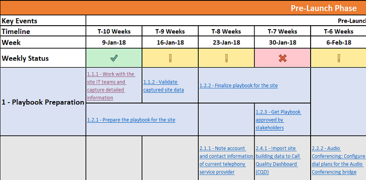

# Déployer mon service

Cet article donne une vue d’ensemble des conditions requises pour déployer correctement les services vocaux cloud. En suivant des instructions en exposant pour le déploiement des services vocaux cloud, vous pouvez vous assurer de prendre en compte toutes les exigences et d’obtenir des résultats répétés.

## Manuel d’enablement de site pour les Microsoft Teams de travail vocales

Utilisez ce manuel pour aider votre organisation à planifier et exécuter correctement le déploiement des fonctionnalités vocales Microsoft Teams site par site.

Comprenant toutes les activités requises, les chronologies recommandées et des liens vers des recommandations correspondantes pour chaque activité, ce manuel couvre les conseils de bout en bout pour assurer la réussite d’un déploiement vocal Teams pour un site donné, en se concentreant sur les facteurs qui sont importants pour l’utilisateur.

En complétant les activités de ce manuel, votre organisation peut :

-   Planifiez et planifiez efficacement votre Teams déploiement.

-   Optimisez et optimisez l’adoption par les utilisateurs.

-   Réduisez les besoins de support et augmentez la satisfaction des utilisateurs.

> [!NOTE]
> Cet article et le manuel associé ne sont pas destinés à décrire toutes les étapes de configuration technique requises pour l’enablement du service ou la fourniture de numéros de numérotation à un site spécifique. Au lieu de cela, ils se concentrent sur les activités et les tâches recommandées pour intégrer facilement les utilisateurs et leur faire commencer à consommer des charges de travail Teams vocales par le biais d’une transition rapide et fluide avec un taux d’adoption élevé, tout en réduisant les exigences de support. Pour obtenir des conseils techniques sur la configuration de votre environnement pour voix Teams au mieux, consultez les listes de contrôle d’intégration pour configurer les charges de travail [vocales d’Teams,](onboarding-checklist-configure-cloud-voice-workloads-in-Microsoft-Teams.md)la configuration du routage direct dans [Teams,](onboarding-checklist-configure-direct-routing-in-Microsoft-Teams.md)les fonctionnalités principales de [Teams,](onboarding-checklist-configure-microsoft-teams-core-capabilities.md)la mise en réseau de [Teams](prepare-network.md)et l’activation de Microsoft 365 ou [Office 365.](onboarding-checklist-enable-office-365.md)

<!--ENDOFSECTION-->

## Zones de focus du manuel

L’objectif du manuel est de traiter les facteurs qui influencent la vision de l’utilisateur d’un déploiement Teams voix. Les activités et les tâches sont regroupées dans les zones de focus suivantes :

-   Validation de la disponibilité du service
    - Audioconférence
    - Forfaits d’appel
    - Routage direct

-   Enablement utilisateur

-   Points de terminaison

-   Utilisation et qualité

-   Adoption

Le [manuel d’enablement de site pour voix (Playbook)](https://github.com/MicrosoftDocs/OfficeDocs-SkypeForBusiness/blob/live/Teams/downloads/site-enablement-playbook-for-voice-(playbook).xlsx?raw=true) est un Microsoft Excel de travail. Chacun de ces cinq zones de focus est une feuille distincte dans le manuel, et chaque tâche et activité de déploiement est regroupée sur l’une de ces feuilles.

> [!NOTE]
> Vous devez créer une instance distincte du manuel pour chaque site dans l’étendue de votre déploiement Teams lecture.

<!--ENDOFSECTION-->

## Comment utiliser le manuel

Quelle que soit la taille et la complexité de l’emplacement, l’activation de chaque site nécessite que vous planniez vos tâches et activités suffisamment tôt et que vous les exécutez dans un ordre optimal, avant, pendant et après le déploiement réel du service. Nous vous recommandons de suivre ces étapes lorsque vous planifiez et exécutez votre propre voyage pour Microsoft Teams voix.

1. Téléchargez [le manuel d’enablement de site pour voix (Playbook)](https://github.com/MicrosoftDocs/OfficeDocs-SkypeForBusiness/blob/live/Teams/downloads/site-enablement-playbook-for-voice-(playbook).xlsx?raw=true) Microsoft Teams Voice.

2. Créez une copie distincte du manuel pour chaque site.

3. Dans l’onglet de la feuille nommée **Playbook pour {SiteName-Code},** remplacez **{SiteName-Code}** par le nom et/ou le code de site appropriés.

4. Entrez le **nom du site, le code du site** et la date de lancement **planifié,** comme illustré ci-dessous. Il s’agit d’une étape critique, car elle ajuste les délais recommandés pour chaque activité dans le manuel.

   

5. Examinez chaque activité, prenez les mesures nécessaires et mettez à jour l’état à mesure que vous vous y promenez dans la chronologie. L’état est représenté graphiquement, comme décrit ci-dessous :
  
   -  **applicable (vert)** : l’activité est terminée ou n’est pas applicable à ce site et aucune autre action n’est requise.</li>
   -  <strong>L’activité n’est</strong> pas encore terminée (jaune) : l’activité n’a pas encore été effectuée et doit être mise à jour sur Oui ou Non dans son planning.</li>
   -  <strong></strong> d’état du projet.</li></ul>

6. L’état est déployé dans chaque section et le titre de section est mis en forme avec l’un de ces indicateurs d’état. **L’état** hebdomadaire est également mis à jour automatiquement.

> [!TIP]
> Répétez les étapes ci-dessus pour tous vos emplacements.

> [!IMPORTANT]
> Certaines étapes peuvent ne pas être applicables à tous les emplacements et sites. Si une activité spécifique n’est pas pertinente pour un site, vous devez sélectionner **Non applicable** pour cette activité. **NE SUPPRIMEZ AUCUNE** ligne du manuel ; Si c’est le cas, les formules de rapport d’état ne fonctionnent pas.  
Faites attention aux activités qui peuvent prendre plus de temps que prévu, telles que les activités de portage de numéro et d’approvisionnement. Ces activités peuvent affecter négativement la chronologie du déploiement du site. Veillez à examiner et à mettre à jour la  liste des activités et la chronologie associée de façon hebdomadaire, et à les présenter lors de réunions de comité spécial pour vous assurer que les parties prenantes sont conscientes de l’état de chaque site et des écarts possibles par rapport à la planification du déploiement.

<table>
<tr><td>  Points de décision</td><td><ul><li>Déterminez si le manuel d’enablement de site est requis pour votre déploiement.</li><li>Décidez qui sera responsable de la personnalisation du manuel d’Microsoft Teams pour chaque site que vous allez déployer.</li></ul></td></tr>
<tr><td> Étapes suivantes</td><td><ul><li><a href="https://github.com/MicrosoftDocs/OfficeDocs-SkypeForBusiness/blob/live/Teams/downloads/site-enablement-playbook-for-voice-(playbook).xlsx?raw=true" data-raw-source="[Download the Site Enablement Playbook](https://github.com/MicrosoftDocs/OfficeDocs-SkypeForBusiness/blob/live/Teams/downloads/site-enablement-playbook-for-voice-(playbook).xlsx?raw=true)">Téléchargez le manuel d’enablement de site.</a></li><li>Personnalisez le manuel d’enablement de site pour votre premier site.</li><li>Répétez l’une des répétitions nécessaires pour d’autres sites.</li></ul></td></tr>
</table>

<!--ENDOFSECTION-->