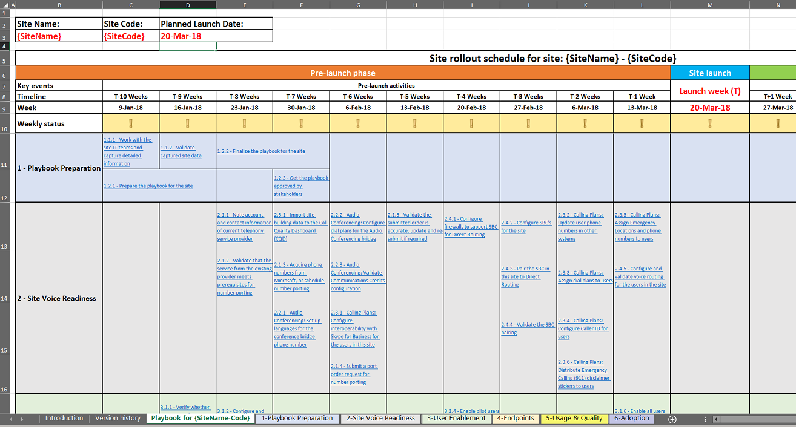

# Déployer mon serviceDeploy my service

Cet article donne une vue d’ensemble de la configuration requise pour le déploiement des services en nuage voix correctement.This article gives an overview of the requirements for properly deploying cloud voice services. En suivant les conseils pour le déploiement de services de téléphonie de nuage, vous pouvez vous assurer vous avec succès toutes les exigences de compte et fournir des résultats répétables.By following prescriptive guidance for deploying cloud voice services, you can make sure you successfully account for all requirements and deliver repeatable results.

## Manuel de prise en charge de site pour les charges de travail Teams de Microsoft voiceSite enablement playbook for Microsoft Teams voice workloads

Ce manuel permet d’aider votre entreprise à planifier et exécuter le déploiement de fonctionnalités vocales de Microsoft Teams sur une base site par site.Use this playbook to help your organization successfully plan and execute the rollout of Microsoft Teams voice features on a site-by-site basis.

Y compris toutes les activités, recommandé de chronologies et des liens correspondants de recommandations pour chaque activité, ce manuel traite des conseils de bout en bout pour garantir un déploiement réussi de voix équipes pour un site donné, en mettant l’accent sur des facteurs qui sont importants pour l’utilisateur.Including all required activities, recommended timelines, and links to corresponding guidance for each activity, this playbook covers end-to-end guidance to help ensure a successful Teams voice deployment for a given site, focusing on factors that are important to the user.

En effectuant les activités dans ce manuel, votre entreprise peut :By completing the activities in this playbook, your organization can:

-   Planifier et planifier le déploiement de vos équipes de manière efficace.Effectively plan and schedule your Teams rollout.

-   Accélérez et optimisez l’adoption par les utilisateurs.Accelerate and optimize user adoption.

-   Réduire les besoins en support et accroître la satisfaction de l’utilisateur.Reduce support needs and increase user satisfaction.

> [!NOTE]
> Cet article et le manuel associé ne sont pas destinés à décrire chaque étape de la configuration technique requise pour l’activation des services ou fourniture de tonalité à un site spécifique.This article and the associated playbook aren’t intended to describe every technical configuration step required for service enablement or providing dial tone to a specific site. À la place, ils se concentrent sur les activités et tâches recommandés aux utilisateurs intégrés facilement et les commence à consommer des charges de travail aux équipes voix via une transition rapide et sans heurts avec un fort engouement, tout en réduisant les exigences en matière de prise en charge.Instead, they focus on activities and tasks recommended to onboard users easily and have them start consuming Teams voice workloads through a fast and smooth transition with a high adoption rate, while minimizing support requirements. Pour des conseils sur la meilleure façon de configurer votre environnement pour la voix d’équipes techniques, reportez-vous à l’intégration des listes de contrôle pour la [Configuration des charges de travail aux équipes voice](https://docs.microsoft.com/MicrosoftTeams/onboarding-checklist-configure-cloud-voice-workloads-in-Microsoft-Teams), [les fonctionnalités de base aux équipes](https://docs.microsoft.com/MicrosoftTeams/onboarding-checklist-configure-microsoft-teams-core-capabilities), [mise en réseau pour les équipes](https://docs.microsoft.com/MicrosoftTeams/onboarding-checklist-configure-networking)et [l’activation d’Office 365 ](https://docs.microsoft.com/MicrosoftTeams/onboarding-checklist-enable-office-365).For technical guidance on how to best configure your environment for Teams voice, see the onboarding checklists for [configuring Teams voice workloads](https://docs.microsoft.com/MicrosoftTeams/onboarding-checklist-configure-cloud-voice-workloads-in-Microsoft-Teams), [Teams core capabilities](https://docs.microsoft.com/MicrosoftTeams/onboarding-checklist-configure-microsoft-teams-core-capabilities), [networking for Teams](https://docs.microsoft.com/MicrosoftTeams/onboarding-checklist-configure-networking), and [enabling Office 365](https://docs.microsoft.com/MicrosoftTeams/onboarding-checklist-enable-office-365).

<!--ENDOFSECTION-->

## Domaines manuelPlaybook focus areas

Le manuel vise à relever les facteurs qui influencent la perception de l’utilisateur d’un déploiement de voix d’équipes.The focus of the playbook is to address the factors that influence the user’s perception of a Teams voice deployment. Les tâches et les activités sont regroupées dans les domaines suivants :Activities and tasks are grouped into the following focus areas:

-   Validation de la disponibilité du serviceValidation of service readiness

-   Activation de l’utilisateurUser enablement

-   Points de terminaisonEndpoints

-   L’utilisation et la qualitéUsage and quality

-   AdoptionAdoption

Le [Manuel d’activation de Site pour la voix (manuel)](https://github.com/MicrosoftDocs/OfficeDocs-SkypeForBusiness/blob/live/Teams/downloads/site-enablement-playbook-for-voice-(playbook).xlsx?raw=true) est un classeur Microsoft Excel.The [Site Enablement Playbook for Voice (Playbook)](https://github.com/MicrosoftDocs/OfficeDocs-SkypeForBusiness/blob/live/Teams/downloads/site-enablement-playbook-for-voice-(playbook).xlsx?raw=true) is a Microsoft Excel workbook. Chacun de ces cinq domaines est une feuille distincte dans le classeur, et chaque tâche de déploiement et les activités sont regroupées sur l’une de ces feuilles.Each of these five focus areas is a separate sheet in the workbook, and each deployment task and activity is grouped onto one of these sheets.

![Capture d’écran du manuel] (media/deploy-my-service-image1.png "Capture d’écran du manuel")

> [!NOTE]
> Vous allez créer une instance distincte de la manuel pour chaque site dans la portée de votre déploiement d’équipes.You’ll create a separate instance of the playbook for each site in scope for your Teams rollout.

<!--ENDOFSECTION-->

## Comment utiliser le manuelHow to use the playbook

Quelle que soit la taille et la complexité de l’emplacement, l’activation de chaque site nécessite que vous planifiez vos tâches et vos activités suffisamment tôt et de les exécuter dans l’ordre optimal : avant, pendant et après le déploiement du service proprement dit.Regardless of the size and complexity of the location, enabling each site requires that you plan your tasks and activities early enough—and execute them in optimal order—before, during, and after the actual service rollout. Nous vous recommandons de suivre ces étapes de planifier et d’exécuter votre propre parcours à voix de Teams de Microsoft.We recommend that you follow these steps as you plan and execute your own journey to Microsoft Teams voice.

1.  Téléchargez le [manuel d’activation de Site pour la voix (manuel)](https://github.com/MicrosoftDocs/OfficeDocs-SkypeForBusiness/blob/live/Teams/downloads/site-enablement-playbook-for-voice-(playbook).xlsx?raw=true) pour les équipes Microsoft Voice.Download the [Site Enablement Playbook for Voice (Playbook)](https://github.com/MicrosoftDocs/OfficeDocs-SkypeForBusiness/blob/live/Teams/downloads/site-enablement-playbook-for-voice-(playbook).xlsx?raw=true) for Microsoft Teams Voice.

2.  Créer une copie distincte de la manuel pour chaque site.Create a separate copy of the playbook for each site.

3.  Sous l’onglet de la feuille intitulée **manuel pour le Code {SiteName}**, remplacez **{Nom de site-Code}** avec le nom du site approprié et/ou le code de site.On the tab for the sheet named **Playbook for {SiteName-Code}**, replace **{SiteName-Code}** with the relevant site name and/or site code.

4.  Entrez le **nom du Site, code de Site**et la **date de lancement prévue**, comme illustré ci-dessous.Enter the **Site name, Site code**, and **Planned launch date**, as illustrated below. Il s’agit d’une étape essentielle, car elle ajuste les délais recommandés pour chaque activité dans le manuel.This is a critical step, because it adjusts the recommended deadlines for every activity in the playbook.

    ![Exemple de nom de site de New York, NY01, le code de site et date de lancement prévue de 20-Mar-18] (media/deploy-my-service-image2.png "Exemple de nom de site de New York, NY01, le code de site et date de lancement prévue de 20-Mar-18")

5.  Passez en revue chaque activité, prennent les mesures nécessaires et mettre à jour le statut que vous passez en revue le scénario.Review each activity, take necessary actions, and update the status as you walk through the timeline. État est représenté graphiquement, comme décrit ci-dessous :Status is represented graphically, as described below:
    <ul>
    <li> **Oui ou non applicable (vert) :** l’activité a été achevée, ou il n’est pas applicable à ce site, et aucune action supplémentaire n’est nécessaire. **Yes, or not applicable (green):** The activity has been completed, or it’s not applicable for this site, and no further action is needed.</li>
    <li> **l’activité n’est pas achevée encore (jaune) :** l’activité n’a pas encore terminée et il doit être mis à jour à Oui ou non selon sa planification. **The activity isn’t completed yet (yellow):** The activity hasn’t been completed yet, and must be updated to Yes or No on its schedule.</li>
    <li> **Aucun (rouge) :** l’activité ne peut pas être terminée en raison d’un problème et doit être exécutée à la réunion. **No (red):** The activity can’t be completed because of an issue and must be carried to the project status meeting.</li></ul>

6.  Le statut est reporté dans chaque section, et l’en-tête de section est mis en forme avec l’un de ces indicateurs d’état.The status is rolled up within each section, and the section heading is formatted with one of these status indicators. **Rapport hebdomadaire** est également mis à jour automatiquement.**Weekly status** is also updated automatically.

![Capture d’écran du hebdomadaire état roll-ups dans le manuel] (media/deploy-my-service-image6.png "Capture d’écran du hebdomadaire état roll-ups dans le manuel")

> [!TIP]
> Répétez les étapes ci-dessus pour tous les emplacements que vous avez.Repeat the steps above for all the locations you have.

> [!IMPORTANT]
> Certaines étapes n’est peut-être pas applicables à tous les sites et emplacements.Some steps might not be applicable to all locations and sites. Si une activité donnée ne correspond pas à un site, vous devez sélectionner **non applicable** pour cette activité.If a specific activity isn’t relevant to a site, you must select **Not applicable** for this activity. **Ne supprimez pas** les lignes dans le manuel ; Dans ce cas, les formules de cumul d’état ne fonctionnent pas.**DO NOT DELETE** any rows in the playbook; if you do, the status roll-up formulas won’t work.  
Faites attention aux activités qui peuvent prendre plus de temps que vous prévues, telles que le portage des numéros et des activités d’approvisionnement.Pay attention to activities that might take more time than you planned for, such as number porting and procurement activities. Ces activités peuvent une incidence négative sur la barre de planning de déploiement de site.These activities can negatively affect the site deployment timeline. Veillez à passer en revue et mettre à jour la liste des activités et la chronologie associée toutes les semaines, les présenter aux [réunions du comité de direction](https://docs.microsoft.com/MicrosoftTeams/envision-steering-committee-complete-guide) pour vous assurer que les parties prenantes sont informés de l’état de chaque site et tous les écarts possibles à partir de la planification du déploiement.Be sure to review and update the activity list and the associated timeline weekly, and present them at [steering committee meetings](https://docs.microsoft.com/MicrosoftTeams/envision-steering-committee-complete-guide) to ensure that stakeholders are aware of the status of each site and any possible deviations from the deployment schedule.

<table>
<tr><td>  Points de décisionDecision points</td><td><ul><li>Décider si le manuel de prise en charge du Site est nécessaire pour votre déploiement.Decide if the Site Enablement Playbook is required for your deployment.</li><li>Déterminer qui sera responsable de la personnalisation de la manuel d’activation de Site pour le Teams de Microsoft pour tous les sites que vous allez déployer.Decide who will be responsible for customizing the Site Enablement Playbook for Microsoft Teams for every site you'll deploy.</li></ul></td></tr>
<tr><td> Étapes suivantesNext steps</td><td><ul><li>Téléchargez le manuel de prise en charge du Site.Download the Site Enablement Playbook.</li><li>Personnaliser le manuel de gestion de Site pour votre site premier.Customize the Site Enablement Playbook for your first site.</li><li>Répétez si nécessaire pour les sites supplémentaires.Repeat as needed for additional sites.</li></ul></td></tr>
</table>

<!--ENDOFSECTION-->