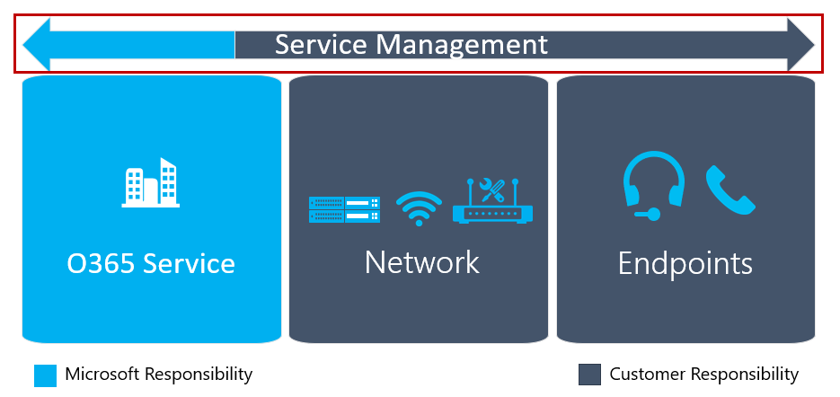

# Planifier ma gestion des services

Cet article donne une vue d'ensemble des conditions nécessaires à la livraison et au maintien d'un déploiement de Microsoft Teams de haute qualité. Vous pouvez aider à assurer un déploiement réussi en planifiant la gestion et la qualité du service pendant la phase de Conception, avant votre premier déploiement pilote ou de production.

## Gestion des services de Teams

La gestion des services est un vaste sujet qui couvre les opérations quotidiennes du service Microsoft Teams après son déploiement et son activation pour les utilisateurs. Le service Teams englobe Microsoft Office 365 et les composants d'infrastructure déployés sur site (par exemple, la mise en réseau).

La notion de gestion des services n'est probablement pas un concept nouveau pour la plupart des organisations. Vous avez probablement déjà mis en œuvre des processus et des tâches qui sont associés à des services existants. Cela dit, vous pouvez probablement augmenter ce que vous avez en place lorsque vous planifiez la gestion des services aujourd'hui pour soutenir Microsoft Teams à l'avenir.

La gestion des services englobe toutes les activités et processus impliqués dans la gestion de bout en bout de Microsoft Teams. Certaines composantes de la gestion des services - les composantes de l'infrastructure que le service Office 365 comprend lui-même, relèvent de la responsabilité de Microsoft, alors que le client est responsable devant ses utilisateurs de la gestion des différents aspects de Teams, du réseau et des points de terminaison qu'il fournit.
Pour une analyse détaillée de la responsabilité du client quant à la gestion du service Teams et de son incidence sur les principales composantes qui contribuent à la qualité de l’expérience utilisateur, reportez-vous à la rubrique [Plan de gestion du service et de la qualité](https://docs.microsoft.com/MicrosoftTeams/envision-planning-for-service-management-and-quality-complete-guide).

<!--ENDOFSECTION-->

## Introduction au Guide des opérations 

**Quoi**, **Qui** et **Comment** sont trois questions importantes auxquelles il faut répondre lorsqu'il s'agit de la gestion des services.

Vous pouvez utiliser le [Guide des opérations](https://docs.microsoft.com/MicrosoftTeams/1-drive-value-operate-my-service) pour vous aider à répondre à ces trois questions. Le guide fournit une liste d'activités à réaliser sur une base quotidienne, hebdomadaire, mensuelle et selon les besoins. Ces activités et tâches sont essentielles au maintien d'un déploiement de Teams de haute qualité. Déterminer qui sera responsable de l'exécution d'activités spécifiques dans la gestion des services est un aspect critique de votre planification que vous devez entreprendre au début de la phase de conception afin d'assurer un déploiement réussi. Une fois les tâches et les activités déterminées, elles doivent être comprises et suivies par les groupes ou les individus que vous leur assignez. Le Guide des opérations fournit des connaissances et des conseils sur la façon d'exécuter chacune des tâches et/ou des références à des contenus extérieurs.

## Plan de mappage des rôles opérationnels

La planification précoce de la gestion des services est une étape critique, car la phase d'exploitation commence lorsque les premiers utilisateurs pilotes sont activés. L'équipe de projet doit examiner et s'entendre sur les tâches et les activités requises, identifier l'équipe responsable de chaque tâche opérationnelle, puis obtenir l'engagement et l'approbation de chaque équipe respective.

Une fois l'approbation terminée, l'équipe responsable doit alors commencer à mettre en œuvre ces rôles et responsabilités. Cela peut comprendre la formation et l'état de préparation, la mise à jour du modèle de dotation ou l'assurance que les partenaires externes sont prêts à livrer la marchandise.

Le mappage des rôles opérationnels au début de la phase de conception permet à toutes les équipes de commencer leurs tâches opérationnelles pendant la phase pilote, d'accélérer les opérations et de s'assurer que tout est prêt après le début du déploiement.

Le Guide des opérations fournit une liste des tâches communes mappées aux rôles typiques qui devraient être valides dans la plupart des scénarios. Vous devez personnaliser ces responsabilités pour travailler pour votre organisation.

>[!TIP]
>Voici un exemple de modèle de documentation du résultat du mappage des rôles opérationnels que vous avez réalisé pour prendre en charge ce projet.

|Rôle opérationnel |Description |Équipe |Détails du contact |
|---------|---------|---------|---------|
|Propriétaire de service|Propriétaire de service, interface avec les divisions de l’entreprise, stratégie|TBA|TBA|
|Opérations d’audioconférence|Opérations quotidiennes, déplacement/ajout/modification des comptes d’utilisateurs et d’appareils, supervision|TBA| TBA| 
|Administration des clients|Modifier les paramètres à l'échelle du client, activer les nouvelles fonctions|TBA|TBA|
|Support technique|Interface permettant aux utilisateurs d’obtenir un support|TBA|TBA|
|Opérations réseau|Exécuter l’accès au réseau local, WAN, Wi-Fi et internet|TBA|TBA|
|Équipe responsable des points de terminaison de client|Gérer les déploiements de bureau|TBA|TBA|
|Opérations d’identité|Gérer l’infrastructure d’identité (Active Directory, services de fédération Active Directory, Azure AD)|TBA|TBA|
|Adoption/gestion des changements|Gérer la sensibilisation, la formation et l’adoption de la solution|TBA|TBA|
|Opérations Exchange|Gérer l’environnement Exchange|TBA|TBA|
|Opérations de téléphonie|Gérer le SBC et les numéros de téléphone|TBA|TBA|

Pour permettre un mappage des rôles opérationnels plus détaillé, incluant les tâches associées à chaque rôle opérationnel, vous pouvez utiliser le [Classeur de mappage des rôles opérationnels](https://myadvisor.fasttrack.microsoft.com/CloudVoice/Downloads?SelectedIDs=4_4_0_16) pour capturer les détails qui permettront d’avoir une vision claire des rôles et responsabilités pour la prise en charge des charges de travail Voix Cloud.

<!--ENDOFSECTION-->

## Le rôle de Champion de la qualité

Un groupe ou un individu doit être responsable de la qualité dans toutes les organisations.
Il s'agit du rôle le plus important dans la gestion des services. Le champion de la qualité est un rôle de client attribué à une personne ou à un groupe passionné par l'expérience de ses utilisateurs. Ce rôle exige les compétences nécessaires pour cerner les tendances de l'environnement et le parrainage pour travailler avec d'autres équipes afin d'orienter les mesures correctives.
Le meilleur candidat pour le champion de la qualité est généralement le propriétaire du service-clients qui, en fonction de la taille et de la complexité de l'organisation, peut être toute personne ou tout groupe passionné par l'expérience utilisateur.

Le champion de la qualité s'appuie sur les outils existants et les processus documentés, comme le Tableau de bord de la qualité des appels (CQD) et le Guide d'examen de l'expérience de la qualité, afin de surveiller l'expérience utilisateur, identifier les tendances de la qualité et mettre en œuvre, le cas échéant, des mesures correctives. Le champion de la qualité doit collaborer avec les équipes respectives pour mettre en place des mesures correctrices, en fournissant des rapports à un comité directeur sur la progression et les problèmes ouverts.

Les tâches et les activités associées à ce rôle ont été documentées dans le Guide des opérations. Ce rôle devrait être assigné au début de la phase de conception. Une étape clé dans la mise en œuvre du rôle de champion de la qualité consiste à acquérir les connaissances requises pour ce rôle et à s'assurer que les conditions préalables sont en place pour accomplir les tâches. L'une des tâches clés de ce rôle est d'effectuer un examen régulier de l'expérience de la qualité.

<!--ENDOFSECTION-->

## Introduction au Guide d'examen de l'expérience de la qualité

Le Guide d'examen de l'expérience de la qualité comporte un ensemble d'activités qui évaluent et fournissent des conseils en matière de correction dans les domaines clés qui ont le plus grand impact sur l'amélioration de l'expérience utilisateur, comme le montre la figure ci-dessous.

En évaluant et en corrigeant continuellement les zones décrites dans ce document, vous pouvez réduire leur potentiel d'affecter négativement l'expérience utilisateur. La plupart des problèmes d'expérience utilisateur rencontrés lors d'un déploiement peuvent être regroupés dans les catégories suivantes :

-   Configuration incomplète du pare-feu ou du proxy

-   Faible couverture Wi-Fi

-   Bande passante insuffisante

-   VPN

-   Utilisation d'appareils audio non optimisés ou intégrés

-   Sous-réseaux ou périphériques réseau problématiques

Les conseils fournis dans le Guide d'examen de l'expérience de qualité portent sur l'utilisation du CQD en ligne comme outil principal pour rapporter et enquêter sur chaque domaine décrit, en mettant l'accent sur l'audio pour maximiser l'adoption et l'impact. Toutes les optimisations apportées au réseau pour améliorer l'expérience audio se traduiront aussi directement par des améliorations dans le partage de la vidéo et du bureau.

Nous vous recommandons fortement de nommer le champion de la qualité le plus tôt possible. Une fois nommé, il doit commencer à se familiariser avec le contenu du [Guide d'examen de la qualité de l'expérience](https://aka.ms/qerguide).

<table>
<tr><td>  Points de décision</td><td><ul><li>Décidez de la personne responsable des opérations Voix Cloud dans votre organisation.</li></ol></td></tr>
<tr><td> Étapes suivantes</td><td><ul><li>Téléchargez le Guide complet de la planification de la gestion des services.</li><li>Téléchargez le Guide d'examen de l'expérience de la qualité.</li><li>Consultez en détail le Guide des opérations.</li><li>Fournissez tous les guides à tous les membres de l’équipe pour leur permettre de se familiariser avec les conditions requises pour les opérations.</li></ol></td></tr>
</table>

<!--ENDOFSECTION-->