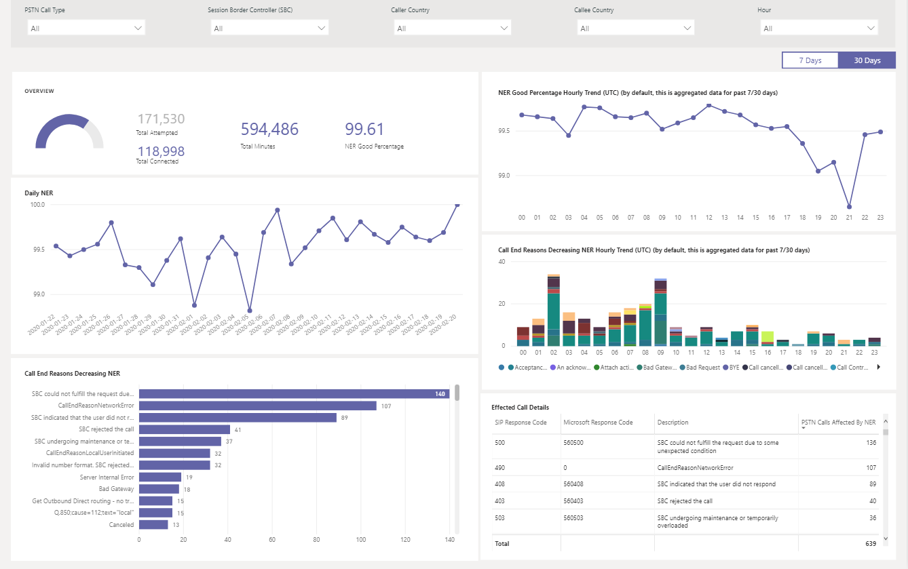

# Utilisation du rapport de routage direct RTC bord

Nouveauté du 2020 mars, nous avons ajouté un rapport de routage direct RTC bord aux [modèles de requête Power bi pour bord](https://github.com/MicrosoftDocs/OfficeDocs-SkypeForBusiness/blob/live/Teams/downloads/CQD-Power-BI-query-templates.zip?raw=true). 

Le rapport de routage direct RTC de bord (bord RTC direct Routing. PBiT) vous aide à comprendre les modèles d’utilisation et la qualité de vos services RTC. Utilisez ce rapport pour contrôler l’utilisation du service, les informations relatives à votre contrôleur de bordure de session (SBC), au service de téléphonie, aux paramètres réseau et aux détails du rapport d’efficacité réseau. Ces informations peuvent vous aider à identifier les problèmes, notamment le motif des appels interrompus. Par exemple, vous pouvez voir le nombre de chutes de volume ou le nombre d’appels qui sont affectés et la raison pour laquelle vous vous trouvez.

Le rapport de routage direct RTC de bord comporte quatre sections :

  - [Présentation RTC](#pstn-overview)

  - [Détails du service](#service-details)

  - [Taux d’efficacité du réseau](#network-effectiveness-ratio)

  - [Paramètres réseau](#network-parameters)

## Annonces

1. Analyser par type d’appel, SBC, appelant et pays de l’appelé

   Le rapport de routage direct RTC de bord agrège les métriques de fiabilité et d’utilisation de tous les éléments SBCs de votre client pour les derniers 7, 30 ou 180 (6 mois). Vous pouvez analyser les données par type d’appel, SBC, appelant et pays de l’appelant. Si vous êtes intéressé par un SBC ou un pays particulier, vous serez en mesure d’identifier les changements dans les tendances au cours de la période sélectionnée.
   :::image type="content" source="media/CQD-PSTN-report8.png" alt-text="Capture d’écran de filtres disponibles dans le rapport de routage direct RTC bord":::
   
2. Suivi des tendances

    L’analyse des tendances est essentielle lorsque l’on tente de comprendre l’utilisation et la fiabilité des services. Les tendances horaires permettent de mieux cerner les performances journalières, ce qui permet d’identifier les incidents en temps réel. Les tendances journalières vous permettent d’afficher l’état de votre service sur une perspective à long terme. Il est important de pouvoir passer d’un mode à l’autre en bénéficiant d’une granularité appropriée aux données. Le rapport de routage direct RTC bord fournit une vue d’ensemble des tendances de 6 mois, des tendances journalières de 7 et 30 jours et des tendances horaires pour vous permettre d’analyser les performances à chaque niveau.
    :::image type="content" source="media/CQD-PSTN-report9.png" alt-text="Capture d’écran de graphes de tendances dans bord rapport de routage direct RTC":::

3. Extraire vers le niveau de SBC ou d’utilisateur

   Nous avons créé dans le cadre de la fonctionnalité d’exploration sur de nombreuses catégories de données dans bord, qui vous permettent de mieux comprendre la distribution de l’utilisation et de la fiabilité au niveau du SBC ou de l’utilisateur. Grâce à l’extraction, vous pouvez rapidement poinpoint des problèmes et comprendre un impact réel sur l’utilisateur. Les fonctionnalités du rapport de routage direct RTC de bord analysent les détails relatifs au service et aux métriques du rapport d’efficacité réseau. Cliquez sur le point de données qui vous intéresse pour extraire des détails au niveau utilisateur ou SBC.
   :::image type="content" source="media/CQD-PSTN-report10.png" alt-text="Capture d’écran illustrant la fonctionnalité d’exploration sur un point de données":::

## Présentation RTC

Le rapport de routage direct RTC bord fournit les informations suivantes relatives à l’intégrité globale du service au cours des derniers jours 180.

Par exemple, si vous êtes intéressé par l’utilisation globale et l’intégrité de tous les appels entrants à l’aide de SBC abc.bca.adatum.biz en tant que pays interne :

| **Appel hors** | **Description**                                                                                                                                                 |
| ------------ | --------------------------------------------------------------------------------------------------------------------------------------------------------------- |
| 1            | Vous pouvez utiliser les filtres en haut pour descendre dans la direction et sélectionner ByotIn en tant que type d’appel, abc.bca.contoso.com en tant que contrôleur de tableau de bord, et vers les États-Unis comme pays interne. |
| 2            | Tendance d’utilisation pour les 180 derniers jours. Le rapport sur les détails d’utilisation est sur la page des détails du service.                                                                     |
| 3            | Envoyez un message de délai de numérotation, de latence, de gigue et de tendance de perte de paquets pour les 180 derniers jours. Vous trouverez le rapport détaillé sur la page Paramètres du réseau.                           |
| 4            | Tendance pour les appels simultanés et les utilisateurs actifs du jour au cours des 180 derniers jours. Ce graphique peut vous aider à comprendre le volume maximal du service.                            |
| 5            | Raison de la qualité de service affectée par le top des appels pour les 180 derniers jours. Pour plus d’informations sur l’état du service, consultez la page NER (Network effective ratio).                    |

## Détails du service

Cette page vous permet d’obtenir des tendances d’utilisation du service par jour et de décomposition des commentaires des utilisateurs par géographie.

  - **Nombre total de tentatives d’appels –** Nombre total de tentatives d’appels dans cette plage de temps, y compris les appels réussis et failed

  - **Nombre total d’appels connectés** Nombre total d’appels connectés dans cet intervalle de temps

  - **Nombre total de minutes –** Utilisation du total des minutes dans cet intervalle de temps

  - **Utilisateurs actifs quotidiens (DAU) :** Nombre d’utilisateurs actifs du jour qui ont effectué au moins un appel connecté à ce jour

  - **Appels simultanés –** Maximum d’appels actifs simultanés en une minute

  - **Commentaires des utilisateurs –** Le score « évaluer mon appel » est fourni par l’utilisateur. 3-5 est considéré comme un bon appel. 1-2 est considéré comme un appel incorrect.

Par exemple :

1.  Si vous voyez que la durée moyenne des appels tombe à 0 sur 02/14/2020, vous pouvez commencer par vérifier si le volume de l’appel est normal et voir s’il y a une différence importante entre les appels de connexion et les appels de connexion au total. Puis accédez à la page taux d’efficience du réseau pour investir en raison de l’échec de l’appel.

2.  Si vous voyez l’augmentation du nombre de points rouges sur la carte de commentaires des utilisateurs, vous pouvez accéder à page du rapport d’efficacité réseau et au paramètre réseau pour voir s’il y a des anomalies et vous pouvez déclencher un ticket avec MS Service Desk.

## Taux d’efficacité du réseau

Il s’agit de la même métrique qui s’affiche dans le tableau de bord global de l’État. Vous pouvez vérifier le numéro NER en fonction des appels en fonction du nombre d’appels (entrant/sortant) sur le taux d’efficacité du réseau horaire et sur le graphique raison de fin de l’appel ci-dessous.

  - **Ner** -la capacité (%) un réseau pour transmettre les appels en mesurant le nombre d’appels envoyés au destinataire.

  - **Code de réponse SIP**: un code de réponse numérique à trois chiffres affiche l’état de l’appel.

  - **Code de réponse Microsoft**: code de réponse envoyé par le composant Microsoft.

  - **Description** : la phase de raison correspondant au code de réponse SIP et au code de réponse Microsoft.

  - **Nombre d’appels concernés** : le nombre total d’appels a été affecté au cours de la période sélectionnée.

> 
> 
Par exemple :

Si la NER quotidienne a une DIP sur 02/05/2020, vous pouvez cliquer sur la date et d’autres graphiques pour effectuer un zoom sur la date spécifique.

À partir du NER, vous pouvez trouver le DIP qui intervient dans 21:00. Cliquez de nouveau sur pour effectuer un zoom à l’heure 21, puis cochez la case Afficher les détails de l’appel pour voir le nombre d’appels ayant échoué pendant cette heure et les raisons de fin de l’appel. Si le problème n’est pas lié à SBC, vous pouvez démarrer avec l’auto-dépannage des problèmes de SBC ou d’État du service d’assistance technique.

## Paramètres réseau

Tous les paramètres réseau sont mesurés à partir de l’interface de routage directe vers le contrôleur de bordure de session. Pour plus d’informations sur les valeurs recommandées, voir [préparer le réseau de votre organisation à Microsoft teams](prepare-network.md), et observez les valeurs recommandées par Microsoft Edge pour le client.

  - **Gigue** : il s’agit de la mesure de milliseconde de la variation du délai de propagation du réseau, calculée entre deux points de terminaison utilisant le protocole RTCP (protocole de contrôle RTP).

  - **Perte de paquets** – est une mesure de paquets qui n’ont pas pu arriver ; Il est calculé entre deux points de terminaison.

  - **Latence** -(également connue sous le nom de « durée de l’aller-retour) » est la durée de réception d’un signal et la durée de réception de ce signal. Ce délai se compose des temps de propagation entre les deux points d’un signal.

> 

Par exemple :

Si vous voyez un pique-notes sur l’un des quatre graphiques (latence, instabilité, taux de perte de package, délai de numérotation après appel) pour une date spécifique (par exemple, latence sur 02/14/2020, cliquez sur le point de la date). Le graphique tendance en bas de la série est actualisé pour afficher le numéro horaire. Vous pouvez vérifier l’SBCs ou élever un ticket avec MS Service Desk.

## Sujets associés

[Utiliser Power BI pour analyser des données bord pour Microsoft teams](CQD-PSTN-report.md)