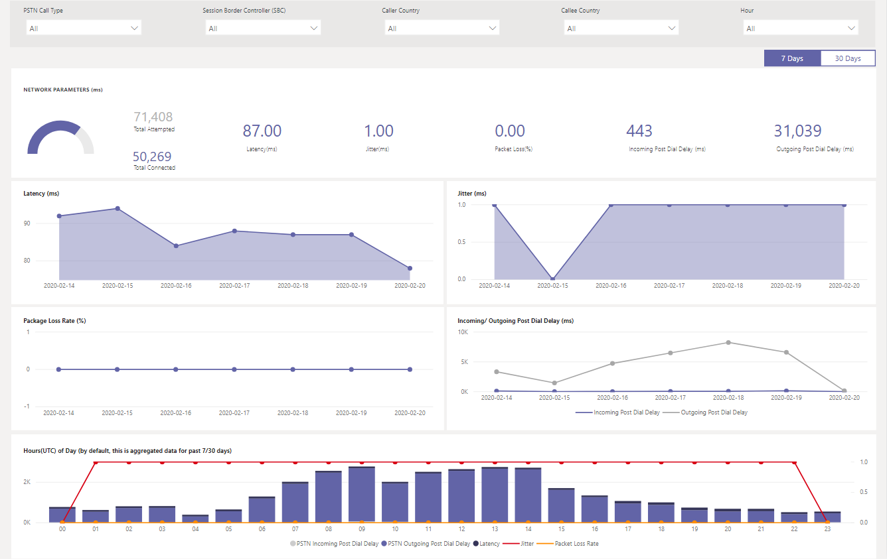

# Utilisation du rapport de routage direct PSTN du CQD

À partir de mars 2020, nous avons ajouté un rapport de routage direct du tableau de bord de qualité des appels Microsoft Teams (CQD) à nos [modèles](https://github.com/MicrosoftDocs/OfficeDocs-SkypeForBusiness/blob/live/Teams/downloads/CQD-Power-BI-query-templates.zip?raw=true)de requêtes Power BI téléchargeables pour le tableau de bord de qualité des appels. 

Le rapport de routage direct RQD (CQD PSTN Direct Routing Report.pbit) vous aide à comprendre les modèles d’utilisation et la qualité de vos services RQN. Utilisez ce rapport pour surveiller l’utilisation du service, des informations sur votre contrôleur de session border controller (SBC), le service téléphonique, les paramètres réseau et les détails du rapport d’efficacité du réseau. Ces informations peuvent vous aider à identifier les problèmes, notamment la raison pour laquelle des appels ont été supprimés. Par exemple, vous pouvez voir quand le volume diminue ou combien d’appels sont affectés et pour quelle raison.

Le rapport de routage direct PSTN du CQD se présente sous quatre sections :

  - [Vue d’ensemble PSTN](#pstn-overview)

  - [Détails du service](#service-details)

  - [Taux d’efficacité du réseau](#network-effectiveness-ratio)

  - [Paramètres réseau](#network-parameters)

## Temps forts

1. Analyser par type d’appel, SBC, appelant et pays de l’appelant

   Le rapport de routage RTC RTC agrège les mesures de fiabilité et d’utilisation pour tous les pc de service sur votre client au cours des 7, 30 ou 180 derniers jours (6 mois). Vous pouvez analyser les données par type d’appel, SBC, appelant et pays de l’appelant. Si vous êtes intéressé par un SBC ou un pays particulier, vous pourrez identifier les changements de tendances sur l’plage de temps sélectionnée.
   :::image type="content" source="media/CQD-PSTN-report8.png" alt-text="Capture d’écran des filtres disponibles dans le rapport de routage direct PSTN du CQD":::
   
2. Suivre les tendances

    L’analyse des tendances est essentielle pour tenter de comprendre l’utilisation et la fiabilité des services. Les tendances horaires donnent un œil sur les performances quotidiennes, ce qui permet d’identifier les incidents en temps réel. Les tendances quotidiennes vous viennent à l’état de votre service dans une perspective à long terme. Il est important de pouvoir passer d’un mode à l’autre avec la granularité des données appropriée. Le rapport de routage direct RQD fournit une vue d’ensemble des tendances sur 6 mois, des tendances quotidiennes sur 7 et 30 jours, et des tendances toutes les heures afin que vous pouvez analyser les performances à chaque niveau.
    :::image type="content" source="media/CQD-PSTN-report9.png" alt-text="Capture d’écran des graphiques de tendances dans le rapport de routage PSTN RQ":::

3. Drill through to SBC or user level

   Nous avons mis en place une fonctionnalité d’analyse par le détail sur de nombreuses catégories de données du CQD, ce qui vous permet de comprendre rapidement la distribution de l’utilisation ou de la fiabilité au niveau du jeu de données (SBC) ou de l’utilisateur. L’utilisation de l’outil d’évaluation vous permet de rapidement pointer des problèmes et de comprendre l’impact réel sur les utilisateurs. Les fonctionnalités du rapport de routage direct RQD analysent les mesures De détail du service et du rapport d’efficacité du réseau. Cliquez sur le point de données qui vous intéresse pour consulter les détails au niveau utilisateur ou SBC.
   :::image type="content" source="media/CQD-PSTN-report10.png" alt-text="Capture d’écran montrant la fonctionnalité d’analyse par analyse d’un point de données":::

## Vue d’ensemble PSTN

Le rapport de routage direct RQD fournit les informations suivantes sur l’état global du service au cours des 180 derniers jours.

Par exemple, si vous êtes intéressé par l’utilisation globale et l’état d’état de tous les appels entrants qui traversent des abc.bca.adatum.biz SBC avec les États-Unis comme pays interne :

| **Appeler** | **Description**                                                                                                                                                 |
| ------------ | --------------------------------------------------------------------------------------------------------------------------------------------------------------- |
| 1            | Vous pouvez utiliser les filtres dans la partie supérieure pour descendre dans la liste et sélectionner ByotIn comme type d’appel, abc.bca.contoso.com contrôleur de session et États-Unis comme pays interne. |
| 2            | Tendance d’utilisation au cours des 180 derniers jours. Le rapport des détails de l’utilisation se trouve sur la page Détails du service.                                                                     |
| 3            | Tendance de retard après la numérotation, de latence, de gigue et de perte de paquets au cours des 180 derniers jours. Vous pouvez trouver un rapport détaillé sur la page Paramètres réseau.                           |
| 4            | Tendance des appels simultanés et de l’utilisateur actif quotidien au cours des 180 derniers jours. Ce graphique peut vous aider à comprendre le volume maximum du service.                            |
| 5            | La principale raison de la fin des appels affecte la qualité du service au cours des 180 derniers jours. Vous trouverez des détails sur l’état du service sur la page Network Effective Ratio (NER).                    |

## Détails du service

Cette page présente les tendances d’utilisation des services par jour et le détail des commentaires des utilisateurs par géographie.

  - **Nombre total de tentatives d’appels –** Nombre total de tentatives d’appels dans ce plage de temps, y compris les appels réussis et les appels en échec

  - **Nombre total d’appels connectés -** Nombre total d’appels connectés dans ce délai

  - **Nombre total de minutes –** Utilisation totale des minutes dans cet plage

  - **Utilisateurs actifs quotidiens (DAU) –** Nombre d’utilisateurs actifs par jour ayant effectué au moins un appel connecté ce jour-là

  - **Appels simultanés –** Nombre maximum d’appels actifs simultanés en une minute

  - **Commentaires des utilisateurs –** La note « Évaluer mon appel » provient de l’utilisateur. 3-5 est considéré comme un appel bon. Le 1-2 est considéré comme un appel mauvais.

Par exemple :

1.  Si vous constatez que la durée moyenne de l’appel passe à 0 au 14/02/2020, vous pouvez tout d’abord vérifier si le volume d’appel semble normal et vérifier s’il existe une différence importante entre le nombre total d’appels de connexion et le nombre total d’appels tentés. Ensuite, sur la page Rapport d’efficacité du réseau, vous allez investir sur les raisons d’échec d’appel.

2.  Si vous remarquez des spots rouges croissants sur la carte de commentaires des utilisateurs, vous pouvez passer à la page Rapport d’efficacité du réseau et au paramètre réseau pour voir s’il existe des points de suite, et élever un ticket à l’aide de MS Service Desk.

## Taux d’efficacité du réseau

Il s’agit de la même valeur qui apparaît dans le tableau de bord État global. Vous pouvez vérifier toutes les heures le numéro de la zone NER avec les détails des appels affectés pour les deux itinéraires d’appel (entrant/sortant) sur le rapport d’efficacité du réseau toutes les heures et le graphique de raison de fin d’appel ci-dessous.

  - **NER** - Possibilité (%) d’un réseau de remettre des appels en mesurant le nombre d’appels envoyés par rapport au nombre d’appels remis à un destinataire.

  - **Code de réponse SIP**: code de réponse d’un nombre de trois chiffres indique le statut de l’appel.

  - **Code de réponse De Microsoft**- Code de réponse envoyé à partir du composant Microsoft.

  - **Description** – Phase de raison correspondant au code de réponse SIP et au code de réponse de Microsoft.

  - **Nombre d’appels affectés** – Nombre total d’appels affectés pendant l’plage de temps sélectionnée.

> 
> 
Par exemple :

Si la fonction NER quotidienne présente une baisse le 05/02/2020, vous pouvez cliquer sur la date pour que les autres graphiques effectuent un zoom sur cette date spécifique.

À partir de la tendance du pourcentage d’heures faible, la baisse se produit aux environs de 21:00. Cliquez à nouveau pour effectuer un zoom avant sur l’heure 21 et consultez les détails de l’appel pour voir le nombre d’appels qui ont échoué au cours de cette heure et quelles sont les raisons de la fin de l’appel. Vous pouvez commencer par vous-même résoudre les problèmes SBC ou signaler à Service Desk si le problème n’est pas lié à SBC.

## Paramètres réseau

Tous les paramètres réseau sont mesurés à partir de l’interface de routage direct vers le contrôleur de bordure de session. Pour plus [d’informations](prepare-network.md)sur les valeurs recommandées, voir Préparer le réseau de votre organisation pour Microsoft Teams et voir le bord du client pour Microsoft Edge valeurs recommandées.

  - **Gigue –** Mesure en millisecondes du retard de propagation réseau calculée entre deux points de terminaison à l’aide du protocole RTCP (protocole de contrôle RTP).

  - **Perte de paquets** – mesure du nombre de paquets qui n’ont pas réussi à arriver ; elle est calculée entre deux points de terminaison.

  - **Latence** - (également appelée durée des allers-retours) est la durée de l’envoi d’un signal, plus la durée de réception de l’accusé de réception de ce signal. Ce délai est constitué des heures de propagation entre les deux points d’un signal.

> 

Par exemple :

Si vous voyez un pic sur l’un des quatre graphiques (Latence, Gigue, Taux de perte de package, Retard après la numérotation) pour une date spécifique (par exemple, Latence le 14/02/2020), cliquez sur le point de date. Le graphique de tendance horaire au bas de la page sera actualisé pour afficher le nombre toutes les heures. Vous pouvez vérifier les SBCs ou lever un ticket auprès de MS Service Desk.

## Rubriques connexes

[Utiliser Power BI pour analyser les données du sous-Microsoft Teams](CQD-PSTN-report.md)

[Résolution des problèmes de Teams](/MicrosoftTeams/troubleshoot/teams)