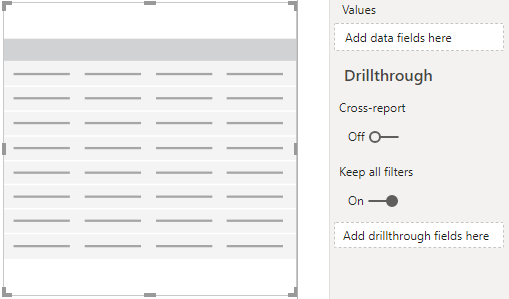

# Installer le connecteur Power BI pour utiliser des modèles de requête bord

Pour pouvoir utiliser les modèles de requête Power BI pour bord (fichiers PBIX), vous devez installer Power BI Connector pour Microsoft bord, à l’aide du fichier *MicrosoftCallQuality. pqx* inclus dans le [Téléchargement](https://github.com/MicrosoftDocs/OfficeDocs-SkypeForBusiness/blob/live/Teams/downloads/CQD-Power-BI-query-templates.zip?raw=true). 

Lire [Utilisez Power bi pour analyser les données de bord pour les équipes](CQD-Power-BI-query-templates.md) et en savoir plus sur ces modèles.

Vérifiez que vous avez le [rôle d’accès bord](https://docs.microsoft.com/microsoftteams/turning-on-and-using-call-quality-dashboard#assign-roles-for-accessing-cqd) approprié pour accéder aux rapports Power bi. 

## Installation

Pour plus d’informations sur l’installation d’un connecteur personnalisé et sur l’ajustement de la sécurité afin d’activer l’utilisation du connecteur, voir la [documentation relative à Power bi](https://docs.microsoft.com/power-bi/desktop-connector-extensibility). Par souci de simplicité, voici une explication rapide :

1.  Vérifiez si votre ordinateur possède déjà un dossier de * \[ \] \\ connecteurs de \\ connecteurs personnalisés pour le bureau Power bi*   . Si ce n’est pas le cas, créez ce dossier. 1

2.  Téléchargez le fichier de connecteur (fichier * \* . Mez* ou * \* . pqx* ) et placez-le dans le répertoire de *connecteurs personnalisés* .

3.  **Si le fichier de connecteur est un fichier * \* . Mez* ,** vous devrez également régler vos paramètres de sécurité comme décrit dans la [documentation de configuration du connecteur personnalisé](https://docs.microsoft.com/power-bi/desktop-connector-extensibility#data-extension-security).

Si une nouvelle version de ce connecteur Power BI pour Microsoft teams est publiée, remplacez simplement l’ancien fichier de connecteur dans le répertoire de *connecteurs personnalisés* par le nouveau fichier.

## Installation

Pour créer un rapport et exécuter des requêtes, vous devez d’abord vous connecter à la source de données bord. Pour vous connecter, suivez les étapes ci-dessous :

1.  Dans l’onglet Accueil de Power BI Desktop, cliquez sur *obtenir des données*.

    

2.  La fenêtre *obtenir des données* doit apparaître à ce stade. Accédez aux *services en ligne*, puis sélectionnez *qualité d’appel Microsoft (Beta)* et appuyez sur *connexion*.

    

3.  Vous serez invité à vous connecter à l’étape suivante. Utilisez les mêmes informations d’identification que celles que vous utilisez dans bord. 2

4.  L’invite suivante vous donne l’option entre deux *modes de connexion de données*. Sélectionnez *DirectQuery* , puis cliquez sur *OK*.

5.  Enfin, vous recevez un message final vous indiquant le modèle de données entier pour bord. Aucune donnée n’est visible à ce stade, uniquement le modèle de données pour bord. Sélectionnez *charger* pour terminer le processus d’installation.

6.  À ce stade, Power BI chargera le modèle de données sur le côté droit de la fenêtre. Le reste de la page est vide et aucune requête n’est chargée par défaut. Passez à la **création de requêtes** ci-dessous afin de générer une requête et de renvoyer les données.

Si l’une des étapes de ce processus de configuration n’a pas été entièrement claire, une explication plus détaillée du processus est disponible [ici](https://docs.microsoft.com/power-bi/desktop-quickstart-connect-to-data).

## Création de requêtes

Une fois l’installation terminée, vous devez voir les noms de plusieurs centaines de dimensions et de mesures dans le volet *champs* . La création de requêtes réelles à partir de cet emplacement est simple, il suffit de sélectionner les dimensions et les mesures souhaitées pour votre requête, puis de les faire glisser sur la page. Vous trouverez ci-dessous une explication plus détaillée, en Voici un exemple simple :

1.  Sélectionnez la visualisation que vous souhaitez utiliser dans le volet *visualisations* . Une version vide de cette visualisation doit apparaître sur la page. Dans le cadre de cet exemple, nous allons utiliser la visualisation de *table* .

    

2.  Déterminez les dimensions et mesures (représentées par un symbole d’agrégation en fonction de leur nom) que vous voulez utiliser pour votre requête, puis sélectionnez-les manuellement et faites-les glisser vers la visualisation noire. Vous pouvez également les faire glisser sur le champ *valeurs* sous les options de visualisation.

    

    > [!IMPORTANT] 
    > Le tableau de bord de qualité des appels nécessite une mesure pour s’exécuter sur n’importe quelle requête. L’échec de l’ajout d’une mesure à une requête entraînera l’échec de la requête.

3.  Sélectionnez ensuite les dimensions sur lesquelles vous voulez filtrer et faites-les glisser vers les *filtres de ce champ visuel* dans le volet de *filtres* . Le bord Power BI Connector prend actuellement en charge les *filtres de base* (sélectionnez des valeurs dans une liste de valeurs de dimension possibles), le *filtrage avancé* (spécifier manuellement des valeurs et des opérandes pour le filtrage, similaire à l’option avancée bord) et le *filtrage de date relatif* (disponible uniquement pour les dimensions heure de *fin* et *heure de début* ). Le filtrage en fonction de *Top N* n’est pas pris en charge par bord.

    

4.  Enfin, sélectionnez l’onglet *mise en forme* dans le volet de *visualisations* pour appliquer un style et une mise en forme à votre requête.

    > [!NOTE]
    > Les requêtes bord requièrent au moins une mesure pour pouvoir s’exécuter. Si votre requête ne se charge pas, assurez-vous d’avoir inclus une mesure dans la requête.

## Création d’un rapport d’extraction

L' [extraction dans Power bi](https://docs.microsoft.com/power-bi/desktop-drillthrough) vous permet de créer des rapports ciblés que vous pouvez rapidement filtrer en utilisant les valeurs d’autres rapports en tant que contexte. Lorsque vous savez créer votre première requête avec le connecteur bord, la création d’une extraction est encore plus simple.

1.  Créez une autre page pour le rapport prioritaire, puis ajoutez vos requêtes à cette page.

2.  Sélectionnez la dimension que vous souhaitez utiliser comme filtre d’extraction et faites-la glisser vers le champ *Drillthrough* sous dans le volet de *visualisations* .

    

3.  **Voilà\!** Toute autre requête dans une autre page qui utilise cette dimension peut désormais être réappliquée à cette page, en appliquant automatiquement la valeur de la dimension d’extraction comme filtre.

    

Contrairement à bord avancée, Power BI prend en charge l’extraction non séquentielle. Tant qu’une requête inclut la dimension nécessaire, elle peut procéder à une extraction vers une autre page.

### Meilleure pratique

Les requêtes de connecteur de qualité d’appel doivent être conçues avec la fonctionnalité d’extraction à l’esprit. Au lieu d’essayer de charger toutes les données en une seule fois, puis de les découper à l’aide de filtres, commencez par des requêtes plus larges et à faible taux de cardinalité. Par exemple, lorsque vous tentez de diagnostiquer quels sous-réseaux contribuent à la plupart des problèmes de qualité, nous vous conseillons d’identifier ces régions et pays qui contribuent au problème, puis d’explorer les sous-réseaux dans cette région ou ce pays. Les modèles de connecteur de qualité d’appel ont été conçus de cette manière pour servir d’exemple.

## Conditions

Malgré une utilisation de Power BI, toutes les fonctionnalités de Power BI ne sont pas prises en charge par le connecteur bord, soit en raison de limitations sur le modèle de données bord ou sur les connecteurs DirectQuery en général. La liste ci-dessous répertorie quelques-unes des limitations de connecteur plus remarquables, mais cette liste ne doit pas être considérée comme exhaustive :

1.  **Colonnes calculées –** En général, les connecteurs DirectQuery disposent d’une prise en charge limitée des colonnes calculées dans Power BI. Même si certaines colonnes calculées peuvent être utilisées avec le connecteur, celles-ci doivent être considérées comme des exceptions. En règle générale, les colonnes calculées ne fonctionneront pas.

2.  **Agrégations :** Le modèle de données bord est bâti sur un modèle de cube, ce qui signifie que les agrégations sont déjà prises en charge sous la forme de mesures. L’ajout d’agrégations manuellement à des dimensions différentes ou la modification du type d’agrégation d’une mesure ne fonctionne pas avec le connecteur, et génère généralement une erreur.

3.  **Visuels personnalisés :** Même si le connecteur bord fonctionne avec une gamme de visuels personnalisés, nous ne sommes pas en mesure de garantir la compatibilité avec les éléments visuels personnalisés. De nombreux visuels personnalisés font appel à l’utilisation de colonnes calculées ou de données importées, ni ou qui sont prises en charge par les connecteurs DirectQuery.

4.  **Référencement des données mises en cache :** Pour le moment, Power BI ne prend pas en charge le référencement des données mises en cache à partir d’un connecteur DirectQuery. Toute tentative de référencer les résultats d’une requête générera une nouvelle requête. 

5.  **Filtrage de données relatif –** Est pris en charge dans le connecteur bord, mais uniquement avec les dimensions *heure de début* et *heure de fin* . Même si la dimension de *Date* peut être le choix évident pour le filtrage relatif aux dates relatives, la *Date* n’est pas stockée en tant qu’objet date et par conséquent ne prend pas en charge le filtrage relatif de la date sur Power bi.

Veuillez noter que le connecteur est en version préliminaire, il est peu probable que ces limitations soient modifiées avec la version finale du connecteur. La plupart de ces problèmes sont des restrictions à la conception de connecteurs DirectQuery dans Power BI ou à la conception du modèle de données bord.

## Résolution des problèmes

### J’essaie d’utiliser la colonne Date en tant que segment de date. Dès que j’effectue une conversion du type de données de cette colonne à une date donnée, j’obtiens le message d’erreur suivant :

> Nous **n’avons pas pu charger les données pour cet élément visuel**: OLE DB ou ODBC : [expression. erreur] nous n’avons pas pu plier l’expression à la source de données. Veuillez essayer une expression plus simple. 

Les segments de date ne sont pas pris en charge par Power BI Connector. Pour spécifier une plage de dates, appliquez deux filtres au rapport, en spécifiant une valeur inférieure ou supérieure à.

Par ailleurs, si les dates que vous souhaitez afficher sont récentes, appliquez un filtre de dates relatives pour afficher uniquement les données relatives aux N derniers jours/semaines/mois.

## Codes d’erreur

Dans la mesure où l’application Power BI bord est moins limitée que l’application du navigateur en termes de types de requêtes que vous pouvez créer, vous risquez de rencontrer un certain nombre d’erreurs lors de la création de vos requêtes. Dans le cas où vous recevez un message d’erreur du type «CQDError. RunQuery – erreur d’exécution de requête ", référencez la liste ci-dessous avec le numéro ErrorType fourni pour résoudre le problème potentiel de la requête. Vous trouverez ci-après les codes d’erreur les plus courants que vous pouvez rencontrer avec le bord Power BI Connector :

  - **ErrorType 1-erreur de structure de requête :** Une erreur de structure de requête est généralement provoquée par un échec de la création d’une requête mise en forme correcte par le connecteur. Ce problème survient le plus souvent lors de l’utilisation de fonctionnalités non prises en charge, comme indiqué dans les limites ci-dessus. Vérifiez que vous n’utilisez pas de colonnes calculées ni de visuels personnalisés pour cette requête.

  - **ErrorType 2-erreur de création de requête :** Une erreur de génération de requête est provoquée par le lien bord qui ne parvient pas à analyser correctement la requête que vous essayez de générer. Ce problème survient le plus souvent lors de l’utilisation de fonctionnalités non prises en charge, comme indiqué dans les limites ci-dessus. Vérifiez que vous n’utilisez pas de colonnes calculées ni de visuels personnalisés pour cette requête.

  - **ErrorType 5 : délai d’exécution :** La requête a atteint le nombre maximal d’exécution possibles avant le délai d’expiration. Tentez d’ajouter d’autres filtres à la requête afin de limiter l’étendue. Pour cela, le plus simple est de limiter la plage de données.

  - **ErrorType 7-aucune erreur de mesure :** Les requêtes bord requièrent une mesure pour fonctionner. Vérifiez que votre requête inclut Measure. Les mesures du connecteur bord sont représentées par le symbole Aggregate (somme) avant leur nom.

Si vous rencontrez des erreurs supplémentaires en dehors de cette zone, contactez l’équipe bord pour pouvoir résoudre le problème et mettre à jour la documentation selon vos besoins.

## Notes de fin

**1** certains processus et applications (par exemple, OneDrive) peuvent entraîner le changement du dossier racine de votre document. Assurez-vous que le répertoire de * \\ connecteurs personnalisés de Power bi* est placé à l’intérieur du dossier documents du dossier racine actuel.

**2** les informations d’identification que vous utilisez pour bord *n’ont pas* besoin d’être identiques aux informations d’identification utilisées pour la connexion à l’application de bureau Power bi.

## Questions fréquemment posées

### Quand le connecteur Power BI sera-t-il mis à jour à partir du statut « bêta » ?

Malgré la balise bêta, le connecteur de qualité d’appel pour Power BI est la version de connecteur, officiellement sécurisée par l’équipe Power BI pour refléter cela. Le processus de certification permettant de supprimer cette balise bêta est un processus complet et nécessite un engagement de l’équipe Power BI pour fournir également une assistance directe au connecteur. En raison de contraintes de temps, l’équipe Power BI ne peut actuellement pas fournir le support technique et la certification plus large, mais elle reste préoccupée à attester de la sécurité, de l’authenticité et des fonctionnalités générales du connecteur de qualité d’appel Microsoft.

### Pourquoi le connecteur semble-t-il si lent par rapport à bord avancée dans le navigateur ? Que puis-je faire pour améliorer les performances ?

La performance des requêtes pour les différents modèles est en fait identique dans le navigateur et dans le connecteur. La différence intervient dans le nombre de requêtes simultanées exécutées. Dans la mesure où la version dans le navigateur de bord avait des options de visualisation moins bien développées et à forte densité d’information, la plupart de nos rapports étaient limités au chargement de requêtes 2-3 à la fois. En revanche, les modèles de connecteur affichent souvent 20 requêtes simultanées. Si vous souhaitez générer des rapports qui sont aussi réactifs que les plus anciens, essayez de créer des rapports sans utiliser les requêtes 2-3 par onglet.

### Je trouve qu’il s’agit de la limite de 10 000 lignes lors de l’exécution de requêtes. Comment puis-je faire en sorte que le connecteur renvoie plus de 10 000 lignes ?

La limite de 10 000 ligne est en fait spécifiée à la fin de l’API, et elle est conçue pour améliorer sensiblement les performances et limiter le risque d’erreurs d’exécution de requête résultant de la faible quantité de mémoire.

Au lieu d’essayer d’augmenter le nombre de lignes de résultats, il est préférable de restructurer vos rapports conformément aux meilleures pratiques en matière de connecteurs. Les modèles que nous avons inclus sont conçus pour illustrer ces bonnes pratiques. Dans la mesure du possible, commencez par examiner vos indicateurs de performance clés à l’aide de dimensions plus grandes et de cardinalité, telles que le mois, l’année, la date, la région, le pays, etc. À partir de là, vous pouvez effectuer des recherches dans les dimensions de plus en plus élevées. Les rapports d’assistance technique et de localisation sont des exemples de bon déroulement du flux de travail exploration.

## Sujets associés

[Utiliser Power BI pour analyser des données bord pour teams](CQD-Power-BI-query-templates.md)
