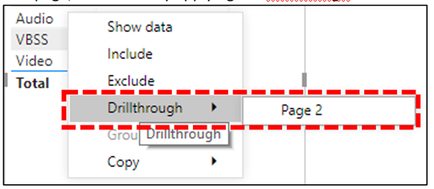

# Installer Power BI Connector pour utiliser les modèles de requête CQDInstall Power BI Connector to use CQD query templates

Avant d’utiliser les modèles de requête Power BI (fichiers PBIX) pour le tableau de bord de qualité des appels de Microsoft Teams, vous devez installer Power BI Connector pour le tableau de bord de qualité des appels Microsoft, à l’aide du fichier *MicrosoftCallQuality.pqx* inclus dans le [téléchargement.](https://github.com/MicrosoftDocs/OfficeDocs-SkypeForBusiness/blob/live/Teams/downloads/CQD-Power-BI-query-templates.zip?raw=true)Before you can use the Power BI query templates (PBIX files) for Microsoft Teams Call Quality Dashboard (CQD), you'll need to install the Power BI Connector for Microsoft CQD, using the *MicrosoftCallQuality.pqx* file included in the [download](https://github.com/MicrosoftDocs/OfficeDocs-SkypeForBusiness/blob/live/Teams/downloads/CQD-Power-BI-query-templates.zip?raw=true).

Lisez [Utiliser Power BI pour analyser les données du CQD](CQD-Power-BI-query-templates.md) pour Teams afin d’en savoir plus sur ces modèles.Read [Use Power BI to analyze CQD data for Teams](CQD-Power-BI-query-templates.md) to learn about these templates.

Assurez-vous que vous avez le rôle [d’accès de CQD droit pour](https://docs.microsoft.com/microsoftteams/turning-on-and-using-call-quality-dashboard#assign-roles-for-accessing-cqd) accéder aux rapports Power BI.Make sure you have the right [CQD access role](https://docs.microsoft.com/microsoftteams/turning-on-and-using-call-quality-dashboard#assign-roles-for-accessing-cqd) to access the Power BI reports.

> [!NOTE]
> Le connecteur Power BI du CQD prend uniquement en charge DirectQuery dans Power BI. Le mode Importation n’est pas pris en charge.The CQD Power BI Connector only supports DirectQuery in Power BI; Import mode is not supported. 

## InstallationInstallation

Le processus d’installation d’un connecteur personnalisé et d’ajustement de la sécurité pour permettre l’utilisation du connecteur est décrit en détail dans la [documentation de Power BI.](https://docs.microsoft.com/power-bi/desktop-connector-extensibility)The process for installing a custom connector and adjusting security to enable use of the connector is described in detail in the [Power BI documentation](https://docs.microsoft.com/power-bi/desktop-connector-extensibility). À des fins de simplicité, voici une explication rapide :For the sake of simplicity, here's a quick explanation:

1. Vérifiez si votre ordinateur contient déjà un dossier *\[ \] \\ Documents, \\ connecteurs personnalisés Power BI Desktop.*Check to see if your computer already has a *\[Documents\]\\Power BI Desktop\\Custom Connectors* folder. Si ce n’est pas le cas, créez ce dossier. 1If not, create this folder.1

2. Téléchargez le fichier du connecteur *\* (fichier .mez* ou *\* .pqx)* et placez-le dans le répertoire *Connecteurs personnalisés.*Download the connector file (either a *\*.mez* or *\*.pqx* file) and place it in the *Custom Connectors* directory.

3. **Si le fichier du connecteur est un fichier *\* .mez,*** vous devrez également ajuster vos paramètres de sécurité, comme décrit dans la documentation de configuration de connecteur [personnalisée.](https://docs.microsoft.com/power-bi/desktop-connector-extensibility#data-extension-security)**If the connector file is a *\*.mez* file,** you will also need to adjust your security settings as described in the [custom connector setup documentation](https://docs.microsoft.com/power-bi/desktop-connector-extensibility#data-extension-security).

Si une nouvelle version de ce connecteur Power BI pour Microsoft Teams est publiée, remplacez simplement l’ancien fichier de connecteur dans le répertoire *Connecteurs personnalisés* par le nouveau fichier.If a new version of this Power BI Connector for Microsoft Teams is released, simply replace the old connector file in the *Custom Connectors* directory with the new file.

## InstallationSetup

Pour créer un état et exécuter des requêtes, vous devez d’abord vous connecter à la source de données du CQD.In order to build a report and run queries, you will first need to connect to the CQD data source. Pour vous connecter, suivez les étapes ci-dessous :Follow the steps below in order to connect:

1. Dans l’onglet Accueil de Power BI Desktop, cliquez sur *Obtenir des données.*In the Home tab of Power BI Desktop, click on *Get Data*.

    

2. La *fenêtre Obtenir des* données doit apparaître à ce stade.The *Get Data* window should appear at this point. Accédez à *Online Services,* sélectionnez Qualité des appels *Microsoft (bêta),* puis sélectionnez *Connecter.*Navigate to *Online Services*, then select *Microsoft Call Quality (Beta)* and hit *Connect*.

    

3. Vous serez invité à vous connectez ensuite.You will be prompted to sign in next. Utilisez les mêmes informations d’identification que pour le CQD. 2Use the same credentials that you use for CQD.2

4. L’invite suivante vous permet d’choisir entre deux *modes Connectivité des données.*The next prompt will give you the option between two *Data Connectivity modes*. Sélectionnez *DirectQuery et* sélectionnez *OK.*Select *DirectQuery* and hit *OK*.

5. Pour finir, une invite finale vous indique l’intégralité du modèle de données du CQD.Finally, you will be given a final prompt showing you the entire data model for CQD. À ce stade, aucune donnée ne sera visible, seul le modèle de données du CQD sera visible.No data will be visible at this point, only the data model for CQD. Sélectionnez *Charger* pour terminer le processus de configuration.Select *Load* to complete the setup process.

6. À ce stade, Power BI charge le modèle de données sur le côté droit de la fenêtre.At this point, Power BI will load the data model onto the right side of the window. Sinon, la page reste vide et aucune requête n’est chargée par défaut.The page will remain otherwise blank, and no queries will be loaded by default. Passer à **la création de requêtes ci-dessous** pour créer une requête et renvoyer des données.Proceed to **Building Queries** below in order to build a query and return data.

Si l’une des étapes de ce processus de configuration n’était pas totalement claire, une explication plus détaillée du processus est possible dans le démarrage rapide : Connexion aux données dans [Power BI Desktop.](https://docs.microsoft.com/power-bi/desktop-quickstart-connect-to-data)If any of the steps during this setup process were not completely clear, a more detailed explanation of the process can be found in [Quickstart: Connect to data in Power BI Desktop](https://docs.microsoft.com/power-bi/desktop-quickstart-connect-to-data).

## Création de requêtesBuilding Queries

Une fois la configuration terminée, vous devriez voir les noms de plusieurs centaines de dimensions et de mesures chargés dans *le volet* Champs.Once setup is complete, you should see the names of several hundred dimensions and measures load in the *Fields* pane. Pour créer de réelles requêtes à partir de cette page, il vous suffit de sélectionner les dimensions et les mesures que vous voulez pour votre requête, puis de les glisser-déposer sur la page.Constructing actual queries from here is simple, just select the dimensions and measures you want for your query, then drag and drop them onto the page. Voici une explication plus détaillée, avec un exemple simple :Here's a more detailed explanation, with a simple example:

1. Sélectionnez la visualisation à utiliser dans le *volet Visualisations.*Select the visualization you want to use from the *Visualizations* pane. Une version vierge de cette visualisation doit apparaître sur la page.A blank version of that visualization should appear on the page. Dans le cadre de cet exemple, nous allons utiliser la *visualisation de table.*For the purposes of this example, we will be using the *Table* visualization.

    

2. Déterminez les dimensions et les mesures (c’est-à-dire, le symbole d’agrégation par leur nom) que vous souhaitez utiliser pour votre requête, puis sélectionnez-les manuellement et faites-les glisser vers la visualisation noire.Determine which dimensions and measures (denoted by an aggregation symbol by their name) you wish to use for your query, then manually select them and drag them onto the black visualization. Vous aussi, faites-les glisser vers le champ *Valeurs* sous les options de visualisation.Alternately, drag them onto the *Values* field beneath the visualization options.

    

    > [!IMPORTANT]
    > Le tableau de bord de qualité des appels nécessite une mesure pour l’exécuter pour toute requête.Call Quality Dashboard requires a measure for any query to run. L’échec de l’ajout d’une mesure à une requête entraîne l’échec de cette requête.Failure to add a measure to a query will cause that query to fail.

3. Ensuite, sélectionnez les dimensions que vous voulez  filtrer et faites-les glisser vers les filtres de ce champ visuel dans *le volet Filtres.*Next, select any dimensions you want to filter on and drag them to the *Filters on this visual* field in the *Filters* pane. Power BI Connector prend actuellement en charge le filtrage de base *(sélection* de valeurs dans une liste de valeurs de dimension *possibles),* le filtrage avancé (spécifier manuellement les valeurs et les opérandes à filtrer, similaire au CQD avancé) et filtrage de *date* relatif (disponible uniquement pour les dimensions Heure de fin et *Heure* de début). The CQD Power BI Connector currently supports *Basic filtering* (select values from a list of possible dimension values), *Advanced filtering* (manually specify values and operands to filter on, similar to Advanced CQD), and *Relative date filtering* (only available for the *End Time* and *Start Time* dimensions). Le filtrage en fonction *de la première N n’est* pas pris en charge par le CQD.Filtering according to *Top N* is not supported by CQD.

    

4. Enfin, sélectionnez *l’onglet Format* dans le volet *Visualisations* pour mettre en forme votre requête.Finally, select the *Format* tab within the *Visualizations* pane to style and format your query.

    > [!NOTE]
    > Pour être exécutés, les requêtes du CQD nécessitent au moins une mesure.CQD queries require at least one measure in order to run. Si votre requête ne se charge pas, vérifiez que vous avez inclus une mesure dans la requête.If your query does not load, double check that you have included a measure in the query.

## Création d’un rapport d’drillthroughCreating a Drillthrough Report

[L’drillthrough dans Power BI](https://docs.microsoft.com/power-bi/desktop-drillthrough) vous permet de créer des rapports concentrés que vous pouvez filtrer rapidement en utilisant les valeurs d’autres rapports comme contexte.[Drillthrough in Power BI](https://docs.microsoft.com/power-bi/desktop-drillthrough) allows you to create focused reports that you can quickly filter using the values of other reports as context. Une fois que vous savez comment créer votre première requête avec le connecteur CQD, la création d’une procédure d’drillthrough est encore plus simple.Once you know how to create your first query with the CQD Connector, creating a drillthrough is even simpler.

1. Créez une autre page pour l’état focus, puis ajoutez vos requêtes à cette page.Create another page for the focused report, and then add your queries to that page.

2. Sélectionnez la dimension à utiliser comme filtre d’drillthrough et faites-les glisser vers le champ *d’drillthrough* sous le volet *Visualisations.*Select the dimension you want to use as a drillthrough filter and drag them onto the *Drillthrough* field under on the *Visualizations* pane.

    

3. **Voilà\!****That's it\!** Toute autre requête sur une autre page qui utilise cette dimension peut désormais être drillthrough à cette page, ce qui applique automatiquement la valeur de la dimension d’drillthrough en tant que filtre.Any other query on another page that uses that dimension can now drillthrough to that page, automatically applying the drillthrough dimension's value as a filter.

    

Contrairement au CQD avancé, Power BI prend en charge l’drillthrough non séquentielle.Unlike Advanced CQD, Power BI supports non-sequential drillthrough. Tant qu’une requête inclut la dimension nécessaire, elle peut aller jusqu’à n’importe quelle autre page.So long as a query includes the necessary dimension, it can drillthrough to any other page.

### Meilleure pratiqueBest practice

Les requêtes Connecteur de qualité d’appel doivent être conçues avec la fonctionnalité d’drillthrough à l’esprit.Call Quality connector queries should be designed with drillthrough functionality in mind. Au lieu d’essayer de charger toutes les données en une fois, puis de vous lancer avec des filtres, commencez avec des requêtes plus larges et à faible cardinalité, puis descendez jusqu’aux requêtes de cardinalité élevée.Instead of trying to load all the data at once, and then slicing down with filters, start with broader, low-cardinality queries and drill down to high-cardinality queries. Par exemple, lorsque vous tentez de diagnostiquer les sous-réseaux qui contribuent le plus aux problèmes de qualité, il est utile d’identifier les régions et pays qui contribuent au problème, puis d’aller jusqu’aux sous-réseaux dans cette région ou ce pays.For instance, when attempting to diagnose which subnets contribute most to quality issues, it's helpful to first identify those regions and countries which contribute to the problem, then drill down to the subnets in that region or country. Les modèles de connecteur Qualité d’appel ont été conçus de cette manière afin de faire partie de l’exemple.The Call Quality connector templates have been designed in this manner in order to act as an example.

## LimitesLimitations

Malgré l’utilisation de Power BI, toutes les fonctionnalités de Power BI ne sont pas prise en charge par le connecteur CQD, soit en raison de limitations sur le modèle de données CQD, soit sur les connecteurs DirectQuery en général.Despite making use of Power BI, not all Power BI functionality is support by the CQD Connector, either as a result of limitations on CQD data model or on DirectQuery connectors in general. La liste ci-dessous remarque certaines des limitations les plus importantes de Connector, mais cette liste ne doit pas être considérée comme exhaustive :The list below notes some of the Connector's more noteworthy limitations, but this list should not be considered exhaustive:

1. **Colonnes calculées :** En général, les connecteurs DirectQuery offrent une prise en charge limitée des colonnes calculées dans Power BI.**Calculated Columns –** DirectQuery connectors in general have limited support for calculated columns in Power BI. Bien que certaines colonnes calculées fonctionnent avec le connecteur, elles doivent être considérées comme des exceptions.While some calculated columns may work with the Connector, these should be considered exceptions. En règle générale, les colonnes calculées ne fonctionnent pas.As a general rule, calculated columns will not function.

2. **Agrégation –** Le modèle de données du CQD est conçu sur un modèle de cube: les agrégations sont déjà prises en charge sous forme de mesures.**Aggregations –** The CQD data model is built on a cube model, meaning that aggregations are already supported in the form of measures. La tentative d’ajouter manuellement des agrégations à différentes dimensions ou de modifier le type d’agrégation d’une mesure ne fonctionne pas avec le connecteur et entraîne généralement une erreur.Attempting to manually add aggregations to different dimensions or changing the aggregation type of a measure will not work with the Connector, and it will generally result in an error.

3. **Éléments visuels personnalisés –** Bien que le connecteur CQD fonctionne avec une plage d’éléments visuels personnalisés, nous ne pouvons pas garantir la compatibilité avec tous les visuels personnalisés.**Custom Visuals –** While the CQD Connector does work with a range of custom visuals, we are unable to guarantee compatibility with all custom visuals. De nombreux visuels personnalisés s’appuient sur l’utilisation de colonnes calculées ou de données importées, ni des connecteurs DirectQuery, ni de ceux pris en charge.Many custom visuals rely on the use of calculated columns or imported data, neither or which are supported by DirectQuery connectors.

4. **Référence aux données mises en cache –** Power BI ne prend actuellement pas en charge le référencement des données mises en cache à partir d’un connecteur DirectQuery de quelque manière que ce soit.**Referencing Cached Data –** Power BI currently does not support referencing cached data from a DirectQuery connector in any way. Toute tentative de référence aux résultats d’une requête entraîne la génération d’une nouvelle requête.Any attempt to reference the results of a query will result in a new query.

5. **Filtrage relatif des données :** N’est pris en charge que dans  le connecteur du cdQ, mais uniquement avec les dimensions Heure de début et *Heure de fin.***Relative Data Filtering –** Is supported in the CQD Connector, but only with the *Start Time* and *End Time* dimensions. Bien que la dimension *Date* puisse être l’option la plus évidente pour le filtrage relatif des *dates,* La date n’est pas stockée en tant qu’objet d’heure de date et ne prend donc pas en charge le filtrage relatif des dates dans Power BI.Although the *Date* dimension may be the obvious choice for relative date filtering, *Date* is not stored as a date time object and thus does not support relative date filtering in Power BI.

6. **Support cloud de la communauté du gouvernement (GCC) –** Pour les clients dans l’environnement GCC, power BI Connector du CQD fonctionne lorsque vous utilisez Power BI Desktop.**Government Community Cloud (GCC) Support –** For customers in the GCC environment, the CQD Power BI Connector will work when using Power BI Desktop. Le connecteur Power BI du CQD est compatible avec le service Power BI pour les clients du SECTEUR PUBLIC.The CQD Power BI connector is compatible with the Power BI service for GCC customers.

La plupart de ces problèmes sont des restrictions à la conception de connecteur DirectQuery dans Power BI ou fondamentales à la conception du modèle de données du graphique de qualité des projets.Most of these issues are either restrictions to DirectQuery connector design in Power BI or fundamental to the design of the CQD data model.

## Résolution des problèmesTroubleshooting

### J’essaie d’utiliser la colonne Date comme un secteur Date.I'm trying to use the Date column as a Date slicer. Dès que je convertis le type de données de cette colonne en Date, je reçois cette erreurAs soon as I convert the data type of this column to Date, I get this error

> Impossible de charger les données pour ce visuel : erreur OLE DB ou ODBC : [Expression.Error] Nous **n’avons** pas pu plier l’expression à la source de données.**Couldn't load the data for this visual**: OLE DB or ODBC error: [Expression.Error] We couldn't fold the expression to the data source. Essayez une expression plus simple.Please try a simpler expression.

Les slicers de date ne sont pas pris en charge avec Power BI Connector.Date slicers aren't supported with the Power BI Connector. Pour spécifier une plage de dates, appliquez deux filtres au rapport, en spécifiant une date inférieure et supérieure à celle-là.To specify a date range, apply two filters to the report, specifying a less than and greater than date.

Si les dates que vous voulez afficher sont récentes, vous pouvez également appliquer un filtre de date relatif pour afficher uniquement les données des derniers jours/semaines/mois.Alternatively, if the dates you want to view are recent, apply a relative date filter to show only data for the last N days/weeks/months.

## Codes d’erreurError Codes

Étant donné que le CQD Power BI Connector est moins restreint que l’application de navigateur en termes de types de requêtes que vous pouvez créer, vous pouvez parfois rencontrer un certain nombre d’erreurs lors de la création de vos requêtes.Because the CQD Power BI Connector is less restricted than the browser app in terms of kinds of queries you can construct, you may occasionally encounter a number of errors while building your queries. Si vous recevez un message d’erreur du type « CQDError.In the event that you receive an error message of the type "CQDError. RunQuery – Erreur d’exécution de requête », référencez la liste ci-dessous avec le numéro Type d’erreur fourni pour résoudre le problème possible avec la requête.RunQuery – Query Execution Error", reference the list below with the ErrorType number provided in order to troubleshoot the possible issue with the query. Voici les codes de type d’erreur les plus courants que vous pouvez rencontrer avec le connecteur Power BI du tableau de contrôle de la liste de contrôle d’accès :The following are the most common Error Type codes you may encounter with the CQD Power BI Connector:

- **Type d’erreur 1 - Erreur de structure de requête :** Une erreur de structure de requête est généralement provoquée par l’échec du connecteur à créer une requête correctement mise en forme.**ErrorType 1 - Query Structure Error:** A query structure error is typically caused by the Connector failing to build a properly formatted query. Cela se produit la plupart du temps lors de l’utilisation de fonctionnalités non prévues, comme spécifié dans les limitations ci-dessus.This happens most often when using unsupported functionality, as specified in the Limitations above. Vérifiez que vous n’utilisez pas de colonne calculée ou d’éléments visuels personnalisés pour cette requête.Double check that you are not using any calculated columns or custom visuals for that query.

  - **Type d’erreur 2 - Erreur de création de requête :** Une erreur de bâtiment de requête est provoquée par le fait que le connecteur CQD n’a pas pu correctement l’une des requêtes que vous essayez de créer.**ErrorType 2 - Query Building Error:** A query building error is caused by the CQD Connector being unable to properly parse the query you are attempting to build. Cela se produit la plupart du temps lors de l’utilisation de fonctionnalités non prévues, comme spécifié dans les limitations ci-dessus.This happens most often when using unsupported functionality, as specified in the Limitations above. Vérifiez que vous n’utilisez pas de colonne calculée ou d’éléments visuels personnalisés pour cette requête.Double check that you are not using any calculated columns or custom visuals for that query.

  - **Type d’erreur 5 - Délai d’exécution :** La requête a atteint le temps d’exécuter maximal avant le minutage. Essayez d’ajouter d’autres filtres à la requête afin de limiter son étendue.**ErrorType 5 - Execution Timeout:** The query has reached the maximum possible runtime before timing out. Try adding more filters to the query in order to limit its scope. Pour y parvenir, il est souvent plus efficace d’affiner la plage de données.Narrowing the data range is often the most effective way to achieve this.

  - **Type d’erreur 7 - Aucune erreur de mesure :** Les requêtes du CQD nécessitent une mesure pour fonctionner.**ErrorType 7 - No Measurements Error:** CQD queries require a measure in order to function. Vérifiez que votre requête inclut la mesure.Double check that your query includes measure. Les mesures dans le connecteur du CQD sont annotées par le symbole d’agrégation (somme) avant leur nom.Measures in the CQD Connector are denoted by the aggregation (sum) symbol before their name.

Si vous rencontrez des erreurs supplémentaires en dehors de cette étendue, informez l’équipe du DQD afin que nous pouvons vous aider à résoudre le problème et à mettre à jour la documentation le cas échéant.If you encounter any additional errors outside of this scope, please notify the CQD team so that we can help troubleshoot the issue and update the documentation as appropriate.

## Notes de bas de pageFootnotes

**1** Certains processus et applications (par exemple, OneDrive) peuvent entraîner la modification du dossier racine Documents ; Assurez-vous que le répertoire *\\ Connecteurs personnalisés Power BI Desktop* est placé dans le dossier Documents du dossier racine actuel.**1** Certain processes and apps (e.g., OneDrive) may cause your Documents root folder to change; make sure that the *Power BI Desktop\\Custom Connectors* directory is placed inside of the current root folder Documents folder.

**2 Les** informations d’identification que  vous utilisez pour le CQD ne doivent pas nécessairement être les mêmes que pour vous connecter à l’application Power BI Desktop elle-même.**2** The login credentials you use for CQD *do not* need to be the same credentials you use for logging into the Power BI Desktop app itself.

## Forum aux questionsFrequently asked questions

### Quand Power BI Connector sera-t-il mis à jour à partir de l’état « Bêta »When will the Power BI Connector be updated from "Beta" status

Malgré la balise Bêta, le connecteur Qualité d’appel pour Power BI est la version finale du connecteur et a été officiellement signé par l’équipe Power BI pour refléter cela.Despite the Beta tag, the Call Quality Connector for Power BI is the release version of the connector and has been officially security signed by the Power BI team to reflect this. Le processus de certification de suppression de cette balise bêta est un processus important qui nécessite l’engagement de l’équipe Power BI à fournir également un support direct au connecteur.The certification process to remove that Beta tag is an extensive one and requires a commitment from the Power BI team to provide direct support to the connector as well. En raison de contraintes de temps, l’équipe Power BI ne peut actuellement pas fournir ce support et la certification à plus grande étendue, mais est néanmoins prête à en faire la preuve par rapport à la sécurité, l’authenticité et les fonctionnalités générales du connecteur Qualité d’appel De Microsoft.Due to time constraints, the Power BI team is currently unable to provide that support and broader certification, but is still prepared to attest to the security, authenticity, and general functionality of the Microsoft Call Quality connector.

### Pourquoi le connecteur semble-t-il plus lent par rapport au CQD avancé dans le navigateur ?Why does the connector seem slower compared to Advanced CQD in the browser? Que puis-je faire pour améliorer les performances ?What can I do to improve performance

Les performances des requêtes des différents modèles sont en fait identiques tant dans le navigateur que dans le connecteur.Query performance for the various templates is actually the same in both the browser and in the connector.  Comme toute autre application autonome, Power BI ajoute son authentification et son temps de rendu à nos performances.Just like any other standalone app, Power BI adds its authentication and rendering time to our performance. Par ailleurs, la différence vient du nombre de requêtes simultanées en cours d’exécuter.In addition, the difference comes in the number of concurrent queries being run. Étant donné que la version dans le navigateur du tableau de qualité des requêtes avait moins d’options de visualisation bien développées et de visualisation de la densité d’informations, la plupart de nos rapports étaient limités au chargement de 2 à 3 requêtes à la fois.Because the in-browser version of CQD had less well-developed and information-dense visualization options, most of our reports were limited to loading 2-3 queries at a time. En revanche, les modèles de connecteur affichent souvent plus de 20 requêtes simultanées.On the other hand, the connector templates often display 20+ concurrent queries. Si vous souhaitez créer des rapports qui sont tout aussi réactifs que ceux que vous utilisiez, essayez de créer des rapports sans plus de 2-3 requêtes par onglet.If you wish to build reports that are just as responsive as the older ones you were used to, try creating reports with no more than 2-3 queries per tab.

Pour plus d’informations, voir les articles suivants :For more information, see the following articles:

- [Guide d’optimisation de Power BIOptimization guide for Power BI](https://docs.microsoft.com/power-bi/guidance/power-bi-optimization)
- [Conseils sur les modèles DirectQueryDirectQuery model guidance](https://docs.microsoft.com/power-bi/guidance/directquery-model-guidance)

### Je constate que j’exécute régulièrement la limite de 10 000 lignes lors de l’exécution de requêtes.I find that I routinely run into the 10,000-row limit when running queries. Comment obtenir le connecteur pour renvoyer plus de 10 000 lignes ?How can I get the connector to return more than 10,000 rows

La limite de 10 000 lignes est en fait spécifiée à l’extrémité de l’API. Elle est conçue pour améliorer de manière significative les performances et réduire le risque d’erreurs d’exécution des requêtes résultant de conditions de mémoire réduite.The 10,000-row limit is actually specified on the API end, and it is designed to help significantly improve performance and reduce the risk of query execution errors resulting from low memory conditions.

Au lieu d’essayer d’augmenter le nombre de lignes des résultats, il est préférable de restructurer vos rapports en fonction des meilleures pratiques.Instead of attempting to increase the result row count, it is best to restructure your reports according to connector best practices. Les modèles que nous avons inclus sont conçus pour montrer ces meilleures pratiques.The templates we have included are designed to demonstrate these best practices. Si possible, commencez par regarder vos KPIs à l’aide de dimensions plus larges et de faible cardinalité, telles que Mois, Année, Date, Région, Pays, etc. À partir de là, vous pouvez descendre dans les dimensions de plus en plus grande cardinalité.Where possible, start by looking at your KPIs using broader, lower-cardinality dimensions, such as Month, Year, Date, Region, Country, etc. From there, you can drill down into increasingly higher-cardinality dimensions. Les rapports d’aide et de Location-Enhanced fournissent de bons exemples de ce flux de travail d’drill down.The Helpdesk and Location-Enhanced Reports both provide good examples of this drill down workflow.

## Rubriques connexesRelated topics

[Utiliser Power BI pour analyser les données du CQD de TeamsUse Power BI to analyze CQD data for Teams](CQD-Power-BI-query-templates.md)
