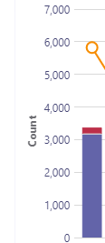

# <a name="data-and-reports-in-call-quality-dashboard-cqd"></a>Données et rapports dans le tableau de bord de qualité des appels (CQD)

Microsoft Call Quality Dashboard (CQD) utilise un flux de données en quasi-temps réel (NRT). Les enregistrements d’appel sont disponibles dans CQD dans les 30 minutes suivant la fin d’un appel. Les enregistrements d’appel du pipeline NRT ne sont disponibles que quelques mois avant d’être supprimés du jeu de données.

## <a name="many-ways-to-access-cqd-data"></a>De nombreuses façons d’accéder aux données de CQD

Vous pouvez accéder aux données de CQD par plusieurs voies différentes. Choisissez celui qui répond le mieux à vos besoins :

|&nbsp;|&nbsp;|
|---|---|
|Centre d’administration Teams [(https://admin.teams.microsoft.com)](https://admin.teams.microsoft.com)|Les données CQD sont incluses dans la page **Utilisateurs** du Centre d’administration Teams, affichant les données les plus courantes dont vous avez besoin dans un format facile à lire. Vous ne pouvez pas personnaliser les données CQD que vous trouvez sous **Utilisateurs**.|
|Portail CQD [(https://cqd.teams.microsoft.com)](https://cqd.teams.microsoft.com)|Synthèse robuste et rapports détaillés qui répondent à la plupart des besoins, avec filtrage d’extraction. Vous pouvez également personnaliser des rapports dans le portail CQD. <br><br>Obtenez deux [modèles de rapport CQD](#import-the-cqd-report-templates) pour vous aider à analyser les données dans le portail CQD.|
|Power BI|Utilisez des requêtes directes pour afficher vos données CQD dans Power BI à l’aide de [modèles Power BI personnalisables](CQD-Power-BI-query-templates.md). [Téléchargez les modèles de requête Power BI pour CQD](https://www.microsoft.com/download/details.aspx?id=102291).<br><br>Vous pouvez également [utiliser l’API REST pour accéder aux données CQD](/skypeforbusiness/management-tools/call-quality-dashboard/data-api) via Power BI. Utilisez cette méthode si vous souhaitez télécharger vos données CQD afin de pouvoir les utiliser hors connexion. L’avantage de cette méthode est de meilleures performances, particulièrement utiles pour les jeux de données volumineux qui se cachent dans Power BI lorsque vous êtes en ligne.|
|API Graph|Accédez vous-même aux données de qualité des appels à l’aide du [API Graph](/graph/api/resources/callrecords-api-overview). Il s’agit de la méthode la plus complexe, mais elle vous offre le plus de contrôle et de flexibilité dans l’analyse des données de qualité de vos appels. Par exemple, si vous devez le joindre à d’autres données pour votre organisation, vous pouvez utiliser le API Graph pour créer un modèle de données et incorporer des données de qualité des appels.|

## <a name="import-the-cqd-report-templates"></a>Importer les modèles de rapport CQD

Téléchargez [deux modèles de rapport CQD organisés](https://aka.ms/qertemplates) (Tous les réseaux et réseaux managés) pour vous aider à vous familiariser rapidement avec le CQD. Le modèle Tous les réseaux, bien qu’optimisé pour fonctionner avec un fichier de données de génération, peut être utilisé pendant que vous travaillez à la collecte et au chargement d’informations de génération dans CQD, comme décrit dans la section suivante.

**Pour importer les modèles (. CQDX) en CQD** :

1. Dans CQD, sélectionnez **Rapports détaillés** dans le menu en haut de la page.

2. Dans le volet gauche, sélectionnez **Importer**. Accédez au premier modèle CQDX, puis sélectionnez **Ouvrir**.

3. Une fois le modèle chargé, une fenêtre contextuelle affiche le message « L’importation du rapport a réussi ».

4. Répétez les étapes 2 et 3 pour le deuxième modèle CQD.

   > [!NOTE]
   > Chaque utilisateur doit importer les modèles CQD dans son instance CQD.

## <a name="euii-data"></a>Données EUII

Pour des raisons de conformité, les données d’informations d’identification de l’utilisateur final (également appelées informations d’identification personnelle ou PII) ne sont conservées que pendant 28 jours. À mesure que les données NRT dépassent la marque de 28 jours, les champs qui contiennent l’EUII sont effacés, ce qui entraîne des données NRT sans EUII. Les champs qui contiennent des données EUII sont les suivants :

- Adresse IP complète
- Adresse mac (Media Access Control)
- Identificateur de service de base (BSSID)
- URI SIP (Session Initiation Protocol) (Skype Entreprise uniquement)
- Nom d’utilisateur principal (UPN)
- Nom du point de terminaison de la machine
- Commentaires verbatim de l’utilisateur
- ID d’objet (ID d’objet Active Directory de l’utilisateur du point de terminaison)
- Numéro de téléphone
- Identité du standard automatique
- Identité de file d’attente d’appels
- Nom de l’appareil de téléconférence vidéo (VTC)
- Détails de l’appareil de téléconférence vidéo (VTC)

### <a name="admin-roles-with-and-without-euii-access"></a>Administration rôles avec et sans accès EUII

Ces rôles [RBAC](/azure/role-based-access-control/overview) **ont** un accès EUII :

- Administration globale
- Administration de service Teams
- Teams Communications Administration
- Ingénieur du support technique pour les communications Teams
- Lecteur général
- Skype Entreprise Administration

Ces rôles RBAC **n’ont pas d’accès** EUII :

- Lecteur de rapports
- Spécialiste du support des communications Teams

## <a name="date-controls"></a>Contrôles de date

CQD prend en charge les types de tendances propagées suivants :

- 5 jours
- 7 jours
- 30 jours
- 60 jours
- 90 jours

Le paramètre Date d’URL accepte un champ Jour. Les rapports de jour continu utilisent les dates spécifiées au format AAAA-MM-JJ comme dernier jour de la tendance. Le paramètre Date d’URL « 00 » indique « aujourd’hui ».

|Url|Date de fin de la tendance du jour roulant|
|:---|:---|
|<span>\<cqdv3>https:///spd/#/Dashboard/\<reportid>/2019-02/</span>|Jour actuel de février 2019|
|<span>\<cqdv3>https:///spd/#/Dashboard/\<reportid>/2019-02-15/</span>|15 février 2019|
|<span>\<cqdv3>https:///spd/#/Dashboard/\<reportid>/00/</span>|Jour actuel|

Par défaut, le jour actuel du mois est utilisé comme dernier jour de la tendance du jour roulant.

## <a name="data-available-in-cqd-reports"></a>Données disponibles dans les rapports CQD

Le résumé par défaut et les rapports de CQD détaillés peuvent être tout ce dont vous avez besoin pour gérer la qualité des appels pour votre organisation. Si nécessaire, vous pouvez [créer des rapports personnalisés](#create-custom-detailed-reports).

Si vous souhaitez utiliser Power BI pour analyser vos données CQD, lisez [Utiliser Power BI pour analyser les données de CQD pour Teams](CQD-Power-BI-query-templates.md).

|Fonctionnalité|Rapports récapitulatifs|Rapports détaillés|
|:---|:---|:---|
|Métrique de partage d’application|Non|Oui|
|Prise en charge des informations de création de clients|Oui|Oui|
|Prise en charge des informations de point de terminaison client|Uniquement dans <span>cqd.teams.microsoft.com<span/>|Uniquement dans <span>cqd.teams.microsoft.com<span/>|
|Prise en charge de l’analyse détaillée|Non|Oui|
|Métriques de fiabilité des supports|Non|Oui|
|Rapports out-of-the-box|Oui|Oui|
|Rapports de vue d’ensemble|Oui|Oui|
|Jeu de rapports par utilisateur|Non|Oui|
|Personnalisation du jeu de rapports (ajouter, supprimer, modifier des rapports)|Non|Oui|
|Métriques de partage d’écran vidéo|Non|Oui|
|Métriques vidéo|Non|Oui|
|Quantité de données disponibles|12 derniers mois|12 derniers mois|
|Données Microsoft Teams|Oui|Oui|

### <a name="select-product-data-to-see-in-reports"></a>Sélectionner les données de produit à afficher dans les rapports

Dans le résumé et les rapports Location-Enhanced, vous pouvez utiliser la liste déroulante **Filtre** de produit pour afficher toutes les données de produit, uniquement les données Microsoft Teams ou uniquement les données Skype Entreprise Online.

> [!div class="mx-imgBorder"]
> 

Dans les rapports détaillés, vous pouvez utiliser la dimension **Is Teams** pour filtrer les données vers Microsoft Teams ou Skype Entreprise données Online.

## <a name="summary-reports"></a>Rapports récapitulatifs

Voici les rapports que vous verrez dans le tableau de bord CQD lorsque vous vous connectez pour la première fois au CQD. Ils vous donnent un aperçu des tendances de qualité avec des rapports quotidiens, mensuels et de table pour vous aider à identifier les sous-réseaux dont la qualité est médiocre.

|Onglet|Description|
|---|---|
|Qualité globale des appels|Agrégat des 3 autres onglets.|
|Serveur : client|Détails des flux entre les points de terminaison serveur et client.|
|Client : client|Détails des flux entre deux points de terminaison clients.|
|Contrat SLA qualité vocale|Informations sur les appels inclus dans le contrat [SLA](https://go.microsoft.com/fwlink/p/?linkid=846252) de qualité vocale Skype Entreprise.|

### <a name="overall-call-quality-tab"></a>Onglet Qualité des appels globaux

Utilisez les données de cet onglet pour évaluer l’état et les tendances de la qualité des appels en fonction du nombre de flux et des pourcentages médiocres. La légende dans le coin supérieur droit indique les couleurs et les éléments visuels qui représentent ces métriques.

> [!div class="mx-imgBorder"]
> 

Les flux sont classés en trois groupes : Good, Poor et Unclassified. Il existe également des valeurs de  *pourcentage médiocre*  calculées qui vous donnent le rapport entre les flux classés *comme pauvres*  et le nombre total de flux classifiés. Étant donné *que Poor % = Poor streams/(Poor streams+ Good streams) \* 100*, poor *%* n’est pas affecté par la présence de plusieurs flux *non classés*  . Pour voir ce qui classe un flux comme médiocre ou bon, reportez-vous à [classification de flux dans le tableau de bord qualité des appels](stream-classification-in-call-quality-dashboard.md).

Utilisez l’échelle à gauche pour mesurer les valeurs de nombre de flux.

> [!div class="mx-imgBorder"]
> 

Utilisez l’échelle sur la droite pour mesurer les valeurs poor % .

> [!div class="mx-imgBorder"]
> 

Vous pouvez également obtenir les valeurs numériques réelles en pointant la souris sur une barre.

> [!NOTE]
> L’exemple suivant est issu d’un très petit jeu de données, et les valeurs ne sont pas réalistes pour un déploiement réel.

> [!div class="mx-imgBorder"]
> 

Le volume global du flux permet de déterminer la pertinence des pourcentages de pauvres calculés. Plus le volume des flux globaux est faible, moins les valeurs de pourcentage médiocre signalées sont fiables.

### <a name="server-client-tab-and-client-client-tabs"></a>onglets Server-Client et Client-Client

Ces deux onglets fournissent des détails sur les flux qui ont eu lieu dans leurs scénarios de point de terminaison à point de terminaison. L’onglet Server-Client comporte quatre sections réductibles qui représentent quatre scénarios dans lesquels des flux multimédias sont acheminés.

- Câblé à l’intérieur
- Câblé à l’extérieur
- WiFi à l’intérieur
- WiFi à l’extérieur

De même, l’onglet Client-Client comporte cinq sections réductibles :

- Câblé à l’intérieur - câblé à l’intérieur
- Câblé à l’intérieur — Câblé à l’extérieur
- Câblé à l’extérieur — Câblé à l’extérieur
- Câblé à l’intérieur - WiFi à l’intérieur
- Câblé à l’intérieur - WiFi à l’extérieur

#### <a name="inside-versus-outside"></a>À l’intérieur ou à l’extérieur

CQD classe un flux en tant  *qu’intérieur*  ou *extérieur à l’aide*  d’informations de génération, le cas échéant. Les points de terminaison de chaque flux sont associés à une adresse de sous-réseau. Si le sous-réseau figure dans la liste des sous-réseaux marqués InsideCorp dans les informations de bâtiment chargées, il est considéré comme *interne*. Si les informations de génération n’ont pas encore été chargées, Inside Test classifie toujours les flux en tant *qu’éléments externes*.

Le test à l’intérieur d’un scénario Server-Client prend uniquement en compte le point de terminaison client. Étant donné que les serveurs sont toujours en dehors du point de vue d’un utilisateur, cela n’est pas pris en compte dans le test.

#### <a name="wired-versus-wifi"></a>Câblé ou WiFi

Comme les noms l’indiquent, les critères de classification sont basés sur le type de connexions client. Le serveur est toujours câblé et n’est pas inclus dans le calcul. Dans un flux donné, si l’un des deux points de terminaison est connecté à un réseau WiFi, CQD le classe comme WiFi.

> [!NOTE]
> Avec un flux, si l’un des deux points de terminaison est connecté à un réseau Wi-Fi, il est classé wi-fi dans CQD.

## <a name="tenant-data-information"></a>Informations sur les données du locataire

Le tableau de bord Rapports récapitulatifs du CQD inclut une page **de chargement des données** client, accessible en sélectionnant **Chargement des données** client dans le menu Paramètres dans le coin supérieur droit. Cette page permet aux administrateurs de charger leurs propres informations, par exemple :

- Carte d’adresse IP et d’informations géographiques.
- Carte de chaque AP sans fil et de son adresse MAC.
- Carte de point de terminaison à point de terminaison Make/Model/Type, etc.

Nous vous recommandons de charger vos données de locataire, de bâtiment et d’emplacement afin que CQD puisse inclure ces informations dans vos rapports. Si vous n’avez pas encore chargé ces données, lisez [Charger le locataire et générer des données](CQD-upload-tenant-building-data.md).

## <a name="detailed-reports"></a>Rapports détaillés

|Nom|Description|
|---|---|
|rapports Location-Enhanced|Affiche des tendances de qualité basées sur les informations de localisation. Ce rapport s’affiche uniquement si vous avez [chargé vos données de locataire](CQD-upload-tenant-building-data.md).|
|Rapports de fiabilité|Inclut l’audio, la vidéo, le partage d’écran vidéo (VBSS) et les rapports de partage d’applications.|
|Rapports sur la qualité de l’expérience|Qualité audio et fiabilité pour tous les clients et appareils, y compris les salles de réunion. Ces rapports sont une version « allégée » des [modèles CQD téléchargeables](https://aka.ms/QERtemplates), qui se concentre sur des domaines clés pour l’analyse de la qualité et de la fiabilité audio.|
|Rapports d’exploration de la qualité|Exploration : Date par région, emplacements, sous-réseaux, heure et utilisateurs.|
|Rapports d’exploration des défaillances|Exploration : Date par région, emplacements, sous-réseaux, heure et utilisateurs.|
|Évaluer mes rapports d’appels|Analysez les évaluations des appels utilisateur par région, emplacement ou par utilisateur. Inclut des commentaires détaillés.|
|Rapports du support technique|Les rapports du support technique examinent les données d’appel et de réunion pour des utilisateurs individuels, des groupes d’utilisateurs ou tout le monde. En incorporant des données de génération et d’EUII, ces rapports permettent d’identifier les problèmes système possibles en fonction de l’emplacement réseau, des détails de la conférence, des appareils ou du microprogramme.|
|Rapports de version du client|Résumé de la version du client : afficher le nombre de sessions et d’utilisateurs pour chaque version de l’application cliente<br><br>Version du client par utilisateur : afficher les noms d’utilisateur pour chaque version de l’application cliente <br><br>Les filtres prédéfinifiés pour le type de produit et de client permettent de concentrer les versions sur des clients spécifiques.|
|Rapports de point de terminaison|Affiche la qualité des appels par point de terminaison d’ordinateur (fabrique d’ordinateurs et modèle). Ces rapports incluent la génération de données, si vous les avez chargées.|

## <a name="create-custom-detailed-reports"></a>Créer des rapports détaillés personnalisés

Si les rapports CQD par défaut ne répondent pas à vos besoins, utilisez ces instructions pour créer un rapport personnalisé. Vous pouvez également (à partir de janvier 2020) [utiliser Power BI pour les rapports CQD ](cqd-power-bi-query-templates.md)à la place.

Dans la liste déroulante des rapports en haut de l’écran affiché lors de la connexion\(, l’écran\) **Rapports récapitulatifs** sélectionnez **Rapports détaillés**, puis **Nouveau**. Cliquez sur **Modifier** dans un rapport pour afficher le Éditeur de requête. Chaque rapport est complété par une requête effectuée dans le cube. Il s’agit de la visualisation des données renvoyées par la requête. Le Éditeur de requête vous aide à modifier ces requêtes et les options d’affichage du rapport.

> [!IMPORTANT]
> La plage réseau peut être utilisée pour représenter un super réseau (combinaison de plusieurs sous-réseaux avec un seul préfixe de routage). Tous les chargements de nouveaux bâtiments sont vérifiés pour les plages qui se chevauchent. Si vous avez déjà chargé un fichier de construction, vous devez télécharger le fichier actif et le retenter pour identifier les chevauchements et résoudre le problème avant de le charger à nouveau. Tout chevauchement dans les fichiers précédemment chargés peut entraîner des mappages incorrects de sous-réseaux vers des bâtiments dans les rapports. Certaines implémentations VPN ne signalent pas avec précision les informations de sous-réseau. Il est recommandé que, lors de l’ajout d’un sous-réseau VPN au fichier de génération, au lieu d’une entrée pour le sous-réseau, des entrées distinctes soient ajoutées pour chaque adresse du sous-réseau VPN en tant que réseau 32 bits distinct. Chaque ligne peut avoir les mêmes métadonnées de construction. Par exemple, au lieu d’une ligne pour 172.16.18.0/24, vous devez avoir 256 lignes, avec une ligne pour chaque adresse comprise entre 172.16.18.0/32 et 172.16.18.255/32, inclus.
>
> La colonne VPN est facultative et a la valeur par défaut 0.  Si la valeur de la colonne VPN est définie sur 1, le sous-réseau représenté par cette ligne est entièrement développé pour correspondre à toutes les adresses IP au sein du sous-réseau.  Utilisez cette option avec parcimonie et uniquement pour les sous-réseaux VPN, car le développement complet de ces sous-réseaux aura un impact négatif sur les temps de requête pour les requêtes impliquant des données de génération.

Pointez sur des graphiques à barres et des lignes de tendance dans le rapport pour afficher des valeurs détaillées. Le rapport qui a le focus affiche le menu d’action : **Modifier**, **Cloner**, **Supprimer**, **Télécharger** et **Exporter l’arborescence de rapports**.

## <a name="query-filters"></a>Filtres de requête

Les filtres de requête sont implémentés à l’aide de la Éditeur de requête dans CQD. Ces filtres sont utilisés pour réduire le nombre d’enregistrements retournés par le CQD, réduisant ainsi la taille globale du rapport et les temps de requête. Cela est particulièrement utile pour filtrer les réseaux non managés. Les filtres répertoriés dans le tableau suivant utilisent des expressions régulières (RegEx).

|Filtre|Description|Exemple de filtre de requête CQD|
|---|---|---|
|Aucune valeur vide|Certains filtres n’ont pas la possibilité de filtrer les valeurs vides. Pour filtrer manuellement les valeurs vides, utilisez l’expression vide et définissez le filtre sur Égal ou Non Égal, en fonction de vos besoins.|Second Building Name \<\> \^\\s\*\$|
|Exclure les sous-réseaux courants|Sans fichier de construction valide pour séparer les réseaux gérés des réseaux non managés, les réseaux domestiques seront inclus dans les rapports. Ces sous-réseaux d’accueil ne relèvent pas du contrôle informatique et peuvent être rapidement exclus d’un rapport. Les sous-réseaux courants, tels que définis dans ce guide, sont 10.0.0.0, 192.168.1.0 et 192.168.0.0.|Second Subnet \<\> 10.0.0.0 \|192.168.0.0 \|192.168.1.0|
|Affichage à l’intérieur uniquement|Utilisé pour filtrer un rapport pour un rapport géré (à l’intérieur) ou non managé (à l’extérieur). Le modèle CQD managé est déjà préconfiguré avec ces filtres.|Second Inside Corp = Inside|

## <a name="report-filters"></a>Filtres de rapport

Utilisez des filtres de rapport CQD pour affiner le focus de vos investigations. Utilisez des filtres de rapport en ajoutant un filtre au rapport rendu dans le Éditeur de requête ou directement dans le rapport. Les filtres de rapport suivants sont utilisés dans les [modèles CQD](https://aka.ms/QERtemplates).

|Filtre|Description|Exemple de filtre de rapport CQD|
|---|---|---|
|Month|Commencez par l’année d’abord, puis le mois.|2017-10|
|Alphabétique|Filtre les caractères alphabétiques.|[a-z]|
|Numérique|Filtre les caractères numériques.|[0-9]|
|Pourcentage|Filtre un pourcentage.|([3-9]\\.)\| ([3-9])\| ([1-9][0-9])|

### <a name="drill-down-filters"></a>Filtres d’exploration

Les rapports CQD comportent plusieurs filtres d’exploration, qui sont des outils puissants pour affiner le focus de vos enquêtes sur la qualité des appels. Si vous sélectionnez un champ d’exploration, le rapport ouvre automatiquement l’onglet approprié et filtre la valeur sélectionnée. Si cet onglet a ses propres champs d’exploration et que l’un d’eux est sélectionné, les deux ensembles de filtres sont appliqués, ce qui réduit progressivement le jeu de données résultant.


#### <a name="adding-and-editing-drill-down-fields"></a>Ajout et modification de champs d’exploration

Lors de la modification d’un rapport, vous avez la possibilité de spécifier vos propres champs d’exploration à l’aide de la Éditeur de requête.

Commencez par cliquer sur **...** pour le rapport que vous souhaitez modifier, puis **sélectionnez Modifier**.


Sélectionnez une dimension dans la liste à gauche du Éditeur de requête. Cliquez ensuite sur la liste déroulante sous l’étiquette **Naviguer** vers, puis sélectionnez l’onglet et le groupe de expandeur vers lesquels vous souhaitez explorer cette dimension. Remarque : Actuellement, la fonctionnalité d’exploration ne fonctionne qu’en accédant à différents onglets. La prise en charge de l’exploration vers un expandeur spécifique sera ajoutée ultérieurement. Enfin, cliquez sur **Fermer** pour enregistrer vos modifications apportées à la dimension, puis sur **Enregistrer** pour enregistrer et fermer le Éditeur de requête.


### <a name="multi-select-filters"></a>Filtres à sélection multiple

En plus des fonctionnalités d’exploration, CQD prend également en charge la spécification de filtres avec plusieurs valeurs (ou filtres).

Pour sélectionner plusieurs valeurs de filtre, commencez par ajouter un nouveau filtre au rapport. Cliquez en **+** regard de l’étiquette **Filtres** , entrez le nom de la dimension que vous souhaitez utiliser, puis cliquez sur **Ajouter**.


Ensuite, cliquez sur **Rechercher** (icône de loupe en regard du nouveau filtre). Vous verrez un champ de texte et un certain nombre d’options, notamment **Sélectionner tout** et **Inverser**. Entrez une valeur, puis cliquez sur **Rechercher** en regard de ce champ pour effectuer une recherche. Vous pouvez également laisser le champ de texte vide et cliquer sur **Rechercher** pour afficher jusqu’aux 100 premières options.

```powershell
/filter/[AllStreams].[Second Tenant Id]\|[YOUR TENANT ID HERE]
```

Exemple :


### <a name="dashboard-level-filters"></a>Filtres au niveau du tableau de bord

Certains rapports CQD comportent des filtres au niveau du tableau de bord, ce qui facilite le filtrage par paramètres courants. Ces filtres apparaissent en dehors des onglets de rapport standard et directement sous le filtre Produit, et s’appliquent à tous les filtres du tableau de bord.


```powershell
/filter/[AllStreams].[Is Teams]|[TRUE | FALSE]
```

### <a name="url-filters"></a>Filtres d’URL

CQD prend en charge l’ajout de filtres à l’URL. Cela facilite le partage ou le signet d’une requête CQD. Vous pouvez définir des paramètres dans l’URL, tels que le mois de tendance, l’ID de locataire ou la langue. Vous pouvez également ajouter des filtres de niveau Produit ou Tableau de bord à l’URL.
L’exclusion des données fédérées des rapports CQD est utile lorsque vous corrigez des bâtiments ou des réseaux gérés où des points de terminaison fédérés peuvent influencer vos rapports.

Pour ajouter un filtre, ajoutez ce qui suit à la fin de l’URL :

```console
/filter/[AllStreams].[Second Tenant Id]\|[YOUR TENANT ID HERE]
```

Exemple :

`https://cqd.teams.microsoft.com/cqd/#/1234567/2018-08/filter/[AllStreams].[Second Tenant Id]|[TENANTID]`

Pour ajouter un filtre au niveau du tableau de bord à une URL, ce filtre doit exister dans CQD en tant que filtre de niveau Produit ou Tableau de bord. Ajoutez ces filtres à l’URL après le mois de tendance et avant les paramètres d’URL :

`filter/DATA_MODEL_NAME|VALUE`

Par exemple, pour appliquer une valeur de filtre product de Microsoft Teams, vous devez ajouter les éléments suivants :

`filter/[AllStreams].[Is%20Teams]|[True]`

L’INTÉGRALITÉ de votre URL ressemble à ceci :

`https://cqd.teams.microsoft.com/spd/#/Dashboard/2624085/2018-9/filter/[AllStreams].[Is%20Teams]|[True]`

Pour appliquer des filtres d’URL avec des valeurs à sélection multiple, séparez chaque valeur par un caractère de canal (|). Par exemple :

`filter/[AllStreams].[Media%20Type]|[Video]|[Audio]|[VBSS]`

Si vous spécifiez un nom ou une valeur non valide, le filtre d’URL n’est pas appliqué.

Vous pouvez utiliser un filtre d’URL pour filtrer chaque rapport pour une dimension spécifique. Les filtres d’URL les plus courants sont utilisés pour filtrer les rapports afin d’exclure les données de télémétrie des participants fédérés ou de se concentrer uniquement sur Teams ou Skype Entreprise Online. L’exclusion des données fédérées des rapports CQD est utile lorsque vous corrigez des bâtiments ou des réseaux gérés où des points de terminaison fédérés peuvent influencer vos rapports.

|Filtre|Description|Exemple de filtre de requête CQD|
|---|---|---|
|Aucune valeur vide|Certains filtres n’ont pas la possibilité de filtrer les valeurs vides. Pour filtrer manuellement les valeurs vides, utilisez l’expression vide et définissez le filtre sur Égal ou Non Égal, en fonction de vos besoins.|Second Building Name \<\> \^\\s\*\$|
|Exclure les sous-réseaux courants|Sans fichier de construction valide pour séparer les réseaux gérés des réseaux non managés, les réseaux domestiques seront inclus dans les rapports. Ces sous-réseaux d’accueil ne relèvent pas du contrôle informatique et peuvent être rapidement exclus d’un rapport. Les sous-réseaux courants, tels que définis dans cet article, sont 10.0.0.0, 192.168.1.0 et 192.168.0.0.|Second Subnet \<\> 10.0.0.0 \|192.168.0.0 \|192.168.1.0|
|Affichage à l’intérieur uniquement|Utilisé pour filtrer un rapport pour un rapport géré (à l’intérieur) ou non managé (à l’extérieur). Le modèle CQD managé est déjà préconfiguré avec ces filtres.|Second Inside Corp = Inside|

#### <a name="how-to-find-your-tenant-id"></a>Comment trouver votre ID de locataire

L’ID de locataire dans CQD correspond à l’ID d’annuaire dans Azure. Si vous ne connaissez pas votre ID d’annuaire, vous pouvez le trouver dans le Portail Azure :

1. Connectez-vous au Portail Azure Microsoft :<https://portal.azure.com>

2. Sélectionnez **Azure Active Directory**.

3. Sous **Gérer**, sélectionnez **Propriétés**. Votre ID de locataire se trouve dans la zone **ID d’annuaire** .

Vous pouvez également trouver votre ID de locataire à l’aide de PowerShell :

```powershell
Login-AzureRmAccount
```

## <a name="comparing-teams-and-skype-for-business-cqd-data"></a>Comparaison des données Teams et Skype Entreprise CQD

Lorsque vous examinez vos données, vous pouvez voir des différences entre les données entre Teams et Skype Entreprise. Voici quelques raisons :

- Différences dans les mécanismes pour garantir les performances et la fiabilité :
  - Teams dispose d’une reconnexion automatique et d’une itinérance rapide. Skype Entreprise ne le fait pas.
  - Teams dispose d’une gestion dynamique de la bande passante. Skype Entreprise ne le fait pas.
- Différences dans les [plages d’adresses IP](Office-365-URLs-IP-address-ranges.md) entre Teams et Skype Entreprise. Les plages d’adresses IP Teams sont plus récentes, ce qui peut entraîner des problèmes de connectivité au niveau du pare-feu.

## <a name="related-topics"></a>Rubriques connexes

[Améliorer et surveiller la qualité des appels pour Teams](monitor-call-quality-qos.md)

[Qu’est-ce que le TBQA ?](CQD-what-is-call-quality-dashboard.md)

[Configurer le tableau de bord de qualité des appels (CQD)](turning-on-and-using-call-quality-dashboard.md)

[Charger le client et créer des données](CQD-upload-tenant-building-data.md)

[Utiliser le TBQA pour gérer la qualité des appels et des réunions](quality-of-experience-review-guide.md)

[Dimensions et mesures disponibles dans le TBQA](dimensions-and-measures-available-in-call-quality-dashboard.md)

[Classification de flux de données dans le TBQA](stream-classification-in-call-quality-dashboard.md)

[Utiliser Power BI pour analyser les données TBQA](CQD-Power-BI-query-templates.md)
