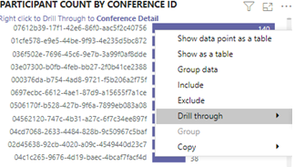

# Utilisation de Microsoft Teams dans Power BI à l’aide de données du CQDView Microsoft Teams utilization in Power BI using CQD data

Nouveautés de mars 2020, nous avons ajouté un rapport Utilisation de Teams à nos modèles de requête Power BI téléchargeables pour le bon de [recherche de contenu.](https://github.com/MicrosoftDocs/OfficeDocs-SkypeForBusiness/blob/live/Teams/downloads/CQD-Power-BI-query-templates.zip?raw=true)New in March 2020, we've added a Teams Utilization report to our downloadable [Power BI query templates for CQD](https://github.com/MicrosoftDocs/OfficeDocs-SkypeForBusiness/blob/live/Teams/downloads/CQD-Power-BI-query-templates.zip?raw=true). 

Ce nouveau rapport Utilisation des équipes vous permet de voir comment (et combien) vos utilisateurs utilisent Microsoft Teams en accédant aux données du tableau de bord de qualité des appels de Teams.This new Teams Utilization reports lets you see how (and how much) your users are using Microsoft Teams by accessing Teams Call Quality Dashboard (CQD) data. Ces rapports sont destinés à être un emplacement centralisé que les administrateurs et les chefs d’entreprise peuvent rapidement utiliser pour ces données.These reports are intended to be a centralized location that both administrators and business leaders can quickly go to for this data.

Le rapport Utilisation de Power BI sur Teams se compose de deux rapports principaux : **[Le récapitulatif](#call-count-summary-report)** des appels et le résumé **[des minutes audio.](#audio-minutes-summary-report)**The Teams Utilization Power BI report consists of two primary reports: **[Call Count Summary](#call-count-summary-report)** and **[Audio Minutes Summary](#audio-minutes-summary-report)**. [L’utilisation quotidienne,](#daily-usage)les [détails](#regional-audio-details)audio  régionaux, les détails des conférences et les rapports de la liste d’utilisateurs sont pris en compte lorsqu’un utilisateur tire parti des rapports d’analyse détaillée, comme indiqué dans les descriptions ci-dessous. The [Daily Usage](#daily-usage), [Regional Audio Details](#regional-audio-details), [Conference Details](#conference-details) and [User List](#user-list) reports come into play when a user takes advantage of the drill-down reports, noted in the descriptions below.

> [!NOTE]
> Les données de bâtiment et de sous-réseau doivent être remplies pour fournir des fonctionnalités de filtrage réseau et régionales.Building and subnet data must be populated to provide regional and network filtering capabilities.

## Rapport de synthèse du nombre d’appelsCall Count Summary Report

La page principale (call Count Summary) fournit immédiatement le nombre de sessions audio, vidéo et de partage d’écran au cours des 30 et 90 derniers jours, comme indiqué dans le titre de la section.The main page (Call Count Summary) immediately provides the number of audio, video and screen sharing sessions over the last 30 and 90 days as noted in the section title. Les données initialement affichées s’affichent pour l’organisation dans son ensemble et peuvent être filtrées à l’aide des options de filtrage de la partie gauche de la page.The data initially displayed is for the organization as a whole and can be filtered using the slicer dropdown options on the left side of the page.

1. À droite des dropdowns de slicer, le nombre d’appels par type de média est décomposé en vue interne/externe au cours des 30 derniers jours.To the right of the slicer dropdowns, the number of calls by media type is broken down to an internal/external view over the past thirty days. Nous pouvons voir via la capture d’écran ci-dessus qu’il y a davantage d’appels en provenance d’emplacements organisationnels extérieurs, ce qui est logique dans l’environnement global actuel.We can see through the above screenshot that there are more calls happening from outside organizational locations, which makes sense considering the current global environment.
  

1. À droite de la zone du nombre de types de médias, nous avons le nombre d’appels mensuels par type de média au cours des 90 derniers jours.To the right of the media type count box, we have the Monthly Call Count by Media Type for the last 90 days. Vous pouvez pointer sur chaque colonne et chaque type de média pour afficher le nombre de mois précédent ou de mois en cours à ce jour, afin de fournir des informations sur la tendance d’utilisation.Each column and media type can be hovered over to display the count for a previous month or the current month to date, providing usage trend information.
  
 

1. Le graphique du milieu fonctionne comme le graphique de 90 jours. Toutefois, il fournit un affichage de l’utilisation quotidienne pour les 30 derniers jours et permet à un utilisateur de cliquer avec le bouton droit et d’descendre dans les détails pour un jour spécifique.The middle graph functions as the 90-day graph does, however it provides a daily usage view for the past 30 days and allows a user to right click and drill down into details for a specific day.
  

Dans la section inférieure gauche de la page, vous trouverez un tableau fournissant les valeurs totales de chaque type de média au cours de l’année précédente.On the bottom left section of the page, you'll find a table providing total values for each media type over the past year. 
         

À droite du tableau, un graphique à barres affiche les clients les plus utilisés (appels/flux) au cours des 30 derniers jours.To the right of the table, a bar chart shows clients with the most use (calls/streams) for the past 30 days.
   

Le dernier ensemble de graphiques pour cette page affiche chaque type de média individuellement, avec une répartition montrant l’utilisation des conférences et P2P.The last set of charts for this page show each media type individually, with a breakdown showing conference and P2P usage. Les graphiques ci-dessous indiquent qu’il y a un nombre d’utilisation des conférences considérablement plus élevé que P2P.The charts below show that there is a significantly higher number of conference usage as compared to P2P.
  

## Rapport de synthèse des minutes audioAudio Minutes Summary Report

Dans le rapport d’utilisation des minutes audio, le total des minutes d’utilisation est indiqué sur plusieurs affichages.On the Audio Minutes usage report, the total minute usage is provided through a few different views. 

Le résumé de l’utilisation sur 30 jours est présenté à côté des slicers pour vous aider à consommer des zones de texte.We have the thirty-day usage summary shown next to the slicers as easy to consume text boxes. Le nombre supérieur affiche le total de trente jours, avec des répartitions internes et externes en dessous.The top number shows the thirty-day total, with internal and external breakdowns below that.

Le graphique à barres supérieure droite offre un affichage annuel de l’utilisation de l’audio dans les conférences.The top right bar graph provides a yearlong view of conference audio usage. Placez le pointez sur le mois pour afficher les minutes audio de la conférence.Hover over the month to show the conference audio minutes.

Pour afficher la différence en audio P2P et en conférence, le graphique en bas à gauche prend tout l’audio de l’année passée et le décompose entre les deux types.To show the difference in P2P and conference audio, the bottom left chart takes all audio for the past year and breaks it up between the two types.

Le dernier graphique de la page Minutes audio affiche l’utilisation des minutes audio sur une carte globale superposée.The last chart for the Audio minutes page shows audio minute usage on a global map overlay. Ce graphique ne fonctionne que si des données bâtiment et sous-réseau sont téléchargées sur le client.This chart will only work if building and subnet data is uploaded to the tenant. Il est possible d’utiliser le graphique en secteurs superposé sur la carte pour fournir par la suite une utilisation audio régionale.The pie chart overlay on the map can be drilled into, subsequently providing regional audio usage.

## Fonctionnalités d’analyseDrill-through capabilities

Comme indiqué précédemment, les utilisateurs peuvent utiliser les rapports d’utilisation quotidiennes et régionaux.As previously noted, users can drill into the daily and regional usage reports.

### Utilisation quotidienneDaily Usage

Le rapport Utilisation quotidienne permet à un administrateur d’identifier les pics de consommation tout au long d’une journée.The Daily Usage report allows an administrator to identify peak consumption periods through the course of a day. En plus de l’utilisation, nous sommes également en mesure de capturer les opinions globales des utilisateurs et les commentaires pour ce jour.In addition to usage, we are also able to capture overall user sentiment and feedback for that day.

Le rapport Utilisation quotidienne affiche le nombre de partages d’écran, audio et vidéo pour le jour sélectionné, avec une possibilité supplémentaire de différencier les connectivité interne et externe.The Daily usage report displays the number of Audio, Video and Screen shares for the selected day with the added ability to differentiate between internal and external connectivity. Une répartition de conférence et d’égal à égal est à la droite immédiate de la zone de total de la modalité.A Conference and Peer to Peer breakdown is to the immediate right of the modality total box. La partie supérieure droite du rapport fournit la liste des conférences qui se sont tenues à l’aide de leur ID et des participants de la journée.The top right of the report provides a list of conferences with their associated ID and participants for the day. La liste des conférences fournit également une analyse supplémentaire du rapport des détails de la conférence.The conference list provides an additional drill down to the Conference Details report as well. REPLACE GRAPHICREPLACE GRAPHIC

Le graphique à barres dans la zone centrale permet à l’utilisateur d’identifier les pics de consommation tout au long d’une journée.The bar graph in the center area allows the user to identify peak consumption periods through the course of a day. Les utilisateurs peuvent descendre dans l’heure représentée sur le graphique qui présente le rapport Liste utilisateur pour l’heure.Users may drill down into the hour represented on the graph which will present the User List report for the hour.

À droite du graphique à barres, les commentaires des utilisateurs sont présentés dans un format visuel.To the right of the bar graph, User Feedback is presented in a visual format. Bien que les opinions des utilisateurs soient subjectifs, elles fournissent des informations permettant d’identifier les problèmes potentiels.While user sentiment can be subjective, it does provide insight that can be used to identify potential issues.

Le tableau inférieur fournit une plage d’indicateurs pour la journée.The bottom table provides a range of metrics for the day. Des pourcentages médiocres et des taux d’échec peuvent fournir à un administrateur les domaines d’amélioration potentiels.Poor percentages along with failure rates can provide an administrator with potential areas of improvement. Chaque heure peut également être sélectionnée individuellement, comme illustré ci-dessous.Each hour can also be selected individually as shown below.

Ces données peuvent être utilisées pour identifier les régions qui ont des problèmes pendant les pics de consommation.This data can be used to identify regions having problems during peak consumption times.

Cliquez sur la colonne de ce jour pour afficher des mesures pour cette heure.Click on the column for that day to display metrics for that hour.

  
  1.  Le tableau sous le graphique affiche les mesures pour cette heure.The table below the chart will display the metrics for that hour. Celui-ci peut être trié sur n’importe quel en-tête de colonne . toutefois, nous nous intéressent à la recherche de domaines problématiques.This can be sorted by any column header; however, we would be interested in finding problematic areas.  
    
    
  2.  Nous voyons que la région IND connaît des performances vidéo médiocres lors des conférences pendant cette période.We see that the IND region is experiencing poor video performance in conferences during this time frame. Par la suite, les rapports Microsoft QER du CQD peuvent être utilisés pour restreindre l’emplacement problématique à mesure que la région et la période ont été identifiées.Subsequently, the CQD QER Microsoft reports can be used to narrow down the problematic location as the region and time frame has been identified.

### Détails de la conférenceConference Details

Le rapport des détails de la conférence fournit des informations supplémentaires sur les réunions (liste des participants, types de médias utilisés pendant la session).The Conference Details report provides additional insight for meetings, from an attendee list, to the media types used during the session.

Cliquez avec le bouton droit sur une conférence dans la barre d’ID de conférence sur la page Utilisation quotidienne pour consulter les détails de la conférence.Right click a conference the participant bar in the conference ID chart on the Daily usage page to drill down into the conference details.

  

Nous pouvons voir les participants à la conférence ainsi que toutes les informations pertinentes sur la perte de paquets et la gigue pour aider à résoudre les problèmes potentiels dans le tableau inférieur.We can see the participants in the conference as well as all the pertinent information down to packet loss and jitter to assist with potential troubleshooting efforts in the bottom table.

### Détails de l’audio régionalRegional Audio Details

L’analyse Regional Audio Details présente particulièrement l’utilisation des minutes audio pour la région sélectionnée.The Regional Audio Details drill down specifically shows the audio minute usage for the selected region. Les utilisateurs ayant accès au DQD peuvent voir les tendances d’utilisation du P2P et de l’audio de conférence dans la région sélectionnée.Users with access to CQD can see usage trends for both P2P and conference audio within the selected region.

1.  Dans la page Récapitulatif du nombre d’appels, recherchez une région spécifique dans la table.On the Call Count Summary page, drill-through to as specific region through the table.
  

2.  Sélectionnez la ligne pour qui vous avez besoin d’informations supplémentaires sur la région.Select the row with the region additional information is needed for.
  

3.  Les tendances de données montrent un nombre important de minutes utilisées sur le réseau interne, avec une utilisation P2P beaucoup plus importante.The data trends show a significant number of minutes being used on the internal network, with conferencing far surpassing P2P use.
  

La tendance audio régionale peut être utilisée pour montrer l’impact des utilisateurs sur les influences externes dans le monde.The regional audio trend can be used to show how users are impacted by external influences in the world. Plus précisément, à l’heure actuelle, nous nous attendions à ce que l’utilisation externe des régions EMEA et APAC augmente avec le travail à distance des personnes invitées à travailler à distance.Specifically, right now, we would expect to see the external usage for the EMEA and APAC regions to increase with people being asked to work remotely.

### Liste d’utilisateursUser List

La liste des utilisateurs descend dans la liste fournit, comme on peut s’y attendre, des informations spécifiques à l’utilisateur pour une heure spécifique sélectionnée par la personne qui affiche le rapport.The User List drill down provides, as one might expect, user specific information for a specific hour selected by the person viewing the report. Le rapport Liste d’utilisateurs est accessible via une recherche dans le graphique Tendances horaires du rapport Utilisation quotidienne.The User List report is accessible through a drill down in the Hourly Trends graph on the Daily Usage report. Cliquez avec le bouton droit sur l’heure pour obtenir les informations supplémentaires nécessaires, puis sélectionnez Drill through and User List (Liste d’utilisateurs), comme illustré ci-dessous.Right click on the hour additional information is needed for and select Drill through and User List, as shown below.

Le rapport Liste d’utilisateurs affiche la connectivité interne/externe via le graphique en doughnuts en haut au centre de la page.The User List report shows internal/external connectivity through the doughnut chart in the top center of the page. L’image ci-dessous montre qu’un large nombre de participants se trouve en dehors du réseau d’entreprise.We can see that there is a large amount of participation from Outside the corporate network in the below image.

La partie supérieure droite du graphique indique le nombre d’appels effectués par chaque utilisateur dans l’heure.The top right of the graph shows the number of calls made by each user within that hour.

Le tableau inférieur fournit des informations détaillées sur les sessions à qui chaque utilisateur a participé au cours de cette heure.The bottom table provides detailed information for the sessions each user participated in during that hour. La colonne Type d’échec est utile pour déterminer ce qui a provoqué la chute d’un appel.The Failure Type column is useful in determining what caused a call to drop. Les colonnes Du périphérique de capture et de rendu sont utiles pour identifier la raison pour laquelle un appel a été signalé pour une qualité médiocre.The Capture and Render Device columns are useful in identifying why a call was reported having poor quality.

## Rubriques connexesRelated topics

[Dimensions et mesures disponibles dans le tableau de bord de qualité des appelsDimensions and measures available in Call Quality Dashboard](dimensions-and-measures-available-in-call-quality-dashboard.md)

[Classification de flux de données dans le tableau de bord de qualité des appelsStream Classification in Call Quality Dashboard](stream-classification-in-call-quality-dashboard.md)

[Configurer l'analyse des appels Skype EntrepriseSet up Skype for Business Call Analytics](set-up-call-analytics.md)

[Utiliser l’analyse des appels pour résoudre les problèmes de qualité des appelsUse Call Analytics to troubleshoot poor call quality](use-call-analytics-to-troubleshoot-poor-call-quality.md)

[Tableau de bord Analyse des appels et Qualité des appelsCall Analytics and Call Quality Dashboard](./monitor-call-quality-qos.md)

[Résolution des problèmes de TeamsTeams Troubleshooting](/MicrosoftTeams/troubleshoot/teams)
