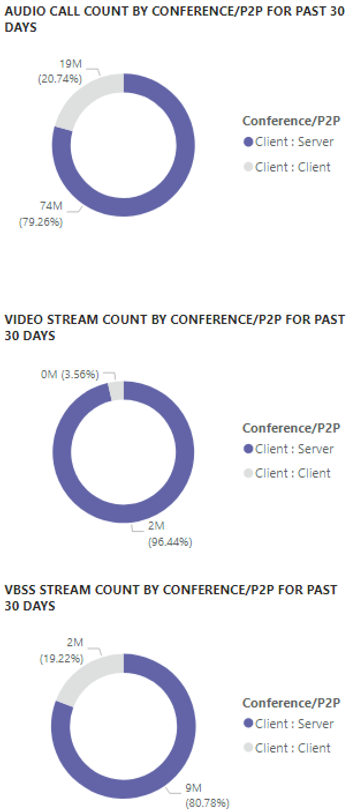

# Afficher l’utilisation de Microsoft teams dans Power BI à l’aide de données bordView Microsoft Teams utilization in Power BI using CQD data

Nouveauté du 2020 mars, nous avons ajouté un rapport sur l’utilisation des équipes aux [modèles de requête Power bi pour bord](https://github.com/MicrosoftDocs/OfficeDocs-SkypeForBusiness/blob/live/Teams/downloads/CQD-Power-BI-query-templates.zip?raw=true).New in March 2020, we've added a Teams Utilization report to our downloadable [Power BI query templates for CQD](https://github.com/MicrosoftDocs/OfficeDocs-SkypeForBusiness/blob/live/Teams/downloads/CQD-Power-BI-query-templates.zip?raw=true). 

Ce nouvel état d’utilisation de teams vous permet de déterminer la façon dont vos utilisateurs utilisent Microsoft Teams.This new Teams Utilization reports lets you see how (and how much) your users are using Microsoft Teams. Ces rapports sont destinés à être centralisés pour permettre à la fois aux administrateurs et aux leaders du marché d’avoir accès à ces données.These reports are intended to be a centralized location that both administrators and business leaders can quickly go to for this data.

Le rapport taux d’utilisation de Microsoft Team BI comporte deux rapports principaux : **[Résumé des appels et synthèse](#call-count-summary-report)** des **[minutes audio](#audio-minutes-summary-report)**.The Teams Utilization Power BI report consists of two primary reports: **[Call Count Summary](#call-count-summary-report)** and **[Audio Minutes Summary](#audio-minutes-summary-report)**. Les rapports sur l' [utilisation quotidienne](#daily-usage) et les [Détails audio régionaux](#regional-audio-details) sont disponibles lorsqu’un utilisateur tire parti des rapports d’exploration, indiqués dans les descriptions ci-dessous.The [Daily Usage](#daily-usage) and [Regional Audio Details](#regional-audio-details) reports come into play when a user takes advantage of the drill-down reports, noted in the descriptions below.

> [!NOTE]
> Les données de bâtiment et de sous-réseau doivent être renseignées pour fournir des fonctionnalités de filtrage régionale et réseau.Building and subnet data must be populated to provide regional and network filtering capabilities.

## Rapport de synthèse sur le nombre d’appelsCall Count Summary Report

La page principale (Résumé du numéro d’appel) fournit immédiatement le nombre de sessions audio, vidéo et de partage d’écran au cours des 30 et 90 derniers jours, comme indiqué dans le titre de section.The main page (Call Count Summary) immediately provides the number of audio, video and screen sharing sessions over the last 30 and 90 days as noted in the section title. Les données affichées initialement s’affichent pour l’ensemble de l’organisation et peuvent être filtrées à l’aide des options de la liste déroulante des segments sur le côté gauche de la page.The data initially displayed is for the organization as a whole and can be filtered using the slicer dropdown options on the left side of the page.

1. Dans la partie droite de la liste déroulante du segment, le nombre d’appels par type de média est scindé en affichage interne/externe au cours des 30 derniers jours.To the right of the slicer dropdowns, the number of calls by media type is broken down to an internal/external view over the past thirty days. Dans la capture d’écran ci-dessus, nous pouvons voir plus d’appels à partir d’emplacements d’organisation extérieurs, ce qui est pertinent pour l’environnement global actuel.We can see through the above screenshot that there are more calls happening from outside organizational locations, which makes sense considering the current global environment.
  

1. À droite de la zone nombre de types de média, nous avons le nombre d’appels mensuels par type de média pour les derniers 90 jours.To the right of the media type count box, we have the Monthly Call Count by Media Type for the last 90 days. Chaque type de colonne et de média peut être pointé pour afficher le nombre d’un mois précédent ou du mois actuel jusqu’à ce jour, en fournissant des informations de tendance d’utilisation.Each column and media type can be hovered over to display the count for a previous month or the current month to date, providing usage trend information.
  

1. Le graphique au milieu ne fonctionne pas comme le graphique de jour de 90, mais il fournit un affichage d’utilisation journalière pour les 30 derniers jours, et permet à un utilisateur de cliquer avec le bouton droit sur les détails d’un jour spécifique.The middle graph functions as the 90-day graph does, however it provides a daily usage view for the past 30 days and allows a user to right click and drill down into details for a specific day.
  

Dans la section en bas à gauche de la page se trouve un tableau qui fournit des valeurs totales pour chaque type de média au cours de l’année écoulée.On the bottom left section of the page, you'll find a table providing total values for each media type over the past year. 
    
  
Ce tableau inclut également une analyse approfondie pour vous permettre de voir une répartition des données régionale.The table also has an available drill down where you can see a regional data breakdown.
    

À droite du tableau, un graphique à barres affiche les clients les plus utilisés (appels/flux) au cours des 30 derniers jours.To the right of the table, a bar chart shows clients with the most use (calls/streams) for the past 30 days.
   

Le dernier ensemble de graphiques pour cette page présente chaque type de média individuellement, avec une répartition indiquant une utilisation de conférences et de réseaux P2P.The last set of charts for this page show each media type individually, with a breakdown showing conference and P2P usage. Les graphiques ci-dessous montrent qu’il existe un nombre nettement supérieur d’utilisation de conférences par rapport au P2P.The charts below show that there is a significantly higher number of conference usage as compared to P2P.
  

## Rapport de synthèse des minutes audioAudio Minutes Summary Report

Le rapport d’utilisation des minutes audio est fourni dans quelques affichages.On the Audio Minutes usage report, the total minute usage is provided through a few different views. 

Le résumé de l’utilisation de l’espace de 30 jours est affiché en regard des segments comme facile à utiliser pour les zones de texte.We have the thirty-day usage summary shown next to the slicers as easy to consume text boxes. Le numéro supérieur correspond au total du trente jours, avec les répartitions internes et externes.The top number shows the thirty-day total, with internal and external breakdowns below that.

Le graphique barre supérieure droite fournit une vue yearlong de l’utilisation de la fonction audio de conférence.The top right bar graph provides a yearlong view of conference audio usage. Pointez sur le mois pour afficher les minutes audio de la Conférence.Hover over the month to show the conference audio minutes.

Pour afficher la différence entre le son de votre interligne et celle de la conférence téléphonique, le graphique en bas à gauche tire tout le son de l’année dernière et le scinde entre les deux types.To show the difference in P2P and conference audio, the bottom left chart takes all audio for the past year and breaks it up between the two types.

 de synthèse sur le pays d’appel le dernier graphique pour la page minutes audio montre l’utilisation des minutes audio sur une façade de carte globale. The last chart for the Audio minutes page shows audio minute usage on a global map overlay. Ce graphique ne fonctionnera que si les données de génération et de sous-réseau sont téléchargées vers le client.This chart will only work if building and subnet data is uploaded to the tenant. La superposition de graphique en secteurs sur la carte peut être percée, ce qui vous permet de fournir une utilisation audio régionale.The pie chart overlay on the map can be drilled into, subsequently providing regional audio usage.

## Fonctionnalités d’analyse approfondieDrill-through capabilities

Comme indiqué précédemment, les utilisateurs peuvent explorer les rapports d’utilisation quotidienne et régionale.As previously noted, users can drill into the daily and regional usage reports.

### Utilisation quotidienneDaily Usage

Le rapport d’utilisation quotidienne permet à un administrateur d’identifier les périodes de forte consommation au cours d’une journée.The Daily Usage report allows an administrator to identify peak consumption periods through the course of a day. En plus de l’utilisation, nous sommes en mesure de capturer les informations et les commentaires globaux de chaque jour.In addition to usage, we are also able to capture overall user sentiment and feedback for that day.

Ces données peuvent être utilisées pour identifier les régions rencontrant des problèmes en temps maximum de consommation.This data can be used to identify regions having problems during peak consumption times.

1.  Sur la page Résumé du numéro d’appel, accédez à une date spécifique.On the Call Count Summary page, drill-through on a specific date. Regardez la tendance horaire du jour pour trouver le taux d’utilisation maximal.Look at the hourly trend that day to find the peak utilization.
  

2.  Cliquez sur la colonne de ce jour pour afficher les métriques de cette heure.Click on the column for that day to display metrics for that hour.
  
    
    1.  Le tableau sous le graphique affiche les mesures pour cette heure.The table below the chart will display the metrics for that hour. Vous pouvez trier ce critère par n’importe quel en-tête de colonne. Néanmoins, nous aimerions pouvoir Rechercher les zones problématiques.This can be sorted by any column header; however, we would be interested in finding problematic areas.  
        
    
    2.  Nous voyons que la région de IND rencontre des performances vidéo médiocres pendant ce laps de temps.We see that the IND region is experiencing poor video performance in conferences during this time frame. Par la suite, les rapports Microsoft bord QER peuvent être utilisés pour affiner l’emplacement problématique, car le cadre de la région et de l’heure a été identifié.Subsequently, the CQD QER Microsoft reports can be used to narrow down the problematic location as the region and time frame has been identified.

### Détails audio régionauxRegional Audio Details

Les détails audio régionaux d’une analyse descendante montrent en particulier l’utilisation des minutes audio pour la région sélectionnée.The Regional Audio Details drill down specifically shows the audio minute usage for the selected region. Les utilisateurs disposant d’un accès à bord peuvent voir les tendances d’utilisation pour les appels audio et vidéo P2P au sein de la région sélectionnée.Users with access to CQD can see usage trends for both P2P and conference audio within the selected region.

1.  Dans la page Résumé du numéro d’appel, accédez à la zone de recherche en tant que région spécifique dans le tableau.On the Call Count Summary page, drill-through to as specific region through the table.
  

2.  Sélectionnez la ligne contenant les informations supplémentaires nécessaires pour la région.Select the row with the region additional information is needed for.
  

3.  Les tendances des données indiquent un nombre considérable de minutes d’utilisation sur le réseau interne, avec une conférence bien plus longue.The data trends show a significant number of minutes being used on the internal network, with conferencing far surpassing P2P use.
  

La tendance régionale du son peut être utilisée pour illustrer la façon dont les utilisateurs sont affectés par des influences externes dans le monde.The regional audio trend can be used to show how users are impacted by external influences in the world. Pour l’instant, nous vous attendons d’avoir accès à l’utilisation externe des régions EMEA et APAC qui peuvent être utilisées par les personnes invitées à travailler à distance.Specifically, right now, we would expect to see the external usage for the EMEA and APAC regions to increase with people being asked to work remotely.

## Sujets associésRelated topics

[Dimensions et mesures disponibles dans le tableau de bord de qualité des appelsDimensions and measures available in Call Quality Dashboard](dimensions-and-measures-available-in-call-quality-dashboard.md)

[Classification de flux de données dans le tableau de bord de qualité des appelsStream Classification in Call Quality Dashboard](stream-classification-in-call-quality-dashboard.md)

[Configurer l'analyse des appels Skype EntrepriseSet up Skype for Business Call Analytics](set-up-call-analytics.md)

[Utiliser l’analyse des appels pour résoudre les problèmes de qualité des appelsUse Call Analytics to troubleshoot poor call quality](use-call-analytics-to-troubleshoot-poor-call-quality.md)

[Tableau de bord Analyse des appels et Qualité des appelsCall Analytics and Call Quality Dashboard](difference-between-call-analytics-and-call-quality-dashboard.md)
 