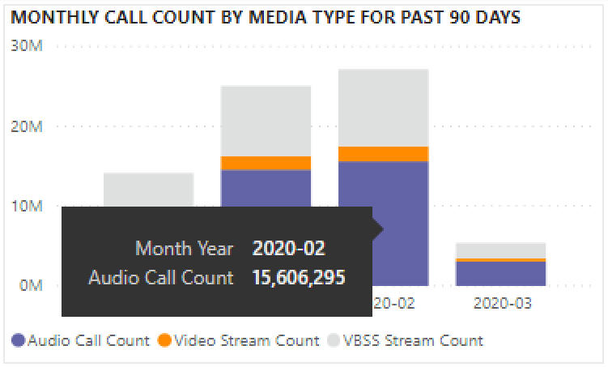

# Afficher Microsoft Teams’utilisation Power BI’aide des données du CQD

Nouveautés de mars 2020, nous avons ajouté un rapport d’utilisation Teams à nos modèles de requêtes Power BI téléchargeables pour le [CQD.](https://github.com/MicrosoftDocs/OfficeDocs-SkypeForBusiness/blob/live/Teams/downloads/CQD-Power-BI-query-templates.zip?raw=true) 

Ce nouveau rapport Teams’utilisation vous permet de voir comment (et quelle) vos utilisateurs utilisent Microsoft Teams en accédant aux données du tableau de bord de qualité des appels Teams’utilisateurs. Ces rapports sont destinés à être un emplacement centralisé que les administrateurs et les chefs d’entreprise peuvent rapidement utiliser pour ces données.

Le Teams’utilisation Power BI se compose de deux rapports **** principaux : Le récapitulatif du nombre d’appels et le résumé **[des minutes audio.](#audio-minutes-summary-report)** [L’utilisation quotidienne,](#daily-usage)les [détails](#regional-audio-details)audio  régionaux, les détails des conférences et les rapports de la liste d’utilisateurs sont pris en compte lorsqu’un utilisateur tire parti des rapports d’analyse détaillée, comme indiqué dans les descriptions ci-dessous. 

> [!NOTE]
> Les données de bâtiment et de sous-réseau doivent être remplies pour fournir des fonctionnalités de filtrage régionales et réseau.

## Rapport de synthèse du nombre d’appels

La page principale (call Count Summary) fournit immédiatement le nombre de sessions audio, vidéo et de partage d’écran au cours des 30 et 90 derniers jours, comme indiqué dans le titre de la section. Les données initialement affichées s’affichent pour l’organisation dans son ensemble et peuvent être filtrées à l’aide des options de filtrage de la partie gauche de la page.

1. À droite des dropdowns de slicer, le nombre d’appels par type de média est décomposé en vue interne/externe au cours des 30 derniers jours. Nous pouvons voir via la capture d’écran ci-dessus qu’il y a davantage d’appels en provenance d’emplacements organisationnels extérieurs, ce qui est logique dans l’environnement global actuel.
  

1. À droite de la zone du nombre de types de médias, nous avons le nombre d’appels mensuels par type de média au cours des 90 derniers jours. Chaque colonne et chaque type de média peut être survolé pour afficher le nombre de mois précédent ou de mois en cours à ce jour, afin de fournir des informations sur la tendance d’utilisation.
  
 

1. Le graphique du milieu fonctionne comme le graphique de 90 jours. Toutefois, il fournit un affichage de l’utilisation quotidienne pour les 30 derniers jours et permet à un utilisateur de cliquer avec le bouton droit et d’descendre dans les détails pour un jour spécifique.
  

Dans la section inférieure gauche de la page, vous trouverez un tableau fournissant les valeurs totales de chaque type de média au cours de l’année précédente. 
        

À droite du tableau, un graphique à barres affiche les clients les plus utilisés (appels/flux) au cours des 30 derniers jours.
   

Le dernier ensemble de graphiques pour cette page affiche chaque type de média individuellement, avec une répartition montrant l’utilisation des conférences et P2P. Les graphiques ci-dessous indiquent qu’il y a un nombre d’utilisation des conférences nettement plus élevé que P2P.
  

## Rapport de synthèse des minutes audio

Dans le rapport d’utilisation des minutes audio, le total des minutes d’utilisation est indiqué sur plusieurs affichages. 

Le résumé de l’utilisation sur 30 jours est présenté à côté des slicers pour vous aider à utiliser les zones de texte. Le nombre supérieur affiche le total de 30 jours, avec des répartitions internes et externes en dessous.

Le graphique à barres supérieure droite offre un affichage annuel de l’utilisation de l’audio dans les conférences. Placez le pointez sur le mois pour afficher les minutes audio de la conférence.

Pour afficher la différence en audio P2P et en conférence, le graphique en bas à gauche prend tout l’audio de l’année passée et le décompose entre les deux types.

Le dernier graphique de la page Minutes audio affiche l’utilisation des minutes audio sur une carte globale superposée. Ce graphique ne fonctionne que si les données bâtiment et sous-réseau sont téléchargées sur le client. Il est possible d’utiliser le graphique en secteurs superposé sur la carte pour fournir par la suite une utilisation audio régionale.

## Fonctionnalités d’analyse

Comme indiqué précédemment, les utilisateurs peuvent utiliser les rapports d’utilisation quotidiennes et régionaux.

### Utilisation quotidienne

Le rapport Utilisation quotidienne permet à un administrateur d’identifier les pics de consommation tout au long d’une journée. En plus de l’utilisation, nous sommes également en mesure de capturer les opinions globales des utilisateurs et les commentaires pour ce jour.

Le rapport Utilisation quotidienne affiche le nombre de partages d’écran, audio et vidéo pour le jour sélectionné, avec une possibilité supplémentaire de différencier les connectivité interne et externe. Une répartition de conférence et d’égal à égal est à la droite immédiate de la zone de total de la modalité. La partie supérieure droite du rapport fournit la liste des conférences qui se sont tenues pendant la journée avec leur ID et les participants associés. La liste des conférences fournit également une analyse supplémentaire du rapport des détails de la conférence. REPLACE GRAPHIC

Le graphique à barres dans la zone centrale permet à l’utilisateur d’identifier les pics de consommation tout au long d’une journée. Les utilisateurs peuvent descendre dans l’heure représentée sur le graphique qui présente le rapport Liste utilisateur pour l’heure.

À droite du graphique à barres, les commentaires des utilisateurs sont présentés dans un format visuel. Bien que les opinions des utilisateurs soient subjectifs, elles fournissent des informations permettant d’identifier les problèmes potentiels.

Le tableau inférieur fournit une plage d’indicateurs pour la journée. Des pourcentages médiocres et des taux d’échec peuvent fournir à un administrateur les domaines d’amélioration potentiels. Chaque heure peut également être sélectionnée individuellement, comme illustré ci-dessous.

Ces données peuvent être utilisées pour identifier les régions qui ont des problèmes pendant les pics de consommation.

Cliquez sur la colonne de ce jour pour afficher des mesures pour cette heure.

  
  1.  Le tableau sous le graphique affiche les mesures pour cette heure. Celui-ci peut être trié sur n’importe quel en-tête de colonne . toutefois, nous nous intéressent à la recherche de domaines problématiques.  
    
    
  2.  Nous voyons que la région IND connaît des performances vidéo médiocres lors des conférences pendant cette période. Par la suite, les rapports Microsoft QER du CQD peuvent être utilisés pour restreindre l’emplacement problématique à mesure que la région et la période ont été identifiées.

### Détails de la conférence

Le rapport des détails de la conférence fournit des informations supplémentaires sur les réunions( liste des participants, types de médias utilisés pendant la session).

Cliquez avec le bouton droit sur une conférence dans la barre d’ID de conférence sur la page Utilisation quotidienne pour consulter les détails de la conférence.

  

Nous pouvons voir les participants à la conférence ainsi que toutes les informations pertinentes sur la perte de paquets et la gigue pour aider à résoudre les problèmes potentiels dans le tableau inférieur.

### Détails de l’audio régional

L’analyse Regional Audio Details présente particulièrement l’utilisation des minutes audio pour la région sélectionnée. Les utilisateurs ayant accès au DQD peuvent voir les tendances d’utilisation du P2P et de l’audio de conférence dans la région sélectionnée.

1.  Dans la page Récapitulatif du nombre d’appels, recherchez une région spécifique dans la table.
  

2.  Sélectionnez la ligne pour qui vous avez besoin d’informations supplémentaires sur la région.
  

3.  Les tendances de données montrent un nombre important de minutes utilisées sur le réseau interne, avec une utilisation P2P beaucoup plus importante.
  

La tendance audio régionale peut être utilisée pour montrer l’impact des influences externes sur les utilisateurs dans le monde. Plus précisément, à l’heure actuelle, nous nous attendions à ce que l’utilisation externe des régions EMEA et APAC augmente avec le travail à distance des personnes.

### Liste d’utilisateurs

La liste des utilisateurs descend dans la liste fournit, comme on peut s’y attendre, des informations spécifiques à l’utilisateur pour une heure spécifique sélectionnée par la personne qui affiche le rapport. Le rapport Liste d’utilisateurs est accessible via une recherche dans le graphique Tendances horaires du rapport Utilisation quotidienne. Cliquez avec le bouton droit sur l’heure pour obtenir les informations supplémentaires nécessaires, puis sélectionnez Drill through and User List (Liste d’utilisateurs), comme illustré ci-dessous.

Le rapport Liste d’utilisateurs affiche la connectivité interne/externe via le graphique en doughnuts en haut au centre de la page. L’image ci-dessous montre qu’un large nombre de participants se trouve en dehors du réseau d’entreprise.

La partie supérieure droite du graphique indique le nombre d’appels effectués par chaque utilisateur au cours de cette heure.

Le tableau inférieur fournit des informations détaillées sur les sessions à qui chaque utilisateur a participé au cours de cette heure. La colonne Type d’échec est utile pour déterminer ce qui a provoqué la chute d’un appel. Les colonnes Du périphérique de capture et de rendu sont utiles pour identifier la raison pour laquelle un appel a été signalé pour une qualité médiocre.

## Rubriques connexes

[Dimensions et mesures disponibles dans le tableau de bord de qualité des appels](dimensions-and-measures-available-in-call-quality-dashboard.md)

[Classification de flux de données dans le tableau de bord de qualité des appels](stream-classification-in-call-quality-dashboard.md)

[Configurer l'analyse des appels Skype Entreprise](set-up-call-analytics.md)

[Utiliser l’analyse des appels pour résoudre les problèmes de qualité des appels](use-call-analytics-to-troubleshoot-poor-call-quality.md)

[Tableau de bord Analyse des appels et Qualité des appels](./monitor-call-quality-qos.md)

[Résolution des problèmes de Teams](/MicrosoftTeams/troubleshoot/teams)
