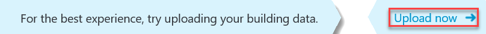
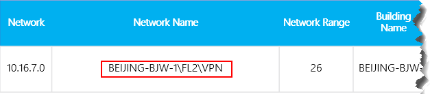
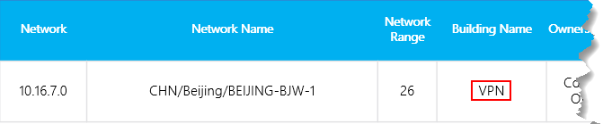

# Télécharger du client et du bâtiment dans le tableau de bord de qualité des appels

Pour obtenir le meilleur enseignement du tableau de bord de qualité des appels, nous vous recommandons de charger les données de votre client et de créer des données. Il existe 2 types de fichiers de données client ( [Bâtiment](#upload-building-data-file) et [Point de terminaison).](#endpoint-data-file)

Vous pouvez télécharger un exemple de modèle de données client [ici.](https://github.com/MicrosoftDocs/OfficeDocs-SkypeForBusiness/blob/live/Teams/downloads/locations-template.zip?raw=true) Pour obtenir de l’aide sur le mappage des bâtiments, voir Créer un mappage des bâtiments [pour le CQD.](CQD-building-mapping.md)

Dans le tableau de bord des  rapports de synthèse du tableau de bord de qualité des Télécharger du tableau de bord, sélectionnez Données client dans le **menu** Paramètres du tableau de bord (icône d’engrenage dans la partie supérieure du tableau de bord). À partir de cet emplacement, les administrateurs peuvent charger les informations de bâtiment et de point de terminaison de leur organisation, telles que le mappage des adresses IP et des informations géographiques, le mappage de chaque point d’accès sans fil et de son adresse MAC, etc.

1. Ouvrez le tableau de Teams puis sélectionnez l’icône d’engrenage dans le coin supérieur droit, puis choisissez Données client Télécharger dans la page Rapports de [https://cqd.teams.microsoft.com](https://cqd.teams.microsoft.com) synthèse.  

   
    
2. Si c’est la première fois que vous consultez le CQD, vous êtes invité à télécharger les données bâtiment. Vous pouvez sélectionner **Télécharger maintenant** pour accéder rapidement à la page Données **client Télécharger** client.

   

3. Dans la page **Données Télécharger** client, **sélectionnez Parcourir** pour choisir un fichier de données.

4. Après avoir sélectionné un fichier de données, spécifiez une **date de début** et, éventuellement, une date de fin.

5. Après avoir sélectionné la **date de début,** **sélectionnez Télécharger** charger le fichier dans le fichier du même nom.   Avant de charger le fichier, celui-ci doit être validé. En cas d’échec de la validation, un message d’erreur s’affiche pour vous demander de corriger le fichier. La figure suivante illustre une erreur qui se produit lorsque le nombre de colonnes dans le fichier de données est incorrect.

   
 
6. En l’absence d’erreur lors de la validation, le téléchargement du fichier aboutra. Vous pouvez alors voir le fichier de données téléchargé dans le tableau Mes **téléchargements,** qui affiche la liste complète de tous les fichiers transférés pour le client actuel au bas de cette page.

> [!NOTE]
> Le traitement du fichier de bâtiment peut prendre jusqu’à quatre heures.    Si vous avez déjà téléchargé un fichier de bâtiment et que vous avez besoin d’ajouter des sous-réseaux manqués ou exclus, modifiez le fichier d’origine en ajoutant les nouveaux sous-réseaux, supprimez le fichier actuel et téléchargez à nouveau le fichier modifié. Il ne peut y avoir qu’un seul fichier de données bâtiment actif dans le fichier de qualité des fichiers. 

## Télécharger fichier de données dans le bâtiment

Le premier type de fichier de données client du fichier de qualité des droits client est le **fichier de données** Bâtiment. La colonne Sous-réseau est dérivée d’un développement de la colonne Network+NetworkRange, puis de la jointation de la colonne Sous-réseau à la colonne First Subnet ou Second Subnet de l’enregistrement d’appel pour afficher les informations bâtiment, ville, pays ou région. Le format du fichier de données que vous téléchargez doit répondre aux critères suivants pour réussir la vérification de validation avant le téléchargement :
  
- Le fichier doit être soit un fichier .tsv (les colonnes sont séparées par une tabulation), soit un fichier .csv (les colonnes sont séparées par une virgule).

- Le fichier de données n’inclut pas de ligne d’en-tête de tableau. La première ligne du fichier de données doit être une donnée réelle, et non des étiquettes d’en-tête telles que « Réseau ».

- Les types de données dans le fichier peuvent uniquement être de type Chaîne, Integer ou Booléen. Pour ce type de données, la valeur doit être une valeur numérique. Les valeurs boolé européennes doivent être 0 ou 1.

- Si une colonne utilise le type de données Chaîne, un champ de données peut être vide, mais doit tout de même être séparé par une tabulation ou une virgule. Un champ de données vide attribue simplement une valeur de chaîne vide.

- Il existe une limite de 1 000 000 lignes étendues par fichier de données client.

- Il doit y avoir 15 colonnes pour chaque ligne, chaque colonne doit avoir le type de données approprié et les colonnes doivent être dans l’ordre répertorié dans le tableau suivant (délimité par des virgules ou des tabulations) :

  **Format de fichier de données du bâtiment**
  
  | Nom de colonne        | Type de données | Exemple                   | Aide              |
  |--------------------|-----------|---------------------------|-----------------------|
  | NetworkIP          | String    | 192.168.1.0               | Obligatoire              |
  | NetworkName        | String    | USA/Seattle/SEATTLE-SEA-1 | Obligatoire1  |
  | NetworkRange       | Numéro    | 26                        | Obligatoire              |
  | BuildingName       | String    | SEATTLE-SEA-1             | Obligatoire1  |
  | Type de propriété      | String    | Contoso                   | Facultatif              |
  | Type de bâtiment       | String    | Résiliation de l’it            | Facultatif              |
  | BuildingOfficeType | String    | Ingénierie               | Facultatif              |
  | Ville               | String    | Seattle                   | Recommandation           |
  | ZipCode            | String    | 98001                     | Recommandation           |
  | Pays            | String    | États-Unis                        | Recommandation           |
  | État              | String    | WA                        | Recommandation           |
  | Région             | String    | MSUS                      | Recommandation           |
  | InsideCorp2         | Bool      | 1             | Obligatoire              |
  | ExpressRoute3       | Bool      | 0             | Obligatoire              |
  | VPN                | Bool      | 0                         | Facultatif              |

  1 Sans être requis par le CQD, les modèles sont configurés pour afficher les noms de bâtiment et de réseau.

  2 Ce paramètre peut être utilisé pour déterminer si le sous-réseau se trouve ou non à l’intérieur du réseau d’entreprise. Vous pouvez personnaliser l’utilisation à d’autres fins.

  3 Ce paramètre peut être utilisé pour déterminer si le réseau utilise Azure ExpressRoute ou non. Vous pouvez personnaliser l’utilisation à d’autres fins.  

  **Exemple de ligne :**

  `192.168.1.0,USA/Seattle/SEATTLE-SEA-1,26,SEATTLE-SEA-1,Contoso,IT Termination,Engineering,Seattle,98001,US,WA,MSUS,1,0,0`

> [!IMPORTANT]
> La plage réseau peut être utilisée pour représenter un supernet (combinaison de plusieurs sous-réseaux avec un préfixe de routage unique). Tous les téléchargements du nouveau bâtiment seront vérifiés pour toutes les plages superposées. Si vous avez précédemment téléchargé un fichier de bâtiment, vous devez télécharger le fichier actuel et le charger à nouveau pour identifier les chevauchements et résoudre le problème avant de le charger à nouveau. Tout chevauchement dans les fichiers précédemment chargés peut entraîner le mappage erroné des sous-réseaux vers les bâtiments dans les rapports. Certaines implémentations VPN n’indiquent pas précisément les informations sur le sous-réseau. 
>
> La colonne VPN est facultative et utilise la valeur 0 par défaut. Si la valeur de la colonne VPN est définie sur 1, le sous-réseau représenté par cette ligne sera entièrement développé pour correspondre à toutes les adresses IP au sein du sous-réseau. Utilisez-la avec parcimonie et uniquement pour les sous-réseaux VPN, car le développement complet de ces sous-réseaux aura un impact négatif sur les temps de requête pour les requêtes impliquant la création de données. Si l’extension du sous-réseau entraîne un dépassement de la limite de ligne d’extension de 1 000 000 fichiers, le fichier de bâtiment n’est pas accepté.

### Supernetting

Vous pouvez utiliser la supernetting, communément appelée Inter-Domain routage des Inter-Domain (CIDR), au lieu de définir chaque sous-réseau. Un *supernet* est une combinaison de plusieurs sous-réseaux qui partagent un préfixe de routage unique. Au lieu d’ajouter une entrée pour chaque sous-réseau, vous pouvez utiliser l’adresse de supernet. La supernetting est prise en charge, mais nous vous déconseillons de l’utiliser.

Par exemple, le bâtiment marketing de Contoso est composé des sous-réseaux ci-dessous :

-   10.1.0.0/24 : premier étage
-   10.1.1.0/24 : deuxième étage
-   10.1.2.0/24 :troisième étage
-   10.1.3.0/24 : quatrième étage

Au lieu d’ajouter une entrée pour chaque sous-réseau, vous pouvez utiliser l’adresse de supernetted (dans cet exemple, 10.1.0.0/22).

-   Réseau = 10.1.0.0
-   Plage réseau = 22

Voici quelques éléments à prendre en compte avant d’implémenter la supernetting :

-   La supernetisation ne peut être utilisée que dans un mappage de sous-réseau avec un masque 8 bits à 28 bits.

-   L’utilisation de la supernetting prend moins de temps au premier plan, mais elle a pour effet de réduire la richesse de vos données. Supposons qu’il y a un problème de qualité impliquant le sous-réseau 10.1.2.0. Si vous avez implémenté la supernetting, vous ne savez pas où se trouve le sous-réseau ou quel type de réseau il s’agit (par exemple, un laboratoire). Si vous avez défini tous les sous-réseaux pour un bâtiment et des informations d’emplacement d’étage chargés, vous pourrez voir cette distinction.

-   Il est important de s’assurer que l’adresse supernette est correcte et n’attire pas les sous-réseaux indésirables.

-   Il est assez courant de trouver la valeur 192.168.0.0 dans les données. Pour de nombreuses organisations, cela indique que l’utilisateur est à la maison. Pour d’autres, il s’agit du modèle d’adresses IP d’un bureau satellitaire. Si votre organisation a des bureaux qui utilisent cette configuration, ne l’incluez pas dans votre fichier de construction, car il est difficile de faire la distinction entre les réseaux internes et d’accueil à l’aide de [sous-réseaux communs.](quality-of-experience-review-guide.md#common-subnets) 

> [!IMPORTANT]
> La plage réseau peut être utilisée pour représenter un supernet. Tous les téléchargements de fichiers de données du nouveau bâtiment seront vérifiés pour toutes les plages superposées. Si vous avez déjà téléchargé un fichier de bâtiment, vous devez télécharger le fichier actuel et le télécharger à nouveau pour identifier les chevauchements et résoudre le problème. Tout chevauchement dans les fichiers précédemment chargés peut entraîner le mappage erroné des sous-réseaux vers les bâtiments dans les rapports.

### VPN

Les données de qualité de l’expérience (QoE) que les clients envoient à Microsoft 365 ou Office 365, d’où viennent les données du CQD, incluent un indicateur VPN. Ce dernier s’agit des dimensions First VPN et Second VPN. Toutefois, cet indicateur s’appuie sur les rapports des fournisseurs VPN Windows que la carte réseau VPN enregistrée est une carte d’accès à distance. Tous les fournisseurs VPN n’enregistrent pas correctement les cartes d’accès à distance. De ce fait, vous ne pourrez peut-être pas utiliser les filtres de requête VPN intégrés. Utilisez la colonne VPN évoquée ci-dessus pour marquer et identifier précisément les sous-réseaux VPN. Il est également pratique d’étiqueter vos réseaux VPN pour faciliter l’identification dans vos rapports. Voici deux exemples d’étiquetage de vos sous-réseaux VPN :

- Définissez **un nom de réseau** en entrant « VPN » dans ce champ pour les sous-réseaux VPN.

  

- Définissez **un nom de** bâtiment en entrant « VPN » dans ce champ pour les sous-réseaux VPN.

  

> [!NOTE]
> Les connexions VPN ont été connues pour avoir malide le type de connexion réseau câblé lorsque la connexion sous-jacente est sans fil. Lors de l’évaluation de la qualité sur des connexions VPN, vous ne pouvez pas supposer que le type de connexion a été identifié avec précision.

## Fichier de données Point de terminaison

L’autre type de fichier de données client du CQD est le **fichier de données Point** de terminaison. Les valeurs de colonne sont utilisées dans la colonne First Client Endpoint Name ou Second Client Endpoint Name de l’enregistrement d’appel pour afficher les informations Marque de point de terminaison, Modèle ou Type de l’enregistrement d’appel. Le format du fichier de données que vous téléchargez doit répondre aux critères suivants pour réussir la vérification de validation avant le téléchargement :

- Le fichier doit être soit un fichier .tsv (les colonnes sont séparées par une tabulation), soit un fichier .csv (les colonnes sont séparées par une virgule).

- Le contenu du fichier de données n’inclut pas d’en-têtes de tableau. La première ligne du fichier de données doit être une donnée réelle, et non une étiquette d’en-tête telle que « EndpointName ».

- Les sept colonnes utilisent le type de données Chaîne uniquement. La longueur maximale autorisée est de 64 caractères.

- Les entrées sont sensibles à la cas . EndpointName **ABC123 sera** traité comme unique à partir de EndpointName **abc123.**

- Un champ de données peut être vide, mais doit tout de même être séparé par une tabulation ou une virgule. Un champ de données vide attribue simplement une valeur de chaîne vide.

- EndpointName doit être unique, faute de quoi le téléchargement échoue. S’il existe une ou deux lignes en double qui utilisent le même nom de point de terminaison, le conflit provoquera une jointation incorrecte.

- EndpointLabel1, EndpointLabel2 et EndpointLabel3 sont des étiquettes personnalisables. Il peut s’désignés comme des chaînes vides ou des valeurs telles que « Service informatique désigné 2018 Laptop » ou « Asset Tag 5678 ».

- Il doit y avoir sept colonnes pour chaque ligne et les colonnes doivent être dans l’ordre suivant :

  **Ordre de champ :**

  EndpointName, EndpointMake, EndpointModel, EndpointType, EndpointLabel1, EndpointLabel2, EndpointLabel3

  **Exemple de ligne :**

  `1409W3534, Fabrikam, Model 123, Laptop, IT designated 2018 Laptop, Asset Tag 5678, Purchase 2018`

## Mettre à jour un fichier de bâtiment

Lors de la collecte des informations sur le bâtiment et le sous-réseau, les administrateurs téléchargent souvent le fichier de bâtiment dans plusieurs itérations au fil du temps, en ajoutant de nouveaux sous-réseaux et les informations de bâtiment lorsqu’elles deviennent disponibles. Dans ce cas, vous devez charger à nouveau votre fichier de bâtiment. Ce processus est comme le téléchargement initial, comme décrit dans la section précédente, à quelques exceptions près, comme indiqué dans la section suivante.

> [!Important]
> Un seul fichier de bâtiment peut être actif à la fois. Plusieurs fichiers de construction ne sont pas cumulés.

## Ajouter de nouveaux sous-réseaux nets

Il peut parfois vous être nécessaire d’ajouter de nouveaux sous-réseaux nets au sous-réseau de qualité des contenu qui ne faisait pas partie de votre topologie de réseau à l’origine. Pour ajouter de nouveaux sous-réseaux  nets, dans le tableau de qualité des Télécharger client, vous pouvez suivre ce qui suit :

1.  Téléchargez le fichier d’origine, si vous n’avez pas encore de copie à jour.

1.  Supprimez le fichier actuel dans le fichier du groupe de travail.

1.  Modifiez le fichier de construction d’origine et fournissez une date de fin au moins un jour avant l’acquisition des nouveaux sous-réseaux.

1.  Append the net new subnets to the original building file.

1.  Télécharger le fichier de construction récemment modifié, et définissez la date de début une journée après la fin du fichier de construction précédent.

## Ajouter des sous-réseaux manquants

Une fois les informations de bâtiment téléchargées pour les réseaux gérés, chaque réseau géré doit avoir une association de bâtiments. Toutefois, ce n’est pas toujours le cas ; en règle générale, quelques sous-réseaux sont manqués. Pour rechercher ces réseaux manquants, examinez le rapport **Sous-réseau** manquant sur la page Rapports de qualité de **l’expérience** du CQD. Cela présente tous les sous-réseaux avec 10 flux audio ou plus qui ne sont pas définis dans le fichier de données du bâtiment et sont marqués comme externes. Assurez-vous qu’il n’y a pas de réseaux gérés dans cette liste. Si des sous-réseaux sont manquants, utilisez la procédure suivante pour mettre à jour le fichier de données du bâtiment d’origine et le charger à nouveau dans le tableau de qualité des fichiers.

1. Dans le CQD, **Télécharger** la page Données client.

1. Téléchargez le fichier d’origine, si vous n’avez pas encore de copie à jour.

1. Supprimez le fichier actuel dans le fichier du groupe de travail.

1. Append the new subnets to the original file.

1. Télécharger fichier du bâtiment. Veillez à définir la date de début sur au moins huit mois avant de sorte que le CQD puisse traiter les données historiques.

> [!IMPORTANT]
> Vous devez ajouter votre ID de client comme filtre de requête second **ID** client à ce rapport pour filtrer l’état et afficher uniquement les données client de votre organisation. Dans le cas contraire, le rapport affiche des sous-réseaux fédérés.

> [!NOTE] 
> N’oubliez pas d’ajuster le filtre du rapport Month Year au mois en cours. Sélectionnez Modifier, puis ajustez le **filtre du rapport Month Year** pour enregistrer le nouveau mois par défaut. 

## Sujets associés

[Créer une carte de bâtiment pour le CQD](CQD-building-mapping.md)

[Améliorer et surveiller la qualité des appels pour les Teams](monitor-call-quality-qos.md)

[Qu’est-ce que le CQD ?](CQD-what-is-call-quality-dashboard.md)

[Configurer le tableau de bord de qualité des appels](turning-on-and-using-call-quality-dashboard.md)

[Données et rapports du CQD](CQD-data-and-reports.md)

[Utiliser le CQD pour gérer la qualité des appels et des réunions](quality-of-experience-review-guide.md)

[Dimensions et mesures disponibles dans le DQD](dimensions-and-measures-available-in-call-quality-dashboard.md)

[Classification des flux dans le DQD](stream-classification-in-call-quality-dashboard.md)

[Utiliser Power BI pour analyser les données du CQD](CQD-Power-BI-query-templates.md)
