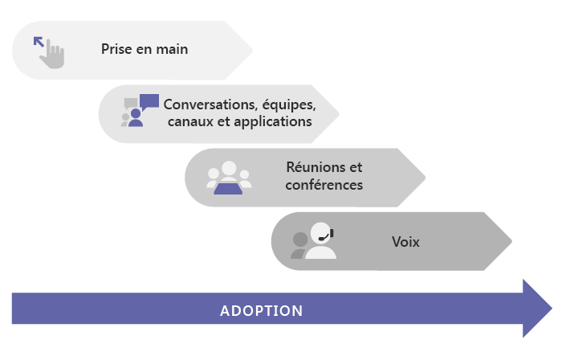

# Comment mettre en place Microsoft TeamsHow to roll out Microsoft Teams

## Démarrez iciStart here
Que vous soyez une petite entreprise ou une multinationale, le point de départ pour le déploiement de Teams est [la Prise en main](get-started-with-teams-quick-start.md).Whether you're a small business or a multi-national enterprise, the place to start for rolling out Teams is [Get started](get-started-with-teams-quick-start.md). Ce manuel vous guide dans un déploiement de Teams à petite échelle, ce qui peut être suffisant si vous êtes une petite entreprise.It walks you through a small-scale Teams rollout, which may be all you need if you're a small business. Si vous êtes une grande organisation, utilisez [Prise en main](get-started-with-teams-quick-start.md) pour établir un projet pilote avec un petit groupe de premiers utilisateurs afin de pouvoir en savoir plus sur Teams et commencer à planifier votre déploiement à l’échelle de l’organisation.If you're a larger organization, use [Get started](get-started-with-teams-quick-start.md) to pilot Teams with a small group of early adopters so you can learn about Teams and start planning your org-wide deployment. 

## Parcours recommandé pour TeamsRecommended path to Teams

Nous vous recommandons de déployer Teams en plusieurs phases, charge de travail par charge de travail, au fur et à mesure que votre organisation se prépare à la transition.We recommend rolling out Teams in stages, workload by workload, as your organization is ready. **Vous n’avez pas besoin d’attendre d’avoir effectué une étape avant de passer à la suivante.****You don’t have to wait until you've completed one step before you move to the next.** Certaines organisations souhaiteraient un déploiement de toutes les fonctionnalités de Teams en une seule fois, tandis que d’autres personnes pourront préférer une approche progressive.Some orgs may want to roll out all Teams features at once, while others may prefer a phased approach. Voici les charges de travail des équipes, dans l’ordre que nous vous recommandons pour le déploiement :Here are the Teams workloads, in the order we recommend rolling them out:

- [Prise en mainGet started](get-started-with-teams-quick-start.md)
- [Les conversations, les équipes, les canaux et les applicationsChat, teams, channels, & apps](deploy-chat-teams-channels-microsoft-teams-landing-page.md)
- [Réunions et conférencesMeetings & conferencing](deploy-meetings-microsoft-teams-landing-page.md)
- [Appels vocaux par le nuageCloud voice](cloud-voice-landing-page.md)

[Hub d’adoption](adopt-microsoft-teams-landing-page.md): tout au long de votre déploiement de Teams, n’oubliez pas de tirer parti de ces ressources pour la promotion de l’adoption de Teams.[Adoption hub](adopt-microsoft-teams-landing-page.md): Throughout your Teams rollout, be sure to take advantage of these resources to help drive Teams adoption.

## Si vous venez de Skype Entreprise, déploiements en local ou hybridesIf you're starting from Skype for Business, on-premises, or hybrid deployments

Si vous venez vers Teams de Skype Entreprise (en ligne ou en local) ou si vous avez besoin d’une configuration hybride, vous devriez quand-même suivre le [parcours recommandé](#recommended-path-to-teams) ci-dessus pour déployer Teams, mais tout d’abord vous devez planifier un peu plus.If you're coming to Teams from Skype for Business (online or on premises), or if you need a hybrid configuration, you still want to follow the [recommended path](#recommended-path-to-teams) above for rolling out Teams, but first you need to do some extra planning. Commencez par passer en revue les instructions présentées dans le tableau ci-dessous qui s’appliquent au profil de votre organisation.Start by reviewing the guidance in the table below that applies to your organization's profile.

|  |Le profil de votre organisationYour organization's profile|AideGuidance  |
|---------|---------|---------|
||J’utilise actuellement Skype Entreprise Online et je suis prêt à passer à Teams.I'm currently using Skype for Business Online, and I'm ready to move to Teams. |Accédez à [Mise à niveau vers Teams](Journey-SkypeforBusiness-Teams.md).Go to [Upgrade to Teams](Journey-SkypeforBusiness-Teams.md).        |
||Mon organisation utilise Skype Entreprise Server et je souhaite mettre en place Teams.My organization is running Skype for Business Server, and I want to roll out Teams. |Tout d’abord, pour un déploiement de Teams à grande échelle, vous devez configurer la connectivité hybride entre votre environnement local et Microsoft 365.For a full-scale Teams rollout, first you need to configure hybrid connectivity between your on-premises environment and Microsoft 365. Commencez par lire [Planification de la connectivité hybride entre Skype Entreprise Server et Office 365](https://docs.microsoft.com/skypeforbusiness/hybrid/plan-hybrid-connectivity).Start by reading [Plan hybrid connectivity between Skype for Business Server and Office 365](https://docs.microsoft.com/skypeforbusiness/hybrid/plan-hybrid-connectivity).   Vous devriez également passer en revue [Mise à niveau vers Teams](Journey-SkypeforBusiness-Teams.md).You should also review [Upgrade to Teams](Journey-SkypeforBusiness-Teams.md).    |
||Je n’ai pas Skype Entreprise Server, mais j’ai une solution PSTN en local.I don't have Skype for Business Server, but I do have an on-premises PSTN solution. Je souhaite mettre en place Teams, mais je souhaite conserver ma solution PSTN en local.I want to roll out Teams, but I want to keep my on-premises PSTN solution. |Mettre en place les équipes en suivant le [parcours recommandé](#recommended-path-to-teams) ci-dessus.Roll out Teams following  the [recommended path](#recommended-path-to-teams) above.  Lisez ensuite la [Planification d’un routage Direct](direct-routing-plan.md) pour en savoir plus sur l’utilisation d’un routage direct du système téléphonique pour connecter votre solution PSTN en local avec Teams.Then read [Plan Direct Routing](direct-routing-plan.md) to learn about using Phone System Direct Routing to hook up your on-premises PSTN solution with Teams.|
|

