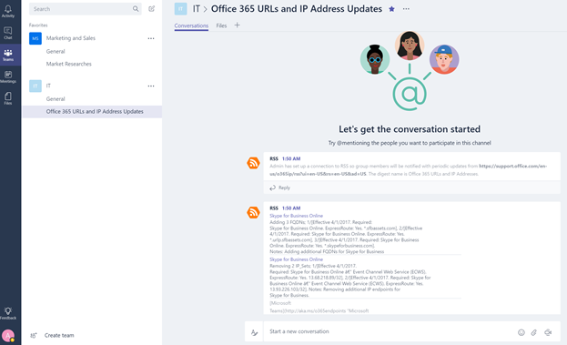
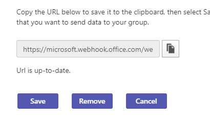

# Utiliser des Microsoft 365 et des connecteurs personnalisés dans Microsoft Teams 

Les connecteurs vous aideront à maintenir votre équipe à jour en leur adant directement dans un canal le contenu fréquemment utilisé et les mises à jour de service. Avec les connecteurs, vos utilisateurs Microsoft Teams peuvent recevoir des mises à jour de services populaires tels que Trello, Wunderlist, GitHub et Azure DevOps Services dans le flux de conversation de leur équipe. 

Tout membre d’une équipe peut connecter son équipe aux services cloud populaires avec les connecteurs si les autorisations de l’équipe le permettent et tous les membres de l’équipe sont informés des activités de ce service. Les connecteurs continueront à fonctionner même après le membre qui a initialement configuré le connecteur gauche. Tout membre de l’équipe  autorisée à ajouter\supprimer peut modifier la configuration des connecteurs par les autres membres.

Microsoft 365 connecteurs peuvent être utilisés avec les groupes Microsoft Teams et Microsoft 365, ce qui permet à tous les membres de rester synchronisés et de recevoir rapidement des informations pertinentes. Les Microsoft Teams et Exchange utilisent le même modèle de connecteur, ce qui vous permet d’utiliser les mêmes connecteurs sur les deux plateformes. Il est toutefois intéressant de noter que la désactivation des connecteurs pour le groupe Microsoft 365 dont dépend une équipe désactivera également la possibilité de créer des connecteurs pour cette équipe.

> [!NOTE]
> Les connecteurs sont désactivés par défaut dans les environnements Cloud Community (Cloud de la communauté du secteur public) pour le gouvernement. Si vous avez besoin de les activer, définissez les paramètres ConnectorsEnabled ou ConnectorsEnabledForTeams sur $true avec l’cmdlet SetOrganizationConfig. Vous devez vous connecter à [l’Exchange Online PowerShell](/powershell/exchange/connect-to-exchange-online-powershell?view=exchange-ps).

## Ajouter un connecteur à un canal

Pour l’instant, vous pouvez ajouter des connecteurs à l’aide Microsoft Teams clients de bureau et Web. Toutefois, les informations publiées par ces connecteurs peuvent être affichées dans **tous les clients, y compris les appareils** mobiles.

1. Pour ajouter un connecteur à un canal, cliquez sur les **ellipses (...),** à droite du nom d’un canal, puis cliquez **sur Connecteurs**.

    > [!div class="mx-imgBorder"]
    > 

2. Vous pouvez sélectionner parmi une série de connecteurs disponibles, puis cliquer sur **Ajouter**.

    > [!div class="mx-imgBorder"]
    > 

3. Renseignez les informations requises pour le connecteur sélectionné et cliquez sur **Enregistrer**. Chaque connecteur nécessite un ensemble d'informations pour fonctionner correctement et certains peuvent également requérir l'ouverture d'une session au service à l'aide des liens fournis dans la page de configuration du connecteur.

    > [!div class="mx-imgBorder"]
    > 

4. Les données fournies par le connecteur sont automatiquement publiées dans le canal.

    > [!div class="mx-imgBorder"]
    > 

<!---Delete this section after customer migration to new Webhook URL is complete--->
> [!IMPORTANT]
> **Notification de mise à jour d’URL de connecteur**
>
> Les Teams sont en cours de transition vers une nouvelle URL pour renforcer la sécurité. Au cours de cette transition, vous recevrez certaines notifications de mise à jour du connecteur configuré pour utiliser la nouvelle URL. Il est vivement recommandé de mettre à jour votre connecteur immédiatement pour éviter toute interruption des services de connecteur. Pour mettre à jour l’URL, vous devez suivre les étapes suivantes :
> 1. Dans la page de configuration des connecteurs, un message « Attention requise » s’affiche sous le bouton « Gérer » pour les connexions qui doivent être mises à jour.
> 
> 2. Pour les connecteurs d’espace web entrants, les utilisateurs peuvent recréer la connexion en sélectionnant simplement Mettre à jour **l’URL** et en utilisant l’URL de site web nouvellement générée.
> 
> 3. Pour les autres types de connecteurs, l’utilisateur doit supprimer le connecteur et recréer la configuration du connecteur.
> 4. Un message « URL est à jour » s’affichera une fois l’URL correctement mise à jour.
> 

## Développer des connecteurs personnalisés

Vous pouvez également créer des connecteurs personnalisés, ainsi que des sites web entrants et sortants. Pour plus d’informations, consultez notre [documentation sur les développeurs](/microsoftteams/platform/webhooks-and-connectors/what-are-webhooks-and-connectors).
