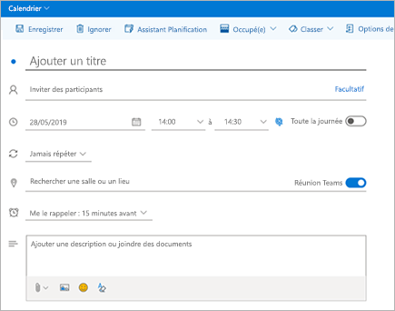

# Utiliser le complément Réunion Teams dans Outlook

Cet article détaille les exigences d’authentification et les fonctionnalités du complément Réunion Teams dans Outlook pour vos utilisateurs finaux. Il montre également comment activer des réunions privées et ajuster les paramètres de stratégie pour les utilisateurs en mode Île. Si vous rencontrez des problèmes avec le complément, consultez nos [derniers conseils de dépannage](/MicrosoftTeams/troubleshoot/meetings/resolve-teams-meeting-add-in-issues).

Le complément réunion Teams permet aux utilisateurs de planifier une réunion Teams à partir d’Outlook. Le complément est disponible pour Outlook sur Windows, Mac, web et mobile.

## Le complément Réunion Teams dans Outlook pour Windows

Le complément Réunion Teams est installé automatiquement pour les utilisateurs pour lesquels Microsoft Teams et Office 2013, Office 2016, Office 2019 ou Office 2021 sont installés sur leur PC Windows. Le complément Réunion Teams apparaîtra sur le ruban Calendrier Outlook.

> [!NOTE]
>
>
> - Il n’existe **aucune URL directe** qui fait la liaison avec le complément Teams.
> - D’autres aspects sont à prendre en considération si votre organisation exécute Teams et Skype Entreprise. Dans certains cas, le complément Teams n’est pas disponible dans Outlook. Pour plus d’informations, consultez [Effectuer la mise à niveau de Skype Entreprise vers Teams](upgrade-to-Teams-on-prem-tools.md) .
> - Les autorisations utilisateur pour exécuter le fichier Regsvr32.exe constituent une condition minimale requise pour que le complément réunion Teams soit installé sur l’ordinateur.
> - Si le complément Réunion Teams n'apparaît pas, demandez aux utilisateurs de fermer Outlook et Teams, de redémarrer d'abord le client Teams, de se connecter à Teams puis de redémarrer le client Outlook, dans cet ordre spécifique.
> - Si vous utilisez une installation d’Office Outlook à partir du Microsoft Store, le complément réunion Teams n’est pas pris en charge. Les utilisateurs qui ont besoin de ce complément sont invités à installer la version « démarrer en un clic » d’Office, comme décrit dans l’article [Office sur Windows 10 en mode S](https://support.office.com/article/faq-office-on-windows-10-in-s-mode-717193b5-ff9f-4388-84c0-277ddf07fe3f).
> - L’installation de [Webview2](/microsoft-edge/webview2/concepts/distribution) sera requise pour la fonctionnalité de complément de réunion Teams, les options de réunion incorporées. Si WebView2 n’est pas installé, les utilisateurs sont redirigés vers le navigateur, ce qui peut fournir une expérience détériorée, en particulier au moment de la création de la réunion.

## Le complément Réunion Teams dans Outlook pour Mac

Le bouton réunion Teams dans Outlook pour Mac apparaît dans le ruban Outlook pour Mac si Outlook est en cours d’exécution de la version de production 16.24.414.0 et ultérieure et est activé avec un abonnement client Microsoft 365 ou Office 365.

Les coordonnées de la réunion (lien de participation et numéros à composer Teams) sont ajoutées à l’invitation à la réunion une fois que l’utilisateur clique sur **envoyer**.  

## Le complément Réunion Teams dans Outlook Web App

Le bouton réunions Teams dans Outlook Web App s’affiche dans le cadre de la création d’un nouvel événement si l’utilisateur utilise une version antérieure du nouveau Outlook sur le web. Pour en savoir plus sur la manière dont les utilisateurs peuvent essayer la version antérieure du nouvel Outlook sur le web, consultez le [blog Outlook](https://techcommunity.microsoft.com/t5/Outlook-Blog/Designed-to-be-fast-The-Outlook-on-the-web-user-experience-gets/ba-p/234909?utm_source=t.co&utm_medium=referral).

Les coordonnées de la réunion (lien de participation et numéros à composer Teams) sont ajoutées à l’invitation à la réunion une fois que l’utilisateur clique sur **envoyer**.  

## Complément réunion Teams dans Outlook Mobile (iOS et Android)

Le bouton réunion Teams s’affiche dans les dernières versions de l’application Outlook iOS et Android.

Les coordonnées de la réunion (lien de participation et numéros à composer Teams) sont ajoutées à l’invitation à la réunion une fois que l’utilisateur clique sur **envoyer**.  

## Complément réunion Teams dans et FindTime pour Outlook

FindTime est un complément pour Outlook qui permet aux utilisateurs d’atteindre un consensus sur les horaires de réunion au sein des entreprises. Une fois que les participants à la réunion ont fourni leurs horaires préférés, FindTime envoie l’invitation à la réunion au nom de l’utilisateur. Si l’option **Réunion en ligne** est sélectionnée dans FindTime, FindTime planifiera une réunion Skype Entreprise ou Microsoft Teams. (FindTime utilise la valeur définie par votre organisation comme canal de réunion en ligne par défaut).

> [!NOTE]  
> Si vous avez enregistré un paramètre Skype Entreprise dans votre [Tableau de bord Findtime](https://findtime.microsoft.com/UserDashboard), FindTime l’utilisera à la place de Microsoft Teams. Si vous voulez utiliser Microsoft Teams, supprimez le paramètre Skype Entreprise dans le tableau de bord.

Pour plus d’informations, consultez l’article[Planifier des réunions avec FindTime](https://support.office.com/article/scheduling-meetings-with-findtime-4dc806ed-fde3-4ea7-8c5e-b5d1fddab4a6).

## Exigences d'authentification

Le complément Réunion Teams requiert de se connecter à Teams en utilisant l'authentification moderne. Si les utilisateurs n'utilisent pas cette méthode pour se connecter, ils pourront continuer à utiliser le client Teams mais ne pourront pas planifier de [réunions en ligne Teams ](https://www.microsoft.com/microsoft-teams/online-meetings)à l'aide du complément Outlook. Vous pouvez résoudre ce problème de l'une des manières suivantes :

- Si l'authentification moderne n'est pas configurée pour votre organisation, vous devez la configurer.
- Si l'authentification moderne est configurée, mais qu'ils l'ont annulée dans la boîte de dialogue, vous devez demander aux utilisateurs de se connecter à nouveau en utilisant l'authentification multifacteur.

Pour savoir comment configurer l'authentification, reportez-vous à la rubrique [Modèles d'identité et authentification dans Microsoft Teams](identify-models-authentication.md).

## Activer les réunions privées

**L'autorisation de planification de réunions privées** doit être activée depuis le Centre d'administration Microsoft Teams pour que le complément soit déployé. Dans le centre d’administration, accédez à **Réunions** > **Stratégies de la réunion**, puis, dans la section **Général**, définissez **Autoriser la planification des réunions privées** vers sur.)

Le client Teams installe le complément correct en déterminant si les utilisateurs ont besoin de la version 32 bits ou 64 bits.

> [!NOTE]
> Il est possible que les utilisateurs doivent redémarrer Outlook après une installation ou mise à niveau de Teams pour obtenir le complément le plus récent.

## Stratégie de mise à niveau Teams et complément réunions Teams pour Outlook

Les clients peuvent [choisir leur mise à niveau de la migration de Skype Entreprise vers Microsoft Teams](upgrade-and-coexistence-of-skypeforbusiness-and-teams.md). Les administrateurs de client peuvent utiliser le mode de coexistence Teams pour définir cette migration pour leurs utilisateurs. Les administrateurs de locataire ont la possibilité d’autoriser les utilisateurs à utiliser Teams en parallèle Skype Entreprise (mode d’îlots).

Lorsque les utilisateurs qui travaillent en mode d’île planifient une réunion dans Outlook, ils peuvent généralement choisir de planifier une réunion Skype Entreprise ou une réunion Teams. Dans Outlook sur le web, Outlook Windows et Mac, les utilisateurs voient les compléments Skype Entreprise et Teams en mode île par défaut. Vous pouvez configurer un paramètre de stratégie de réunion Teams pour contrôler si les utilisateurs en mode d’îlots peuvent uniquement utiliser le complément réunion Teams ou les deux compléments de réunion Teams et Skype Entreprise.

En raison de certaines limitations de la version initiale, Outlook Mobile ne peut prendre en charge que la création de réunions Skype Entreprise **ou** réunions Teams. Pour plus d’informations, consultez le tableau suivant.

| Mode de coexistence dans le centre d’administration Microsoft Teams | Fournisseur de réunions par défaut dans Outlook Mobile |
| --------------------------------------|---------------------------------------------|
| Île | Skype Entreprise |
| Skype Entreprise uniquement | Skype Entreprise |
| Collaboration Skype Entreprise avec Teams | Skype Entreprise |
| Collaboration Skype Entreprise avec Teams et réunions | Équipes |
| Teams uniquement | Équipes |

### Indiquez si les utilisateurs en mode d’îlots peuvent uniquement utiliser le complément réunion Teams ou les deux compléments de réunion Teams et Skype Entreprise.

En tant qu’administrateur, vous pouvez configurer un paramètre de stratégie de réunion Teams pour contrôler quel complément de réunion Outlook est utilisé pour *utilisateurs en mode îles*. Vous pouvez spécifier si les utilisateurs peuvent utiliser uniquement le complément réunion Teams ou les deux compléments réunion et Skype® Entreprise pour planifier des réunions dans Outlook.

Vous ne pouvez appliquer cette stratégie uniquement aux utilisateurs qui sont en mode Îles et dont le paramètre **AllowOutlookAddIn** est défini sur **True** dans leur stratégie de réunion Teams. Pour savoir comment définir cette stratégie, voir [la section Paramètres de la stratégie de réunion – Général](meeting-policies-in-teams-general.md#meeting-provider-for-islands-mode).

## Autres considérations

Certaines fonctionnalités du complément Réunion Teams sont encore en cours de création. Tenez compte des points suivants :

- Le complément réunion Teams nécessite une boîte aux lettres Exchange pour l’utilisateur principal qui planifie la réunion. Assurez-vous qu’au moins une boîte aux lettres Exchange est configurée dans votre profil Outlook et que vous pouvez l’utiliser pour planifier des réunions Teams avec le complément. Pour connaître la configuration requise pour Exchange, consultez l’article [Comment Exchange et Teams interagissent](./exchange-teams-interact.md).
- Le complément concerne les réunions planifiées avec des participants spécifiques, pas les réunions dans un canal. Les réunions de canal doivent être planifiées au sein de Teams.
- Le complément ne fonctionnera pas si un proxy d'authentification se trouve dans le chemin d'accès réseau de l'ordinateur de l'utilisateur et des services Teams.
- Les utilisateurs ne peuvent pas planifier d’événements en direct à partir d’Outlook. Accédez à Teams pour planifier des événements en direct. Pour plus d’informations, consultez [Que sont les événements en direct Microsoft Teams ?](teams-live-events/what-are-teams-live-events.md)

Découvrez les [réunions et les appels dans Microsoft Teams](https://support.office.com/article/Meetings-and-calls-d92432d5-dd0f-4d17-8f69-06096b6b48a8).

## Voir aussi

- [Résolution des problèmes de Teams](/MicrosoftTeams/troubleshoot/teams)

- [Planifier une réunion Teams à partir d'Outlook](https://support.microsoft.com/office/schedule-a-teams-meeting-from-outlook-883cc15c-580f-441a-92ea-0992c00a9b0f)
