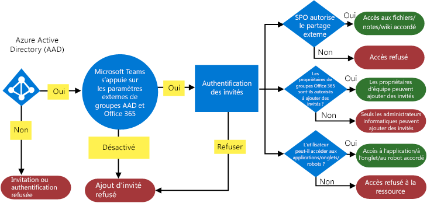
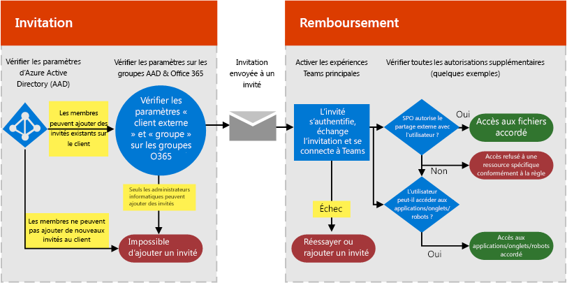
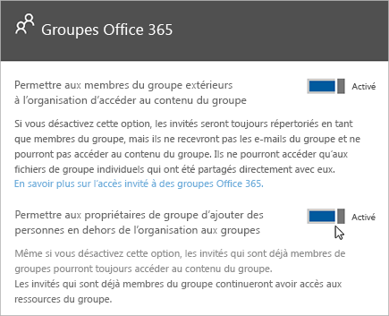

Autoriser l'accès invité dans Microsoft Teams
===========================================

Pour vous conformer aux exigences de votre organisation, vous pouvez gérer les fonctionnalités d’accès invité dans Microsoft Teams par le biais de quatre niveaux d’autorisation différents. Tous les niveaux d’autorisation s’appliquent à votre client Office 365. Chaque niveau d’autorisation contrôle l’expérience utilisateur comme indiqué ci-dessous :

- **Azure Active Directory** : l’accès invité dans Microsoft Teams repose sur la plate-forme entre entreprises (B2B) Azure AD. Ce niveau d’autorisation contrôle l’expérience des utilisateurs au niveau de l’annuaire, du client et de l’application.
- **Microsoft Teams** : contrôle l’expérience invité uniquement dans Microsoft Teams.
- **Groupes Office 365** : contrôle l’expérience utilisateur dans les groupes Office 365 et Microsoft Teams.
- **SharePoint Online et OneDrive Entreprise** : contrôle l’expérience utilisateur dans SharePoint Online, OneDrive Entreprise, les groupes Office 365 et Microsoft Teams.

Ces différents niveaux d’autorisation vous donnent de la flexibilité pour configurer l’accès invité pour votre organisation. Par exemple, si vous ne souhaitez pas autoriser d’utilisateurs invités dans votre Microsoft Teams mais que vous voulez les autoriser dans votre organisation, il vous suffit de désactiver l’accès invité dans Microsoft Teams. Autre exemple : vous pourriez activer l’accès invité aux niveaux Azure AD, Teams et Groupes, puis désactiver l’ajout d’utilisateurs invités au niveau des équipes sélectionnées qui correspondent à un ou plusieurs critères, comme par exemple une classification des données confidentielles. SharePoint Online et OneDrive Entreprise ont leurs propres paramètres d’accès invité qui ne reposent pas sur des groupes Office 365.

> [!NOTE]
> Les invités sont soumis aux mêmes limites des services [Office 365](https://go.microsoft.com/fwlink/p/?linkid=282347) et [Azure Active Directory](https://go.microsoft.com/fwlink/p/?linkid=853019). 

Le diagramme suivant montre comment la dépendance des autorisations de l’accès invité est octroyée et intégrée entre Azure Active Directory, Microsoft Teams et Office 365.

Le diagramme suivant montre, à un haut niveau, comment l’expérience utilisateur fonctionne avec le modèle d’autorisation à travers un flux invitation et d’échange d’accès invité standard.

Il est important de noter ici que les connecteurs, robots et applications peuvent nécessiter leur propre jeu d’autorisations et/ou consentement spécifiques aux comptes d’utilisateur. Il est possible qu’ils doivent être accordés séparément. De même, SharePoint impose peut-être des limites de partage externe supplémentaires pour un utilisateur spécifique, groupes d’utilisateurs, ou même au niveau du site.

Les deux diagrammes précédents sont également disponibles dans [Visio](https://github.com/MicrosoftDocs/OfficeDocs-SkypeForBusiness/blob/live/Teams/media/teams_dependencies.vsdx?raw=true).

## Contrôler l’accès invité dans Azure Active Directory

Utilisez Azure AD pour déterminer si des collaborateurs externes peuvent être invités à votre client en tant qu’invités, et de quelle façon. Pour plus d’informations sur Azure B2B, consultez [Qu’est-ce que l’accès utilisateur invité dans Azure Active Directory B2B ?](https://docs.microsoft.com/azure/active-directory/b2b/what-is-b2b). Pour plus d’informations sur les rôles d’Azure AD, voir [Accorder des autorisations aux utilisateurs des organisations partenaires dans votre client Azure Active Directory](https://docs.microsoft.com/azure/active-directory/b2b/add-guest-to-role).

Les paramètres des invitations s’appliquent au niveau du client et contrôlent l’expérience utilisateur au niveau du répertoire, du client et de l’application. Pour configurer ces paramètres sur le portail Azure, accédez à **Azure Active Directory** > **Utilisateurs** > **Paramètres utilisateur**, puis, sous **Utilisateurs externes**, sélectionnez **Gérer les paramètres de collaboration externes**.

Azure AD inclut les paramètres suivants pour configurer des utilisateurs externes :

- **Autorisations des utilisateurs invités sont limitées**: **Oui** signifie que les invités ne sont pas autorisés à effectuer certaines tâches de répertoire, comme énumérer les utilisateurs, des groupes ou autres ressources de l’annuaire. En outre, les invités ne peut pas être affectées à des rôles d’administrateur dans votre annuaire. **Non** signifie que les invités ont le même accès aux données de l’annuaire que les utilisateurs normaux dans votre annuaire.
- **Les administrateurs et utilisateurs ayant le rôle d'Inviteur d’invités peuvent inviter** : **Oui** signifie que les administrateurs et utilisateurs dans le rôle « Inviteur d’invités » peuvent ajouter des invités au client. **Non** signifie que les administrateurs et utilisateurs ne peuvent pas ajouter d’invités sur le client.
- **Les membres peuvent inviter**: **Oui** signifie que les membres non administrateurs de votre annuaire peuvent ajouter des invités pour collaborer sur des ressources sécurisées par votre Azure AD, par exemple, les sites SharePoint ou ressources Azure. **Non** signifie que seuls les administrateurs peuvent ajouter des invités à votre annuaire. 
      
    > [!IMPORTANT]
    > Pour que l’accès des invités fonctionne dans Teams, vous devez définir **Les membres peuvent inviter** sur **Oui**.
- **Les invités peuvent inviter** : **Oui** signifie que les invités de votre annuaire peuvent ajouter des invités pour collaborer sur des ressources sécurisées par votre instance d’Azure AD, par exemple, les sites SharePoint ou les ressources Azure. **Non** signifie que les invités ne peuvent pas inviter d’autres invités pour collaborer avec votre organisation.
    > [!IMPORTANT]
    > Actuellement, Teams ne prend pas en charge le rôle d’inviteur invité. Par conséquent, même si vous définissez **Les invités peuvent inviter** sur **Oui**, les invités ne peuvent pas avoir d’autres invités dans Teams.
 
Pour plus d’informations sur le contrôle de qui peut ajouter des invités, voir [Permettre une collaboration B2B externe et gérer qui peut inviter des invités](https://docs.microsoft.com/azure/active-directory/b2b/delegate-invitations).

> [!NOTE]
> Vous pouvez également gérer quels domaines peuvent être invités à votre client en tant qu’invités. Si vous souhaitez en savoir plus, veuillez consulter [Autoriser/Bloquer l’accès invité à des groupes Office 365](https://docs.microsoft.com/exchange/recipients-in-exchange-online/manage-group-access-to-office-365-groups).

Ajouter manuellement le compte utilisateur invité à Azure AD B2B n’est pas obligatoire, comme le compte sera ajouté à l’annuaire automatiquement lorsque vous ajoutez les invités à Teams.

### Gestion des licences pour l’accès invité
La gestion des licences d’accès invité fait partie de la gestion des licences Azure AD. L’accès invité est inclus dans tous les abonnements Office 365 Business Premium et Office 365 Entreprise. Pour plus d’informations sur les licences, voir [le guide de licence de collaboration Azure Active Directory B2B](https://docs.microsoft.com/azure/active-directory/b2b/licensing-guidance).

> [!NOTE]
> Les utilisateurs de votre organisation qui ont uniquement des offres d’abonnement Office 365 autonomes, telles que Exchange Online Plan 2, ne peuvent pas être invités en tant qu’invités à votre organisation, car les équipes considèrent ces utilisateurs comme membres de la même organisation. Pour ces utilisateurs utilisant Teams, un abonnement Office 365 Business Premium, Office 365 Entreprise ou Office 365 éducation doivent leur être attribués. 

## Gérer l'accès invité dans Teams

L’accès invité est désactivé par défaut dans Teams. Pour activer l’accès invité, voir [Activer ou désactiver l’accès invité dans Microsoft Teams](set-up-guests.md). 

## Contrôler l’accès invité dans Groupes Office 365

La fonctionnalité Groupes Office 365, vous permet de contrôler l’ajout d’invités et l’accès invité à tous les groupes Office 365 et aux équipes Microsoft Teams de votre organisation.

1. Connectez-vous avec votre compte d’administrateur général Office 365 dans [ https://portal.office.com/adminportal/home ](https://portal.office.com/adminportal/home).

2. À gauche, sélectionnez **Paramètres**, puis **Services &amp; compléments**.

3. Sélectionnez **Groupes Office 365**.

     
  
4. Sur la page Groupes Office 365, définissez le bouton bascule sur **Activé** ou **Désactivé**, pour autoriser ou refuser l’accès aux groupes Office 365 aux propriétaires d’équipes et de groupes externes à votre organisation. Cliquez ou appuyez sur le bouton bascule **Activé** placé en regard de côté de **Autoriser les propriétaires de groupe à ajouter des personnes à l’extérieur de l’organisation aux groupes**. Si vous définissez ce bouton bascule sur **Activé**, une autre option s’affiche. Elle vous permet de définir si vous souhaitez autoriser ou non les propriétaires d’équipes et de groupes à ajouter des personnes externes à votre organisation aux Groupes Office 365 et Microsoft Teams. Définissez ce bouton bascule sur**Activé** si vous souhaitez autoriser les propriétaires d'équipes et de groupes à ajouter des utilisateurs invités. 
 
   

Les paramètres ci-dessus s’appliquent au niveau du client et contrôlent l’expérience utilisateur dans les Groupes Office 365 et Teams.

Si vous souhaitez obtenir plus d’informations sur l’accès invité dans les groupes, notamment sur son fonctionnement et sa gestion, veuillez consulter la page [Ajout d’invités à des groupes Office 365](https://support.office.com/article/Guest-access-in-Office-365-Groups-bfc7a840-868f-4fd6-a390-f347bf51aff6). Un Forum Aux Questions y est également disponible.

## Contrôler l’accès invité à SharePoint Online et OneDrive Entreprise

Teams repose sur SharePoint Online et OneDrive Entreprise pour stocker les fichiers et les documents des canaux et des conversations.  

Pour bénéficier de l'expérience complète de l'accès invité Teams, les administrateurs d'Office 365 doivent configurer les paramètres suivants :

- Dans SharePoint Online : sélectionnez **Invités existants**, **Invités nouveaux et existants** ou **Tout le monde**.

    Si vous souhaitez obtenir plus d’informations, veuillez consulter la page [Activer ou désactiver le partage externe](https://docs.microsoft.com/sharepoint/turn-external-sharing-on-or-off).

- Dans Groupes Office 365 : activez **Autoriser les propriétaires de groupe à ajouter des personnes à l’extérieur de l’organisation aux groupes**.

    Pour plus d'informations, voir [Contrôler l'accès invité dans Groupes Office 365](#control-guest-access-in-office-365-groups)ci-dessus.
  
Ces paramètres s’appliquent au niveau du client et contrôlent l’expérience utilisateur dans SharePoint Online, OneDrive Entreprise, Groupes Office 365 et Teams.

Vous pouvez gérer les paramètres d'utilisateur externe de SharePoint Online pour les sites d’équipe connectés à Teams. Pour en savoir plus, reportez-vous à la rubrique [Gérer les paramètres de votre site des équipes SharePoint](https://support.office.com/article/Manage-your-SharePoint-team-site-settings-8376034d-d0c7-446e-9178-6ab51c58df42).

## Accès externe (fédération) et accès invité

[!INCLUDE [guest-vs-external-access](includes/guest-vs-external-access.md)]

## Voir aussi

- [Références sur les paramètres de partage d’invités de Microsoft 365](https://docs.microsoft.com/Office365/Enterprise/microsoft-365-guest-settings)
