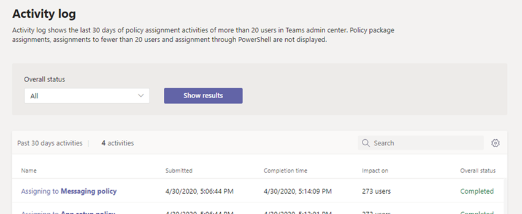

# Afficher vos affectations de stratégie dans le journal d’activité

Lorsque vous attribuez des stratégies aux utilisateurs dans le Centre d’administration Microsoft Teams, vous pouvez afficher l’état de ces affectations de stratégie dans le journal d’activité. Le journal d’activité affiche les affectations de stratégie à des lots de plus de 20 utilisateurs via le Centre d’administration Microsoft Teams au cours des 30 derniers jours. N’oubliez pas que le journal d’activité n’affiche pas les affectations de package de stratégie, les affectations de stratégie à des lots de moins de 20 utilisateurs via le Centre d’administration Microsoft Teams ou les affectations de stratégies via PowerShell.

## Afficher vos activités d’affectation de stratégie dans le journal d’activité

Pour afficher vos affectations de stratégie dans le journal d’activité :

1. Dans le volet de navigation gauche du Centre d’administration Microsoft Teams, accédez à **Accueil**, puis sous **Journal d’activité**, sélectionnez **Afficher les détails**.
2. Vous pouvez afficher toutes les affectations de stratégie ou filtrer la liste par état pour afficher uniquement les affectations qui **ne sont pas démarrées**, **en cours** ou **terminées**. Vous verrez les informations suivantes sur chaque affectation :
    - **Nom** : nom de l’affectation de stratégie. Cliquez sur le lien pour afficher plus de détails. Cela inclut le nombre d’utilisateurs auxquels la stratégie a été affectée et le nombre d’affectations terminées, en cours et non démarrées. Vous verrez également la liste des utilisateurs dans le lot, ainsi que l’état et le résultat de chaque utilisateur. Voici un exemple :

        

    - **Envoyé** : date et heure de soumission de l’affectation de stratégie.
    - **Heure d’achèvement** : date et heure de fin de l’attribution de stratégie.
    - **Impact sur** : nombre d’utilisateurs dans le lot.
    - **État global** : état de l’attribution de stratégie.

> [!NOTE]
> Vous pouvez également accéder au journal d’activité à partir de la page **Utilisateurs** . Une fois que vous avez cliqué sur **Appliquer** pour envoyer une affectation de stratégie en bloc, une bannière s’affiche en haut de la page. Cliquez sur le lien **du journal d’activité** dans la bannière.

## Sujets associés

- [Affecter des stratégies aux utilisateurs](policy-assignment-overview.md)
