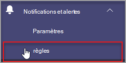
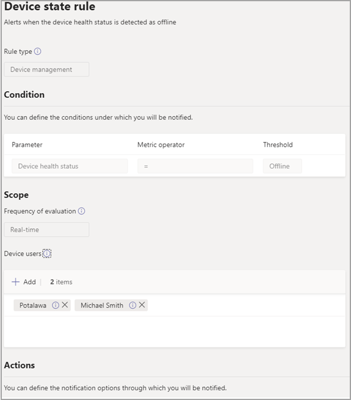

# Microsoft Teams surveillance de l’intégrité des appareils

La surveillance de l’intégrité des appareils dans le centre d’administration Microsoft Teams vous permet de surveiller de manière proactive l’intégrité de différents appareils Teams. Surveillez l’état hors connexion d’un appareil et recevez des alertes en temps réel si l’appareil surveillé dans votre organisation est mis hors connexion.  

Avant de commencer, vous aurez besoin des autorisations de création d’équipes/canaux dans votre locataire. [En savoir plus](/microsoft-365/solutions/manage-creation-of-groups?view=o365-worldwide).

## Configurer la règle d’état de l’appareil

1. Dans le volet de navigation gauche du centre d’administration Microsoft Teams, sélectionnez **Notifications & alertsRules** > .

   

2. Dans la page **Règles** , sélectionnez **Règle d’état de l’appareil**.

3. Sélectionnez l’appareil pour configurer la règle d’état pour l’activation des alertes.

    

## Interpréter la configuration de la règle

|Champ |Description  |
|--------|-------------|
|**Type de règle**   |La règle d’état de l’appareil vous aide à gérer efficacement. Teams les appareils et est classé en tant que type de gestion des appareils. À l’avenir, d’autres règles de type de gestion des appareils seront disponibles pour surveiller d’autres fonctionnalités connexes (par exemple : un appareil défectueux et l’état de connexion de l’appareil).|
|**Condition**   |Vous pouvez surveiller l’intégrité des appareils s’ils sont hors connexion. [En savoir plus](../devices/device-management.md) sur la gestion des appareils dans Teams centre d’administration. |
|**Étendue**   |Vous pouvez spécifier la fréquence à laquelle vous souhaitez surveiller l’état d’intégrité de l’appareil en mentionnant la fréquence d’évaluation des règles. Par défaut, les appareils Teams sont surveillés en quasi temps réel s’ils sont mis hors connexion. |
|**Utilisateurs de l’appareil**   |Vous pouvez spécifier les appareils qui nécessitent une surveillance proactive des statues hors connexion en les sélectionnant en fonction des utilisateurs connectés. Pour plus d’informations, reportez-vous à [Sélectionner des appareils pour la configuration](#select-devices-for-configuration) . |
|**Actions** >  **Alerte de canal**   |Dans la section Actions, vous pouvez spécifier les canaux Teams pour lesquels vous souhaitez obtenir des alertes. Actuellement, une équipe par défaut nommée **Alertes d’administration et notifications** et canal nommé **MonitoringAlerts** sera créée à l’endroit où les notifications seront remises.     Les administrateurs généraux et les administrateurs Teams de votre locataire sont automatiquement ajoutés à cette équipe par défaut.|
|**Actions** >  **Webhook**   |Vous pouvez également recevoir des notifications avec un webhook externe (facultatif). Spécifiez une URL de webhook public externe dans la section webhook où une charge utile de notification JSON sera envoyée.      La charge utile de notification, via des webhooks, peut être intégrée à d’autres systèmes de votre organisation pour créer des workflows personnalisés.   

**Schéma de charge utile JSON pour le webhook :**   
<pre lang="json">{      "type": "object",     "properties": {        "AlertTitle": { "type": "string "} ,       "DeviceLoggedInUserId": { "type": "string" } ,       "DeviceId": { "type": "string" } ,        "MetricValues": {              "type": "object",             "properties": {                   "DeviceHealthStatus": { "type": "string"}              }         } ,        "RuleName": { "type": "string"} ,        "RuleDescription": { "type": "string"} ,        "RuleFrequency": { "type": "string"} ,        "RuleType": { "type": "string"} ,        "TenantId": { "type": "string"} ,         "RuleCondition": { "type": "string"} ,         "AlertRaisedAt": { "type": "string"}      }  } </pre>   

  **Exemple de charge utile JSON** :    <pre lang="JSON">    {        "AlertTitle":"*sample_device_name* of *User_Name* has become offline",       "DeviceLoggedInUserId": *User_GUID* ,       "DeviceId": *Device_GUID* ,        "MetricValues": {           "DeviceHealthStatus": "offline"              },                  "RuleName": "Device state rule" ,        "RuleDescription": "Alerts when device health status is detected as offline" ,        "RuleFrequency": "Real-time" ,        "RuleType": "Device Management" ,        "TenantId": *Tenant_GUID* ,         "RuleCondition": "DeviceHealthStatus = Offline" ,         "AlertRaisedAt": "2020-02-28T12:49:06Z"      }  </pre>   

## Sélectionner des appareils pour la configuration

1. Vous pouvez sélectionner Teams appareils que vous souhaitez surveiller en sélectionnant les utilisateurs connectés à ces appareils. Sélectionnez **Ajouter** dans la section **Utilisateurs de l’appareil** .

2. Sélectionnez un ou plusieurs utilisateurs pour lesquels vous souhaitez surveiller l’état d’intégrité de l’appareil

   

   La liste sélectionnée des utilisateurs s’affiche dans la section **Utilisateurs de l’appareil** . Vous pouvez modifier cette liste en ajoutant ou en supprimant des utilisateurs.

Tous les appareils de connexion utilisés par la liste sélectionnée d’utilisateurs seront surveillés pour l’état d’intégrité hors connexion.

## Notifications dans Teams client

Les notifications sont remises dans le canal **MonitoringAlerts** créé automatiquement de l’équipe **Alertes et notifications** administrateur. Vous recevrez une alerte dans les 15 minutes suivant la mise hors connexion de l’appareil. 

Une notification hors connexion d’appareil peut inclure les informations suivantes :

- Nom de l’appareil hors connexion.
- Utilisateur de l’appareil hors connexion.
- Heure à laquelle l’appareil est hors connexion. (Actuellement, l’heure est présentée en UTC.)
- Type de règle qui a déclenché l’alerte.
- Pourquoi une alerte est-elle déclenchée ?
