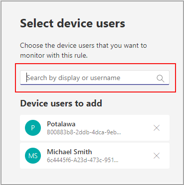

# Surveillance de l’état des appareils de Microsoft TeamsMicrosoft Teams device health monitoring

La surveillance de l’état des appareils dans le Centre d’administration Microsoft Teams vous permet de surveiller de façon proactive l’état de différents appareils Teams.Device health monitoring in the Microsoft Teams admin center gives you an ability to proactively monitor the health of various Teams devices. Surveillez l’état hors connexion d’un appareil et recevez des alertes en temps réel si l’appareil surveillé dans votre organisation se déconnecte.Monitor the offline state of a device and receive alerts in real time if the monitored device in your organization goes offline.  

Avant de commencer, vous avez besoin des autorisations de création d’équipes/canaux dans votre client.Before you start, you'll need the teams/channel creation permissions in your tenant. [En savoir plus.](/microsoft-365/solutions/manage-creation-of-groups?view=o365-worldwide)[Learn More](/microsoft-365/solutions/manage-creation-of-groups?view=o365-worldwide).

## Configurer la règle d’état de l’appareilConfigure device state rule

1. Dans la barre de navigation gauche du Centre d’administration Microsoft Teams, sélectionnez Notifications et & **des**  >  **alertes.**In the left navigation of the Microsoft Teams admin center, select **Notifications & alerts** > **Rules**.

   

2. Dans la page **Règles,** sélectionnez **Règle d’état de l’appareil.**In the **Rules** Page, select **Device state rule**.

3. Sélectionnez l’appareil pour configurer la règle d’état afin d’activer les alertes.Select the device to configure the state rule for enabling alerts.

    

## Interpréter la configuration de la règleInterpret the rule configuration

|ChampField |DescriptionDescription  |
|--------|-------------|
|**Type de règle****Rule type**   |La règle d’état de l’appareil vous aide à gérer efficacement.The device state rule helps you effectively manage. Les appareils Teams et sont classés comme types de gestion des appareils.Teams devices and is classified as a device management type. À l’avenir, d’autres règles de type de gestion des appareils seront disponibles pour surveiller d’autres fonctionnalités associées (par exemple, un appareil défectueux et l’état de la connectez-vous du périphérique).In the future, more rules of device management type will be available to monitor other related capabilities (examples may include: unhealthy device and the sign-in status of device).|
|**Condition****Condition**   |Vous pouvez surveiller l’état des appareils s’ils sont hors connexion.You can monitor the health of devices if they go offline. [En savoir plus sur](../devices/device-management.md) la gestion des appareils dans le Centre d’administration Teams.[Learn more](../devices/device-management.md) about device management in Teams admin center. |
|**Étendue****Scope**   |Vous pouvez spécifier la fréquence à laquelle vous voulez surveiller l’état d’état de l’appareil en mentionnant la fréquence d’évaluation de la règle.You can specify how frequently you want to monitor device health status by mentioning the rule evaluation frequency. Par défaut, les appareils Teams sont surveillés en temps quasi réel s’ils sont déconnectés.By default teams devices will be monitored in near real time if they go offline. |
|**Utilisateurs d’appareils****Device users**   |Vous pouvez spécifier les appareils qui ont besoin d’une surveillance proactive de l’utilisation hors connexion en les sélectionnant en fonction des utilisateurs connectés.You can specify which devices need proactive offline statue monitoring by selecting them based on signed-in users. Pour plus [d’informations, voir](#select-devices-for-configuration) Sélectionner des appareils pour plus d’informations.Refer to [Select devices for configuration](#select-devices-for-configuration) for more details. |
|**Actions**  >  **Alerte de canal****Actions** > **Channel alert**   |Dans la section Actions, vous pouvez spécifier les canaux d’équipes pour qui vous souhaitez obtenir des alertes.In the Actions section, you can specify teams channels you want to get alerts for. Actuellement, une équipe par défaut nommée **Alertes** et notifications d’administrateur et canal **MonitoringAlerts** est créée où les notifications sont remis.Currently, a default team named **Admin Alerts and Notifications** and channel named **MonitoringAlerts** will be created where notifications will be delivered to.     Les administrateurs globaux et les administrateurs Teams de votre client sont automatiquement ajoutés à cette équipe par défaut.Global administrators and Teams administrators in your tenant will be automatically added to this default team.|
|**Actions**  >  **Web se****Actions** > **Webhook**   |Vous pouvez également recevoir des notifications avec un site web externe (facultatif).You can also get notifications with an external webhook (optional). Spécifiez une URL de site web externe public dans la section web de notification où une charge utile de notification JSON sera envoyée.Specify an external public webhook URL in the webhook section where a JSON notification payload will be sent.      La charge utile de notification, via des sites web, peut être intégrée à d’autres systèmes de votre organisation pour créer des flux de travail personnalisés.The notification payload, via webhooks, can be integrated with other systems in your organization to create custom workflows.   

**Schéma de charge utile JSON pour le web :****JSON payload schema for webhook:**   
<pre lang="json">{      "type": "object",     "properties": {        "AlertTitle": { "type": "string "} ,       "DeviceLoggedInUserId": { "type": "string" } ,       "DeviceId": { "type": "string" } ,        "MetricValues": {              "type": "object",             "properties": {                   "DeviceHealthStatus": { "type": "string"}              }         } ,        "RuleName": { "type": "string"} ,        "RuleDescription": { "type": "string"} ,        "RuleFrequency": { "type": "string"} ,        "RuleType": { "type": "string"} ,        "TenantId": { "type": "string"} ,         "RuleCondition": { "type": "string"} ,         "AlertRaisedAt": { "type": "string"}      }  } </pre>  <pre lang="json">{      "type": "object",     "properties": {        "AlertTitle": { "type": "string "} ,       "DeviceLoggedInUserId": { "type": "string" } ,       "DeviceId": { "type": "string" } ,        "MetricValues": {              "type": "object",             "properties": {                   "DeviceHealthStatus": { "type": "string"}              }         } ,        "RuleName": { "type": "string"} ,        "RuleDescription": { "type": "string"} ,        "RuleFrequency": { "type": "string"} ,        "RuleType": { "type": "string"} ,        "TenantId": { "type": "string"} ,         "RuleCondition": { "type": "string"} ,         "AlertRaisedAt": { "type": "string"}      }  } </pre>   

  **Exemple de charge utile JSON**:**Sample JSON payload**:    <pre lang="JSON">    {        "AlertTitle":"*sample_device_name* of *User_Name* has become offline","AlertTitle":"*sample_device_name* of *User_Name* has become offline",       "DeviceLoggedInUserId": *User_GUID* ,"DeviceLoggedInUserId": *User_GUID* ,       "DeviceId": *Device_GUID* , "DeviceId": *Device_GUID* ,        "MetricValues": {           DeviceHealthStatus": "offline"              },                  "RuleName": "Device state rule" ,        "RuleDescription": ":"Alerts when device health status is detected as offline" ,        "RuleFrequency": "Real-time" ,        "RuleType": "Device Management" ,        "TenantId": *Tenant_GUID* , "TenantId": *Tenant_GUID* ,         "RuleCondition": "DeviceHealthStatus = Offline" ,         "AlertRaisedAt": "2020-02-28T12:49:06Z"      }  </pre>   

## Sélectionner des appareils pour la configurationSelect devices for configuration

1. Vous pouvez sélectionner les appareils Teams que vous voulez surveiller en sélectionnant les utilisateurs connectés à ces appareils.You can select Teams devices you want to monitor by selecting users signed in to those devices. Sélectionnez **Ajouter dans** la section **Utilisateurs de l’appareil.**Select **Add** from the **Device users** section.

2. Sélectionnez un ou plusieurs utilisateurs pour lesquels vous souhaitez surveiller l’état d’état de l’appareilSelect one or more users for which you want to monitor device health state

   

   La liste sélectionnée des utilisateurs s’affiche dans la section **Utilisateurs d’appareil.**The selected list of users shows in **Device users** section. Vous pouvez modifier cette liste en ajoutant ou en supprimant des utilisateurs.You can modify this list by adding or removing users.

Tous les appareils de connexion utilisés par la liste d’utilisateurs sélectionnée seront contrôlés pour vérifier l’état d’état du mode hors connexion.All the sign-in devices used by the selected list of users will be monitored for the offline health state.

## Notifications dans le client TeamsNotifications in Teams client

Les notifications sont remis dans le canal **MonitoringAlerts** créé automatiquement de l’équipe d’alertes et de notifications de **l’administrateur.**The notifications are delivered in the auto-created **MonitoringAlerts** channel of the **Admin Alerts and Notifications** Team.

Une notification hors connexion d’appareil peut inclure les informations suivantes :A device offline notification can include the following information:

- Nom de l’appareil hors connexion.The device name that's offline.
- Utilisateur de l’appareil hors connexion.The user of the offline device.
- Heure à quelle heure l’appareil s’est déconnecté ?What time the device went offline. (Actuellement, l’heure est présentée en UTC.)(Currently, the time is presented in UTC.)
- Type de règle qui a élevé l’alerte.The type of rule that raised the alert.
- Pourquoi une alerte est-elle élevée ?Why an alert is raised.