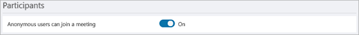

# Gérer l’accès anonyme des participants aux réunions Teams (administrateurs informatiques)

Les participants anonymes aux réunions hébergées par votre organisation sont ceux dont l’identité ne peut pas être vérifiée. Il peut s’agir des éléments suivants :

- Personnes qui ne sont pas connectés à Teams avec un compte professionnel ou scolaire 
- Personnes d’organisations non approuvées (telles que configurées dans [l’accès externe](manage-external-access.md)) et d’organisations auxquelles vous faites confiance, mais qui ne font pas confiance à votre organisation.

La participation anonyme à une réunion est contrôlée par un paramètre au niveau de l’organisation et des stratégies de niveau utilisateur. Pour que la participation à une réunion anonyme fonctionne :
- Le paramètre **Utilisateurs anonymes pouvant participer à une réunion** Teams (au niveau de l’organisation) doit être activé.
- Une stratégie de réunion Teams doit être affectée à l’organisateur de la réunion dans laquelle le contrôle **Autoriser des personnes anonymes à rejoindre une réunion** est activé.

La participation anonyme est activée par défaut pour l’organisation et dans la stratégie de réunion globale par défaut.

Notez que si la participation anonyme est activée, les stratégies de lobbying affectent la façon dont les participants anonymes rejoignent les réunions. Pour plus d’informations, consultez [Contrôler qui peut contourner la salle d’attente de la réunion dans Microsoft Teams](who-can-bypass-meeting-lobby.md).

#### Réunions avec des organisations approuvées

Lorsque vous configurez des organisations approuvées pour les réunions et les conversations externes, les participants à ces organisations peuvent être considérés comme anonymes si les paramètres d’accès externe ne sont pas configurés correctement pour les deux organisations. Pour plus d’informations, consultez [Organisations approuvées pour les réunions et les conversations externes](manage-external-access.md).

## Gérer la participation anonyme à une réunion pour l’organisation

Le paramètre de participation anonyme aux réunions au niveau de l’organisation doit être activé pour que toute personne de l’organisation puisse créer des réunions qui autorisent les participants anonymes.

> [!Important]
> Les **participants anonymes peuvent rejoindre un** paramètre de réunion à l’échelle de l’organisation seront supprimés à l’avenir. Nous vous recommandons de laisser ce paramètre **Activé** et d’utiliser le contrôle de stratégie **Autoriser les personnes anonymes à rejoindre une réunion** de niveau utilisateur pour autoriser ou empêcher la participation anonyme à une réunion.

Pour configurer la participation anonyme à une réunion pour l’organisation
1. Accédez au [Centre d’administration Teams](https://admin.teams.microsoft.com).

1. Dans la barre de navigation de gauche, accédez à **Réunions** > **Paramètres de réunions**.

1. Sous **Participants**, définissez **Les participants anonymes peuvent participer à une réunion** sur **Activé** (recommandé) ou **Désactivé**.

    

1. Sélectionnez **Enregistrer**.

## Gérer les organisateurs de réunion qui peuvent autoriser la participation anonyme à une réunion

Vous pouvez contrôler quels utilisateurs ou groupes peuvent héberger des réunions qui incluent des participants anonymes. Pour ce faire, affectez une stratégie de réunion avec participation anonyme activée à chaque organisateur de réunion qui doit héberger des réunions avec des participants anonymes.

Pour configurer la participation anonyme à une réunion pour des organisateurs de réunion spécifiques
1. Accédez au [Centre d’administration Teams](https://admin.teams.microsoft.com).

1. Dans le volet de navigation de gauche, accédez à **Stratégies de réunion des réunions** > .

1. Sélectionnez la stratégie à modifier.

1. **Définissez Autoriser les personnes anonymes à rejoindre une réunion** sur **Activé**.

1. Sélectionnez **Enregistrer**.

L’application des modifications apportées aux stratégies de réunion peut prendre jusqu’à 24 heures.

## Configurer la participation anonyme à une réunion à l’aide de PowerShell

Vous pouvez contrôler si les participants anonymes peuvent rejoindre des réunions à l’aide de :

- Paramètre `-DisableAnonymousJoin` dans [Set-CsTeamsMeetingConfiguration](/powershell/module/skype/set-csteamsmeetingconfiguration) pour configurer le paramètre au niveau de l’organisation. (Nous vous recommandons de laisser cette valeur définie sur False et d’utiliser Set-CsTeamsMeetingPolicy -AllowAnonymousUsersToJoinMeeting pour contrôler la jointure anonyme au niveau de l’utilisateur ou du groupe.)
- Paramètre `-AllowAnonymousUsersToJoinMeeting` dans [Set-CsTeamsMeetingPolicy](/powershell/module/skype/set-csteamsmeetingpolicy) pour configurer une stratégie de réunion au niveau de l’utilisateur

Pour autoriser les participants anonymes à rejoindre des réunions, vous devez configurer les deux pour autoriser la participation anonyme en définissant les valeurs suivantes :

- `Set-CsTeamsMeetingConfiguration -DisableAnonymousJoin` défini sur **$false**
- `Set-CsTeamsMeetingPolicy -AllowAnonymousUsersToJoinMeeting` défini sur **$true** pour les organisateurs de la réunion concernés

## Bloquer la jointure anonyme pour des types de clients spécifiques

Lorsque des participants anonymes sont autorisés à participer à des réunions, ils peuvent utiliser le client Teams ou un client personnalisé créé à [l’aide de Azure Communication Services](/azure/communication-services/). 

Les administrateurs peuvent bloquer l’un de ces types de clients à l’aide du `-BlockedAnonymousJoinClientTypes` paramètre dans [Set-CsTeamsMeetingPolicy](/powershell/module/skype/set-csteamsmeetingpolicy#-blockedanonymousjoinclienttypes).

## Expérience de réunion des participants anonymes

Les participants anonymes n’ont pas les mêmes fonctionnalités que les autres participants à la réunion. Par exemple, les participants anonymes :

- N’avez pas accès à la conversation de réunion avant et après la réunion
- N’avez pas accès aux cartes de profil (Cartes de profil dans Microsoft 365 - Support Microsoft)

### Comment les participants anonymes interagissent avec les applications dans les réunions

Par défaut, le paramètre permettant aux participants anonymes d’interagir avec les applications dans les réunions est activé.

Pour configurer l’accès aux applications pour les participants anonymes à la réunion

1. Accédez au [Centre d’administration Teams](https://admin.teams.microsoft.com).

1. Dans la barre de navigation de gauche, accédez à **Réunions** > **Paramètres de réunions**.

1. Sous **Participants**, définissez  **Les participants anonymes peuvent interagir avec les applications dans les réunions sur** **Activé** ou **Désactivé**.

Vous pouvez également contrôler cela avec PowerShell à l’aide `Set-CsTeamsMeetingConfiguration -DisableAppInteractionForAnonymousUsers`de .

Les participants anonymes héritent de la stratégie d’autorisation des applications Teams globales (par défaut à l’échelle de l’organisation). Les participants anonymes peuvent interagir avec les applications dans les réunions Teams tant que l’application est activée dans cette stratégie et que **les participants anonymes peuvent interagir avec les applications dans les réunions** est **Activé**.

Notez que les participants anonymes peuvent uniquement interagir avec les applications qui sont déjà disponibles dans une réunion et ne peuvent pas acquérir et/ou gérer ces applications.

## Rubriques connexes

[Participer à une réunion sans compte Teams](https://support.microsoft.com/office/c6efc38f-4e03-4e79-b28f-e65a4c039508)

[Utilisation du Centre d’administration Microsoft Teams pour configurer la stratégie à l’échelle de l’organisation](meeting-settings-in-teams.md#allow-anonymous-users-to-join-meetings)

[Les participants externes reçoivent « Se connecter à Teams pour participer ou contacter l’organisateur de la réunion »](/microsoftteams/troubleshoot/meetings/external-participants-join-meeting-blocked)

[Attribuer des stratégies dans Teams : prise en main](policy-assignment-overview.md)