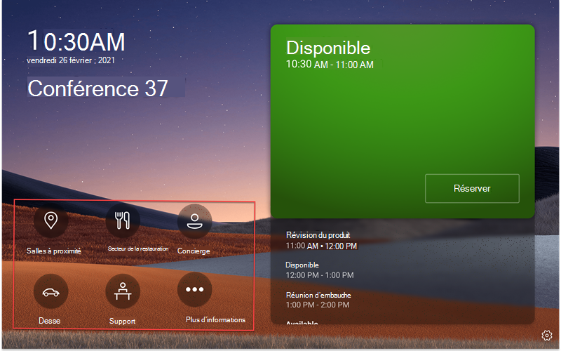
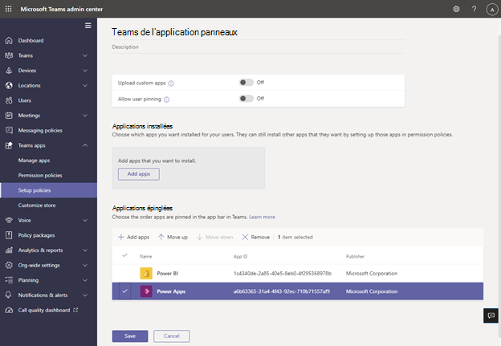

# Microsoft Teams prise en charge des applications/métier sur les panneaux Teams métier

Teams panneaux 365 ajoutent la prise en [charge Teams applications métier/applications métier.](/microsoftteams/platform/overview) Les entreprises pourront ainsi ajouter des expériences supplémentaires sur les panneaux afin de répondre aux besoins de votre organisation. Cette version prend en charge le contenu web statique.

> [!IMPORTANT]
> Cette fonctionnalité n’est disponible qu’après la mise à jour Teams vos périphériques en panneaux. Pour pouvoir l’Teams, vous devez avoir la version 1449/1.0.97.2021070601 ou une version plus récente pour que l’application soit prise en charge dans Teams panneaux.

## Teams’expérience d’application sur Teams panneaux

 

*L’Teams’accueil des carrés inclut des options de navigation de l’application, décrites dans la capture d’écran en rouge. Notez qu’il s’agit d’exemples d’icônes qui peuvent ne pas être disponibles à l’utilisation.*

*Lorsqu’un utilisateur final appuye sur l’une des icônes de l’application, il verra l’écran Teams’application s’afficher dans la capture d’écran précédente. Le rectangle gris dans la capture d’écran est l’endroit où les applications sont affichées dans Teams panneau. La barre de l’application est fixe et une partie de l’application Teams panneaux.*

## Configurer et gérer des applications de Teams panneaux dans le Centre Teams’administration 

Microsoft Teams applications apportent des informations clés, des outils courants et des processus de confiance dans un endroit où les personnes rassemblent, apprennent et travaillent. Teams applications [utilisent des fonctionnalités intégrées.](/microsoftteams/platform/concepts/capabilities-overview) À présent, en tant qu’administrateur informatique, vous avez la possibilité d’inclure les applications dans les panneaux de Teams de votre organisation et de personnaliser les autorisations via le Centre [d’administration Teams'](https://admin.teams.microsoft.com/)

Vous pouvez désormais utiliser les applications Teams sur des Teams et personnaliser l’expérience utilisateur en fonction des besoins de votre organisation. Vous pouvez choisir l’application web à laquelle vos utilisateurs peuvent accéder, utiliser et hiérarchiser les affichages des applications. Certaines options, telles que les bots et les fonctionnalités de messagerie, ne sont actuellement pas pris en charge. En savoir plus [sur les Teams et](/microsoftteams/platform/overview) comment gérer vos appareils dans [Microsoft Teams.](/microsoftteams/devices/device-management)

## Gérer les applications sur des Teams dans le Centre Teams’administration

**Remarque**: vous devez être un administrateur global ou un Teams de service pour accéder au Centre [Teams’administration.](https://admin.teams.microsoft.com/)

Les utilisateurs finaux peuvent afficher, mais pas installer, des applications sur Teams panneaux. En tant qu’administrateur, vous pouvez afficher et gérer toutes Teams applications pour votre organisation via le Centre Teams’administration. Découvrez comment gérer vos applications dans le centre d’administration [Microsoft Teams](/microsoftteams/manage-apps) via la page **Gérer les** applications. La page **Gérer les** applications du Centre Teams d’administration vous permet également de télécharger des [applications personnalisées.](/microsoftteams/manage-apps#publish-a-custom-app-to-your-organizations-app-store)

Après avoir configuré des  applications, vous  pouvez utiliser des stratégies d’autorisation d’application et des stratégies de configuration d’application pour configurer l’expérience d’application pour des comptes de salle spécifiques dans votre organisation.

## Épingler des applications sur Teams panneaux avec les stratégies de configuration de l’application

Étant donné que Teams permet d’afficher un large éventail d’applications, les administrateurs peuvent décider des applications les  plus essentielles pour l’organisation et épingler uniquement celles-ci pour l’écran d’accueil des panneaux Teams afin d’y accéder rapidement. S’il y a plus de cinq applications épinglées ou des applications non épinglées, elles apparaissent sous **l’écran** Plus. Microsoft recommande la création d’une stratégie de configuration d’application personnalisée spécialement pour les Teams panneaux.

 

Pour gérer les applications épinglées affichées sur les panneaux de Teams, connectez-vous au Centre d’administration Teams pour votre organisation et accédez aux stratégies d’installation des applications **Teams** Sélectionnez ou créez une stratégie Applications épinglées. \>  \>  \> 

 

*Les applications incluses dans cette image ne sont que des exemples et peuvent ne pas être utilisées.*

Microsoft vous recommande  de désactiver Télécharger  applications personnalisées et d’autoriser l’épinglage des utilisateurs pour une expérience d Teams application la plus Teams personnalisées.

Pour plus d’informations sur l’épinglage d’applications, voir [Gérer les stratégies de configuration des applications.](/microsoftteams/teams-app-setup-policies)

## Gérer l’ordre d’affichage des applications dans Teams panneaux 

*Les applications incluses dans cette image ne sont que des exemples et peuvent ne pas être utilisées.*

Pour gérer l’ordre d’affichage des applications sur les panneaux Teams, connectez-vous au Centre d’administration Teams pour votre organisation et accédez aux stratégies de configuration des applications **Teams** Sélectionnez les applications épinglées : Déplacer vers le \>  \>  \>  **haut/bas.**

## Affectation de stratégies d’installation à un compte de ressource de salle

Après avoir créé la stratégie d’installation, l’administrateur doit affecter cette stratégie au compte de ressource de salle qui sera Teams panneaux. Pour plus d’informations, voir [Attribuer des stratégies aux utilisateurs et groupes.](/microsoftteams/assign-policies-users-and-groups)

## FAQ

### Combien de temps faut-il Teams panneaux pour obtenir les stratégies de configuration d’application nouvelles ou mises à jour ?

Après avoir modifié ou attribué de nouvelles stratégies dans le Teams d’administration, jusqu’à 24 heures peuvent être nécessaires avant que les modifications prennent effet. Les **administrateurs** peuvent essayer de se signer/se connecter à partir du panneau,  d’appuyer sur l’icône Paramètres et de revenir à l’écran d’accueil pour essayer d’actualiser les stratégies.

### Quel est le ordre des applications sur l’écran « Autres » ?

Sur la page **Autres** applications, les applications épinglées apparaissent en premier. Toutes les autres applications installées s’affichent ensuite dans l’ordre alphabétique.

### Pourquoi les applications de bot ne s’affichent-elles pas sur Teams panneaux ?

Seuls les onglets statiques du contenu web sont pris en charge pour le moment.

### Pourquoi les applications de Teams natives, telles que Calendrier et Tâches, n’apparaissent-elles pas sur Teams panneaux ?

Les Teams natives, telles que Calendrier et Tâches, ne s’Teams panneaux.

### Dans le Teams d’administration, sous la section Stratégies d’installation, quelle est la différence entre les applications installées et épinglées ?

Pour Teams panneaux, Microsoft recommande d’utiliser des applications épinglées, afin que l’administrateur puisse sélectionner l’application souhaitée et réorganiser son ordre.

**Remarque :** Certaines applications ne supportent pas l’épinglage d’application. Contactez le développeur de l’application pour activer la fonctionnalité d’épinglage d’application.

### Pourquoi d’autres applications apparaissent-elles sur l’écran « Autres », même si elles ne font pas partie des applications installées ou épinglées dans la section de stratégie de configuration de l’application Teams ?

Si des applications étaient précédemment installées via d’autres stratégies d’application ou manuellement dans les clients de bureau/web Teams pour le compte de ressource de salle utilisé sur les panneaux de Teams, l’administrateur devra peut-être se connecter au compte de ressource de la salle dans Teams puis désinstaller manuellement les applications en cliquant avec le bouton droit sur l’application, puis en sélectionnant **Désinstaller.**

### Pourquoi ne puis-je pas trouver une application dans le volet « Ajouter des applications épinglées » ?

Toutes les applications ne peuvent pas être épinglées Teams via une stratégie de configuration d’application. Certaines applications peuvent ne pas prendre en charge cette fonctionnalité. Pour rechercher des applications qui peuvent être épinglées, recherchez l’application dans le volet Ajouter des applications épinglées.  Pour plus d’informations, consultez le [Forum aux questions dans l’aide à l’aide des stratégies de configuration d’application.](/microsoftteams/teams-app-setup-policies#why-cant-i-find-an-app-in-the-add-pinned-apps-pane)

### Pourquoi une fenêtre « Autoriser l’épinglage des utilisateurs » apparaît-elle dans le panneau des stratégies d’installation après avoir désactiver l’épinglage d’utilisateurs ?

*Les applications incluses dans cette image ne sont que des exemples et peuvent ne pas être utilisées.* 

Ce comportement est prévu pour un appareil dans un espace partagé et permet d’éviter l’épinglage d’application non intentionnelle.
