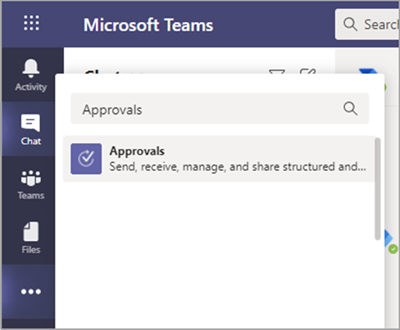
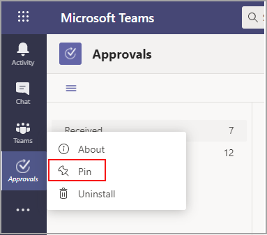
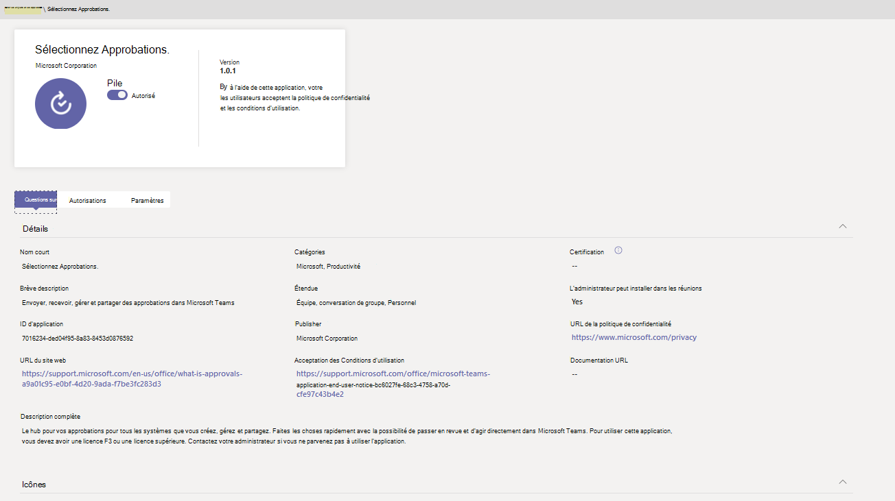

# Disponibilité de l’application Approbations Teams

L’application Approbations est disponible en tant qu’application personnelle pour tous les utilisateurs de Microsoft Teams.
L’application Approbations offre un moyen simple d’apporter des audits, de la conformité, de la responsabilité et des flux de travail à des approbations structurées et non structurées dans Teams.

 

Les utilisateurs peuvent épingler l’application Approbations pour l’enregistrer dans la barre de menus.

 

La première approbation créée à partir de l’application Approbations déclenche la mise en service de la solution d’approbation dans l’environnement de service de données courant (CDS) par défaut. Les approbations créées à partir de l’application Approbations seront stockées dans l’environnement CDS par défaut.

Cet article décrit la exigences et les rôles de l’application Approbations.

> [!NOTE]
> Cette fonctionnalité n’a pas encore été publiée pour les utilisateurs des services Cloud de la communauté du secteur public (Cloud de la communauté du secteur public), Cloud de la communauté du secteur public High (GCCH) et Department of Defense (DOD).

## Autorisations et licences requises

Pour déployer l’application Approbations, vous devez obtenir une autorisation pour les éléments suivants :

- Autorisations pour créer une base de données CDS Microsoft.

- Un compte sur [flow.microsoft.com](https://flow.microsoft.com/)

- Rôle d’administrateur dans l’environnement cible.

- Licence pour [Power Automate,](/power-automate/get-started-approvals)Office 365 ou Dynamics 365.

- Une licence microsoft Forms est requise pour que les utilisateurs définissent de nouveaux modèles d’approbation.

Pour utiliser l’application Approbations, vous avez besoin d’une licence pour Power Automate. Votre compte est automatiquement ajouté au rôle Utilisateur Approbations dans l’environnement cible sur votre première affectation d’approbation.

## Stockage avec CDS

Le modèle de données commun (CDM) est le langage de données partagé utilisé par les applications professionnelles et analytiques dans les CDS. Il s'agit d'un ensemble de schémas de données standardisés et extensibles publiés par Microsoft et ses partenaires, qui permettent d'assurer la cohérence des données et de leur signification entre les applications et les processus métier. En savoir plus sur [Modèle de données courant de Microsoft Power Platform](/power-automate/get-started-approvals).

En savoir plus sur le [flux d’approbation](/power-automate/modern-approvals).

Les approbations créées à partir d’un modèle stockent toujours les données dans des CDS, comme leur titre, les détails, l’ID de modèle, etc. Les réponses envoyées sur la demande d’approbation sont stockées dans Forms. En savoir plus sur  [le stockage de données pour Microsoft Forms.](https://support.microsoft.com/office/data-storage-for-microsoft-forms-97a34e2e-98e1-4dc2-b6b4-7a8444cb1dc3#:~:text=Where%20data%20is%20stored%20for%20Microsoft%20Forms.%20Microsoft,European-based%20tenants%20is%20stored%20on%20servers%20in%20Europe)

>[!Note]
>Si vous supprimez le modèle de formulaire sur le site Microsoft Forms, votre modèle Approbation sera supprimé et les utilisateurs ne pourront pas démarrer la demande. Les utilisateurs obtiennent une erreur « CDB TableNotFound » lors de la tentative d’ouverture d’un modèle d’approbation qui a été supprimé dans Microsoft Forms.

Les modèles d’approbation sont stockés dans le centre de données Stockage (SDS), plateforme de stockage compatible utilisée en interne uniquement à l’intérieur de Microsoft. Les modèles dans l’étendue de l’organisation sont stockés dans « shard client » de SDS, et les modèles d’étendue de l’équipe dans des « shard de groupe » de SDS. Cela signifie que les modèles à l’échelle de l’organisation partagent la même durée de vie du client et les modèles d’équipe partagent la même durée de vie de l’équipe. Par conséquent, la suppression définitive de l’équipe supprime les modèles associés.

## Autorisations de l’application Autorisations Teams

L’application Approbations Teams vous permet d’accéder aux fonctionnalités suivantes :

- Recevoir les messages et les données que vous lui fournissez.

- Vous envoyer des messages et des notifications.

- Rendre les applications et les boîtes de dialogue personnelles sans en-tête fourni par Teams.

- Accéder à vos informations de profil telles que votre nom, adresse e-mail, nom de votre entreprise et la langue par défaut.

- Recevoir les messages et les données que les membres d’une équipe lui fournissent dans un canal.

- Envoyer des messages et des notifications dans un canal.

- Accédez aux informations de votre équipe :
  - nom de l'équipe
  - liste des canaux
  - liste de présence (noms et adresses de courrier des membres de l’équipe).

- Utilisez les informations de l'équipe pour les contacter.

Autorisations des modèles d’approbation

- Tous les propriétaires d’équipe peuvent créer un modèle d’approbation pour les équipes dont ils sont propriétaires.

- Lorsqu’un administrateur crée un modèle pour l’ensemble de son organisation pour la première fois, il crée automatiquement une équipe Teams pour tous les administrateurs du client, y compris les administrateurs de services globaux et d’équipe. Ces administrateurs sont ajoutés en tant que propriétaires de l’équipe, afin qu’ils peuvent co-gérer les modèles d’organisation. Les administrateurs qui débutent dans l’organisation une fois l’équipe créée doivent être ajoutés manuellement en tant que propriétaires d’équipe afin qu’ils disposent des mêmes autorisations pour gérer les modèles à l’échelle de l’organisation.

> [!Note]
> Si un administrateur supprime l’équipe, vous avez un mois pour la restaurer dans le portail Azure Active Directory (AAD) afin de restaurer toutes les données associées. Après un mois, ou si l’administrateur supprime cette équipe dans la Corbeille, vous perdrez toutes les données associées.

## Gérer l'application Approbations

L’application Approbations est disponible par défaut. Vous pouvez désactiver l’application dans le Centre d’administration Teams.

  1. Se connecter au Centre d’administration de Microsoft Teams.

  2. Développez **Applications Teams** et sélectionnez **Gérer les applications**.

  3. Recherchez l’application Approbations.

     

  4. Sélectionnez Approbations.

  5. Sélectionnez le bouton bascule pour désactiver l’application pour votre organisation.

     

## Stratégie de rétention

Les approbations créées à partir de l’application Approbations sont stockées dans l’environnement CDS par défaut, qui ne prend pas en charge les sauvegardes pour le moment. En savoir plus sur la [Sauvegarde et restauration des environnements : Plateforme Power \| Microsoft Docs](/power-platform/admin/backup-restore-environments).

Les données stockées dans Forms ne sont pas supprimées  tant que les propriétaires d’équipe ne les ont pas effacées à partir de l’onglet Formulaires supprimés dans l’application web Microsoft Forms.

## Limites de données

Chaque équipe peut contenir au maximum 400 modèles d’approbations, et chaque modèle peut collecter un maximum de 50 000 demandes sur la base des fonctionnalités actuelles de Microsoft Forms.

## Audit

L’application Approbations enregistre les événements d’audit dans le Centre de sécurité et conformité Microsoft 365. Vous pouvez afficher le journal d’audit.

1. Accédez au site de conformité Microsoft 365.

2. Sélectionnez la section **Audit**.

3. Recherchez des activités sous **Activités d’approbation de Microsoft Teams**.

Vous pouvez rechercher les activités suivantes :

- Créer une demande d’approbation

- Afficher les détails de la demande d’approbation

- Demande d’approbation approuvée

- Demande d’approbation rejetée

- Demande d’approbation annulée

- Demande d’approbation partagée

- Fichier joint à une demande d’approbation

- Demande d'approbation réaffectée

- Ajout d’une signature électronique à une demande d’approbation

- Affichage des détails de la demande de signature électronique

- Demande de signature électronique examinée

- Demande de signature électronique annulée

- Créer un modèle

- Modifier un modèle existant

- Activer/désactiver un modèle

- Modèle affichage

Pour accéder à davantage d’approbations d’audit dans flux, activez et configurez l'audit dans l'environnement par défaut pour les entités d'approbation primaires Approbation, Demande d'approbation et Réponse d'approbation. Les opérations de création, de mise à jour et de suppression sont des événements auditables pour les enregistrements d’approbation. En savoir plus sur [Audit des données et de l’activité des utilisateurs pour des raisons de sécurité et de conformité : Plateforme Power \| Microsoft Docs](/power-platform/admin/audit-data-user-activity).

L’audit peut être personnalisé davantage dans le [Centre de conformité et sécurité Microsoft 365](https://support.office.com/article/go-to-the-office-365-security-compliance-center-7e696a40-b86b-4a20-afcc-559218b7b1b8?ui=en-US&rs=en-US&ad=US).

1. Pour utiliser les rapports préconfigurés, connectez-vous à Conformité et sécurité Microsoft 365.

2. Sélectionnez **Recherche et enquête**.

3. Recherchez dans le journal d’audit et sélectionnez l’onglet **Activités Dynamics 365**.

En savoir plus sur [Journalisation des activités de Microsoft Dataverse et des applications pilotées par les modèles :Power Platform](/power-platform/admin/enable-use-comprehensive-auditing).

## Sécurité

À partir de l’application Approbations Teams, les utilisateurs ont accès à la création de nouvelles approbations et à l’affichage des approbations envoyées et reçues. Les utilisateurs n’ont pas accès aux approbations créées par d’autres personnes, sauf s’ils répondent ou visualisent la demande.

> [!Note]
> Un utilisateur a le rôle de visionneuse d’une demande s’il fait partie de la conversation ou du canal sur lequel l’approbation a été créée. Il ne peut pas agir sur la demande si ce rôle ne lui a pas été affecté lors de la création de l’approbation.

## Intégration de la signature électronique Approbations

Les approbations de signature électronique créées à partir de l’application Approbations sont stockées dans l’environnement cloud du fournisseur sélectionné. Pour plus d’informations sur le stockage autour du contrat de signature électronique, consultez la documentation de stockage du fournisseur sélectionné.

Pour utiliser la fonctionnalité de signature électronique de l’application Approbations, vous devez avoir les éléments suivants :

- Licence du fournisseur de signature électronique que vous choisissez d’utiliser. Pour obtenir une licence pour votre organisation, vous devez vous rendre sur le site du fournisseur.

Pour la fonctionnalité de signature électronique Approbations, les partenaires de signature tiers apparaissent par défaut dans l’Teams Approbations. Vous pouvez désactiver des fournisseurs de signature électronique spécifiques en accédant aux paramètres de l’application dans Teams d’administration.

1. Dans la Teams d’administration, sous **Gérer** les applications, sélectionnez l’application **Approbations,** puis **Paramètres.**

2. Par défaut, un bascule est placé à côté de chaque fournisseur de signature électronique (à droite). Faites glisser le curseur vers la gauche pour désactiver un fournisseur de signature électronique spécifique. Si un administrateur Teams désactive un fournisseur, les utilisateurs finaux ne le voient pas lors de la création d’une approbation. Les utilisateurs finaux ne pourront pas non plus afficher les demandes de signature électronique qui ont été faites avec ce fournisseur.

Les approbations de signature électronique créées à partir de l’application Approbations sont stockées dans le cloud du fournisseur sélectionné. Vous devrez donc vous rendre sur le site du fournisseur pour exporter des données relatives aux signatures électronique. Consultez la documentation du fournisseur sur l’exportation et la rétention de ces contrats.
