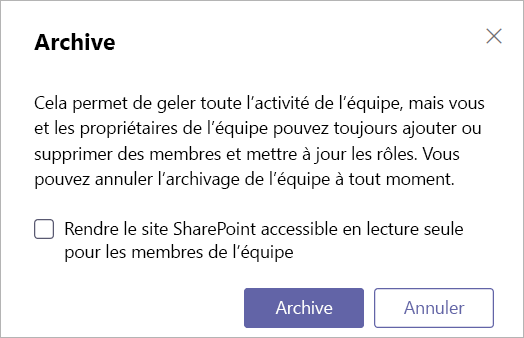

<a name="archive-or-delete-a-team-in-microsoft-teams"></a><span data-ttu-id="d27e0-103">Archiver ou supprimer une équipe dans Microsoft Teams</span><span class="sxs-lookup"><span data-stu-id="d27e0-103">Archive or delete a team in Microsoft Teams</span></span>
===========================================

<span data-ttu-id="d27e0-104">Au fil du temps, une équipe créée dans Microsoft teams peut ne pas être utilisée ou vous voudrez peut-être archiver ou supprimer une équipe à la fin d’un projet.</span><span class="sxs-lookup"><span data-stu-id="d27e0-104">Over time, a team created in Microsoft Teams might fall out of use or you might want to archive or delete a team at the end of a project.</span></span> <span data-ttu-id="d27e0-105">Si vous êtes un administrateur de Microsoft Teams, suivez les étapes décrites dans cet article pour archiver ou supprimer une équipe qui n’est plus nécessaire.</span><span class="sxs-lookup"><span data-stu-id="d27e0-105">If you're a Microsoft Teams admin, follow the steps in this article to archive or delete a team that's no longer needed.</span></span>

<span data-ttu-id="d27e0-106">Lorsque vous archivez une équipe, toutes les activités pour cette équipe cessent.</span><span class="sxs-lookup"><span data-stu-id="d27e0-106">When you archive a team, all activity for that team ceases.</span></span> <span data-ttu-id="d27e0-107">L’archivage d’une équipe Archive également les canaux privés de l’équipe et les collections de sites qui lui sont associées.</span><span class="sxs-lookup"><span data-stu-id="d27e0-107">Archiving a team also archives private channels in the team and their associated site collections.</span></span>  <span data-ttu-id="d27e0-108">Toutefois, vous pouvez toujours ajouter ou supprimer des membres et mettre à jour les rôles, et vous pouvez toujours afficher toutes les activités de l’équipe dans les canaux, fichiers et discussions standard et privés.</span><span class="sxs-lookup"><span data-stu-id="d27e0-108">However, you can still add or remove members and update roles and you can still view all the team activity in standard and private channels, files, and chats.</span></span>

<span data-ttu-id="d27e0-109">Lorsque vous supprimez une équipe, l’activité d’une équipe dans des canaux standard et privés (et collections de sites associées), des fichiers et des discussions est également supprimée.</span><span class="sxs-lookup"><span data-stu-id="d27e0-109">When you delete a team, team activity in standard and private channels (and associated site collections), files, and chats is also deleted.</span></span>

> [!IMPORTANT]
> <span data-ttu-id="d27e0-110">Les équipes archivées peuvent être réactivées, mais vous ne pouvez pas restaurer directement une équipe qui a été supprimée.</span><span class="sxs-lookup"><span data-stu-id="d27e0-110">Archived teams can be reactivated, but you can’t directly restore a team that has been deleted.</span></span> <span data-ttu-id="d27e0-111">Envisagez d’archiver d’abord l’équipe et de différer la suppression jusqu’à ce que vous soyez sûr que vous n’avez plus besoin de l’équipe.</span><span class="sxs-lookup"><span data-stu-id="d27e0-111">Consider archiving the team first, and postpone the deletion until you're sure that you no longer need the team.</span></span>

## <a name="archive-a-team"></a><span data-ttu-id="d27e0-112">Archiver une équipe</span><span class="sxs-lookup"><span data-stu-id="d27e0-112">Archive a team</span></span>

<span data-ttu-id="d27e0-113">Pour archiver une équipe, procédez comme suit.</span><span class="sxs-lookup"><span data-stu-id="d27e0-113">Follow these steps to archive a team.</span></span>

1. <span data-ttu-id="d27e0-114">Dans le centre d’administration de Microsoft Teams, sélectionnez **teams**.</span><span class="sxs-lookup"><span data-stu-id="d27e0-114">In the Microsoft Teams admin center, select **Teams**.</span></span>
2. <span data-ttu-id="d27e0-115">Pour sélectionner une équipe, cliquez sur son nom.</span><span class="sxs-lookup"><span data-stu-id="d27e0-115">Select a team by clicking the team name.</span></span>
3. <span data-ttu-id="d27e0-116">Sélectionnez **Archive**.</span><span class="sxs-lookup"><span data-stu-id="d27e0-116">Select **Archive**.</span></span> <span data-ttu-id="d27e0-117">Le message suivant s’affiche.</span><span class="sxs-lookup"><span data-stu-id="d27e0-117">The following message will appear.</span></span>

    

4. <span data-ttu-id="d27e0-119">Si vous voulez que le site SharePoint de l’équipe soit en lecture seule, activez la case à cocher.</span><span class="sxs-lookup"><span data-stu-id="d27e0-119">If you would like to make the SharePoint site for the team read-only, select the check box.</span></span>
5. <span data-ttu-id="d27e0-120">Sélectionnez **Archive** pour archiver l’équipe.</span><span class="sxs-lookup"><span data-stu-id="d27e0-120">Select **Archive** to archive the team.</span></span> <span data-ttu-id="d27e0-121">Le statut de l’équipe devient **Archivé**.</span><span class="sxs-lookup"><span data-stu-id="d27e0-121">The team’s status will change to **Archived**.</span></span>

## <a name="make-an-archived-team-active"></a><span data-ttu-id="d27e0-122">Rendre une équipe archivée active</span><span class="sxs-lookup"><span data-stu-id="d27e0-122">Make an archived team active</span></span>

<span data-ttu-id="d27e0-123">Procédez comme suit pour rendre une équipe archivée active de nouveau.</span><span class="sxs-lookup"><span data-stu-id="d27e0-123">Follow these steps to make an archived team active again.</span></span>

1. <span data-ttu-id="d27e0-124">Dans le centre d’administration de Microsoft Teams, sélectionnez **teams**.</span><span class="sxs-lookup"><span data-stu-id="d27e0-124">In the Microsoft Teams admin center, select **Teams**.</span></span>
2. <span data-ttu-id="d27e0-125">Pour sélectionner une équipe, cliquez sur son nom.</span><span class="sxs-lookup"><span data-stu-id="d27e0-125">Select a team by clicking the team name.</span></span>
3. <span data-ttu-id="d27e0-126">Sélectionnez ne pas **Archiver**.</span><span class="sxs-lookup"><span data-stu-id="d27e0-126">Select **Unarchive**.</span></span> <span data-ttu-id="d27e0-127">Le statut de l’équipe devient **actif**.</span><span class="sxs-lookup"><span data-stu-id="d27e0-127">The team’s status will change to **Active**.</span></span>

## <a name="delete-a-team"></a><span data-ttu-id="d27e0-128">Supprimer une équipe</span><span class="sxs-lookup"><span data-stu-id="d27e0-128">Delete a team</span></span>

<span data-ttu-id="d27e0-129">Si l’équipe ne sera pas tenue à l’avenir, vous pouvez la supprimer au lieu d’archiver celle-ci.</span><span class="sxs-lookup"><span data-stu-id="d27e0-129">If the team will not be required in the future, then you can delete it rather than archiving it.</span></span> <span data-ttu-id="d27e0-130">Pour supprimer une équipe, procédez comme suit.</span><span class="sxs-lookup"><span data-stu-id="d27e0-130">Follow these steps to delete a team.</span></span>

1.  <span data-ttu-id="d27e0-131">Dans le centre d’administration de Microsoft Teams, sélectionnez **teams**.</span><span class="sxs-lookup"><span data-stu-id="d27e0-131">In the Microsoft Teams admin center, select **Teams**.</span></span>
2.  <span data-ttu-id="d27e0-132">Pour sélectionner une équipe, cliquez sur son nom.</span><span class="sxs-lookup"><span data-stu-id="d27e0-132">Select a team by clicking the team name.</span></span>
3.  <span data-ttu-id="d27e0-133">Sélectionnez **supprimer**.</span><span class="sxs-lookup"><span data-stu-id="d27e0-133">Select **Delete**.</span></span> <span data-ttu-id="d27e0-134">Un message de confirmation s’affiche.</span><span class="sxs-lookup"><span data-stu-id="d27e0-134">A confirmation message will appear.</span></span>
4.  <span data-ttu-id="d27e0-135">Sélectionnez **supprimer** pour supprimer définitivement l’équipe.</span><span class="sxs-lookup"><span data-stu-id="d27e0-135">Select **Delete** to permanently delete the team.</span></span>

## <a name="restore-a-deleted-team"></a><span data-ttu-id="d27e0-136">Restaurer une équipe supprimée</span><span class="sxs-lookup"><span data-stu-id="d27e0-136">Restore a deleted team</span></span>

<span data-ttu-id="d27e0-137">Pour restaurer une équipe supprimée en restaurant le groupe Office 365 associé à l’équipe, procédez comme suit.</span><span class="sxs-lookup"><span data-stu-id="d27e0-137">Follow these steps to restore a deleted team by restoring the Office 365 group that's associated with the team.</span></span> <span data-ttu-id="d27e0-138">Restauration du groupe Office 365 pour une équipe, restaure le contenu de l’équipe, y compris les onglets, les canaux standard et les canaux privés et les collections de sites associées.</span><span class="sxs-lookup"><span data-stu-id="d27e0-138">Restoring the Office 365 group for a team, restores team content, including tabs, standard channels, and private channels and their associated site collections.</span></span>

<span data-ttu-id="d27e0-139">Par défaut, un groupe Office 365 supprimé est conservé pendant 30 jours.</span><span class="sxs-lookup"><span data-stu-id="d27e0-139">By default, a deleted Office 365 group is retained for 30 days.</span></span> <span data-ttu-id="d27e0-140">Ce délai de 30 jours est appelé « suppression conditionnelle », car vous pouvez restaurer le groupe.</span><span class="sxs-lookup"><span data-stu-id="d27e0-140">This 30-day period is called "soft-delete" because you can restore the group.</span></span> <span data-ttu-id="d27e0-141">Pour en savoir plus, voir [restaurer un groupe Office 365 supprimé](https://docs.microsoft.com/office365/admin/create-groups/restore-deleted-group).</span><span class="sxs-lookup"><span data-stu-id="d27e0-141">To learn more, see [Restore a deleted Office 365 Group](https://docs.microsoft.com/office365/admin/create-groups/restore-deleted-group).</span></span>

### <a name="install-the-azureadpreview-module"></a><span data-ttu-id="d27e0-142">Installer le module AzureADPreview</span><span class="sxs-lookup"><span data-stu-id="d27e0-142">Install the AzureADPreview module</span></span>

1. <span data-ttu-id="d27e0-143">Ouvrez Windows PowerShell en tant qu’administrateur.</span><span class="sxs-lookup"><span data-stu-id="d27e0-143">Open Windows PowerShell as an admin.</span></span>
2. <span data-ttu-id="d27e0-144">Si une version antérieure du module AzureADPreview est installée ou si le module AzureAD est installé, désinstallez-le en exécutant l’une des opérations suivantes :</span><span class="sxs-lookup"><span data-stu-id="d27e0-144">If you have an earlier version of the AzureADPreview module installed or the AzureAD module installed, uninstall it by running one of the following:</span></span>

    ```PowerShell 
    Uninstall-Module AzureADPreview
    ```

    ```PowerShell
    Uninstall-Module AzureAD
    ```
3. <span data-ttu-id="d27e0-145">Installez la dernière version du module AzureADPreview en exécutant la commande suivante :</span><span class="sxs-lookup"><span data-stu-id="d27e0-145">Install the latest version of the AzureADPreview module by running the following:</span></span>

    ```PowerShell
    Install-Module AzureADPreview
    ```    

### <a name="restore-the-deleted-office-365-group"></a><span data-ttu-id="d27e0-146">Restaurer le groupe Office 365 supprimé</span><span class="sxs-lookup"><span data-stu-id="d27e0-146">Restore the deleted Office 365 group</span></span>

1. <span data-ttu-id="d27e0-147">Connectez-vous à Azure AD en exécutant la commande suivante :</span><span class="sxs-lookup"><span data-stu-id="d27e0-147">Connect to Azure AD by running the following:</span></span>
    ```PowerShell
    Connect-AzureAD
    ```
    <span data-ttu-id="d27e0-148">Lorsque vous y êtes invité, connectez-vous à l’aide de votre compte d’administrateur et de votre mot de passe.</span><span class="sxs-lookup"><span data-stu-id="d27e0-148">When you're prompted, sign in using your admin account and password.</span></span>  
2. <span data-ttu-id="d27e0-149">Exécutez la commande suivante pour afficher la liste de tous les groupes Office 365 supprimés par logiciel qui sont toujours dans la période de rétention de 30 jours.</span><span class="sxs-lookup"><span data-stu-id="d27e0-149">Run the following to display a list of all soft-deleted Office 365 groups that are still within the 30-day retention period.</span></span> <span data-ttu-id="d27e0-150">Utilisez le paramètre **-All $True** si vous avez de nombreux groupes.</span><span class="sxs-lookup"><span data-stu-id="d27e0-150">Use the **-All $True** parameter if you have a lot of groups.</span></span>
    ```PowerShell
    Get-AzureADMSDeletedGroup
    ``` 
3. <span data-ttu-id="d27e0-151">Recherchez le groupe que vous voulez restaurer, puis notez son ID.</span><span class="sxs-lookup"><span data-stu-id="d27e0-151">Find the group that you want to restore, and then make a note of the Id.</span></span>
4. <span data-ttu-id="d27e0-152">Exécutez la commande suivante pour restaurer le groupe, où [id] est l’ID du groupe.</span><span class="sxs-lookup"><span data-stu-id="d27e0-152">Run the following to restore the group, where [Id] is the group Id.</span></span>
    ```PowerShell
    Restore-AzureADMSDeletedDirectoryObject -Id [Id]
    ```
5.  <span data-ttu-id="d27e0-153">Exécutez la commande suivante pour vérifier que le groupe a été correctement restauré, où [id] est l’ID du groupe.</span><span class="sxs-lookup"><span data-stu-id="d27e0-153">Run the following to verify the group was successfully restored, where [Id] is the group Id.</span></span>
    ```PowerShell
    Get-AzureADGroup -ObjectId [Id]
    ```

    <span data-ttu-id="d27e0-154">Le processus de restauration peut s’écouler jusqu’à 24 heures, après lequel l’équipe et le contenu associés à l’équipe, y compris les onglets et les canaux, s’affichent dans Teams.</span><span class="sxs-lookup"><span data-stu-id="d27e0-154">It can take up to 24 hours for the restore process to complete, after which the team and content associated with the team, including tabs and channels, is displayed in Teams.</span></span>
