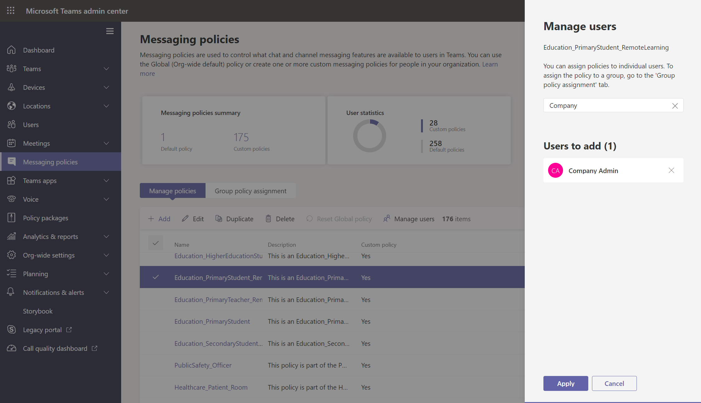

# <a name="assign-policies-to-users-and-groups"></a>Affecter des stratégies à des utilisateurs et des groupes

Cet article décrit les différentes façons d’affecter des stratégies à des utilisateurs et des groupes dans Microsoft Teams. Avant de lire, assurez-vous que vous avez lu [Affecter des stratégies dans Teams - bien démarrer](policy-assignment-overview.md).

## <a name="assign-a-policy-to-individual-users"></a>Affecter une stratégie à des utilisateurs individuels

Suivez ces étapes pour affecter une stratégie à un utilisateur individuel ou à un petit nombre d’utilisateurs à la fois.

### <a name="use-the-microsoft-teams-admin-center"></a>Utiliser le centre d’administration Microsoft Teams

Pour affecter une stratégie à un utilisateur :

1. Dans le volet de navigation gauche du [centre d’administration Microsoft Teams](https://admin.teams.microsoft.com), accédez aux **utilisateurs UsersManage** > .
2. Sélectionnez l’utilisateur en cliquant à gauche du nom d’utilisateur, puis **sélectionnez Modifier les paramètres**.
3. Sélectionnez la stratégie que vous souhaitez affecter, puis **sélectionnez Appliquer**.


> [!NOTE]
> Pour annuler l’affectation d’une stratégie spécialisée d’un utilisateur, vous pouvez définir chaque stratégie sur **Global (par défaut à l’échelle de l’organisation).**

Vous pouvez également effectuer les opérations suivantes pour affecter une stratégie à un utilisateur :

1. Dans le volet de navigation gauche du centre d’administration Microsoft Teams, accédez à la page de stratégie.
2. Sélectionnez la stratégie que vous souhaitez affecter en cliquant à gauche du nom de la stratégie.
3. Sélectionnez **Gérer les utilisateurs**.
4. Dans le volet **Gérer les utilisateurs**, recherchez l’utilisateur par son nom complet ou son nom d’utilisateur, sélectionnez le nom, puis sélectionnez **Ajouter**. Répétez cette étape pour chaque utilisateur que vous souhaitez ajouter.
5. Lorsque vous avez terminé d’ajouter des utilisateurs, **sélectionnez Appliquer**.



### <a name="use-powershell"></a>Utiliser PowerShell

Chaque type de stratégie a son propre ensemble d’applets de commande pour la gestion. Utilisez l’applet `Grant-` de commande d’un type de stratégie donné pour affecter la stratégie. Par exemple, utilisez l’applet `Grant-CsTeamsMeetingPolicy` de commande pour affecter une stratégie de réunion Teams aux utilisateurs. Ces applets de commande sont incluses dans le module PowerShell Teams et sont documentées dans la [référence de l’applet de commande Skype Entreprise](/powershell/skype).

 Téléchargez et installez la [version publique Teams PowerShell](https://www.powershellgallery.com/packages/MicrosoftTeams/) (si ce n’est pas déjà fait), puis exécutez la commande suivante pour vous connecter.

> [!NOTE]
> Skype Entreprise Online Connector fait actuellement partie du dernier module PowerShell Teams.
>
> Si vous utilisez la dernière [version publique Teams PowerShell](https://www.powershellgallery.com/packages/MicrosoftTeams/), vous n’avez pas besoin d’installer le connecteur Skype Entreprise Online.

```powershell
  # When using Teams PowerShell Module

   Import-Module MicrosoftTeams
   $credential = Get-Credential
   Connect-MicrosoftTeams -Credential $credential
```

Dans cet exemple, nous affectons une stratégie de réunion Teams nommée Stratégie de réunion des étudiants à un utilisateur nommé Reda.

```powershell
Grant-CsTeamsMeetingPolicy -Identity reda@contoso.com -PolicyName "Student Meeting Policy"
```

Pour en savoir plus, consultez [Gérer les stratégies via PowerShell](teams-powershell-managing-teams.md#manage-policies-via-powershell).

## <a name="assign-a-policy-to-a-group"></a>Affecter une stratégie à un groupe

L’attribution de stratégie à des groupes vous permet d’affecter une stratégie à un groupe d’utilisateurs, tel qu’un groupe de sécurité, une unité organisationnelle ou une liste de distribution. L’affectations de stratégie est propagée aux membres du groupe en fonction de règles de priorité. Lorsque les membres sont ajoutés à un groupe ou supprimés de ceux-ci, leurs affectations de stratégie héritées sont mises à jour en conséquence.

L’attribution de stratégie aux groupes est recommandée pour les groupes de 50 000 utilisateurs maximum, mais elle fonctionne également avec des groupes plus importants.

Lorsque vous affectez la stratégie, elle est immédiatement affectée au groupe. Toutefois, la propagation de l’attribution de stratégie aux membres du groupe est effectuée en tant qu’opération en arrière-plan et peut prendre un certain temps, en fonction de la taille du groupe. Il en va de même lorsqu’une stratégie n’est pas affectée à partir d’un groupe, ou quand des membres sont ajoutés ou supprimés d’un groupe.

Les affectations de stratégie de groupe sont propagées uniquement aux utilisateurs qui sont des membres directs du groupe. Les affectations ne sont pas propagées aux membres de groupes imbriqués.

### <a name="what-you-need-to-know-about-policy-assignment-to-groups"></a>Ce que vous devez savoir sur l’attribution de stratégie aux groupes

Avant de commencer, il est important de comprendre les règles de précédence et le classement des affectations de groupes.

#### <a name="precedence-rules"></a>Règles de précédence

Pour un type de stratégie donné, la stratégie effective d’un utilisateur est déterminée comme suit :

- Une stratégie directement affectée à un utilisateur est prioritaire sur toute autre stratégie du même type que celle affectée à un groupe. En d’autres termes, si une stratégie d’un type donné est directement attribuée à un utilisateur, il n’hérite pas d’une stratégie du même type d’un groupe. Cela signifie également que si un utilisateur a une stratégie d’un type donné qui lui a été directement affectée, vous devez supprimer cette stratégie de l’utilisateur avant de pouvoir hériter d’une stratégie du même type à partir d’un groupe.
- Si une stratégie n’est pas directement affectée à un utilisateur et qu’il est membre de deux groupes ou plus et que chaque groupe a une stratégie du même type qui lui est affectée, l’utilisateur hérite de la stratégie de l’affectation de groupe qui a le classement le plus élevé.
- Si un utilisateur n’est membre d’aucun groupe auquel une stratégie est affectée, la stratégie globale (par défaut à l’échelle de l’organisation) pour ce type de stratégie s’applique à l’utilisateur.

La stratégie effective d’un utilisateur est mise à jour conformément aux règles suivantes :

- lorsqu’un utilisateur est ajouté ou supprimé d’un groupe auquel une stratégie est affectée.
- une stratégie n’est pas affectée à partir d’un groupe.
- Une stratégie directement affectée à l’utilisateur est supprimée.

#### <a name="group-assignment-ranking"></a>Classement des affectations de groupes

> [!NOTE]
> Un type de stratégie donné peut être affecté à un maximum de 64 groupes sur plusieurs instances de stratégie pour ce type.

Lorsque vous affectez une stratégie à un groupe, vous spécifiez un classement pour l’attribution de groupe. Cela permet de déterminer la stratégie qu’un utilisateur doit hériter comme stratégie effective si l’utilisateur est membre de deux groupes ou plus et que chaque groupe reçoit une stratégie du même type.

Le classement des affectations de groupe est relatif aux autres affectations de groupe du même type. Par exemple, si vous attribuez une stratégie d’appel à deux groupes, définissez le classement d’une affectation sur 1 et l’autre sur 2, 1 étant le classement le plus élevé. Le classement des affectations de groupe indique l’appartenance à un groupe qui est plus importante ou plus pertinente que les autres appartenances à un groupe en ce qui concerne l’héritage.

Supposons, par exemple, que vous ayez deux groupes, Employés du Store et Gestionnaires du Store. Les deux groupes se voient attribuer une stratégie d’appel Teams, la stratégie d’appel des employés du Store et la stratégie d’appel des gestionnaires de magasins, respectivement. Pour un responsable de magasin qui se trouve dans les deux groupes, son rôle de responsable est plus pertinent que son rôle d’employé. Par conséquent, la stratégie d’appel affectée au groupe Gestionnaires de magasins doit avoir un classement plus élevé.

|Groupe |Teams nom de la stratégie d’appel  |Classement|
|---------|---------|---|
|Gestionnaires du Store   |Stratégie d’appel des gestionnaires du Store         |1|
|Employés du Store    |Stratégie d’appel des employés du magasin      |2|

Si vous ne spécifiez pas de classement, l’attribution de stratégie reçoit le classement le plus bas.

### <a name="in-the-teams-admin-center"></a>Dans le centre d’administration Teams

> [!NOTE]
> Actuellement, l’attribution de stratégie aux groupes utilisant le centre d’administration Microsoft Teams est disponible uniquement pour Teams stratégie d’appel, Teams stratégie de parc d’appels, stratégie de Teams, stratégie d’événements en direct Teams, stratégie de réunion Teams et stratégie de messagerie Teams. Pour les autres types de stratégie, utilisez PowerShell.

1. Dans le volet de navigation gauche du centre d’administration Microsoft Teams, accédez à la page de type de stratégie. Par exemple, accédez aux stratégies **MeetingsMeeting** > .
2. Sélectionnez l’onglet **Affectation de stratégie de** groupe.
3. Sélectionnez **Ajouter un groupe**, puis, dans le volet **Affecter une stratégie à un groupe** , procédez comme suit :
    1. Recherchez et ajoutez le groupe auquel vous souhaitez affecter la stratégie.
    2. Définissez le classement de l’attribution de groupe.
    3. Sélectionnez la stratégie que vous souhaitez affecter.
    4. Sélectionnez **Appliquer**.
    


Pour supprimer une affectation de stratégie de groupe, sous l’onglet **Affectation** de stratégie de groupe de la page de stratégie, sélectionnez l’affectation de groupe, puis **sélectionnez Supprimer**.

Pour modifier le classement d’une affectation de groupe, vous devez d’abord supprimer l’affectation de stratégie de groupe. Ensuite, suivez les étapes ci-dessus pour affecter la stratégie à un groupe.

### <a name="use-the-powershell-option"></a>Utiliser l’option PowerShell

> [!NOTE]
> Actuellement, l’attribution de stratégie à des groupes utilisant PowerShell n’est pas disponible pour tous les types de stratégie Teams. Consultez [New-CsGroupPolicyAssignment](/powershell/module/teams/new-csgrouppolicyassignment) pour obtenir la liste des types de stratégies pris en charge.

#### <a name="install-and-connect-to-the-microsoft-teams-powershell-module"></a>Installer et se connecter au module PowerShell Microsoft Teams

Pour obtenir des instructions pas à pas, consultez [Installer Teams PowerShell](teams-powershell-install.md).

#### <a name="assign-a-policy-to-a-group-of-users"></a>Affecter une stratégie à un groupe d’utilisateurs

Utilisez l’applet de commande [New-CsGroupPolicyAssignment](/powershell/module/teams/new-csgrouppolicyassignment) pour affecter une stratégie à un groupe. Vous pouvez spécifier un groupe à l’aide de l’ID d’objet, de l’adresse SIP ou de l’adresse e-mail.

Dans cet exemple, nous affectons une stratégie de réunion Teams nommée Stratégie de réunion des gestionnaires de vente au détail à un groupe dont le classement d’affectation est 1.

```powershell
New-CsGroupPolicyAssignment -GroupId d8ebfa45-0f28-4d2d-9bcc-b158a49e2d17 -PolicyType TeamsMeetingPolicy -PolicyName "Retail Managers Meeting Policy" -Rank 1
```

#### <a name="get-policy-assignments-for-a-group"></a>Obtenir des affectations de stratégie pour un groupe

Utilisez l’applet de commande [Get-CsGroupPolicyAssignment](/powershell/module/teams/get-csgrouppolicyassignment) pour obtenir toutes les stratégies affectées à un groupe. Notez que les groupes sont toujours répertoriés par leur ID de groupe, même si son adresse SIP ou son adresse e-mail a été utilisée pour affecter la stratégie.

Dans cet exemple, nous récupérons toutes les stratégies affectées à un groupe spécifique.

```powershell
Get-CsGroupPolicyAssignment -GroupId e050ce51-54bc-45b7-b3e6-c00343d31274
```

Dans cet exemple, nous renvoyons tous les groupes auxquels une stratégie de réunion Teams est affectée.

```powershell
Get-CsGroupPolicyAssignment -PolicyType TeamsMeetingPolicy
```

#### <a name="remove-a-policy-from-a-group"></a>Supprimer une stratégie d’un groupe

Utilisez l’applet de commande [Remove-CsGroupPolicyAssignment](/powershell/module/teams/remove-csgrouppolicyassignment) pour supprimer une stratégie d’un groupe. Lorsque vous supprimez une stratégie d’un groupe, les priorités des autres stratégies du même type affectées à ce groupe, et qui ont un classement inférieur, sont mises à jour. Par exemple, si vous supprimez une stratégie dont le classement est 2, les stratégies qui ont un classement de 3 et 4 sont mises à jour pour refléter leur nouveau classement. Les deux tableaux suivants montrent cet exemple.

Voici une liste des affectations de stratégie et des priorités pour une stratégie de réunion Teams.

|Nom du groupe  |Nom de la stratégie  |Classement|
|---------|---------|---------|
|Ventes    |Stratégie de vente       | 1        |
|Région Ouest     |Stratégie de la région Ouest         |2         |
|Division    |Stratégie de division         |3         |
|Filiale   |Stratégie de filiale        |4         |

Si nous supprimons la stratégie région Ouest du groupe Région Ouest, les affectations et les priorités de la stratégie sont mises à jour comme suit.

|Nom du groupe  |Nom de la stratégie  |Classement|
|---------|---------|---------|
|Ventes    |Stratégie de vente       | 1        |
|Division    |Stratégie de division         |2         |
|Filiale   |Stratégie de filiale        |3        |

Dans cet exemple, nous supprimons la stratégie de réunion Teams d’un groupe.

```powershell
Remove-CsGroupPolicyAssignment -PolicyType TeamsMeetingPolicy -GroupId f985e013-0826-40bb-8c94-e5f367076044
```

#### <a name="change-a-policy-assignment-for-a-group"></a>Modifier une affectation de stratégie pour un groupe

> [!NOTE]
> L’applet [de commande Set-CsGroupPolicyAssignment](/powershell/module/teams/set-csgrouppolicyassignment) sera bientôt disponible. En attendant, pour modifier une affectation de stratégie de groupe, vous pouvez supprimer l’affectation de stratégie actuelle du groupe, puis ajouter une nouvelle affectation de stratégie.

Après avoir affecté une stratégie à un groupe, vous pouvez utiliser l’applet de commande [Set-CsGroupPolicyAssignment](/powershell/module/teams/set-csgrouppolicyassignment) pour modifier l’attribution de stratégie de ce groupe comme suit :

- Modifier le classement
- Modifier la stratégie d’un type de stratégie donné
- Modifier la stratégie d’un type de stratégie donné et le classement

Dans cet exemple, nous modifions la stratégie de parc d’appels Teams d’un groupe en une stratégie nommée SupportCallPark et le classement des affectations sur 3.

```powershell
Set-CsGroupPolicyAssignment -GroupId 566b8d39-5c5c-4aaa-bc07-4f36278a1b38 -PolicyType TeamsMeetingPolicy -PolicyName SupportCallPark -Rank 3
```

#### <a name="change-the-effective-policy-for-a-user"></a>Modifier la stratégie effective pour un utilisateur

Voici un exemple de modification de la stratégie effective pour un utilisateur qui reçoit directement une stratégie.

Tout d’abord, nous utilisons l’applet de commande [Get-CsUserPolicyAssignment](/powershell/module/teams/get-csuserpolicyassignment) avec le `PolicySource` paramètre pour obtenir des détails sur les Teams stratégies de diffusion de réunion associées à l’utilisateur.

```powershell
Get-CsUserPolicyAssignment -Identity daniel@contoso.com -PolicyType TeamsMeetingBroadcastPolicy | select -ExpandProperty PolicySource
```

La sortie montre que l’utilisateur a reçu directement une stratégie de diffusion de réunion Teams nommée Événements d’employé, qui est prioritaire sur la stratégie nommée Événements en direct du fournisseur affectée à un groupe auquel l’utilisateur appartient.

```console
AssignmentType PolicyName         Reference
-------------- ----------         ---------
Direct         Employee Events
Group          Vendor Live Events 566b8d39-5c5c-4aaa-bc07-4f36278a1b38
```

À présent, nous supprimons la stratégie Événements des employés de l’utilisateur. Cela signifie que l’utilisateur n’a plus de stratégie de diffusion de réunion Teams directement affectée et héritera de la stratégie Événements en direct du fournisseur affectée au groupe auquel l’utilisateur appartient.

Pour ce faire, utilisez l’applet de commande suivante dans le module PowerShell Skype Entreprise.

```powershell
Grant-CsTeamsMeetingBroadcastPolicy -Identity daniel@contoso.com -PolicyName $null
```

Utilisez l’applet de commande suivante dans le module PowerShell Teams pour effectuer cette opération à grande échelle via une affectation de stratégie de lot, où $users est une liste d’utilisateurs que vous spécifiez.

```powershell
New-CsBatchPolicyAssignmentOperation -OperationName "Assigning null at bulk" -PolicyType TeamsMeetingBroadcastPolicy -PolicyName $null -Identity $users  
```

## <a name="assign-a-policy-to-a-batch-of-users"></a>Affecter une stratégie à un lot d’utilisateurs

### <a name="use-the-admin-center"></a>Utiliser le Centre d’administration

Pour affecter une stratégie aux utilisateurs en bloc :

1. Dans le volet de navigation gauche du centre d’administration Microsoft Teams, sélectionnez **Utilisateurs**.
2. Recherchez les utilisateurs auxquels vous souhaitez affecter la stratégie ou filtrez la vue pour afficher les utilisateurs souhaités.
3. Dans la colonne **&#x2713;** (coche), sélectionnez les utilisateurs. Pour sélectionner tous les utilisateurs, cliquez sur &#x2713; (coche) en haut du tableau.
4. Sélectionnez **Modifier les paramètres**, apportez les modifications **souhaitées, puis sélectionnez Appliquer**.

Pour afficher l’état de votre affectation de stratégie, dans la bannière qui s’affiche en haut de la page **Utilisateurs** après avoir sélectionné **Appliquer** pour envoyer votre affectation de stratégie, sélectionnez **Journal d’activité**. Ou, dans le volet de navigation gauche du centre d’administration Microsoft Teams, accédez au **tableau de bord**, puis, sous **Journal d’activité**, sélectionnez **Afficher les détails**. Le journal d’activité affiche les affectations de stratégie à des lots de plus de 20 utilisateurs via le centre d’administration Microsoft Teams au cours des 30 derniers jours. Pour plus d’informations, consultez [Afficher vos affectations de stratégie dans le journal d’activité](activity-log.md).

### <a name="use-powershell-method"></a>Utiliser la méthode PowerShell

> [!NOTE]
> Actuellement, l’attribution de stratégie de lot à l’aide de PowerShell n’est pas disponible pour tous les types de stratégie Teams. Consultez [New-CsBatchPolicyAssignmentOperation](/powershell/module/teams/new-csbatchpolicyassignmentoperation) pour obtenir la liste des types de stratégies pris en charge.

Avec l’attribution de stratégie de lot, vous pouvez affecter une stratégie à de grands ensembles d’utilisateurs à la fois sans avoir à utiliser de script. Vous utilisez l’applet de commande [New-CsBatchPolicyAssignmentOperation](/powershell/module/teams/new-csbatchpolicyassignmentoperation) pour envoyer un lot d’utilisateurs et la stratégie que vous souhaitez affecter. Les attributions sont traitées comme une opération d’arrière-plan et un ID d’opération est généré pour chaque lot. Vous pouvez ensuite utiliser l’applet de commande [Get-CsBatchPolicyAssignmentOperation](/powershell/module/teams/get-csbatchpolicyassignmentoperation) pour suivre la progression et l’état des affectations dans un lot.

Spécifiez les utilisateurs par leur ID d’objet ou leur adresse SIP (Session Initiation Protocol). L’adresse SIP d’un utilisateur a souvent la même valeur que le nom d’utilisateur principal (UPN) ou l’adresse e-mail, mais cela n’est pas obligatoire. Si un utilisateur est spécifié à l’aide de son UPN ou de son e-mail, mais qu’il a une valeur différente de son adresse SIP, l’attribution de stratégie échoue pour l’utilisateur. Si un lot inclut des utilisateurs en double, les doublons seront supprimés du lot avant le traitement et l’état sera fourni uniquement pour les utilisateurs uniques restants dans le lot.

Un lot peut contenir jusqu’à 5 000 utilisateurs. Pour obtenir de meilleurs résultats, n’envoyez pas plus de quelques lots à la fois. Autoriser les lots à terminer le traitement avant d’envoyer d’autres lots.

#### <a name="install-and-connect-to-the-teams-powershell-module"></a>Installer et se connecter au module PowerShell Teams

Exécutez la commande suivante pour installer le [module PowerShell Microsoft Teams](https://www.powershellgallery.com/packages/MicrosoftTeams). Veillez à installer la version 1.0.5 ou ultérieure.

```powershell
Install-Module -Name MicrosoftTeams
```

Exécutez ce qui suit pour vous connecter à Teams et démarrer une session.

```powershell
Connect-MicrosoftTeams
```

Lorsque vous y êtes invité, connectez-vous à l’aide de vos informations d’identification d’administrateur.

#### <a name="install-and-connect-to-the-azure-ad-powershell-for-graph-module-optional"></a>Installer et se connecter à Azure AD PowerShell pour Graph module (facultatif)

Vous pouvez également [télécharger et installer Azure AD PowerShell pour Graph module](/powershell/azure/active-directory/install-adv2) (si ce n’est pas déjà fait) et vous connecter à Azure AD afin de pouvoir récupérer une liste d’utilisateurs de votre organisation.

Exécutez les étapes suivantes pour vous connecter à Azure AD.

```powershell
Connect-AzureAD
```

Lorsque vous y êtes invité, connectez-vous à l’aide des mêmes informations d’identification d’administrateur que vous avez utilisées pour vous connecter à Teams.

#### <a name="assign-a-setup-policy-to-a-batch-of-users"></a>Affecter une stratégie d’installation à un lot d’utilisateurs

Dans cet exemple, nous utilisons l’applet de commande [New-CsBatchPolicyAssignmentOperation](/powershell/module/teams/new-csbatchpolicyassignmentoperation) pour affecter une stratégie d’installation d’application nommée stratégie d’installation d’application RH à un lot d’utilisateurs répertoriés dans le fichier users_ids.text.

```powershell
$user_ids = Get-Content .\users_ids.txt
New-CsBatchPolicyAssignmentOperation -PolicyType TeamsAppSetupPolicy -PolicyName "HR App Setup Policy" -Identity $user_ids -OperationName "Example 1 batch"
```

Dans cet exemple, nous nous connectons à Azure AD pour récupérer une collection d’utilisateurs, puis assignons une stratégie de messagerie nommée New Hire Messaging Policy à un lot d’utilisateurs spécifié à l’aide de leur adresse SIP.

```powershell
Connect-AzureAD
$users = Get-AzureADUser
New-CsBatchPolicyAssignmentOperation -PolicyType TeamsMessagingPolicy -PolicyName "New Hire Messaging Policy" -Identity $users.SipProxyAddress -OperationName "Example 2 batch"
```

#### <a name="get-the-status-of-a-batch-assignment"></a>Obtenir l’état d’une affectation de lot

Exécutez la commande suivante pour obtenir l’état d’une affectation de lot, où OperationId est l’ID d’opération retourné par l’applet `New-CsBatchPolicyAssignmentOperation` de commande pour un lot donné.

```powershell
$Get-CsBatchPolicyAssignmentOperation -OperationId f985e013-0826-40bb-8c94-e5f367076044 | fl
```

Si la sortie indique qu’une erreur s’est produite, exécutez la commande suivante pour obtenir plus d’informations sur les erreurs qui se trouvent dans la `UserState` propriété.

```powershell
Get-CsBatchPolicyAssignmentOperation -OperationId f985e013-0826-40bb-8c94-e5f367076044 | Select -ExpandProperty UserState
```

Pour plus [d’informations, consultez Get-CsBatchPolicyAssignmentOperation](/powershell/module/teams/get-csbatchpolicyassignmentoperation).

## <a name="related-topics"></a>Voir aussi

- [Gérer Teams avec des stratégies](manage-teams-with-policies.md)
- [Aperçu de Teams PowerShell](teams-powershell-overview.md)
- [Affecter des stratégies dans Teams - Prise en main](policy-assignment-overview.md)
