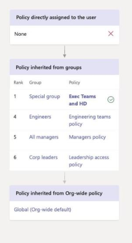

# <a name="assign-policies-to-your-users-in-microsoft-teams"></a><span data-ttu-id="83ad4-103">Attribuer des stratégies à vos utilisateurs dans Microsoft Teams.</span><span class="sxs-lookup"><span data-stu-id="83ad4-103">Assign policies to your users in Microsoft Teams</span></span>

<span data-ttu-id="83ad4-104">En tant qu’administrateur, vous utilisez des stratégies pour contrôler les fonctionnalités d’équipes disponibles pour les utilisateurs de votre organisation.</span><span class="sxs-lookup"><span data-stu-id="83ad4-104">As an admin, you use policies to control the Teams features that are available to users in your organization.</span></span> <span data-ttu-id="83ad4-105">Par exemple, il existe des stratégies d’appel, des stratégies de réunion et des stratégies de messagerie pour n’appeler qu’un seul nom.</span><span class="sxs-lookup"><span data-stu-id="83ad4-105">For example, there are calling policies, meeting policies, and messaging policies, to name just a few.</span></span>

<span data-ttu-id="83ad4-106">Les organisations ont différents types d’utilisateurs dotés de besoins uniques et de stratégies personnalisées que vous créez et attribuez les paramètres de stratégie à différents ensembles d’utilisateurs en fonction de vos besoins.</span><span class="sxs-lookup"><span data-stu-id="83ad4-106">Organizations have different types of users with unique needs and custom policies that you create and assign let you tailor policy settings to different sets of users based on those needs.</span></span>

<span data-ttu-id="83ad4-107">Pour faciliter la gestion des stratégies au sein de votre organisation, teams permet d’attribuer des stratégies aux utilisateurs de différentes manières.</span><span class="sxs-lookup"><span data-stu-id="83ad4-107">To make it easier to manage policies in your organization, Teams offers several ways to assign policies to users.</span></span> <span data-ttu-id="83ad4-108">Vous pouvez affecter une stratégie directement aux utilisateurs, individuellement ou à la fois par le biais d’une affectation par lot ou à un groupe dont les utilisateurs sont membres.</span><span class="sxs-lookup"><span data-stu-id="83ad4-108">You can assign a policy directly to users, either individually or at scale through a batch assignment, or to a group that the users are members of.</span></span> <span data-ttu-id="83ad4-109">Vous pouvez également utiliser des packages de stratégie pour affecter une collection prédéfinie de stratégies aux utilisateurs de votre organisation possédant des rôles similaires.</span><span class="sxs-lookup"><span data-stu-id="83ad4-109">You can also use policy packages to assign a preset collection of policies to users in your organization who have similar roles.</span></span> <span data-ttu-id="83ad4-110">L’option que vous choisissez dépend du nombre de stratégies que vous gérez et du nombre d’utilisateurs auxquels vous attribuez.</span><span class="sxs-lookup"><span data-stu-id="83ad4-110">The option that you choose depends on the number of policies that you're managing and the number of users that you're assigning to.</span></span> <span data-ttu-id="83ad4-111">En définissant les stratégies globales par défaut de l’organisation, afin qu’elles s’appliquent au plus grand nombre d’utilisateurs de votre organisation, il vous suffit d’affecter des stratégies aux utilisateurs qui ont besoin de stratégies spécialisées.</span><span class="sxs-lookup"><span data-stu-id="83ad4-111">By setting the global (Org-wide default) policies so that they apply to the largest number of users in your organization, you only have to assign policies to those users that require specialized policies.</span></span>

<span data-ttu-id="83ad4-112">Cet article décrit les différentes façons dont vous pouvez attribuer des stratégies aux utilisateurs et les scénarios recommandés pour les situations dans lesquelles utiliser.</span><span class="sxs-lookup"><span data-stu-id="83ad4-112">This article describes the different ways that you can assign policies to users and the recommended scenarios for when to use what.</span></span>

## <a name="which-policy-takes-precedence"></a><span data-ttu-id="83ad4-113">Quelle est la stratégie prioritaire ?</span><span class="sxs-lookup"><span data-stu-id="83ad4-113">Which policy takes precedence?</span></span>

<span data-ttu-id="83ad4-114">Un utilisateur dispose d’une stratégie efficace pour chaque type de stratégie.</span><span class="sxs-lookup"><span data-stu-id="83ad4-114">A user has one effective policy for each policy type.</span></span> <span data-ttu-id="83ad4-115">Il est possible, ou même probable, que l’utilisateur dispose d’une stratégie directement affectée et qu’il soit membre d’un ou plusieurs groupes auxquels une stratégie du même type est affectée.</span><span class="sxs-lookup"><span data-stu-id="83ad4-115">It's possible or even likely that a user is directly assigned a policy and is also a member of one or more groups that's assigned a policy of the same type.</span></span> <span data-ttu-id="83ad4-116">Dans ces types de scénarios, quelle stratégie est prioritaire ?</span><span class="sxs-lookup"><span data-stu-id="83ad4-116">In these kinds of scenarios, which policy takes precedence?</span></span>  <span data-ttu-id="83ad4-117">La stratégie d’effectivité d’un utilisateur est déterminée conformément aux règles de priorité, comme suit.</span><span class="sxs-lookup"><span data-stu-id="83ad4-117">A user's effective policy is determined according to rules of precedence, as follows.</span></span>

<span data-ttu-id="83ad4-118">Si un utilisateur dispose d’une stratégie (individuelle ou par le biais d’une affectation de lot), cette stratégie est prioritaire.</span><span class="sxs-lookup"><span data-stu-id="83ad4-118">If a user is directly assigned a policy (either individually or through a batch assignment), that policy takes precedence.</span></span> <span data-ttu-id="83ad4-119">Dans l’exemple suivant, la stratégie effective de l’utilisateur est la stratégie de réunion carrée d’Lincoln, qui est directement affectée à l’utilisateur.</span><span class="sxs-lookup"><span data-stu-id="83ad4-119">In the following example, the user's effective policy is the Lincoln Square meeting policy, which is directly assigned to the user.</span></span>


<span data-ttu-id="83ad4-121">Si un utilisateur n’a pas directement affecté une stratégie d’un type donné, la stratégie affectée à un groupe dont l’utilisateur est membre de a la priorité.</span><span class="sxs-lookup"><span data-stu-id="83ad4-121">If a user isn't directly assigned a policy of a given type, the policy assigned to a group that the user is a member of takes precedence.</span></span> <span data-ttu-id="83ad4-122">Si un utilisateur est membre de plusieurs groupes, la stratégie présentant le niveau de [classement des affectations de groupe](#group-assignment-ranking) le plus élevé pour le type de stratégie donné est prioritaire.</span><span class="sxs-lookup"><span data-stu-id="83ad4-122">If a user is a member of multiple groups, the policy that has the highest [group assignment ranking](#group-assignment-ranking) for the given policy type takes precedence.</span></span>

<span data-ttu-id="83ad4-123">Dans cet exemple, la stratégie effective de l’utilisateur est la stratégie d’exécution et la stratégie HD, qui présente le niveau d’attribution le plus élevé par rapport aux autres groupes dont l’utilisateur est membre et auquel une stratégie du même type de stratégie est affectée.</span><span class="sxs-lookup"><span data-stu-id="83ad4-123">In this example, the user's effective policy is the Exec Teams and HD policy, which has the highest assignment ranking relative to other groups that the user is a member of and that are also assigned a policy of the same policy type.</span></span>  



<span data-ttu-id="83ad4-125">Si un utilisateur n’est pas directement affecté à une stratégie ou n’est pas membre de tous les groupes auxquels une stratégie est affectée, l’utilisateur obtient la stratégie globale (par défaut de l’organisation par défaut) pour ce type de stratégie.</span><span class="sxs-lookup"><span data-stu-id="83ad4-125">If a user isn't directly assigned a policy or isn't a member of any groups that are assigned a policy, the user gets the global (Org-wide default) policy for that policy type.</span></span> <span data-ttu-id="83ad4-126">Voici un exemple :</span><span class="sxs-lookup"><span data-stu-id="83ad4-126">Here's an example.</span></span>


<span data-ttu-id="83ad4-128">Pour en savoir plus, voir [règles de précédence](#precedence-rules).</span><span class="sxs-lookup"><span data-stu-id="83ad4-128">To learn more, see [Precedence rules](#precedence-rules).</span></span>

## <a name="ways-to-assign-policies"></a><span data-ttu-id="83ad4-129">Méthodes d’attribution de stratégies</span><span class="sxs-lookup"><span data-stu-id="83ad4-129">Ways to assign policies</span></span>

<span data-ttu-id="83ad4-130">Vous trouverez ci-dessous une vue d’ensemble des méthodes permettant d’attribuer des stratégies aux utilisateurs et les scénarios recommandés pour chacun.</span><span class="sxs-lookup"><span data-stu-id="83ad4-130">Here's an overview of the ways that you can assign policies to users and the recommended scenarios for each.</span></span> <span data-ttu-id="83ad4-131">Cliquez sur les liens pour en savoir plus.</span><span class="sxs-lookup"><span data-stu-id="83ad4-131">Click the links to learn more.</span></span>

<span data-ttu-id="83ad4-132">Avant d’affecter des stratégies à des utilisateurs ou des groupes spécifiques, commencez par [définir les stratégies globales par défaut](#set-the-global-policies) de l’organisation afin qu’elles s’appliquent au plus grand nombre d’utilisateurs de votre organisation.</span><span class="sxs-lookup"><span data-stu-id="83ad4-132">Before assigning policies to individual users or groups, start by [setting the global (Org-wide default) policies](#set-the-global-policies) so that they apply to the largest number of users in your organization.</span></span>  <span data-ttu-id="83ad4-133">Une fois les stratégies globales définies, vous n’aurez besoin d’affecter des stratégies qu’aux utilisateurs qui ont besoin de stratégies spécialisées.</span><span class="sxs-lookup"><span data-stu-id="83ad4-133">Once the global policies are set, you will only need to assign policies to those users that require specialized policies.</span></span>

|<span data-ttu-id="83ad4-134">Procédez comme suit…</span><span class="sxs-lookup"><span data-stu-id="83ad4-134">Do this</span></span>  |<span data-ttu-id="83ad4-135">Si...</span><span class="sxs-lookup"><span data-stu-id="83ad4-135">If...</span></span>  | <span data-ttu-id="83ad4-136">Utilisation de...</span><span class="sxs-lookup"><span data-stu-id="83ad4-136">Using...</span></span>
|---------|---------|----|
|[<span data-ttu-id="83ad4-137">Assigner une stratégie à des utilisateurs individuels</span><span class="sxs-lookup"><span data-stu-id="83ad4-137">Assign a policy to individual users</span></span>](#assign-a-policy-to-individual-users)    | <span data-ttu-id="83ad4-138">Vous débutez en équipe et vous commencez simplement à attribuer une ou plusieurs stratégies à un petit nombre d’utilisateurs.</span><span class="sxs-lookup"><span data-stu-id="83ad4-138">You're new to Teams and just getting started or you only need to assign one or a couple of policies to a small number of users.</span></span> |<span data-ttu-id="83ad4-139">Centre d’administration Microsoft teams ou cmdlets PowerShell dans le module PowerShell de Skype entreprise Online</span><span class="sxs-lookup"><span data-stu-id="83ad4-139">The Microsoft Teams admin center or PowerShell cmdlets in the Skype for Business Online PowerShell module</span></span>
|[<span data-ttu-id="83ad4-140">Assigner une stratégie à un groupe</span><span class="sxs-lookup"><span data-stu-id="83ad4-140">Assign a policy to a group</span></span>](#assign-a-policy-to-a-group) |<span data-ttu-id="83ad4-141">Vous devez attribuer des stratégies en fonction de l’appartenance d’un utilisateur à un groupe.</span><span class="sxs-lookup"><span data-stu-id="83ad4-141">You need to assign policies based on a user's group membership.</span></span> <span data-ttu-id="83ad4-142">Par exemple, vous souhaitez affecter une stratégie à l’ensemble des utilisateurs d’un groupe de sécurité ou d’une liste de distribution.</span><span class="sxs-lookup"><span data-stu-id="83ad4-142">For example, you want to assign a policy to all users in a security group or distribution list.</span></span>| <span data-ttu-id="83ad4-143">Centre d’administration Microsoft teams ou cmdlets PowerShell dans le module PowerShell teams</span><span class="sxs-lookup"><span data-stu-id="83ad4-143">The Microsoft Teams admin center or PowerShell cmdlets in the Teams PowerShell module</span></span>|
|[<span data-ttu-id="83ad4-144">Attribuer une stratégie à un lot d’utilisateurs</span><span class="sxs-lookup"><span data-stu-id="83ad4-144">Assign a policy to a batch of users</span></span>](#assign-a-policy-to-a-batch-of-users)   | <span data-ttu-id="83ad4-145">Vous devez attribuer des stratégies à d’importants ensembles d’utilisateurs.</span><span class="sxs-lookup"><span data-stu-id="83ad4-145">You need to assign policies to large sets of users.</span></span> <span data-ttu-id="83ad4-146">Par exemple, vous pouvez attribuer une stratégie à des centaines ou des milliers d’utilisateurs de votre organisation à la fois.</span><span class="sxs-lookup"><span data-stu-id="83ad4-146">For example, you want to assign a policy to hundreds or thousands of users in your organization at a time.</span></span>  |<span data-ttu-id="83ad4-147">Centre d’administration Microsoft teams ou cmdlets PowerShell dans le module PowerShell teams</span><span class="sxs-lookup"><span data-stu-id="83ad4-147">The Microsoft Teams admin center or PowerShell cmdlets in the Teams PowerShell module</span></span>|
| [<span data-ttu-id="83ad4-148">Assigner un package de stratégie aux utilisateurs</span><span class="sxs-lookup"><span data-stu-id="83ad4-148">Assign a policy package to users</span></span>](#assign-a-policy-package-to-users)  | <span data-ttu-id="83ad4-149">Vous devez affecter plusieurs stratégies à des ensembles d’utilisateurs spécifiques de votre organisation qui ont des rôles identiques ou similaires.</span><span class="sxs-lookup"><span data-stu-id="83ad4-149">You need to assign multiple policies to specific sets of users in your organization who have the same or similar roles.</span></span> <span data-ttu-id="83ad4-150">Par exemple, attribuez le package de stratégie éducation (enseignant) aux enseignants de votre établissement scolaire pour leur permettre d’accéder à l’ensemble des conversations, appels et réunions, ainsi que le package d’étude (étudiant d’école secondaire) aux étudiants secondaires pour limiter certaines fonctionnalités, telles que les appels privés.</span><span class="sxs-lookup"><span data-stu-id="83ad4-150">For example, assign the Education (Teacher) policy package to teachers in your school to give them full access to chats, calling, and meetings and the Education (Secondary school student) policy package to secondary students to limit certain capabilities like private calling.</span></span>  |<span data-ttu-id="83ad4-151">Centre d’administration Microsoft teams ou cmdlets PowerShell dans le module PowerShell teams</span><span class="sxs-lookup"><span data-stu-id="83ad4-151">The Microsoft Teams admin center or PowerShell cmdlets in the Teams PowerShell module</span></span>|
| <span data-ttu-id="83ad4-152">[Assigner un package de stratégie à un groupe](#assign-a-policy-package-to-a-group) (préversion privée)</span><span class="sxs-lookup"><span data-stu-id="83ad4-152">[Assign a policy package to a group](#assign-a-policy-package-to-a-group) (in private preview)</span></span>   |<span data-ttu-id="83ad4-153">Vous devez affecter plusieurs stratégies à un groupe d’utilisateurs de votre organisation qui ont des rôles similaires ou similaires.</span><span class="sxs-lookup"><span data-stu-id="83ad4-153">You need to assign multiple policies to a group of users in your organization who have the same or similar roles.</span></span> <span data-ttu-id="83ad4-154">Par exemple, vous souhaitez attribuer un package de stratégie à l’ensemble des utilisateurs d’un groupe de sécurité ou d’une liste de distribution.</span><span class="sxs-lookup"><span data-stu-id="83ad4-154">For example, you want to assign a policy package to all users in a security group or distribution list.</span></span> |<span data-ttu-id="83ad4-155">Le centre d’administration de Microsoft Teams (bientôt disponible) ou des cmdlets PowerShell dans le module PowerShell teams</span><span class="sxs-lookup"><span data-stu-id="83ad4-155">The Microsoft Teams admin center (coming soon) or PowerShell cmdlets in the Teams PowerShell module</span></span>|
| [<span data-ttu-id="83ad4-156">Affectation d’un package de stratégie à un lot d’utilisateurs</span><span class="sxs-lookup"><span data-stu-id="83ad4-156">Assign a policy package to a batch of users</span></span>](#assign-a-policy-package-to-a-batch-of-users)|<span data-ttu-id="83ad4-157">Vous devez affecter plusieurs stratégies à un lot d’utilisateurs de votre organisation qui ont des rôles identiques ou similaires.</span><span class="sxs-lookup"><span data-stu-id="83ad4-157">You need to assign multiple policies to a batch of users in your organization who have the same or similar roles.</span></span> <span data-ttu-id="83ad4-158">Par exemple, attribuez le package de stratégie éducation (enseignant) à tous les enseignants de votre établissement scolaire à l’aide de la fonctionnalité d’attribution de lot pour leur permettre d’accéder à des conversations, des appels et des réunions, et d’affecter le package de stratégie éducation (école secondaire) à un lot d’étudiants secondaires pour limiter certaines fonctionnalités telles que les appels privés.</span><span class="sxs-lookup"><span data-stu-id="83ad4-158">For example, assign the Education (Teacher) policy package to all teachers in your school using batch assignment to give them full access to chats, calling, and meetings and assign the Education (Secondary school student) policy package to a batch of secondary students to limit certain capabilities like private calling.</span></span>|<span data-ttu-id="83ad4-159">Cmdlets PowerShell dans le module PowerShell teams</span><span class="sxs-lookup"><span data-stu-id="83ad4-159">PowerShell cmdlets in the Teams PowerShell module</span></span>|


## <a name="set-the-global-policies"></a><span data-ttu-id="83ad4-160">Définir les stratégies globales</span><span class="sxs-lookup"><span data-stu-id="83ad4-160">Set the global policies</span></span>

<span data-ttu-id="83ad4-161">Pour définir les stratégies globales par défaut de chaque type de stratégie, procédez comme suit.</span><span class="sxs-lookup"><span data-stu-id="83ad4-161">Follow these steps to set the global (Org-wide default) policies for each policy type.</span></span>

### <a name="using-the-microsoft-teams-admin-center"></a><span data-ttu-id="83ad4-162">Utilisation du centre d’administration Microsoft Teams</span><span class="sxs-lookup"><span data-stu-id="83ad4-162">Using the Microsoft Teams admin center</span></span>

1. <span data-ttu-id="83ad4-163">Dans le volet de navigation de gauche du centre d’administration de Microsoft Teams, accédez à la page de stratégie correspondant au type de stratégie que vous voulez mettre à jour.</span><span class="sxs-lookup"><span data-stu-id="83ad4-163">In the left navigation of the Microsoft Teams admin center, go to the policy page for the policy type you want to update.</span></span> <span data-ttu-id="83ad4-164">Par **exemple, les** politiques teams Teams, les stratégies de  >  **Teams policies** **Meetings**  >  **réunions**, les **stratégies de messagerie** ou les politiques d' **Voice**  >  **appel** vocal.</span><span class="sxs-lookup"><span data-stu-id="83ad4-164">For example, **Teams** > **Teams policies**, **Meetings** > **Meetings policies**, **Messaging policies**, or **Voice** > **Calling policies**.</span></span>
2. <span data-ttu-id="83ad4-165">Sélectionnez la stratégie **globale par défaut** de l’Organisation pour afficher les paramètres actuels.</span><span class="sxs-lookup"><span data-stu-id="83ad4-165">Select the **Global (Org-wide default)** policy to view the current settings.</span></span>
3. <span data-ttu-id="83ad4-166">Mettez à jour la stratégie selon vos besoins, puis sélectionnez **appliquer**.</span><span class="sxs-lookup"><span data-stu-id="83ad4-166">Update the policy as needed, and then select **Apply**.</span></span>

### <a name="using-powershell"></a><span data-ttu-id="83ad4-167">Utiliser PowerShell</span><span class="sxs-lookup"><span data-stu-id="83ad4-167">Using PowerShell</span></span>

<span data-ttu-id="83ad4-168">Pour définir les stratégies globales à l’aide de PowerShell, utilisez l’identificateur global.</span><span class="sxs-lookup"><span data-stu-id="83ad4-168">To set the global policies using PowerShell, use the Global identifier.</span></span>  <span data-ttu-id="83ad4-169">Commencez par examiner la stratégie globale actuelle pour déterminer le paramètre que vous voulez modifier.</span><span class="sxs-lookup"><span data-stu-id="83ad4-169">Start by reviewing the current Global policy to determine which setting you want to change.</span></span>

```powershell
Get-CsTeamsMessagingPolicy -Identity Global
 
Identity                      : Global
Description                   :
AllowUrlPreviews              : True
AllowOwnerDeleteMessage       : False
AllowUserEditMessage          : True
AllowUserDeleteMessage        : True
AllowUserChat                 : True
AllowRemoveUser               : True
AllowGiphy                    : True
GiphyRatingType               : Moderate
AllowMemes                    : True
AllowImmersiveReader          : True
AllowStickers                 : True
AllowUserTranslation          : False
ReadReceiptsEnabledType       : UserPreference
AllowPriorityMessages         : True
ChannelsInChatListEnabledType : DisabledUserOverride
AudioMessageEnabledType       : ChatsAndChannels
Expand (20 lines) Collapse 
```

<span data-ttu-id="83ad4-170">Ensuite, mettez à jour la stratégie globale selon vos besoins.</span><span class="sxs-lookup"><span data-stu-id="83ad4-170">Next, update the Global policy as needed.</span></span>  <span data-ttu-id="83ad4-171">Il vous suffit de spécifier des valeurs pour les paramètres que vous souhaitez modifier.</span><span class="sxs-lookup"><span data-stu-id="83ad4-171">You only need to specify values for the settings that you want to change.</span></span> 
 
```powershell
Set-CsTeamsMessagingPolicy -Identity Global -AllowUserEditMessage $false
```

## <a name="assign-a-policy-to-individual-users"></a><span data-ttu-id="83ad4-172">Assigner une stratégie à des utilisateurs individuels</span><span class="sxs-lookup"><span data-stu-id="83ad4-172">Assign a policy to individual users</span></span>

<span data-ttu-id="83ad4-173">Procédez comme suit pour attribuer une stratégie à un utilisateur individuel ou à un petit nombre d’utilisateurs à la fois.</span><span class="sxs-lookup"><span data-stu-id="83ad4-173">Follow these steps to assign a policy to an individual user or to a small number of users at a time.</span></span>

### <a name="using-the-microsoft-teams-admin-center"></a><span data-ttu-id="83ad4-174">Utilisation du centre d’administration Microsoft Teams</span><span class="sxs-lookup"><span data-stu-id="83ad4-174">Using the Microsoft Teams admin center</span></span>

<span data-ttu-id="83ad4-175">Pour attribuer une stratégie à un utilisateur :</span><span class="sxs-lookup"><span data-stu-id="83ad4-175">To assign a policy to a user:</span></span>

1. <span data-ttu-id="83ad4-176">Dans le volet de navigation gauche du centre d’administration Microsoft Teams, et accédez aux **Utilisateurs**, puis cliquez sur l’utilisateur.</span><span class="sxs-lookup"><span data-stu-id="83ad4-176">In the left navigation of the Microsoft Teams admin center, go to **Users**, and then click the user.</span></span>
2. <span data-ttu-id="83ad4-177">Sélectionnez l’utilisateur en cliquant à gauche du nom de celui-ci, puis cliquez sur **Modifier les paramètres**.</span><span class="sxs-lookup"><span data-stu-id="83ad4-177">Select the user by clicking to the left of the user name, and then click **Edit settings**.</span></span>
3. <span data-ttu-id="83ad4-178">Sélectionnez la stratégie que vous voulez attribuer, puis cliquez sur **appliquer**.</span><span class="sxs-lookup"><span data-stu-id="83ad4-178">Select the policy you want to assign, and then click **Apply**.</span></span>

<span data-ttu-id="83ad4-179">Vous pouvez également effectuer les opérations suivantes :</span><span class="sxs-lookup"><span data-stu-id="83ad4-179">Or, you can also do the following:</span></span>

1. <span data-ttu-id="83ad4-180">Dans le volet de navigation de gauche du centre d’administration de Microsoft Teams, accédez à la page de stratégie.</span><span class="sxs-lookup"><span data-stu-id="83ad4-180">In the left navigation of the Microsoft Teams admin center, go to the policy page.</span></span>
2. <span data-ttu-id="83ad4-181">Sélectionnez la stratégie que vous voulez affecter en cliquant à gauche du nom de la stratégie.</span><span class="sxs-lookup"><span data-stu-id="83ad4-181">Select the policy you want to assign by clicking to the left of the policy name.</span></span>
3. <span data-ttu-id="83ad4-182">Sélectionnez **Gérer les utilisateurs**.</span><span class="sxs-lookup"><span data-stu-id="83ad4-182">Select **Manage users**.</span></span>
4. <span data-ttu-id="83ad4-183">Dans le volet **Gérer les utilisateurs**, recherchez l’utilisateur par son nom complet ou son nom d’utilisateur, sélectionnez le nom, puis sélectionnez **Ajouter**.</span><span class="sxs-lookup"><span data-stu-id="83ad4-183">In the **Manage users** pane, search for the user by display name or by user name, select the name, and then select **Add**.</span></span> <span data-ttu-id="83ad4-184">Répétez cette étape pour chaque utilisateur que vous souhaitez ajouter.</span><span class="sxs-lookup"><span data-stu-id="83ad4-184">Repeat this step for each user that you want to add.</span></span>
5. <span data-ttu-id="83ad4-185">Lorsque vous avez terminé d’ajouter des utilisateurs, sélectionnez **appliquer**.</span><span class="sxs-lookup"><span data-stu-id="83ad4-185">When you're finished adding users, select **Apply**.</span></span>

### <a name="using-powershell"></a><span data-ttu-id="83ad4-186">Utiliser PowerShell</span><span class="sxs-lookup"><span data-stu-id="83ad4-186">Using PowerShell</span></span>

<span data-ttu-id="83ad4-187">Chaque type de stratégie dispose de son propre ensemble d’applets de service pour sa gestion.</span><span class="sxs-lookup"><span data-stu-id="83ad4-187">Each policy type has its own set of cmdlets for managing it.</span></span> <span data-ttu-id="83ad4-188">Utilisez l' ```Grant-``` applet de cmdlet d’un type de stratégie donné pour affecter la stratégie.</span><span class="sxs-lookup"><span data-stu-id="83ad4-188">Use the ```Grant-``` cmdlet for a given policy type to assign the policy.</span></span> <span data-ttu-id="83ad4-189">Par exemple, utilisez l' ```Grant-CsTeamsMeetingPolicy``` applet de cmdlet pour attribuer une stratégie de réunion teams à des utilisateurs.</span><span class="sxs-lookup"><span data-stu-id="83ad4-189">For example, use the ```Grant-CsTeamsMeetingPolicy``` cmdlet to assign a Teams meeting policy to users.</span></span> <span data-ttu-id="83ad4-190">Ces applets de service sont inclus dans le module PowerShell de Skype entreprise Online et sont décrits dans la référence de l’applet de connexion [Skype entreprise](https://docs.microsoft.com/powershell/skype/intro?view=skype-ps).</span><span class="sxs-lookup"><span data-stu-id="83ad4-190">These cmdlets are included in the Skype for Business Online PowerShell module and are documented in the [Skype for Business cmdlet reference](https://docs.microsoft.com/powershell/skype/intro?view=skype-ps).</span></span>

 <span data-ttu-id="83ad4-191">Téléchargez et installez le [module PowerShell de Skype entreprise Online](https://www.microsoft.com/download/details.aspx?id=39366) (si vous ne l’avez pas déjà fait), puis exécutez la commande suivante pour vous connecter à Skype entreprise Online et commencer une session.</span><span class="sxs-lookup"><span data-stu-id="83ad4-191">Download and install the [Skype for Business Online PowerShell module](https://www.microsoft.com/download/details.aspx?id=39366) (if you haven't already), and then run the following to connect to Skype for Business Online and start a session.</span></span>

> [!NOTE]
> <span data-ttu-id="83ad4-192">Le connecteur Skype entreprise Online fait actuellement partie du dernier module PowerShell Teams.</span><span class="sxs-lookup"><span data-stu-id="83ad4-192">Skype for Business Online Connector is currently part of the latest Teams PowerShell module.</span></span>
>
> <span data-ttu-id="83ad4-193">Si vous utilisez la dernière [version publique de teams PowerShell](https://www.powershellgallery.com/packages/MicrosoftTeams/), vous n’avez pas besoin d’installer le connecteur Skype entreprise online.</span><span class="sxs-lookup"><span data-stu-id="83ad4-193">If you're using the latest [Teams PowerShell public release](https://www.powershellgallery.com/packages/MicrosoftTeams/), you don't need to install the Skype for Business Online Connector.</span></span>

```powershell
Import-Module -Name MicrosoftTeams
$Cred = Get-Credential
$CSSession = New-CsOnlineSession -Credential $Cred
Import-PSSession -Session $CSSession
```

<span data-ttu-id="83ad4-194">Dans cet exemple, nous affectons une stratégie de réunion teams nommée Stratégie de réunion étudiant à un utilisateur nommé reda.</span><span class="sxs-lookup"><span data-stu-id="83ad4-194">In this example, we assign a Teams meeting policy named Student Meeting Policy to a user named Reda.</span></span>

```powershell
Grant-CsTeamsMeetingPolicy -Identity reda@contoso.com -PolicyName "Student Meeting Policy"
```

<span data-ttu-id="83ad4-195">Pour en savoir plus, consultez [gérer les stratégies via PowerShell](teams-powershell-managing-teams.md#manage-policies-via-powershell).</span><span class="sxs-lookup"><span data-stu-id="83ad4-195">To learn more, read [Manage policies via PowerShell](teams-powershell-managing-teams.md#manage-policies-via-powershell).</span></span>

## <a name="assign-a-policy-to-a-group"></a><span data-ttu-id="83ad4-196">Assigner une stratégie à un groupe</span><span class="sxs-lookup"><span data-stu-id="83ad4-196">Assign a policy to a group</span></span>

<span data-ttu-id="83ad4-197">Attribution de stratégie aux groupes vous permet d’affecter une stratégie à un groupe d’utilisateurs, tel qu’un groupe de sécurité ou une liste de distribution.</span><span class="sxs-lookup"><span data-stu-id="83ad4-197">Policy assignment to groups lets you assign a policy to a group of users, such as a security group or distribution list.</span></span> <span data-ttu-id="83ad4-198">L’affectations de stratégie est propagée aux membres du groupe en fonction de règles de priorité.</span><span class="sxs-lookup"><span data-stu-id="83ad4-198">The policy assignment is propagated to members of the group according to precedence rules.</span></span> <span data-ttu-id="83ad4-199">Lorsque les membres sont ajoutés à un groupe ou supprimés de ceux-ci, leurs affectations de stratégie héritées sont mises à jour en conséquence.</span><span class="sxs-lookup"><span data-stu-id="83ad4-199">As members are added to or removed from a group, their inherited policy assignments are updated accordingly.</span></span>

<span data-ttu-id="83ad4-200">Une affectation de stratégie à des groupes est recommandée pour des groupes d’utilisateurs 50 000, mais elle fonctionne également avec des groupes de plus grande taille.</span><span class="sxs-lookup"><span data-stu-id="83ad4-200">Policy assignment to groups is recommended for groups of up to 50,000 users but it will also work with larger groups.</span></span>

<span data-ttu-id="83ad4-201">Lorsque vous affectez la stratégie, celle-ci est immédiatement affectée au groupe.</span><span class="sxs-lookup"><span data-stu-id="83ad4-201">When you assign the policy, it's immediately assigned to the group.</span></span> <span data-ttu-id="83ad4-202">Toutefois, Notez que la propagation de l’affectation de stratégie aux membres du groupe est effectuée en tant qu’opération en arrière-plan et peut prendre un certain temps selon la taille du groupe.</span><span class="sxs-lookup"><span data-stu-id="83ad4-202">However, note that the propagation of the policy assignment to members of the group is performed as a background operation and may take some time, depending on the size of the group.</span></span> <span data-ttu-id="83ad4-203">Il en va de même lorsque la stratégie n’est pas attribuée à un groupe, ou lorsque les membres sont ajoutés à un groupe ou supprimés.</span><span class="sxs-lookup"><span data-stu-id="83ad4-203">The same is true when a policy is unassigned from a group, or when members are added to or removed from a group.</span></span>

<span data-ttu-id="83ad4-204">Les affectations de stratégie de groupe ne sont propagées qu’aux utilisateurs directs des membres du groupe.</span><span class="sxs-lookup"><span data-stu-id="83ad4-204">Group policy assignments are only propagated to users that are direct members of the group.</span></span> <span data-ttu-id="83ad4-205">Les devoirs ne sont pas propagés aux membres de groupes imbriqués.</span><span class="sxs-lookup"><span data-stu-id="83ad4-205">The assignments aren't propagated to members of nested groups.</span></span>

### <a name="what-you-need-to-know-about-policy-assignment-to-groups"></a><span data-ttu-id="83ad4-206">Ce que vous devez savoir sur l’attribution de stratégies aux groupes</span><span class="sxs-lookup"><span data-stu-id="83ad4-206">What you need to know about policy assignment to groups</span></span>

<span data-ttu-id="83ad4-207">Avant de commencer, il est important de comprendre les règles de précédence et le classement des affectations de groupe.</span><span class="sxs-lookup"><span data-stu-id="83ad4-207">Before you get started, it's important to understand precedence rules and group assignment ranking.</span></span>

#### <a name="precedence-rules"></a><span data-ttu-id="83ad4-208">Règles de précédence</span><span class="sxs-lookup"><span data-stu-id="83ad4-208">Precedence rules</span></span>

<span data-ttu-id="83ad4-209">Pour un type de stratégie donné, la stratégie effective d’un utilisateur est déterminée conformément aux éléments suivants :</span><span class="sxs-lookup"><span data-stu-id="83ad4-209">For a given policy type, a user's effective policy is determined according to the following:</span></span>

- <span data-ttu-id="83ad4-210">Une stratégie attribuée directement à un utilisateur est prioritaire sur une autre stratégie du même type affectée à un groupe.</span><span class="sxs-lookup"><span data-stu-id="83ad4-210">A policy that's directly assigned to a user takes precedence over any other policy of the same type that's assigned to a group.</span></span> <span data-ttu-id="83ad4-211">En d’autres termes, si un utilisateur reçoit directement une stratégie d’un type donné, il n’hérite pas d’une stratégie du même type d’un groupe.</span><span class="sxs-lookup"><span data-stu-id="83ad4-211">In other words, if a user is directly assigned a policy of a given type, that user won't inherit a policy of the same type from a group.</span></span> <span data-ttu-id="83ad4-212">En d’autres termes, si un utilisateur possède une stratégie d’un type donné qui lui a été directement affecté, vous devez supprimer cette stratégie de l’utilisateur pour pouvoir hériter d’une stratégie du même type d’un groupe.</span><span class="sxs-lookup"><span data-stu-id="83ad4-212">This also means that if a user has a policy of a given type that was directly assigned to them, you have to remove that policy from the user before they can inherit a policy of the same type from a group.</span></span>
- <span data-ttu-id="83ad4-213">Si un utilisateur ne dispose pas directement d’une stratégie et est membre de deux groupes ou plus, et qu’il dispose d’une stratégie du même type qui lui est affecté, il hérite de la stratégie du groupe affecté dont le classement est le plus élevé.</span><span class="sxs-lookup"><span data-stu-id="83ad4-213">If a user doesn't have a policy directly assigned to them and is a member of two or more groups and each group has a policy of the same type assigned to it, the user inherits the policy of the group assignment that has the highest ranking.</span></span>
- <span data-ttu-id="83ad4-214">Si un utilisateur n’est pas membre de groupes auxquels une stratégie est affectée, la stratégie globale par défaut de l’Organisation pour ce type de stratégie s’applique à l’utilisateur.</span><span class="sxs-lookup"><span data-stu-id="83ad4-214">If a user isn't a member of any groups that are assigned a policy, the global (Org-wide default) policy for that policy type applies to the user.</span></span>

<span data-ttu-id="83ad4-215">La stratégie effective d’un utilisateur est mise à jour en fonction de ces règles lorsqu’un utilisateur est ajouté ou supprimé d’un groupe auquel est affectée une stratégie, qu’une stratégie n’est pas attribuée à partir d’un groupe ou qu’une stratégie attribuée directement à l’utilisateur est supprimée.</span><span class="sxs-lookup"><span data-stu-id="83ad4-215">A user's effective policy is updated according to these rules when a user is added to or removed from a group that's assigned a policy, a policy is unassigned from a group, or a policy that's directly assigned to the user is removed.</span></span>

#### <a name="group-assignment-ranking"></a><span data-ttu-id="83ad4-216">Classement des affectations de groupe</span><span class="sxs-lookup"><span data-stu-id="83ad4-216">Group assignment ranking</span></span>
 
<span data-ttu-id="83ad4-217">Lorsque vous affectez une stratégie à un groupe, vous spécifiez le classement de l’affectation de groupe.</span><span class="sxs-lookup"><span data-stu-id="83ad4-217">When you assign a policy to a group, you specify a ranking for the group assignment.</span></span> <span data-ttu-id="83ad4-218">Il est utilisé pour identifier la stratégie qu’un utilisateur doit hériter en tant que stratégie effective si l’utilisateur est membre de deux groupes ou plus et qu’une stratégie du même type est affectée à chaque groupe.</span><span class="sxs-lookup"><span data-stu-id="83ad4-218">This is used to determine which policy a user should inherit as their effective policy if the user is a member of two or more groups and each group is assigned a policy of the same type.</span></span>

<span data-ttu-id="83ad4-219">Le classement des affectations de groupe est relatif par rapport à d’autres affectations de groupe du même type.</span><span class="sxs-lookup"><span data-stu-id="83ad4-219">The group assignment ranking is relative to other group assignments of the same type.</span></span> <span data-ttu-id="83ad4-220">Par exemple, si vous attribuez une stratégie d’appel à deux groupes, définissez le classement d’une affectation sur 1 et l’autre sur 2, avec 1 en tant que classement le plus élevé.</span><span class="sxs-lookup"><span data-stu-id="83ad4-220">For example, if you're assigning a calling policy to two groups, set the ranking of one assignment to 1 and the other to 2, with 1 being the highest ranking.</span></span> <span data-ttu-id="83ad4-221">Le classement des affectations de groupe indique l’appartenance au groupe qui est la plus importante ou la plus pertinente par rapport à d’autres appartenances aux groupes en ce qui concerne l’héritage.</span><span class="sxs-lookup"><span data-stu-id="83ad4-221">The group assignment ranking indicates which group membership is more important or more relevant than other group memberships with regards to inheritance.</span></span>
 
<span data-ttu-id="83ad4-222">Imaginons, par exemple, que vous avez deux groupes, que vous stockez des employés et des responsables du magasin.</span><span class="sxs-lookup"><span data-stu-id="83ad4-222">Say, for example, you have two groups, Store Employees and Store Managers.</span></span> <span data-ttu-id="83ad4-223">Les deux groupes se voient attribuer une stratégie d’appel d’équipes, et les employés de la stratégie d’appel et de la stratégie d’appel des responsables de la boutique sont respectivement.</span><span class="sxs-lookup"><span data-stu-id="83ad4-223">Both groups are assigned a Teams calling policy, Store Employees Calling Policy and Store Managers Calling Policy, respectively.</span></span> <span data-ttu-id="83ad4-224">Dans le cas d’un responsable du Windows Store qui se trouve dans les deux groupes, son rôle en tant que responsable est supérieur à celui d’un employé, de sorte que la stratégie d’appel attribuée au groupe responsables du magasin doit présenter un niveau de classement supérieur.</span><span class="sxs-lookup"><span data-stu-id="83ad4-224">For a store manager who is in both groups, their role as a manager is more relevant than their role as an employee, so the calling policy that's assigned to the Store Managers group should have a higher ranking.</span></span>

|<span data-ttu-id="83ad4-225">Groupe</span><span class="sxs-lookup"><span data-stu-id="83ad4-225">Group</span></span> |<span data-ttu-id="83ad4-226">Nom de la stratégie d’appel teams</span><span class="sxs-lookup"><span data-stu-id="83ad4-226">Teams calling policy name</span></span>  |<span data-ttu-id="83ad4-227">Classement</span><span class="sxs-lookup"><span data-stu-id="83ad4-227">Rank</span></span>|
|---------|---------|---|
|<span data-ttu-id="83ad4-228">Responsables du Windows Store</span><span class="sxs-lookup"><span data-stu-id="83ad4-228">Store Managers</span></span>   |<span data-ttu-id="83ad4-229">Stratégie d’appel des directeurs du Windows Store</span><span class="sxs-lookup"><span data-stu-id="83ad4-229">Store Managers Calling Policy</span></span>         |<span data-ttu-id="83ad4-230">1</span><span class="sxs-lookup"><span data-stu-id="83ad4-230">1</span></span>|
|<span data-ttu-id="83ad4-231">Magasin employés</span><span class="sxs-lookup"><span data-stu-id="83ad4-231">Store Employees</span></span>    |<span data-ttu-id="83ad4-232">Politique d’appel des employés du Store</span><span class="sxs-lookup"><span data-stu-id="83ad4-232">Store Employees Calling Policy</span></span>      |<span data-ttu-id="83ad4-233">2</span><span class="sxs-lookup"><span data-stu-id="83ad4-233">2</span></span>|

<span data-ttu-id="83ad4-234">Si vous ne spécifiez pas de classement, l’affectation de la stratégie est affectée du plus petit classement.</span><span class="sxs-lookup"><span data-stu-id="83ad4-234">If you don't specify a ranking, the policy assignment is given the lowest ranking.</span></span> 

### <a name="using-the-microsoft-teams-admin-center"></a><span data-ttu-id="83ad4-235">Utilisation du centre d’administration Microsoft Teams</span><span class="sxs-lookup"><span data-stu-id="83ad4-235">Using the Microsoft Teams admin center</span></span>

> [!NOTE]
> <span data-ttu-id="83ad4-236">Pour l’instant, l’attribution de stratégies aux groupes à l’aide du centre d’administration Microsoft teams n’est disponible que pour les stratégies d’appel d’équipe, la stratégie de parc d’appels d’équipe, la stratégie d’équipe, la stratégie des événements en direct Teams, la stratégie de réunion équipes et la stratégie de messagerie</span><span class="sxs-lookup"><span data-stu-id="83ad4-236">Currently, policy assignment to groups using the Microsoft Teams admin center is only available for Teams calling policy, Teams call park policy, Teams policy, Teams live events policy, Teams meeting policy, and Teams messaging policy.</span></span> <span data-ttu-id="83ad4-237">Pour les autres types de stratégies, utilisez PowerShell.</span><span class="sxs-lookup"><span data-stu-id="83ad4-237">For other policy types, use PowerShell.</span></span>

1. <span data-ttu-id="83ad4-238">Dans le volet de navigation de gauche du centre d’administration de Microsoft Teams, accédez à la page type de stratégie.</span><span class="sxs-lookup"><span data-stu-id="83ad4-238">In the left navigation of the Microsoft Teams admin center, go to the policy type page.</span></span> <span data-ttu-id="83ad4-239">Par exemple, accédez à **Meetings**  >  **stratégies de réunion** réunions.</span><span class="sxs-lookup"><span data-stu-id="83ad4-239">For example, go to **Meetings** > **Meeting policies**.</span></span>
2. <span data-ttu-id="83ad4-240">Sélectionnez l’onglet **affectation de stratégie de groupe** .</span><span class="sxs-lookup"><span data-stu-id="83ad4-240">Select the **Group policy assignment** tab.</span></span>
3. <span data-ttu-id="83ad4-241">Sélectionnez **Ajouter un groupe**, puis, dans le volet **affecter une stratégie à un groupe** , procédez comme suit :</span><span class="sxs-lookup"><span data-stu-id="83ad4-241">Select **Add group**, and then in the **Assign policy to group** pane, do the following:</span></span>
    1. <span data-ttu-id="83ad4-242">Recherchez et ajoutez le groupe auquel vous voulez affecter la stratégie.</span><span class="sxs-lookup"><span data-stu-id="83ad4-242">Search for and add the group you want to assign the policy to.</span></span>
    2. <span data-ttu-id="83ad4-243">Définissez le classement de l’affectation de groupe.</span><span class="sxs-lookup"><span data-stu-id="83ad4-243">Set the ranking for the group assignment.</span></span>
    3. <span data-ttu-id="83ad4-244">Sélectionnez la stratégie que vous voulez attribuer.</span><span class="sxs-lookup"><span data-stu-id="83ad4-244">Select the policy that you want to assign.</span></span> 
    4. <span data-ttu-id="83ad4-245">Sélectionnez **appliquer**.</span><span class="sxs-lookup"><span data-stu-id="83ad4-245">Select **Apply**.</span></span>

<span data-ttu-id="83ad4-246">Pour supprimer une affectation de stratégie de groupe, dans l’onglet **affectation de stratégie de groupe** de la page de stratégie, sélectionnez l’affectation de groupe, puis sélectionnez **supprimer**.</span><span class="sxs-lookup"><span data-stu-id="83ad4-246">To remove a group policy assignment, on the **Group policy assignment** tab of the policy page, select the group assignment, and then select **Remove**.</span></span>

<span data-ttu-id="83ad4-247">Pour modifier le classement d’une affectation de groupe, vous devez d’abord supprimer l’affectation de stratégie de groupe.</span><span class="sxs-lookup"><span data-stu-id="83ad4-247">To change the ranking of a group assignment, you have to first remove the group policy assignment.</span></span> <span data-ttu-id="83ad4-248">Ensuite, suivez les étapes ci-dessus pour affecter la stratégie à un groupe.</span><span class="sxs-lookup"><span data-stu-id="83ad4-248">Then, follow the steps above to assign the policy to a group.</span></span>

### <a name="using-powershell"></a><span data-ttu-id="83ad4-249">Utiliser PowerShell</span><span class="sxs-lookup"><span data-stu-id="83ad4-249">Using PowerShell</span></span>

> [!NOTE]
> <span data-ttu-id="83ad4-250">Pour l’instant, l’affectation de stratégie à des groupes à l’aide de PowerShell n’est pas disponible pour tous les types de stratégie d’équipe.</span><span class="sxs-lookup"><span data-stu-id="83ad4-250">Currently, policy assignment to groups using PowerShell isn't available for all Teams policy types.</span></span> <span data-ttu-id="83ad4-251">Pour obtenir la liste des types de stratégie pris en charge, voir [New-CsGroupPolicyAssignment](https://docs.microsoft.com/powershell/module/teams/new-csgrouppolicyassignment) .</span><span class="sxs-lookup"><span data-stu-id="83ad4-251">See [New-CsGroupPolicyAssignment](https://docs.microsoft.com/powershell/module/teams/new-csgrouppolicyassignment) for the list of supported policy types.</span></span>

#### <a name="install-and-connect-to-the-microsoft-teams-powershell-module"></a><span data-ttu-id="83ad4-252">Installer le module Microsoft teams PowerShell et s’y connecter</span><span class="sxs-lookup"><span data-stu-id="83ad4-252">Install and connect to the Microsoft Teams PowerShell module</span></span>

<span data-ttu-id="83ad4-253">Pour obtenir des instructions détaillées, voir [installer teams PowerShell](teams-powershell-install.md).</span><span class="sxs-lookup"><span data-stu-id="83ad4-253">For step-by-step guidance, see [Install Teams PowerShell](teams-powershell-install.md).</span></span>

#### <a name="assign-a-policy-to-a-group-of-users"></a><span data-ttu-id="83ad4-254">Assigner une stratégie à un groupe d’utilisateurs</span><span class="sxs-lookup"><span data-stu-id="83ad4-254">Assign a policy to a group of users</span></span>

<span data-ttu-id="83ad4-255">Vous pouvez utiliser l’applet de nouvelle applet de [nouveau-CsGroupPolicyAssignment](https://docs.microsoft.com/powershell/module/teams/new-csgrouppolicyassignment) pour attribuer une stratégie à un groupe.</span><span class="sxs-lookup"><span data-stu-id="83ad4-255">You use the [New-CsGroupPolicyAssignment](https://docs.microsoft.com/powershell/module/teams/new-csgrouppolicyassignment) cmdlet to assign a policy to a group.</span></span> <span data-ttu-id="83ad4-256">Vous pouvez spécifier un groupe à l’aide d’un ID d’objet, d’une adresse SIP ou d’une adresse de messagerie.</span><span class="sxs-lookup"><span data-stu-id="83ad4-256">You can specify a group by using the object Id, SIP address, or email address.</span></span>

<span data-ttu-id="83ad4-257">Dans cet exemple, nous affectons une stratégie de réunion équipes nommée Stratégie de réunion responsables de revente à un groupe dont le classement de l’affectation est 1.</span><span class="sxs-lookup"><span data-stu-id="83ad4-257">In this example, we assign a Teams meeting policy named Retail Managers Meeting Policy to a group with an assignment ranking of 1.</span></span>

```powershell
New-CsGroupPolicyAssignment -GroupId d8ebfa45-0f28-4d2d-9bcc-b158a49e2d17 -PolicyType TeamsMeetingPolicy -PolicyName "Retail Managers Meeting Policy" -Rank 1
```

#### <a name="get-policy-assignments-for-a-group"></a><span data-ttu-id="83ad4-258">Obtenir des affectations de stratégie pour un groupe</span><span class="sxs-lookup"><span data-stu-id="83ad4-258">Get policy assignments for a group</span></span>

<span data-ttu-id="83ad4-259">Utilisez l’applet de passe [Get-CsGroupPolicyAssignment](https://docs.microsoft.com/powershell/module/teams/get-csgrouppolicyassignment) pour obtenir toutes les stratégies attribuées à un groupe.</span><span class="sxs-lookup"><span data-stu-id="83ad4-259">Use the [Get-CsGroupPolicyAssignment](https://docs.microsoft.com/powershell/module/teams/get-csgrouppolicyassignment) cmdlet to get all policies assigned to a group.</span></span> <span data-ttu-id="83ad4-260">Notez que les groupes sont toujours répertoriés par leur ID de groupe même si l’adresse ou l’adresse de messagerie SIP a été utilisée pour affecter la stratégie.</span><span class="sxs-lookup"><span data-stu-id="83ad4-260">Note that groups are always listed by their group Id even if its SIP address or email address was used to assign the policy.</span></span>

<span data-ttu-id="83ad4-261">Dans cet exemple, nous récupérons toutes les stratégies affectées à un groupe spécifique.</span><span class="sxs-lookup"><span data-stu-id="83ad4-261">In this example, we retrieve all policies assigned to a specific group.</span></span>

```powershell
Get-CsGroupPolicyAssignment -GroupId e050ce51-54bc-45b7-b3e6-c00343d31274
```

<span data-ttu-id="83ad4-262">Dans cet exemple, nous renvoyons tous les groupes auxquels une stratégie de réunion équipes est affectée.</span><span class="sxs-lookup"><span data-stu-id="83ad4-262">In this example, we return all groups that are assigned a Teams meeting policy.</span></span>

```powershell
Get-CsGroupPolicyAssignment -PolicyType TeamsMeetingPolicy
```

#### <a name="remove-a-policy-from-a-group"></a><span data-ttu-id="83ad4-263">Supprimer une stratégie d’un groupe</span><span class="sxs-lookup"><span data-stu-id="83ad4-263">Remove a policy from a group</span></span>

<span data-ttu-id="83ad4-264">Utilisez l’applet de l’applet de [suppression CsGroupPolicyAssignment](https://docs.microsoft.com/powershell/module/teams/remove-csgrouppolicyassignment) pour supprimer une stratégie d’un groupe.</span><span class="sxs-lookup"><span data-stu-id="83ad4-264">Use the [Remove-CsGroupPolicyAssignment](https://docs.microsoft.com/powershell/module/teams/remove-csgrouppolicyassignment) cmdlet to remove a policy from a group.</span></span> <span data-ttu-id="83ad4-265">Lorsque vous supprimez une stratégie d’un groupe, les priorités des autres stratégies du même type attribuées à ce groupe et dont le classement est inférieur sont mises à jour.</span><span class="sxs-lookup"><span data-stu-id="83ad4-265">When you remove a policy from a group, the priorities of other policies of the same type assigned to that group and that have a lower ranking are updated.</span></span> <span data-ttu-id="83ad4-266">Par exemple, si vous supprimez une stratégie de classement de 2, les stratégies dont le classement est 3 et 4 sont mis à jour pour refléter leur nouveau classement.</span><span class="sxs-lookup"><span data-stu-id="83ad4-266">For example, if you remove a policy that has a ranking of 2, policies that have a ranking of 3 and 4 are updated to reflect their new ranking.</span></span> <span data-ttu-id="83ad4-267">Les deux tables suivantes montrent cet exemple.</span><span class="sxs-lookup"><span data-stu-id="83ad4-267">The following two tables show this example.</span></span>

<span data-ttu-id="83ad4-268">Vous trouverez ci-dessous une liste des affectations et des priorités pour une stratégie de réunion Teams.</span><span class="sxs-lookup"><span data-stu-id="83ad4-268">Here's a list of the policy assignments and priorities for a Teams meeting policy.</span></span>

|<span data-ttu-id="83ad4-269">Nom du groupe</span><span class="sxs-lookup"><span data-stu-id="83ad4-269">Group name</span></span>  |<span data-ttu-id="83ad4-270">Nom de la stratégie</span><span class="sxs-lookup"><span data-stu-id="83ad4-270">Policy name</span></span>  |<span data-ttu-id="83ad4-271">Classement</span><span class="sxs-lookup"><span data-stu-id="83ad4-271">Rank</span></span>|
|---------|---------|---------|
|<span data-ttu-id="83ad4-272">Ventes</span><span class="sxs-lookup"><span data-stu-id="83ad4-272">Sales</span></span>    |<span data-ttu-id="83ad4-273">Politique de vente</span><span class="sxs-lookup"><span data-stu-id="83ad4-273">Sales policy</span></span>       | <span data-ttu-id="83ad4-274">1</span><span class="sxs-lookup"><span data-stu-id="83ad4-274">1</span></span>        |
|<span data-ttu-id="83ad4-275">Région ouest</span><span class="sxs-lookup"><span data-stu-id="83ad4-275">West Region</span></span>     |<span data-ttu-id="83ad4-276">Politique de la région ouest</span><span class="sxs-lookup"><span data-stu-id="83ad4-276">West Region policy</span></span>         |<span data-ttu-id="83ad4-277">2</span><span class="sxs-lookup"><span data-stu-id="83ad4-277">2</span></span>         |
|<span data-ttu-id="83ad4-278">Division</span><span class="sxs-lookup"><span data-stu-id="83ad4-278">Division</span></span>    |<span data-ttu-id="83ad4-279">Politique de division</span><span class="sxs-lookup"><span data-stu-id="83ad4-279">Division policy</span></span>         |<span data-ttu-id="83ad4-280">3</span><span class="sxs-lookup"><span data-stu-id="83ad4-280">3</span></span>         |
|<span data-ttu-id="83ad4-281">Complémentaire</span><span class="sxs-lookup"><span data-stu-id="83ad4-281">Subsidiary</span></span>   |<span data-ttu-id="83ad4-282">Politique subsidiaire</span><span class="sxs-lookup"><span data-stu-id="83ad4-282">Subsidiary policy</span></span>        |<span data-ttu-id="83ad4-283">4</span><span class="sxs-lookup"><span data-stu-id="83ad4-283">4</span></span>         |

<span data-ttu-id="83ad4-284">Si nous supprimons la politique de la région ouest du groupe région ouest, les affectations et les priorités de la stratégie sont mises à jour comme suit.</span><span class="sxs-lookup"><span data-stu-id="83ad4-284">If we remove the West Region policy from the West Region group, the policy assignments and priorities are updated as follows.</span></span>

|<span data-ttu-id="83ad4-285">Nom du groupe</span><span class="sxs-lookup"><span data-stu-id="83ad4-285">Group name</span></span>  |<span data-ttu-id="83ad4-286">Nom de la stratégie</span><span class="sxs-lookup"><span data-stu-id="83ad4-286">Policy name</span></span>  |<span data-ttu-id="83ad4-287">Classement</span><span class="sxs-lookup"><span data-stu-id="83ad4-287">Rank</span></span>|
|---------|---------|---------|
|<span data-ttu-id="83ad4-288">Ventes</span><span class="sxs-lookup"><span data-stu-id="83ad4-288">Sales</span></span>    |<span data-ttu-id="83ad4-289">Politique de vente</span><span class="sxs-lookup"><span data-stu-id="83ad4-289">Sales policy</span></span>       | <span data-ttu-id="83ad4-290">1</span><span class="sxs-lookup"><span data-stu-id="83ad4-290">1</span></span>        |
|<span data-ttu-id="83ad4-291">Division</span><span class="sxs-lookup"><span data-stu-id="83ad4-291">Division</span></span>    |<span data-ttu-id="83ad4-292">Politique de division</span><span class="sxs-lookup"><span data-stu-id="83ad4-292">Division policy</span></span>         |<span data-ttu-id="83ad4-293">2</span><span class="sxs-lookup"><span data-stu-id="83ad4-293">2</span></span>         |
|<span data-ttu-id="83ad4-294">Complémentaire</span><span class="sxs-lookup"><span data-stu-id="83ad4-294">Subsidiary</span></span>   |<span data-ttu-id="83ad4-295">Politique subsidiaire</span><span class="sxs-lookup"><span data-stu-id="83ad4-295">Subsidiary policy</span></span>        |<span data-ttu-id="83ad4-296">3</span><span class="sxs-lookup"><span data-stu-id="83ad4-296">3</span></span>        |

<span data-ttu-id="83ad4-297">Dans cet exemple, nous supprimons la stratégie de réunion teams d’un groupe.</span><span class="sxs-lookup"><span data-stu-id="83ad4-297">In this example, we remove the Teams meeting policy from a group.</span></span>

```powershell
Remove-CsGroupPolicyAssignment -PolicyType TeamsMeetingPolicy -GroupId f985e013-0826-40bb-8c94-e5f367076044
```

#### <a name="change-a-policy-assignment-for-a-group"></a><span data-ttu-id="83ad4-298">Modifier une affectation de stratégie pour un groupe</span><span class="sxs-lookup"><span data-stu-id="83ad4-298">Change a policy assignment for a group</span></span>

> [!NOTE]
> <span data-ttu-id="83ad4-299">Le cmdlet [Set-CsGroupPolicyAssignment](https://docs.microsoft.com/powershell/module/teams/set-csgrouppolicyassignment) sera disponible prochainement.</span><span class="sxs-lookup"><span data-stu-id="83ad4-299">The [Set-CsGroupPolicyAssignment](https://docs.microsoft.com/powershell/module/teams/set-csgrouppolicyassignment) cmdlet will be available soon.</span></span> <span data-ttu-id="83ad4-300">En attendant, pour modifier une affectation de stratégie de groupe, vous pouvez supprimer l’affectation de stratégie actuelle du groupe, puis ajouter une nouvelle affectation de stratégie.</span><span class="sxs-lookup"><span data-stu-id="83ad4-300">In the meantime, to change a group policy assignment, you can remove the current policy assignment from the group, and then add a new policy assignment.</span></span>

<span data-ttu-id="83ad4-301">Après avoir affecté une stratégie à un groupe, vous pouvez utiliser l’applet de passe [Set-CsGroupPolicyAssignment](https://docs.microsoft.com/powershell/module/teams/set-csgrouppolicyassignment) pour modifier l’affectation de stratégie de ce groupe comme suit :</span><span class="sxs-lookup"><span data-stu-id="83ad4-301">After you assign a policy to a group, you can use the [Set-CsGroupPolicyAssignment](https://docs.microsoft.com/powershell/module/teams/set-csgrouppolicyassignment) cmdlet to change that group's policy assignment as follows:</span></span>

- <span data-ttu-id="83ad4-302">Changer le classement</span><span class="sxs-lookup"><span data-stu-id="83ad4-302">Change the ranking</span></span>
- <span data-ttu-id="83ad4-303">Modifier la stratégie d’un type de stratégie donné</span><span class="sxs-lookup"><span data-stu-id="83ad4-303">Change the policy of a given policy type</span></span>
- <span data-ttu-id="83ad4-304">Modification de la stratégie d’un type de stratégie donné et du classement</span><span class="sxs-lookup"><span data-stu-id="83ad4-304">Change the policy of a given policy type and the ranking</span></span>

<span data-ttu-id="83ad4-305">Dans cet exemple, nous affectons à la stratégie de parc d’appels de groupe une stratégie nommée SupportCallPark et le classement de l’affectation à 3.</span><span class="sxs-lookup"><span data-stu-id="83ad4-305">In this example, we change a group's Teams call park policy to a policy named SupportCallPark and the assignment ranking to 3.</span></span>

```powershell
Set-CsGroupPolicyAssignment -GroupId 566b8d39-5c5c-4aaa-bc07-4f36278a1b38 -PolicyType TeamsMeetingPolicy -PolicyName SupportCallPark -Rank 3
```

#### <a name="change-the-effective-policy-for-a-user"></a><span data-ttu-id="83ad4-306">Modification de la stratégie d’effectivité d’un utilisateur</span><span class="sxs-lookup"><span data-stu-id="83ad4-306">Change the effective policy for a user</span></span>

<span data-ttu-id="83ad4-307">Voici un exemple illustrant la modification de la stratégie d’effectivité d’un utilisateur qui a directement affecté une stratégie.</span><span class="sxs-lookup"><span data-stu-id="83ad4-307">Here's an example of how to change the effective policy for a user who is directly assigned a policy.</span></span>

<span data-ttu-id="83ad4-308">Tout d’abord, nous utilisons l’applet de connexion [Get-CsUserPolicyAssignment](https://docs.microsoft.com/powershell/module/teams/get-csuserpolicyassignment) conjointement avec le ```PolicySource``` paramètre pour obtenir des informations sur les stratégies de diffusion de réunion associées à l’utilisateur.</span><span class="sxs-lookup"><span data-stu-id="83ad4-308">First, we use the [Get-CsUserPolicyAssignment](https://docs.microsoft.com/powershell/module/teams/get-csuserpolicyassignment) cmdlet together with the ```PolicySource``` parameter to get details of the Teams meeting broadcast policies associated with the user.</span></span> 

```powershell
Get-CsUserPolicyAssignment -Identity daniel@contoso.com -PolicyType TeamsMeetingBroadcastPolicy | select -ExpandProperty PolicySource
```

<span data-ttu-id="83ad4-309">La sortie montre que l’utilisateur a été directement affecté à une stratégie de diffusion de réunion teams nommée événements de l’employé, qui est prioritaire sur la stratégie nommée événements dynamiques du fournisseur qui est affectée à un groupe auquel l’utilisateur appartient.</span><span class="sxs-lookup"><span data-stu-id="83ad4-309">The output shows that the user was directly assigned a Teams meeting broadcast policy named Employee Events, which takes precedence over the policy named Vendor Live Events that's assigned to a group the user belongs to.</span></span>

```console
AssignmentType PolicyName         Reference
-------------- ----------         ---------
Direct         Employee Events
Group          Vendor Live Events 566b8d39-5c5c-4aaa-bc07-4f36278a1b38
```

<span data-ttu-id="83ad4-310">À présent, nous supprimons la stratégie d’événements des employés de l’utilisateur.</span><span class="sxs-lookup"><span data-stu-id="83ad4-310">Now, we remove the Employee Events policy from the user.</span></span> <span data-ttu-id="83ad4-311">Cela signifie que l’utilisateur ne dispose plus d’une stratégie de diffusion de réunion teams et qu’il hérite de la stratégie d’événements en direct du fournisseur qui est affectée au groupe auquel l’utilisateur appartient.</span><span class="sxs-lookup"><span data-stu-id="83ad4-311">This means that the user no longer has a Teams meeting broadcast policy directly assigned to them and will inherit the Vendor Live Events policy that's assigned to the group the user belongs to.</span></span> 

<span data-ttu-id="83ad4-312">Utilisez l’applet de commande suivante dans le module PowerShell Skype entreprise pour effectuer cette opération.</span><span class="sxs-lookup"><span data-stu-id="83ad4-312">Use the following cmdlet in the Skype for Business PowerShell module to do this.</span></span>

```powershell
Grant-CsTeamsMeetingBroadcastPolicy -Identity daniel@contoso.com -PolicyName $null
```

<span data-ttu-id="83ad4-313">Pour ce faire, vous pouvez utiliser l’applet de commande suivante dans le module PowerShell teams pour procéder à la mise à niveau en utilisant une affectation de stratégie de lot dans laquelle $users est une liste d’utilisateurs que vous spécifiez.</span><span class="sxs-lookup"><span data-stu-id="83ad4-313">You can use following cmdlet in the Teams PowerShell module to do this at scale though a batch policy assignment, where $users is a list of users that you specify.</span></span>

```powershell
New-CsBatchPolicyAssignmentOperation -OperationName "Assigning null at bulk" -PolicyType TeamsMeetingBroadcastPolicy -PolicyName $null -Identity $users  
```

## <a name="assign-a-policy-to-a-batch-of-users"></a><span data-ttu-id="83ad4-314">Attribuer une stratégie à un lot d’utilisateurs</span><span class="sxs-lookup"><span data-stu-id="83ad4-314">Assign a policy to a batch of users</span></span>

### <a name="using-the-microsoft-teams-admin-center"></a><span data-ttu-id="83ad4-315">Utilisation du centre d’administration Microsoft Teams</span><span class="sxs-lookup"><span data-stu-id="83ad4-315">Using the Microsoft Teams admin center</span></span>

<span data-ttu-id="83ad4-316">Pour attribuer une stratégie aux utilisateurs en bloc :</span><span class="sxs-lookup"><span data-stu-id="83ad4-316">To assign a policy to users in bulk:</span></span>

1. <span data-ttu-id="83ad4-317">Dans le volet de navigation de gauche du centre d’administration de Microsoft Teams, sélectionnez **utilisateurs**.</span><span class="sxs-lookup"><span data-stu-id="83ad4-317">In the left navigation of the Microsoft Teams admin center, select **Users**.</span></span>
2. <span data-ttu-id="83ad4-318">Recherchez les utilisateurs auxquels vous voulez affecter la stratégie ou filtrez l’affichage pour afficher les utilisateurs souhaités.</span><span class="sxs-lookup"><span data-stu-id="83ad4-318">Search for the users you want to assign the policy to or filter the view to show the users you want.</span></span>
3. <span data-ttu-id="83ad4-319">Dans la colonne **&#x2713;** (coche), sélectionnez les utilisateurs.</span><span class="sxs-lookup"><span data-stu-id="83ad4-319">In the **&#x2713;** (check mark) column, select the users.</span></span> <span data-ttu-id="83ad4-320">Pour sélectionner tous les utilisateurs, cliquez sur &#x2713; (coche) en haut du tableau.</span><span class="sxs-lookup"><span data-stu-id="83ad4-320">To select all users, click the &#x2713; (check mark) at the top of the table.</span></span>
4. <span data-ttu-id="83ad4-321">Cliquez sur **Modifier les paramètres**, apportez les modifications souhaitées, puis cliquez sur **Appliquer**.</span><span class="sxs-lookup"><span data-stu-id="83ad4-321">Click **Edit settings**, make the changes that you want, and then click **Apply**.</span></span>

<span data-ttu-id="83ad4-322">Pour afficher l’état de votre affectation de stratégie, dans la bannière qui s’affiche en haut de la page **utilisateurs** après avoir cliqué sur **appliquer** pour valider votre affectation de stratégie, cliquez sur **Journal d’activité**.</span><span class="sxs-lookup"><span data-stu-id="83ad4-322">To view the status of your policy assignment, in the banner that appears at the top of the **Users** page after you click **Apply** to submit your policy assignment, click **Activity log**.</span></span> <span data-ttu-id="83ad4-323">Ou, dans le volet de navigation de gauche du centre d’administration de Microsoft Teams, accédez au **tableau de bord**, puis sous **Journal d’activité**, cliquez sur Afficher les **Détails**.</span><span class="sxs-lookup"><span data-stu-id="83ad4-323">Or, in the left navigation of the Microsoft Teams admin center, go to **Dashboard**, and then under **Activity log**, click **View details**.</span></span> <span data-ttu-id="83ad4-324">Le journal d’activité affiche les affectations de stratégie aux lots de plus de 20 utilisateurs par le biais du centre d’administration Microsoft teams depuis les 30 derniers jours.</span><span class="sxs-lookup"><span data-stu-id="83ad4-324">The Activity log shows policy assignments to batches of more than 20 users through the Microsoft Teams admin center from the last 30 days.</span></span> <span data-ttu-id="83ad4-325">Pour en savoir plus, voir [afficher les affectations de stratégie dans le journal d’activité](activity-log.md).</span><span class="sxs-lookup"><span data-stu-id="83ad4-325">To learn more, see [View your policy assignments in the Activity log](activity-log.md).</span></span>

### <a name="using-powershell"></a><span data-ttu-id="83ad4-326">Utiliser PowerShell</span><span class="sxs-lookup"><span data-stu-id="83ad4-326">Using PowerShell</span></span>

> [!NOTE]
> <span data-ttu-id="83ad4-327">Pour l’instant, l’affectation de stratégie de lot à l’aide de PowerShell n’est pas disponible pour tous les types de stratégie équipes.</span><span class="sxs-lookup"><span data-stu-id="83ad4-327">Currently, batch policy assignment using PowerShell isn't available for all Teams policy types.</span></span> <span data-ttu-id="83ad4-328">Pour obtenir la liste des types de stratégie pris en charge, voir [New-CsBatchPolicyAssignmentOperation](https://docs.microsoft.com/powershell/module/teams/new-csbatchpolicyassignmentoperation) .</span><span class="sxs-lookup"><span data-stu-id="83ad4-328">See [New-CsBatchPolicyAssignmentOperation](https://docs.microsoft.com/powershell/module/teams/new-csbatchpolicyassignmentoperation) for the list of supported policy types.</span></span>
 
<span data-ttu-id="83ad4-329">Avec une affectation de stratégie de lot, vous pouvez attribuer une stratégie à un grand nombre d’utilisateurs à la fois sans avoir à utiliser de script.</span><span class="sxs-lookup"><span data-stu-id="83ad4-329">With batch policy assignment, you can assign a policy to large sets of users at a time without having to use a script.</span></span> <span data-ttu-id="83ad4-330">Vous utilisez l’applet de commande [New-CsBatchPolicyAssignmentOperation](https://docs.microsoft.com/powershell/module/teams/new-csbatchpolicyassignmentoperation) pour transmettre un lot d’utilisateurs et la stratégie que vous voulez attribuer.</span><span class="sxs-lookup"><span data-stu-id="83ad4-330">You use the [New-CsBatchPolicyAssignmentOperation](https://docs.microsoft.com/powershell/module/teams/new-csbatchpolicyassignmentoperation) cmdlet to submit a batch of users and the policy that you want to assign.</span></span> <span data-ttu-id="83ad4-331">Les attributions sont traitées comme une opération d’arrière-plan et un ID d’opération est généré pour chaque lot.</span><span class="sxs-lookup"><span data-stu-id="83ad4-331">The assignments are processed as a background operation and an operation ID is generated for each batch.</span></span> <span data-ttu-id="83ad4-332">Vous pouvez ensuite utiliser l’applet de commande [Get-CsBatchPolicyAssignmentOperation](https://docs.microsoft.com/powershell/module/teams/get-csbatchpolicyassignmentoperation) pour effectuer le suivi de l’avancement et de l’état des devoirs dans un lot.</span><span class="sxs-lookup"><span data-stu-id="83ad4-332">You can then use the [Get-CsBatchPolicyAssignmentOperation](https://docs.microsoft.com/powershell/module/teams/get-csbatchpolicyassignmentoperation) cmdlet to track the progress and status of the assignments in a batch.</span></span>

<span data-ttu-id="83ad4-333">Vous pouvez spécifier des utilisateurs en fonction de leur ID d’objet ou de leur adresse SIP (Session Initiation Protocol).</span><span class="sxs-lookup"><span data-stu-id="83ad4-333">You can specify users by their object Id or Session Initiation Protocol (SIP) address.</span></span> <span data-ttu-id="83ad4-334">Notez que le nom d’utilisateur principal (UPN) ou l’adresse de messagerie de l’utilisateur a souvent la même valeur que le nom d’utilisateur principal (UPN) ou l’adresse de messagerie, mais cela n’est pas obligatoire.</span><span class="sxs-lookup"><span data-stu-id="83ad4-334">Note that a user's SIP address often has the same value as the User Principal Name (UPN) or email address, but this is not required.</span></span> <span data-ttu-id="83ad4-335">Si un utilisateur est spécifié à l’aide de son nom d’utilisateur principal ou de son adresse de messagerie, mais qu’il a une valeur différente de son adresse SIP, l’affectation de stratégie échouera pour l’utilisateur.</span><span class="sxs-lookup"><span data-stu-id="83ad4-335">If a user is specified using their UPN or email, but it has a different value than their SIP address, then policy assignment will fail for the user.</span></span> <span data-ttu-id="83ad4-336">Si un lot inclut des utilisateurs en double, les doublons seront supprimés du lot avant traitement et le statut ne sera fourni qu’aux utilisateurs uniques figurant dans le lot.</span><span class="sxs-lookup"><span data-stu-id="83ad4-336">If a batch includes duplicate users, the duplicates will be removed from the batch before processing and status will only be provided for the unique users remaining in the batch.</span></span> 

<span data-ttu-id="83ad4-337">Un lot peut contenir jusqu’à 5 000 utilisateurs.</span><span class="sxs-lookup"><span data-stu-id="83ad4-337">A batch can contain up to 5,000 users.</span></span> <span data-ttu-id="83ad4-338">Pour obtenir de meilleurs résultats, n’envoyez pas plus de quelques lots à la fois.</span><span class="sxs-lookup"><span data-stu-id="83ad4-338">For best results, do not submit more than a few batches at a time.</span></span> <span data-ttu-id="83ad4-339">Autorisez le traitement des lots avant de soumettre d’autres lots.</span><span class="sxs-lookup"><span data-stu-id="83ad4-339">Allow batches to complete processing before submitting more batches.</span></span>

#### <a name="install-and-connect-to-the-microsoft-teams-powershell-module"></a><span data-ttu-id="83ad4-340">Installer le module Microsoft teams PowerShell et s’y connecter</span><span class="sxs-lookup"><span data-stu-id="83ad4-340">Install and connect to the Microsoft Teams PowerShell module</span></span>

<span data-ttu-id="83ad4-341">Exécutez la commande suivante pour installer le [module Microsoft teams PowerShell](https://www.powershellgallery.com/packages/MicrosoftTeams).</span><span class="sxs-lookup"><span data-stu-id="83ad4-341">Run the following to install the [Microsoft Teams PowerShell module](https://www.powershellgallery.com/packages/MicrosoftTeams).</span></span> <span data-ttu-id="83ad4-342">Vérifiez que vous avez installé la version 1.0.5 ou une version ultérieure.</span><span class="sxs-lookup"><span data-stu-id="83ad4-342">Make sure you install version 1.0.5 or later.</span></span>

```powershell
Install-Module -Name MicrosoftTeams
```

<span data-ttu-id="83ad4-343">Exécutez la commande suivante pour vous connecter à teams et démarrer une session.</span><span class="sxs-lookup"><span data-stu-id="83ad4-343">Run the following to connect to Teams and start a session.</span></span>

```powershell
Connect-MicrosoftTeams
```

<span data-ttu-id="83ad4-344">Lorsque vous y êtes invité, connectez-vous à l’aide de vos informations d’identification d’administrateur.</span><span class="sxs-lookup"><span data-stu-id="83ad4-344">When you're prompted, sign in using your admin credentials.</span></span>

#### <a name="install-and-connect-to-the-azure-ad-powershell-for-graph-module-optional"></a><span data-ttu-id="83ad4-345">Installez et connectez-vous à Azure AD PowerShell pour le module Graph (facultatif)</span><span class="sxs-lookup"><span data-stu-id="83ad4-345">Install and connect to the Azure AD PowerShell for Graph module (optional)</span></span>

<span data-ttu-id="83ad4-346">Vous pouvez également [Télécharger et installer le module Azure ad PowerShell pour Graph](https://docs.microsoft.com/powershell/azure/active-directory/install-adv2) (le cas échéant) et vous connecter à Azure AD pour récupérer la liste des utilisateurs de votre organisation.</span><span class="sxs-lookup"><span data-stu-id="83ad4-346">You may also want to [download and install the Azure AD PowerShell for Graph module](https://docs.microsoft.com/powershell/azure/active-directory/install-adv2) (if you haven't already) and connect to Azure AD so that you can retrieve a list of users in your organization.</span></span>

<span data-ttu-id="83ad4-347">Exécutez la commande suivante pour vous connecter à Azure AD.</span><span class="sxs-lookup"><span data-stu-id="83ad4-347">Run the following to connect to Azure AD.</span></span>

```powershell
Connect-AzureAD
```

<span data-ttu-id="83ad4-348">Lorsque vous y êtes invité, connectez-vous à l’aide des informations d’identification d’administrateur que vous avez utilisées pour vous connecter à Teams.</span><span class="sxs-lookup"><span data-stu-id="83ad4-348">When you're prompted, sign in using the same admin credentials that you used to connect to Teams.</span></span>

#### <a name="assign-a-policy-to-a-batch-of-users"></a><span data-ttu-id="83ad4-349">Attribuer une stratégie à un lot d’utilisateurs</span><span class="sxs-lookup"><span data-stu-id="83ad4-349">Assign a policy to a batch of users</span></span>

<span data-ttu-id="83ad4-350">Dans cet exemple, nous utilisons l’applet [de commande New-CsBatchPolicyAssignmentOperation](https://docs.microsoft.com/powershell/module/teams/new-csbatchpolicyassignmentoperation) pour assigner une stratégie d’installation d’application nommée Stratégie de configuration des applications humaines à un lot d’utilisateurs répertoriés dans le fichier Users_ids. Text.</span><span class="sxs-lookup"><span data-stu-id="83ad4-350">In this example, we use the [New-CsBatchPolicyAssignmentOperation](https://docs.microsoft.com/powershell/module/teams/new-csbatchpolicyassignmentoperation) cmdlet to assign an app setup policy named HR App Setup Policy to a batch of users listed in the Users_ids.text file.</span></span>

```powershell
$user_ids = Get-Content .\users_ids.txt
New-CsBatchPolicyAssignmentOperation -PolicyType TeamsAppSetupPolicy -PolicyName "HR App Setup Policy" -Identity $users_ids -OperationName "Example 1 batch"
```

<span data-ttu-id="83ad4-351">Dans cet exemple, nous allons nous connecter à Azure AD pour récupérer une collection d’utilisateurs, puis affecter une stratégie de messagerie nommée nouvelle stratégie de messagerie à un lot d’utilisateurs spécifiés à l’aide de leur adresse SIP.</span><span class="sxs-lookup"><span data-stu-id="83ad4-351">In this example, we connect to Azure AD to retrieve a collection of users and then assign a messaging policy named New Hire Messaging Policy to a batch of users specified by using their SIP address.</span></span>

```powershell
Connect-AzureAD
$users = Get-AzureADUser
New-CsBatchPolicyAssignmentOperation -PolicyType TeamsMessagingPolicy -PolicyName "New Hire Messaging Policy" -Identity $users.SipProxyAddress -OperationName "Example 2 batch"
```

#### <a name="get-the-status-of-a-batch-assignment"></a><span data-ttu-id="83ad4-352">Obtenir l’état d’une affectation par lot</span><span class="sxs-lookup"><span data-stu-id="83ad4-352">Get the status of a batch assignment</span></span>

<span data-ttu-id="83ad4-353">Exécutez la commande suivante pour obtenir l’état d’une affectation de lot, où OperationId est l’ID d’opération renvoyé par l' ```New-CsBatchPolicyAssignmentOperation``` applet de commande pour un lot donné.</span><span class="sxs-lookup"><span data-stu-id="83ad4-353">Run the following to get the status of a batch assignment, where OperationId is the operation ID that's returned by the ```New-CsBatchPolicyAssignmentOperation``` cmdlet for a given batch.</span></span>

```powershell
$Get-CsBatchPolicyAssignmentOperation -OperationId f985e013-0826-40bb-8c94-e5f367076044 | fl
```

<span data-ttu-id="83ad4-354">Si la sortie indique qu’une erreur s’est produite, exécutez la commande suivante pour obtenir plus d’informations sur les erreurs qui se trouvent dans la ```UserState``` propriété.</span><span class="sxs-lookup"><span data-stu-id="83ad4-354">If the output shows that an error occurred, run the following to get more information about errors, which are in the ```UserState``` property.</span></span>

```powershell
Get-CsBatchPolicyAssignmentOperation -OperationId f985e013-0826-40bb-8c94-e5f367076044 | Select -ExpandProperty UserState
```

<span data-ttu-id="83ad4-355">Pour en savoir plus, consultez la rubrique [Get-CsBatchPolicyAssignmentOperation](https://docs.microsoft.com/powershell/module/teams/get-csbatchpolicyassignmentoperation).</span><span class="sxs-lookup"><span data-stu-id="83ad4-355">To learn more, see [Get-CsBatchPolicyAssignmentOperation](https://docs.microsoft.com/powershell/module/teams/get-csbatchpolicyassignmentoperation).</span></span>

## <a name="assign-a-policy-package-to-users"></a><span data-ttu-id="83ad4-356">Assigner un package de stratégie aux utilisateurs</span><span class="sxs-lookup"><span data-stu-id="83ad4-356">Assign a policy package to users</span></span>

<span data-ttu-id="83ad4-357">Un package de stratégie dans teams est un ensemble de stratégies et de paramètres de stratégie prédéfinis que vous pouvez affecter aux utilisateurs qui ont des rôles similaires ou similaires au sein de votre organisation.</span><span class="sxs-lookup"><span data-stu-id="83ad4-357">A policy package in Teams is a collection of predefined policies and policy settings that you can assign to users who have the same or similar roles in your organization.</span></span> <span data-ttu-id="83ad4-358">Chaque package de stratégie est conçu à l’aide d’un rôle d’utilisateur et comprend des stratégies et des paramètres de stratégie prédéfinis qui prennent en charge les activités typiques pour ce rôle.</span><span class="sxs-lookup"><span data-stu-id="83ad4-358">Each policy package is designed around a user role and includes predefined policies and policy settings that support activities typical for that role.</span></span> <span data-ttu-id="83ad4-359">Voici quelques exemples de packages de stratégie : le package éducation (enseignant) et le module Healthcare (Medical Worker).</span><span class="sxs-lookup"><span data-stu-id="83ad4-359">Some examples of policy packages are the Education (Teacher) package and Healthcare (Clinical worker) package.</span></span> <span data-ttu-id="83ad4-360">Pour en savoir plus, voir [gérer les packages de stratégie dans teams](manage-policy-packages.md).</span><span class="sxs-lookup"><span data-stu-id="83ad4-360">To learn more, see [Manage policy packages in Teams](manage-policy-packages.md).</span></span>

### <a name="assign-a-policy-package-to-one-user"></a><span data-ttu-id="83ad4-361">Assigner un package de stratégie à un utilisateur</span><span class="sxs-lookup"><span data-stu-id="83ad4-361">Assign a policy package to one user</span></span>

1. <span data-ttu-id="83ad4-362">Dans le volet de navigation gauche du centre d’administration Microsoft Teams, et accédez aux **Utilisateurs**, puis cliquez sur l’utilisateur.</span><span class="sxs-lookup"><span data-stu-id="83ad4-362">In the left navigation of the Microsoft Teams admin center, go to **Users**, and then click the user.</span></span>
2. <span data-ttu-id="83ad4-363">Sur la page de l’utilisateur, cliquez sur **stratégies**, puis en regard de **package de stratégie**, cliquez sur **modifier**.</span><span class="sxs-lookup"><span data-stu-id="83ad4-363">On the user's page, click **Policies**, and then next to **Policy package**, click **Edit**.</span></span>
3. <span data-ttu-id="83ad4-364">Dans le volet **affecter un package de stratégie** , sélectionnez le package que vous voulez attribuer, puis cliquez sur **Enregistrer**.</span><span class="sxs-lookup"><span data-stu-id="83ad4-364">In the **Assign policy package** pane, select the package you want to assign, and then click **Save**.</span></span>

### <a name="assign-a-policy-package-to-multiple-users"></a><span data-ttu-id="83ad4-365">Assigner un package de stratégie à plusieurs utilisateurs</span><span class="sxs-lookup"><span data-stu-id="83ad4-365">Assign a policy package to multiple users</span></span>

1. <span data-ttu-id="83ad4-366">Dans le volet de navigation de gauche du centre d’administration de Microsoft Teams, accédez à **packages de stratégie**, puis sélectionnez le package de stratégie que vous voulez affecter en cliquant à gauche du nom du package.</span><span class="sxs-lookup"><span data-stu-id="83ad4-366">In the left navigation of the Microsoft Teams admin center, go to **Policy packages**, and then select the policy package you want to assign by clicking to the left of the package name.</span></span>
2. <span data-ttu-id="83ad4-367">Cliquez sur **gérer les utilisateurs**.</span><span class="sxs-lookup"><span data-stu-id="83ad4-367">Click **Manage users**.</span></span>
3. <span data-ttu-id="83ad4-368">Dans le volet **Gérer les utilisateurs**, recherchez l’utilisateur par son nom complet ou son nom d’utilisateur, sélectionnez le nom, puis cliquez sur **Ajouter**.</span><span class="sxs-lookup"><span data-stu-id="83ad4-368">In the **Manage users** pane, search for the user by display name or by user name, select the name, and then click **Add**.</span></span> <span data-ttu-id="83ad4-369">Répétez cette étape pour chaque utilisateur que vous souhaitez ajouter.</span><span class="sxs-lookup"><span data-stu-id="83ad4-369">Repeat this step for each user that you want to add.</span></span>
4. <span data-ttu-id="83ad4-370">Lorsque vous avez terminé d’ajouter des utilisateurs, cliquez sur **Enregistrer**.</span><span class="sxs-lookup"><span data-stu-id="83ad4-370">When you're finished adding users, click **Save**.</span></span>

## <a name="assign-a-policy-package-to-a-group"></a><span data-ttu-id="83ad4-371">Attribuer le package stratégie à un groupe</span><span class="sxs-lookup"><span data-stu-id="83ad4-371">Assign a policy package to a group</span></span>

<span data-ttu-id="83ad4-372">**Cette fonctionnalité est en mode privé (préversion)**</span><span class="sxs-lookup"><span data-stu-id="83ad4-372">**This feature is in private preview**</span></span>

<span data-ttu-id="83ad4-373">Attribution de package de stratégie aux groupes vous permet d’attribuer plusieurs stratégies à un groupe d’utilisateurs, tel qu’un groupe de sécurité ou une liste de distribution.</span><span class="sxs-lookup"><span data-stu-id="83ad4-373">Policy package assignment to groups let you assign multiple policies to a group of users, such as a security group or distribution list.</span></span> <span data-ttu-id="83ad4-374">L’affectations de stratégie est propagée aux membres du groupe en fonction de règles de priorité.</span><span class="sxs-lookup"><span data-stu-id="83ad4-374">The policy assignment is propagated to members of the group according to precedence rules.</span></span> <span data-ttu-id="83ad4-375">Lorsque les membres sont ajoutés à un groupe ou supprimés de ceux-ci, leurs affectations de stratégie héritées sont mises à jour en conséquence.</span><span class="sxs-lookup"><span data-stu-id="83ad4-375">As members are added to or removed from a group, their inherited policy assignments are updated accordingly.</span></span>

<span data-ttu-id="83ad4-376">L’attribution de package de stratégie aux groupes est recommandée pour les groupes d’utilisateurs 50 000, mais il fonctionne également avec des groupes de plus grande taille.</span><span class="sxs-lookup"><span data-stu-id="83ad4-376">Policy package assignment to groups is recommended for groups of up to 50,000 users but it will also work with larger groups.</span></span> 

<span data-ttu-id="83ad4-377">Lorsque vous attribuez le package de stratégie, ce dernier est immédiatement affecté au groupe.</span><span class="sxs-lookup"><span data-stu-id="83ad4-377">When you assign the policy package, it's immediately assigned to the group.</span></span> <span data-ttu-id="83ad4-378">Toutefois, Notez que la propagation de l’affectation de stratégie aux membres du groupe est effectuée en tant qu’opération en arrière-plan et peut prendre un certain temps selon la taille du groupe.</span><span class="sxs-lookup"><span data-stu-id="83ad4-378">However, note that the propagation of the policy assignment to members of the group is performed as a background operation and may take some time, depending on the size of the group.</span></span> <span data-ttu-id="83ad4-379">Il en va de même lorsque la stratégie n’est pas attribuée à un groupe, ou lorsque les membres sont ajoutés à un groupe ou supprimés.</span><span class="sxs-lookup"><span data-stu-id="83ad4-379">The same is true when a policy is unassigned from a group, or when members are added to or removed from a group.</span></span>

> [!IMPORTANT]
> <span data-ttu-id="83ad4-380">Avant de commencer, il est important de comprendre les [règles de précédence](#precedence-rules) et le [classement des affectations de groupe](#group-assignment-ranking).</span><span class="sxs-lookup"><span data-stu-id="83ad4-380">Before you get started, it's important to understand [precedence rules](#precedence-rules) and [group assignment ranking](#group-assignment-ranking).</span></span> <span data-ttu-id="83ad4-381">Assurez-vous de lire et de comprendre les concepts décrits dans ce [que vous devez savoir sur l’attribution de stratégies aux groupes](#what-you-need-to-know-about-policy-assignment-to-groups) plus haut dans cet article.</span><span class="sxs-lookup"><span data-stu-id="83ad4-381">Make sure you read and understand the concepts in [What you need to know about policy assignment to groups](#what-you-need-to-know-about-policy-assignment-to-groups) earlier in this article.</span></span>

### <a name="using-the-microsoft-teams-admin-center-coming-soon"></a><span data-ttu-id="83ad4-382">Utiliser le centre d’administration de Microsoft Teams (bientôt disponible)</span><span class="sxs-lookup"><span data-stu-id="83ad4-382">Using the Microsoft Teams admin center (coming soon)</span></span>

<span data-ttu-id="83ad4-383">Attribution de package de stratégie aux groupes dans le centre d’administration Microsoft teams est disponible prochainement.</span><span class="sxs-lookup"><span data-stu-id="83ad4-383">Policy package assignment to groups in the Microsoft Teams admin center is coming soon.</span></span> <span data-ttu-id="83ad4-384">Consultez de nouveau cette page pour obtenir les dernières mises à jour.</span><span class="sxs-lookup"><span data-stu-id="83ad4-384">Check back here for the latest updates.</span></span>

### <a name="using-powershell"></a><span data-ttu-id="83ad4-385">Utiliser PowerShell</span><span class="sxs-lookup"><span data-stu-id="83ad4-385">Using PowerShell</span></span>

#### <a name="install-and-connect-to-the-microsoft-teams-powershell-module"></a><span data-ttu-id="83ad4-386">Installer le module Microsoft teams PowerShell et s’y connecter</span><span class="sxs-lookup"><span data-stu-id="83ad4-386">Install and connect to the Microsoft Teams PowerShell module</span></span>

<span data-ttu-id="83ad4-387">Pour obtenir des instructions détaillées, voir [installer teams PowerShell](teams-powershell-install.md).</span><span class="sxs-lookup"><span data-stu-id="83ad4-387">For step-by-step guidance, see [Install Teams PowerShell](teams-powershell-install.md).</span></span>

#### <a name="assign-a-policy-package-to-a-group-of-users"></a><span data-ttu-id="83ad4-388">Assigner un package de stratégie à un groupe d’utilisateurs</span><span class="sxs-lookup"><span data-stu-id="83ad4-388">Assign a policy package to a group of users</span></span>

<span data-ttu-id="83ad4-389">Vous pouvez utiliser l’applet de passe [Grant-CsGroupPolicyPackageAssignment](https://docs.microsoft.com/powershell/module/teams/grant-csgrouppolicypackageassignment) pour attribuer un package de stratégie à un groupe.</span><span class="sxs-lookup"><span data-stu-id="83ad4-389">You use the [Grant-CsGroupPolicyPackageAssignment](https://docs.microsoft.com/powershell/module/teams/grant-csgrouppolicypackageassignment) cmdlet to assign a policy package to a group.</span></span> <span data-ttu-id="83ad4-390">Vous pouvez spécifier un groupe à l’aide d’un ID d’objet, d’une adresse SIP ou d’une adresse de messagerie.</span><span class="sxs-lookup"><span data-stu-id="83ad4-390">You can specify a group by using the object Id, SIP address, or email address.</span></span> <span data-ttu-id="83ad4-391">Lorsque vous attribuez le package de stratégie, spécifiez le [classement des affectations de groupe](#group-assignment-ranking) pour chaque type de stratégie dans le package de stratégie.</span><span class="sxs-lookup"><span data-stu-id="83ad4-391">When you assign the policy package, specify a [group assignment ranking](#group-assignment-ranking) for each policy type in the policy package.</span></span> 

<span data-ttu-id="83ad4-392">Dans cet exemple, nous affectons le package de stratégie de Education_Teacher à un groupe dont le classement des devoirs est 1 pour TeamsAppSetupPolicy et TeamsMeetingBroadcastPolicy, ainsi qu’un classement de 2 pour TeamsMeetingPolicy.</span><span class="sxs-lookup"><span data-stu-id="83ad4-392">In this example, we assign the Education_Teacher policy package to a group with an assignment ranking of 1 for TeamsAppSetupPolicy and TeamsMeetingBroadcastPolicy and a ranking of 2 for TeamsMeetingPolicy.</span></span>

```powershell
Grant-CsGroupPolicyPackageAssignment -GroupId "dae90bb4-120f-4a3e-a15d-30f142e79f69" -PackageName "Education_Teacher" -PolicyRankings "TeamsAppSetupPolicy, 1", "TeamsMeetingBroadcastPolicy, 1", "TeamsMeetingPolicy, 2"
```

## <a name="assign-a-policy-package-to-a-batch-of-users"></a><span data-ttu-id="83ad4-393">Affectation d’un package de stratégie à un lot d’utilisateurs</span><span class="sxs-lookup"><span data-stu-id="83ad4-393">Assign a policy package to a batch of users</span></span>

<span data-ttu-id="83ad4-394">Avec une affectation de package de stratégie de lot, vous pouvez attribuer un package de stratégie à un grand nombre d’utilisateurs à la fois sans avoir à utiliser de script.</span><span class="sxs-lookup"><span data-stu-id="83ad4-394">With batch policy package assignment, you can assign a policy package to large sets of users at a time without having to use a script.</span></span> <span data-ttu-id="83ad4-395">Vous utilisez l’applet de commande [New-CsBatchPolicyAssignmentOperation](https://docs.microsoft.com/powershell/module/teams/new-csbatchpolicyassignmentoperation) pour transmettre un lot d’utilisateurs et le package de stratégie que vous voulez affecter.</span><span class="sxs-lookup"><span data-stu-id="83ad4-395">You use the [New-CsBatchPolicyAssignmentOperation](https://docs.microsoft.com/powershell/module/teams/new-csbatchpolicyassignmentoperation) cmdlet to submit a batch of users and the policy package that you want to assign.</span></span> <span data-ttu-id="83ad4-396">Les attributions sont traitées comme une opération d’arrière-plan et un ID d’opération est généré pour chaque lot.</span><span class="sxs-lookup"><span data-stu-id="83ad4-396">The assignments are processed as a background operation and an operation ID is generated for each batch.</span></span> <span data-ttu-id="83ad4-397">Vous pouvez ensuite utiliser l’applet de commande [Get-CsBatchPolicyAssignmentOperation](https://docs.microsoft.com/powershell/module/teams/get-csbatchpolicyassignmentoperation) pour effectuer le suivi de l’avancement et de l’état des devoirs dans un lot.</span><span class="sxs-lookup"><span data-stu-id="83ad4-397">You can then use the [Get-CsBatchPolicyAssignmentOperation](https://docs.microsoft.com/powershell/module/teams/get-csbatchpolicyassignmentoperation) cmdlet to track the progress and status of the assignments in a batch.</span></span>

<span data-ttu-id="83ad4-398">Vous pouvez spécifier des utilisateurs en fonction de leur ID d’objet ou de leur adresse SIP (Session Initiation Protocol).</span><span class="sxs-lookup"><span data-stu-id="83ad4-398">You can specify users by their object Id or Session Initiation Protocol (SIP) address.</span></span> <span data-ttu-id="83ad4-399">Notez que le nom d’utilisateur principal (UPN) ou l’adresse de messagerie de l’utilisateur a souvent la même valeur que le nom d’utilisateur principal (UPN) ou l’adresse de messagerie, mais cela n’est pas obligatoire.</span><span class="sxs-lookup"><span data-stu-id="83ad4-399">Note that a user's SIP address often has the same value as the User Principal Name (UPN) or email address, but this is not required.</span></span> <span data-ttu-id="83ad4-400">Si un utilisateur est spécifié à l’aide de son nom d’utilisateur principal ou de son adresse de messagerie, mais qu’il a une valeur différente de son adresse SIP, l’affectation de stratégie échouera pour l’utilisateur.</span><span class="sxs-lookup"><span data-stu-id="83ad4-400">If a user is specified using their UPN or email, but it has a different value than their SIP address, then policy assignment will fail for the user.</span></span> <span data-ttu-id="83ad4-401">Si un lot inclut des utilisateurs en double, les doublons seront supprimés du lot avant traitement et le statut ne sera fourni qu’aux utilisateurs uniques figurant dans le lot.</span><span class="sxs-lookup"><span data-stu-id="83ad4-401">If a batch includes duplicate users, the duplicates will be removed from the batch before processing and status will only be provided for the unique users remaining in the batch.</span></span> 

<span data-ttu-id="83ad4-402">Un lot peut contenir jusqu’à 5 000 utilisateurs.</span><span class="sxs-lookup"><span data-stu-id="83ad4-402">A batch can contain up to 5,000 users.</span></span> <span data-ttu-id="83ad4-403">Pour obtenir de meilleurs résultats, n’envoyez pas plus de quelques lots à la fois.</span><span class="sxs-lookup"><span data-stu-id="83ad4-403">For best results, do not submit more than a few batches at a time.</span></span> <span data-ttu-id="83ad4-404">Autorisez le traitement des lots avant de soumettre d’autres lots.</span><span class="sxs-lookup"><span data-stu-id="83ad4-404">Allow batches to complete processing before submitting more batches.</span></span>

### <a name="install-and-connect-to-the-microsoft-teams-powershell-module"></a><span data-ttu-id="83ad4-405">Installer le module Microsoft teams PowerShell et s’y connecter</span><span class="sxs-lookup"><span data-stu-id="83ad4-405">Install and connect to the Microsoft Teams PowerShell module</span></span>

<span data-ttu-id="83ad4-406">Exécutez la commande suivante pour installer le [module Microsoft teams PowerShell](https://www.powershellgallery.com/packages/MicrosoftTeams) (si vous ne l’avez pas déjà fait).</span><span class="sxs-lookup"><span data-stu-id="83ad4-406">Run the following to install the [Microsoft Teams PowerShell module](https://www.powershellgallery.com/packages/MicrosoftTeams) (if you haven't already).</span></span> <span data-ttu-id="83ad4-407">Vérifiez que vous avez installé la version 1.0.5 ou une version ultérieure.</span><span class="sxs-lookup"><span data-stu-id="83ad4-407">Make sure you install version 1.0.5 or later.</span></span>

```powershell
Install-Module -Name MicrosoftTeams
```

<span data-ttu-id="83ad4-408">Exécutez la commande suivante pour vous connecter à teams et démarrer une session.</span><span class="sxs-lookup"><span data-stu-id="83ad4-408">Run the following to connect to Teams and start a session.</span></span>

```powershell
Connect-MicrosoftTeams
```

<span data-ttu-id="83ad4-409">Lorsque vous y êtes invité, connectez-vous à l’aide de vos informations d’identification d’administrateur.</span><span class="sxs-lookup"><span data-stu-id="83ad4-409">When you're prompted, sign in using your admin credentials.</span></span>

### <a name="assign-a-policy-package-to-a-batch-of-users"></a><span data-ttu-id="83ad4-410">Affectation d’un package de stratégie à un lot d’utilisateurs</span><span class="sxs-lookup"><span data-stu-id="83ad4-410">Assign a policy package to a batch of users</span></span>

<span data-ttu-id="83ad4-411">Dans cet exemple, nous utilisons l’applet de commande [New-CsBatchPolicyAssignmentOperation](https://docs.microsoft.com/powershell/module/teams/new-csbatchpolicyassignmentoperation) pour attribuer le package de stratégie Education_PrimaryStudent à un lot d’utilisateurs.</span><span class="sxs-lookup"><span data-stu-id="83ad4-411">In this example, we use the [New-CsBatchPolicyAssignmentOperation](https://docs.microsoft.com/powershell/module/teams/new-csbatchpolicyassignmentoperation) cmdlet to assign the Education_PrimaryStudent policy package to a batch of users.</span></span>

```powershell
New-CsBatchPolicyPackageAssignmentOperation -Identity 1bc0b35f-095a-4a37-a24c-c4b6049816ab,user1@econtoso.com,user2@contoso.com -PackageName Education_PrimaryStudent
```

### <a name="get-the-status-of-a-batch-assignment"></a><span data-ttu-id="83ad4-412">Obtenir l’état d’une affectation par lot</span><span class="sxs-lookup"><span data-stu-id="83ad4-412">Get the status of a batch assignment</span></span>

<span data-ttu-id="83ad4-413">Exécutez la commande suivante pour obtenir l’état d’une affectation de lot, où OperationId est l’ID d’opération renvoyé par l' ```New-CsBatchPolicyAssignmentOperation``` applet de commande pour un lot donné.</span><span class="sxs-lookup"><span data-stu-id="83ad4-413">Run the following to get the status of a batch assignment, where OperationId is the operation ID that's returned by the ```New-CsBatchPolicyAssignmentOperation``` cmdlet for a given batch.</span></span>

```powershell
$Get-CsBatchPolicyAssignmentOperation -OperationId f985e013-0826-40bb-8c94-e5f367076044 | fl
```

<span data-ttu-id="83ad4-414">Si la sortie indique qu’une erreur s’est produite, exécutez la commande suivante pour obtenir plus d’informations sur les erreurs qui se trouvent dans la ```UserState``` propriété.</span><span class="sxs-lookup"><span data-stu-id="83ad4-414">If the output shows that an error occurred, run the following to get more information about errors, which are in the ```UserState``` property.</span></span>

```powershell
Get-CsBatchPolicyAssignmentOperation -OperationId f985e013-0826-40bb-8c94-e5f367076044 | Select -ExpandProperty UserState
```

<span data-ttu-id="83ad4-415">Pour en savoir plus, consultez la rubrique [Get-CsBatchPolicyAssignmentOperation](https://docs.microsoft.com/powershell/module/teams/get-csbatchpolicyassignmentoperation).</span><span class="sxs-lookup"><span data-stu-id="83ad4-415">To learn more, see [Get-CsBatchPolicyAssignmentOperation](https://docs.microsoft.com/powershell/module/teams/get-csbatchpolicyassignmentoperation).</span></span> 

## <a name="related-topics"></a><span data-ttu-id="83ad4-416">Voir aussi</span><span class="sxs-lookup"><span data-stu-id="83ad4-416">Related topics</span></span>

[<span data-ttu-id="83ad4-417">Aperçu de Teams PowerShell</span><span class="sxs-lookup"><span data-stu-id="83ad4-417">Teams PowerShell Overview</span></span>](teams-powershell-overview.md)
