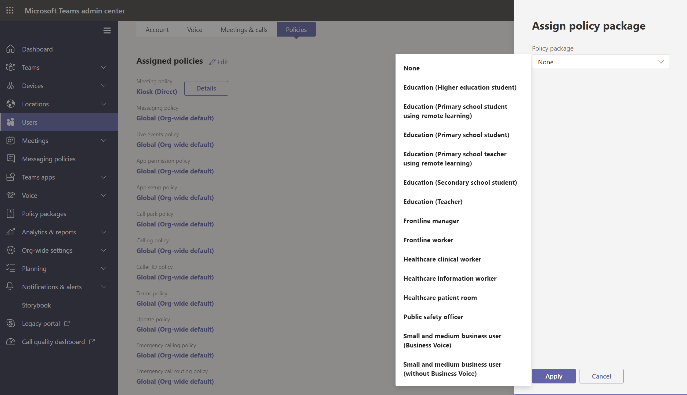

# <a name="assign-policy-packages-to-users-and-groups"></a>Attribuer des packages de stratégies à des utilisateurs et groupes

Cet article passe en revue les différentes manières d’attribuer des packages de stratégie aux utilisateurs et groupes Microsoft Teams. Avant de lire, veillez à lire Attribuer des stratégies [Teams mise en place.](policy-assignment-overview.md)

> [!NOTE]
> Chaque utilisateur aura besoin du module complémentaire Communications avancées pour recevoir une attribution de package de stratégie personnalisée. Pour plus d’informations, consultez [Module complémentaire Communications avancées pour Microsoft Teams](/microsoftteams/teams-add-on-licensing/advanced-communications).

## <a name="assign-a-policy-package-to-users"></a>Attribuer un package de stratégies aux utilisateurs

Un package de stratégie dans Teams est un ensemble de stratégies et paramètres de stratégie prédéfinés que vous pouvez affecter aux utilisateurs ayant des rôles identiques ou similaires dans votre organisation. Chaque package de stratégie est conçu autour d’un rôle d’utilisateur et inclut des stratégies et paramètres de stratégie prédéfinés qui supportent des activités classiques pour ce rôle. Le package Éducation (enseignant) et le package Soins de santé (travailleurs cliniques) sont quelques exemples de packages de stratégie. Pour plus d’informations, [voir Gérer les packages de stratégie dans Teams.](manage-policy-packages.md)

### <a name="assign-a-policy-package-to-one-user"></a>Attribuer un package de stratégie à un utilisateur

1. Dans le panneau de navigation gauche du Microsoft Teams d’administration, sélectionnez Utilisateurs, puis l’utilisateur.

2. Dans la page de l’utilisateur, sélectionnez **Stratégies,** puis, à côté du **package** de stratégie, sélectionnez **Modifier.**

3. Dans le **volet Attribuer un package** de stratégie, sélectionnez le package à attribuer, puis sélectionnez **Enregistrer.**



### <a name="assign-a-policy-package-to-multiple-users"></a>Attribuer un package de stratégie à plusieurs utilisateurs

1. Dans le navigation gauche du Centre d’administration Microsoft Teams, sélectionnez Packages de **stratégie,** puis sélectionnez le package de stratégie à attribuer en cliquant à gauche du nom du package.

2. Sélectionnez **Gérer les utilisateurs**.

3. Dans le volet **Gérer les utilisateurs**, recherchez l’utilisateur par son nom complet ou son nom d’utilisateur, sélectionnez le nom, puis sélectionnez **Ajouter**. Répétez cette étape pour chaque utilisateur que vous souhaitez ajouter.

4. Lorsque vous avez terminé d’ajouter des utilisateurs, sélectionnez **Enregistrer.**


## <a name="assign-a-policy-package-to-a-group"></a>Attribuer le package stratégie à un groupe

Attribution de package de stratégie aux groupes vous permet d’attribuer plusieurs stratégies à un groupe d’utilisateurs, tel qu’un groupe de sécurité ou une liste de distribution. L’affectations de stratégie est propagée aux membres du groupe en fonction de règles de priorité. Lorsque les membres sont ajoutés à un groupe ou supprimés de ceux-ci, leurs affectations de stratégie héritées sont mises à jour en conséquence.

L’affectation de package de stratégie à des groupes est recommandée pour les groupes de jusqu’à 50 000 utilisateurs, mais elle fonctionne également avec les groupes plus importants.

Lorsque vous attribuez le package de stratégie, il est immédiatement affecté au groupe. Toutefois, la propagation de l’affectation de stratégie aux membres du groupe est effectuée comme une opération en arrière-plan et peut prendre du temps, selon la taille du groupe. Il en va de même lorsqu’une stratégie est non signée dans un groupe, ou lorsque des membres sont ajoutés ou supprimés d’un groupe.

> [!IMPORTANT]
> Avant de commencer, il est important de comprendre[(règles](assign-policies-users-and-groups.md#precedence-rules)de priorité) et[(classement d’affectation de groupe).](assign-policies-users-and-groups.md#group-assignment-ranking) Assurez-vous de lire et de comprendre les concepts dans[(ce](assign-policies-users-and-groups.md#what-you-need-to-know-about-policy-assignment-to-groups)que vous devez savoir sur l’affectation de stratégie aux groupes) plus tôt dans cet article.

### <a name="assign-a-policy-package-to-a-group-of-users-in-the-admin-center"></a>Attribuer un package de stratégie à un groupe d’utilisateurs dans le Centre d’administration

1. Se connecter au Centre d’administration de Microsoft Teams.

2. Dans le dossier de navigation de gauche, allez à la page du package de stratégie.

3. Sélectionnez l’onglet Affectation de stratégie de groupe.

4. Sélectionnez **Ajouter un groupe,** puis dans le volet Affecter un package de stratégie au volet de groupe, comme suit :

    1. Recherchez et ajoutez le groupe à qui vous voulez affecter le package de stratégie.

    1. Sélectionnez un package de stratégie.

    1. Définissez le classement pour chaque type de stratégie.

    1. Sélectionnez **Appliquer.**


       

5. Pour gérer le classement d’un type de stratégie spécifique, accédez à la page de stratégie spécifique.

6. Pour réattribuer un package de stratégie à un groupe, supprimez tout d’abord l’affectation de stratégie de groupe. Ensuite, suivez les étapes ci-dessus pour affecter le package de stratégie à un groupe.

### <a name="work-with-powershell"></a>Travailler avec PowerShell

#### <a name="get-the-teams-powershell-module"></a>Obtenir le module PowerShell Teams’équipe

Pour obtenir des instructions pas à pas, voir [Installer Teams PowerShell.](teams-powershell-install.md)

#### <a name="assign-a-policy-package-to-a-group-of-users"></a>Affecter un package de stratégie à un groupe d’utilisateurs

Utilisez la [cmdlet Grant-CsGroupPolicyPackageAssignment](/powershell/module/teams/grant-csgrouppolicypackageassignment) pour affecter un package de stratégie à un groupe. Vous pouvez spécifier un groupe à l’aide de l’ID d’objet, de l’adresse SIP ou de l’adresse de messagerie. Lorsque vous attribuez le package de stratégie, spécifiez un ([classement d’affectation](assign-policies-users-and-groups.md#group-assignment-ranking)de groupe) pour chaque type de stratégie dans le package de stratégie.

Dans cet exemple, nous affectons le package de stratégie Education_Teacher à un groupe avec un classement d’affectations de 1 pour TeamsAppSetupPolicy et TeamsMeetingBroadcastPolicy et un classement de 2 pour TeamsMeetingPolicy.

```powershell
Grant-CsGroupPolicyPackageAssignment -GroupId "dae90bb4-120f-4a3e-a15d-30f142e79f69" -PackageName "Education_Teacher" -PolicyRankings "TeamsAppSetupPolicy, 1", "TeamsMeetingBroadcastPolicy, 1", "TeamsMeetingPolicy, 2"
```

## <a name="assign-a-policy-package-to-a-batch-of-users"></a>Affecter un package de stratégie à un lot d’utilisateurs

L’affectation de package de stratégie de lot vous permet d’affecter un package de stratégie à de grands ensembles d’utilisateurs à la fois sans utiliser de script. Vous utilisez la cmdlet [New-CsBatchPolicyAssignmentOperation](/powershell/module/teams/new-csbatchpolicyassignmentoperation) pour envoyer un lot d’utilisateurs et le package de stratégie que vous souhaitez affecter. Les attributions sont traitées comme une opération d’arrière-plan et un ID d’opération est généré pour chaque lot. Vous pouvez ensuite utiliser la cmdlet [Get-CsBatchPolicyAssignmentOperation](/powershell/module/teams/get-csbatchpolicyassignmentoperation) pour suivre l’avancement et l’état des devoirs d’un lot.

Spécifiez les utilisateurs selon leur ID d’objet ou leur adresse SIP (Session Initiation Protocol). L’adresse SIP d’un utilisateur a souvent la même valeur que le nom d’utilisateur principal (UPN) ou l’adresse de courrier, mais cela n’est pas obligatoire. Si un utilisateur est spécifié à l’aide de son nom d’utilisateur supérieur ou de son adresse de courrier, mais que sa valeur est différente de celle de son adresse SIP, l’attribution de stratégie échoue pour l’utilisateur. Si un lot inclut des utilisateurs en double, les doublons sont supprimés du lot avant que le traitement et l’état ne soient fournis qu’aux utilisateurs uniques restants du lot.

Un lot contient jusqu’à 5 000 utilisateurs. Pour de meilleurs résultats, n’envoyez pas plus de quelques lots à la fois. Autorisez le traitement des lots avant l’envoi d’autres lots.

### <a name="use-the-teams-powershell-module"></a>Utiliser le module Teams PowerShell

Exécutez la commande suivante pour installer [Microsoft Teams module PowerShell](https://www.powershellgallery.com/packages/MicrosoftTeams) (si vous ne l’avez pas déjà fait). Veillez à installer la version 1.0.5 ou ultérieure.

```powershell
Install-Module -Name MicrosoftTeams
```

Exécutez ce qui suit pour vous connecter Teams et démarrer une session.

```powershell
Connect-MicrosoftTeams
```

Lorsque vous y êtes invité, connectez-vous à l’aide de vos informations d’identification d’administrateur.

### <a name="assign-policy-packages-to-a-batch-of-users"></a>Attribuer des packages de stratégie à un lot d’utilisateurs

Dans cet exemple, nous utilisons la cmdlet [New-CsBatchPolicyAssignmentOperation](/powershell/module/teams/new-csbatchpolicyassignmentoperation) pour affecter le package de stratégie Education_PrimaryStudent à un lot d’utilisateurs.

```powershell
New-CsBatchPolicyPackageAssignmentOperation -Identity 1bc0b35f-095a-4a37-a24c-c4b6049816ab,user1@econtoso.com,user2@contoso.com -PackageName Education_PrimaryStudent
```

### <a name="see-the-status-of-a-batch-assignment"></a>Voir l’état d’une affectation de lot

Exécutez ce qui suit pour obtenir l’état d’une affectation de lot, où OperationId est l’ID d’opération renvoyé par `New-CsBatchPolicyAssignmentOperation` l’cmdlet pour un lot donné.

```powershell
$Get-CsBatchPolicyAssignmentOperation -OperationId f985e013-0826-40bb-8c94-e5f367076044 | fl
```

Si la sortie indique qu’une erreur s’est produite, exécutez l’erreur suivante pour obtenir plus d’informations sur les erreurs, qui se trouver dans la `UserState` propriété.

```powershell
Get-CsBatchPolicyAssignmentOperation -OperationId f985e013-0826-40bb-8c94-e5f367076044 | Select -ExpandProperty UserState
```

Pour en savoir plus, [consultez Get-CsBatchPolicyAssignmentOperation.](/powershell/module/teams/get-csbatchpolicyassignmentoperation)

## <a name="related-topics"></a>Voir aussi

- [Gérer les Teams des stratégies](manage-teams-with-policies.md)
- [Gérer les packages de stratégie dans Microsoft Teams](manage-policy-packages.md)
- [Aperçu de Teams PowerShell](teams-powershell-overview.md)
- [Attribuer des stratégies dans Teams - mise en place](policy-assignment-overview.md)
