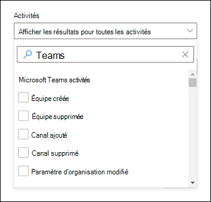

# Rechercher des événements Microsoft Teams dans le journal d'audit

> [!IMPORTANT]
> [!INCLUDE [new-teams-sfb-admin-center-notice](includes/new-teams-sfb-admin-center-notice.md)]

Le journal d’audit peut vous aider à examiner des activités spécifiques dans Microsoft 365 services. Pour Microsoft Teams, voici quelques-unes des activités auditées :

- Création d'une équipe
- Suppression d'une équipe
- Ajout d'un canal
- Canal supprimé
- Modification du paramètre de canal

Pour obtenir la liste complète des activités Teams qui sont auditées, consultez [Teams activités](#teams-activities) et [Shifts in Teams activities](#shifts-in-teams-activities).

> [!NOTE]
> Les événements d’audit provenant de canaux privés sont également enregistrés comme ils le sont pour les équipes et les canaux standard.

## Activer l’audit dans Teams

Avant de pouvoir examiner les données d’audit, vous devez d’abord activer l’audit dans le Centre de conformité Microsoft 365. Pour plus d’informations, consultez [Activer ou désactiver l’audit](/microsoft-365/compliance/turn-audit-log-search-on-or-off).

> [!IMPORTANT]
> Les données d’audit ne sont disponibles qu’à partir du moment où vous avez activé l’audit.

## Récupérer des données Teams à partir du journal d'audit

1. Pour récupérer les journaux d’audit des activités Teams, accédez à <https://compliance.microsoft.com> audit et sélectionnez **Audit**.

2. Dans la page **De recherche** , filtrez les activités, les dates et les utilisateurs que vous souhaitez auditer.

3. Pour une analyse plus approfondie, exportez les résultats dans Excel.

Pour obtenir des instructions pas à pas, consultez [Rechercher dans le journal d’audit dans le centre de conformité](/microsoft-365/compliance/search-the-audit-log-in-security-and-compliance#search-the-audit-log).

> [!IMPORTANT]
> Les données d’audit sont visibles uniquement dans le journal d’audit si l’audit est activé.

La durée pendant laquelle un enregistrement d’audit est conservé et pouvant faire l’objet d’une recherche dans le journal d’audit dépend de votre abonnement Microsoft 365 ou Office 365, et plus particulièrement du type de licence affecté aux utilisateurs. Pour en savoir plus, consultez la [description du service Security & Compliance Center](/office365/servicedescriptions/office-365-platform-service-description/office-365-securitycompliance-center).

## Astuces de recherche dans le journal d’audit

Voici des conseils pour rechercher Teams activités dans le journal d’audit.

:::image type="content" alt-text="Capture d’écran de la page de recherche dans le journal d’audit dans le centre de conformité" source="media/audit-log-search-page.png" lightbox="media/audit-log-search-page.png":::

- Vous pouvez sélectionner des activités spécifiques à rechercher en cochant la case en regard d’une ou plusieurs activités. Si une activité est sélectionnée, vous pouvez cliquer dessus pour annuler la sélection. Vous pouvez également utiliser la zone de recherche pour afficher les activités qui contiennent le mot clé que vous tapez.

  

- Pour afficher les événements des activités exécutées à l’aide d’applets de commande, **sélectionnez Afficher les résultats de toutes les activités** dans la liste **Des activités** . Si vous connaissez le nom de l’opération pour ces activités, tapez-la dans la zone de recherche pour afficher l’activité, puis sélectionnez-la.

- Pour effacer les critères de recherche actuels, cliquez sur **Effacer tout**. La plage de dates revient à la valeur par défaut des sept derniers jours.

- Si 5 000 résultats sont trouvés, vous pouvez probablement supposer qu’il y a plus de 5 000 événements qui répondent aux critères de recherche. Vous pouvez affiner les critères de recherche et réexécuter la recherche pour renvoyer moins de résultats, ou exporter tous les résultats de la recherche en sélectionnant **ExportDownload** >  **tous les résultats**. Pour obtenir des instructions détaillées sur l’exportation des journaux d’audit, consultez [Exporter les résultats de la recherche dans un fichier](/microsoft-365/compliance/search-the-audit-log-in-security-and-compliance#step-3-export-the-search-results-to-a-file).

Regardez [cette vidéo](https://www.youtube.com/embed/UBxaRySAxyE) pour découvrir l’utilisation de la recherche dans les journaux audio. Rejoignez Ansuman Acharya, un responsable de programme pour Teams, qui montre comment effectuer une recherche dans le journal d’audit pour Teams.

## activités Teams

Voici une liste de tous les événements enregistrés pour les activités utilisateur et administrateur dans Teams dans le journal d’audit Microsoft 365. La table inclut le nom convivial affiché dans la colonne **Activités** et le nom de l’opération correspondante qui apparaît dans les informations détaillées d’un enregistrement d’audit et dans le fichier CSV lorsque vous exportez les résultats de la recherche.

|Nom convivial  |Opération |Description |
|:---------|:---------|:---------|
|Ajout d’un bot à l’équipe   |BotAddedToTeam        |Un utilisateur ajoute un bot à une équipe.        |
|Ajout d'un canal   |ChannelAdded         |Un utilisateur ajoute un canal à une équipe.         |
|Connecteur ajouté  |ConnectorAdded          |Un utilisateur ajoute un connecteur à un canal.        |
|Ajout de détails sur Teams réunion 2|MeetingDetail|Teams ajouté des informations sur une réunion, notamment l’heure de début, l’heure de fin et l’URL de participation à la réunion.|
|Ajout d’informations sur les participants à la réunion 2|MeetingParticipantDetail|Teams ajouté des informations sur les participants d’une réunion, notamment l’ID d’utilisateur de chaque participant, l’heure à laquelle un participant a rejoint la réunion et l’heure à laquelle un participant a quitté la réunion.|
|Membres ajoutés    |MemberAdded         |Un propriétaire d’équipe ajoute des membres à une équipe, un canal ou une conversation de groupe.         |
|Onglet Ajouté    |TabAdded         |Un utilisateur ajoute un onglet à un canal.        |
|Modification du paramètre de canal    |ChannelSettingChanged         |L’opération ChannelSettingChanged est journalisée lorsque les activités suivantes sont effectuées par un membre de l’équipe. Pour chacune de ces activités, une description du paramètre qui a été modifié (entre parenthèses) s’affiche dans la colonne **Élément** dans les résultats de recherche du journal d’audit. <ul><li>Modifie le nom d’un canal d’équipe (**nom du canal**)</li><li>Modification de la description d’un canal d’équipe (**description du canal**)</li> </ul>      |
|Modification du paramètre d’organisation   |TeamsTenantSettingChanged         |L’opération TeamsTenantSettingChanged est journalisée lorsque les activités suivantes sont effectuées par un administrateur général dans le Centre d'administration Microsoft 365. Ces activités affectent les paramètres Teams à l’échelle de l’organisation. Pour plus d’informations, consultez [Gérer les paramètres Teams pour votre organisation](enable-features-office-365.md).  Pour chacune de ces activités, une description du paramètre modifié (entre parenthèses) s’affiche dans la colonne **Élément** dans les résultats de recherche du journal d’audit.<ul><li>Active ou désactive Teams pour l’organisation (**Microsoft Teams**).</li><li>Active ou désactive l’interopérabilité entre Microsoft Teams et Skype Entreprise pour l’organisation (**Skype Entreprise interopérabilité**).</li><li>Active ou désactive l’affichage du graphique organisationnel dans Microsoft Teams clients (**vue Organigramme**).</li><li>Active ou désactive la possibilité pour les membres de l’équipe de planifier des réunions privées (**planification de réunions privées**).</li><li>Active ou désactive la possibilité pour les membres de l’équipe de planifier des réunions de canal (**planification des réunions de canal**).</li><li>Active ou désactive l’appel vidéo dans Teams réunions (**vidéo pour les réunions Skype**).</li><li>Active ou désactive le partage d’écran dans Microsoft Teams meetups pour l’organisation (**partage d’écran pour Skype réunions**).</li><li>Active ou désactive cette possibilité d’ajouter des images animées (appelées Giphys) aux conversations Teams (**images animées**).</li><li>Modifie le paramètre d’évaluation du contenu pour l’organisation (**évaluation du contenu**). L’évaluation du contenu limite le type d’image animée qui peut être affichée dans les conversations.</li><li>Active ou désactive la possibilité pour les membres de l’équipe d’ajouter des images personnalisables (appelées mèmes personnalisés) à partir d’Internet aux conversations d’équipe (**images personnalisables à partir d’Internet**).</li><li>Active ou désactive la possibilité pour les membres de l’équipe d’ajouter des images modifiables (appelées autocollants) aux conversations d’équipe (**images modifiables**).</li><li>Active ou désactive cette possibilité pour les membres de l’équipe d’utiliser des bots dans Microsoft Teams conversations et canaux (**bots à l’échelle de l’organisation).**</li><li>Active des bots spécifiques pour Microsoft Teams. Cela n’inclut pas le bot T, qui est Teams bot d’aide disponible lorsque les bots sont activés pour l’organisation (**bots individuels**).</li><li>Active ou désactive la possibilité pour les membres de l’équipe d’ajouter des extensions ou des onglets (**extensions ou onglets**).</li><li>Active ou désactive le chargement latéral des bots propriétaires pour Microsoft Teams (**chargement latéral des bots**).</li><li>Active ou désactive la possibilité pour les utilisateurs d’envoyer des messages électroniques à un canal Microsoft Teams (**e-mail de canal**).</li></ul>|
|Changement du rôle des membres dans l’équipe    |MemberRoleChanged         |Un propriétaire d’équipe modifie le rôle des membres d’une équipe. Les valeurs suivantes indiquent le type de rôle attribué à l’utilisateur.   **1** - Indique le rôle membre. **2** - Indique le rôle Propriétaire. **3** - Indique le rôle Invité.  La propriété Members inclut également le nom de votre organisation et l’adresse e-mail du membre.        |
|Modification du paramètre d’équipe    |TeamSettingChanged        |L’opération TeamSettingChanged est journalisée lorsque les activités suivantes sont effectuées par un propriétaire d’équipe. Pour chacune de ces activités, une description du paramètre modifié (entre parenthèses) s’affiche dans la colonne **Élément** dans les résultats de recherche du journal d’audit.<ul><li>Modifie le type d’accès d’une équipe. Teams peut être défini comme privé ou public (**type d’accès à l’équipe**). Lorsqu’une équipe est privée (paramètre par défaut), les utilisateurs peuvent accéder à l’équipe uniquement par invitation. Lorsqu’une équipe est publique, elle est détectable par n’importe qui.</li><li>Modifie la classification des informations d’une équipe (**classification d’équipe**). Par exemple, les données d’équipe peuvent être classées comme un impact élevé sur l’entreprise, un impact moyen sur l’entreprise ou un faible impact sur l’entreprise.</li><li>Modifie le nom d’une équipe (**nom de l’équipe**).</li><li>Modifie la description de l’équipe (**description de l’équipe**).</li><li>Modifications apportées aux paramètres d’équipe. Pour accéder à ces paramètres, un propriétaire d’équipe peut cliquer avec le bouton droit sur une équipe, sélectionner **Gérer l’équipe**, puis cliquer sur l’onglet **Paramètres**. Pour ces activités, le nom du paramètre qui a été modifié s’affiche dans la colonne **Élément** dans les résultats de recherche du journal d’audit.</li></ul>         |
|Création d’une conversation 1,  2|    ChatCreated|    Une conversation Teams a été créée.|
|Équipe créée    |TeamCreated         |Un utilisateur crée une équipe.         |
|Suppression d’un message  |Message supprimé |Un message dans une conversation ou un canal a été supprimé.|
|Suppression de toutes les applications d’organisation|DeletedAllOrganizationApps           |Suppression de toutes les applications d’organisation du catalogue.     |
|Application supprimée |AppDeletedFromCatalog           |Une application a été supprimée du catalogue.     |
|Canal supprimé     |ChannelDeleted         |Un utilisateur supprime un canal d’une équipe.         |
|Équipe supprimée  |TeamDeleted            |Un propriétaire d’équipe supprime une équipe.      |
|Modification d’un message avec un lien URL dans Teams     |MessageEditedHasLink         |Un utilisateur modifie un message et lui ajoute un lien URL dans Teams.         |
|Messages exportés 1,  2 |    MessagesExported |Les messages de conversation ou de canal ont été exportés.|
|Échec de la validation de l’invitation au canal partagé3 | FailedValidation |Un utilisateur répond à une invitation à un canal partagé, mais la validation de l’invitation a échoué. |
|Conversation extraite 1,  2   |ChatRetrieved  |Une conversation Microsoft Teams a été récupérée.|
|Extraction de tout le contenu hébergé d’un message1,  2 |MessageHostedContentsListed    |Tout le contenu hébergé dans un message, tel que des images ou des extraits de code, a été récupéré.|
|Application installée |AppInstalled         |Une application a été installée.   |
|Action effectuée sur la carte|PerformedCardAction|Un utilisateur a pris des mesures sur une carte adaptative au sein d’une conversation. Les cartes adaptatives sont généralement utilisées par les bots pour permettre l’affichage complet d’informations et d’interactions dans les conversations.   **Note:** Seules les actions d’entrée incluses sur une carte adaptative à l’intérieur d’une conversation sont disponibles dans le journal d’audit. Par exemple, lorsqu’un utilisateur envoie une réponse de sondage dans une conversation de canal sur une carte adaptative générée par un bot de sondage. Les actions utilisateur telles que « Afficher le résultat », qui ouvre une boîte de dialogue, ou les actions de l’utilisateur à l’intérieur des dialogues ne sont pas disponibles dans le journal d’audit.|
|Publication d’un nouveau message 1,  2   |MessageSent|   Un nouveau message a été publié sur une conversation ou un canal.|
|Application publiée |AppPublishedToCatalog           |Une application a été ajoutée au catalogue.     |
|Lire un message 1,  2 |MessageRead    |Un message d’une conversation ou d’un canal a été récupéré.|
|Lire le contenu hébergé d’un message 1,  2   |MessageHostedContentRead   |Le contenu hébergé dans un message, tel qu’une image ou un extrait de code, a été récupéré.|
|Suppression du bot de l’équipe   |BotRemovedFromTeam         |Un utilisateur supprime un bot d’une équipe.       |
|Connecteur supprimé     |ConnectorRemoved         |Un utilisateur supprime un connecteur d’un canal.         |
|Membres supprimés    |MemberRemoved        |Un propriétaire d’équipe supprime des membres d’une équipe, d’un canal ou d’une conversation de groupe.         |
|Suppression du partage du canal d’équipe 3 | TerminateedSharing |Un propriétaire d’équipe ou de canal a désactivé le partage pour un canal partagé. |
|Partage restauré du canal d’équipe 3 | SharingRestored | Le partage d’une équipe ou d’un propriétaire de canal a été réactivé pour un canal partagé. |
|Onglet Supprimé    |TabRemoved         |Un utilisateur supprime un onglet d’un canal.         |
|Réponse à l’invitation pour canal partagé3 | InviteeResponded | Un utilisateur a répondu à une invitation de canal partagé. |
|Réponse à l’invitation à un canal partagé 3 | ChannelOwnerResponded |Un propriétaire de canal a répondu à une réponse d’un utilisateur qui a répondu à une invitation de canal partagé. |
|Messages récupérés 1,  2 |MessagesListed |Les messages d’une conversation ou d’un canal ont été récupérés.|
|Envoi d’un message avec un lien URL dans Teams |MessageCreatedHasLink|Un utilisateur envoie un message contenant un lien URL dans Teams.|
|Notification de modification envoyée pour la création de messages 1,  2  |MessageCreatedNotification |Une notification de modification a été envoyée pour notifier un nouveau message à une application d’écouteur abonné.|
|Notification de modification envoyée pour la suppression de message 1,  2  |MessageDeletedNotification |Une notification de modification a été envoyée pour notifier un message supprimé à une application d’écouteur abonné.|
|Notification de modification envoyée pour la mise à jour de message 1,  2    |MessageUpdatedNotification |Une notification de modification a été envoyée pour informer une application d’écouteur abonné d’un message mis à jour.|
|Invitation envoyée pour canal partagé3 | InviteSent |Un propriétaire ou membre de canal envoie une invitation à un canal partagé. Les invitations aux canaux partagés peuvent être envoyées à des personnes extérieures à votre organisation si la stratégie de canal est configurée pour partager le canal avec des utilisateurs externes.  |
|Abonné aux notifications de modification de message 1,  2 |SubscribedToMessages   |Un abonnement a été créé par une application d’écouteur pour recevoir des notifications de modification pour les messages.|
|Application désinstallée |AppUninstalled           |Une application a été désinstallée.     |
|Application mise à jour |AppUpdatedInCatalog           |Une application a été mise à jour dans le catalogue.     |
|Mise à jour d’une conversation 1,  2 |ChatUpdated    |Une conversation Teams a été mise à jour.|
|Mise à jour d’un message 1,  2  |MessageUpdated |Un message d’une conversation ou d’un canal a été mis à jour.|
|Connecteur mis à jour    |ConnectorUpdated         |Un utilisateur a modifié un connecteur dans un canal.         |
|Onglet Mis à jour   |TabUpdated         |Un utilisateur a modifié un onglet dans un canal.         |
|Application mise à niveau |AppUpgraded           |Une application a été mise à niveau vers sa dernière version dans le catalogue.     |
|Utilisateur connecté à Teams     |TeamsSessionStarted         |Un utilisateur se connecte à un client Microsoft Teams. Cet événement ne capture pas les activités d’actualisation des jetons.         |
||||

> [!NOTE]
> 1 Un enregistrement d’audit pour cet événement est enregistré uniquement lorsque l’opération est effectuée en appelant un API Graph Microsoft. Si l’opération est effectuée dans le client Teams, aucun enregistrement d’audit n’est enregistré 2 Cet événement est disponible uniquement dans l’audit avancé. Cela signifie que les utilisateurs doivent disposer de la licence appropriée avant que ces événements ne soient enregistrés dans le journal d’audit. Pour plus d’informations sur les activités disponibles uniquement dans l’audit avancé, consultez [Audit avancé dans Microsoft 365](/microsoft-365/compliance/advanced-audit#advanced-audit-events). Pour connaître les exigences en matière de licences d’audit avancées, consultez [les solutions d’audit dans Microsoft 365](/microsoft-365/compliance/auditing-solutions-overview#licensing-requirements).   3 Cet événement est en préversion publique.

## Changements dans les activités Teams

**(version d’évaluation)**

Si votre organisation utilise l’application Shifts dans Teams, vous pouvez rechercher des activités liées à l’application Shifts dans le journal d’audit. Voici une liste de tous les événements enregistrés pour les activités Shifts dans Teams dans le journal d’audit Microsoft 365.

|Nom convivial  |Opération  |Description  |
|---------|---------|---------|
|Ajout d’un groupe de planification |ScheduleGroupAdded          |Un utilisateur ajoute avec succès un nouveau groupe de planification à la planification.|
|Groupe de planification modifié     |ScheduleGroupEdited         |Un utilisateur modifie correctement un groupe de planification.          |
|Groupe de planification supprimé         |ScheduleGroupDeleted              |Un utilisateur supprime avec succès un groupe de planification de la planification.|
|Planification retirée |ScheduleWithdrawn              |Un utilisateur retire avec succès une planification publiée.|
|Maj ajouté      |MajAdded          |Un utilisateur ajoute correctement un décalage.           |
|Décalage modifié       |MajEdité       |Un utilisateur modifie correctement un décalage.        |
|Décalage supprimé          |MajDeleted          | Un utilisateur supprime correctement un décalage.               |
|Ajout d’un délai d’attente      |TimeOffAdded          |Un utilisateur ajoute avec succès un congé à la planification.          |
|Temps d’arrêt modifié         |TimeOffEdited           |Un utilisateur modifie correctement le délai d’attente.          |
|Temps d’arrêt supprimé     |TimeOffDeleted              |Un utilisateur supprime avec succès le délai d’attente.           |
|Ajout d’un décalage ouvert     |OpenShiftAdded          |Un utilisateur ajoute un décalage ouvert à un groupe de planification.          |
|Décalage ouvert modifié    |OpenShiftEdited          |Un utilisateur modifie correctement un décalage ouvert dans un groupe de planification.          |
|Décalage ouvert supprimé      |OpenShiftDeleted          |Un utilisateur supprime avec succès un décalage ouvert d’un groupe de planification.         |
|Planification partagée     |ScheduleShared                  |Un utilisateur a correctement partagé une planification d’équipe pour une plage de dates.          |
|Clocked in using Time clock         |ClockedIn          |Un utilisateur est correctement connecté à l’aide de l’horloge de temps.          |
|Horloge expirée à l’aide de l’horloge de temps      |ClockedOut          |Un utilisateur est correctement déconnecté à l’aide de l’horloge de temps.          |
|Arrêt démarré à l’aide de l’horloge de temps      |BreakStarted          |Un utilisateur démarre correctement une pause pendant une session d’horloge de temps active.          |
|Arrêt terminé à l’aide de l’horloge de temps    |BreakEnded          |Un utilisateur termine correctement une pause pendant une session d’horloge de temps active.          |
|Ajout de l’entrée d’horloge de temps     |TimeClockEntryAdded          |Un utilisateur ajoute correctement une nouvelle entrée d’horloge manuelle dans la feuille de temps.          |
|Entrée d’horloge de temps modifiée     | TimeClockEntryEdited             |Un utilisateur modifie correctement une entrée d’horloge dans la feuille de temps.          |
|Entrée d’horloge de temps supprimée    |TimeClockEntryDeleted              |Un utilisateur supprime avec succès une entrée d’horloge dans la feuille de temps.          |
|Ajout d’une demande de décalage         |RequestAdded              |Un utilisateur a ajouté une demande de décalage.          |
|Réponse à la demande de décalage     |RequestRespondedTo                  |Un utilisateur a répondu à une demande de décalage.          |
|Demande de décalage annulée         |RequestCancelled               |Un utilisateur a annulé une demande de décalage.          |
|Modification du paramètre de planification      |ScheduleSettingChanged          |Un utilisateur modifie un paramètre dans les paramètres Shifts.         |
|Intégration de la main-d’œuvre ajoutée      |WorkforceIntegrationAdded                  | L’application Shifts est intégrée à un système tiers.         |
|Message de décalage accepté         |OffShiftDialogAccepted          |Un utilisateur reconnaît le message de décalage pour accéder à Teams après les heures de travail.           |

## API d’activité de gestion Office 365

Vous pouvez utiliser l’API d’activité de gestion Office 365 pour récupérer des informations sur Teams événements. Pour en savoir plus sur le schéma de l’API Activité de gestion pour Teams, consultez [Teams schéma](/office/office-365-management-api/office-365-management-activity-api-schema#microsoft-teams-schema).

## Attribution dans les journaux d’audit Teams

Les modifications apportées à l’appartenance aux Teams (par exemple, les utilisateurs ajoutés ou supprimés) apportées via Azure Active Directory (Azure AD), Microsoft 365 portail d’administration ou Groupes Microsoft 365 API Graph apparaîtront dans Teams  messages d’audit et dans le canal Général avec une attribution à un propriétaire existant de l’équipe, et non à l’initiateur réel de l’action. Dans ces scénarios, consultez Azure AD ou [Microsoft 365 journaux d’audit de groupe](/microsoft-365/compliance/search-the-audit-log-in-security-and-compliance) pour voir les informations pertinentes.

## Utiliser Defender pour le cloud Apps pour définir des stratégies d’activité

À l’aide [de Microsoft Defender for Cloud Apps’intégration](/cloud-app-security/what-is-cloud-app-security), vous pouvez définir [des stratégies d’activité](/cloud-app-security/user-activity-policies) pour appliquer un large éventail de processus automatisés à l’aide des API du fournisseur d’applications. Ces stratégies vous permettent de surveiller des activités spécifiques effectuées par différents utilisateurs, ou de suivre des taux d’activité d’un certain type d’activité de façon inattendue.

Une fois que vous avez défini une stratégie de détection d’activité, elle commence à générer des alertes. Les alertes sont générées uniquement sur les activités qui se produisent après la création de la stratégie. Voici quelques exemples de scénarios permettant d’utiliser des stratégies d’activité dans Defender pour le cloud Apps pour surveiller Teams activités.

### Scénario d’utilisateur externe

L’ajout d’utilisateurs externes à votre environnement Teams est un scénario sur lequel vous pouvez garder un œil, du point de vue de l’entreprise. Si les utilisateurs externes sont activés, la surveillance de leur présence est une bonne idée.  Vous pouvez utiliser [Defender pour le cloud Apps](/cloud-app-security/what-is-cloud-app-security) pour identifier les menaces potentielles.

:::image type="content" alt-text="Stratégie pour surveiller l’ajout d’utilisateurs externes." source="media/TeamsExternalUserAddPolicy.png" lightbox="media/TeamsExternalUserAddPolicy.png":::

La capture d’écran de cette stratégie pour surveiller l’ajout d’utilisateurs externes vous permet de nommer la stratégie, de définir la gravité en fonction des besoins de votre entreprise, de la définir en tant qu’activité unique (dans ce cas), puis d’établir les paramètres qui surveillent spécifiquement uniquement l’ajout d’utilisateurs non internes et limitent cette activité à Teams.

Les résultats de cette stratégie peuvent être affichés dans le journal d’activité :

:::image type="content" alt-text="Événements déclenchés par la stratégie des utilisateurs externes." source="media/TeamsExternalUserList.png" lightbox="media/TeamsExternalUserList.png":::

Ici, vous pouvez passer en revue les correspondances à la stratégie que vous avez définie, et effectuer les ajustements nécessaires, ou exporter les résultats à utiliser ailleurs.

### Scénario de suppression de masse

Comme mentionné précédemment, vous pouvez surveiller les scénarios de suppression. Il est possible de créer une stratégie qui surveillerait la suppression en masse de Teams sites. Dans cet exemple, une stratégie basée sur les alertes est configurée pour détecter la suppression de masse des équipes en 30 minutes.

:::image type="content" alt-text="Stratégie montrant la configuration d’une stratégie pour la détection de suppression d’équipe de masse." source="media/TeamsMassDeletePolicy.png" lightbox="media/TeamsMassDeletePolicy.png":::

Comme le montre la capture d’écran, vous pouvez définir de nombreux paramètres différents pour cette stratégie afin de surveiller Teams suppressions, notamment la gravité, l’action unique ou répétée, et les paramètres qui limitent cette option à Teams et à la suppression de site. Cela peut être fait indépendamment d’un modèle, ou vous pouvez avoir un modèle créé pour baser cette stratégie, en fonction des besoins de votre organisation.

Une fois que vous avez établi une stratégie qui fonctionne pour votre entreprise, vous pouvez examiner les résultats dans le journal d’activité à mesure que les événements sont déclenchés :

:::image type="content" alt-text="Capture d’écran des événements déclenchés par des suppressions de masse." source="media/TeamsMassDeleteList.png" lightbox="media/TeamsMassDeleteList.png":::

Vous pouvez filtrer jusqu’à la stratégie que vous avez définie pour afficher les résultats de cette stratégie. Si les résultats que vous obtenez dans le journal d’activité ne sont pas satisfaisants (vous voyez peut-être beaucoup de résultats, ou rien du tout), cela peut vous aider à affiner la requête pour la rendre plus pertinente à ce que vous avez besoin de faire.

### Scénario d’alerte et de gouvernance

Vous pouvez définir des alertes et envoyer des e-mails aux administrateurs et aux autres utilisateurs lorsqu’une stratégie d’activité est déclenchée. Vous pouvez définir des actions de gouvernance automatisées, telles que suspendre un utilisateur ou faire en sorte qu’un utilisateur se reconnecte de manière automatisée. Cet exemple montre comment un compte d’utilisateur peut être suspendu lorsqu’une stratégie d’activité est déclenchée et détermine qu’un utilisateur a supprimé au moins deux équipes en 30 minutes.

## Utiliser Defender pour le cloud Apps pour définir des stratégies de détection d’anomalies

[Les stratégies de détection d’anomalies](/cloud-app-security/anomaly-detection-policy) dans Defender pour le cloud Apps fournissent une analytique comportementale des utilisateurs et des entités (UEBA) et un machine learning (ML) qui vous permettent d’exécuter immédiatement une détection avancée des menaces dans votre environnement cloud. Étant donné qu’elles sont automatiquement activées, les nouvelles stratégies de détection d’anomalies fournissent des résultats immédiats en fournissant des détections immédiates, ciblant de nombreuses anomalies comportementales au sein de vos utilisateurs et des ordinateurs et appareils connectés à votre réseau. En outre, les nouvelles stratégies exposent davantage de données à partir du moteur de détection Defender pour le cloud Apps, pour vous aider à accélérer le processus d’investigation et à contenir des menaces en cours.

Nous travaillons à l’intégration d’événements Teams dans les stratégies de détection d’anomalies. Pour l’instant, vous pouvez configurer des stratégies de détection d’anomalies pour d’autres produits Office et prendre des éléments d’action sur les utilisateurs qui correspondent à ces stratégies.

## Voir aussi

- [Recherchez le journal d’audit dans le Centre de conformité Microsoft 365](/microsoft-365/compliance/search-the-audit-log-in-security-and-compliance)
