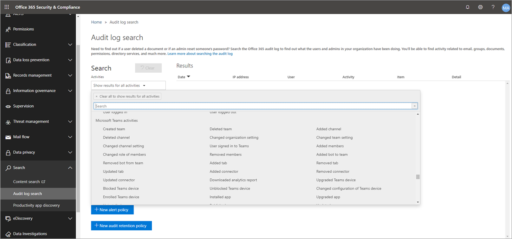

# Rechercher des événements Microsoft Teams dans le journal d'audit

> [!IMPORTANT]
> [!INCLUDE [new-teams-sfb-admin-center-notice](includes/new-teams-sfb-admin-center-notice.md)]

Le journal d’audit peut vous aider à examiner des activités spécifiques au sein Microsoft 365 services. Pour Microsoft Teams, voici quelques-unes des activités auditées :

- Création d'une équipe
- Suppression d'une équipe
- Ajout d'un canal
- Canal supprimé
- Paramètre de canal modifié

Pour obtenir la liste complète des Teams auditées, voir Teams [et](#teams-activities) [Shifts](#shifts-in-teams-activities)in Teams activités.

> [!NOTE]
> Les événements d’audit des canaux privés sont également enregistrés tels qu’ils sont pour les équipes et les canaux standard.

## Activer l’audit dans Teams

Avant d’examiner les données d’audit, vous devez activer l’audit dans le Centre de conformité Microsoft 365. Pour plus d’informations, voir Activer ou désactiver [l’audit.](/microsoft-365/compliance/turn-audit-log-search-on-or-off)

> [!IMPORTANT]
> Les données d’audit sont uniquement disponibles à partir du moment où vous avez désactivé l’audit.

## Récupérer des données Teams à partir du journal d'audit

1. Pour récupérer les journaux d’audit Teams de résultats, sélectionnez <https://compliance.microsoft.com> **Audit.**

2. Dans la page **Recherche,** filtrez les activités, dates et utilisateurs que vous voulez auditer.

3. Pour une analyse plus approfondie, exportez les résultats dans Excel.

Pour obtenir des instructions détaillées, consultez [le journal d’audit dans le Centre de conformité.](/microsoft-365/compliance/search-the-audit-log-in-security-and-compliance#search-the-audit-log)

> [!IMPORTANT]
> Les données d’audit ne sont visibles que dans le journal d’audit si l’audit est désactivé.

La durée pendant qu’un enregistrement d’audit est conservé et utilisable dans le journal d’audit dépend de votre abonnement Microsoft 365 ou Office 365 et plus spécifiquement du type de licence affecté aux utilisateurs. Pour en savoir plus, consultez [la description du service du Centre & conformité.](/office365/servicedescriptions/office-365-platform-service-description/office-365-securitycompliance-center)

## Astuces pour la recherche dans le journal d’audit

Voici des conseils pour rechercher des Teams dans le journal d’audit.

- Vous pouvez sélectionner des activités spécifiques à rechercher en cliquant sur la case à cocher en regard d’une ou plusieurs activités. Si une activité est sélectionnée, vous pouvez cliquer dessus pour annuler la sélection. Vous pouvez également utiliser la zone de recherche pour afficher les activités qui contiennent le mot clé que vous tapez.

  

- Pour afficher des événements pour des activités qui s’exécutent à l’aide d’lets de cmdlets, sélectionnez Afficher les résultats **pour toutes** les activités dans la **liste Activités.** Si vous connaissez le nom de l’opération pour ces activités, tapez-le dans la zone de recherche pour afficher l’activité, puis sélectionnez-la.

- Pour effacer les critères de recherche actuels, cliquez **sur Effacer tout.** La plage de dates reprend la valeur par défaut des sept derniers jours.

- Si 5 000 résultats sont trouvés, vous pouvez partir du principe que plus de 5 000 événements ont répondu aux critères de recherche. Vous pouvez affiner les critères de recherche et réexécuter la recherche pour renvoyer moins de résultats, ou exporter tous les résultats de recherche en sélectionnant **Exporter**  >  **Télécharger tous les résultats.** Pour obtenir des instructions détaillées sur l’exportation des journaux d’audit, voir Exporter les résultats de la recherche [vers un fichier.](/microsoft-365/compliance/search-the-audit-log-in-security-and-compliance#step-3-export-the-search-results-to-a-file)

Regardez cette [vidéo pour utiliser](https://www.youtube.com/embed/UBxaRySAxyE) la recherche dans le journal audio. Rejoignez Ansuman Acharya, un responsable de programme pour Teams, pour apprendre à effectuer une recherche dans le journal d’audit Teams.

## Teams activités

Voici une liste de tous les événements enregistrés pour les activités utilisateur et administrateur dans Teams journal d’audit Microsoft 365'équipe. Le tableau inclut le nom convivial  affiché dans la colonne Activités et le nom de l’opération correspondante qui apparaît dans les informations détaillées d’un enregistrement d’audit et dans le fichier CSV lorsque vous exportez les résultats de la recherche.

|Nom convivial  |Opération |Description |
|:---------|:---------|:---------|
|Robot ajouté à l’équipe   |BotAddedToTeam        |Un utilisateur ajoute un robot à une équipe.        |
|Ajout d'un canal   |ChannelAdded         |Un utilisateur ajoute un canal à une équipe.         |
|Connecteur ajouté  |ConnectorAdded          |Un utilisateur ajoute un connecteur à un canal.        |
|Ajout de détails sur Teams réunion|Détails de la réunion|Teams informations sur une réunion, notamment l’heure de début, l’heure de fin et l’URL de la réunion.|
|Ajout d’informations sur les participants à la réunion|MeetingParticipantDetail|Teams ajouté des informations sur les participants à une réunion, notamment l’ID d’utilisateur de chaque participant, l’heure à partir de celle-ci et l’heure à partir de celle-ci.|
|Membres ajoutés    |MemberAdded         |Un propriétaire d’équipe ajoute des membres à une équipe, un canal ou une conversation de groupe.         |
|Onglet ajouté    |TabAdded         |Un utilisateur ajoute un onglet à un canal.        |
|Paramètre de canal modifié    |ChannelSettingChanged         |L’opération ChannelSettingChanged est consignée lorsque les activités suivantes sont effectuées par un membre de l’équipe. Pour chacune de ces activités, une description du paramètre modifié (entre parenthèses s’affiche dans la colonne Élément des résultats de la recherche dans le journal d’audit).  <ul><li>Change name of a team channel (**Channel name)**</li><li>Description des modifications d’un canal d’équipe **(description du canal)**</li> </ul>      |
|Paramètre d’organisation modifié   |TeamsTenantSettingChanged         |L’opération TeamsTenantSettingChanged est consignée lorsque les activités suivantes sont effectuées par un administrateur global dans le Centre d'administration Microsoft 365. Ces activités affectent les paramètres de Teams à l’échelle de l’organisation. Pour plus d’informations, [voir Gérer Teams de votre organisation.](enable-features-office-365.md)  Pour chacune de ces activités, une description du paramètre modifié (entre parenthèses) s’affiche dans la colonne Élément des résultats de la recherche dans le journal d’audit. <ul><li>Active ou désactive les Teams pour l’organisation **(Microsoft Teams).**</li><li>Active ou désactive l’interopérabilité entre les Microsoft Teams et Skype Entreprise pour l’organisation (Skype Entreprise **interopérabilité).**</li><li>Active ou désactive l’affichage d’organigramme dans Microsoft Teams clients **(Affichage d’organigramme).**</li><li>Active ou désactive la possibilité pour les membres de l’équipe de planifier des réunions privées **(planification de réunion privée).**</li><li>Active ou désactive la possibilité pour les membres de l’équipe de planifier des réunions de canal **(planification de réunions de canal).**</li><li>Active ou désactive les appels vidéo dans Teams réunions **(vidéo pour Skype réunions).**</li><li>Active ou désactive le partage d’écran Microsoft Teams réunions de l’organisation (partage d’écran **Skype réunions).**</li><li>Active ou désactive la possibilité d’ajouter des images animées (appelées Giphys) à Teams conversations (**Images animées).**</li><li>Modifie le paramètre d’évaluation du contenu pour l’organisation **(Évaluation du contenu).** L’évaluation du contenu restreint le type d’image animée qui peut être affiché dans les conversations.</li><li>Active ou désactive la possibilité pour les membres de l’équipe d’ajouter des images personnalisables (appelées mèmes personnalisés) à partir d’Internet aux conversations d’équipe (images personnalisables à partir **d’Internet).**</li><li>Active ou désactive la possibilité pour les membres de l’équipe d’ajouter des images modifiables (appelées autocollants) aux conversations d’équipe **(images modifiables).**</li><li>Active ou désactive la possibilité pour les membres de l’équipe d’utiliser des bots dans Microsoft Teams conversations et canaux **(bots à l’échelle de l’organisation).**</li><li>Active des robots spécifiques pour Microsoft Teams. Cela n’inclut pas T-Bot, qui est Teams d’aide disponible lorsque les bots sont activés pour l’organisation **(bots individuels).**</li><li>Active ou désactive la possibilité pour les membres de l’équipe d’ajouter des extensions ou des onglets **(extensions ou onglets).**</li><li>Active ou désactive le chargement latéral des robots propriétaires pour Microsoft Teams (chargement **latéral des bots).**</li><li>Active ou désactive la possibilité pour les utilisateurs d’envoyer des messages électroniques à un canal Microsoft Teams **(Adresse de messagerie du canal).**</li></ul>|
|Rôle modifié des membres de l’équipe    |MemberRoleChanged         |Un propriétaire d’équipe modifie le rôle des membres d’une équipe. Les valeurs suivantes indiquent le type de rôle attribué à l’utilisateur.   **1** - Indique le rôle Membre. **2** - Indique le rôle Propriétaire. **3** - Indique le rôle Invité.  La propriété Membres inclut également le nom de votre organisation et l’adresse de courrier du membre.        |
|Paramètre d’équipe modifié    |TeamSettingChanged        |L’opération TeamSettingChanged est consignée lorsque les activités suivantes sont effectuées par un propriétaire d’équipe. Pour chacune de ces activités, une description du paramètre modifié (entre parenthèses) s’affiche dans la colonne Élément des résultats de la recherche dans le journal d’audit. <ul><li>Modifie le type d’accès pour une équipe. Teams peut être définie comme publique ou **privée (type d’accès à l’équipe).** Quand une équipe est privée (paramètre par défaut), les utilisateurs ne peuvent y accéder que sur invitation. Quand une équipe est publique, n’importe qui peut la découvrir.</li><li>Modifie la classification des informations d’une équipe **(Classification d’équipe).** Par exemple, les données d’équipe peuvent être classées comme impact élevé, impact moyen ou faible sur l’entreprise.</li><li>Modifie le nom d’une équipe **(Nom de l’équipe).**</li><li>Modifie la description de l’équipe **(Description de l’équipe).**</li><li>Modifications apportées aux paramètres de l’équipe. Pour accéder à ces paramètres, un propriétaire d’équipe peut cliquer avec le bouton droit sur une équipe, sélectionner Gérer l’équipe, puis cliquer sur **l’Paramètres** groupe. Pour ces activités, le nom du paramètre modifié s’affiche dans la colonne **Élément** des résultats de la recherche dans le journal d’audit.</li></ul>         |
|Création d’une conversation 1,  2|    ChatCreated|    Une Teams conversation instantanée a été créée.|
|Équipe créée    |TeamCreated         |Un utilisateur crée une équipe.         |
|Message supprimé  |MessageDeleted |Un message dans une conversation ou un canal a été supprimé.|
|Suppression de toutes les applications de l’organisation|DeletedAllOrganizationApps           |Toutes les applications de l’organisation ont été supprimées du catalogue.     |
|Application supprimée |AppDeletedFromCatalog           |Une application a été supprimée du catalogue.     |
|Canal supprimé     |ChannelDeleted         |Un utilisateur supprime un canal d’une équipe.         |
|Équipe supprimée  |TeamDeleted            |Un propriétaire d’équipe supprime une équipe.      |
|Message modifié avec un lien d’URL dans Teams     |MessageEditedHasLink         |Un utilisateur modifie un message et y ajoute un lien d’URL dans Teams.         |
|Messages exportés 1,  2 |    MessagesExported |Les messages de conversation ou de canal ont été exportés.|
|Extraire une conversation 1,  2   |ChatRetrieved  |Une Microsoft Teams conversation instantanée a été récupérée.|
|Récupération de tout le contenu hébergé d’un message1,  2 |MessageHostedContentsListed    |Tout le contenu hébergé dans un message, tel que les images ou les extraits de code, a été récupéré.|
|Application installée |AppInstalled         |Une application a été installée.   |
|Action effectuée sur la carte|PerformedCardAction|Un utilisateur a fait une action sur une carte adaptative dans une conversation. Les cartes adaptatives sont généralement utilisées par les bots pour permettre l’affichage enrichi des informations et de l’interaction dans les conversations.   **Remarque :** Seules les actions d’entrée en ligne sur une carte adaptative à l’intérieur d’une conversation seront disponibles dans le journal d’audit. Par exemple, lorsqu’un utilisateur envoie une réponse de sondage dans une conversation de canal sur une carte adaptative générée par un bot de sondage. Les actions de l’utilisateur, telles que « Afficher le résultat », qui ouvre une boîte de dialogue, ou les actions de l’utilisateur à l’intérieur de boîtes de dialogue ne seront pas disponibles dans le journal d’audit.|
|Publié un nouveau message (1,  2)   |MessageSent|   Un nouveau message a été publié dans une conversation ou un canal.|
|Application publiée |AppPublishedToCatalog           |Une application a été ajoutée au catalogue.     |
|Lire un message 1,  2 |MessageRead    |Un message d’une conversation ou d’un canal a été récupéré.|
|Lire le contenu hébergé d’un message 1,  2   |MessageHostedContentRead   |Le contenu hébergé dans un message, tel qu’une image ou un extrait de code, a été récupéré.|
|Robot supprimé de l’équipe   |BotRemovedFromTeam         |Un utilisateur supprime un robot d’une équipe.       |
|Connecteur supprimé     |ConnectorRemoved         |Un utilisateur supprime un connecteur d’un canal.         |
|Membres supprimés    |MemberRemoved        |Un propriétaire d’équipe supprime des membres d’une équipe, d’un canal ou d’une conversation de groupe.         |
|Onglet supprimé    |TabRemoved         |Un utilisateur supprime un onglet d’un canal.         |
|Messages récupérés 1,  2 |MessagesListed |Les messages d’une conversation ou d’un canal ont été récupérés.|
|Message avec un lien d’URL dans Teams |MessageCreatedHasLink|Un utilisateur envoie un message contenant un lien d’URL dans Teams.|
|Notification de modification envoyée pour la création du message 1,  2  |MessageCreatedNotification |Une notification de modification a été envoyée pour informer une application d’écoute abonnée d’un nouveau message.|
|Notification de modification envoyée pour suppression de message 1,  2  |MessageDeletedNotification |Une notification de modification a été envoyée pour informer une application d’écoute abonnée d’un message supprimé.|
|Notification de modification envoyée pour la mise à jour des messages 1,  2    |MessageUpdatedNotification |Une notification de modification a été envoyée pour informer une application d’écoute abonnée d’un message mis à jour.|
|S’abonner aux notifications de modification de message 1,  2 |SubscribedToMessages   |Un abonnement a été créé par une application d’écoute qui permet de recevoir les notifications de modification des messages.|
|Application désinstallée |AppUninstalled           |Une application a été désinstallée.     |
|Application mise à jour |AppUpdatedInCatalog           |Une application a été mise à jour dans le catalogue.     |
|Conversation mise à jour 1,  2 |ChatUpdated    |Une Teams conversation instantanée a été mise à jour.|
|Message mis à jour (1,  2)  |MessageUpdated |Un message d’une conversation ou d’un canal a été mis à jour.|
|Connecteur mis à jour    |ConnectorUpdated         |Un utilisateur a modifié un connecteur dans un canal.         |
|Onglet Mis à jour   |TabUpdated         |Un utilisateur a modifié un onglet dans un canal.         |
|Application mise à niveau |AppUpgraded           |Une application a été mise à niveau vers sa dernière version dans le catalogue.     |
|Utilisateur qui s’est inscrit à Teams     |TeamsSessionStarted         |Un utilisateur se signe à un client Microsoft Teams client. Cet événement ne capture pas les activités d’actualisation des jetons.         |

> [!NOTE]
> 1 Un enregistrement d’audit pour cet événement est consigné uniquement lorsque l’opération est effectuée en appelant une API Graph Microsoft. Si l’opération est effectuée dans le client Teams, un enregistrement d’audit n’est pas enregistré.  2 Cet événement n’est disponible qu’en audit avancé. Cela signifie que les utilisateurs doivent avoir la licence appropriée pour que ces événements soient enregistrés dans le journal d’audit. Pour plus d’informations sur les activités disponibles uniquement dans Audit avancé, voir [Audit avancé dans Microsoft 365.](/microsoft-365/compliance/advanced-audit#advanced-audit-events) Pour les exigences de licence d’audit avancé, voir [les solutions d’audit dans Microsoft 365.](/microsoft-365/compliance/auditing-solutions-overview#licensing-requirements)

## Shifts in Teams activities

**(version d’évaluation)**

Si votre organisation utilise l’application Shifts dans Teams, vous pouvez rechercher des activités liées à l’application Shifts dans le journal d’audit. Voici une liste de tous les événements enregistrés pour les activités Shifts dans Teams journal d’audit Microsoft 365'audit.

|Nom convivial  |Opération  |Description  |
|---------|---------|---------|
|Groupe planification ajouté |ScheduleGroupAdded          |Un utilisateur ajoute un nouveau groupe de planification à l’échéancier.|
|Groupe planification modifié     |ScheduleGroupEdited         |Un utilisateur modifie avec succès un groupe de planification.          |
|Groupe de planification supprimé         |ScheduleGroupDeleted              |Un utilisateur supprime un groupe de planification du planning.|
|Échéancier retiré |ScheduleWithwithwith              |Un utilisateur retire un planning publié.|
|Shift ajouté      |ShiftAdded          |Un utilisateur ajoute un shift.           |
|Shift modifié       |ShiftEdited       |Un utilisateur modifie correctement un shift.        |
|Shift supprimé          |ShiftDeleted          | Un utilisateur supprime un shift.               |
|Ajout d’un congé      |TimeOffAdded          |Un utilisateur ajoute un congé au planning.          |
|Congés modifiés         |TimeOffEdited           |Un utilisateur modifie correctement un congé.          |
|Congé supprimé     |TimeOffDeleted              |Un utilisateur supprime un congé.           |
|Shift ouvert ajouté     |OpenShiftAdded          |Un utilisateur ajoute un shift ouvert à un groupe de planification.          |
|Shift ouvert modifié    |OpenShiftEdited          |Un utilisateur modifie avec succès un shift ouvert dans un groupe de planification.          |
|Shift ouvert supprimé      |OpenShiftDeleted          |Un utilisateur supprime avec succès un shift ouvert dans un groupe de planification.         |
|Planification partagée     |ScheduleShared                  |Un utilisateur a partagé un planning d’équipe pour une plage de dates.          |
|Horloge à l’aide de la horloge         |ClockedIn          |Un utilisateur utilise correctement l’horloge à l’aide de la horloge.          |
|Horloge à l’aide de la horloge      |ClockedOut          |Un utilisateur a réussi à faire son horloge à l’aide de la chronomètre.          |
|Début d’une pause à l’aide de la Horloge      |BreakStarted          |Un utilisateur démarre avec succès une pause pendant une session d’horloge active.          |
|Pause terminée à l’aide de la Horloge    |BreakEnded          |Un utilisateur met fin à une pause pendant une session d’horloge active.          |
|Entrée Horloge ajoutée     |TimeClockEntryAdded          |Un utilisateur ajoute une nouvelle entrée d’horloge manuelle sur La Feuille d’heures.          |
|Entrée d’horloge modifiée     | TimeClockEntryEdited             |Un utilisateur modifie avec succès une entrée Point d’horloge sur La Feuille d’heures.          |
|Entrée Deleted Time Clock    |TimeClockEntryDeleted              |Un utilisateur supprime correctement une entrée Time Clock sur Time Sheet.          |
|Demande de shift ajoutée         |RequestAdded              |Un utilisateur a ajouté une demande de shift.          |
|Réponse à une demande de shift     |RequestRespondedTo                  |Un utilisateur a répondu à une demande de shift.          |
|Demande de shift annulée         |RequestCancelled               |Un utilisateur a annulé une demande de shift.          |
|Paramètre de planification modifié      |ScheduleSettingChanged          |Un utilisateur modifie un paramètre dans les paramètres Shifts.         |
|Intégration du personnel ajoutée      |WorkforceIntegrationAdded                  | L’application Shifts est intégrée à un système tiers.         |
|Message De shift accepté         |OffShiftDialogAccepted          |Un utilisateur reconnaît le message « congé du shift » lui permet d’accéder Teams heures de travail supplémentaires.           |

## Office 365 API d’activité de gestion des données

Vous pouvez utiliser l’API Office 365 d’activité de gestion des données pour récupérer des informations sur Teams événements. Pour en savoir plus sur le schéma de l’API d’activité de gestion Teams, voir [Teams schéma.](/office/office-365-management-api/office-365-management-activity-api-schema#microsoft-teams-schema)

## Attribution dans les journaux Teams audit

Les modifications d’appartenance Teams (par exemple, utilisateurs ajoutés ou supprimés) apportées via Azure Active Directory (Azure AD), le portail d’administration Microsoft 365 ou l’API Graph Groups Microsoft 365 apparaîtront dans Teams  les messages d’audit et dans le canal Général avec une attribution à un propriétaire existant de l’équipe, et non au véritable initiateur de l’action ; Dans ces scénarios, consultez les Azure AD [d’audit Microsoft 365 de groupe](/microsoft-365/compliance/search-the-audit-log-in-security-and-compliance) pour consulter les informations pertinentes.

## Utiliser Sécurité des applications cloud pour définir des stratégies d’activité

En [Microsoft Cloud App Security'](/cloud-app-security/what-is-cloud-app-security) intégration, vous  pouvez définir des stratégies d’activité pour appliquer un large éventail de processus automatisés à l’aide des API du fournisseur de l’application. Ces stratégies vous permettent de surveiller des activités spécifiques effectuées par différents utilisateurs ou de suivre des taux élevés inattendus pour un certain type d’activité.

Une fois que vous avez définie une stratégie de détection d’activité, elle commence à générer des alertes. Les alertes sont uniquement générées sur les activités qui se produisent une fois que vous avez créé la stratégie. Voici quelques exemples d’utilisation des stratégies d’activité dans Sécurité des applications cloud pour surveiller Teams activités.

### Scénario d’utilisateur externe

Un scénario que vous voudrez peut-être garder à l’œil, du point de vue de l’entreprise, est l’ajout d’utilisateurs externes à votre Teams personnel. Si les utilisateurs externes sont activés, il est bon de surveiller leur présence.  Vous pouvez utiliser des [Sécurité des applications cloud](/cloud-app-security/what-is-cloud-app-security) pour identifier les menaces potentielles.

La capture d’écran de cette stratégie pour surveiller l’ajout d’utilisateurs externes vous permet de nommer la stratégie, de définir la gravité en fonction des besoins de votre entreprise, de la définir en tant qu’activité unique (dans ce cas), puis d’établir les paramètres qui surveilleront spécifiquement l’ajout d’utilisateurs non internes et limiteront cette activité à Teams.

Les résultats de cette stratégie peuvent être vus dans le journal d’activité :

Vous pouvez passer en revue les correspondances à la stratégie que vous avez définie et apporter les ajustements nécessaires, ou exporter les résultats pour les utiliser ailleurs.

### Scénario de suppression de masse

Comme mentionné précédemment, vous pouvez surveiller les scénarios de suppression. Il est possible de créer une stratégie qui surveille la suppression de masse de Teams sites. Dans cet exemple, une stratégie basée sur les alertes est définie pour détecter la suppression massive d’équipes sur une période de 30 minutes.

Comme le montre la capture d’écran, vous pouvez définir de nombreux paramètres différents pour cette stratégie afin de surveiller les suppressions d’Teams, notamment la gravité, les actions simples ou répétées, et les paramètres limitant cette action à Teams et la suppression de site. Cette fonction peut être effectuée indépendamment d’un modèle, ou vous pouvez créer un modèle pour baser cette stratégie sur les besoins de votre organisation.

Après avoir établi une stratégie qui fonctionne pour votre entreprise, vous pouvez examiner les résultats dans le journal d’activité à mesure que les événements sont déclenchés :

Vous pouvez filtrer vers le bas jusqu’à la stratégie que vous avez définie pour voir ses résultats. Si les résultats que vous avez obtenus dans le journal d’activité ne sont pas satisfaisants (vous voyez peut-être un grand nombre de résultats ou rien du tout), cela peut vous aider à affiner la requête pour la rendre plus pertinente par rapport à ce que vous devez faire.

### Scénario d’alerte et de gouvernance

Vous pouvez définir des alertes et envoyer des courriers électroniques aux administrateurs et aux autres utilisateurs lorsqu’une stratégie d’activité est déclenchée. Vous pouvez définir des actions de gouvernance automatisées, telles que la suspension d’un utilisateur ou le fait de faire en sorte qu’un utilisateur se connecte à nouveau de manière automatisée. Cet exemple montre comment un compte d’utilisateur peut être suspendu lorsqu’une stratégie d’activité est déclenchée et détermine qu’un utilisateur a supprimé plusieurs équipes en 30 minutes.

## Utiliser Sécurité des applications cloud pour définir les stratégies de détection anormale

 Les stratégies de détection anormale dans Sécurité des applications cloud permettent à l’utilisateur et aux entités d’analyse de l’analyse de l’environnement cloud (UEBA) et de l’apprentissage automatique (ML), de sorte que vous pouvez exécuter immédiatement la détection avancée des menaces dans votre environnement cloud. Étant donné qu’elles sont activées automatiquement, les nouvelles stratégies de détection anormale fournissent des résultats immédiats en fournissant des détections immédiates, en ciblant de nombreuses relationurs au sein de vos utilisateurs, ainsi que les ordinateurs et appareils connectés à votre réseau. De plus, les nouvelles stratégies exposent davantage de données provenant du moteur de détection Sécurité des applications cloud, afin de vous aider à accélérer le processus d’examen et à contenir des menaces en cours.

Nous travaillons à l’intégration d’Teams à des stratégies de détection anormale. Pour l’instant, vous pouvez définir des stratégies de détection anormales pour d’autres produits Office et prendre des mesures sur les utilisateurs qui correspondent à ces stratégies.

## Sujets associés

- [Effectuer des recherches dans le journal d’audit dans la Centre de conformité Microsoft 365](/microsoft-365/compliance/search-the-audit-log-in-security-and-compliance)
