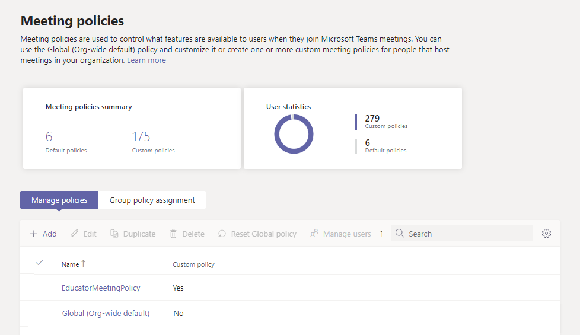

# <a name="assign-policies-to-large-sets-of-users-in-your-school"></a>Attribuer des stratégies à un grand nombre d’utilisateurs dans votre établissement scolaire

[!INCLUDE [policy-wizard-edu](includes/policy-wizard-edu.md)]

> [!NOTE]
> Pour en savoir plus sur l’attribution de stratégies dans Microsoft Teams, voir Attribuer des stratégies à [vos utilisateurs dans Teams](policy-assignment-overview.md).

## <a name="overview"></a>Présentation

Devez-vous donner à vos étudiants et enseignants accès aux différentes fonctionnalités de Microsoft Teams ? Vous pouvez rapidement identifier les utilisateurs de votre organisation par type de licence, puis leur affecter la stratégie appropriée. Ce didacticiel vous montre comment affecter une stratégie de réunion à un grand nombre d’utilisateurs de votre établissement scolaire. Vous pouvez attribuer des stratégies à l’aide du Microsoft Teams d’administration et de PowerShell. Nous allons vous montrer les deux façons de faire.

Vous pouvez affecter une stratégie de réunion à un groupe de sécurité dont les utilisateurs sont membres ou directement à l’échelle des utilisateurs via une affectation de stratégie de lot. Vous apprendrez comment :

- **Utilisez [l’affectation de stratégies à des groupes](#assign-a-policy-to-a-group) pour affecter une stratégie de réunion à un groupe de sécurité (recommandé).** Cette méthode vous permet d’affecter une stratégie en fonction de l’appartenance aux groupes. Vous pouvez affecter une stratégie à un groupe de sécurité ou une liste de distribution. À mesure que les membres sont ajoutés au groupe ou supprimés, leurs affectations de stratégie héritées sont mises à jour en conséquence. Nous vous recommandons d’utiliser cette méthode, car elle réduit le temps de gestion des stratégies pour les nouveaux utilisateurs ou lorsque les rôles des utilisateurs changent. Cette méthode est plus efficace pour les groupes de 50 000 utilisateurs au plus, mais fonctionne également avec des groupes plus importants.

- **Utilisez [l’affectation d’une stratégie de](assign-policies-users-and-groups.md#assign-a-policy-to-a-batch-of-users) lot pour affecter une stratégie de réunion directement aux utilisateurs en bloc**. Vous pouvez affecter une stratégie pour jusqu’à 5 000 utilisateurs à la fois. Si vous avez plus de 5 000 utilisateurs, vous pouvez envoyer plusieurs lots. Avec cette méthode, lorsque vous avez de nouveaux utilisateurs, vous devez ré-exécuter l’affectation de lot pour affecter la stratégie à ces nouveaux utilisateurs.

N’oubliez pas que, Teams, les utilisateurs obtiennent automatiquement la stratégie globale (à l’échelle de l’organisation par défaut) pour un type de stratégie Teams sauf si vous créez et attribuez une stratégie personnalisée. Étant donné que la population d’étudiants est souvent le plus grand groupe d’utilisateurs et reçoit souvent les paramètres les plus restrictifs, nous vous recommandons de suivre les recommandations suivantes :

- Créez une stratégie personnalisée qui permet d’avoir des fonctionnalités essentielles telles que la conversation privée et la planification de réunions, et d’affecter la stratégie à votre personnel et aux enseignants.
- Attribuez la stratégie personnalisée à votre personnel et aux enseignants.
- Modifiez et appliquez la stratégie globale (à l’échelle de l’organisation par défaut) pour limiter les fonctionnalités pour les étudiants.

N’oubliez pas que la stratégie globale s’appliquera à tous les utilisateurs de votre établissement scolaire jusqu’à ce que vous créez une stratégie personnalisée et l’affectiez à votre personnel et aux enseignants.

Dans ce didacticiel, les étudiants auront accès à la stratégie de réunion globale et nous attribuerons une stratégie de réunion personnalisée nommée EducatorMeetingPolicy au personnel et aux enseignants. Nous partons du principe que vous avez modifié la stratégie globale pour personnaliser les paramètres de réunion [](policy-packages-edu.md) pour les étudiants et que vous avez créé une stratégie personnalisée qui définit l’expérience de réunion pour le personnel et les enseignants.



## <a name="assign-a-policy-to-a-group"></a>Affecter une stratégie à un groupe

Suivez ces étapes pour créer un groupe de sécurité pour votre personnel et vos enseignants, puis affectez une stratégie de réunion personnalisée nommée EducatorMeetingPolicy à ce groupe de sécurité.

### <a name="before-you-get-started"></a>Avant de commencer

> [!IMPORTANT]
> Lorsque vous attribuez une stratégie à un groupe, l’affectation de stratégie est propagée aux membres du groupe selon les règles de priorité. Par exemple, si un utilisateur est directement affecté à une stratégie (individuellement ou par le biais d’une affectation de lots), cette stratégie est prioritaire sur une stratégie héritée d’un groupe. Cela signifie également que si un utilisateur a une stratégie de réunion qui lui a été attribuée directement, vous devez supprimer cette stratégie de réunion de l’utilisateur pour qu’il puisse hériter d’une stratégie de réunion d’un groupe de sécurité.

Avant de commencer, il est important de comprendre les règles [](policy-assignment-overview.md#which-policy-takes-precedence) de priorité et le [classement par affectation de groupe](assign-policies-users-and-groups.md#group-assignment-ranking). **Veillez à lire et à comprendre les concepts de ce que vous devez savoir sur l’affectation de stratégie [à des groupes](assign-policies-users-and-groups.md#what-you-need-to-know-about-policy-assignment-to-groups)**.

Vous devez effectuer toutes ces étapes pour que votre personnel et vos enseignants héritent d’une stratégie de réunion d’un groupe de sécurité.

1. [Créer des groupes de sécurité](#create-security-groups).
2. [Affecter une stratégie à un groupe de sécurité](#assign-a-policy-to-a-security-group).
3. [Supprimez une stratégie qui a été attribuée directement aux utilisateurs](#remove-a-policy-that-was-directly-assigned-to-users).

### <a name="create-security-groups"></a>Créer des groupes de sécurité

Tout d’abord, créez un groupe de sécurité pour votre personnel et vos enseignants.

Avec [Synchronisation des données scolaires](/SchoolDataSync/) (SDS), vous pouvez facilement créer des groupes de sécurité pour les enseignants et [les](/SchoolDataSync/edu-security-groups) étudiants de votre établissement scolaire. Nous vous recommandons d’utiliser SDS pour créer les groupes de sécurité dont vous avez besoin pour gérer les stratégies pour votre établissement scolaire.

Si vous ne pouvez pas déployer SDS au sein de votre environnement, utilisez ce [script PowerShell](scripts/powershell-script-security-groups-edu.md) pour créer deux groupes de sécurité, un pour tous les membres du personnel et les enseignants à qui une licence pour les enseignants est attribuée et l’autre pour tous les étudiants titulaires d’une licence Étudiant. Vous devrez exécuter régulièrement ce script pour maintenir les groupes à jour.

### <a name="assign-a-policy-to-a-security-group"></a>Affecter une stratégie à un groupe de sécurité

#### <a name="using-the-microsoft-teams-admin-center"></a>Utiliser le centre d’administration Microsoft Teams

> [!NOTE]
> Pour l’instant, l’affectation de stratégies à des groupes à l’aide du Centre d’administration Microsoft Teams est disponible uniquement pour la stratégie d’appel Teams, la stratégie de parcage d’appel Teams, la stratégie Teams, la stratégie d’événements en direct Teams, la stratégie de réunion Teams et la stratégie de messagerie Teams. Pour d’autres types de stratégie, utilisez PowerShell.

1. Dans le volet de navigation gauche du centre d’administration Microsoft Teams, accédez aux **Réunions** > **Stratégies de réunion**.
2. Sélectionnez **l’onglet Affectation de stratégie de** groupe.
3. **Sélectionnez Ajouter un** groupe, puis dans le volet **Affecter** une stratégie à un groupe, faites les tâches suivantes :

    
    1. Dans la **zone Sélectionner un groupe** , recherchez et ajoutez le groupe de sécurité qui contient votre personnel et vos enseignants.
    2. Dans la **zone Sélectionner le rang** , entrez **1**.
    3. Dans la **zone Sélectionner une stratégie** , **sélectionnez EducatorMeetingPolicy**.
    4. **Sélectionnez Appliquer**.

Pour supprimer une affectation de stratégie de groupe,  dans l’onglet Affectation de stratégie de groupe de la page stratégie, sélectionnez l’affectation de groupe, puis sélectionnez **Supprimer**.

Pour modifier le classement d’une affectation de groupe, vous devez d’abord supprimer l’affectation de stratégie de groupe. Suivez ensuite les étapes ci-dessus pour affecter la stratégie à un groupe.

#### <a name="using-powershell"></a>Utiliser PowerShell

> [!NOTE]
> Actuellement, l’affectation de stratégies à des groupes à l’aide de PowerShell n’est pas disponible pour tous Teams types de stratégies. Pour [obtenir la liste des types de stratégies pris en charge, voir New-CsGroupPolicyAssignment](/powershell/module/teams/new-csgrouppolicyassignment) .

##### <a name="install-and-connect-to-the-microsoft-teams-powershell-module"></a>Installer et se connecter au module PowerShell Microsoft Teams’équipe

Exécutez ce qui suit pour installer [Teams module PowerShell](https://www.powershellgallery.com/packages/MicrosoftTeams) (s’il n’est pas déjà installé). Veillez à installer la version 1.0.5 ou ultérieure.

```powershell
Install-Module -Name MicrosoftTeams
```

Exécutez ce qui suit pour vous connecter Teams et démarrer une session.

```powershell
Connect-MicrosoftTeams
```

Lorsque vous y êtes invité, connectez-vous à l’aide de vos informations d’identification d’administrateur.

##### <a name="assign-a-policy-to-a-group"></a>Affecter une stratégie à un groupe

Exécutez la stratégie suivante pour attribuer la stratégie de réunion educatorMeetingPolicy au groupe de sécurité qui contient votre personnel et vos enseignants et définissez le classement des devoirs sur 1. Vous pouvez spécifier un groupe de sécurité à l’aide de l’objet, de l’adresse SIP (Session Initiation Protocol) ou de l’adresse de messagerie. Dans cet exemple, nous utilisons une adresse de messagerie (staff-faculty@contoso.com).

```powershell
New-CsGroupPolicyAssignment -GroupId staff-faculty@contoso.com -PolicyType TeamsMeetingPolicy -PolicyName "EducatorMeetingPolicy" -Rank 1
```

### <a name="remove-a-policy-that-was-directly-assigned-to-users"></a>Supprimer une stratégie qui a été attribuée directement aux utilisateurs

N’oubliez pas que si un utilisateur a été directement affecté à une stratégie (individuellement ou par le biais d’une affectation de lots), cette stratégie est prioritaire. Cela signifie que si un utilisateur a une stratégie de réunion qui lui a été attribuée directement, vous devez supprimer cette stratégie de réunion de l’utilisateur pour qu’il puisse hériter d’une stratégie de réunion d’un groupe de sécurité.

Pour en savoir plus, [consultez ce que vous devez savoir sur l’affectation de stratégies à des groupes](assign-policies-users-and-groups.md#what-you-need-to-know-about-policy-assignment-to-groups).

Suivez ces étapes pour supprimer la stratégie de réunion qui a été directement attribuée à votre personnel et aux enseignants.

#### <a name="install-and-connect-to-the-microsoft-teams-powershell-module"></a>Installer et se connecter au module PowerShell Microsoft Teams’équipe

Exécutez ce qui suit pour installer [Teams module PowerShell](https://www.powershellgallery.com/packages/MicrosoftTeams) (s’il n’est pas déjà installé). Veillez à installer la version 1.0.5 ou ultérieure.

```powershell
Install-Module -Name MicrosoftTeams
```

Exécutez ce qui suit pour vous connecter Teams et démarrer une session.

```powershell
Connect-MicrosoftTeams
```

Lorsque vous y êtes invité, connectez-vous à l’aide des mêmes informations d’identification d’administrateur que vous avez utilisées pour vous connecter à Azure AD.

#### <a name="unassign-a-policy-that-was-directly-assigned-to-users"></a>Désaffecter une stratégie qui a été directement attribuée à des utilisateurs

Exécutez ce qui suit pour supprimer une stratégie de réunion pour les utilisateurs qui ont directement affecté cette stratégie. Vous pouvez spécifier les utilisateurs par adresse e-mail ou ID d’objet.

Dans cet exemple, la stratégie de réunion est supprimée des utilisateurs spécifiés par leur adresse e-mail.

```powershell
$users_ids = @("reda@contoso.com", "nikica@contoso.com", "jamie@contoso.com")
New-CsBatchPolicyAssignmentOperation -PolicyType TeamsMeetingPolicy -PolicyName $null -Identity $users_ids -OperationName "Unassign meeting policy"
```

Dans cet exemple, la stratégie de réunion est supprimée de la liste des utilisateurs dans un fichier texte nommé user_ids.txt.

```powershell
$user_ids = Get-Content .\users_ids.txt
New-CsBatchPolicyAssignmentOperation -PolicyType TeamsMeetingPolicy -PolicyName $null -Identity $users_ids -OperationName "Unassign meeting policy"
```

##### <a name="get-policy-assignments-for-a-group"></a>Obtenir les affectations de stratégie pour un groupe

Exécutez ce qui suit pour voir toutes les stratégies affectées à un groupe de sécurité spécifique. Notez que les groupes sont toujours répertoriés par leur ID de groupe, même si leur adresse SIP ou adresse de messagerie a été utilisée pour affecter la stratégie.

```powershell
Get-CsGroupPolicyAssignment -GroupId staff-faculty@contoso.com

```

##### <a name="get-the-policies-assigned-to-a-user"></a>Obtenir les stratégies attribuées à un utilisateur

Exécutez ce qui suit pour voir toutes les stratégies affectées à un utilisateur spécifique. L’exemple suivant vous montre comment obtenir les stratégies affectées à reda@contoso.com.

```powershell
Get-CsUserPolicyAssignment -Identity reda@contoso.com
```

## <a name="assign-a-policy-to-a-batch-of-users"></a>Affecter une stratégie à un lot d’utilisateurs

Suivez ces étapes pour affecter une stratégie de réunion personnalisée nommée EducatorMeetingPolicy directement à votre personnel et aux enseignants en bloc.

### <a name="using-powershell"></a>Utiliser PowerShell

#### <a name="connect-to-the-azure-ad-powershell-for-graph-module-and-the-teams-powershell-module"></a>Connecter vers le module Azure AD PowerShell Graph’équipe et Teams PowerShell

Avant d’effectuer les étapes de cet article, vous devez installer et vous connecter au module Azure AD PowerShell pour Graph (afin d’identifier les utilisateurs selon les licences attribuées) et au module Microsoft Teams PowerShell (pour affecter les stratégies à ces utilisateurs).

##### <a name="install-and-connect-to-the-azure-ad-powershell-for-graph-module"></a>Installer et se connecter au module Azure AD PowerShell Graph’installation

Ouvrez une invite de commandes avec élévation de Windows PowerShell (exécutez Windows PowerShell en tant qu’administrateur), puis exécutez l’invite de commandes suivante pour installer le module PowerShell Azure Active Directory powershell Graph’équipe.

```powershell
Install-Module -Name AzureAD
```

Exécutez ce qui suit pour vous connecter à Azure AD.

```powershell
Connect-AzureAD
```

Lorsque vous y êtes invité, connectez-vous à l’aide de vos informations d’identification d’administrateur.

Pour plus d’informations, [voir Connecter le module powershell Azure Active Directory PowerShell Graph’équipe](/office365/enterprise/powershell/connect-to-office-365-powershell#connect-with-the-azure-active-directory-powershell-for-graph-module).

##### <a name="install-and-connect-to-the-microsoft-teams-powershell-module"></a>Installer et se connecter au module PowerShell Microsoft Teams’équipe

Exécutez ce qui suit pour installer [Teams module PowerShell](https://www.powershellgallery.com/packages/MicrosoftTeams) (s’il n’est pas déjà installé). Veillez à installer la version 1.0.5 ou ultérieure.

```powershell
Install-Module -Name MicrosoftTeams
```

Exécutez ce qui suit pour vous connecter Teams et démarrer une session.

```powershell
Connect-MicrosoftTeams
```

Lorsque vous y êtes invité, connectez-vous à l’aide des mêmes informations d’identification d’administrateur que vous avez utilisées pour vous connecter à Azure AD.

#### <a name="identify-your-users"></a>Identifier vos utilisateurs

Tout d’abord, exécutez ce qui suit pour identifier votre personnel et vos enseignants par type de licence. Cela vous indique les S SKUS en cours d’utilisation dans votre organisation. Vous pouvez ensuite identifier le personnel et les enseignants à qui une référence SKU est attribuée.

```powershell
Get-AzureAdSubscribedSku | Select-Object -Property SkuPartNumber,SkuId
```

Ce qui renvoie :

```
SkuPartNumber      SkuId
-------------      -----
M365EDU_A5_FACULTY e97c048c-37a4-45fb-ab50-922fbf07a370
M365EDU_A5_STUDENT 46c119d4-0379-4a9d-85e4-97c66d3f909e
```

Dans cet exemple, la sortie indique que la licence SKUId pour les enseignants est « e97c048c-37a4-45fb-ab50-922fbf07a370 ».

> [!NOTE]
> Pour consulter la liste des références SKU pour l’éducation et références de référence SKU Pour l’éducation, consultez la [référence de la référence SKU Éducation](sku-reference-edu.md).

Ensuite, nous  exécuterons l’une des étapes suivantes pour identifier les utilisateurs qui ont cette licence et les collecter tous ensemble.

```powershell
$faculty = Get-AzureADUser -All $true | Where-Object {($_.assignedLicenses).SkuId -contains "e97c048c-37a4-45fb-ab50-922fbf07a370"}
```

#### <a name="assign-a-policy-in-bulk"></a>Affecter une stratégie en bloc

À présent, nous affectons les stratégies appropriées aux utilisateurs en bloc. Le nombre maximal d’utilisateurs pour lesquels vous pouvez affecter ou mettre à jour des stratégies est de 5 000 utilisateurs à la fois. Par exemple, si vous avez plus de 5 000 enseignants et membres du personnel, vous devez envoyer plusieurs lots.

Exécutez ce qui suit pour attribuer une stratégie de réunion personnalisée nommée EducatorMeetingPolicy à votre personnel et enseignants.

```powershell
New-CsBatchPolicyAssignmentOperation -PolicyType TeamsMeetingPolicy -PolicyName EducatorMeetingPolicy -Identity $faculty.ObjectId
```

> [!NOTE]
> Pour affecter un autre type de stratégie en bloc, tel que TeamsMesspolicy, ```PolicyType``` ```PolicyName``` vous devez modifier la stratégie que vous attribuez et le nom de la stratégie.

#### <a name="get-the-status-of-a-bulk-assignment"></a>Obtenir l’état d’une affectation en bloc

Chaque affectation en bloc renvoie un ID d’opération, que vous pouvez utiliser pour suivre l’avancement des affectations de stratégie ou identifier les échecs qui peuvent se produire. Par exemple, exécutez ce qui suit :

```powershell
Get-CsBatchPolicyAssignmentOperation -OperationId 3964004e-caa8-4eb4-b0d2-7dd2c8173c8c | fl
```

Pour afficher le statut d’affectation de chaque utilisateur dans l’opération de lot, exécutez ce qui suit. Les détails de chaque utilisateur sont dans la ```UserState``` propriété.

```powershell
Get-CsBatchPolicyAssignmentOperation -OperationId 3964004e-caa8-4eb4-b0d2-7dd2c8173c8c | Select -ExpandProperty UserState
```

#### <a name="assign-a-policy-in-bulk-if-you-have-more-than-5000-users"></a>Affecter une stratégie en bloc si vous avez plus de 5 000 utilisateurs

Tout d’abord, exécutez ce qui suit pour voir le nombre de membres du personnel et d’enseignants dont vous avez :

```powershell
$faculty.count
```

Au lieu de fournir la liste complète des ID utilisateur, exécutez la liste suivante pour spécifier les 5 000 premiers, puis les 5 000 suivants, etc.

```powershell
New-CsBatchPolicyAssignmentOperation -PolicyType TeamsMeetingPolicy -PolicyName EducatorMeetingPolicy -Identity $faculty[0..19999].ObjectId
```

Vous pouvez modifier la plage d’ID utilisateur jusqu’à atteindre la liste complète des utilisateurs. Par exemple, entrez pour ```$faculty[0..4999``` le premier lot, utilisez-le ```$faculty[5000..9999``` pour le deuxième lot, ```$faculty[10000..14999``` entrez pour le troisième lot, etc.

#### <a name="get-the-policies-assigned-to-a-user"></a>Obtenir les stratégies attribuées à un utilisateur

Exécutez ce qui suit pour voir toutes les stratégies affectées à un utilisateur spécifique. L’exemple suivant vous montre comment obtenir les stratégies affectées à hannah@contoso.com.

```powershell
Get-CsUserPolicyAssignment -Identity hannah@contoso.com
```

## <a name="faq"></a>FAQ

**Je n’ai pas l’air familiarisé avec PowerShell Teams. Où puis-je obtenir plus d’informations ?**

Pour une vue d’ensemble de l’utilisation de PowerShell pour gérer Teams, voir [Teams vue d’ensemble de PowerShell](teams-powershell-overview.md). Pour plus d’informations sur les cmdlets utilisées dans cet article, voir :

- [New-CsGroupPolicyAssignment](/powershell/module/teams/new-csgrouppolicyassignment)
- [Get-CsGroupPolicyAssignment](/powershell/module/teams/get-csgrouppolicyassignment)
- [New-CsBatchPolicyAssignmentOperation](/powershell/module/teams/new-csbatchpolicyassignmentoperation)
- [Get-CsBatchPolicyAssignmentOperation](/powershell/module/teams/get-csbatchpolicyassignmentoperation)
- [Get-CsUserPolicyAssignment](/powershell/module/teams/get-csuserpolicyassignment)

## <a name="related-topics"></a>Voir aussi

- [Attribuer des stratégies à vos utilisateurs](policy-assignment-overview.md)
- [Stratégies et packages de stratégies Teams pour l’éducation](policy-packages-edu.md)
- [Gérer les stratégies de réunion dans Teams](meeting-policies-overview.md)