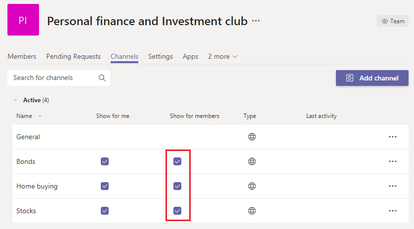

# Gérer les grandes équipes dans Microsoft Teams - Meilleures pratiques

Microsoft Teams est également efficace pour faciliter les communications entre de petits groupes de dizaines de membres et de grands groupes de milliers de membres. Passer en [revue les limites et spécifications des Teams](limits-specifications-teams.md) pour les mises à jour en taille des équipes. L’augmentation de la taille des équipes entraîne des défis opérationnels et une gestion unique. Cet article décrit les meilleures pratiques pour la création et la gestion de grandes équipes composées de milliers de membres.

## Valeur des grandes équipes

Les grandes équipes sont très utiles pour activer les scénarios de collaboration suivants :

- **Collaboration** à l’échelle d’un département : si votre organisation possède plusieurs services tels que Finances, Opérations, R&D, etc., vous pouvez créer une équipe unique qui inclut tous les membres d’un service spécifique. Désormais, toutes les communications pertinentes pour un service peuvent être partagées dans cette équipe, ce qui facilite la communication et l’implication instantanées des membres.

- **Collaboration dans les groupes de ressources des** employés : Les organisations ont souvent de grands groupes de personnes ayant des intérêts communs appartenant à un service ou un groupe de travail différent. Par exemple, il peut s’agit d’un groupe de personnes qui partagent une passion pour les finances personnelles et l’investissement. Il est souvent difficile de se connecter dans une grande organisation. Pour développer des communautés pour de tels groupes, les administrateurs de client peuvent créer une grande équipe qui sert de groupe de ressources public à l’échelle de l’entreprise, que tout le monde peut rejoindre et tirer parti. Ces communautés finiront par collecter des informations dont les membres, nouveaux et existants, peuvent bénéficier.

- **Collaboration entre membres internes** et externes : les produits populaires développent souvent une communauté de premiers utilisateurs qui sont impatients d’essayer de nouvelles sorties de produits et de faire part de leurs commentaires. Les premiers utilisateurs développent une relation avec les groupes de produits pour aider à façonner le produit. Dans de tels scénarios, les administrateurs client peuvent configurer une grande équipe qui inclut à la fois des groupes de produits internes et des experts en évaluation de produits externes afin de faciliter un processus de développement de produit enrichi. Ces équipes peuvent également fournir un support client à un groupe de clients sélectionné.

## Créer des équipes à partir de groupes existants

Utilisez les groupes de contacts, les groupes de sécurité ou Office groupes de contacts pour démarrer votre équipe. Vous pouvez importer un groupe pour créer une équipe ou créer une équipe à partir d’Office groupe.

**Importer un** groupe pour faire équipe : lorsque vous importez un groupe de 3 500 membres au total dans Teams, Teams calcule automatiquement le nombre total de membres du groupe. Il s’agit d’une importation unique et les modifications apportées ultérieurement au groupe ne seront pas automatiquement mises à jour dans Teams.

**Créer une équipe** à partir d’un grand groupe Microsoft 365 : Lorsque vous créez une équipe à partir d’un grand groupe Microsoft 365, les membres font automatiquement partie du groupe Microsoft 365 **et** de l’équipe. À l’avenir, à mesure que les membres de l’équipe rejoignent ou quittent Microsoft 365 groupe, ils sont ajoutés ou supprimés automatiquement de l’équipe.

## Importer/exporter/supprimer des membres en bloc dans une équipe

Le portail Azure permet aux utilisateurs d’importer/exporter en bloc et de supprimer des membres d’Microsoft 365 groupe. Pour plus d’informations, voir [Importer en bloc des membres d’un groupe.](/azure/active-directory/enterprise-users/groups-bulk-import-members#to-bulk-import-group-members)

Chaque équipe étant backed by a Microsoft 365 Group, vous pouvez utiliser le portail Azure pour effectuer ces opérations dans le groupe correspondant à l’équipe. Les opérations sur les membres seront reflétées dans l’équipe dans les 24 heures.

## Créez des canaux pour orienter les discussions

Vous pouvez affiner les discussions de groupe en créant des canaux concentrés. Consultez [les meilleures pratiques pour organiser les équipes.](best-practices-organizing.md)

## Restreindre la création de canaux

Si un membre de l’équipe est autorisé à créer des canaux, cette équipe peut avoir la surdessage du canal. Les propriétaires d’équipe doivent désactiver la création, la mise à jour, la suppression et la restauration des canaux pour les membres Paramètres > **des membres.** Consultez [la vue d’ensemble des équipes et des canaux.](teams-channels-overview.md)

## Ajouter des canaux favoris

Pour accélérer l’implication des utilisateurs et la découverte de contenu, vous pouvez sélectionner les canaux favoris qui sont disponibles par défaut pour l’utilisateur. Dans le **volet Canaux** du Centre d’administration, vérifiez les canaux sous la colonne Afficher **pour les** membres.

 Pour [plus d’informations, voir](get-started-with-teams-create-your-first-teams-and-channels.md) Créer vos premières équipes et canaux.

## Régule les applications et les bots dans les grandes équipes

Pour éviter l’ajout d’applications ou de bots gênants, les propriétaires d’équipe peuvent désactiver, ajouter, supprimer et télécharger des applications et des connecteurs pour les membres de l’équipe. Dans le Centre d’administration **Paramètres > autorisations** Membres, décochez les trois options qui permettent aux membres d’ajouter des applications ou des connecteurs.

Voir [Applications, bots, & connecteurs.](deploy-apps-microsoft-teams-landing-page.md)

## Réguler les mentions d’équipe et de canal

Les mentions d’équipe et de canal peuvent être utilisées pour attirer l’attention de l’ensemble de l’équipe sur certaines publications de canal. Une fois qu’une mention est utilisée dans un billet, une notification est envoyée à des milliers de membres de l’équipe. Si les notifications sont trop fréquentes, les membres de l’équipe peuvent être surchargés et se plaignent peut-être des propriétaires d’équipe. Pour empêcher les mentions d’équipe ou de canal, dés désactiver les mentions d’équipe et de canal pour les membres en décochant les cases Paramètres > @mentions **volet** équipes.

## Envisagez de configurer la modération au sein de vos canaux

Les propriétaires d’équipe peuvent activer la modération dans un canal afin de contrôler qui peut lancer de nouvelles publications et répondre aux publications de ce canal. Lorsque vous configurez la modération, vous pouvez choisir un ou plusieurs membres de l’équipe à utiliser en tant que modérateurs. Les propriétaires d’équipe sont des modérateurs par défaut. Pour plus d’informations, voir [Configurer et gérer la modération de canal.](manage-channel-moderation-in-teams.md)

## Rubriques connexes

- [Meilleures pratiques pour l’organisation des Teams](best-practices-organizing.md)
- [Créer une équipe à l’échelle de l’organisation](create-an-org-wide-team.md)