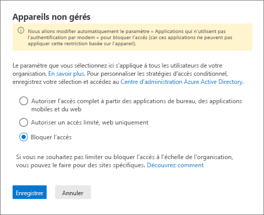
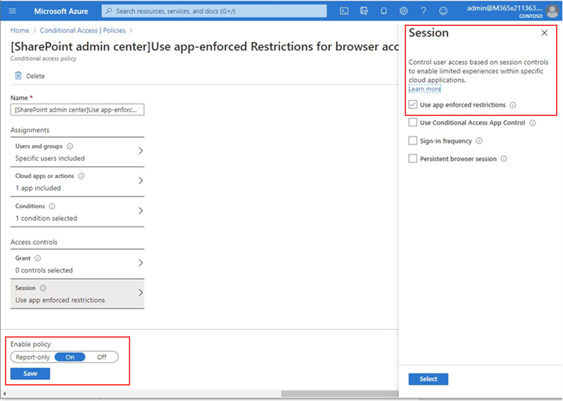

# Bloquer l’accès à SharePoint pour des utilisateurs spécifiquesBlock access to SharePoint for specific users

L’application d’une stratégie d’accès conditionnel (CA) sur SharePoint dans Microsoft 365 est également appliquée aux équipes.Applying any Conditional Access (CA) policy on SharePoint in Microsoft 365 is also applied to Teams. Toutefois, certaines organisations veulent bloquer l’accès aux fichiers SharePoint (Télécharger, télécharger, afficher, modifier, créer) et permettre à leurs employés d’utiliser les clients de bureau, mobiles et Web teams sur des appareils non gérés.However, some organizations want to block access to SharePoint files (upload, download, view, edit, create) yet allow their employees to use Teams desktop, mobile, and web clients on unmanaged devices. Dans les règles de stratégie d’autorité de certification, le blocage de SharePoint entraînerait le blocage des équipes.Under the CA policy rules, blocking Sharepoint would lead to blocking Teams as well. Cet article explique comment vous pouvez contourner cette limitation et permettre à vos employés de continuer à utiliser teams tout en bloquant complètement l’accès aux fichiers stockés dans SharePoint.This article explains how you can work around this limitation and allow your employees to continue using Teams while completely blocking access to files stored in SharePoint.

> [!Note]
> Bloquer ou limiter l’accès sur des appareils non gérés repose sur les stratégies d’accès conditionnel d’Azure AD.Blocking or limiting access on unmanaged devices relies on Azure AD conditional access policies. En savoir plus sur la gestion des [licences Azure ad](https://azure.microsoft.com/pricing/details/active-directory/).Learn about [Azure AD licensing](https://azure.microsoft.com/pricing/details/active-directory/). Pour obtenir une vue d’ensemble de l’accès conditionnel dans Azure AD, voir [accès conditionnel dans Azure Active Directory](https://docs.microsoft.com/azure/active-directory/conditional-access/overview).For an overview of conditional access in Azure AD, see [Conditional access in Azure Active Directory](https://docs.microsoft.com/azure/active-directory/conditional-access/overview). Pour plus d’informations sur les stratégies d’accès SharePoint Online recommandées, voir recommandations en matière [de stratégie pour la sécurisation des sites et fichiers SharePoint](https://docs.microsoft.com/microsoft-365/enterprise/sharepoint-file-access-policies).For info about recommended SharePoint Online access policies, see [Policy recommendations for securing SharePoint sites and files](https://docs.microsoft.com/microsoft-365/enterprise/sharepoint-file-access-policies). Si vous limitez l’accès à des appareils non gérés, les utilisateurs sur les appareils gérés doivent utiliser l’une des [combinaisons de systèmes d’exploitation et navigateurs pris en charge](https://docs.microsoft.com/azure/active-directory/conditional-access/technical-reference#client-apps-condition), ou leur accès est également limité.If you limit access on unmanaged devices, users on managed devices must use one of the [supported OS and browser combinations](https://docs.microsoft.com/azure/active-directory/conditional-access/technical-reference#client-apps-condition), or they will also have limited access.

Vous pouvez bloquer ou limiter l’accès pour :You can block or limit access for:

- Utilisateurs de l’organisation ou seulement certains utilisateurs ou groupes de sécurité.Users in the organization or only some users or security groups.

- Tous les sites au sein de l’organisation ou seulement des sites.All sites in the organization or only some sites.

Lorsque l’accès est bloqué, un message d’erreur s’affiche.When access is blocked, users will see an error message. Bloquez l’accès pour renforcer la sécurité et protéger les données sécurisées.Blocking access helps provide security and protects secure data. Lorsque l’accès est bloqué, un message d’erreur s’affiche.When access is blocked, users will see an error message.

1. Ouvrez le centre d’administration SharePoint.Open the SharePoint Admin Center.

2. Développez stratégies d' **Policies**  >  **accès aux**stratégies.Expand **Policies** > **Access Policies**.

3. Dans la section **appareils non gérés** , sélectionnez **bloquer l’accès** et sélectionnez **Enregistrer**.In the **Unmanaged Devices** section,  select **Block Access** and select **Save**.

   

4. Ouvrez le portail [Azure Active Directory](https://portal.azure.com/#blade/Microsoft_AAD_IAM/ConditionalAccessBlade/Policies) et naviguez jusqu’à **stratégies d’accès conditionnel**.Open the [Azure Active Directory](https://portal.azure.com/#blade/Microsoft_AAD_IAM/ConditionalAccessBlade/Policies) portal and navigate to **Conditional Access Policies**.

    Vous verrez une nouvelle stratégie créée par SharePoint, semblable à cet exemple :You'll see a new policy has been created by SharePoint that's similar to this example:

    

5. Mettez à jour la stratégie pour cibler uniquement des utilisateurs ou un groupe spécifiques.Update the policy to target only specific users or a group.

    

  > [!Note]
> La définition de cette stratégie entraîne la réduction de votre accès au portail d’administration SharePoint.Setting this policy will cut your access to the SharePoint admin portal. Nous vous recommandons de configurer la stratégie d’exclusion et de sélectionner les administrateurs généraux et SharePoint.We recommended that you configure the exclusion policy and select the Global and SharePoint admins.

6. Vérifier que seul SharePoint est sélectionné comme application Cloud cibléeVerify that only SharePoint is selected as targeted Cloud App

    

7. Vous pouvez également mettre à jour des **conditions** pour inclure des clients de bureau.Update **Conditions** to include desktop clients, as well.

    

8. Vérifier que **l’option autoriser l’accès** est activéeMake sure that **Grant access** is enabled

    

9. Assurez-vous que l’option **utiliser les restrictions** appliquées aux applications est activée.Make sure **Use app enforced restrictions** is enabled.

10. Activez votre stratégie, puis sélectionnez **Enregistrer**.Enable your policy and select **Save**.

    

Pour tester votre stratégie, vous devez vous déconnecter de n’importe quel client, tel que l’application de bureau teams ou le client de synchronisation OneDrive entreprise, puis vous reconnecter pour voir la stratégie qui fonctionne.To test your policy, you need to sign out from any client such as the Teams desktop app or the OneDrive for Business sync client and sign in again to see the policy working. Si votre accès a été bloqué, un message s’affiche dans Microsoft Teams, qui indique que l’élément n’existe pas.If your access has been blocked, you'll see a message in Teams that states the item might not exist.

 

Dans SharePoint, vous recevez un message accès refusé.In Sharepoint, you'll receive an access denied message.

## Sujets associésRelated topics

[Contrôler l’accès pour les appareils non gérés dans SharePointControl access for unmanaged devices in SharePoint](https://docs.microsoft.com/sharepoint/control-access-from-unmanaged-devices)
