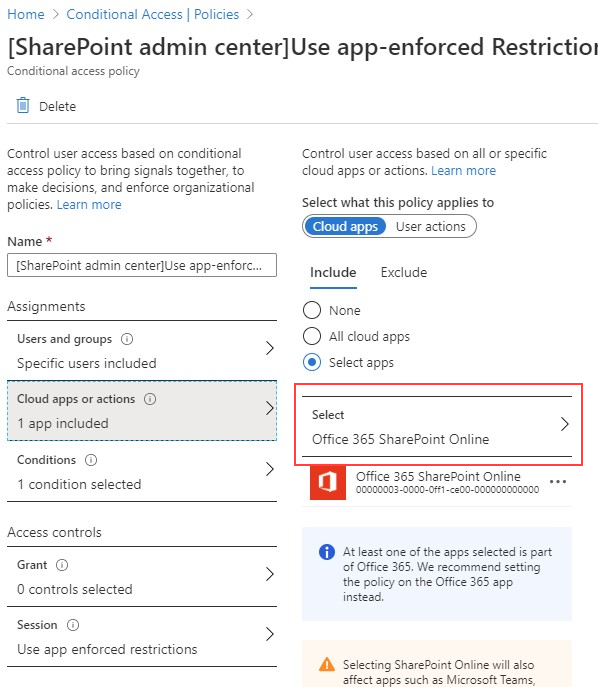

# Bloquer l’accès à SharePoint pour des utilisateurs spécifiquesBlock access to SharePoint for specific users

Toute stratégie d’accès conditionnel appliquée sur SharePoint dans Microsoft 365 est également appliquée à Teams.Applying any Conditional Access (CA) policy on SharePoint in Microsoft 365 is also applied to Teams. Toutefois, certaines organisations souhaitent bloquer l’accès aux fichiers SharePoint (chargement, téléchargement, affichage, modification et création), et permettre à leurs employés d’utiliser les clients Teams de bureau, mobiles et web sur les appareils non gérés.However, some organizations want to block access to SharePoint files (upload, download, view, edit, create) yet allow their employees to use Teams desktop, mobile, and web clients on unmanaged devices. Dans les règles de stratégie d’accès conditionnel, le blocage de SharePoint conduirait également au blocage de Teams.Under the CA policy rules, blocking Sharepoint would lead to blocking Teams as well. Cet article décrit la manière dont vous pouvez contourner cette limitation et permettre à vos employés de continuer à utiliser Teams tout en bloquant l’accès aux fichiers stockés dans SharePoint.This article explains how you can work around this limitation and allow your employees to continue using Teams while completely blocking access to files stored in SharePoint.

> [!Note]
> Le blocage ou la limitation de l’accès sur des appareils non gérés s’appuie sur les stratégies d’accès conditionnel Azure AD.Blocking or limiting access on unmanaged devices relies on Azure AD conditional access policies. En savoir plus sur la [gestion des licences Azure AD](https://azure.microsoft.com/pricing/details/active-directory/).Learn about [Azure AD licensing](https://azure.microsoft.com/pricing/details/active-directory/). Pour obtenir une vue d’ensemble de l’accès conditionnel dans Azure AD, voir [Accès conditionnel dans Azure Active Directory](https://docs.microsoft.com/azure/active-directory/conditional-access/overview).For an overview of conditional access in Azure AD, see [Conditional access in Azure Active Directory](https://docs.microsoft.com/azure/active-directory/conditional-access/overview). Pour plus d’informations sur les stratégies d’accès SharePoint Online recommandées, voir [Recommandations en matière de stratégie pour la sécurisation des sites et fichiers SharePoint](https://docs.microsoft.com/microsoft-365/enterprise/sharepoint-file-access-policies).For info about recommended SharePoint Online access policies, see [Policy recommendations for securing SharePoint sites and files](https://docs.microsoft.com/microsoft-365/enterprise/sharepoint-file-access-policies). Si vous limitez l’accès sur des appareils non gérés, les utilisateurs sur les appareils gérés doivent utiliser l’une des [combinaisons de systèmes d’exploitation et de navigateurs prises en charge](https://docs.microsoft.com/azure/active-directory/conditional-access/technical-reference#client-apps-condition). Dans le cas contraire, ils disposeront également d’un accès limité.If you limit access on unmanaged devices, users on managed devices must use one of the [supported OS and browser combinations](https://docs.microsoft.com/azure/active-directory/conditional-access/technical-reference#client-apps-condition), or they will also have limited access.

Vous pouvez bloquer ou limiter l’accès pour :You can block or limit access for:

- Les utilisateurs de l’organisation, ou certains utilisateurs ou groupes de sécurité uniquement.Users in the organization or only some users or security groups.

- Tous les sites de votre organisation, ou certains sites uniquement.All sites in the organization or only some sites.

Lorsque l’accès est bloqué, les utilisateurs voient un message d’erreur.When access is blocked, users will see an error message. Le blocage de l’accès renforce la sécurité et protège les données sécurisées.Blocking access helps provide security and protects secure data. Lorsque l’accès est bloqué, les utilisateurs voient un message d’erreur.When access is blocked, users will see an error message.

1. Ouvrez le Centre d’administration SharePoint.Open the SharePoint Admin Center.

2. Développez **Politiques** > **Stratégies d’accès**.Expand **Policies** > **Access Policies**.

3. Dans la section **Appareils non gérés**, sélectionnez **Bloquer l’accès**, puis **Enregistrer**.In the **Unmanaged Devices** section,  select **Block Access** and select **Save**.

   

4. Ouvrez le portail [Azure Active Directory](https://portal.azure.com/#blade/Microsoft_AAD_IAM/ConditionalAccessBlade/Policies) et accédez à **Stratégies d’accès conditionnel**.Open the [Azure Active Directory](https://portal.azure.com/#blade/Microsoft_AAD_IAM/ConditionalAccessBlade/Policies) portal and navigate to **Conditional Access Policies**.

    Une nouvelle stratégie semblable à celle-ci est créée par SharePoint :You'll see a new policy has been created by SharePoint that's similar to this example:

    

5. Mettez à jour la stratégie pour cibler uniquement des utilisateurs spécifiques ou un groupe.Update the policy to target only specific users or a group.

    

  > [!Note]
> La définition de cette stratégie permettra de réduire l’accès au portail d’administration SharePoint.Setting this policy will cut your access to the SharePoint admin portal. Nous vous recommandons de configurer la stratégie d’exclusion et de sélectionner les administrateurs globaux et SharePoint.We recommended that you configure the exclusion policy and select the Global and SharePoint admins.

6. Vérifiez que seul SharePoint est sélectionné en tant qu’application cloud cibléeVerify that only SharePoint is selected as targeted Cloud App

    

7. Mettez à jour les **conditions** afin d’inclure également les clients de bureau.Update **Conditions** to include desktop clients, as well.

    

8. Assurez-vous que l’option **Accorder l’accès** est activée.Make sure that **Grant access** is enabled

    

9. Assurez-vous que **Utiliser les restrictions appliquées par l’application** est activé.Make sure **Use app enforced restrictions** is enabled.

10. Activez votre stratégie et sélectionnez **Enregistrer**.Enable your policy and select **Save**.

    

Pour tester votre stratégie, vous devez vous déconnecter de n’importe quel client, par exemple, l’application de bureau Teams ou le client de synchronisation OneDrive Entreprise, puis vous reconnecter afin d’afficher la stratégie active.To test your policy, you need to sign out from any client such as the Teams desktop app or the OneDrive for Business sync client and sign in again to see the policy working. Si votre accès a été bloqué, un message indiquant qu’il n’est peut-être pas disponible s’affiche dans Teams.If your access has been blocked, you'll see a message in Teams that states the item might not exist.

 

Dans SharePoint, vous recevrez un message d’accès refusé.In Sharepoint, you'll receive an access denied message.

## Voir aussiRelated topics

[Contrôler l’accès des appareils non gérés dans SharePointControl access for unmanaged devices in SharePoint](https://docs.microsoft.com/sharepoint/control-access-from-unmanaged-devices)
