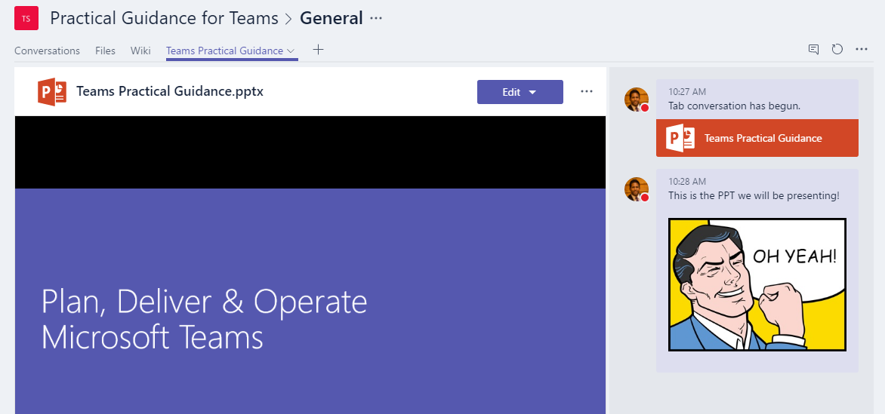

# Utiliser les onglets intégrés et personnalisés dans Microsoft Teams

Les onglets permettent aux membres d’une équipe d’accéder aux services et au contenu dans un espace dédié au sein d’un canal ou d’une conversation. Cela permet à l’équipe de travailler directement avec des outils et des données, et de discuter des outils et des données, dans le contexte du canal ou de la conversation.

Les propriétaires et membres d'équipe peuvent ajouter d'autres onglets à un canal, une conversation privée ou une conversation de groupe, pour faciliter l'intégration de leurs services cloud. Des onglets peuvent être ajoutés pour permettre aux utilisateurs d’accéder et de gérer facilement les données dont ils ont besoin ou avec qui ils interagissent le plus. Il peut s’agit d’un Power BI, d’un tableau de bord ou même d’un canal [vidéo Microsoft Stream](https://go.microsoft.com/fwlink/?linkid=855785) dans lequel vous publiez des vidéos de formation.

>[!Note]
> Le passage de Microsoft Stream à [OneDrive Entreprise et SharePoint pour les enregistrements de réunion](tmr-meeting-recording-change.md) est une approche à différentes étapes. Au lancement, vous aurez la possibilité de choisir cette expérience. En novembre vous devrez quitter cette option si vous souhaitez poursuivre avec Stream et, au début de 2021 nous exigerons de tous les clients l’utilisation de OneDrive Entreprise et SharePoint pour les nouveaux enregistrements de réunion.

## Travailler avec les onglets

- Avec chaque nouveau canal, deux onglets sont provisionés par défaut : Conversations et Fichiers.

    
- Pour chaque conversation privée, quatre onglets sont provisionés par défaut : Conversations, Fichiers, Organisation et Activité.

    

- Les propriétaires et les membres de l’équipe peuvent ajouter d’autres onglets   en haut du canal ou de la conversation.

- Excel fichiers PowerPoint, Word et PDF doivent être téléchargés dans l’onglet Fichiers pour pouvoir être convertis  en onglets. Vous pouvez convertir n’importe quel fichier téléchargé existant en onglet en un seul clic, comme illustré ci-dessous.

    

- Pour ajouter un site web, l’URL doit commencer par un **préfixe https** afin que les informations échangées restent sécurisées.

- Des instructions détaillées sont fournies lorsqu’un membre de l’équipe tente d’ajouter un onglet personnalisé à son canal ou sa conversation. Lorsqu’un onglet personnalisé est ajouté à un canal, une **conversation** par onglets est créée, qui permet aux membres de l’équipe d’avoir des discussions axées sur le contenu.

    

## Développer des onglets personnalisés

Outre les onglets intégrés, vous pouvez concevoir et développer vos propres onglets afin de les intégrer à Teams partage avec le reste de la communauté. Pour plus d’informations, consultez notre [documentation sur les développeurs](/microsoftteams/platform/tabs/what-are-tabs).

---
