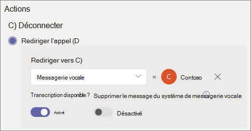

# Configurer un attendant automatique - Didacticiel pour les petites entreprisesSet up an auto attendant - small business tutorial

Les employés automatiques peuvent appeler votre organisation et parcourir un système de menus pour parler au service, à la file d’attente d’appels, à une personne ou à un opérateur.Auto attendants let people call your organization and navigate a menu system to speak to the right department, call queue, person, or an operator. Vous pouvez créer des attendants automatiques pour votre organisation avec le Centre d’administration Microsoft Teams.You can create auto attendants for your organization with the Microsoft Teams admin center.

#### Avant de commencerBefore you begin

Obtenez les numéros de service dont vous avez besoin pour les travailleurs automatiques que vous souhaitez rendre accessibles en composant un numéro direct depuis l’extérieur de votre organisation.Get the service numbers that you need for the auto attendants that you want to be accessible by direct dialing from outside your organization. Cela peut inclure [le transfert de numéros d’un autre fournisseur](../phone-number-calling-plans/transfer-phone-numbers-to-teams.md) ou la demande de nouveaux numéros de [service.](../getting-service-phone-numbers.md)This might include [transferring numbers from another provider](../phone-number-calling-plans/transfer-phone-numbers-to-teams.md) or [requesting new service numbers](../getting-service-phone-numbers.md).

Obtenir un [système téléphonique - Licence Utilisateur virtuel](../teams-add-on-licensing/virtual-user.md) pour chaque employé automatique que vous prévoyez de créer.Get a [Phone System - Virtual User license](../teams-add-on-licensing/virtual-user.md) for each auto attendant that you plan to create. Ces licences sont gratuites. Nous vous suggérons donc d’en obtenir quelques supplémentaires si vous décidez de modifier votre installation ultérieurement.These licenses are free, so we suggest getting a few extra in case you decide to make changes to your setup in the future.

Si vous souhaitez utiliser un itinéraire des appels  différent pour les jours fériés, créez les jours fériés que vous voulez utiliser avant de créer le attendant automatique.If you want to have your auto attendant route calls differently on holidays, then [create the holidays that you want to use](../set-up-holidays-in-teams.md) before you create the auto attendant.

#### Pour configurer votre attendant automatique, suivez les étapes ci-aprèsFollow these steps to set up your auto attendant

# [Étape 1   Numéro de téléphoneStep 1 Phone number](#tab/phone-number)

Chaque employé automatique que vous créez nécessite un compte de ressource.Each auto attendant that you create requires a resource account. Ce compte est similaire à un compte d’utilisateur, sauf qu’il est associé à un moyen de service automatique ou à une file d’attente d’appels au lieu d’une personne.This is similar to a user account, except the account is associated with an auto attendant or call queue instead of a person. Dans cette étape, nous allons créer le compte, lui attribuer une licence *Microsoft 365 Phone System - Utilisateur* virtuel, puis attribuer un numéro de service.In this step, we'll create the account, assign it a *Microsoft 365 Phone System - Virtual User* license, and then assign a service number.

### Créer un compte de ressourceCreate a resource account

Vous pouvez créer un compte de ressource dans le Centre d’administration Teams.You can create a resource account in the Teams admin center.

1. Dans le Centre d’administration Teams, développez **les paramètres** à l’échelle de l’organisation, puis cliquez **sur Comptes de ressources.**In the Teams admin center, expand **Org-wide settings**, and then click **Resource accounts**.

2. Cliquez sur **Ajouter**.Click **Add**.

3. Dans le **volet Ajouter un compte** de ressource, tapez Nom **d’affichage,** Nom d’utilisateur et sélectionnez Le attendant **automatique** pour le type de compte **de ressource** In the **Add resource account** pane, fill out **Display name**, **Username**, and choose **Auto attendant** for the **Resource account type**

    

4. Cliquez sur **Enregistrer**.Click **Save**.

Le nouveau compte apparaît dans la liste des comptes.The new account will appear in the list of accounts.

### Attribuer une licenceAssign a license

Vous devez attribuer une *licence Microsoft 365 Phone System - Utilisateur* virtuel au compte de ressource.You must assign a *Microsoft 365 Phone System - Virtual User* license to the resource account.

1. Dans le Centre d’administration Microsoft 365, cliquez sur le compte de ressource auquel vous voulez attribuer une licence.In the Microsoft 365 admin center, click the resource account to which you want to assign a license.

2. Sous **l’onglet Licences et** applications, sous **Licences,** sélectionnez **Microsoft 365 Phone System - Utilisateur virtuel.**On the **Licenses and Apps** tab, under **Licenses**, select **Microsoft 365 Phone System - Virtual User**.

3. Cliquez **sur Enregistrer les modifications.**Click **Save changes**.

    

### Affecter un numéro de serviceAssign a service number

Si vous avez besoin que ce moyen de service automatique soit accessible à l’aide d’un numéro de téléphone, affectez ce numéro au compte de ressource.If you need this auto attendant to be reachable by a phone number, then assign that number to the resource account.

1. Dans le Centre d’administration Teams, sur la **page** Comptes de ressources, sélectionnez le compte de ressource auquel vous voulez affecter un numéro de service, puis cliquez sur **Affecter/Désaffecter.**In the Teams admin center, on the **Resource accounts** page, select the resource account to which you want to assign a service number, and then click **Assign/unassign**.

2. Dans le **type de numéro de** téléphone, sélectionnez le type de numéro que vous voulez utiliser.In the **Phone number type** dropdown, choose the type of number that you want to use.

3. Dans la **zone Numéro de téléphone** affecté, recherchez le numéro à utiliser, puis cliquez sur **Ajouter.**In the **Assigned phone number** box, search for the number you want to use and click **Add**.

    

4. Cliquez sur **Enregistrer**.Click **Save**.

> [!div class="nextstepaction"]
> [Étape 2 : le attendant automatique - Informations générales sur >Step 2 - Auto attendant general info >](https://review.docs.microsoft.com/microsoftteams/business-voice/create-a-phone-system-auto-attendant-smb?branch=mikeplum-smb-voice&tabs=general-info#steps)

# [Étape 2 :   Attendant - Informations généralesStep 2 Attendant general info](#tab/general-info)

Pour configurer un attendant automatiqueTo set up an auto attendant

1. Dans le Centre d’administration Teams, **développez Voix,** cliquez sur **Auto attendants,** puis sur **Ajouter.**In the Teams admin center, expand **Voice**, click **Auto attendants**, and then click **Add**.

2. Tapez un nom pour le attendant automatique dans la zone en haut.Type a name for the auto attendant in the box at the top.

3. Si vous voulez désigner un opérateur, spécifiez la destination des appels vers cet opérateur.If you want to designate an operator, specify the destination for calls to the operator. Cette option est facultative (mais recommandée).This is optional (but recommended). Vous pouvez définir l’option **Opérateur** pour permettre aux appelants de sortir des menus et de parler à une personne désignée.You can set the **Operator** option to allow callers to break out of the menus and speak to a designated person.

4. Spécifiez le fuseau horaire de ce attendant automatique.Specify the time zone for this auto attendant. Le fuseau horaire est utilisé pour calculer les heures d’ouverture si vous créez un flux d’appels distinct pour les heures de travail en de suite.The time zone is used for calculating business hours if you create a separate call flow for after hours.

5. Spécifiez une langue pour ce attendant automatique.Specify a language for this auto attendant. Il s’agir de la langue qui sera utilisée pour les invites vocales générées par le système.This the language that will be used for system-generated voice prompts.

6. Choisissez si vous voulez activer les entrées vocales.Choose if you want to enable voice inputs. Lorsqu’elle est activée, le nom de chaque option de menu devient un mot clé de reconnaissance vocale.When enabled, the name of every menu option becomes a speech-recognition keyword. Par exemple, les appelants peuvent dire « Un » pour sélectionner l’option de menu mappée vers la touche 1, ou dire « Ventes » pour sélectionner l’option de menu appelée « Ventes ».For example, callers can say "One" to select the menu option mapped to key 1, or they can say "Sales" to select the menu option named "Sales."

    

7. Cliquez sur **Suivant**.Click **Next**.

> [!div class="nextstepaction"]
> [Étape 3 : flux d’appels >Step 3 - Call flow >](https://review.docs.microsoft.com/microsoftteams/business-voice/create-a-phone-system-auto-attendant-smb?branch=mikeplum-smb-voice&tabs=call-flow#steps)

# [Flux d’appels   d’étape 3Step 3 Call flow](#tab/call-flow)

Choisir vos options de flux d’appelsChoose your call flow options

1. Choisissez si vous souhaitez lire un message d’accueil lorsque le attendant automatique répond à un appel.Choose if you want to play a greeting when the auto attendant answers a call.

    Si vous **sélectionnez Lire un fichier audio,** vous pouvez utiliser le bouton Télécharger un fichier pour télécharger un message d’accueil enregistré en tant qu’audio dans .  WAV, . MP3 ou . Format WMA.If you select **Play an audio file** you can use the **Upload file** button to upload a recorded greeting message saved as audio in .WAV, .MP3, or .WMA format. L’enregistrement ne peut pas avoir une taille supérieure à 5 Mo.The recording can be no larger than 5 MB.

    Si vous sélectionnez Taper un **message** de salutation, le système lit le texte que vous tapez (jusqu’à 1 000 caractères) lorsque le attendant automatique répond à un appel.If you select **Type a greeting message** the system will read the text you the text that you type (up to 1000 characters) when the auto attendant answers a call.

    

2. Choisissez la façon dont vous voulez router l’appel.Choose how you want to route the call.

    Si vous sélectionnez **Déconnecter,** le attendant automatique raccrochera.If you select **Disconnect**, the auto attendant will hang up the call.

    Si vous sélectionnez **Rediriger l’appel,** vous pouvez choisir l’une des destinations de routage des appels.If you select **Redirect call**, you can choose one of the call routing destinations.

    Si vous sélectionnez **les options du menu** Lecture, vous pouvez choisir de lire un fichier **audio** ou de taper un **message** d’accueil, puis de choisir entre les options de menu et la recherche dans l’annuaire.If you select **Play menu options**, you can choose to **Play an audio file** or **Type in a greeting message** and then choose between menu options and directory search.

    

3. Si vous souhaitez que les appelants utilisent les touches de numérotation pour naviguer, sous Définir les options du **menu,** choisissez ce que vous voulez faire lorsque les appelants appuient sur une touche de numérotation.If you want callers to use dial keys to navigate, then under **Set menu options**, choose what you want to happen when callers press a dial key. (Si vous créez ce attendant automatique en tant qu’annuaire de l’entreprise, laissez les options de touches de numérotation vides.)(If you're creating this auto attendant as a company directory, leave the dial key options blank.)

    Vous pouvez définir n’importe quelle touche de numérotation sur les destinations suivantes :You can set any of the dial keys to the following destinations:

    - **Une personne de l’organisation,** une personne de votre organisation qui peut recevoir des appels vocux.**Person in the organization** - a person in your organization who is able to receive voice calls.
    - **Application vocale :** un autre attendant automatique ou une file d’attente d’appels.**Voice app** - another auto attendant or a call queue.
    - **Numéro de téléphone externe -** n’importe quel numéro de téléphone.**External phone number** - any phone number. Utilisez ce format : +[code pays][code de zone][numéro de téléphone]Use this format: +[country code][area code][phone number]
    - **Messagerie vocale** : boîte vocale associée à un groupe Microsoft 365 que vous spécifiez.**Voicemail** - the voice mailbox associated with a Microsoft 365 group that you specify.
    - **Opérateur** (opérateur défini pour le transport automatique).**Operator** - the operator defined for the auto attendant. La définition d’un opérateur est facultative.Defining an operator is optional. L’opérateur peut être défini comme n’importe quelle autre destination dans cette liste.The operator can be defined as any of the other destinations in this list.

    Nous vous recommandons de définir 0 touche sur l’opérateur.We recommend setting 0 key to the operator.

    Pour chaque option de menu, spécifiez les éléments suivants :For each menu option, specify the following:

    - **Touche de numérotation** (clé du clavier téléphonique pour accéder à cette option).**Dial key** - the key on the telephone keypad to access this option.

    - **Commande vocale** : définit la commande vocale qu’un appelant peut lui donner pour accéder à cette option, si les entrées vocales sont activées.**Voice command** - defines the voice command that a caller can give to access this option, if voice inputs are enabled. Il peut contenir plusieurs mots tels que « Service clientèle » ou « Activités et activités ».It can contain multiple words like "Customer Service" or "Operations and Grounds." 

    - **Rediriger** vers l’endroit où vous souhaitez que l’appel soit reçu lorsque les appelants choisissent cette option.**Redirect to** - where you want the call to go when callers choose this option. Si vous redirigez vers un service de service automatique ou une file d’attente d’appels, sélectionnez le compte de ressource qui lui est associé.If you are redirecting to an auto attendant or call queue, choose the resource account associated with it.

    

4. Si vous souhaitez utiliser ce attendant automatique comme annuaire de l’entreprise, sous Recherche dans l’annuaire, **sélectionnez Composer par nom.**If you want to use this auto attendant as a company directory, then under **Directory search**, select **Dial by name**. Lorsque vous activez cette option, les appelants peuvent dire le nom de l’utilisateur ou le taper sur le clavier du téléphone.When you enable this option, callers can say the user's name or type it on the telephone keypad. Tout utilisateur en ligne titulaire d’une licence Phone System est un utilisateur éligible et peut être trouvé avec la numérotation par nom.Any online user with a Phone System license is an eligible user and can be found with Dial by name. 

    (Vous pouvez choisir **Numérotation par extension,** toutefois l’extension doit être configurée dans Azure Active Directory.)(You can choose **Dial by extension**, however the extension must be configured in Azure Active Directory.)

5. Une fois que vous avez sélectionné une option **de recherche dans l’annuaire,** cliquez sur **Suivant.**Once you have selected a **Directory search** option, click **Next**.

> [!div class="nextstepaction"]
> [Étape 4 : flux d’appels en de suite après >Step 4 - After hours call flow >](https://review.docs.microsoft.com/microsoftteams/business-voice/create-a-phone-system-auto-attendant-smb?branch=mikeplum-smb-voice&tabs=after-hours#steps)

# [Étape 4 Après   les heures de travailStep 4 After hours](#tab/after-hours)

Les heures d’ouverture peuvent être définies pour chaque attendant automatique.Business hours can be set for each auto attendant. Si ce n'est pas le cas, tous les jours et toutes les heures de la semaine seront considérés comme heures d'ouverture, car une planification 24/24 est définie par défaut.If business hours aren't set, all days and all hours in the day are considered business hours because a 24/7 schedule is set by default. Les heures d’ouverture peuvent être définies avec des pauses au cours de la journée et toutes les heures non définies comme heures d’ouverture sont considérées comme des heures d’ouverture en de suite.Business hours can be set with breaks in time during the day, and all of the hours that are not set as business hours are considered after-hours. Vous pouvez définir différentes options de traitement des appels entrants et des messages d’accueil pour les heures de travail en de suite.You can set different incoming call-handling options and greetings for after-hours.

Selon la configuration de vos files d’attente automatiques et de vos files d’attente, il se peut que vous devrez uniquement spécifier le routage des appels en de après-heures pour les travailleurs automatiques avec des numéros de téléphone directs.Depending on how you have configured your auto attendants and call queues, you may only need to specify after-hours call routing for auto attendants with direct phone numbers.

Si vous souhaitez un routage d’appel distinct pour les appelants en de suite, spécifiez vos heures d’ouverture pour chaque jour.If you want separate call routing for after-hours callers, then specify your business hours for each day. Cliquez **sur Ajouter un nouvel horaire** pour spécifier plusieurs ensembles d’heures pour un jour donné, par exemple, pour spécifier une pause déjeuner.Click **Add new time** to specify multiple sets of hours for a given day, for example, to specify a lunch break.

Une fois que vous avez spécifié vos heures d’ouverture, sélectionnez vos options de routage des appels pour les heures de fermeture.Once you have specified your business hours, then choose your call routing options for after hours. Les mêmes options sont disponibles que pour le routage des appels pendant les heures d’ouverture que vous avez spécifié à l’étape **3 (Flux d’appels).**The same options are available as for the business hours call routing that you specified in **Step 3 - Call flow**.

Cliquez **sur Suivant** lorsque vous avez terminé.Click **Next** when you're done.

> [!div class="nextstepaction"]
> [Étape 5 : flux d’appels pour les >Step 5 - Holiday call flow >](https://review.docs.microsoft.com/microsoftteams/business-voice/create-a-phone-system-auto-attendant-smb?branch=mikeplum-smb-voice&tabs=holidays#steps)

# [Étape 5   Jours fériésStep 5 Holidays](#tab/holidays)

Vous pouvez faire router les appels vers votre service de service automatique différemment les jours fériés et les autres jours.You can have calls to your auto attendant routed differently on holidays than on other days. (Si vous ne voulez pas avoir un flux d’appels différent pour les jours fériés, vous pouvez ignorer cette étape.)(If you don't want to have a different call flow for holidays, you can skip this step.)

Votre employé automatique peut avoir un flux d’appels pour chaque jour férié que vous avez installé.Your auto attendant can have a call flow for each holiday you've set up. Vous pouvez ajouter jusqu'à 20 congés planifiés pour chaque standard automatique.You can add up to 20 scheduled holidays to each auto attendant.

1. Dans la page Paramètres d’appel pour les fêtes, cliquez **sur Ajouter.**On the Holiday call settings page, click **Add**.

2. Tapez un nom pour ce paramètre de congés.Type a name for this holiday setting.

3. Dans la **dropdown** Jours fériés, choisissez les jours fériés que vous voulez utiliser.From the **Holiday** dropdown, choose the holiday that you want to use.

4. Choisissez le type de message d’accueil que vous voulez utiliser.Choose the type of greeting that you want to use.

    

5. Choisissez si vous voulez **déconnecter ou** **rediriger** l’appel.Choose if you want to **Disconnect** or **Redirect** the call.

6. Si vous choisissez de rediriger l’appel, choisissez sa destination de routage.If you chose to redirect, choose the call routing destination for the call.

    

7. Cliquez sur **Enregistrer**.Click **Save**.

Répétez la procédure si nécessaire pour chaque jour férié supplémentaire.Repeat the procedure as needed for each additional holiday.

Une fois que vous avez ajouté tous vos jours fériés, cliquez sur **Suivant.**When you've added all your holidays, click **Next**.

> [!div class="nextstepaction"]
> [Étape 6 : choisir les personnes qui font partir de l'>Step 6 - Choose who's in the directory >](https://review.docs.microsoft.com/microsoftteams/business-voice/create-a-phone-system-auto-attendant-smb?branch=mikeplum-smb-voice&tabs=dial-scope#steps)

# [Étape 6   Membres du répertoireStep 6 Directory members](#tab/dial-scope)

*L’étendue de* la numérotation définit les utilisateurs disponibles dans l’annuaire lorsqu’un appelant utilise la numérotation par nom ou la numérotation par extension.The *dial scope* defines which users are available in the directory when a caller uses dial-by-name or dial-by-extension. La valeur par défaut de **Tous les utilisateurs en** ligne inclut tous les utilisateurs de votre organisation qui sont des utilisateurs en ligne titulaires d’une licence De système téléphonique.The default of **All online users** includes all users in your organization that are Online users with a Phone System license.

Vous pouvez inclure ou exclure  des utilisateurs  spécifiques en sélectionnant Groupe d’utilisateurs personnalisés sous Inclure ou Exclure, puis en choisissant un ou plusieurs groupes, listes de distribution ou groupes de sécurité Microsoft 365. You can include or exclude specific users by selecting **Custom user group** under **Include** or **Exclude** and choosing one or more Microsoft 365 groups, distribution lists, or security groups. Par exemple, vous pouvez exclure des cadres de votre organisation de l’annuaire d’appels.For example, you might want to exclude executives in your organization from the dialing directory. (Si un utilisateur se trouve dans les deux listes, il sera exclu de l’annuaire.)(If a user is in both lists, they will be excluded from the directory.)

> [!NOTE]
> Jusqu’à 36 heures peuvent être nécessaire pour que le nom d’un nouvel utilisateur soit répertorié dans l’annuaire.It might take up to 36 hours for a new user to have their name listed in the directory.

Lorsque vous avez terminé de définir la portée de la numérotation, cliquez sur **Suivant.**When you're done setting the dial scope, click **Next**.

> [!div class="nextstepaction"]
> [Étape 7 : affecter un compte de ressource >Step 7 - Assign a resource account >](https://review.docs.microsoft.com/microsoftteams/business-voice/create-a-phone-system-auto-attendant-smb?branch=mikeplum-smb-voice&tabs=resource-accounts#steps)

# [Étape 7   : comptes de ressourcesStep 7 Resource accounts](#tab/resource-accounts)

Tous les attendants automatiques doivent avoir un compte de ressource associé.All auto attendants must have an associated resource account.  Les travailleurs automatiques de premier niveau auront besoin d’au moins un compte de ressource associé à un numéro de service.First level auto attendants will need at least one resource account that has an associated service number. Si vous le souhaitez, vous pouvez affecter plusieurs comptes de ressources à un fournisseur de services automatique, chacun avec un numéro de service distinct.If you wish, you can assign several resource accounts to an auto attendant, each with a separate service number.

Pour ajouter un compte de ressourceTo add a resource account

1. Cliquez **sur Ajouter un** compte et recherchez le compte à ajouter.Click **Add account** and search for the account that you want to add. Cliquez **sur Ajouter,** puis sur **Ajouter.**Click **Add**, and then click **Add**.

    

2. Lorsque vous avez terminé d’ajouter des comptes de service, cliquez sur **Envoyer.**When you have finished adding service accounts, click **Submit**.

    

La configuration du attendant automatique est terminée.This completes the auto attendant configuration.

---

