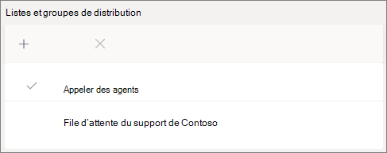

# Créer une file d’attente d’appels - Didacticiel pour les petites entreprisesCreate a call queue - small business tutorial

Les files d’attente permettent de router les appelants vers des personnes de votre organisation qui peuvent vous aider à répondre à un problème ou une question spécifique.Call queues provide a method of routing callers to people in your organization who can help with with a particular issue or question. Les appels sont distribués un par un aux personnes dans la file d’attente (appelées *agents).*Calls are distributed one at a time to the people in the queue (who are known as *agents*). 

Les files d’attente fournissent les services :Call queues provide:

- Message de salutation.A greeting message.

- Musique pendant que des personnes patientent dans une file d’attente.Music while people are waiting on hold in a queue.

- Routage des appels *(dans l’ordre* Premier dans, Premier sorti (FIFO) - vers des agents.Call routing - in *First In, First Out* (FIFO) order - to agents.

- Options de gestion pour le dépassement de capacité et le délai d’attente.Handling options for queue overflow and timeout.

#### Avant de commencerBefore you begin

Système [téléphonique : licences utilisateur virtuel si](../teams-add-on-licensing/virtual-user.md) vous ne les avez pas encore.Get some [Phone System - Virtual User licenses](../teams-add-on-licensing/virtual-user.md) if you don't already have them. Obtenez une file d’attente pour chaque file d’attente d’appels et chaque personne de service automatique que vous prévoyez de configurer.Get one for each call queue and auto attendant that you plan to set up. Ces licences sont gratuites. Nous vous suggérons donc d’en obtenir quelques supplémentaires si vous décidez de modifier votre installation ultérieurement.These licenses are free, so we suggest getting a few extra in case you decide to make changes to your setup in the future.

Étant donné que des agents dans une file d’attente d’appels peuvent appeler pour renvoyer un appel client, envisagez de définir l’ID d’appelant de vos agents d’appel sur votre numéro de téléphone principal ou le numéro d’un traitement automatique approprié.Since agents in a call queue may dial out to return a customer call, consider setting the caller ID for your call agents to your main phone number or the number of an appropriate auto attendant. Pour plus d’informations, voir Gérer les [stratégies d’ID](../caller-id-policies.md) d’appelant dans Microsoft Teams.See [Manage caller ID policies in Microsoft Teams](../caller-id-policies.md) for more information.

#### Pour configurer votre file d’attente d’appels, suivez ces étapesFollow these steps to set up your call queue

# [Étape 1   Créer une équipeStep 1 Create a team](#tab/create-team)

Lorsque vous créez une file d’attente d’appels, vous pouvez ajouter des utilisateurs individuels à la file d’attente ou utiliser un groupe de sécurité existant, un groupe Microsoft 365 ou une équipe Microsoft Teams.When creating a call queue, you can add individual users to the queue, or you can use an existing security group, Microsoft 365 group, or Microsoft Teams team. Nous vous recommandons d’utiliser une équipe.We recommend using a team. Cela permet aux membres de la file d’attente de discuter entre eux, de partager des idées et de créer des documents ou d’autres ressources pour aider vos clients.This allows members of the queue to chat with each other, share ideas, and create documents or other resources to help them help your customers. Une équipe fournit également une boîte vocale qui permet aux appelants de laisser un message après les heures d’ouverture ou si la file d’attente atteint sa capacité maximale.A team also provides a voice mailbox for callers to leave a message after hours or if the queue reaches its maximum capacity.

Pour créer une équipeTo create a team

1. Tout d’abord, cliquez sur **Teams** dans  la partie gauche de l’application, puis cliquez sur Rejoindre ou créer une équipe en bas de votre liste d’équipes.First, click **Teams** on the left side of the app, then click **Join or create a team** at the bottom of your teams list.

2. Cliquez ensuite **sur Créer une équipe** (première carte, coin supérieur gauche).Then click **Create team** (first card, top left corner).

3. Sélectionnez **Créer une équipe de toutes pièces.**Choose **Build a team from scratch**.

4. Choisissez ensuite si vous souhaitez une équipe publique ou privée.Next, choose whether you want a public or private team. Nous vous recommandons **de mettre votre** file d’attente d’appels privé pour éviter que des personnes ne se retrouvent involontairement dans la file d’attente en rejoignant l’équipe.We recommend **Private** for your call queue to avoid people unintentionally becoming part of the queue by joining the team.

5. Nommez votre équipe et ajoutez une description facultative.Name your team and add an optional description.

6. Lorsque vous avez terminé, cliquez sur **Créer.**When you're done, click **Create**.

8. Tapez les noms des personnes que vous voulez avoir dans votre file d’attente d’appels, puis cliquez sur **Ajouter.**Type the names of the people that you want to have in your call queue, and then click **Add**.

9. Cliquez sur **Fermer**.Click **Close**. Les personnes que vous ajoutez à une équipe recevront un e-mail leur faisant savoir qu’elles sont désormais membres de votre équipe et que l’équipe s’affichera dans leur liste d’équipes.People you add to a team will receive an email letting them know they are now a member of your team and the team will show up in their teams list.

> [!div class="nextstepaction"]
> [Étape 2 : gestion des comptes de ressources >Step 2 - Resource accounts >](https://review.docs.microsoft.com/microsoftteams/business-voice/create-a-phone-system-call-queue-smb?branch=mikeplum-smb-voice&tabs=resource-account#steps)

# [Étape 2   : comptes de ressourcesStep 2 Resource accounts](#tab/resource-account)

Chaque file d’attente d’appels que vous créez nécessite un compte de ressource.Each call queue that you create requires a resource account. Ce compte est similaire à un compte d’utilisateur, sauf qu’il est associé à un service de attendant automatique ou à une file d’attente d’appels au lieu d’une personne.This is similar to a user account, except the account is associated with an auto attendant or call queue instead of a person. Dans cette étape, nous allons créer le compte, lui attribuer une licence *Microsoft 365 Phone System (* licence utilisateur virtuel), puis l’utiliser pour commencer à créer la file d’attente d’appels.In this step, we'll create the account, assign it a *Microsoft 365 Phone System - Virtual User* license, and then use it to start creating the call queue.

### Créer un compte de ressourceCreate a resource account

Vous pouvez créer un compte de ressource dans le Centre d’administration Teams.You can create a resource account in the Teams admin center.

1. Dans le Centre d’administration Teams, développez **les paramètres** à l’échelle de l’organisation, puis cliquez **sur Comptes de ressources.**In the Teams admin center, expand **Org-wide settings**, and then click **Resource accounts**.

2. Cliquez sur **Ajouter**.Click **Add**.

3. Dans le **volet Ajouter un compte** de ressource, remplissez Nom **d’affichage,** Nom d’utilisateur et sélectionnez **File** d’attente d’appels pour le type de compte **de ressource.** In the **Add resource account** pane, fill out **Display name**, **Username**, and choose **Call queue** for the **Resource account type**.

    

4. Cliquez sur **Enregistrer**.Click **Save**.

Le nouveau compte apparaît dans la liste des comptes.The new account will appear in the list of accounts.

### Attribuer une licenceAssign a license

Vous devez attribuer une *licence Microsoft 365 Phone System - Utilisateur* virtuel au compte de ressource.You must assign a *Microsoft 365 Phone System - Virtual User* license to the resource account.

1. Dans le Centre d’administration Microsoft 365, cliquez sur le compte de ressource auquel vous voulez attribuer une licence.In the Microsoft 365 admin center, click the resource account to which you want to assign a license.

2. Sous **l’onglet Licences et** applications, sous **Licences,** sélectionnez **Microsoft 365 Phone System - Utilisateur virtuel.**On the **Licenses and Apps** tab, under **Licenses**, select **Microsoft 365 Phone System - Virtual User**.

3. Cliquez **sur Enregistrer les modifications.**Click **Save changes**.

    

### Créer une file d’attente d’appelCreate a call queue

Nous allons ensuite commencer à créer une file d’attente d’appels et affecter le compte de ressource.Next, we'll start creating a new call queue and assign the resource account.

1. Dans le Centre d’administration Teams, **développez Voix,** cliquez **sur Files d’attente d’appels,** puis cliquez sur **Ajouter.**In the Teams admin center, expand **Voice**, click **Call queues**, and then click **Add**.

1. Tapez un nom pour la file d’attente d’appels.Type a name for the call queue. Les agents voient ce nom lorsqu’ils reçoivent un appel entrant de la file d’attente.Agents will see this name when they receive an incoming call from the queue.

2. Cliquez **sur Ajouter des comptes,** recherchez le compte de ressource à utiliser avec cette file d’attente d’appels, cliquez sur Ajouter, puis sur **Ajouter.** Click **Add accounts**, search for the resource account that you want to use with this call queue, click **Add**, and then click **Add**.

3. Choisissez une langue.Choose a language. Cette langue sera utilisée pour les invites vocales générées par le système et la transcription des messages vocaux (si vous les activez).This language will be used for system-generated voice prompts and voicemail transcription (if you enable them).

    

4. Indiquez si vous souhaitez lire un message d’accueil pour les appelants lorsqu’ils arrivent dans la file d’attente.Specify if you want to play a greeting to callers when they arrive in the queue. Vous devez charger un fichier MP3, WAV ou WMA contenant le message d’accueil à lire.You must upload an MP3, WAV, or WMA file containing the greeting that you want to play.

5. Teams fournit de la musique par défaut aux appelants lorsqu’ils sont en attente dans une file d’attente.Teams provides default music to callers while they are on hold in a queue. Si vous souhaitez lire un fichier audio spécifique, sélectionnez Lire un fichier **audio** et téléchargez un fichier MP3, WAV ou WMA.If you want to play a specific audio file, choose **Play an audio file** and upload an MP3, WAV, or WMA file.

> [!NOTE]
> L’enregistrement téléchargé ne peut pas avoir une taille supérieure à 5 Mo.The uploaded recording can be no larger than 5 MB.
> La musique par défaut fournie dans les files d’attente d’appels de Teams est gratuite pour toutes les redevances payables par votre organisation.The default music supplied in Teams call queues is free of any royalties payable by your organization. 

> [!div class="nextstepaction"]
> [Étape 3 : appeler les agents >Step 3 - Call agents >](https://review.docs.microsoft.com/microsoftteams/business-voice/create-a-phone-system-call-queue-smb?branch=mikeplum-smb-voice&tabs=call-agents#steps)

# [Étape 3 : appeler   les agentsStep 3 Call agents](#tab/call-agents)

Pour ajouter des agents à la file d’attente d’appels, nous ajouterons l’équipe que nous avons créée précédemment.To add agents to the call queue, we'll add the team that we created earlier.

1. Cliquez **sur Ajouter des groupes.**Click **Add groups**.
2. Tapez le nom de l’équipe que vous avez créée.Type the name of the team that you created.
3. Cliquez **sur** Ajouter, puis sur **Ajouter.**Click **Add**, and then click **Add**.

    

Vous pouvez ajouter jusqu’à 20 agents individuellement et jusqu’à 200 agents via des groupes ou des équipes.You can add up to 20 agents individually and up to 200 agents via groups or teams.

> [!NOTE]
> Lorsque de nouveaux utilisateurs sont ajoutés à l’équipe, jusqu’à huit heures peuvent être s’il s’agit de leur premier appel.When new users are added to the team, it can take up to eight hours for their first call to arrive.

> [!div class="nextstepaction"]
> [Étape 4 : gestion des comptes de >Step 4 - Resource accounts >](https://review.docs.microsoft.com/microsoftteams/business-voice/create-a-phone-system-call-queue-smb?branch=mikeplum-smb-voice&tabs=call-routing#steps)

# [Étape 4   Routage des appelsStep 4 Call routing](#tab/call-routing)

Choisissez la méthode de routage des appels que vous voulez utiliser.Choose the call routing method that you want to use.

1. Définir **le mode Conférence** sur **Automatique.**Set **Conference mode** to **Auto**.

2. Choisissez la **méthode de routage** que vous voulez utiliser.Choose the **Routing method** you want to use. Cela détermine l’ordre dans lequel les agents reçoivent les appels de la file d’attente.This determines the order in which agents receive calls from the queue. Nous vous recommandons **de router en série** ou de **rais rond.**We recommend **Serial routing** or  **Round robin**. Choisissez l’une des options ci-après :Choose from these options:

    - **Le routage d’Attendant** sonne tous les agents dans la file d’attente en même temps.**Attendant routing** rings all agents in the queue at the same time. Le premier appelant à prendre l’appel reçoit l’appel.The first call agent to pick up the call gets the call.

    - **Le routage en série** a pour but de faire sonner un par un tous les télét calleurs.**Serial routing** rings all call agents one by one. Si un agent le fait sans appel ou ne décroche pas, l’appel sonnera sur l’agent suivant et essaiera tous les agents jusqu’à ce qu’il soit choisi ou mis hors appel.If an agent dismisses or does not pick up a call, the call will ring the next agent and will try all agents until it is picked up or times out.

    - **L’arrondi balance** le routage des appels entrants de sorte que chaque agent d’appel reçoie le même nombre d’appels depuis la file d’attente.**Round robin** balances the routing of incoming calls so that each call agent gets the same number of calls from the queue. Cela pourrait être souhaitable dans un environnement de vente entrante afin d’assurer la même opportunité entre tous les agents d’appel.This may be desirable in an inbound sales environment to assure equal opportunity among all the call agents.

    - **Les itinéraires inactifs** les plus longs à chaque appel à l’agent inactif la plus longue.**Longest idle** routes each call to the agent who has been idle the longest time. (Les agents dont l’état de présence est Absent depuis plus de 10 minutes ne sont pas inclus.)(Agents whose presence state has been Away for more than 10 minutes are not included.)

    

3. Activer **le routage en fonction des** présencesTurn **Presence-based routing** on. Cela a pour but d’appeler des agents dont le statut de présence **est disponible.**This routes calls to agents whose presence status is **Available**.

4. Choisissez si vous voulez autoriser les agents à se désaisser des appels.Choose if you want to allow agents to opt out of calls.

5. Définissez une **heure d’alerte** de l’agent pour spécifier combien de temps le téléphone d’un agent sonnera avant que la file d’attente redirige l’appel vers le prochain agent.Set an **Agent alert time** to specify how long an agent's phone will ring before the queue redirects the call to the next agent.

    

> [!div class="nextstepaction"]
> [Étape 5 : dépassement de capacité d'>Step 5 - Call overflow >](https://review.docs.microsoft.com/microsoftteams/business-voice/create-a-phone-system-call-queue-smb?branch=mikeplum-smb-voice&tabs=call-overflow#steps)

# [Étape 5 -   Dépassement de capacité d’appelStep 5 Call overflow](#tab/call-overflow)

Choisissez comment vous voulez gérer les appels dont le nombre d’appels dépasse le nombre maximal dans la file d’attente.Choose how you want to handle calls that exceed the maximum in the queue.

1. Définir le **nombre maximal d’appels dans la file d’attente.**Set the **Maximum calls in the queue**.

2. Choisissez ce que vous voulez faire lorsque le nombre maximal d’appels est atteint.Choose what you want to do when the maximum number of calls is reached. Vous pouvez déconnecter l’appel ou le rediriger.You can disconnect the call or redirect it. Nous vous recommandons de rediriger l’appel vers l’une des destinations suivantes :We recommend that you redirect the call to one of the following destinations:
    - **Personne dans l’organisation** - une personne de votre organisation qui peut recevoir des appels vocux**Person in the organization** - a person in your organization who is able to receive voice calls
    - **Application vocale :** un attendant automatique ou une autre file d’attente d’appels.**Voice app** - an auto attendant or another call queue. (Choisissez le compte de ressource associé au port automatique ou à la file d’attente d’appels lorsque vous choisissez cette destination.)(Choose the resource account associated with the auto attendant or call queue when choosing this destination.)
    - **Numéro de téléphone externe -** n’importe quel numéro de téléphone.**External phone number** - any phone number. Utilisez ce format : +[code pays][code de zone][numéro de téléphone]Use this format: +[country code][area code][phone number]
    - **Messagerie vocale** : vous pouvez utiliser la boîte aux lettres vocale de l’équipe que vous avez créée.**Voicemail** - you can use the voice mailbox of the team that you created.

    

> [!div class="nextstepaction"]
> [Étape 6 : délai d'>Step 6 - Call timeout >](https://review.docs.microsoft.com/microsoftteams/business-voice/create-a-phone-system-call-queue-smb?branch=mikeplum-smb-voice&tabs=call-timeout#steps)

# [Délai d’appel   d’étape 6Step 6 Call timeout](#tab/call-timeout)

Choisissez ce que vous voulez faire lorsque les appels sont trop longs dans la file d’attente.Choose what you want to happen when calls have been waiting in the queue for too long.

1. Définir le **délai d’attente des appels : temps d’attente maximal.**Set the **Call Timeout: maximum wait time**.

2. Choisissez ce que vous voulez faire lorsqu’un appel arrive à la fin. Vous pouvez déconnecter l’appel ou le rediriger.Choose what you want to do when a call times out. You can disconnect the call or redirect it. Nous vous recommandons de rediriger l’appel vers l’une des destinations suivantes :We recommend that you redirect the call to one of the following destinations:
    - **Personne dans l’organisation** - une personne de votre organisation qui peut recevoir des appels vocux**Person in the organization** - a person in your organization who is able to receive voice calls
    - **Application vocale :** un attendant automatique ou une autre file d’attente d’appels.**Voice app** - an auto attendant or another call queue. (Choisissez le compte de ressource associé au port automatique ou à la file d’attente d’appels lorsque vous choisissez cette destination.)(Choose the resource account associated with the auto attendant or call queue when choosing this destination.)
    - **Numéro de téléphone externe -** n’importe quel numéro de téléphone.**External phone number** - any phone number. Utilisez ce format : +[code pays][code de zone][numéro de téléphone]Use this format: +[country code][area code][phone number]
    - **Messagerie vocale** : vous pouvez utiliser la boîte aux lettres vocale de l’équipe que vous avez créée.**Voicemail** - you can use the voice mailbox of the team that you created.

    

3. Cliquez sur **Enregistrer**.Click **Save**.

Cela termine la configuration de votre file d’attente d’appels.This completes the setup of your call queue. Vous pouvez ensuite configurer [un attendant automatique.](create-a-phone-system-auto-attendant-smb.md)Next, you may want to [set up an auto attendant](create-a-phone-system-auto-attendant-smb.md).

---

