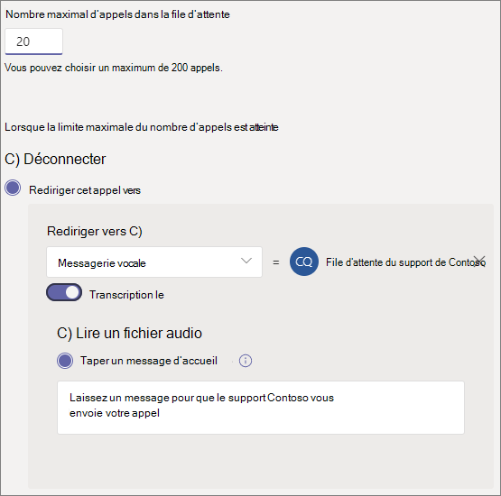

# Créer une file d’attente d’appels - Didacticiel pour les petites entreprises

Les files d’attente des appels utilisent une méthode de routage des appelants, qui sont orientés vers les personnes de votre organisation qui pourront les aider à résoudre un problème ou répondre à une question. Les appels sont distribués les uns après les autres aux personnes présentes dans la file d’attente (appelées *agents*). 

Les files d’attente des appels fournissent :

- un message d’accueil.

- une musique pour les personnes en attente dans la file d’attente.

- un routage des appels vers les agents, en utilisant la méthode *Premier entré, premier sorti* (PEPS).

- Gestion des options pour le débordement et la temporisation des files d’attente.

#### Démonstration vidéo

Cette vidéo montre comment créer une file d’attente d’appels dans Teams.

> [!VIDEO https://www.microsoft.com/videoplayer/embed/RWCF23?autoplay=false]

#### Avant de commencer

Obtenez des [Système téléphonique - Licences](../teams-add-on-licensing/virtual-user.md) utilisateur virtuel si vous ne les avez pas encore. Obtenez une file d’attente pour chaque file d’attente d’appels et chaque personne de service automatique que vous prévoyez de configurer. Ces licences sont gratuites. Nous vous suggérons donc d’en obtenir quelques supplémentaires si vous décidez de modifier votre installation ultérieurement.

Étant donné que des agents dans une file d’attente d’appels peuvent appeler pour renvoyer un appel client, envisagez de définir l’ID d’appelant de vos agents d’appel sur votre numéro de téléphone principal ou le numéro d’un traitement automatique approprié. Consultez l’article [Gérer les stratégies d’identification de l’appelant dans Microsoft Teams](../caller-id-policies.md) pour en savoir plus.

#### Pour configurer votre file d’attente d’appels, suivez ces étapes

# [Étape 1   Créer une équipe](#tab/create-team)

Lorsque vous créez une file d’attente d’appels, vous pouvez ajouter des utilisateurs individuels à la file d’attente ou utiliser un groupe de sécurité existant, un groupe de Microsoft 365 ou une Microsoft Teams d’équipe. Nous vous recommandons [d’utiliser un canal d’équipe.](https://support.microsoft.com/office/9f07dabe-91c6-4a9b-a545-8ffdddd2504e) Cela permet aux membres de la file d’attente de discuter entre eux, de partager des idées et de créer des documents ou d’autres ressources pour aider vos clients. Une équipe fournit également une boîte vocale qui permet aux appelants de laisser un message après les heures d’ouverture ou si la file d’attente atteint sa capacité maximale.

Pour créer une équipe

1. Tout  **d’abord, Teams** sur le côté gauche de l’application, puis cliquez sur Rejoindre ou créer une équipe en bas de votre liste d’équipes.

2. Cliquez ensuite **sur Créer une équipe** (première carte, coin supérieur gauche).

3. Sélectionnez **Créer une équipe de toutes pièces.**

4. Choisissez ensuite si vous souhaitez une équipe publique ou privée. Nous vous recommandons **de mettre votre** file d’attente d’appels privé pour éviter que des personnes ne se retrouvent involontairement dans la file d’attente en rejoignant l’équipe.

5. Nommez votre équipe et ajoutez une description facultative.

6. Lorsque vous avez terminé, cliquez sur **Créer.**

8. Tapez les noms des personnes que vous voulez avoir dans votre file d’attente d’appels, puis cliquez sur **Ajouter.**

9. Cliquez sur **Fermer**. Les personnes que vous ajoutez à une équipe recevront un e-mail leur faisant savoir qu’elles sont désormais membres de votre équipe et que l’équipe s’affichera dans leur liste d’équipes.

Nous allons ensuite ajouter un canal à utiliser avec la file d’attente d’appels.

Pour ajouter un canal

1. Dans Teams, recherchez l’équipe que vous vient de créer, cliquez sur Autres **options** (...), puis sur **Ajouter un canal.**

2. Tapez un nom et une description pour le canal.

3. Sous **Confidentialité,** sélectionnez **Standard - Accessible à tous** les membres de l’équipe, puis cliquez sur **Ajouter.**

> [!div class="nextstepaction"]
> [Étape 2 : gestion des comptes de ressources >](/microsoftteams/business-voice/create-a-phone-system-call-queue-smb?tabs=resource-account#steps)

# [Étape 2 Comptes   de ressources](#tab/resource-account)

Chaque file d’attente d’appels que vous créez nécessite un compte de ressource. Ce compte est similaire à un compte d’utilisateur, sauf qu’il est associé à un service de attendant automatique ou à une file d’attente d’appels au lieu d’une personne. Dans cette étape, nous allons créer le compte, lui attribuer une *Microsoft 365 Système téléphonique -licence* Utilisateur virtuel, puis l’utiliser pour commencer à créer la file d’attente d’appels.

### Créer un compte de ressource

Vous pouvez créer un compte de ressource dans le Teams d’administration.

1. Dans le Teams d’administration, développez **Voix,** puis cliquez sur **Comptes de ressources.**

2. Cliquez sur **Ajouter**.

3. Dans le **volet Ajouter un compte de** ressource, remplissez Nom **d’affichage,** Nom d’utilisateur et sélectionnez **File** d’attente d’appels pour le type de compte de **ressource.**  Les agents peuvent voir le nom complet lorsqu’ils reçoivent un appel entrant depuis la file d’attente.

    

4. Cliquez sur **Enregistrer**.

   Le nouveau compte apparaît dans la liste des comptes.

   

### Attribuer une licence

Vous devez affecter une *Microsoft 365 Système téléphonique - Licence Utilisateur* virtuel au compte de ressource.

1. Dans la Centre d'administration Microsoft 365 utilisateurs  actifs, cliquez sur le compte de ressource auquel vous voulez attribuer une licence.

2. Sous **l’onglet Licences et** applications, sous **Licences,** sélectionnez **Microsoft 365 Système téléphonique - Utilisateur virtuel.**

3. Cliquez sur **Enregistrer les modifications**.

    

### Créer une file d’attente des appels

Nous allons ensuite commencer à créer une file d’attente d’appels et affecter le compte de ressource.

1. Dans le Teams d’administration, développez **Voix,** cliquez sur Files d’attente **d’appels,** puis cliquez sur **Ajouter.**

1. Saisissez un nom pour la file d’attente des appels.

2. Cliquez sur **Ajouter des comptes**, recherchez le compte de ressource que vous souhaitez utiliser avec cette file d’attente des appels, cliquez sur **Ajouter**, puis de nouveau sur **Ajouter**.

3. (Facultatif) Sous **Attribuer un ID** d’appel, cliquez sur **Ajouter,** recherchez les comptes de ressources que vous avez créés pour votre employé de service automatique, cliquez sur **Ajouter,** puis sur **Ajouter.** Les agents d’appel auront ainsi l’ID de l’appelant de votre ligne principale lorsqu’ils l’appelleront.

    

3. Choisissez une langue. Nous utiliserons cette langue pour les invites vocales générées par le système et la transcription de la messagerie vocale (si vous les activez).

    

4. Indiquez si vous souhaitez diffuser un message d’accueil aux appelants lorsqu’ils arrivent dans la file d’attente. Vous devez télécharger un fichier MP3, WAV ou WMA contenant le message d’accueil que vous souhaitez diffuser.

5. Teams fournit une musique par défaut aux appelants lorsqu’ils sont en attente dans une file d’attente. Si vous souhaitez diffuser un fichier audio spécifique, choisissez **Lire un fichier audio** et téléchargez un fichier MP3, WAV ou WMA.

   > [!NOTE]
   > La taille maximale de l’enregistrement téléchargé est de 5 Mo.
   > La musique par défaut fournie dans les files d’attente des appels Teams est exempte de toute redevance payable par votre organisation. 

> [!div class="nextstepaction"]
> [Étape 3 : appeler des >](/microsoftteams/business-voice/create-a-phone-system-call-queue-smb?tabs=call-agents#steps)

# [Étape 3 : appeler   les agents](#tab/call-agents)

Pour ajouter des agents à la file d’attente d’appels, nous les ajouterons à l’équipe et au canal que nous avons créés précédemment. Pour ce faire, vous devez être membre de l’équipe.

1. Sélectionnez **l’option Choisir une** équipe, puis cliquez sur Ajouter un **canal.**
2. Tapez le nom de l’équipe que vous avez créée, sélectionnez-la, puis cliquez sur **Ajouter.**
3. Sélectionnez le canal que vous avez créé pour la file d’attente.
3. Cliquez sur **Appliquer**.

    

> [!NOTE]
> Lorsque de nouveaux utilisateurs sont ajoutés à l’équipe, jusqu’à huit heures peuvent être s’il s’agit de leur premier appel.

> [!div class="nextstepaction"]
> [Étape 4 : gestion des comptes de >](/microsoftteams/business-voice/create-a-phone-system-call-queue-smb?tabs=call-routing#steps)

# [Étape 4   Routage des appels](#tab/call-routing)

Choisissez la méthode de routage des appels que vous voulez utiliser.

1. Définir **le mode Conférence** sur **Automatique.**

2. Choisissez la **méthode de routage** que vous voulez utiliser. Cela détermine l’ordre dans lequel les agents reçoivent les appels de la file d’attente. Nous vous recommandons **de router en série** ou de **rais rond.** Sélectionnez l’une des options suivantes :

    - Le **routage du standard** appelle tous les agents de la file d’attente en même temps. Le premier agent à prendre l’appel reçoit l’appel.

    - **Le routage en série** a pour but de faire sonner un par un tous les agents d’appel. Si un agent rejette ou ne répond pas à un appel, l’appel sera transféré à l’agent suivant et à tous les agents jusqu’à ce que l’un deux réponde ou que le temps soit écoulé.

    - Le **tourniquet (round robin)** équilibre le routage des appels entrants afin que chaque agent d’appel reçoive le même nombre d’appels provenant de la file d’attente. Ceci peut être utile dans un environnement de ventes entrantes pour assurer l’égalité des chances entre tous les agents d’appel.

    - L’**inactivité la plus longue** achemine chaque appel vers l’agent qui a été inactif le plus longtemps. (Les agents dont l’état de présence est Absent depuis plus de 10 minutes ne sont pas inclus.)

    

3. Activer **le routage en fonction des** présences Cela a pour but d’appeler des agents dont le statut de présence **est disponible.**

4. Choisissez si vous voulez autoriser les agents à se désaisser des appels.

5. Définissez une **heure d’alerte** de l’agent pour spécifier combien de temps le téléphone d’un agent sonnera avant que la file d’attente redirige l’appel vers le prochain agent.

    

> [!div class="nextstepaction"]
> [Étape 5 : dépassement de capacité d'>](/microsoftteams/business-voice/create-a-phone-system-call-queue-smb?tabs=call-overflow#steps)

# [Étape 5 -   Dépassement de capacité d’appel](#tab/call-overflow)

Choisissez comment vous voulez gérer les appels dont le nombre d’appels dépasse le nombre maximal dans la file d’attente.

1. Définir le **nombre maximal d’appels dans la file d’attente.**

2. Choisissez ce que vous voulez faire lorsque le nombre maximal d’appels est atteint. Vous pouvez déconnecter l’appel ou le rediriger. Nous vous recommandons de rediriger l’appel vers l’une des destinations suivantes :
    - **Personne dans l’organisation** - une personne de votre organisation qui peut recevoir des appels vocux
    - **Application vocale :** un attendant automatique ou une autre file d’attente d’appels. (Choisissez le compte de ressource associé au port automatique ou à la file d’attente d’appels lorsque vous choisissez cette destination.)
    - **Numéro de téléphone externe -** n’importe quel numéro de téléphone. Utilisez ce format : +[code pays][code de zone][numéro de téléphone]
    - **Messagerie vocale** : vous pouvez utiliser la boîte aux lettres vocale de l’équipe que vous avez créée.

    

> [!div class="nextstepaction"]
> [Étape 6 : délai d'>](/microsoftteams/business-voice/create-a-phone-system-call-queue-smb?tabs=call-timeout#steps)

# [Délai d’appel   d’étape 6](#tab/call-timeout)

Choisissez ce que vous voulez faire lorsque les appels sont trop longs dans la file d’attente.

1. Définissez le **temps d’attente maximal.**

2. Choisissez ce que vous voulez faire lorsqu’un appel arrive à la fin. Vous pouvez déconnecter l’appel ou le rediriger. Nous vous recommandons de rediriger l’appel vers l’une des destinations suivantes :
    - **Personne dans l’organisation** - une personne de votre organisation qui peut recevoir des appels vocux
    - **Application vocale :** un attendant automatique ou une autre file d’attente d’appels. (Choisissez le compte de ressource associé au port automatique ou à la file d’attente d’appels lorsque vous choisissez cette destination.)
    - **Numéro de téléphone externe -** n’importe quel numéro de téléphone. Utilisez ce format : +[code pays][code de zone][numéro de téléphone]
    - **Messagerie vocale** : vous pouvez utiliser la boîte aux lettres vocale de l’équipe que vous avez créée.

    

3. Cliquez sur **Enregistrer**.

Cela termine la configuration de votre file d’attente d’appels. Vous pouvez ensuite configurer [un attendant automatique.](create-a-phone-system-auto-attendant-smb.md)

---

