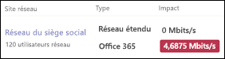

# Vérifiez que vous avez une connexion Internet Teams Système téléphonique

Teams Système téléphonique est la technologie de Microsoft qui permet d’activer les fonctionnalités téléphoniques au sein d’Microsoft Teams à l’aide Microsoft 365 cloud. Chaque appareil qui utilise Microsoft Teams et Système téléphonique doit être connecté à Internet.

Pour obtenir la meilleure Système téléphonique expérience utilisateur, vous avez besoin d’une connexion Internet haut débit qui peut prendre en charge le nombre maximal d’appels téléphoniques que votre organisation peut passer à un moment quelconque. Vous devez également vous assurer que les ordinateurs de votre réseau peuvent accéder Microsoft 365 services.

## Vérifier la vitesse de votre connexion Internet

Cet article vous aide à déterminer si votre connexion Internet est assez rapide pour le nombre de personnes qui doivent effectuer des appels téléphoniques. Vous fournirez des informations sur votre organisation et récupérerez un rapport qui indique la quantité de votre connexion Internet utilisée par les utilisateurs Teams et Système téléphonique.

### Recueillir des informations sur votre connexion Internet et vos utilisateurs

Avant de commencer, vous avez besoin des informations suivantes :

* Vitesse de votre connexion Internet
* Combien de personnes utiliseront Système téléphonique de votre bureau
* Combien de personnes utiliseront Système téléphonique principalement à partir d’un emplacement distant tel qu’un bureau à domicile

### Entrer vos informations dans le Planificateur de réseau

Procédez comme suit :

1. Dans un navigateur, allez à [https://admin.teams.microsoft.com](https://admin.teams.microsoft.com). Connectez-vous à l’aide d’un compte disposant des autorisations d’administrateur général. Le compte que vous avez utilisé pour vous inscrire Microsoft 365 ces autorisations.
2. Ouvrez **Planification**, puis sélectionnez **Planificateur de réseau**.
3. Sous **Plans réseau**, sélectionnez **Ajouter**. Entrez un nom à votre plan, puis sélectionnez **Appliquer**.
4. Sélectionnez le nom de votre plan de réseau.
5. Sur la page suivante, sélectionnez **Ajouter un site réseau** dans l’onglet **Sites réseau**.
6. Remplissez le **nom du site réseau**, les **utilisateurs** du réseau et les champs de capacité de liaison **Internet** , puis sélectionnez **Enregistrer**. Laissez les autres champs vides dans cet écran, et ne sélectionnez pas les options **ExpressRoute** ou **connecté au réseau étendu**.
7. Dans l’onglet **Rapport**, sélectionnez **Démarrer un rapport**.
8. Entrez le nom  d’un rapport et le nombre d’utilisateurs **réseau (****Office** et **distants),** puis  sélectionnez Générer un rapport pour créer un rapport qui indique les besoins en bande passante pour Teams. Nous vous indiquerons comment lire le rapport dans la section suivante.

### Recherchez la vitesse minimale de votre connexion Internet

Lorsque vous sélectionnez **Générer un rapport**, Microsoft 365 crée un rapport.

Sous la **colonne Impact** et sur **Office 365** ligne, ce nombre indique la quantité de connexion internet que vous Teams et Système téléphonique utiliser. Il est recommandé que ce nombre ne soit pas supérieur à 30 % de la vitesse totale de votre connexion Internet. Par exemple, si votre connexion Internet est de *60* Mbits/s, les Teams et Système téléphonique ne doivent pas utiliser plus *de 18 Mbits/s*.

Utilisez cette équation pour déterminer la vitesse minimale de votre connexion Internet : <*le nombre d> /0,3*.  

Imaginons que le nombre d’impacts *soit de 4,6875 Mbits/s*. Pour calculer la vitesse minimale de connexion Internet, le calcul serait *de 4,6875 /0,3 = 15,6*. Dans ce cas, la vitesse de connexion Internet doit être d’au moins *15,6 Mbits/s*.

Si Teams et Système téléphonique utilisent plus de 30 % de la vitesse totale de votre connexion Internet, le nombre **d’impact** apparaît en rouge. Dans ce cas, vous devrez peut-être mettre à niveau votre connexion Internet.

>[!NOTE]
> L’impact sur la bande passante fourni par le Planificateur réseau n’est qu’une estimation. Il est recommandé d’utiliser  le tableau de bord de qualité des appels pour surveiller de façon active l’expérience utilisateur pour les appels audio et vidéo avec d Microsoft Teams au sein de votre organisation.

## S’assurer que les ordinateurs et les appareils de votre réseau peuvent accéder à Microsoft 365

Les ordinateurs et appareils qui utilisent Système téléphonique doivent utiliser des ports réseau spécifiques pour communiquer avec Microsoft 365 services. Ces ports sont essentiellement des portes via lesquelles les appareils peuvent discuter entre eux via un réseau ou Internet. Votre pare-feu doit autoriser les appareils de votre réseau à accéder à Microsoft 365 sur les ports réseau *sortants* suivants :

* **Ports TCP** 80 et 443
* **Ports UDP** 3478, 3479, 3480 et 3481

La façon la plus simple de vérifier si votre pare-feu autorise la communication sur ces ports réseau consiste à effectuer un test de connectivité à l’aide de l’outil de connectivité réseau [Microsoft 365](/microsoft-365/enterprise/office-365-network-mac-perf-onboarding-tool) à partir de l’emplacement de bureau que vous voulez tester. Après avoir effectué le test, vérifiez les résultats et les recommandations.
