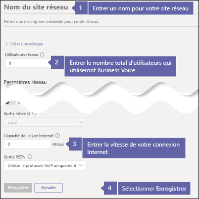
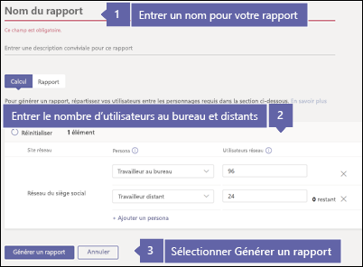
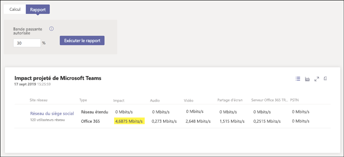

# Vérifier la vitesse de votre connexion Internet pour Business Voice

Business Voice réside dans le cloud avec Microsoft 365. Tous les appareils utilisant Microsoft Teams et Business Voice ont besoin d’une connexion Internet.

Pour tirer le meilleur parti de Business Voice, une connexion Internet haut débit capable de prendre en charge le nombre d’appels téléphoniques maximum que votre organisation à tout moment est recommandée. Vous devez également vous assurer que les ordinateurs de votre réseau peuvent accéder aux serveurs Microsoft 365.

Pour appliquer cette procédure, vous devez disposer d’un client avec l’un des abonnements suivants :

* Microsoft 365 Business Basic
* Microsoft 365 Business Standard
* Office 365 E1
* Office 365 E3
* Office 365 F1
* Microsoft 365 A1
* Microsoft 365 A3
* Microsoft 365 E3
* Microsoft 365 Business

Vous n’avez pas besoin d’une licence Business Voice pour suivre cette procédure.

## Vérifier la vitesse de votre connexion Internet

Cet article aide à déterminer si votre connexion Internet est suffisamment rapide pour le nombre de personnes qui ont à effectuer des appels téléphoniques et à héberger des vidéoconférences. Vous allez fournir des informations sur votre organisation et obtenir un rapport indiquant dans quelle mesure votre connexion Internet sera utilisée par Teams et Business Voice.

### Collecter des informations sur votre connexion Internet et vos utilisateurs

Avant de commencer, vous avez besoin des informations suivantes :

* La vitesse de votre connexion Internet
* Le nombre de personnes qui utiliseront Business Voice principalement à partir de vos bureaux
* Le nombre de personnes qui utiliseront Business Voice principalement à partir d’un emplacement distant, par exemple en télétravail

### Entrer vos informations dans le Planificateur de réseau

Procédez comme suit :

1. Dans un navigateur, accédez à https://admin.teams.microsoft.com. Connectez-vous à l’aide d’un compte disposant des autorisations d’administrateur général. Le compte que vous avez utilisé pour vous inscrire à Microsoft 365 ou Office 365 dispose de ces autorisations.
2. Ouvrez **Planification**, puis sélectionnez **Planificateur de réseau**.
3. Sous **Plans réseau**, sélectionnez **Ajouter**. Entrez un nom à votre plan, puis sélectionnez **Appliquer**. Votre plan réseau doit se présenter comme suit :

    
1. Sélectionnez le nom de votre plan de réseau. (C'est le **bureau principale** dans l’image précédente.)
2. Sur la page suivante, sélectionnez **Ajouter un site réseau** dans l’onglet **Sites réseau**.
3. Renseignez uniquement les champs indiqués dans la capture d’écran suivante, puis sélectionnez **Enregistrer**. Laissez les autres champs vides dans cet écran, et ne sélectionnez pas les options **ExpressRoute** ou **connecté au réseau étendu**.

    
1. Dans l’onglet **Rapport**, sélectionnez **Démarrer un rapport**.
1. Entrez les informations suivantes, puis sélectionnez **Générer un rapport** pour créer un rapport qui indique les exigences en matière de bande passante pour Teams. Nous allons vous montrer comment lire le rapport dans la section suivante.

    

### Identifier votre vitesse de connexion Internet minimale

Lorsque vous sélectionnez **Générer un rapport**, Microsoft 365 ou Office 365 crée un rapport semblable à ce qui suit :

Le chiffre mis en surbrillance indique la part de votre connexion Internet utilisée par Teams et Business Voice. Nous vous recommandons de faire en sorte que ce chiffre ne dépasse pas 30 % de la vitesse totale de votre connexion Internet. Par exemple, si votre connexion Internet est de 60 Mbits/s, Teams et Business Voice ne doivent pas utiliser plus de 18 Mbits/s.

Utilisez les équations suivantes pour déterminer votre vitesse de connexion Internet minimum : *\<highlighted number> / 0,3*. Avec le nombre mis en surbrillance dans l’image précédente, le calcul est *4,6875 / 0,3 = 15,6*. Dans ce cas, la vitesse de connexion Internet doit être d’au moins 15,6 Mbps.

Si Teams et Business Voice utilisent plus de 30 % de la vitesse de connexion Internet totale, le chiffre mis en surbrillance s’affiche en rouge. Dans ce cas, vous devrez peut-être mettre à niveau votre connexion Internet.

## S’assurer que les ordinateurs et les appareils de votre réseau peuvent accéder à Microsoft 365

Les ordinateurs et appareils qui utilisent Business Voice doivent utiliser des ports réseau spécifiques pour communiquer avec les serveurs Microsoft 365. Ces ports fonctionnent comme des portes via lesquelles les appareils communiquent entre eux sur un réseau ou sur Internet. Votre pare-feu doit autoriser les appareils de votre réseau à accéder à Microsoft 365 sur les ports réseau *sortants* suivants :

* **Ports TCP** 80 et 443
* **Ports UDP** 3478, 3479, 3480 et 3481

Le moyen le plus simple de vérifier si votre pare-feu autorise la communication sur ces ports réseau consiste à effectuer un appel de test dans Teams :

1. Accédez à https://aka.ms/getteams sur un ordinateur de votre réseau et installez Teams. Assurez-vous que l’ordinateur possède des haut-parleurs et un microphone.
2. Ouvrez Teams et connectez-vous à l’aide d’un compte Microsoft 365.
3. Dans Teams, sélectionnez votre image de profil, puis accédez à **Paramètres** > **Périphériques**.
4. Sous **Périphériques audio**, sélectionnez **Passer un appel de test**.
5. Suivez les tapes pour laisser un message et l’écouter ensuite.

   * Si l’appel aboutit et que vous entendez votre message, votre pare-feu est correctement configuré.
   * Si l’appel aboutit mais que vous ne parvenez pas à entendre les instructions ou votre message, assurez-vous que vos haut-parleurs et votre microphone sont correctement configurés, puis réessayez.
   * Si l’appel ne se connecte pas ou s’il se connecte mais que vous n’entendez pas votre message, vous devrez peut-être mettre à jour votre pare-feu pour autoriser l’accès aux ports réseau requis. Consultez la documentation de votre pare-feu, ou contactez un spécialiste informatique pour obtenir de l’aide.

 Si vous êtes un professionnel de l’informatique et que vous avez besoin d’informations supplémentaires sur la préparation de réseaux plus vastes ou plus complexes afin de prendre en charge Business Voice, consultez l’article [Évaluer mon environnement](../3-envision-evaluate-my-environment.md). Cet article fournit des informations sur les exigences en matière de bande passante, de proxy et de pare-feu, et l’utilisation de l’[Outil d’évaluation du réseau](../3-envision-evaluate-my-environment.md#test-the-network) pour tester votre réseau.

