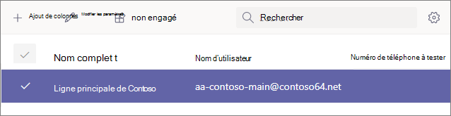

# Étape 4 : configurer un compte de ressource Voix Entreprise

Les comptes de ressources ne sont affectés à aucun utilisateur spécifique. En revanche, les comptes de ressources, qui utilisent une licence d’utilisateur virtuel gratuit, sont utilisés par les appareils et services dans Microsoft 365. Dans Microsoft Teams, les comptes de ressources sont affectés à des numéros de téléphone, puis associés à des files d’attente et des files d’attente automatiques.

En associant des comptes de ressources aux postes de service automatiques et aux files d’attente d’appels, vous pouvez leur ajouter un ou plusieurs numéros de téléphone gratuits ou gratuits. Par exemple, vous pouvez associer un compte de ressource à un numéro toll à un employé de service automatique pour les appelants locaux. Pour les appels longue distance, vous pouvez associer un autre compte de ressource à un numéro gratuit au même employé de service automatique.

Les sections de cet article expliquent comment configurer un compte de ressource et lui attribuer un numéro de téléphone. Plus tard, vous associerez le compte de ressource à un employé de service automatique.

La vidéo suivante vous montre comment effectuer ces étapes dans le Centre d’administration Teams’administration.

> [!VIDEO https://www.microsoft.com/videoplayer/embed/RE4OFYG]

## Obtenir des licences utilisateur virtuel

Les comptes de ressources nécessitent une licence pour l’utilisation des files d’attente et des files d’attente automatiques. Vous pouvez utiliser une licence *utilisateur Microsoft 365 Système téléphonique virtuel.*

> [!NOTE]
> Vous ne devez effectuer les étapes suivantes que si vous vous êtes inscrit à une période d’essai de Business Voice. Si vous avez acheté des licences Business Voice, les licences virtuelles doivent déjà être appliquées à votre compte. 
>
> Pour voir si vous avez déjà des licences virtuelles, connectez-vous à Microsoft 365 à l’aide d’un compte avec des autorisations d’administrateur global. Ensuite, allez sur Facturation > [Vos produits.](https://admin.microsoft.com/Adminportal/Home#/subscriptions) Si vous avez des licences virtuelles, elles apparaîtront Microsoft 365 Système téléphonique **- Utilisateur virtuel.**

1. Ouvrez le Centre d’administration Microsoft 365 et connectez-vous avec un utilisateur en tant qu’administrateur général (il s’agit généralement du compte que vous avez utilisé pour vous inscrire à Microsoft 365).
2. Dans le volet de navigation gauche, consultez les modules add-ons <a href="https://admin.microsoft.com/Adminportal/Home#/catalog" target="_blank"> **Billing**  >  **Purchase services**</a>Voir tous les produits  >    >  **d’modules add-ons.**
3. Faites défiler jusqu’à la fin pour trouver **la Microsoft 365 Système téléphonique – Licence utilisateur** virtuel. Sélectionnez **Détails,** puis **Acheter.**
4. Sur la page d’achat de licences, sélectionnez le nombre de licences utilisateur virtuels que vous souhaitez. Vous avez besoin d’une licence virtuelle pour chaque attendant automatique et chaque file d’attente d’appels que vous prévoyez de configurer. Nous vous recommandons de sélectionner au moins cinq licences afin de pouvoir facilement configurer des files d’attente automatiques et des files d’attente d’appels à l’avenir sans avoir à acheter d’autres licences immédiatement.
5. **Décochez l’autorisation Affecter automatiquement à tous vos utilisateurs sans licence.**
6. Sélectionnez **Découvrir maintenant.**
7. Confirmez votre commande, **sélectionnez Suivant,** puis **Commande.**

> [!NOTE]
> N’oubliez pas que vous devez  **toujours acheter** la licence, même si son coût est nul.

## Créer un compte de ressource

Une fois que vous avez reçu *votre Microsoft 365 Système téléphonique d’utilisateur* virtuel, vous pouvez créer votre compte de ressource.

1. Ouvrez le Microsoft Teams d’administration et connectez-vous avec un utilisateur en tant qu’administrateur général (il s’agit généralement du compte que vous avez utilisé pour vous inscrire à Microsoft 365).
2. Dans le volet de navigation gauche, allez sur Comptes de ressources à l’échelle de <a href="https://admin.teams.microsoft.com/company-wide-settings/resource-accounts" target="_blank">   >  **l’organisation.**</a>
3. Sélectionnez **Ajouter**.
4. Dans le **volet Ajouter un compte de** ressource, remplissez Nom **d’affichage,** puis **Nom d’utilisateur.** Choisissez un nom d’affichage descriptif tel que « employé principal de la ligne automatique » pour décrire l’objectif du compte de ressource.
5. Dans **Type de compte ressource,** sélectionnez Le attendant **automatique.**
6. Sélectionnez **Enregistrer**.

## Attribuer une licence

Après avoir créé votre compte de ressource, vous devez affecter une *Microsoft 365 Système téléphonique utilisateur* virtuel ou *une Système téléphonique* virtuel.

1. Ouvrez le Centre d’administration Microsoft 365 et connectez-vous avec un utilisateur en tant qu’administrateur général (il s’agit généralement du compte que vous avez utilisé pour vous inscrire à Microsoft 365).
1. Dans le volet de navigation gauche, allez à <a href="https://admin.microsoft.com/Adminportal/Home#/users" target="_blank"> **Utilisateurs**  >  **actifs.**</a>
1. Sélectionnez votre compte de ressource.
1. Sous **l’onglet Licences et** applications, sous **Licences,** sélectionnez **Microsoft 365 Système téléphonique - Utilisateur virtuel.**
1. Sélectionnez **Enregistrer les modifications,** puis **Fermer.**

## Affecter un numéro de service

1. Ouvrez le Microsoft Teams d’administration et connectez-vous avec un utilisateur en tant qu’administrateur général (il s’agit généralement du compte que vous avez utilisé pour vous inscrire à Microsoft 365).
1. Dans le volet de navigation gauche, allez sur Comptes de ressources à l’échelle de <a href="https://admin.teams.microsoft.com/company-wide-settings/resource-accounts" target="_blank">   >  **l’organisation.**</a>
1. Sélectionnez le compte de ressource que vous viennent de créer, puis cliquez **sur Affecter/Désaffecter.**
1. Dans la **Téléphone du type de nombre,** sélectionnez En **ligne.**
1. Dans la **zone Numéro de téléphone** affecté, recherchez le numéro à utiliser, puis cliquez sur **Ajouter.** N’oubliez pas d’inclure l’code de pays (par exemple, **+1** 250 555 0012)
1. Cliquez sur **Enregistrer**.

> [!div class="nextstepaction"]
> [Étape suivante : affecter des numéros de téléphone à vos utilisateurs](set-up-assign-numbers.md)
