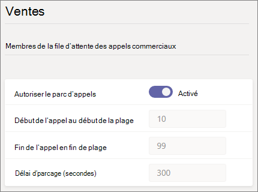

# Parcage et récupération d’appel dans Microsoft Teams

La fonctionnalité Parcer et récupérer des appels permet à un utilisateur de mettre un appel en attente. Lorsqu’un appel est paré, le service génère un code unique pour l’extraction des appels. L’utilisateur qui a parké l’appel ou quelqu’un d’autre peut ensuite utiliser ce code avec une application ou un appareil pris en charge pour récupérer l’appel. (Pour plus [d’informations, voir Park a call in Teams.)](https://support.office.com/article/park-a-call-in-teams-8538c063-d676-4e9a-8045-fc3b7299bb2f)

Voici quelques-uns des scénarios courants d’utilisation du parc d’appels :

- Un appelant appelle une personne travaillant dans une usine. Le réceptioniste annonce ensuite l’appel et le numéro de code sur le système d’adresses public. L’utilisateur pour qui l’appel est en cours peut alors prendre un téléphone Teams aux ateliers et entrer le code pour récupérer l’appel.
- Un utilisateur relaient un appel sur un appareil mobile parce que la batterie de l’appareil est à court de courant. L’utilisateur peut ensuite entrer le code pour récupérer l’appel à partir Teams téléphone de bureau.
- Un représentant du support technique appelle un client et envoie une annonce sur un canal Teams un expert pour récupérer l’appel et aider le client. Un expert entre le code dans Teams clients pour récupérer l’appel

Pour parer et récupérer des appels, un utilisateur doit être un Voix Entreprise et doit être inclus dans une stratégie de parc d’appels.

> [!NOTE]
> Le parcage d’appel et la récupération sont disponibles uniquement [Teams mode](teams-and-skypeforbusiness-coexistence-and-interoperability.md) déploiement uniquement et ne sont pas pris en charge Skype Entreprise téléphones IP.

## Configurer le parc d’appel et la récupération

Vous devez être un administrateur Teams configuration du parc d’appels et de la récupération. Il est désactivé par défaut. Vous pouvez l’activer pour les utilisateurs et créer des groupes d’utilisateurs à l’aide de la stratégie de parc d’appels. Lorsque vous appliquez la même stratégie à un groupe d’utilisateurs, ceux-là peuvent se parer et récupérer les appels entre eux.

Par défaut, la plage de numéros d’appel est de 10 à 99. Vous pouvez également créer votre propre plage personnalisée entre 10-9999. Le premier appel par parcage s’insitie à un code de collecte du début de plage (par exemple, 10). L’appel par parcage suivant s’incrémente d’un code de pick-up de 1. c’est-à-dire, 11, et ainsi de suite, jusqu’à ce que la fin de la plage soit rendue en tant que code de pick-up. Par la suite, les codes de pick-up restituer recommencent depuis le début de la plage. 

Vous pouvez spécifier un délai d’attente, c’est-à-dire le nombre de secondes à attendre avant de sonner à nouveau lorsque l’appel par parcage n’a pas été retenté. La plage autorisée est de 120 à 1800 secondes et la valeur par défaut est 300 secondes.

Pour définir la plage de parc personnalisée et le délai d’utilisation du parc, utilisez les cmdlets New- et Set-CsTeamsCallParkPolicy disponibles dans Teams PowerShell Module 2.6.0 ou une génération ultérieure. (Les changements de plage de parc et de délai d’heures de parc personnalisés ne sont pas gérables dans le Teams d’administration du site. Notez que le Teams centre d’administration continuera d’afficher les valeurs par défaut.)

Pour activer une stratégie de parc d’appels :

1. Dans le panneau de navigation de gauche du Microsoft Teams d’administration, allez à **Stratégies**  >  **de parc d’appel vocal.**
2. Sous **l’onglet Gérer les stratégies,** cliquez sur **Ajouter.**
3. Donnez un nom à la stratégie, puis basculez **l’accès au parc d’appels** **sur On.** (La plage d’appel et le délai d’appel ne peuvent pas être personnalisés.)

    

4. Sélectionnez **Enregistrer**.

Vous pouvez modifier la stratégie en la sélectionnant dans la liste, puis en cliquant sur **Modifier.**

Pour que la stratégie fonctionne, elle doit être attribuée aux utilisateurs. Vous pouvez [affecter la stratégie à des utilisateurs individuellement](assign-policies-users-and-groups.md) ou à un groupe.

Pour affecter une stratégie de parc d’appels à un groupe

1. Dans la page **Stratégies de parc** d’appel, sous l’onglet **Affectation** de stratégie de groupe, cliquez sur Ajouter **un groupe.**
2. Recherchez le groupe que vous voulez utiliser, puis cliquez sur **Ajouter.**
3. Choisissez un rang comparé aux autres affectations de groupe.
4. Sous **Sélectionner une stratégie,** choisissez la stratégie à qui vous voulez affecter ce groupe.

    

5. Sélectionnez **Appliquer.**

## Sujets associés

[Par parcer un appel dans Teams](https://support.office.com/article/park-a-call-in-teams-8538c063-d676-4e9a-8045-fc3b7299bb2f)

[Attribuer des stratégies à vos utilisateurs](policy-assignment-overview.md)

[New-CsTeamsCallParkPolicy](/powershell/module/skype/new-csteamscallparkpolicy)

[Set-CsTeamsCallParkPolicy](/powershell/module/skype/set-csteamscallparkpolicy)

[Grant-CsTeamsCallParkPolicy](/powershell/module/skype/grant-csteamscallparkpolicy)
