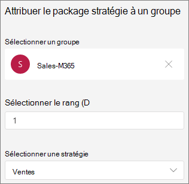

# Parcage et récupération d’appel dans Microsoft Teams

Le parcage d’appels et la récupération est une fonctionnalité qui permet à un utilisateur de mettre un appel en attente. Lorsqu’un appel est garé, le service génère un code unique pour la récupération des appels. L’utilisateur qui a garé l’appel ou une autre personne peut ensuite utiliser ce code avec une application ou un appareil pris en charge pour récupérer l’appel. (Pour plus d’informations, voir [Park a call in Teams](https://support.office.com/article/park-a-call-in-teams-8538c063-d676-4e9a-8045-fc3b7299bb2f).)

Voici quelques-uns des scénarios courants d’utilisation du parc d’appels :

- Une réceptionniste appelle quelqu’un qui travaille dans une usine. Le serveur de réception annonce ensuite l’appel et le numéro de code sur le système d’adressage public. L’utilisateur pour lequel l’appel est destiné peut ensuite prendre un téléphone Teams à l’étage de l’usine et entrer le code pour récupérer l’appel.
- Un utilisateur parcs un appel sur un appareil mobile parce que la batterie de l’appareil est à court d’alimentation. L’utilisateur peut ensuite entrer le code pour récupérer l’appel à partir d’un téléphone de bureau Teams.
- Un représentant du support technique parcs un appel client et envoie une annonce sur un canal Teams pour un expert pour récupérer l’appel et aider le client. Un expert entre le code dans Teams clients pour récupérer l’appel

Pour garer et récupérer des appels, un utilisateur doit être un utilisateur Voix Entreprise et doit être inclus dans une stratégie de parc d’appels.

> [!NOTE]
> Le parc d’appels et la récupération sont disponibles uniquement en [mode de déploiement Teams et](teams-and-skypeforbusiness-coexistence-and-interoperability.md) ne sont pas pris en charge sur Skype Entreprise téléphones IP.

## Configurer le parc d’appels et récupérer

Vous devez être un administrateur Teams pour configurer le parc d’appels et récupérer. Elle est désactivée par défaut. Vous pouvez l’activer pour les utilisateurs et créer des groupes d’utilisateurs à l’aide de la stratégie de parc d’appels. Lorsque vous appliquez la même stratégie à un ensemble d’utilisateurs, ils peuvent stationner et récupérer des appels entre eux.

Par défaut, la plage de numéros de prise d’appel est comprise entre 10 et 99. Vous pouvez également créer votre propre plage personnalisée comprise entre 10 et 9999. Le premier appel parqué affiche un code de prise du début de la plage (par exemple, 10). Le prochain appel parqué sera rendu par un code de prise incrémenté de 1 ; c’est-à-dire, 11, et ainsi de suite, jusqu’à ce que la fin de la plage soit restitagée en tant que code de prise. Après quoi, les codes de prise rendus redémarrent à partir du début de la plage. 

Vous pouvez spécifier un délai d’expiration comme nombre de secondes d’attente avant de sonner en arrière lorsque l’appel parqué n’a pas été récupéré. La plage autorisée est comprise entre 120 et 1800 secondes, et la valeur par défaut est 300 secondes.

Pour activer une stratégie de parc d’appels :

1. Dans le volet de navigation gauche du centre d’administration Microsoft Teams, accédez aux **stratégies de parc VoiceCall** > .
2. Sous l’onglet **Gérer les stratégies** , cliquez sur **Ajouter**.
3. Donnez un nom à la stratégie, puis **basculez Autoriser le parc d’appels** sur **Activé**.
4. Modifiez la plage et le délai d’expiration du parc selon les besoins.
5. Sélectionnez **Enregistrer**.

Vous pouvez modifier la stratégie en la sélectionnant dans la liste et en cliquant sur **Modifier**.

Pour que la stratégie fonctionne, elle doit être affectée aux utilisateurs. Vous pouvez [affecter la stratégie aux utilisateurs individuellement](assign-policies-users-and-groups.md) ou les affecter à un groupe.

Pour affecter une stratégie de parc d’appels à un groupe

1. Dans la page **Stratégies de parc d’appels** , sous l’onglet **Affectation de stratégie** de groupe, cliquez sur Ajouter un **groupe**.
2. Recherchez le groupe que vous souhaitez utiliser, puis cliquez sur **Ajouter**.
3. Choisissez un classement par rapport à d’autres affectations de groupe.
4. Sous **Sélectionner une stratégie**, choisissez la stratégie à laquelle vous souhaitez affecter ce groupe.

    

5. Sélectionnez **Appliquer**.

## Voir aussi

[Garer un appel dans Teams](https://support.office.com/article/park-a-call-in-teams-8538c063-d676-4e9a-8045-fc3b7299bb2f)

[Attribuer des stratégies à vos utilisateurs](policy-assignment-overview.md)

[New-CsTeamsCallParkPolicy](/powershell/module/skype/new-csteamscallparkpolicy)

[Set-CsTeamsCallParkPolicy](/powershell/module/skype/set-csteamscallparkpolicy)

[Grant-CsTeamsCallParkPolicy](/powershell/module/skype/grant-csteamscallparkpolicy)
