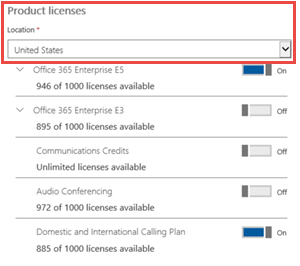

# Forfaits d’appels pour Microsoft Teams

Les appels à d’autres utilisateurs Skype Entreprise et Microsoft Teams sont gratuits, mais si vous souhaitez que vos utilisateurs puissent appeler des téléphones standard et que vous n’avez pas encore de fournisseur de services pour passer des appels vocaux, vous devez acheter Plans d'appel de Microsoft Teams. Pour plus d’informations, consultez [Système téléphonique et forfaits d’appels](calling-plan-landing-page.md).

Voici les options forfaits d’appels :
  
- **Forfait d’appels nationaux** : les utilisateurs disposant d’une licence peuvent appeler des numéros situés dans le pays/la région où ils sont affectés dans Microsoft 365. Nombre illimité de minutes entrantes sont incluses. Les minutes sortantes sont incluses en fonction de la licence achetée.

- **Forfait d’appels internationaux** : les utilisateurs disposant d’une licence peuvent appeler des numéros situés dans le pays/la région où leur licence Microsoft 365 est attribuée à l’utilisateur en fonction de l’emplacement de l’utilisateur, et vers des numéros internationaux dans [196 pays/régions](country-and-region-availability-for-audio-conferencing-and-calling-plans/users-can-make-outbound-calls-to-these-countries-and-regions.md). Nombre illimité de minutes entrantes sont incluses. Les minutes sortantes sont incluses en fonction de la licence achetée.

- **Forfait d’appels** avec paiement à l’utilisation : les utilisateurs disposant d’une licence peuvent appeler des numéros situés dans le pays/la région où leur licence Microsoft 365 est attribuée à l’utilisateur en fonction de l’emplacement de l’utilisateur et vers des numéros internationaux dans  [196 pays/régions](country-and-region-availability-for-audio-conferencing-and-calling-plans/users-can-make-outbound-calls-to-these-countries-and-regions.md). Nombre illimité de minutes entrantes sont incluses. Aucune minute sortante n’est incluse. Tous les appels sortants sont facturés en fonction des minutes utilisées, avec les crédits de communication ou la facturation post-utilisation (pour les abonnements d’appel de nouvelle expérience commerciale uniquement). Les licences sont attribuées aux utilisateurs en fonction de leur emplacement.

  Pour savoir comment financer et utiliser des minutes pour un forfait d’appels avec paiement à l’utilisation, consultez [Comment financer un forfait d’appels](#how-to-fund-a-pay-as-you-go-calling-plan) avec paiement à l’utilisation.

  Vous avez le choix entre deux options de **forfait d’appels** avec paiement à l’utilisation :

  - **Forfait d’appels** avec paiement à l’utilisation Zone-1 : Achetez-le pour les utilisateurs de l’États-Unis et de Porto Rico, au Canada et au Royaume-Uni.
    - Les licences zone 1 ne sont actuellement pas disponibles à la vente dans les États-Unis et Porto Rico, mais elles peuvent être approvisionnées aux utilisateurs des États-Unis et de Porto Rico si elles sont achetées dans d’autres pays.

  - **Forfait d’appels** avec paiement à l’utilisation Zone 2 : Achetez-le pour les utilisateurs en Autriche, Belgique, Croatie, République tchèque, Danemark, Estonie, Finlande, France, Allemagne, Hongrie, Irlande, Italie, Lettonie, Lituanie, Luxembourg, Pays-Bas, Nouvelle-Zélande, Norvège, Pologne, Portugal, Roumanie, Singapour, Slovaquie, Slovénie, Espagne, Suède et Suisse.
    - Les licences Zone 2 ne sont actuellement pas disponibles à la vente dans les États-Unis et Porto Rico.

Tous les utilisateurs du même pays/région (il s’agit de l’emplacement du pays de l’utilisateur défini dans la zone de licence de l’Centre d'administration Microsoft 365) avec le même forfait d’appels partagent un pool de minutes. Par exemple, si vous avez 100 utilisateurs situés dans le même pays/région avec un forfait d’appels nationaux de 120 minutes affecté, ils partagent un pool de 12 000 minutes. Tous les appels dépassant ces minutes sont facturés par minute.

Consultez [Disponibilité des pays et des régions](country-and-region-availability-for-audio-conferencing-and-calling-plans/country-and-region-availability-for-audio-conferencing-and-calling-plans.md) pour en savoir plus sur les minutes mensuelles disponibles pour chaque organisation dans chaque pays/région.

> [!IMPORTANT]
> Le pays/la région est basé sur l’emplacement de la licence de l’utilisateur dans le **Centre d'administration Microsoft 365 Utilisateurs** >  **actifs** et **non** sur l’adresse de facturation indiquée sous le **profil d’organisation** dans le **Centre d'administration Microsoft 365**.

> [!NOTE]
> Le regroupement n’est disponible que sur des forfaits d’appels identiques.

Pour plus d’informations sur les limites d’utilisation et les conditions d’utilisation, consultez [Période de numérotation gratuite d’audioconférence](complimentary-dial-out-period.md).

## Comment acheter des forfaits d’appels

1. Vous devez d’abord acheter une **licence de module complémentaire système téléphonique**. Pour ce faire, [connectez-vous à l’Centre d'administration Microsoft 365 et choisissez **Facturation**](https://go.microsoft.com/fwlink/p/?linkid=868433) > **Acheter des services** > **Abonnements** >  complémentaires **Acheter maintenant**.

    > [!NOTE]
    > En fonction de votre offre, vous devrez peut-être acheter d’autres modules complémentaires avant de pouvoir acheter des licences de système téléphonique. Pour en savoir plus, voir les [Licences de module complémentaire Microsoft Teams](./teams-add-on-licensing/microsoft-teams-add-on-licensing.md).

2. Après avoir acheté des licences de système téléphonique, vous pouvez acheter le forfait d’appels [en vous connectant au Centre d'administration Microsoft 365 et en choisissant **Facturation**](https://go.microsoft.com/fwlink/p/?linkid=868433) > **Acheter des services** > **Abonnements complémentaires**, puis en sélectionnant **Acheter maintenant**. Les forfaits d’appels s’y trouvent.

Vous pouvez acheter et attribuer différents forfaits d’appels à différents utilisateurs, en fonction des besoins de votre organisation. Après avoir sélectionné le forfait d’appels dont vous avez besoin, passez au paiement. Vous attribuez un plan à chaque utilisateur dans le Centre d'administration Microsoft 365. Pour savoir comment procéder, consultez [Attribuer des licences de module complémentaire Microsoft Teams](./teams-add-on-licensing/microsoft-teams-add-on-licensing.md).

## Comment financer un forfait d’appels avec paiement à l’utilisation

Les forfaits d’appels avec paiement à l’utilisation n’ont pas de nombre défini de minutes d’appel sortant, comme les forfaits d’appels nationaux ou internationaux. Au lieu de cela, certains administrateurs peuvent avoir besoin de prendre des mesures supplémentaires pour financer leur forfait d’appels avec paiement à l’utilisation. Tant que le forfait d’appels avec paiement à l’utilisation n’est pas correctement financé, les utilisateurs ne pourront pas passer d’appels sortants.

Il existe deux façons de financer et d’utiliser les minutes avec un forfait d’appels avec paiement à l’utilisation :

- **Acheter des crédits de communication**
  - Cette option est destinée aux clients qui n’ont pas acheté leur forfait d’appels via la nouvelle expérience commerciale (NCE). Ces clients doivent acheter des crédits de communication pour financer leur forfait d’appels avec paiement à l’utilisation.
  - Pour obtenir des instructions sur l’achat et l’attribution de crédits de communication, consultez [Configurer des crédits de communication pour votre organisation](set-up-communications-credits-for-your-organization.md).

- **Acheter le forfait d’appels avec paiement à l’utilisation par le biais de la nouvelle expérience commerciale (NCE)**
  - Les clients qui ont acheté leur forfait d’appels via la nouvelle expérience commerciale peuvent payer les minutes d’appel sortantes qu’ils ont utilisées au cours du mois précédent. C’est également ce que l’on appelle la facturation post-utilisation ou post-consommation.
  - Pour obtenir des instructions sur l’achat d’un forfait d’appels par le biais de la nouvelle expérience commerciale, consultez Activer le paiement à l’utilisation [pour votre abonnement](/microsoft-365/commerce/subscriptions/manage-pay-as-you-go-services) et [Dépassement new commerce pour le paiement à l’utilisation de telco](/partner-center/new-commerce-telco-payg).
  
## Avez-vous un fournisseur de services qui fournit une connectivité RTC locale pour les utilisateurs hybrides ?

Si c’est le cas, vous n’avez pas besoin d’acheter un forfait d’appels. Office 365 Entreprise E5 inclut le module complémentaire **Système téléphonique**, vous pouvez donc passer au paiement.

Ensuite, attribuez les licences du module complémentaire Entreprise E5 ou **Système téléphonique** aux utilisateurs du Centre d'administration Microsoft 365. Pour savoir comment procéder, consultez [Attribuer des licences de module complémentaire Microsoft Teams](./teams-add-on-licensing/microsoft-teams-add-on-licensing.md).

## Informations sur les tarifs

- [Tarification des forfaits d’appels et du système téléphonique](https://www.microsoft.com/microsoft-365/microsoft-teams/voice-calling).
- [Tarification de l’audioconférence](https://www.microsoft.com/microsoft-365/microsoft-teams/online-meetings).

## Pour plus d'informations

Voici d’autres articles qui expliquent comment configurer vos forfaits d’appels :

- [Configurez les forfaits d’appels](set-up-calling-plans.md).
- [Licences de module complémentaire Microsoft Teams](./teams-add-on-licensing/microsoft-teams-add-on-licensing.md).
- [Voici ce que vous obtenez avec le système téléphonique dans Microsoft 365 ou Office 365](./here-s-what-you-get-with-phone-system.md).

## Articles connexes

- [Configurez Skype Entreprise Online](/SkypeForBusiness/set-up-skype-for-business-online/set-up-skype-for-business-online).
- [Configurer Messagerie vocale infonuagique - aide Administration](set-up-phone-system-voicemail.md).
- [Configurez les forfaits d’appels](set-up-calling-plans.md).
- [Ajoutez des fonds et gérez les crédits de communication](add-funds-and-manage-communications-credits.md).
