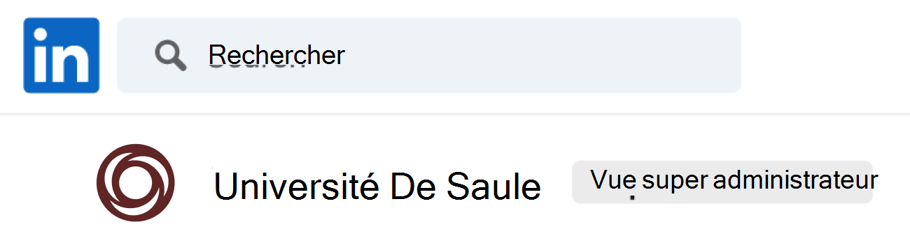
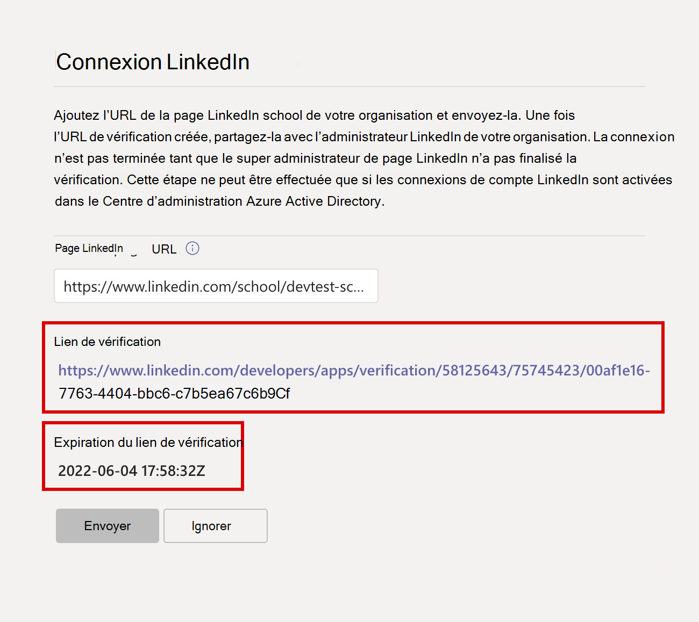

# Configurer Career Coach pour Microsoft Teams

Cet article est destiné aux administrateurs informatiques de l’éducation afin d’apprendre à configurer Career Coach pour Microsoft Teams.

Les principales étapes de configuration, de configuration et de publication de Career Coach sont les suivantes :

1. [Étape 1 : Préparer votre locataire pour Career Coach](#step-1-prepare-your-microsoft-365-tenant-for-career-coach).
1. [Étape 2 : Acheter des licences Career Coach](#step-2-purchase-career-coach-licenses).
1. [Étape 3 : Accéder aux paramètres de Career Coach](#step-3-access-the-career-coach-app-settings).
1. [Étape 4 : Configurer les paramètres de Career Coach](#step-4-configure-career-coach-settings).
1. [Étape 5 : Rendre l’entraîneur de carrière disponible pour votre établissement](#step-5-make-career-coach-available-to-your-institution).

## Identifier les rôles et les autorisations

La configuration de Career Coach nécessite plusieurs types de rôles d’administrateur. Ces rôles et autorisations peuvent être attribués à une personne ou nécessiter une collaboration avec des professionnels de l’informatique de votre établissement d’enseignement. Utilisez la liste de contrôle ci-dessous pour identifier les personnes nécessaires pour effectuer les tâches référencées.

Vous pouvez vérifier les rôles attribués à votre compte en consultant le [Centre d'administration Microsoft 365 > Utilisateurs > Utilisateurs actifs](https://go.microsoft.com/fwlink/p/?linkid=834822) > Sélectionnez votre nom d’utilisateur pour confirmer votre rôle.

En savoir plus sur [les rôles d’administrateur dans le Centre d'administration Microsoft 365](/microsoft-365/admin/add-users/about-admin-roles).

### [Centre d'administration Microsoft 365 tâches](https://go.microsoft.com/fwlink/p/?linkid=2024339)

Rôle : [Administrateur général](/azure/active-directory/roles/permissions-reference#global-administrator)

Tâches de l’entraîneur de carrière :

- [Acheter des licences](#step-2-purchase-career-coach-licenses).
- [Attribuer des licences](#assign-career-coach-licenses-to-users).

### [Tâches du centre d’administration Azure Active Directory](https://go.microsoft.com/fwlink/p/?linkid=2067268)

Rôle : [Administrateur général](/azure/active-directory/roles/permissions-reference#global-administrator)

Tâche de l’entraîneur de carrière :

- [Activez les connexions de compte LinkedIn](#turn-on-linkedin-account-connections).

### [Tâches du Centre d’administration Teams](https://admin.teams.microsoft.com/dashboard)

Rôle : [Administrateur Teams](/azure/active-directory/roles/permissions-reference#teams-administrator)

Tâches de l’entraîneur de carrière :

- [Ajoutez Career Coach en tant qu’application installée](#add-career-coach-as-an-installed-app).
- [Configurez les paramètres de l’application Career Coach](#step-4-configure-career-coach-settings).
- [Configurer des stratégies](#identify-roles-and-permissions).
- [Épinglez l’application](#identify-roles-and-permissions).

### Tâches du portail des développeurs LinkedIn

Rôle : Page [LinkedIn School Super Administration](https://www.linkedin.com/help/linkedin/answer/a541981)

Tâche de l’entraîneur de carrière :

- [Vérifiez la page LinkedIn School](#verify-the-linkedin-school-page).

## Se préparer pour l’entraîneur de carrière

Avant de configurer Career Coach, suivez ces étapes de préparation.

1. [Étape 1 : Préparer votre locataire pour Career Coach](#step-1-prepare-your-microsoft-365-tenant-for-career-coach).
1. [Étape 2 : Acheter des licences Career Coach](#step-2-purchase-career-coach-licenses).

### Étape 1 : Préparer votre locataire Microsoft 365 pour Career Coach

#### Activer les connexions de compte LinkedIn

Il existe deux façons d’utiliser les connexions de compte LinkedIn par Career Coach :

- Pour permettre aux étudiants, aux enseignants et au personnel de connecter leur compte Microsoft 365 à leur compte LinkedIn et [d’envoyer des invitations LinkedIn à partir de Career Coach](https://support.microsoft.com/topic/career-coach-quick-start-guide-for-students-c419db47-9290-4961-9684-c3f86a9b3708#bkmk_connect_your_linkedin_account).
- Pour activer les fonctionnalités [Créer votre réseau](https://support.microsoft.com/topic/career-coach-quick-start-guide-for-students-c419db47-9290-4961-9684-c3f86a9b3708#bkmk_build_your_network) et [Explorer les carrières](https://support.microsoft.com/topic/career-coach-quick-start-guide-for-students-c419db47-9290-4961-9684-c3f86a9b3708#bkmk_discover_your_career_path) à l’aide des données publiques des anciens élèves de LinkedIn.

Pour activer les connexions de compte LinkedIn :

1. Connectez-vous au [Centre d’administration Azure AD](https://go.microsoft.com/fwlink/p/?linkid=2067268) avec un [compte d’administrateur général](#identify-roles-and-permissions) pour l’organisation Azure AD.

2. Sélectionnez **Utilisateurs**.

3. Dans la page **Utilisateurs** , sélectionnez **Paramètres utilisateur**.

4. Les **connexions de compte LinkedIn** doivent être définies sur **Oui** ou **Groupe sélectionné** pour que Career Coach soit correctement configuré.

   - Sélectionnez **Oui** pour activer le service pour tous les utilisateurs de votre établissement d’enseignement.
   - Sélectionnez **Groupe sélectionné** pour activer le service uniquement pour un groupe d’utilisateurs sélectionnés dans votre établissement d’enseignement.

Pour plus d’informations, consultez [Connexions de compte LinkedIn dans Azure Active Directory](/azure/active-directory/enterprise-users/linkedin-integration).

> [!NOTE]
> Aucune donnée n’est partagée sans le consentement de l’utilisateur.

#### Autoriser les applications Microsoft dans Teams

Career Coach étant une application Microsoft, elle doit être autorisée dans les stratégies d’autorisation d’application Teams.

1. Connectez-vous au **[Centre d’administration Teams](https://go.microsoft.com/fwlink/p/?linkid=2066851)**.

2. Dans le volet de navigation de gauche, sélectionnez **Applications** >  Teams **[Stratégies d’autorisation](https://admin.teams.microsoft.com/policies/manage-apps)**.

3. Sélectionnez votre stratégie préférée.
    1. Si vous ne savez pas quelle stratégie utiliser,  [reportez-vous à la documentation](policy-packages-edu.md) Microsoft gestion des stratégies Teams ou utilisez l’Assistant   [Stratégie Éducation](easy-policy-setup-edu.md)pour configurer une stratégie pour Microsoft Teams.

En savoir plus sur [la configuration des stratégies d’autorisation](teams-app-permission-policies.md).

#### Ajouter Career Coach en tant qu’application installée

Cette étape garantit que Career Coach est correctement configuré pour votre établissement et que les étudiants peuvent trouver Career Coach.

1. Connectez-vous au [Centre d’administration Teams](https://go.microsoft.com/fwlink/p/?linkid=2066851).

2. Sélectionnez Stratégies **d’installation des**  **applications** > Teams, puis sélectionnez votre stratégie préférée.
    1. Si vous ne savez pas quelle stratégie utiliser,  [reportez-vous à la documentation](policy-packages-edu.md) Microsoft gestion des stratégies Teams ou utilisez l’Assistant   [Stratégie Éducation](easy-policy-setup-edu.md)pour configurer une stratégie pour Microsoft Teams.

3. Sous **Applications installées**, sélectionnez  **+ Ajouter des applications**.

4. Dans le volet **Ajouter des applications installées** , recherchez les applications que vous souhaitez installer automatiquement pour les utilisateurs lorsqu’ils démarrent Teams. Vous pouvez également filtrer les applications par stratégie d’autorisation d’application.

5. Une fois que vous avez choisi votre liste d’applications, sélectionnez **Ajouter**.

6. Sélectionnez  **Enregistrer** > **Confirmer**.

La modification ou l’affectation d’une stratégie peut prendre quelques heures avant que les modifications prennent effet. L’assistant carrière n’est pas disponible dans Microsoft Teams tant que les modifications ne sont pas terminées.

### Étape 2 : Acheter des licences Career Coach

#### Types de licences

Career Coach nécessite une licence pour accéder à l’application.

Deux types de licences sont disponibles.

- La **licence Student** est conçue pour les étudiants.
- La **licence Faculty** est conçue pour les enseignants, le personnel et les professionnels de l’informatique impliqués dans le soutien aux étudiants avec Career Coach.
  - Une licence Career Coach **Faculty** doit être attribuée à l’administrateur informatique qui termine la configuration.

#### Acheter des licences

Career Coach est disponible dans le monde entier (à l’exception de la Chine et de la Russie) pour les établissements d’enseignement qualifiés sous la forme d’une licence complémentaire via Enrollment for Education Solutions (EES), Cloud Service Providers (CSP) et Centre d'administration Microsoft 365 (web direct).

En tant qu’application Microsoft Teams, le locataire doit avoir Microsoft 365 A3/A5 ou Office 365 A1/A3/A5 pour acheter la licence Career Coach du module complémentaire. Des licences distinctes sont proposées aux étudiants et aux utilisateurs du corps enseignant.

#### S’inscrire à un essai gratuit

Un essai gratuit standard de 90 jours est disponible pour 25 étudiants et 25 licences de professeur. Un essai est disponible par locataire éligible. Les licences d’essai peuvent être activées à partir de Centre d'administration Microsoft 365 par les locataires qualifiés pour acheter des licences Career Coach.

Pour l’activation de la version d’évaluation, connectez-vous à [Centre d'administration Microsoft 365 > Facturation > Acheter des services > recherchez Career Coach](https://go.microsoft.com/fwlink/p/?linkid=868433) pour trouver la [version d’évaluation de la licence étudiant](https://signup.microsoft.com/signup?OfferId=b3a40ff2-3d0d-481e-a0ed-f4de1069f201) et la [version d’évaluation de la licence des enseignants](https://signup.microsoft.com/signup?OfferId=6f6e7db5-b9ab-4baa-86be-f13d0ae6a2c8).

## Configurer et configurer les paramètres de Career Coach

Pour configurer et configurer les paramètres Career Coach pour votre établissement, procédez comme suit.

1. [Étape 3 : Accéder aux paramètres de l’application Career Coach](#step-3-access-the-career-coach-app-settings).
1. [Étape 4 : Configurer les paramètres de Career Coach](#step-4-configure-career-coach-settings).

### Étape 3 : Accéder aux paramètres de l’application Career Coach

Pour configurer les paramètres Career Coach et les autoriser pour les utilisateurs, vous devez être administrateur général ou administrateur de service Teams pour accéder à la page.

1. Connectez-vous au [Centre d’administration Teams](https://go.microsoft.com/fwlink/p/?linkid=2066851).
2. Dans le volet de navigation de gauche, sélectionnez **Applications** > Teams **Gérer les applications**.
3. Recherchez ou recherchez **Career Coach**.
4. Sélectionnez **Career Coach**, puis **Paramètres**.

### Étape 4 : Configurer les paramètres de Career Coach

Les paramètres Career Coach suivants peuvent être configurés pour les étudiants, les enseignants et le personnel.

- [Connexion LinkedIn](#linkedin-connection-required) (obligatoire)
- [Marque et préférences](#brand-and-preferences-optional) (facultatif)
- [Catalogue de cours](#course-catalog-optional) (facultatif)
- [Domaines d’études](#fields-of-study-optional) (facultatif)
- [Options de personnalisation](#customization-options-optional) (facultatif)

#### Connexion LinkedIn (obligatoire)

Le paramètre de connexion LinkedIn connecte Career Coach aux données publiques des anciens élèves de la page LinkedIn School de votre établissement.

Cette étape ne peut être effectuée que si [les connexions de compte LinkedIn sont activées dans Azure Active Directory](#turn-on-linkedin-account-connections). Le paramètre de connexion LinkedIn active les fonctionnalités [Créer votre réseau](https://support.microsoft.com/topic/career-coach-quick-start-guide-for-students-c419db47-9290-4961-9684-c3f86a9b3708#bkmk_build_your_network) et [Explorer les carrières](https://support.microsoft.com/topic/career-coach-quick-start-guide-for-students-c419db47-9290-4961-9684-c3f86a9b3708#bkmk_discover_your_career_path) .

> [!IMPORTANT]
> Il s’agit d’une section obligatoire. Career Coach ne peut pas être activé sans vérification de la connexion de la page LinkedIn School.
>
> La connexion LinkedIn prend en charge plusieurs locataires.

##### Ajouter l’URL de la page LinkedIn School

Le processus d’ajout de l’URL de la page LinkedIn School est géré par un administrateur Teams. L’étape suivante de vérification de l’URL est effectuée par le super administrateur de la page LinkedIn School de votre établissement d’enseignement.

1. Connectez-vous au **[Centre d’administration Teams](https://go.microsoft.com/fwlink/p/?linkid=2066851)**.

2. Sélectionnez **Applications** >  Teams **Gérer les applications** > **Paramètres Career Coach** > **Connexion** > **LinkedIn**.

3. Sélectionnez **Se connecter à LinkedIn**.

4. Recherchez la page LinkedIn School de votre établissement en effectuant une recherche sur LinkedIn et en sélectionnant le filtre **École** . Vous pouvez également contacter un membre du personnel marketing de votre établissement pour déterminer la page LinkedIn School appropriée à utiliser. Pour plus d’informations, consultez [Comment identifier les pages LinkedIn](https://www.linkedin.com/help/linkedin/answer/40133/differences-between-a-linkedin-page-for-a-school-and-company?lang=en).

    

5. Ajoutez **l’URL de la page LinkedIn School**. L’URL doit être une *page scolaire*, et non une *page d’entreprise*, et est généralement au `https://www.linkedin.com/school/willow-university/`format .

   

6. Sélectionnez **Envoyer**.

7. Une fois **l’URL de la page LinkedIn School** correctement envoyée, la page des paramètres est mise à jour pour afficher le  **lien Vérification** et l’expiration du lien   **Vérification**. Le lien de vérification expire au bout de 30 jours.

8. Copiez le **lien Vérification** et partagez-le avec le super administrateur de la page LinkedIn School de votre établissement d’enseignement.

9. Le super administrateur de la page LinkedIn School utilise le lien de vérification unique pour [vérifier la page LinkedIn School](#verify-the-linkedin-school-page) et l’associer à Career Coach.

10. Pour vérifier que la vérification et les paramètres ont bien été envoyés, vérifiez que [l’état de configuration de Career Coach](#configuration-status) est marqué **Comme terminé**.

##### Vérifier la page LinkedIn School

La vérification de la page LinkedIn School doit être effectuée par le [super administrateur de la page LinkedIn School](https://www.linkedin.com/help/linkedin/answer/a541981) de votre établissement d’enseignement.

Vous pouvez vérifier les rôles d’administrateur de votre compte LinkedIn en vous connectant à LinkedIn et en visitant la page LinkedIn School de votre établissement d’enseignement. Si un rôle Super administrateur est attribué à votre compte, **l’affichage Super administrateur** apparaît en regard du nom de votre établissement d’enseignement sur la page LinkedIn. Si vous ne voyez pas la balise **d’affichage Super administrateur** , vous n’êtes pas un super administrateur pour la page de votre établissement scolaire.

1. Une fois **l’URL de la page LinkedIn School** envoyée par l’administrateur Teams, la page affiche le **lien Vérification** et **l’expiration du lien Vérification**. Le lien de vérification expire au bout de 30 jours.

     

2. Copiez le lien de vérification et partagez-le avec votre super administrateur de page LinkedIn School.

3. La page LinkedIn Super administrateur ouvre le lien de vérification pour associer Career Coach à la page de votre établissement scolaire. Pour plus d’informations, consultez [Documentation supplémentaire sur la vérification des pages LinkedIn](https://www.linkedin.com/help/linkedin/answer/102672).

4. Une fois la vérification terminée, l’administrateur Teams peut voir si les paramètres ont été envoyés correctement en vérifiant si [l’état de configuration de Career Coach](#configuration-status) est marqué **Comme terminé**.

   

#### Marque et préférences (facultatif)

Personnalisez Career Coach pour qu’il corresponde à la marque de votre établissement d’enseignement. Vous êtes responsable du respect des droits d’autrui, y compris les droits d’auteur et les droits de marque.

1. Connectez-vous au **[Centre d’administration Teams](https://go.microsoft.com/fwlink/p/?linkid=2066851)**.

2. Sélectionnez **Applications** >  Teams **Gérer les applications** > **Paramètres** > **Career Coach** > **Modifier la marque et les préférences**.

3. Sous **Personnalisation**, ajoutez **Nom de l’organisation**.

4. Chargez **l’icône Organisation**. L’icône est utilisée dans Career Coach pour identifier le contenu propre à votre établissement d’enseignement, les ressources du catalogue de cours dans l’application et dans la section expériences réelles du tableau de bord.

    L’icône est mieux mise en forme comme suit :

    - Un png transparent
    - Proportions de 1:1
    - Taille maximale de 64 px x 64 px

5. Chargez **l’image miniature du contenu d’apprentissage**. La miniature sera utilisée pour les ressources d’apprentissage du catalogue de cours dans l’application lorsqu’une image spécifique n’est pas spécifiée pour un cours proposé par votre établissement d’enseignement.

    La miniature est mieux mise en forme comme suit :

    - UN PNG
    - Proportions de 16:9
    - Taille maximale de 360 px x 200 px

6. Il s’agit d’une étape facultative. Ajoutez **l’URL de la stratégie de confidentialité de l’organisation**. Si elle est ajoutée, la politique de confidentialité de l’établissement sera disponible pour les étudiants à consulter dans Career Coach.

7. Sélectionnez **Envoyer**.

8. Pour vérifier que les paramètres ont bien été envoyés, vérifiez [l’état de configuration de Career Coach](#configuration-status) pour **Terminé**.

#### Catalogue de cours (facultatif)

Le catalogue de cours enregistre les cours et les cours proposés par votre établissement d’enseignement.

Career Coach utilise les données du catalogue de cours pour identifier les compétences d’un étudiant à partir de son relevé de notes et pour suggérer des cours à suivre.

Ces cours sont utilisés dans Career Coach dans deux domaines :

- Les cours sont retournés dans le cadre des [ressources d’apprentissage](https://support.microsoft.com/topic/career-coach-quick-start-guide-for-students-c419db47-9290-4961-9684-c3f86a9b3708#bkmk_grow_real_world_skills).  

- Les cours et les métadonnées de cours, comme les titres et les descriptions des cours, sont utilisés pour aider les étudiants à identifier leurs compétences lorsqu’ils [chargent un relevé de notes](https://support.microsoft.com/topic/career-coach-quick-start-guide-for-students-c419db47-9290-4961-9684-c3f86a9b3708#bkmk_Set_up_your_profile).

Pour créer le catalogue de cours, rassemblez une liste de tous les cours enseignés dans votre établissement d’enseignement et chargez-la sous forme de fichier CSV à l’aide du [format et du schéma du catalogue de cours](#course-catalog-document-format-and-schema).

Commencez par [l’exemple de](https://aka.ms/career-coach/docs/it-admins/sample-catalog)document du catalogue  de cours pour garantir une mise en forme appropriée.Vous pouvez également référencer les sections [de schéma et de format du document du catalogue de cours](#course-catalog-document-format-and-schema) pour plus d’informations sur les champs obligatoires et recommandés.

##### Ajouter le catalogue de cours

1. Connectez-vous au **[Centre d’administration Teams](https://go.microsoft.com/fwlink/p/?linkid=2066851)**.

2. Sélectionnez **Applications** >  Teams **Gérer les applications** > Rechercher des **paramètres** >  **d’assistant** > **professionnel Catalogue de cours**.

3. Sélectionnez **Charger le catalogue de** cours > Charger des cours au format CSV avec les colonnes requises : courseId, title et sourceLink.
    1. Chaque ligne doit inclure des données pour chacune des colonnes requises.
    1. *L’inclusion des champs recommandés améliore l’expérience des étudiants en retournant de meilleurs résultats de recherche et d’identification des compétences.*

4. Un aperçu d’une section du catalogue de cours chargé s’affiche à titre de référence.

5. Sélectionnez **Envoyer** quand vous êtes prêt.

6. [L’état du document chargé](#course-catalog-status) s’affiche dans la page des paramètres.

7. Pour confirmer que les paramètres ont bien été envoyés, vérifiez que [l’état de configuration de Career Coach](#configuration-status) est marqué **Comme terminé**.

Pour charger un nouveau fichier, vérifiez que le dernier fichier est effacé en sélectionnant (**X**) pour fermer l’aperçu du document. Cette action permet au bouton **Charger** de s’afficher à nouveau.

##### Format et schéma du document du catalogue de cours

Le document doit être au format CSV avec une taille maximale de 18 Mo. Les fichiers volumineux doivent être divisés en plusieurs fichiers plus petits comprenant un maximum de 15 000 lignes pour un traitement réussi.

Le document doit contenir les métadonnées de cours requises : **titre du cours**,  **ID du cours** et  **URL du cours**.

Commencez par [l’exemple de]( https://aka.ms/career-coach/docs/it-admins/sample-catalog) document du catalogue de cours pour garantir une mise en forme appropriée. *L’inclusion des champs recommandés améliore l’expérience des étudiants en retournant de meilleurs résultats de recherche et d’identification des compétences.*

Le tableau suivant présente les éléments à inclure dans le catalogue de cours.

| Nom             | Statut      | Type   | Description                                                                    |
|------------------|-------------|--------|--------------------------------------------------------------------------------|
| courseId         | Obligatoire    | String | L’id de cours correspond à ce qui est généré dans le relevé de notes de l’étudiant.             |
| Titre            | Obligatoire    | String | Titre du cours.                                                              |
| sourceLink       | Obligatoire    | URL    | Lien vers la page du cours pour en savoir plus sur le cours et le programme.   |
| Description      | Recommandation | String | Texte d’introduction du cours qui décrit les objectifs d’apprentissage.       |
| language         | Recommandation | String | Langue du cours. Utilisez des codes de langue standard.                           |
| Format           | Recommandation | String | Mode d’enseignement (en ligne, vidéo, en personne).                                   |
| thumbnailLink    | Recommandation | URL    | Lien miniature vers l’image du cours.                                            |
| thumbnailAltText | Recommandation | String | Texte de remplacement de l’accessibilité pour l’image                                           |
| educationLevel   | Recommandation | String | Niveau d’étude, par exemple Premier cycle/cycle supérieur.                                       |
| Sujets           | Recommandation | String | Rubriques ou balises associées aux compétences enseignées par les cours.          |

##### État du catalogue de cours

L’état du catalogue de cours s’affiche dans la page paramètres du catalogue de cours une fois qu’un document a été chargé, fournissant des détails sur l’état de chargement et de traitement du document.

Pendant le traitement, Career Coach analysera votre document à la recherche de doublons, normalisera et enrichira votre catalogue en extrayant les compétences des titres et des descriptions, et le stockera pour l’utiliser dans la page Learn et lors du chargement des relevés de notes des étudiants pour l’identification des compétences.

| Colonne           | Valeur     | Description%                                                                                        |
| ---------------- | --------- | -------------------------------------------------------------------------------------------------- |
| Heure de chargement    | Timestamp | Date et heure à laquelle un administrateur informatique a chargé un document.                                                     |
| Heure d’exécution   | Timestamp | Date et heure de traitement complet du document.                                               |
| Cours chargés | Entier   | Nombre de cours trouvés dans le document.                                                           |
| État d’ingestion | Pending   | Document dans la file d’attente pour traitement.                                                                  |
| État d’ingestion | Exécution   | Le document est en cours de traitement. Ce processus peut prendre jusqu’à 6 heures en fonction de la taille de votre document. |
| État d’ingestion | Opération réussie   | Le processus d’ingestion est terminé et les cours seront disponibles dans Career Coach une fois que tous les paramètres requis seront configurés. |
| État d’ingestion | Échoué    | Vérifiez le format du document et rechargez-le.                                                           |
| Doublons       | Entier   | Nombre de cours en double trouvés dans le document.                                                 |

Si une colonne dans l’état du catalogue de cours est vide, le document est en cours de traitement et ces valeurs ne sont pas disponibles. Ce processus peut prendre jusqu’à 6 heures en fonction de la taille de votre catalogue. Une fois le document traité, les valeurs sont renseignées. Vous pouvez actualiser la page pour rechercher les mises à jour.

#### Domaines d’études (facultatif)

Les domaines d’études sont synonymes de grands domaines d’intérêt, de majeure académique et de programmes de diplôme. Ces domaines d’étude sont référencés par les étudiants lorsqu’ils commencent à utiliser Career Coach et commencent à configurer leur profil personnalisé.

La liste des champs permet aux étudiants de découvrir des domaines d’études susceptibles de les intéresser et d’ajouter leur objectif académique planifié à leur profil dans Career Coach.

> [!IMPORTANT]
> Si vous configurez des champs d’études pour Career Coach, ajoutez tous les domaines d’études disponibles pour les étudiants, tels que l’ingénierie, l’anglais, les affaires, etc.

##### Ajouter les champs d’étude

1. Connectez-vous au **[Centre d’administration Teams](https://go.microsoft.com/fwlink/p/?linkid=2066851)**.

2. Sélectionnez **Applications** >  Teams **Gérer les applications** > Rechercher des **paramètres** >   **d’assistant de** > **carrière Champs d’étude**.

3. Sélectionnez **Charger** pour charger les champs du fichier d’étude au format CSV. Un aperçu des champs du document d’étude s’affiche.

4. Sélectionnez **Envoyer**.

5. Pour vérifier que les paramètres ont bien été envoyés, vérifiez que [l’état de configuration de Career Coach](#configuration-status) est marqué **Comme terminé**.

##### Format et schéma du document d’étude des champs d’étude

Le document doit être au format CSV avec une taille maximale de 18 Mo. Le document doit contenir les métadonnées requises : **Champ du nom de l’étude**.

Le tableau suivant présente les éléments à inclure dans les domaines d’étude :

| Nom          | Statut   | Type   | Description                    |
|---------------|----------|--------|--------------------------------|
| fieldsOfStudy | Obligatoire | String | Nom du domaine d’étude |

#### Options de personnalisation (facultatif)

Le paramètre Personnalisation prend en charge l’ajout d’opportunités d’acquérir des expériences réelles au tableau de bord que votre établissement d’enseignement propose aux étudiants.

Les liens recommandés à inclure doivent aider les étudiants à acquérir une expérience réelle, comme les tableaux d’emploi, les événements, le bureau des services de carrière, les événements liés à la carrière et les clubs étudiants.

1. Connectez-vous au **[Centre d’administration Teams](https://go.microsoft.com/fwlink/p/?linkid=2066851)**.

2. Sélectionnez **Applications** >  Teams **Gérer les applications** > Rechercher les **paramètres** **De l’assistant de carrière** > .

3. Sélectionnez **Personnaliser l’expérience** > **+ Ajouter**

4. Ajoutez chaque **titre**, **URL** et **description d’info-conseil** > Sélectionner **Appliquer**.

5. Un aperçu des informations ajoutées s’affiche.

6. Sélectionnez **Envoyer**.

### État des paramètres Career Coach

La page des paramètres Career Coach dans le Centre d’administration Teams fournit un résumé de l’état des étapes incomplètes, en attente, terminées et ayant échoué pour la configuration de Career Coach.

Le message d’état peut vous aider à déterminer si Career Coach est correctement configuré et prêt à être publié sur votre locataire.

#### État de la configuration

La section État de configuration de la page des paramètres de l’application affiche l’état en temps réel à l’aide de la légende suivante.

| Catégorie                    | Statut                                        | Description                                                 |
| --------------------------- | --------------------------------------------- | ----------------------------------------------------------- |
| État d’approvisionnement du service | Career Coach initialise votre locataire.     | L’approvisionnement du service se produit automatiquement lors de l’accès à la page des paramètres Career Coach. Les modifications de configuration ne seront pas acceptées tant que l’installation initiale n’est pas terminée. La durée estimée de l’approvisionnement du service est de 15 minutes. |
| État d’approvisionnement du service | Career Coach est prêt à être configuré.       | La page des paramètres de Career Coach est prête à être envoyée par l’administrateur informatique. |
| Marque et préférences       | Non démarré                                   | Paramètres non envoyés. Il s’agit d’une étape facultative qui n’empêche pas la fin de la configuration. |
| Marque et préférences       | Manquant : icône d’apprentissage                        | Chargez une image miniature de contenu d’apprentissage. |
| Marque et préférences       | Manquant : logo                                 | Icône De chargement d’une institution. |
| Marque et préférences       | Manquant : Nom de l’institution                     | Charger le nom d’une institution. |
| Marque et préférences       | Complet                                      | La définition est terminée. |
| Chargement du catalogue de cours       | Non démarré                                   | Catalogue de cours non soumis. Il s’agit d’une étape facultative qui n’empêche pas la fin de la configuration. |
| Chargement du catalogue de cours       | Manquant : chargement réussi du catalogue de cours   | Vérifiez l’état du catalogue de cours pour plus d’informations sur le traitement du catalogue de cours. |
| Chargement du catalogue de cours       | Complet                                      | La définition est terminée. |
| Connexion LinkedIn school  | Non démarré                                   | URL de la page LinkedIn School non envoyée. |
| Connexion LinkedIn school  | Manquant : URL de page LinkedIn School approuvée | En attente de l’approbation de vérification super administrateur de la page LinkedIn School. |
| Connexion LinkedIn school  | Complet                                      | Aucune action supplémentaire n’est nécessaire. La définition est terminée. |
| Chargement des champs d’étude      | Non démarré                                   | Champ d’étude CSV non soumis. Il s’agit d’une étape facultative qui n’empêche pas la fin de la configuration. |
| Chargement des champs d’étude      | Manquant : domaines d’intérêt                    | Vérifiez si le chargement du champ d’étude a réussi. |
| Chargement des champs d’étude      | Complet                                      | La définition est terminée. |

Une fois que toutes les étapes requises sont marquées comme terminées, Career Coach peut être publié avec succès sur votre locataire.

## Étape 5 : Mettre un coach de carrière à la disposition de votre établissement

À ce stade, Career Coach a été configuré pour votre établissement.

Ensuite, suivez ces étapes pour vous assurer que Career Coach est disponible pour votre établissement dans Microsoft Teams.

### Attribuer des licences Career Coach aux utilisateurs

Pour obtenir des instructions pas à pas, consultez [Attribuer des licences aux utilisateurs](/microsoft-365/admin/manage/assign-licenses-to-users).

### Configurer des stratégies et épingler l’application

L’épinglage de Career Coach l’ajoute au rail gauche de la fenêtre Microsoft Teams pour la rendre plus accessible et visible pour les étudiants. Si vous préférez épingler Career Coach pour un sous-ensemble de vos utilisateurs, vous devez implémenter une [stratégie d’installation](teams-app-setup-policies.md) avec ce groupe inclus.

1. Connectez-vous au **[Centre d’administration Teams](https://go.microsoft.com/fwlink/p/?linkid=2066851)**.

2. Sélectionnez **Applications Teams** > **Stratégies d’installation** , puis sélectionnez votre stratégie préférée.

    Si vous ne savez pas quelle stratégie utiliser, reportez-vous à la [documentation Microsoft gestion des stratégies Teams](policy-packages-edu.md) ou utilisez l’Assistant [Stratégie Éducation](easy-policy-setup-edu.md) pour configurer une stratégie pour Microsoft Teams.

3. Sous **Applications épinglées**, choisissez **Ajouter des applications**.

4. Sélectionnez votre stratégie préférée sous **Rechercher en fonction de cette stratégie d’autorisation d’application**.

5. Recherchez **Career Coach** sous **Rechercher par nom**, puis sélectionnez  **Ajouter** > **ajouter** pour fermer le volet.

6. Choisissez l’ordre d’affichage de l’application, puis sélectionnez **Confirmer**.

Les étudiants seront avertis dans Microsoft Teams que Career Coach a été épinglé.
