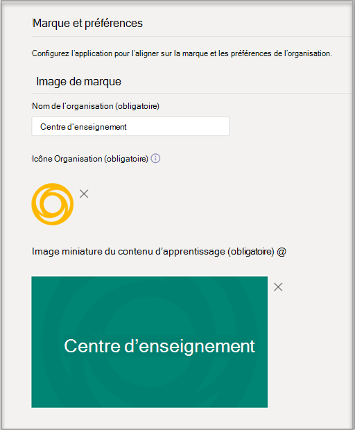

# Acheter, configurer et activer Career Coach pour les Microsoft TeamsPurchase, configure, and enable Career Coach for Microsoft Teams

Career Coach est une application Microsoft Teams Éducation optimisée par LinkedIn qui fournit des conseils personnalisés aux étudiants des niveaux supérieurs pour qu’ils naviguent dans leur carrière.Career Coach is a Microsoft Teams for Education app powered by LinkedIn that provides personalized guidance for higher education students to navigate their career journey. Career Coach offre aux établissements d’enseignement une solution de carrière unifiée qui permet aux étudiants de découvrir leur carrière, de développer des compétences réelles et de développer leur réseau au même endroit.Career Coach offers educational institutions a unified career solution for students to discover their career path, grow real-world skills, and build their network all in one place.

En savoir plus sur [Career Coach.](https://aka.ms/career-coach)Learn more about [Career Coach](https://aka.ms/career-coach).

> [!NOTE]
> Utilisez les meilleures pratiques et les conseils utiles de ce guide pour activer les fonctionnalités de Career Coach pour les étudiants, les enseignants et le personnel.Use the best practices and helpful tips in this guide to enable the capabilities of Career Coach for students, faculty, and staff. Consultez [l’article du guide de planification](https://support.microsoft.com/office/c5d0b934-bfcf-4fe7-8a85-ba7bbb1b6ad4) rapide.See the [Quick planning guide](https://support.microsoft.com/office/c5d0b934-bfcf-4fe7-8a85-ba7bbb1b6ad4) article.

## Examiner les conditions requisesReview the requirements

Pour activer Career Coach pour votre établissement d’enseignement, examinez ce dont vous avez besoin pour rendre l’application opérationnel.To enable Career Coach for your educational institution, review what you need to get the app up and running.

**Configuration technique requise****Technical requirements**

  - Office 365 client avec Azure Active DirectoryOffice 365 tenant with Azure Active Directory

  - Microsoft TeamsMicrosoft Teams

  - Connexions de compte LinkedIn dans Azure Active DirectoryLinkedIn account connections in Azure Active Directory

**Licences****Licenses**

  - EnseignantsFaculty 

  - ÉtudiantsStudents

> [!NOTE]
> Une licence pour l’enseignant de Career Coach doit être attribuée à l’administrateur informatique qui complète la configuration.A Career Coach Faculty license must be assigned to the IT admin completing the configuration.

**Données et fichiers de votre établissement d’enseignement****Data and files from your educational institution**

  - Données du catalogue de coursCourse catalog data

  - Champs d’étude proposésFields of study offered

  - Page LinkedIn de l’établissement d’enseignementEducational institution’s LinkedIn page

  - Abonnement LinkedIn Learning campus (préféré)LinkedIn Learning campus subscription (preferred)

## Acheter les licences Career CoachPurchase the Career Coach licenses

Career Coach est disponible dans le monde entier (sauf en Chine et en Russie) pour les établissements d’enseignement supérieur qualifiés via enrollment for Education Solutions (EES), les fournisseurs de services cloud et le centre d’administration Microsoft 365 (direct web).Career Coach is available worldwide (except China and Russia) for qualified higher education institutions through Enrollment for Education Solutions (EES), Cloud Service Providers (CSP), and Microsoft 365 admin center (web direct). En tant Microsoft Teams, les clients doivent avoir une Microsoft 365 A3/A5 ou Office 365 A1/A3/A5.As a Microsoft Teams app, customers must have Microsoft 365 A3/A5 or Office 365 A1/A3/A5.

### Attribuer des licences d’application aux utilisateursAssign app licenses to users

Pour obtenir des instructions détaillées, voir [Attribuer des licences aux utilisateurs.](https://docs.microsoft.com/microsoft-365/admin/manage/assign-licenses-to-users)For step-by-step instructions, see [Assign licenses to users](https://docs.microsoft.com/microsoft-365/admin/manage/assign-licenses-to-users).

### Activer les connexions de compte LinkedInTurn on LinkedIn account connections

Career Coach **nécessite** que les utilisateurs de votre établissement d’enseignement ont la possibilité de connecter leur compte Microsoft 365 à leur compte LinkedIn, qui est facilité au sein de Career CoachCareer Coach **requires** your educational institution’s users to have the ability to connect their Microsoft 365 account to their LinkedIn account that is facilitated within Career Coach

1. Connectez-vous [au Centre d’administration Azure AD](https://aad.portal.azure.com/) avec un compte administrateur global pour l’organisation Azure AD.Sign in to the [Azure AD admin center](https://aad.portal.azure.com/) with an account that's a global admin for the Azure AD organization.

2. Sélectionnez **Utilisateurs.**Select **Users**.

3. Dans la page **Utilisateurs,** sélectionnez **Paramètres utilisateur.**On the **Users** page, select **User settings**.

4. Sous **connexions de compte LinkedIn,** autorisez les utilisateurs à connecter leurs comptes pour accéder à leurs connexions LinkedIn au sein de certaines applications Microsoft.Under **LinkedIn account connections**, allow users to connect their accounts to access their LinkedIn connections within some Microsoft apps. Aucune donnée n’est partagée tant que les utilisateurs n’ont pas accepté de connecter leur compte.No data is shared until users consent to connect their accounts.

   - Sélectionnez **Oui** pour activer le service pour tous les utilisateurs de votre établissement d’enseignementSelect **Yes** to enable the service for all users in your educational institution

   - Groupe **sélectionné pour** activer le service uniquement pour un groupe d’utilisateurs sélectionnés dans votre établissement d’enseignementSelect **Selected group** to enable the service for only a group of selected users in your educational institution

   - Sélectionnez **Non pour** retirer le consentement de tous les utilisateurs de votre établissement d’enseignementSelect **No** to withdraw consent from all users in your educational institution

Découvrez comment intégrer [des connexions de compte LinkedIn dans Azure Active Directory](/azure/active-directory/enterprise-users/linkedin-integration)Learn how to [Integrate LinkedIn account connections in Azure Active Directory](/azure/active-directory/enterprise-users/linkedin-integration)

## Configurer Career Coach dans le centre d’administration Teams’équipeConfigure Career Coach in the Teams admin center

En utilisant les paramètres d’administration du Microsoft Teams d’administration, vous pouvez configurer Career Coach pour votre établissement d’enseignement et l’activer pour les utilisateurs.Using the admin settings in the Microsoft Teams admin center, you can configure Career Coach for your educational institution and enable it for users.

## Accéder aux paramètres de l’application Career CoachAccess the Career Coach app settings

Utilisez la [page Gérer les applications](/microsoftteams/manage-apps) pour afficher les Teams dans le catalogue d’applications de votre établissement d’enseignement.Use the [Manage apps page](/microsoftteams/manage-apps) to view the Teams apps in your educational institution’s app catalog.

1. Connectez-vous au **Teams d’administration.**Sign in to the **Teams admin center**.

2. Dans la barre de navigation gauche, **sélectionnez Teams**  >  **applications Gérer les applications.**In the left navigation, select **Teams apps** > **Manage apps**.  

    > [!NOTE]
    > Vous devez être un administrateur global ou un Teams de service pour accéder à la page.You must be a global admin or Teams service admin to access the page.

3. Recherchez Career Coach ou **recherchez-le.**Search or browse for **Career Coach**.  

4. Sélectionnez **Career Coach,** puis **sélectionnez Paramètres.**Select **Career Coach**, and then select **Settings.**  

    

### Configurer les paramètres de l’application Career CoachConfigure the Career Coach app settings

Career Coach se classe dans cinq catégories de configuration :Career Coach has five configuration categories:

- [Marque et préférencesBrand and preferences](#brand-and-preferences)

- [Configuration de LinkedInLinkedIn configuration](#linkedin-configuration)

- [Catalogue de coursCourse catalog](#course-catalog)

- [Champs d’étudeFields of study](#fields-of-study)

- [PersonnalisationCustomization](#customization)

> [!NOTE]
> La marque et les préférences, la configuration de  LinkedIn, le catalogue de cours et les champs d’étude sont requis pour activer efficacement l’application pour les étudiants, les enseignants et le personnel.Brand and preferences, LinkedIn configuration, Course catalog, and Fields of study are **required** to effectively enable the app for students, faculty, and staff.

#### Marque et préférencesBrand and preferences

Définissez le nom, le logo et la langue par défaut de votre établissement d’enseignement sur la page des paramètres de marque et de préférences.Set your educational institution’s name, logo, and default language on the brand and preferences settings page.

##### Icône établissement d’enseignementEducational institution icon

L’icône d’un établissement d’enseignement est utilisée dans Career Coach pour identifier le contenu propre à votre établissement d’enseignement, les ressources du catalogue de cours dans l’application et la section des expériences réelles du tableau de bord.The educational institution icon is used throughout Career Coach to identify content unique to your educational institution, course catalog resources throughout the app, and on the real-world experiences section of the dashboard. Pour ce faire, il est préférable d’avoir la mise en forme la plus à jour :The icon is best formatted as:

 - A transparent PNGA transparent PNG
 - Proportions de 1:1Aspect ratio of 1:1
 - Taille maximale de 64 px x 64 px.Maximum size of 64 px x 64 px.

##### Miniature établissement d’enseignementEducational institution thumbnail

L’icône d’un établissement d’enseignement sera utilisée pour les ressources du catalogue de cours dans l’application lorsqu’une image spécifique n’est pas disponible pour un cours.The educational institution icon will be used for course catalog resources throughout the app when a specific image isn't available for a course. Pour ce faire, il est préférable d’avoir la mise en forme la plus à jour :The icon is best formatted as:

- A PNGA PNG
- Proportions de 16:9Aspect ratio of 16:9
- Taille maximale de 360 px x 200 px.Maximum size of 360 px x 200 px.

#### Configuration de LinkedInLinkedIn configuration

La configuration de LinkedIn connecte Career Coach aux données des anciens élèves de LinkedIn.The LinkedIn configuration connects Career Coach with public alumni data from LinkedIn.

> [!NOTE]
> Career Coach ne peut pas être activé sans la connexion à la page LinkedIn vérifiée.Career Coach can't be enabled without the LinkedIn page connection verified.

##### Ajouter et confirmer la page LinkedInAdd and confirm the LinkedIn page

Déterminez la page LinkedIn de l’établissement d’enseignement.Determine the educational institution's LinkedIn page. Recherchez la page LinkedIn en recherchant sur LinkedIn ou en vous connectant avec un membre du personnel des services de carrière afin de déterminer la page à utiliser.Find the LinkedIn page by searching on LinkedIn or connecting with a career services staff member to determine the correct page to use.  
  
1. Connectez-vous au **Teams d’administration.**Sign in to the **Teams admin center**.

1. Sélectionnez **Teams applications**  >  **Gérer les applications** Connexion  >    >  **LinkedIn de Career** Coach.Select **Teams apps** > **Manage apps** > **Career Coach** > **LinkedIn connection**.

2. Entrez l’URL de la page LinkedIn de votre établissement d’enseignement.Enter your educational institution's LinkedIn page URL.  

3. Sélectionnez **Appliquer.**Select **Apply**.

4. Copiez l’URL de vérification et partagez-la avec la documentation de l’administrateur de la page LinkedIn de votre établissement d’enseignement [LinkedIn.](https://www.linkedin.com/help/linkedin/answer/4783/linkedin-page-admins-overview?lang=en)Copy the verification URL and share it with your educational institution’s LinkedIn page admin [LinkedIn page admin documentation](https://www.linkedin.com/help/linkedin/answer/4783/linkedin-page-admins-overview?lang=en). Le lien de vérification expire après 30 jours.The verification link expires after 30 days.  

     

#### Catalogue de coursCourse catalog

Le catalogue de cours représente les cours et les cours proposés aux étudiants par votre établissement d’enseignement.The course catalog represents the courses and classes offered to students by your educational institution. Ces cours sont utilisés au sein de l’application dans deux zones :These courses are used within the app in two areas:

- Les cours sont renvoyés dans le cadre des ressources d’apprentissage.Courses are returned as part of learning resources.  

- Les données méta des cours et des cours, telles que les descriptions, permettent aux étudiants d’identifier leurs compétences lorsqu’ils téléchargent une transcription.Courses and course meta data, like descriptions, are used to help students identify their skills when they upload a transcript.  

Pour créer le catalogue de cours, créez une liste de tous les cours qui ont été appris dans votre établissement d’enseignement et téléchargez-le dans un fichier CSV.To create the course catalog, put together a list of all courses taught at your educational institution and upload it as a CSV file. L’application dessine à partir du catalogue de cours pour identifier les compétences d’un étudiant à partir de sa transcription et pour suggérer des cours à prendre.The app draws from the course catalog to identify a student’s skills from their transcript and to suggest courses to take. 

> [!NOTE]
> Pour [plus d’informations sur](location-of-data-in-teams.md)  la protection des informations sur les étudiants, voir Emplacement des données Teams sécurité et conformité.See [Location of data in Teams](location-of-data-in-teams.md) and [Security and compliance](security-compliance-overview.md) for information about protecting of student information. 

##### Mise en forme et schéma des documents du catalogue de coursCourse catalog documents formatting and schema

Le document doit être au format CSV avec une taille maximale de 18 Mo.The document needs to be in CSV format with a maximum size of 18 MB. Le document doit contenir le titre du **cours,** **l’ID** du cours et **l’URL du cours requis.**The document must contain the required fields **course title**, **course ID**, and **course URL**. L’inclure dans les champs recommandés améliore l’expérience pour les étudiants en renvoyant de meilleurs résultats de recherche et une identification de compétence.Including the recommended fields improves the experience for students by returning better search results and skill identification.

> [!NOTE]
> Commencez avec l’exemple de document [du catalogue de]( https://aka.ms/career-coach/docs/it-admins/sample-catalog) cours pour commencer.Start with the [sample course catalog]( https://aka.ms/career-coach/docs/it-admins/sample-catalog) document to get started.

Le tableau suivant répertorie les éléments à inclure dans le catalogue des cours :The following table shows the items to include in the course catalog:

| NomName             | StatutStatus      | TypeType   | DescriptionDescription                                                                    |
|------------------|-------------|--------|--------------------------------------------------------------------------------|
| courseIdcourseId         | ObligatoireRequired    | chaînestring | Généralement, l’ID du cours (indique généralement ce qui est généré dans la transcription).Usually the course id (Typically maps to what is generated in the transcript). |
| titretitle            | ObligatoireRequired    | chaînestring | Généralement le titre du cours.Usually the course title.                                                      |
| sourceLinksourceLink       | ObligatoireRequired    | URLURL    | Lien vers la page du cours.Website link to the course page.                                               |
| descriptiondescription      | RecommandationRecommended | chaînestring | Texte d’introduction au cours.Introduction text for the course.                                              |
| languelanguage         | RecommandationRecommended | chaînestring | Langue du cours.Language of the course. Utilisez des codes de langue standard.Use standard language codes.                           |
| formatformat           | RecommandationRecommended | chaînestring | Mode d’enseignement (par exemple, en ligne, vidéo, en personne).Mode of teaching, e.g., online, video, in-person.                              |
| thumbnailLinkthumbnailLink    | RecommandationRecommended | URLURL    | Lien miniature vers l’image du cours.Thumbnail link to the course image.                                            |
| thumbnailAltTextthumbnailAltText | RecommandationRecommended | chaînestring | Texte de alt sur l’accessibilité de l’imageAccessibility alt text for the image                                           |
| educationLeveleducationLevel   | RecommandationRecommended | chaînestring | Niveau d’étude, par exemple.Study level, ex. Cycle/diplômé.Undergraduate/Graduate.                                       |
| rubriquestopics           | RecommandationRecommended | chaînestring | Rubriques ou balises associées aux compétences apprises dans les cours.Topics or tags that are associated with the skills the courses teach.          |

##### Ajouter le catalogue de coursAdd the course catalog

1. Connectez-vous au **Teams d’administration.**Sign in to the **Teams admin center**.

1. Sélectionnez **Teams applications Gérer** les &gt; **applications** Career &gt; **Coach** &gt; **Paramètres** catalogue &gt; **de cours.**  Select **Teams apps** &gt; **Manage apps** &gt; **Career Coach** &gt; **Settings** &gt;  **Course catalog**.

2. Télécharger cours au format CSV.Upload courses in CSV format.

4. Sélectionnez **Appliquer.**Select **Apply**.

   

#### Champs d’étudeFields of study

Les champs d’étude sont synonymes de domaines d’intérêt majeurs, de réussites universitaires et de degrés.The fields of study are synonymous with major areas of interest, academic major, and degree. Ces titres sont référencés par les étudiants lorsqu’ils commencent à utiliser l’application et commencent à définir leur profil personnalisé.These titles are referenced by students when they start using the app and begin setting up their personalized profile.

Ajoutez tous les champs d’étude disponibles aux étudiants tels que Ingénierie, Anglais, Entreprise, etc.Add all fields of study available to students such as Engineering, English, Business, and so on. La liste de champs permet aux étudiants de découvrir des champs d’étude qui peuvent les intéresser et d’ajouter leur zone de focus à leur profil.The list of fields lets students discover fields of study that may interest them and add their area of focus to their profile.

> [!NOTE]
> Commencez par le [champ d’exemple du](https://aka.ms/career-coach/docs/it-admins/sample-fieldsofstudy) document d’étude.Start with the [sample field of study](https://aka.ms/career-coach/docs/it-admins/sample-fieldsofstudy) document.
##### Ajouter les champs de l’étudeAdd the fields of study

1. Connectez-vous au **Teams d’administration.**Sign in to the **Teams admin center**.
1. Sélectionnez **Teams applications** &gt; **Gérer les applications** Career &gt; **Coach** &gt; **Paramètres** &gt; **des champs d’étude.**  Select **Teams apps** &gt; **Manage apps** &gt; **Career Coach** &gt; **Settings** &gt;  **Fields of study**.

2. Télécharger d’étude au format CSV.Upload field of study in CSV format.

3. Sélectionnez **Appliquer.**Select **Apply**.

#### PersonnalisationCustomization

Career Coach peut être personnalisé pour être unique dans votre établissement d’enseignement.Career Coach can be customized to be unique to your educational institution. La personnalisation prend en charge l’ajout d’expériences au tableau de bord.The customization supports adding experiences to the dashboard. Il est recommandé d’ajouter des liens vers des offres d’emploi, des événements, des services de carrière, des événements professionnels, des clubs d’étudiants et toute autre ressource qui aident les étudiants à acquérir une expérience réelle.It's recommended to add links to job boards, events, career services office, career-related events, student clubs, and any other resources that help students gain real-world experience.

##### Ajouter des expériences personnaliséesAdd customized experiences

1. Connectez-vous au **Teams d’administration.**Sign in to the **Teams admin center**.

1. Sélectionnez **Teams applications Gérer** les &gt; **applications** Career &gt; **Coach**  >  **Paramètres** &gt; **personnalisation.**Select **Teams apps** &gt; **Manage apps** &gt; **Career Coach** > **Settings** &gt; **Customization**.

2. Ajoutez chaque URL, un titre et une courte description.Add each URL, a title, and short description.  
  
3. Sélectionnez **Appliquer.**Select **Apply**.

## Rendre Career Coach disponible pour votre organisationMaking Career Coach available to your organization

Maintenant que Career Coach est configuré pour votre organisation.Now that Career Coach has been configured for your organization. Suivez ces étapes pour vous assurer que Career Coach soit disponible pour l’organisation dans Microsoft Teams.Follow these steps to ensure that Career Coach is available to organization in Microsoft Teams.

### Activer l’applicationEnable the app

Une fois la configuration terminée, activez l’application pour les étudiants et les utilisateurs titulaires d’une licence afin qu’ils ont accès à Career Coach.After you complete the configuration, enable the app for students and licensed users so they'll have access to Career Coach.  
  
> [!NOTE]
> Vous devez avoir des autorisations de rôle d Teams global ou d’administrateur.You must have Global or Teams admin role permissions.

1. Connectez-vous au **Teams d’administration.**Sign in to the **Teams admin center**.

1. Sélectionnez **Teams applications** &gt; **Gérer les applications** Career &gt; **Coach.**Select **Teams apps** &gt; **Manage apps** &gt; **Career Coach**.

2. Déplacez le basculement Statut sur **Autorisé.**Move the Status toggle to **Allowed**.  

  > [!NOTE]
  > Autorisé signifie que l’application est disponible pour les utilisateurs de votre établissement d’enseignement.Allowed means that the app is available for users in your educational institution. Bloqué signifie que l’application n’est pas disponible pour les étudiants.Blocked means that the app isn't available to students.

### Ajouter Career Coach en tant qu’application installéeAdd Career Coach as an installed app

> [!NOTE]
> Cette étape garantit que 1) Career Coach est correctement configuré pour votre organisation 2) que les étudiants trouvent Career Coach.This step ensures 1) that Career Coach is properly configured for your organization 2) that students find Career Coach.

1. Connectez-vous au **Teams d’administration.**Sign in to the **Teams admin center**.

2. Sélectionnez **Teams** &gt; **stratégies de configuration des applications** Votre &gt; *stratégie.*Select **Teams apps** &gt;**Setup policies** &gt; *Your policy*. 

3. Sous Applications installées, sélectionnez Ajouter des applications.Under Installed apps, select Add apps.

4. Dans le volet Ajouter des applications installées, recherchez les applications que vous voulez installer automatiquement pour les utilisateurs lorsqu’ils démarrent une Teams.In the Add installed apps pane, search for the apps you want to automatically install for users when they start Teams. Vous pouvez également filtrer les applications par stratégie d’autorisation d’application.You can also filter apps by app permission policy. Lorsque vous avez choisi votre liste d’applications, sélectionnez Ajouter.When you've chosen your list of apps, select Add.

### Épingler l’applicationPin the app

L’épinglage de Career Coach rend l’application plus accessible et visible pour les étudiants.Pinning Career Coach will make the app more accessible and visible for students.

1. Connectez-vous au **Teams d’administration.**Sign in to the **Teams admin center**.

2. Sélectionnez **Teams** &gt; **stratégies de configuration des applications** Votre &gt; *stratégie.*Select **Teams apps** &gt;**Setup policies** &gt; *Your policy*. 

3. Sous **Applications épinglées,** **sélectionnez Ajouter des applications.**Under **Pinned apps**, choose **Add apps**.

4. Recherchez **Career Coach,** puis sélectionnez **Ajouter.**Search for **Career Coach**, and then select **Add**.

5. Choisissez l’ordre d’apparition de l’application, puis sélectionnez **Enregistrer.**Choose the order for the app to appear and select **Save**.

> [!NOTE]
> Les étudiants seront avertis dans un Microsoft Teams que Career Coach a été épinglé.Students will be notified in Microsoft Teams that Career Coach has been pinned.

Pour plus [d’informations,](https://docs.microsoft.com/microsoftteams/teams-app-setup-policies) référez-vous à Gérer les stratégies de configuration d’application dans Microsoft.Reference [Manage app setup policies in Microsoft](https://docs.microsoft.com/microsoftteams/teams-app-setup-policies) for additional details.

## RessourcesResources

Les ressources suivantes vous aideront à planifier votre application Career Coach.The following resources will help you plan your Career Coach app.

- [Bienvenue dans Microsoft TeamsWelcome to Microsoft Teams](Teams-overview.md)

- [Comment déployer TeamsHow to roll out Teams](get-started-with-teams-resources-for-org-wide-rollout.md?tabs=SmallBusiness)

- [Présentation des équipes et des canaux dans Microsoft TeamsOverview of teams and channels in Microsoft Teams](teams-channels-overview.md)

- [Gestion des applications dans Microsoft Teams Centre d’administrationManaging apps in Microsoft Teams Admin Center](manage-apps.md)

- [Sécurité, confidentialité et conformité dans Microsoft TeamsSecurity, privacy, and compliance in Microsoft Teams](security-compliance-overview.md)

- [Kit d’orientation virtuelle en ligneOnline Virtual Orientation Kit](https://www.microsoft.com/education/remote-learning/virtual-orientation) 

- [Limites et spécification des canaux Teams clientsLimits and specification of Teams channels](limits-specifications-teams.md)

- [Emplacement des données dans Microsoft TeamsLocation of data in Microsoft Teams](location-of-data-in-teams.md)

- [Formation pour les administrateurs sur Microsoft TeamsGetting started with admin training for Microsoft Teams](ITAdmin-readiness.md)

- [Résolution des problèmes de TeamsTeams troubleshooting](/microsoftteams/troubleshoot/teams-welcome)

- [Gérer les stratégies d’autorisation d’application dans Microsoft TeamsManage app permission policies in Microsoft Teams](teams-app-permission-policies.md)
