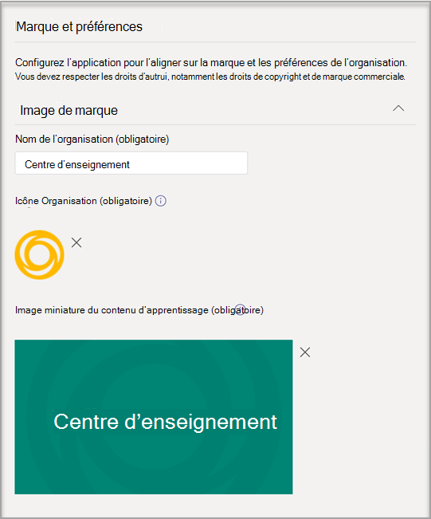
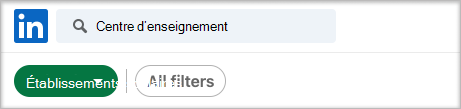
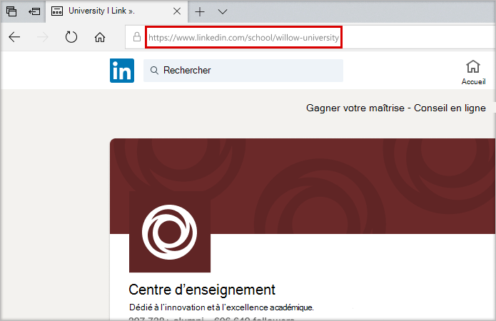
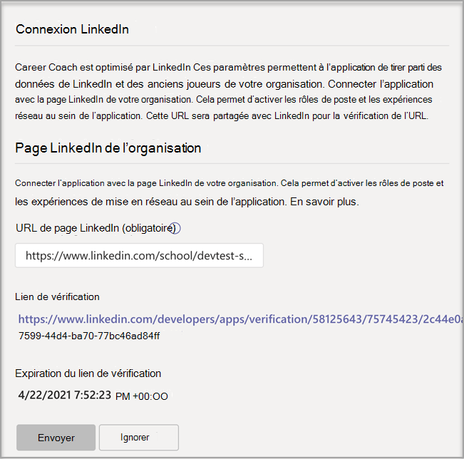
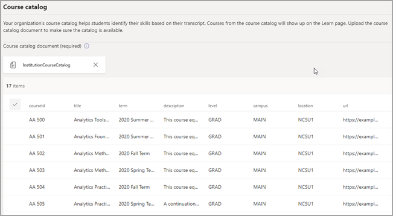

# Acheter, configurer et activer des Conseiller d'orientation pour Microsoft Teams

Conseiller d'orientation est une application Microsoft Teams pour l'éducation optimisée par LinkedIn qui fournit des conseils personnalisés aux étudiants de l’enseignement supérieur pour parcourir leur parcours professionnel. Conseiller d'orientation offre aux établissements d’enseignement une solution de carrière unifiée qui permet aux étudiants de découvrir leur carrière, de développer leurs compétences réelles et de développer leur réseau au même endroit.

## Langues prise en charge

Conseiller d'orientation langues sont localisées dans les langues suivantes :

- Chinois (simplifié, Chine de mer)
- Chinois (traditionnel, Taïwan)
- Anglais (É.U.)
- Anglais (Royaume-Uni)
- Français (Canada)
- Français (France)
- Allemand (Deutschland)
- Japonais (Japon)
- Portugais (Brésil)
- Espagnol (Espagne)
- Espagnol (Mexique)

En savoir plus sur [Conseiller d'orientation.](https://aka.ms/career-coach)

> [!TIP]
> Utilisez les meilleures pratiques et les conseils utiles de ce guide pour activer les fonctionnalités de Conseiller d'orientation pour les étudiants, enseignants et membres du personnel. Consultez [l’article du guide de planification](https://support.microsoft.com/office/c5d0b934-bfcf-4fe7-8a85-ba7bbb1b6ad4) rapide.

## Examiner les conditions requises

Pour activer Conseiller d'orientation de votre établissement d’enseignement, examinez ce dont vous avez besoin pour rendre l’application opérationnel.

**Configuration technique requise**

- Office 365 client avec Azure Active Directory.

- Microsoft Teams.

- Connexions de compte LinkedIn dans Azure Active Directory.

**Licences**

- Enseignants

- Étudiants

> [!IMPORTANT]
> Une Conseiller d'orientation pour les enseignants doit être attribuée à l’administrateur informatique qui finalie la configuration.

**Données et fichiers de votre établissement d’enseignement**

- Le logo et les ressources graphiques de l’établissement d’enseignement dans le format obligatoire.

- Données du catalogue de cours.

- Liste des champs d’étude proposés.

- La page [LinkedIn de l’établissement d’enseignement.](https://www.linkedin.com/help/linkedin/answer/40133/differences-between-a-linkedin-page-for-a-school-and-company?lang=en)

- URL de la politique de confidentialité de l’établissement d’enseignement.

- Les établissements d’enseignement insétant des liens vers des ressources professionnelles, telles que des services de carrière et des offres d’emploi pour les étudiants (facultatif).

- LinkedIn Learning campus (préféré).

## Acheter les licences Conseiller d'orientation licences de licence

Conseiller d'orientation est disponible dans le monde entier (à l’exception de la Chine et de la Russie) pour les établissements d’enseignement supérieur qualifiés sous la forme d’une licence de module add-on via Enrollment for Education Solutions (EES), les fournisseurs de services Cloud et Centre d'administration Microsoft 365 (web direct). En tant qu’Microsoft Teams, les clients doivent avoir Microsoft 365 A3/A5 ou Office 365 A1/A3/A5 pour acheter la licence de Conseiller d'orientation logiciels.

### Attribuer des licences d’application aux utilisateurs

Pour obtenir des instructions détaillées, voir [Attribuer des licences aux utilisateurs.](/microsoft-365/admin/manage/assign-licenses-to-users)

### Activer les connexions de compte LinkedIn

Conseiller d'orientation **nécessite** que les utilisateurs de votre établissement d’enseignement ont la possibilité de connecter leur compte Microsoft 365 à leur compte LinkedIn, qui est facilité au sein Conseiller d'orientation.

1. Connectez-vous [au Azure AD d’administration](https://aad.portal.azure.com/) avec un compte administrateur global pour l’Azure AD organisation.

2. Sélectionnez **Utilisateurs.**

3. Dans la page **Utilisateurs,** sélectionnez **Paramètres utilisateur.**

4. **Pour que les connexions**  de  compte LinkedIn soient configurées correctement, elles doivent être définies sur Oui ou sur le groupe sélectionné Conseiller d'orientation groupe sélectionné.

   

   > [!NOTE]
   > Aucune donnée n’est partagée tant que les utilisateurs n’ont pas accepté de connecter leur compte.

   - Sélectionnez **Oui** pour activer le service pour tous les utilisateurs de votre établissement d’enseignement.

   - Groupe **sélectionné pour** activer le service uniquement pour un groupe d’utilisateurs sélectionnés dans votre établissement d’enseignement.

Pour plus d’informations, [consultez les connexions de compte LinkedIn dans Azure Active Directory.](/azure/active-directory/enterprise-users/linkedin-integration)

## Accéder aux paramètres Conseiller d'orientation’application de messagerie

Utilisez Microsoft Teams centre d’administration pour configurer Conseiller d'orientation de votre établissement d’enseignement et l’activer pour les utilisateurs.

> [!IMPORTANT]
> Vous devez être un administrateur global ou un Teams de service pour accéder à la page.

1. Connectez-vous au **[Teams d’administration.](https://admin.teams.microsoft.com)**

2. Dans la barre de navigation gauche, **sélectionnez Teams**  >  **[applications Gérer les applications.](https://admin.teams.microsoft.com/policies/manage-apps)**  

3. Recherchez des **Conseiller d'orientation.**  

4. Sélectionnez **Conseiller d'orientation,** puis **sélectionnez Paramètres.**  

    

## Configurer les paramètres Conseiller d'orientation’application de messagerie

Conseiller d'orientation a cinq catégories de configuration :

- [Marque et préférences -](#brand-and-preferences) obligatoire

- [Connexion LinkedIn](#linkedin-connection) - obligatoire

- [Catalogue de cours](#course-catalog) - obligatoire

- [Champs d’étude](#fields-of-study) - obligatoire

- [Personnalisation](#customization)

> [!IMPORTANT]
> La marque et les préférences, la configuration de  LinkedIn, le catalogue de cours et les champs d’étude sont requis pour activer efficacement l’application pour les étudiants, les enseignants et le personnel.

### Marque et préférences

Personnalisez Conseiller d'orientation pour correspondre à la marque de votre établissement d’enseignement. Vous devez respecter les droits d’autrui, notamment les droits de copyright et de marque commerciale.

> [!IMPORTANT]
> Il s’agit d’une section Conseiller d'orientation ne peut pas être activée sans la marque et les préférences soumises.

1. Connectez-vous au **[Teams d’administration.](https://admin.teams.microsoft.com)**

2. Sélectionnez **Teams applications Gérer** les applications  >  **[et](https://admin.teams.microsoft.com/policies/manage-apps)**  >  **Conseiller d'orientation** marque  >  **et préférences.**

3. Télécharger icône **de l’établissement d’enseignement.** L’icône est utilisée dans tout Conseiller d'orientation pour identifier le contenu propre à votre établissement d’enseignement, les ressources du catalogue de cours dans l’application et dans la section des expériences réelles du tableau de bord. Pour ce faire, il est préférable d’avoir la mise en forme la plus à jour :

- A transparent PNG
- Proportions de 1:1
- Taille maximale de 64 px x 64 px

4. Télécharger miniature **de l’établissement d’enseignement.** La miniature sera utilisée pour les ressources du catalogue de cours dans l’application lorsqu’une image spécifique n’est pas disponible pour un cours. La miniature est mieux mise en forme que :

- A PNG
- Proportions de 16:9
- Taille maximale de 360 px x 200 px

5. Ajoutez l’URL de la politique de confidentialité **de l’établissement d’enseignement.** Si elle est ajoutée, la politique de confidentialité de l’établissement sera disponible pour les étudiants dans l’Conseiller d'orientation’application.

6. Sélectionnez **Envoyer.**

### Connexion LinkedIn

La configuration de LinkedIn se connecte Conseiller d'orientation aux données publiques liées à LinkedIn.

> [!IMPORTANT]
> Il s’agit d’une section Conseiller d'orientation ne peut pas être activée sans la connexion à la page LinkedIn vérifiée.

#### Ajouter la page LinkedIn
  
1. Connectez-vous au **[Teams d’administration.](https://admin.teams.microsoft.com)**

2. Sélectionnez **Teams applications Gérer** les applications  >  ****  >  **Conseiller d'orientation**  >  **connexion LinkedIn.**

3. Recherchez la page LinkedIn en recherchant sur LinkedIn et en sélectionnant le **filtre** Scolaire. Ou communiquez avec un membre du personnel des services de carrière pour déterminer la page d’établissement LinkedIn correcte à utiliser. Pour plus d’informations, [voir Comment identifier les pages LinkedIn.](https://www.linkedin.com/help/linkedin/answer/40133/differences-between-a-linkedin-page-for-a-school-and-company?lang=en)

    

4. Ajoutez l’URL de la page de l’établissement LinkedIn. L’URL doit être une page scolaire et non une page d’entreprise et elle est généralement mise en forme en tant que `https://www.linkedin.com/school/willow-university/` .

   

5. Sélectionnez **Envoyer.**
#### Vérifier la page LinkedIn 

> [!IMPORTANT]
> La vérification doit être effectuée par l’administrateur de la page LinkedIn de votre établissement d’enseignement.

1. Si elle a été envoyée correctement, la page est mise à jour pour afficher le lien de vérification **et** **l’expiration du lien de vérification.** Le lien de vérification expire après 30 jours.

     

2. Copiez le lien de vérification et partagez-le avec l’administrateur de la page LinkedIn de votre établissement d’enseignement. En savoir plus sur le rôle d’administrateur de la page LinkedIn dans la [documentation d’administration de la page LinkedIn.](https://www.linkedin.com/help/linkedin/answer/102672)

3. L’administrateur principal de la page LinkedIn utilisera le lien de vérification unique pour associer Conseiller d'orientation la page de votre établissement scolaire. Pour plus [d’informations, voir la documentation supplémentaire sur la vérification de la page LinkedIn.](https://www.linkedin.com/help/linkedin/answer/102672)

   

### Catalogue de cours

Le catalogue de cours représente les cours et les cours proposés aux étudiants par votre établissement d’enseignement.

> [!IMPORTANT]
> Il s’agit d’une section obligatoire . Conseiller d'orientation ne peut pas être activé sans un catalogue de cours.

Ces cours sont utilisés au sein de l’application dans deux zones :

- Les cours sont renvoyés dans le cadre des ressources d’apprentissage.  

- Les données méta des cours et des cours, telles que les descriptions, permettent aux étudiants d’identifier leurs compétences lorsqu’ils téléchargent une transcription.  

Pour créer le catalogue de cours, créez une liste de tous les cours qui ont été appris dans votre établissement d’enseignement et téléchargez-le dans un fichier CSV. L’application dessine à partir du catalogue de cours pour identifier les compétences d’un étudiant à partir de sa transcription et pour suggérer des cours à prendre.

#### Ajouter le catalogue de cours

1. Connectez-vous au **[Teams d’administration.](https://admin.teams.microsoft.com)**

1. Sélectionnez **Teams applications Gérer les** applications &gt; **** &gt; **Conseiller d'orientation** &gt; **Paramètres** &gt; **catalogue de cours.**  

2. Télécharger cours au format CSV avec les colonnes requises : courseId, titre et sourceLink. Chaque ligne doit inclure des données pour chacune des colonnes requises. _L’inclure dans les champs recommandés améliore l’expérience pour les étudiants en renvoyant de meilleurs résultats de recherche et une identification des compétences._

4. Sélectionnez **Envoyer.**

   

#### Schéma et format de document du catalogue de cours

Le document doit être au format CSV avec une taille maximale de 18 Mo. Le document doit contenir le titre du **cours,** **l’ID** du cours et **l’URL du cours requis.** 

> [!TIP]
> Commencez avec l’exemple de document [de catalogue de]( https://aka.ms/career-coach/docs/it-admins/sample-catalog) cours pour garantir une mise en forme appropriée. _L’inclure dans les champs recommandés améliore l’expérience pour les étudiants en renvoyant de meilleurs résultats de recherche et une identification des compétences._

Le tableau suivant répertorie les éléments à inclure dans le catalogue des cours :

| Nom             | Statut      | Type   | Description                                                                    |
|------------------|-------------|--------|--------------------------------------------------------------------------------|
| courseId         | Obligatoire    | chaîne | Généralement, l’ID du cours (indique généralement ce qui est généré dans la transcription). |
| titre            | Obligatoire    | chaîne | Généralement le titre du cours.                                                      |
| sourceLink       | Obligatoire    | URL    | Lien vers la page du cours.                                               |
| description      | Recommandation | chaîne | Texte d’introduction au cours.                                              |
| language         | Recommandation | chaîne | Langue du cours. Utilisez des codes de langue standard.                           |
| format           | Recommandation | chaîne | Mode d’enseignement (en ligne, vidéo, en personne).                                   |
| thumbnailLink    | Recommandation | URL    | Lien miniature vers l’image du cours.                                            |
| thumbnailAltText | Recommandation | chaîne | Texte de alt sur l’accessibilité de l’image                                           |
| educationLevel   | Recommandation | chaîne | Niveau d’étude, par exemple. Cycle/diplômé.                                       |
| rubriques           | Recommandation | chaîne | Rubriques ou balises associées aux compétences apprises dans les cours.          |

### Champs d’étude

Les champs d’étude sont synonymes de domaines d’intérêt majeurs, de diplômes et d’études principales. Ces titres sont référencés par les étudiants lorsqu’ils commencent à utiliser l’application et commencent à définir leur profil personnalisé.

> [!IMPORTANT]
> Il s’agit d’une section Conseiller d'orientation ne peut pas être activée sans liste de champs d’étude.

#### Ajouter les champs de l’étude

1. Connectez-vous au **[Teams d’administration.](https://admin.teams.microsoft.com)**
1. Sélectionnez **Teams applications Gérer** &gt; **[les](https://admin.teams.microsoft.com/policies/manage-apps)** applications &gt; **Conseiller d'orientation** &gt; **Paramètres** &gt; **d’étude.**  

2. Télécharger d’étude au format CSV.

3. Sélectionnez **Envoyer.**

#### Champs du format et du schéma d’un document d’étude

Ajoutez tous les champs d’étude disponibles aux étudiants tels que Ingénierie, Anglais, Entreprise, etc. La liste de champs permet aux étudiants de découvrir des champs d’étude qui peuvent les intéresser et d’ajouter leur zone de focus à leur profil.

> [!TIP]
> Commencez par le [champ d’exemple du document d’étude](https://aka.ms/career-coach/docs/it-admins/sample-fieldsofstudy) pour garantir une mise en forme appropriée.

Le tableau suivant indique les éléments à inclure dans les champs d’étude :

| Nom          | Statut   | Type   | Description                    |
|---------------|----------|--------|--------------------------------|
| fieldsOfStudy | Obligatoire | chaîne | Nom du champ d’étude |

### Personnalisation

Conseiller d'orientation peuvent être personnalisés pour être uniques à votre établissement d’enseignement. La personnalisation prend en charge l’ajout d’expériences au tableau de bord. Il est recommandé d’ajouter des liens vers des offres d’emploi, des événements, des services de carrière, des événements professionnels, des clubs d’étudiants et toute autre ressource qui aident les étudiants à acquérir une expérience réelle.

#### Ajouter des expériences personnalisées

1. Connectez-vous au **[Teams d’administration.](https://admin.teams.microsoft.com)**

1. Sélectionnez **Teams applications Gérer** les applications &gt; **** &gt; **Conseiller d'orientation**  >  **Paramètres** &gt; **personnalisation.**

2. Ajoutez un titre, une URL et une courte description.  
  
3. Sélectionnez **Envoyer.**

## Rendre Conseiller d'orientation disponibles pour votre organisation

À présent que Conseiller d'orientation est configuré pour votre organisation. Suivez ces étapes pour vous assurer que Conseiller d'orientation est disponible pour l’organisation dans Microsoft Teams.

### Activer l’application

Une fois la configuration terminée, activez l’application pour les étudiants et les utilisateurs titulaires d’une licence afin qu’ils ont accès Conseiller d'orientation.  
  
> [!IMPORTANT]
> Vous devez avoir des autorisations de rôle d Teams global ou d’administrateur.

1. Connectez-vous au **[Teams d’administration.](https://admin.teams.microsoft.com)**

1. Sélectionnez **Teams applications Gérer** les applications &gt; **** &gt; **Conseiller d'orientation.**

2. Déplacez le basculement Statut sur **Autorisé.**  

  > [!NOTE]
  > **Autorisé** signifie que l’application est disponible pour les utilisateurs de votre établissement d’enseignement. Bloqué signifie que l’application n’est pas disponible pour les étudiants.

### Ajouter des Conseiller d'orientation en tant qu’application installée

> [!IMPORTANT]
> Cette étape garantit que Conseiller d'orientation est correctement configuré pour votre organisation et que les étudiants trouvent Conseiller d'orientation.

1. Connectez-vous au **[Teams d’administration.](https://admin.teams.microsoft.com)**

2. Sélectionnez **Teams de configuration** des &gt; **applications,** puis sélectionnez votre stratégie préférée.
Si vous ne savez pas quelle stratégie utiliser, consultez la documentation  relative à la gestion des stratégies [Microsoft Teams](/microsoftteams/policy-packages-edu) ou utilisez l’Assistant Stratégie d’éducation pour configurer une stratégie pour Microsoft Teams.

3. Sous Applications installées, **sélectionnez Ajouter des applications.**

4. Dans le volet Ajouter des applications installées, recherchez les applications que vous voulez installer automatiquement pour les utilisateurs lorsqu’ils démarrent une Teams. Vous pouvez également filtrer les applications par stratégie d’autorisation d’application. Lorsque vous avez choisi votre liste d’applications, sélectionnez **Ajouter.**

5. Sélectionnez **Enregistrer**.

> [!NOTE]
> L’application des modifications peut prendre quelques heures. L Conseiller d'orientation appappe de messagerie ne sera pas disponible dans Microsoft Teams tant que les modifications ne seront pas terminées.

### Épingler l’application

Épingler Conseiller d'orientation rend l’application plus accessible et visible pour les étudiants.

1. Connectez-vous au **[Teams d’administration.](https://admin.teams.microsoft.com)**

2. Sélectionnez **Teams de configuration** des &gt; **applications,** puis sélectionnez votre stratégie préférée.
Si vous ne savez pas quelle stratégie utiliser, consultez la documentation  relative à la gestion des stratégies [Microsoft Teams](/microsoftteams/policy-packages-edu) ou utilisez l’Assistant Stratégie d’éducation pour configurer une stratégie pour Microsoft Teams.

3. Sous **Applications épinglées,** **sélectionnez Ajouter des applications.**

4. Recherchez des **Conseiller d'orientation,** puis sélectionnez **Ajouter.**

5. Choisissez l’ordre d’apparition de l’application, puis sélectionnez **Enregistrer.**

> [!NOTE]
> Les étudiants seront avertis dans un Microsoft Teams’Conseiller d'orientation ont été épinglés.

Pour plus [d’informations,](/microsoftteams/teams-app-setup-policies) référez-vous à Gérer les stratégies de configuration d’application dans Microsoft.

## Résolution des problèmes

- Si la section « Conseiller d'orientation est en cours de mise en Conseiller d'orientation est en cours de mise en service » dans l’application Conseiller d'orientation, les sections requises ne sont __pas terminées.__ Les __sections suivantes__ doivent être complètes avant l’Conseiller d'orientation utilisée : Marque et [préférences,](#brand-and-preferences)Connexion [LinkedIn,](#linkedin-connection)Catalogue de cours [et](#course-catalog)Champs [d’étude.](#fields-of-study)

- Les formats CSV pour le catalogue de cours et le champ d’étude ont les formats requis et une taille maximale de 18 Mo. Référencez le Conseiller d'orientation de document du [catalogue](#course-catalog-document-format-and-schema) de cours Conseiller d'orientation champs du schéma [de document](#fields-of-study-document-format-and-schema) d’étude pour garantir une configuration appropriée.

- Sur les pages de paramètres avec des champs obligatoires, si les champs ne sont pas terminés, la page ne sera pas soumission. Vous ne verrez pas de message d’avertissement. la page ne sera tout simplement pas envoyer.

- Lors de la première configuration Conseiller d'orientation, une bannière d’erreur peut apparaître indiquant « Nous ne pouvons pas mettre à jour les paramètres de l’application. Essayez à nouveau. » Cela est probablement dû à la mise en service du client par Conseiller d'orientation’application, qui peut prendre jusqu’à 15 minutes. Dans ce cas, attendez 15 minutes avant de soumettre de nouveau.

- Si l’Conseiller d'orientation n’est pas Microsoft Teams, les modifications de stratégie peuvent ne pas être entrées en vigueur. La mise à jour des modifications de stratégie peut prendre quelques heures. L Conseiller d'orientation appappe de messagerie ne sera pas disponible dans Microsoft Teams tant que les modifications ne seront pas terminées.

## Suppression de vos données client

Vos données client incluent des informations téléchargées ou générées dans le cadre de la configuration de l’application. Pour supprimer toutes les données d’un client Conseiller d'orientation, demandez à l’administrateur général de votre client d’ouvrir un ticket de [support](https://edusupport.microsoft.com/support?product_id=career_coach) demandant la suppression définitive des données du client. N’oubliez pas que ce processus est une opération irréversible. Une fois la suppression des données terminée, l’application Conseiller d'orientation revient à son état pré-configuré et non personnalisé pour tous les utilisateurs et un administrateur Teams devra configurer de nouveau l’application pour continuer à l’utiliser.

La procédure suivante explique le processus de suppression :

- Un ticket de support doit être déposé par un administrateur global du client et indiquer clairement la demande de suppression définitive des données de votre client. **Il n’est pas possible de limiter le jeu de** données ou la fenêtre Délai de la suppression.

- Une fois classé, le ticket de support sera traité après une semaine pour répondre à la stratégie de rétention minimale de conformité. Vous pouvez annuler l’opération pendant cette période.

- Après une semaine, l’équipe Conseiller d'orientation s’assure que toutes les données liées au client sont supprimées. Le support microsoft surveille le ticket et vous avertira une fois le processus de suppression terminé, dans un total de **30 jours.**

## Ressources

Les ressources suivantes vous aideront à planifier votre Conseiller d'orientation’application.

- [Bienvenue dans Microsoft Teams](Teams-overview.md)

- [Comment déployer Teams](get-started-with-teams-resources-for-org-wide-rollout.md?tabs=SmallBusiness)

- [Présentation des équipes et des canaux dans Microsoft Teams](teams-channels-overview.md)

- [Gestion des applications dans Microsoft Teams Centre d’administration](manage-apps.md)

- [Kit d’orientation virtuelle en ligne](https://www.microsoft.com/education/remote-learning/virtual-orientation)

- [Limites et spécification des canaux Teams clients](limits-specifications-teams.md)

- [Formation pour les administrateurs sur Microsoft Teams](ITAdmin-readiness.md)

- [Résolution des problèmes de Teams](/microsoftteams/troubleshoot/teams-welcome)

- [Gérer les stratégies d’autorisation d’application dans Microsoft Teams](teams-app-permission-policies.md)
