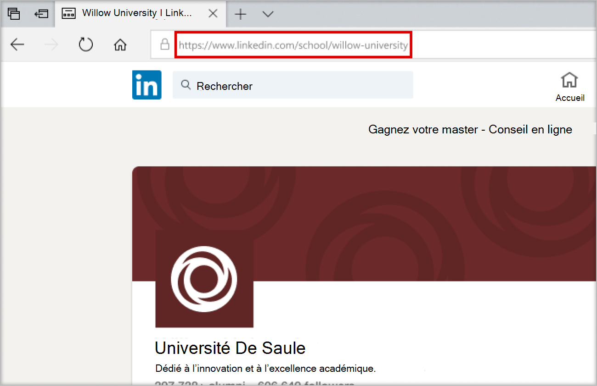

# Acheter, configurer et activer Career Coach pour Microsoft Teams

Career Coach est une application Microsoft Teams pour l'éducation optimisée par LinkedIn qui fournit des conseils personnalisés aux étudiants de l’enseignement supérieur pour naviguer dans leur parcours professionnel. Career Coach offre aux établissements d’enseignement une solution de carrière unifiée pour permettre aux étudiants de découvrir leur parcours professionnel, de développer des compétences réelles et de créer leur réseau en un seul endroit.

## Langues prises en charge

Career Coach est localisé dans les langues suivantes :

- Chinois (simplifié, Chine continentale)
- Chinois (traditionnel, Taïwan)
- Anglais (É.U.)
- Anglais (Royaume-Uni)
- Français (Canada)
- Français (France)
- Allemand (Deutschland)
- Japonais (Japon)
- Portugais (Brésil)
- Espagnol (Espagne)
- Espagnol (Mexique)

En savoir plus sur [Career Coach](https://aka.ms/career-coach).

> [!TIP]
> Utilisez les meilleures pratiques et les conseils utiles de ce guide pour activer les fonctionnalités de Career Coach pour les étudiants, les enseignants et le personnel. Consultez l’article [du Guide de planification rapide](https://support.microsoft.com/office/c5d0b934-bfcf-4fe7-8a85-ba7bbb1b6ad4) .

## Passer en revue les exigences

Pour activer Career Coach pour votre établissement d’enseignement, passez en revue ce dont vous avez besoin pour que Career Coach soit opérationnel.

### Exigences techniques

- Office 365 locataire avec Azure Active Directory avec les connexions de compte LinkedIn activées.
- Microsoft Teams.
- Page LinkedIn School.

### Données et fichiers de votre établissement d’enseignement

- Logo et éléments graphiques de l’établissement d’enseignement [au format requis](#brand-and-preferences).

- Données du catalogue de cours. [Afficher l’exemple de fichier](https://aka.ms/career-coach/docs/it-admins/sample-catalog) et [le format de document](#course-catalog-document-format-and-schema).

- Liste des domaines d’étude proposés. [Afficher l’exemple de fichier](https://aka.ms/career-coach/docs/it-admins/sample-fieldsofstudy).

- URL de la [page LinkedIn School](https://www.linkedin.com/help/linkedin/answer/40133/differences-between-a-linkedin-page-for-a-school-and-company?lang=en) de l’établissement d’enseignement.

- URL de la politique de confidentialité de l’établissement d’enseignement.

- Les établissements d’enseignement sont des liens vers des ressources liées à une carrière, telles qu’un site web de services de carrière et des offres d’emploi pour les étudiants (facultatif).

## Check-list d’installation

Pour préparer la publication de Career Coach pour votre locataire, plusieurs rôles d’administrateur sont nécessaires. Ces rôles et autorisations peuvent être attribués à une personne ou nécessiter une collaboration avec les professionnels de l’informatique de votre organisation. Utilisez ce guide pour identifier les personnes nécessaires pour effectuer les tâches nécessaires.

Vous pouvez vérifier les rôles attribués à votre compte en consultant le [Centre d'administration Microsoft 365 > Utilisateurs > Utilisateurs actifs](https://go.microsoft.com/fwlink/p/?linkid=834822) > Sélectionnez votre nom d’utilisateur pour confirmer votre rôle.

En savoir plus sur les [rôles d’administrateur dans le Centre d'administration Microsoft 365](/microsoft-365/admin/add-users/about-admin-roles).

### [Centre d'administration Microsoft 365](https://go.microsoft.com/fwlink/p/?linkid=2024339)

Rôle : Tâches [de l’entraîneur de carrière de l’administrateur général](/azure/active-directory/roles/permissions-reference#global-administrator) :

- [Acheter des licences](#purchase-career-coach-licenses)
- [Attribuer les licences](#assign-career-coach-licenses-to-users)

### [Centre d’administration Azure Active Directory](https://go.microsoft.com/fwlink/p/?linkid=2067268)

Rôle : Tâche [d’entraîneur de carrière administrateur général](/azure/active-directory/roles/permissions-reference#global-administrator) :

- [Activer les connexions de compte LinkedIn](#turn-on-linkedin-account-connections)

### [Centre d’administration Microsoft Teams](https://admin.teams.microsoft.com/dashboard)

Rôle : [Tâches de l’entraîneur de carrière de l’administrateur Teams](/azure/active-directory/roles/permissions-reference#teams-administrator) :

- [Ajouter Career Coach en tant qu’application installée](#add-career-coach-as-an-installed-app)
- [Configurer les paramètres de l’application Career Coach](#configure-career-coach-settings)
  - [Marque et préférences](#brand-and-preferences)  - obligatoire
  - [Connexion](#linkedin-connection)  LinkedIn - obligatoire
  - [Catalogue de cours](#course-catalog)  - obligatoire
  - [Champs d’étude](#fields-of-study)  - obligatoire
  - [Personnalisation](#customization) - facultatif
- [Stratégies d’installation](#setup-policies-and-pin-the-app)
- [Épingler l’application](#setup-policies-and-pin-the-app)

### Portail des développeurs LinkedIn

Rôle : Super Administration tâche d’entraîneur de carrière de [la page LinkedIn School](https://www.linkedin.com/help/linkedin/answer/a541981) :

- [Vérifier la page LinkedIn School](#verify-the-linkedin-school-page)

## Acheter des licences Career Coach

### Types de licences

Career Coach nécessite une licence pour accéder à l’application.

Deux types de licences sont disponibles.

- La **licence Étudiant** est conçue pour les étudiants.
- La **licence de faculté** est conçue pour les enseignants, le personnel et les professionnels de l’informatique impliqués dans le soutien aux étudiants avec Career Coach.

> [!IMPORTANT]
> Une licence Career Coach **Faculty** doit être attribuée à l’administrateur informatique qui effectue la configuration.

### Acheter des licences

Career Coach est disponible dans le monde entier (à l’exception de la Chine et de la Russie) pour les établissements d’enseignement supérieur qualifiés en tant que licence de module complémentaire via l’inscription pour les solutions éducation (EES), les fournisseurs de services cloud (CSP) et Centre d'administration Microsoft 365 (web direct).

En tant qu’application Microsoft Teams, le locataire doit avoir Microsoft 365 A3/A5 ou Office 365 A1/A3/A5 pour acheter la licence Career Coach du module complémentaire. Des licences distinctes sont proposées aux étudiants et aux enseignants.

### S’inscrire à un essai gratuit

Un essai gratuit standard de 90 jours est disponible pour 25 étudiants et 25 licences enseignants/membres du personnel. Un essai est disponible par locataire éligible. Les licences d’évaluation peuvent être activées à partir de Centre d'administration Microsoft 365 par les locataires qui sont qualifiés pour acheter Career Coach.

Pour l’activation de la version d’évaluation, connectez-vous [à Centre d'administration Microsoft 365 > services Billing > Purchase > recherchez Career Coach pour](https://go.microsoft.com/fwlink/p/?linkid=868433) trouver la version [d’évaluation des licences des étudiants](https://signup.microsoft.com/signup?OfferId=b3a40ff2-3d0d-481e-a0ed-f4de1069f201) et la [version d’évaluation des licences des enseignants](https://signup.microsoft.com/signup?OfferId=6f6e7db5-b9ab-4baa-86be-f13d0ae6a2c8).

## Préparer l’entraîneur de carrière

### Activer les connexions de compte LinkedIn

Il existe deux façons dont les connexions de compte LinkedIn sont utilisées par Career Coach.

- Pour permettre aux étudiants, aux enseignants et au personnel de connecter leur compte Microsoft 365 à leur compte LinkedIn et [d’envoyer des invitations LinkedIn à partir de Career Coach](https://support.microsoft.com/topic/career-coach-quick-start-guide-for-students-c419db47-9290-4961-9684-c3f86a9b3708#bkmk_connect_your_linkedin_account).
- Pour activer les fonctionnalités [Créer votre réseau](https://support.microsoft.com/topic/career-coach-quick-start-guide-for-students-c419db47-9290-4961-9684-c3f86a9b3708#bkmk_build_your_network) et [Explorer les carrières](https://support.microsoft.com/topic/career-coach-quick-start-guide-for-students-c419db47-9290-4961-9684-c3f86a9b3708#bkmk_discover_your_career_path) à l’aide des données d’anciens élèves publiques de LinkedIn.

1. Connectez-vous au [Centre d’administration Azure AD](https://go.microsoft.com/fwlink/p/?linkid=2067268) avec un [compte d’administrateur général](#setup-checklist) pour l’organisation Azure AD.

2. Sélectionnez **Utilisateurs**.

3. Dans la page **Utilisateurs** , sélectionnez **Paramètres utilisateur**.

4. Les **connexions de compte LinkedIn doivent être définies** sur **Oui** ou **le groupe Sélectionné** pour que Career Coach soit correctement configuré.

   - Sélectionnez **Oui** pour activer le service pour tous les utilisateurs de votre établissement d’enseignement.
   - Sélectionnez **Le groupe sélectionné** pour activer le service uniquement pour un groupe d’utilisateurs sélectionnés dans votre établissement d’enseignement.

Pour plus d’informations, consultez [Connexions de compte LinkedIn dans Azure Active Directory](/azure/active-directory/enterprise-users/linkedin-integration).

> [!NOTE]
> Aucune donnée n’est partagée sans le consentement de l’utilisateur.

### Autoriser les applications Microsoft dans Teams

Career Coach est une application Microsoft. Elle doit donc être autorisée dans les stratégies d’autorisation d’application Teams.

1. Connectez-vous au **[Centre d’administration Teams](https://admin.teams.microsoft.com)**.

2. Dans le volet de navigation de gauche, sélectionnez Stratégies **[d’autorisation des](https://admin.teams.microsoft.com/policies/manage-apps)** **applications** >  Teams.

3. Sélectionnez votre stratégie préférée.
    1. Si vous ne savez pas quelle stratégie utiliser, reportez-vous à la documentation  de gestion des stratégies [Microsoft Teams](policy-packages-edu.md)ou utilisez l’Assistant  Stratégie [Éducation](easy-policy-setup-edu.md)pour configurer une stratégie pour Microsoft Teams.

En savoir plus sur [la configuration des stratégies d’autorisation](teams-app-permission-policies.md).

### Ajouter Career Coach en tant qu’application installée

Cette étape garantit que Career Coach est correctement configuré pour votre organisation et que les étudiants trouvent Career Coach.

1. Connectez-vous au [Centre d’administration Teams](https://go.microsoft.com/fwlink/p/?linkid=2066851).

2. Sélectionnez les stratégies **d’installation des**  **applications** > Teams, puis sélectionnez votre stratégie préférée.
    1. Si vous ne savez pas quelle stratégie utiliser, reportez-vous à la documentation  de gestion des stratégies [Microsoft Teams](policy-packages-edu.md)ou utilisez l’Assistant  Stratégie [Éducation](easy-policy-setup-edu.md)pour configurer une stratégie pour Microsoft Teams.

3. Sous **Applications installées**, sélectionnez  **+ Ajouter des applications**.

4. Dans le volet **Ajouter des applications installées** , recherchez les applications que vous souhaitez installer automatiquement pour les utilisateurs lorsqu’ils démarrent Teams. Vous pouvez également filtrer les applications par stratégie d’autorisation d’application.

5. Une fois que vous avez choisi votre liste d’applications, sélectionnez **Ajouter**.

6. Sélectionnez  **Enregistrer** > **confirmer**.

> [!NOTE]
> La modification ou l’affectation d’une stratégie peut prendre quelques heures pour que les modifications prennent effet. Career Coach ne sera pas disponible dans Microsoft Teams tant que les modifications ne seront pas terminées.

## Configurer les paramètres de Career Coach

### Accéder aux paramètres de l’application Career Coach

Pour configurer les paramètres de Career Coach et les activer pour les utilisateurs, vous devez être administrateur général ou administrateur du service Teams pour accéder à la page.

1. Connectez-vous au [Centre d’administration Teams](https://go.microsoft.com/fwlink/p/?linkid=2066851).
2. Dans le volet de navigation de gauche, sélectionnez **Les applications** > Teams **gèrent les applications**.
3. Recherchez ou recherchez **Career Coach**.
4. Sélectionnez **Coach de carrière**, puis **Paramètres**.

### Catégories de configuration de Career Coach

Pour activer efficacement Career Coach pour les étudiants, les enseignants et le personnel, les paramètres suivants sont requis :

- [Marque et préférences](#brand-and-preferences)
- [Connexion LinkedIn](#linkedin-connection)
- [Catalogue de cours](#course-catalog)
- [Champs d’étude](#fields-of-study)

Vous pouvez également définir des paramètres [de personnalisation](#customization) facultatifs.

> [!TIP]
> Naviguez rapidement d’une catégorie à l’autre en sélectionnant le chemin d’accès de **l’entraîneur de carrière** situé en haut de la page au format `Manage apps\Career Coach\Setting label`.

### Marque et préférences

Personnalisez Career Coach pour qu’il corresponde à la marque de votre établissement d’enseignement. Vous êtes responsable du respect des droits d’autrui, y compris les droits d’auteur et de marque.

> [!IMPORTANT]
> Il s’agit d’une section obligatoire. Career Coach ne peut pas être activé sans **marque et préférences soumises** .

1. Connectez-vous au **[Centre d’administration Teams](https://go.microsoft.com/fwlink/p/?linkid=2066851)**.

2. Sélectionnez Applications **Teams** > **Gérer les paramètres****de Career Coach** > **des** >  applications  > **Modifier la marque et les préférences**.

3. Sous **Personnalisation**, ajoutez **le nom de l’organisation**.

4. Charger **l’icône Organisation**. L’icône est utilisée dans Career Coach pour identifier le contenu propre à votre établissement d’enseignement, les ressources du catalogue de cours dans l’application et dans la section expériences réelles du tableau de bord.

    L’icône est la mieux mise en forme comme suit :

    - Un PNG transparent
    - Proportion de 1:1
    - Taille maximale de 64 px x 64 px

5. Chargez **l’image miniature de contenu Learning**. La miniature sera utilisée pour les ressources d’apprentissage du catalogue de cours dans toute l’application lorsqu’une image spécifique n’est pas spécifiée pour un cours offert par votre établissement d’enseignement.

    La miniature est la mieux mise en forme comme suit :

    - Un PNG
    - Proportion de 16:9
    - Taille maximale de 360 px x 200 px

6. Ajoutez **l’URL de la stratégie de confidentialité de l’organisation**. S’il est ajouté, la politique de confidentialité de l’établissement sera disponible pour que les étudiants puissent passer en revue dans Career Coach.

7. Sélectionnez **Envoyer**.

8. Pour vérifier que les paramètres ont été envoyés avec succès, vérifiez [l’état de configuration de Career Coach](#configuration-status) pour **Terminer**.

### Connexion LinkedIn

Le paramètre de connexion LinkedIn connecte Career Coach aux données d’anciens élèves publiques de la page LinkedIn School de votre établissement.

Cette étape ne peut être effectuée que si [les connexions de compte LinkedIn sont activées dans Azure Active Directory](#turn-on-linkedin-account-connections). Le paramètre de connexion LinkedIn active les fonctionnalités [Créer votre réseau](https://support.microsoft.com/topic/career-coach-quick-start-guide-for-students-c419db47-9290-4961-9684-c3f86a9b3708#bkmk_build_your_network) et [Explorer les carrières](https://support.microsoft.com/topic/career-coach-quick-start-guide-for-students-c419db47-9290-4961-9684-c3f86a9b3708#bkmk_discover_your_career_path) .

> [!IMPORTANT]
> Il s’agit d’une section obligatoire. Career Coach ne peut pas être activé sans vérification de la connexion LinkedIn School Page.

#### Ajouter l’URL de la page LinkedIn School

Le processus d’ajout de l’URL de la page LinkedIn School est géré par un administrateur Teams. L’étape suivante de vérification de l’URL est effectuée par le super administrateur LinkedIn School Page de votre établissement d’enseignement.

1. Connectez-vous au **[Centre d’administration Teams](https://go.microsoft.com/fwlink/p/?linkid=2066851)**.

2. Sélectionnez Les **applications** >  Teams **gèrent** la **connexion LinkedIn** **des paramètres****de Career Coach** >  des  >  applications > .

3. Sélectionnez **Se connecter à LinkedIn**.

4. Recherchez la page LinkedIn School de votre établissement en effectuant une recherche sur LinkedIn et en sélectionnant le filtre **École** . Ou communiquez avec un membre du personnel marketing de votre établissement pour déterminer la page LinkedIn School correcte à utiliser. Pour plus d’informations, consultez [Comment identifier les pages LinkedIn](https://www.linkedin.com/help/linkedin/answer/40133/differences-between-a-linkedin-page-for-a-school-and-company?lang=en).

    

5. Ajoutez l’URL de la **page LinkedIn School**. L’URL doit être une *page scolaire*, et non une *page d’entreprise*, et est généralement mise en forme en tant que `https://www.linkedin.com/school/willow-university/`.

   

6. Sélectionnez **Envoyer**.

7. Une fois l’URL de la **page LinkedIn School** envoyée, la page paramètres est mise à jour pour afficher le  **lien** Vérification et  **l’expiration du lien vérification**. Le lien de vérification expire après 30 jours.

8. Copiez le **lien Vérification** et partagez-le avec le super administrateur LinkedIn School Page de votre établissement d’enseignement.

9. Le super administrateur de la page LinkedIn School utilisera le lien de vérification unique pour [vérifier la page LinkedIn School](#verify-the-linkedin-school-page) et l’associer à Career Coach.

10. Pour confirmer que la vérification et les paramètres ont été envoyés avec succès, vérifiez que [l’état de configuration de Career Coach](#configuration-status) est marqué **Terminé**.

#### Vérifier la page LinkedIn School

La vérification de la page LinkedIn School doit être effectuée par le [super administrateur de la page LinkedIn School](https://www.linkedin.com/help/linkedin/answer/a541981) de votre établissement d’enseignement.

Vous pouvez vérifier les rôles d’administrateur de votre compte LinkedIn en vous connectant à LinkedIn et en visitant la page LinkedIn School de votre établissement d’enseignement. Si un rôle d’administrateur super est attribué à votre compte, **l’affichage Super administrateur** apparaît en regard du nom de votre établissement d’enseignement sur la page LinkedIn. Si vous ne voyez pas la balise **d’affichage Super administrateur** , vous n’êtes pas un super administrateur pour la page de votre établissement scolaire.

1. Une fois l’URL de la **page LinkedIn School** envoyée par l’administrateur Teams, la page affiche le **lien Vérification** et **l’expiration du lien Vérification**. Le lien de vérification expire après 30 jours.

     

2. Copiez le lien de vérification et partagez-le avec votre super administrateur LinkedIn School Page.

3. Le super administrateur de la page LinkedIn ouvre le lien de vérification pour associer Career Coach à la page de votre établissement scolaire. Pour plus d’informations, consultez [la documentation supplémentaire sur la vérification de page LinkedIn](https://www.linkedin.com/help/linkedin/answer/102672).

4. Une fois la vérification terminée, l’administrateur Teams peut voir si les paramètres ont été envoyés avec succès en vérifiant si [l’état de configuration de Career Coach](#configuration-status) est marqué **Terminé**.

   

### Catalogue de cours

Le catalogue de cours enregistre les cours et les cours offerts par votre établissement d’enseignement.

Career Coach utilise les données du catalogue de cours pour identifier les compétences d’un étudiant à partir de sa transcription et suggérer des cours à suivre.

> [!IMPORTANT]
> Il s’agit d’une section obligatoire. Career Coach ne peut pas être activé sans un catalogue de cours.

Ces cours sont utilisés dans Career Coach dans deux domaines :

- Les cours sont renvoyés dans le cadre des [ressources d’apprentissage](https://support.microsoft.com/topic/career-coach-quick-start-guide-for-students-c419db47-9290-4961-9684-c3f86a9b3708#bkmk_grow_real_world_skills).  

- Les cours et les métadonnées de cours, tels que les titres et descriptions des cours, sont utilisés pour aider les étudiants à identifier leurs compétences lorsqu’ils [chargent une transcription](https://support.microsoft.com/topic/career-coach-quick-start-guide-for-students-c419db47-9290-4961-9684-c3f86a9b3708#bkmk_Set_up_your_profile).

Pour créer le catalogue de cours, créez une liste de tous les cours dispensés dans votre établissement d’enseignement et chargez-le en tant que fichier CSV à l’aide du [format et du schéma du document du catalogue de cours](#course-catalog-document-format-and-schema).

> [!TIP]
> Commencez par l’exemple de document [de catalogue](https://aka.ms/career-coach/docs/it-admins/sample-catalog) de cours pour garantir une mise en forme appropriée.Vous pouvez également référencer le [format de document du catalogue de cours et les sections de schéma](#course-catalog-document-format-and-schema) pour plus d’informations sur les champs requis et recommandés.

#### Ajouter le catalogue de cours

1. Connectez-vous au **[Centre d’administration Teams](https://go.microsoft.com/fwlink/p/?linkid=2066851)**.

2. Sélectionnez Les **applications** >  Teams **gèrent les applications** >**catalogue de cours** des **paramètres** >  de **l’entraîneur** >  de carrière de recherche.

3. Sélectionnez **Télécharger le catalogue de cours** > Charger des cours au format CSV avec les colonnes requises : courseId, title et sourceLink.
    1. Chaque ligne doit inclure des données pour chacune des colonnes requises.
    1. *L’inclusion des champs recommandés améliore l’expérience des étudiants en retournant de meilleurs résultats de recherche et une meilleure identification des compétences.*

4. Un aperçu d’une section du catalogue de cours chargé s’affiche pour votre référence.

5. Sélectionnez **Envoyer** quand vous êtes prêt.

6. [L’état du document chargé](#course-catalog-status) s’affiche dans la page des paramètres.

7. Pour vérifier que les paramètres ont été envoyés avec succès, vérifiez que [l’état de configuration de Career Coach](#configuration-status) est marqué **Terminé**.

> [!TIP]
> Pour charger un nouveau fichier, assurez-vous que le dernier fichier est effacé en sélectionnant (X) pour fermer l’aperçu du document. Cette action permet au bouton **Charger** de s’afficher à nouveau.

#### Format et schéma du document du catalogue de cours

Le document doit être au format CSV avec une taille maximale de 18 Mo. Les fichiers volumineux doivent être divisés en plusieurs fichiers plus petits qui incluent un maximum de 15 000 lignes pour un traitement réussi.

Le document doit contenir les métadonnées de cours requises : **titre du cours**,  **ID de cours** et  **URL du cours**.

> [!TIP]
> Commencez par l’exemple de document [de catalogue de cours]( https://aka.ms/career-coach/docs/it-admins/sample-catalog) pour garantir une mise en forme appropriée. *L’inclusion des champs recommandés améliore l’expérience des étudiants en retournant de meilleurs résultats de recherche et une meilleure identification des compétences.*

Le tableau suivant présente les éléments à inclure dans le catalogue de cours :

| Nom             | Statut      | Type   | Description                                                                    |
|------------------|-------------|--------|--------------------------------------------------------------------------------|
| courseId         | Obligatoire    | String | Le courseId correspond à ce qui est généré dans la transcription de l’étudiant.             |
| Titre            | Obligatoire    | String | Titre du cours.                                                              |
| sourceLink       | Obligatoire    | URL    | Lien vers la page du cours pour en savoir plus sur le cours et le programme.   |
| Description      | Recommandation | String | Texte d’introduction pour le cours qui décrit les objectifs d’apprentissage.       |
| language         | Recommandation | String | Langue du cours. Utilisez des codes de langue standard.                           |
| Format           | Recommandation | String | Mode d’enseignement (en ligne, vidéo, en personne).                                   |
| thumbnailLink    | Recommandation | URL    | Lien miniature vers l’image du cours.                                            |
| thumbnailAltText | Recommandation | String | Texte de remplacement d’accessibilité pour l’image                                           |
| educationLevel   | Recommandation | String | Niveau d’étude, par exemple. Premier cycle/diplômé.                                       |
| Sujets           | Recommandation | String | Rubriques ou balises associées aux compétences que les cours enseignent.          |

### État du catalogue de cours

L’état du catalogue de cours s’affiche sur la page Paramètres du catalogue de cours une fois qu’un document a été chargé, fournissant des détails sur le chargement et l’état de traitement du document.

Pendant le traitement, Career Coach analyse votre document à la recherche de doublons, normalise et enrichit votre catalogue en extrayant les compétences des titres et des descriptions, et le stocke pour l’utiliser sur la page Learn et pendant le chargement de la transcription des étudiants pour l’identification des compétences.

| Colonne           | Valeur     | Description%                                                                                        |
| ---------------- | --------- | -------------------------------------------------------------------------------------------------- |
| Heure de chargement    | Timestamp | Date et heure aux laquelle un administrateur informatique a chargé un document.                                                     |
| Heure terminée   | Timestamp | Date et heure de traitement complet du document.                                               |
| Cours chargés | Entier   | Nombre de cours trouvés dans le document.                                                           |
| État de l’ingestion | Pending   | Document en file d’attente pour traitement.                                                                  |
| État de l’ingestion | Exécution   | Le document est actuellement traité. Ce processus peut prendre jusqu’à 6 heures en fonction de la taille de votre document. |
| État de l’ingestion | Opération réussie   | Le processus d’ingestion est terminé et des cours seront disponibles dans Career Coach une fois que tous les paramètres requis seront configurés. |
| État de l’ingestion | Échoué    | Vérifiez le format du document et rechargez-le.                                                           |
| Doublons       | Entier   | Nombre de cours en double trouvés dans le document.                                                 |

> [!NOTE]
> Si une colonne de l’état du catalogue de cours est vide, le document est en cours de traitement et ces valeurs ne sont pas disponibles. Ce processus peut prendre jusqu’à 6 heures en fonction de la taille de votre catalogue. Une fois le document traité, les valeurs sont remplies. Vous pouvez actualiser la page pour rechercher les mises à jour.

### Champs d’étude

Les champs d’étude sont synonymes de grands domaines d’intérêt, d’études universitaires majeures et de programmes de diplômes. Ces champs d’études sont référencés par les étudiants lorsqu’ils commencent à utiliser Career Coach et commencent à configurer leur profil personnalisé.

La liste des champs permet aux étudiants de découvrir des champs d’études susceptibles de les intéresser et d’ajouter leur orientation académique planifiée à leur profil dans l’entraîneur de carrière.

> [!IMPORTANT]
> Il s’agit d’une section obligatoire. Career Coach ne peut pas être activé sans une liste de domaines d’études.
>
> Ajouter tous les champs d’études disponibles pour les étudiants tels que l’ingénierie, l’anglais, les affaires, etc.

#### Ajouter les champs d’étude

1. Connectez-vous au **[Centre d’administration Teams](https://go.microsoft.com/fwlink/p/?linkid=2066851)**.

2. Sélectionnez Les **applications** >  Teams **gèrent les applications** > les champs d’étude des **paramètres** >   de **l’entraîneur** > **de carrière de recherche**.

3. Sélectionnez **Charger** pour charger les champs du fichier d’étude au format CSV. Un aperçu des champs du document d’étude s’affiche.

4. Sélectionnez **Envoyer**.

5. Pour confirmer que les paramètres ont été envoyés avec succès, vérifiez que [l’état de configuration de Career Coach](#configuration-status) est marqué **Terminé**.

#### Champs de format et de schéma de document d’étude

Le document doit être au format CSV avec une taille maximale de 18 Mo. Le document doit contenir les métadonnées requises : **Nom du champ d’étude**.

Le tableau suivant présente les éléments à inclure dans les champs d’étude :

| Nom          | Statut   | Type   | Description                    |
|---------------|----------|--------|--------------------------------|
| fieldsOfStudy | Obligatoire | String | Nom du domaine d’étude |

### Personnalisation

Le paramètre de personnalisation prend en charge l’ajout de possibilités d’acquérir des expériences réelles dans le tableau de bord que votre établissement d’enseignement offre aux étudiants.

Les liens recommandés à inclure sont ceux qui aident les étudiants à acquérir une expérience réelle, comme les conseils d’emploi, les événements, le bureau des services de carrière, les événements liés à la carrière et les clubs d’étudiants.

1. Connectez-vous au **[Centre d’administration Teams](https://go.microsoft.com/fwlink/p/?linkid=2066851)**.

2. Sélectionnez Les **applications** >  Teams **gèrent les applications** >**paramètres** de **l’entraîneur** >  de carrière de recherche.

3. Sélectionnez **Personnaliser l’expérience** > **+ Ajouter**

4. Ajoutez chaque **titre**, **URL** et **description d’info-bulle** > Sélectionnez **Appliquer**.

5. Un aperçu des informations ajoutées s’affiche.

6. Sélectionnez **Envoyer**.

## Statut des paramètres de l’entraîneur de carrière

La page paramètres de Career Coach dans le Centre d’administration Teams fournit un résumé de l’état des étapes incomplètes, en attente, terminées et ayant échoué pour la configuration de Career Coach.

Le message d’état peut vous aider à déterminer si Career Coach est correctement configuré et prêt à être publié sur votre locataire.

### État de la configuration

La section État de configuration de la page paramètres de l’application affiche l’état en temps réel à l’aide de la légende suivante.

| Catégorie                    | Statut                                        | Description                                                 |
| --------------------------- | --------------------------------------------- | ----------------------------------------------------------- |
| État de l’approvisionnement du service | Career Coach initialise votre locataire.     | L’approvisionnement de service se produit automatiquement lors de l’accès à la page des paramètres de Career Coach. Les modifications de configuration ne seront pas acceptées tant que l’installation initiale n’est pas terminée. La durée estimée de l’approvisionnement du service est de 15 minutes maximum. |
| État de l’approvisionnement du service | Career Coach est prêt à être configuré.       | La page paramètres de Career Coach est prête pour que l’administrateur informatique envoie les paramètres. |
| Marque et préférences       | Non démarré                                   | Les paramètres doivent être envoyés. |
| Marque et préférences       | Manquant : icône d’apprentissage                        | Chargez l’image miniature de contenu d’apprentissage manquante. |
| Marque et préférences       | Manquant : Logo                                 | Chargez l’icône d’organisation manquante. |
| Marque et préférences       | Manquant : nom de l’établissement                     | Chargez le nom de l’organisation manquante. |
| Marque et préférences       | Complet                                      | Aucune autre action n’est nécessaire. Le paramètre est terminé. |
| Chargement du catalogue de cours       | Non démarré                                   | Le catalogue de cours CSV doit être soumis. |
| Chargement du catalogue de cours       | Manquant : chargement d’un catalogue de cours réussi   | Vérifiez l’état du catalogue de cours pour plus d’informations sur le traitement du catalogue de cours. |
| Chargement du catalogue de cours       | Complet                                      | Aucune autre action n’est nécessaire. Le paramètre est terminé. |
| Connexion à l’école LinkedIn  | Non démarré                                   | L’URL de la page LinkedIn School doit être envoyée. |
| Connexion à l’école LinkedIn  | Manquant : URL de la page LinkedIn School approuvée | En attente de l’approbation de la vérification du super administrateur linkedIn School Page. |
| Connexion à l’école LinkedIn  | Complet                                      | Aucune autre action n’est nécessaire. Le paramètre est terminé. |
| Champs de chargement d’études      | Non démarré                                   | Le champ d’étude CSV doit être soumis. |
| Champs de chargement d’études      | Manquant : zones d’intérêt                    | Vérifiez si le chargement du champ d’étude a réussi. |
| Champs de chargement d’études      | Complet                                      | Aucune autre action n’est nécessaire. Le paramètre est terminé. |

> [!NOTE]
> Une fois que toutes les étapes requises sont marquées comme terminées, Career Coach peut être correctement publié sur votre locataire.

## Mettre Career Coach à la disposition de votre organisation

À ce stade, Career Coach a été configuré pour votre organisation.

Ensuite, suivez ces étapes pour vous assurer que Career Coach est disponible pour votre organisation dans Microsoft Teams.

### Attribuer des licences Career Coach aux utilisateurs

Pour obtenir des instructions pas à pas, consultez [Affecter des licences aux utilisateurs](/microsoft-365/admin/manage/assign-licenses-to-users).

### Configurer des stratégies et épingler l’application

L’épinglage de Career Coach l’ajoutera au rail gauche de la fenêtre Microsoft Teams pour le rendre plus accessible et plus visible pour les étudiants. Si vous préférez épingler Career Coach à un sous-ensemble de vos utilisateurs, vous devez implémenter une [stratégie d’installation](teams-app-setup-policies.md) avec ce groupe inclus.

1. Connectez-vous au **[Centre d’administration Teams](https://go.microsoft.com/fwlink/p/?linkid=2066851)**.

2. Sélectionnez les **stratégies d’installation des** **applications** >  Teams et sélectionnez votre stratégie préférée.

    Si vous ne savez pas quelle stratégie utiliser, reportez-vous à la documentation de gestion des stratégies [Microsoft Teams](policy-packages-edu.md) ou utilisez l’Assistant Stratégie [Éducation](easy-policy-setup-edu.md) pour configurer une stratégie pour Microsoft Teams.

3. Sous **Applications épinglées**, choisissez **Ajouter des applications**.

4. Sélectionnez votre stratégie préférée sous **Rechercher en fonction de cette stratégie d’autorisation d’application**.

5. Recherchez **Career Coach** sous **Rechercher par nom**, puis sélectionnez  **Ajouter** >  pour fermer le volet.

6. Choisissez l’ordre d’apparition de l’application, puis **sélectionnez Confirmer**.

> [!NOTE]
> Les étudiants seront avertis dans Microsoft Teams que Career Coach a été épinglé.

## Accessibilité dans Career Coach

Career Coach a la responsabilité de créer une expérience accessible à tous les utilisateurs. Career Coach est conforme à WCAG 2.1 A, AA et AAA et adopte toutes les normes d’accessibilité globales.

Les fonctionnalités d’accessibilité de Career Coach sont les suivantes :

- Structure de titre logique et indicateurs de focus clairs pour prendre en charge la navigation par la souris, le clavier ou la voix.
- Ignorez les liens pour permettre aux utilisateurs d’accéder plus rapidement aux fonctionnalités importantes.
- Texte clair et concis pour simplifier la lecture et la compréhension de Career Coach pour tous les utilisateurs.
- Contraste de couleur avec les modes contraste foncé et contraste élevé pour différents besoins et préférences.
- Expérience utilisateur de taille appropriée qui est vérifiée sur tous les formats (PC, Mac, Android et iPhone) à l’aide des [testeurs approuvés de la section 508](https://www.dhs.gov/trusted-tester).

## Résolution des problèmes

### Données de configuration requises manquantes

Si vous voyez « Career Coach est en cours de configuration pour que vous l’utilisiez bientôt » dans l’expérience Coach de carrière, **toutes les données de configuration requises n’ont pas été ajoutées**.

Les **sections suivantes doivent être complétées** avant que Career Coach puisse être utilisé :

- [Marque et préférences](#brand-and-preferences)
- [Connexion LinkedIn](#linkedin-connection)
- [Catalogue de cours](#course-catalog)
- [Champs d’étude](#fields-of-study)

Référencez [l’état de configuration de Career Coach](#configuration-status) pour voir quels paramètres doivent être complétés.

### Mise en forme incorrecte du catalogue course ou des champs de données d’étude

Les CSV pour le catalogue de cours et le champ d’étude ont des formats requis et une taille maximale de 18 Mo.

Référencez le [schéma de document du catalogue de cours](#course-catalog-document-format-and-schema) Career Coach et les champs Career Coach [du schéma du document d’étude](#fields-of-study-document-format-and-schema) pour garantir une configuration appropriée.

En outre, un fichier catalogue de cours ne doit pas comporter plus de 15 000 lignes pour garantir un traitement réussi.

### Champs manquants dans les pages de paramètres de l’entraîneur de carrière

Les pages des paramètres de l’entraîneur de carrière ont des champs obligatoires. Si les champs nécessaires ne sont pas terminés, la page n’est pas envoyée.

Vous ne verrez peut-être pas de message d’avertissement; la page ne sera pas envoyée.

La soumission réussit lorsque vous voyez une bannière verte en haut de la page.

### Les modifications apportées à la stratégie d’installation ne sont pas terminées

Si Career Coach n’apparaît pas dans Microsoft Teams pour les utilisateurs, les modifications apportées à la stratégie d’installation n’ont peut-être pas encore pris effet. Career Coach ne sera pas installé et épinglé pour les utilisateurs dans Microsoft Teams tant que les modifications apportées à la stratégie d’installation n’entreront pas en vigueur. L’application des modifications de stratégie peut prendre quelques heures.

Toutefois, Career Coach peut être installé directement à partir de l’App Store Microsoft Teams.

- Si les utilisateurs ne parviennent pas à trouver Career Coach dans l’App Store Microsoft Teams, passez en revue les stratégies d’autorisation de votre application et assurez-vous que Career Coach n’est pas une application bloquée.
- Career Coach est une application Microsoft, et il est recommandé d’autoriser les applications Microsoft par des stratégies d’autorisation. En savoir plus sur [la configuration des stratégies d’autorisation](teams-app-permission-policies.md).

### L’initialisation de Career Coach n’est pas terminée

Vous pouvez rencontrer l’erreur suivante : « Nous ne pouvons pas récupérer les paramètres de l’application. Réessayez. Si vous continuez à avoir des problèmes, contactez le support technique Microsoft. »

Vérifiez **l’état de Service Provisioning** dans la page paramètres de Career Coach.

Si votre locataire est toujours initialisé, patientez 15 minutes, puis réessayez. Ouvrez un ticket de support si vous recevez toujours l’erreur.

## Ressources

Les ressources suivantes vous aideront à planifier votre implémentation de Career Coach avec Microsoft Teams.

- [Guide de planification rapide de Career Coach](https://support.microsoft.com/topic/career-coach-quick-planning-guide-c5d0b934-bfcf-4fe7-8a85-ba7bbb1b6ad4)
- [Guide de démarrage rapide de Career Coach pour les étudiants](https://support.microsoft.com/topic/career-coach-quick-start-guide-for-students-c419db47-9290-4961-9684-c3f86a9b3708)
- [Impliquer les étudiants avec des plans de cours d’entraîneur de carrière](https://support.microsoft.com/topic/get-started-with-career-coach-goals-and-activities-086ce412-05de-4259-a9fd-c96471cef1b0?preview=true)
- [Bienvenue dans Microsoft Teams](Teams-overview.md)
- [Comment déployer Teams](get-started-with-teams-resources-for-org-wide-rollout.md?tabs=SmallBusiness)
- [Présentation des équipes et des canaux dans Microsoft Teams](teams-channels-overview.md)
- [Gestion des applications dans le Centre d’administration Microsoft Teams](manage-apps.md)
- [Prise en main de la formation d’administrateur pour Microsoft Teams](ITAdmin-readiness.md)
- [Résolution des problèmes de Teams](/microsoftteams/troubleshoot/teams-welcome)
- [Gérer les stratégies d’autorisation d’application dans Microsoft Teams](teams-app-permission-policies.md)
